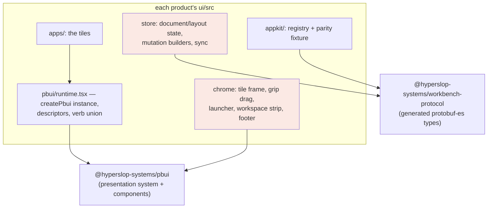

# Intern guide: the family duplication map and the extraction into pbui

Three products — datalab (via the `datalab-ui` package in this repository), agentlogic, and turboproof — are built on pbui's presentation system and are meant to share one look, one window chrome, and one set of interaction mechanics. Today they achieve that by carrying private copies of the same code: the same stylesheet block transcribed three times, the same drag hit-test written three times with three different constants, the same mutation builders copied file-for-file. This ticket moves the shared parts into the two packages this repository publishes — `@hyperslop-systems/pbui` and `@hyperslop-systems/workbench-protocol` — so that "the same" stops being a discipline and becomes an import.

The forcing incident is worth knowing before any code. On 2026-07-31, turboproof shipped with pbui's presentation system fully wired and fully invisible: the product had never ported the `[data-part]` stylesheet block, so the object menu — which pbui renders as structure and expects the product to position — rendered in normal document flow at the bottom of the page. Every mechanical check passed, because accessibility trees and synthetic clicks do not measure geometry. A user's visual report ("the menu appears underneath the status bar") was the only diagnostic that worked. Forgetting a required private copy does not fail the build; it silently disables the interaction layer. That is the cost profile this ticket eliminates.

## 1. Executive summary

- Eleven capabilities are duplicated across the three products. They fall into three architectural homes: **pbui** (pure functions of pbui's own state, and stylesheets for pbui's own `data-part` hooks), a new **workbench UI layer** beside the protocol package (pure functions of `WorkbenchDocument`, plus the components that render protocol nodes), and **product code** (verb vocabularies, descriptors, tiles — the things that genuinely differ).
- The extraction is ordered by danger-per-cost. Phase 1 ships the presentation-parts CSS and the two footer/banner components inside pbui — small, pure, and the proven silent-failure risk. Phase 2 ships the chrome kit (tile frame, drag/dock, shortcut routing, launcher shell). Phase 3 ships the TypeScript mutation layer next to the protocol types. Phase 4 migrates the three products onto the shared modules and deletes the copies.
- One structural asymmetry constrains everything: agentlogic and turboproof hold pbui's `WorkbenchDocument` protobuf directly (DR-31), while datalab-ui still runs its own `layout` store with a private `Node` type. Phase 2 is therefore designed to be **document-model-agnostic** (components take callbacks and DOM ids, never a document), so datalab adopts the chrome now and the document layer whenever its own migration lands.

## 2. The system you are joining

Read this section even if you know one of the products; the point is how the four repositories relate.

**The pbui package** (`src/` in this repository, published as `@hyperslop-systems/pbui`) has two halves. The presentation half (`src/presentation/`) is the interesting one: `createPbui<Values, Environment, Verb>()` takes a registry of descriptors and returns a `Provider`, a `Presentation` component, an `ObjectMenu`, and a `usePbui` hook. Every interactive object in a product is a `Presentation` wrapping a value; descriptors say how to label it, describe it, and which serializable verbs it offers; one product-level `perform` callback interprets the verbs. The component half (`src/components/`) is a set of atoms and molecules (`Button`, `Chip`, `TextInput`, `Dialog`, `IconButton`, …) with their own shipped stylesheet.

The contract that matters for this ticket: **pbui's presentation components emit structure, not style.** `Presentation` renders with `data-part="presentation"` and `data-ptype`; `ObjectMenu` renders `data-part="menu"`, `menu-header`, `menu-item`, `menu-reason`. The shipped CSS (`dist/components.css`) styles the component half only — Dialog and Inspector parts — and deliberately styles none of the presentation parts. Each product owns those. This is the same philosophy as the design tokens (pbui reads `--pbui-*` custom properties and defines none of them), and it has the same failure mode when a product forgets its half of the bargain.

**The three products** each assemble the same stack:



The two red boxes are this ticket: today their contents are per-product copies; afterwards they are mostly imports.

**The document-model asymmetry.** agentlogic and turboproof hold the protocol's `WorkbenchDocument` directly in Redux (decision DR-31): verbs become protocol `Mutation`s, a local applier mirrors the Go applier in `pkg/workbench/mutation.go`, and an outbox syncs mutations to the server with 409-rebase recovery. datalab-ui predates that decision and still runs `store/layout.ts` with its own `Node`/`ViewId` types and reducer verbs (`splitLeaf`, `swapTiles`, `dockTile`). The alignment of datalab onto the protocol is a separate, ongoing effort; this ticket must neither wait for it nor make it harder. That constraint decides Phase 2's API shape (§5.2).

## 3. The duplication map

The inventory, with the exact files. "Variant" means independently written to the same design; "copy" means transcribed; "port" means transcribed with renames. Drift is not hypothetical — row 5's zone geometry already disagrees between products.

| # | Capability | datalab-ui | agentlogic | turboproof | Kind |
|---|---|---|---|---|---|
| 1 | Presentation-parts CSS: `[data-part=presentation]` hover ring + selected wash, `acceptable` pulse + reduced-motion fallback, `[data-part=menu]` fixed positioning, sticky header, item states | `src/pbui/pbui.module.css` (182 lines, reference copy) | inside `ui/src/styles/app.css` | inside `ui/src/styles/app.css` (ported 2026-07-31 after the incident) | copy ×3 |
| 2 | MouseDocLine: inverted Genera footer, READY/ACCEPT MODE word, hover doc, `aria-live` mirror, ambient slot | `src/pbui/MouseDocLine.tsx` (38 lines) | variant in `Chrome.tsx` | port in `components/organisms/Chrome.tsx` | copy |
| 3 | AcceptBanner | `src/pbui/AcceptBanner.tsx` (54 lines) | variant | variant (styling diverges: Surface tone vs red banner) | variant ×3 |
| 4 | Tile frame: tone-as-title-bar (DR-26), ⠿ grip, title slot, split ⬌/⬍ + close ✕ IconButtons, canClose from leaf count | `organisms/Tile/Tile.tsx` + `Tile.module.css` | `Frame` in `organisms/Tile.tsx` | `organisms/Tile.tsx` | variant ×3 |
| 5 | Drag/swap/dock: registry or DOM hit-test, zone classification, labeled drop overlay, swap-vs-dock dispatch | `Tile/useDrag.ts` — module-level `TILES` registry, `zoneFor` with a 30 %-of-min-dimension band capped at 110 px | imperative `elementsFromPoint` walk, 25 % quarters | same as agentlogic, overlay restyled to datalab's | **drifted** ×3 |
| 6 | Launcher: Mod+K modal, search over views/apps, keyboard loop with wrap, never-destroy-a-working-tile placement, split along the longer rendered axis, Escape owned by Dialog alone | `organisms/LauncherDialog/` + `ViewSwitcher/` models (query language, workspace scoping, stages, audiences) | absent | right-sized port (`organisms/LauncherDialog.tsx`, `model/launcherSearch.ts`) | port, policy diverges |
| 7 | Shortcut routing: `isModKey` (Meta on Apple, Ctrl elsewhere), `isEditableTarget`, transient-surface blocking | `pages/Workbench/shortcutRouting.ts` — pure, tested | absent | simplified inline copy in `LauncherShortcut` | copy |
| 8 | Split-tree renderer: divider drag with local preview and one committed resize, keyboard-operable dividers, snap ratios | `organisms/SplitView/` (own Node type) | `NodeView`/`SplitView` over protocol nodes | `organisms/NodeView.tsx` (from agentlogic) | variant ×3 |
| 9 | Mutation builders: `splitPlacement`, `closePlacement`, `swapPlacements`, `dockPlacement`, `resizeSplit`, `snapRatio`, `replaceApp`, `linkViewIntoPlacement`, `splitWithApp` | reducer equivalents over the layout store | `store/workbench.ts` | copied from agentlogic + extended | copy (agentlogic↔turboproof) |
| 10 | Local applier + outbox sync: apply-then-queue, DocumentPut coalescing, 409 → rebase → outbox replay, SSE revision stream | layout/world stores (different model) | `slice.ts` + sync layer | `store/slice.ts` + `store/sync.tsx` | copy (agentlogic↔turboproof) |
| 11 | App registry: side-effect registration, `appFor`/`allApps`, registry↔Go-catalog parity fixture | `appkit/` | `appkit/` | `appkit/` | variant ×3 |
| 12 | The runtime file: one `createPbui` call binding descriptors, re-exporting under product names | `src/pbui/runtime.tsx` | `pbui/runtime.tsx` | `pbui/runtime.tsx` | pattern (stays per-product) |

Row 12 is listed to say explicitly that it does NOT move: the descriptor map and verb union are the product. Everything that moves is below the descriptor line.

## 4. Design decisions

**DR-U1 — The presentation-parts CSS ships inside the pbui package as an optional import.**
*Context:* pbui deliberately ships no styling for its presentation parts, on the theory that products own their look. Three products have now transcribed the identical block, and one shipped without it, invisibly. *Options:* (a) keep the convention and add a lint/check; (b) ship a default `presentation-parts.css` that products import explicitly; (c) inline the styles into the components. *Decision:* (b). An explicit import keeps the opt-out (a product with a genuinely different menu look imports nothing and writes its own), while making the default a one-liner instead of a 182-line transcription. (c) is rejected because inline styles would end the `data-part` restyling contract entirely; (a) is rejected because the check would have to exist in every product repo — the same distributed-discipline problem in a new costume. *Consequences:* the block must be written against tokens with fallbacks, since pbui defines no token values; `main.tsx` import order docs in each product gain one line. *Status:* proposed.

**DR-U2 — MouseDocLine and AcceptBanner become pbui components created by `createPbui`.**
*Context:* both are pure functions of pbui instance state (`mouseDoc`, `accepting`) plus one prop, but they call the product's `usePbui`, which is instance-bound. *Options:* (a) export standalone components taking the context value as a prop; (b) return them from `createPbui()` beside `ObjectMenu`, closing over the instance. *Decision:* (b) — `ObjectMenu` already establishes the pattern; the products' runtime files re-export them exactly as they re-export `ObjectMenu` today. *Consequences:* the pbui instance type grows two members; the products delete ~90 lines each; the banner's look unifies on datalab's (red strip, kbd styling), which is a deliberate visual change for agentlogic and turboproof. *Status:* proposed.

**DR-U3 — The chrome kit is document-model-agnostic.**
*Context:* the tile frame, the drag/dock machinery, and the launcher shell must serve datalab (layout store) and agentlogic/turboproof (protocol document) without waiting for datalab's migration. *Decision:* the extracted components never see a document. `TileFrame` takes `{placementId, title, tone, canClose, onSplit(direction), onClose, gripHandlers, children}` and a title slot (the product wraps its own `<tile>` Presentation there). `useTileDrag` takes `{id, register, onSwap(a,b), onDock(from,to,zone)}` and owns only the registry, the hit test, the zone classification, and the overlay painting. The launcher shell takes a rows model and `onChoose(row)` and owns only the modal, the search input, the keyboard loop, and the Escape rule. *Consequences:* each product keeps a thin adapter (a `perform` call or a dispatch) per callback — about ten lines — and the shared code has no Redux, no protocol import, and no store opinion. *Status:* proposed.

**DR-U4 — Zone geometry unifies on datalab's banded `zoneFor`.**
*Context:* datalab classifies drop zones with a band of 30 % of the smaller dimension capped at 110 px; agentlogic and turboproof use fixed 25 % quarters. The banded version keeps a generous center on large tiles and reachable edges on small ones, and its comment traces to the original pbui-gog prototype. *Decision:* the extracted `zoneFor` is datalab's, exported and unit-tested; the quarters variants are deleted. *Consequences:* a subtle feel change in agentlogic and turboproof docking; called out in their changelogs. *Status:* proposed.

**DR-U5 — The TypeScript mutation layer lives with the protocol package, not with pbui.**
*Context:* rows 9–10 are pure functions of `WorkbenchDocument` that must stay semantically identical to the Go applier in `pkg/workbench` — a mutation the client applies and the server 422s (or the reverse) breaks the outbox contract. *Options:* (a) a new `@hyperslop-systems/workbench-react` package; (b) a `client` subpath of `workbench-protocol` for the pure layer (applier + builders + snapRatio), keeping React-free; (c) leave per-product. *Decision:* (b) for the pure layer now — `@hyperslop-systems/workbench-protocol/client` — because it versions in lockstep with the generated types it consumes and stays importable outside React. The split-tree renderer (row 8) and a possible shared sync component are deferred until datalab's document migration makes a third consumer real; a premature `workbench-react` package with two consumers and one abstainer would freeze the API too early. *Consequences:* the TS↔Go parity becomes ONE test surface: a fixture of documents × mutations asserted equal against both appliers (the Go side already has table tests to mirror). datalab consumes nothing from this subpath until its migration. *Status:* proposed.

**DR-U6 — The launcher's policy stays behind.**
*Context:* datalab's launcher carries workspace scoping, stages, signed-out audiences, and a `+`/`ws` query language; turboproof's carries none of that. *Decision:* extract `LauncherShell` (Dialog + combobox input + keyboard loop + the two placement rules as documented invariants) and the pure helpers `splitDirectionFor` and the highlight-keeping logic; each product keeps its rows model and its `choose` semantics. *Consequences:* datalab's `LauncherDialog` becomes a thin file over the shell; turboproof's shrinks similarly; the invariant "Escape is owned by Dialog alone — a second escape surface breaks Escape entirely" moves into the shell's documentation where the next product will actually read it. *Status:* proposed.

## 5. The target architecture

### 5.1 Package layout after the extraction

```
@hyperslop-systems/pbui
  src/presentation/…            (unchanged)
  src/presentation/parts.css    NEW  DR-U1: the data-part styles, token-driven
  src/presentation/createPbui   MOD  DR-U2: returns MouseDocLine, AcceptBanner
  src/chrome/TileFrame.tsx      NEW  DR-U3: tone bar, grip slot, actions
  src/chrome/useTileDrag.ts     NEW  DR-U3/U4: registry, zoneFor, overlay
  src/chrome/DropZoneOverlay.…  NEW  the labeled half-tile preview
  src/chrome/LauncherShell.tsx  NEW  DR-U6: modal + keyboard loop
  src/chrome/shortcutRouting.ts NEW  row 7, moved verbatim with its tests

@hyperslop-systems/workbench-protocol
  src/generated/…               (unchanged)
  src/client/apply.ts           NEW  DR-U5: the local applier
  src/client/builders.ts        NEW  split/close/swap/dock/replace/link/splitWithApp
  src/client/ratios.ts          NEW  snapRatio and SNAP_RATIOS

products (datalab-ui, agentlogic/ui, turboproof/ui)
  pbui/runtime.tsx              KEEP  descriptors + verbs (the product)
  chrome adapters               NEW   ~10 lines per callback, verb dispatch
  apps/, appkit descriptors     KEEP
  copies of rows 1–10           DELETE
```

### 5.2 The chrome kit API, concretely

```ts
// pbui/src/chrome/TileFrame.tsx
export interface TileFrameProps {
  placementId: string;          // becomes data-placement-id
  tone: string;                 // a CSS custom property reference, never hex
  title: ReactNode;             // the product wraps its <tile> Presentation here
  canClose: boolean;
  onSplit(direction: "row" | "col"): void;
  onClose(): void;
  grip?: { onPointerDown(e: React.PointerEvent): void };  // from useTileDrag
  children: ReactNode;
}

// pbui/src/chrome/useTileDrag.ts
export function useTileDrag(options: {
  id: string;
  onSwap(sourceId: string, targetId: string): void;
  onDock(sourceId: string, targetId: string, zone: DockZone): void;
}): {
  register(element: HTMLElement | null): void;   // module-level registry, isConnected-checked
  onGripPointerDown(event: React.PointerEvent): void;
  dragging: boolean;
  zone: DockZone | "center" | null;              // non-null on the TARGET tile
};
```

The overlay follows datalab's rendering model, not the imperative-classList model: the hook exposes `zone` per tile and each tile renders its own `DropZoneOverlay` when targeted. Turboproof's imperative variant existed only because it lacked the shared registry; with `register` in the kit, the declarative version costs nothing and keeps the preview inside React where the label can be localized per product.

A product adapter is then this small (turboproof shown; datalab dispatches `layoutActions` instead):

```tsx
const drag = useTileDrag({
  id: placementId,
  onSwap: (a, b) => pbui.perform({ kind: "swapTiles", placementId: a, otherPlacementId: b }),
  onDock: (from, to, zone) =>
    pbui.perform({ kind: "dockTile", placementId: from, targetPlacementId: to, zone }),
});
```

### 5.3 The parity test that replaces three disciplines

```
packages/workbench-protocol/test/applier-parity.test.ts
  for each fixture in fixtures/mutations/*.json:      # document, mutation, expected
    expect(apply(document, mutation)).toEqual(expected)

pkg/workbench/parity_test.go
  for the SAME fixture files:
    got := Apply(document, mutation); assert JSON-equal to expected
```

One fixture directory, asserted from both languages. Adding a mutation arm becomes: extend the proto, regenerate, implement in both appliers, add a fixture — and either side failing the shared fixture is a build break instead of a runtime 422.

## 6. Implementation plan

Each phase is independently shippable and each ends with all three products green. Versions are published through the existing `publish-workbench-protocol`/pbui workflows (dry-run first, `CONFIRM_LATEST` gate, never overwrite a version).

**Phase 1 — the safety-critical CSS and footer (pbui minor release).**
1. Move `packages/datalab-ui/src/pbui/pbui.module.css`'s attribute-selector rules into `src/presentation/parts.css`, de-moduled (the selectors are attribute-based; only the local classes need renaming into parts). Verify every part name against what the components actually emit — turboproof's port already found one dead selector (`menu-target`).
2. Add `MouseDocLine` and `AcceptBanner` to the `createPbui` return (DR-U2), with datalab's markup as the reference.
3. Products: replace their copies with the import; delete rows 1–3 from `pbui.module.css` / both `app.css` files. Acceptance: a geometry assertion in each product's e2e — open a menu, assert `position: fixed` and containment in the viewport. That assertion is the incident's regression test and is non-negotiable.

**Phase 2 — the chrome kit (pbui minor release).**
4. `shortcutRouting.ts` moves verbatim with its tests (row 7).
5. `useTileDrag` from datalab's `useDrag`, generalized per DR-U3/U4; `DropZoneOverlay` from datalab's `.zone` CSS; unit tests for `zoneFor` (band cap, small-tile edges) and registry hygiene (`isConnected` eviction).
6. `TileFrame` per §5.2; Storybook stories in the pbui package for frame + drag + overlay, which the products' stories then stop duplicating.
7. `LauncherShell` per DR-U6.
8. Products adopt: datalab first (its code is the reference, so its diff is the smallest), then turboproof, then agentlogic. Each adoption deletes the local copy in the same commit.

**Phase 3 — the protocol client layer (workbench-protocol minor release).**
9. Port turboproof's `store/workbench.ts` pure functions (the superset: it has agentlogic's plus `linkViewIntoPlacement`/`splitWithApp` and the binding-defaulting logic) into `src/client/`, stripped of product constants: the source-binding key and the launcher app id become parameters or a small `ClientConfig`.
10. The parity fixtures (§5.3), seeded from `pkg/workbench`'s existing table tests.
11. agentlogic and turboproof replace their applier + builders with the import; their slices keep only product state. datalab is explicitly out of scope here until its document migration.

**Phase 4 — closure.**
12. A family checklist page in `ttmp/_guidelines` (or the pbui docs): what a new product imports on day one — tokens file, parts.css, chrome kit, client layer — so the fourth product starts from imports rather than transcription.
13. Delete the dead copies, run every product's full check (`ci-check` equivalents), and record the bundle-size deltas (the kit should be net-negative per product).

## 7. Testing and validation

- Unit: `zoneFor` geometry table, shortcut routing (already tested — the tests move with it), launcher keyboard loop (wrap, Home/End, highlight retention), applier parity fixtures from both languages.
- Storybook: frame/drag/launcher stories live in the pbui package; products render their own tiles inside the shared frame, which is itself the integration test of the slot API.
- Geometry e2e in every product (Phase 1 acceptance): menu position, overlay containment, footer presence. Presence-only assertions are exactly what let the incident through; the checklist item is "assert geometry, not presence."
- Visual drift: one screenshot per product of the same three surfaces (tile bar, open menu, drag overlay) attached to the adoption PRs, compared by eye — the family's look is the requirement, and a human comparison of three images is cheaper than a pixel-diff harness at this scale.

## 8. Risks and open questions

- **The banner/footer look changes for agentlogic and turboproof** (DR-U2 unifies on datalab's). Low risk, but the products' owners should see the screenshots before the adoption PRs merge.
- **Zone-feel change** (DR-U4) in agentlogic and turboproof docking. Deliberate; changelog entries carry it.
- **datalab's document migration** is the known cliff for Phase 3's third consumer. The phase is scoped so nothing blocks on it; the open question is whether the migration should adopt `client/` from day one (it should — that is half the point).
- **CSS modules vs global attribute selectors:** parts.css uses bare attribute selectors, which are global by nature. If a page ever hosts two pbui instances with different intended menu styling, the selectors collide. No current product needs that; if one does, the escape hatch is a `data-pbui-scope` attribute threaded from `createPbui` — noted, not built.
- **Version coupling:** products will now track two shared packages plus the protocol. The family already has the Vault-token install path and the publish workflows; the new requirement is only that adoption PRs pin exact versions, as `ui/package.json` files already do.

## 9. References

- The incident and its post-mortem: turboproof `ttmp/2026/07/31/TURBOPROOF-2--*/reference/01-implementation-diary.md`, Step 8; vault note "PROJ - Turboproof Tier A" §"The unpositioned menu".
- Reference implementations: `packages/datalab-ui/src/pbui/` (parts CSS, MouseDocLine, AcceptBanner, runtime pattern), `packages/datalab-ui/src/components/organisms/Tile/useDrag.ts` (registry + `zoneFor`), `.../LauncherDialog/` and `.../ViewSwitcher/` (launcher shell vs policy), `packages/datalab-ui/src/components/pages/Workbench/shortcutRouting.ts`.
- Protocol side: `packages/workbench-protocol/` (generated types), `pkg/workbench/` (the Go applier the client layer mirrors), agentlogic `ui/src/store/workbench.ts` and turboproof `ui/src/store/{workbench,slice}.ts` + `store/sync.tsx` (the copies Phase 3 subsumes).
- Consumer chrome being replaced: agentlogic `ui/src/components/organisms/Tile.tsx`, turboproof `ui/src/components/organisms/{Tile,NodeView,Chrome,LauncherDialog}.tsx` and `ui/src/model/launcherSearch.ts`.
