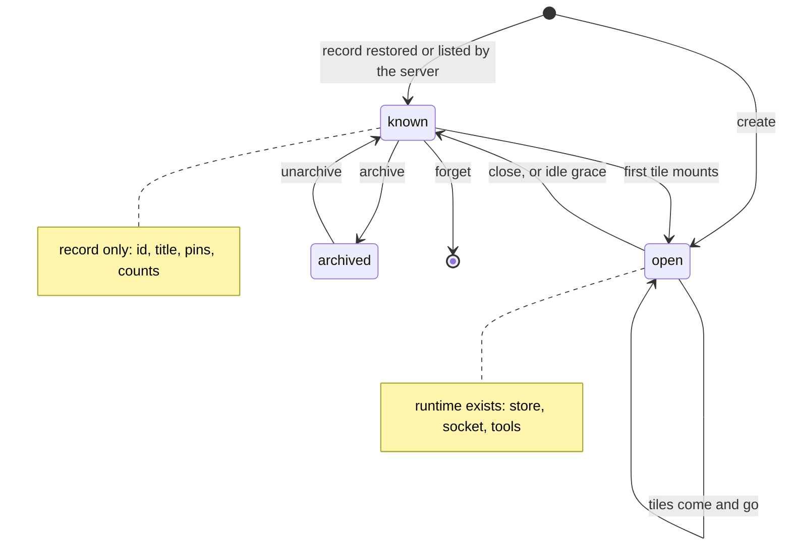
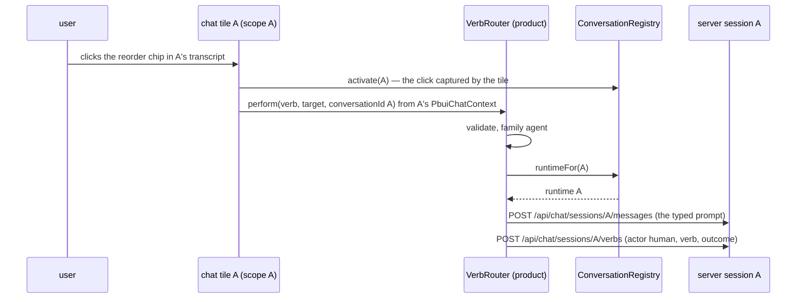

# Intern guide: many conversations on one workbench

> Today a PBUI product has one agent. The conversation tile, the trace, the watchlist, the tools, the verbs — all assume one session, created on page load and kept in the URL. This guide designs the step from one to many: a registry of conversations, one chat runtime per open conversation, a *new conversation* gesture, and five tiles that help a person see what the agents are doing — what events arrived, what each run cost, which tools were called, what each agent was told.

## 0 · How to read this

You are joining after four tickets: `PBUI-AGENT-1` (the PBUI-native chat), `PBUI-WORKBENCH-1/2` (the tile shell), `PBUI-AGENT-2` (the agent's workbench tools), `PBUI-AGENT-3` and `PBUI-SANDBOX-1` (agent-written programs and their devtools). This guide assumes you have read AGENT-1's §B (the verb round trip) and §D (workbench integration), and SANDBOX-1's §4.1 (the instance registry) — the conversation registry below is the same pattern applied to sessions.

Sections 1–3 are analysis: the gestures, the system as it stands, the gap. Section 4 is the design with decision records. Section 5 is the phase plan with file-level guidance and pseudocode. Sections 6–12 are reference. File references are repo-relative from `pbui/`; line anchors are at commit `240ffc6`. Where a fact comes from a dependency, the path is inside `node_modules/@go-go-golems/chat-provider@0.5.0`.

Vocabulary: a **session** is what the Go server knows — a uuid and an event stream under it. A **conversation** is a session as the browser knows it — a title, a status, a runtime, and tiles that show it. A **runtime** is the set of browser objects that serve one session: a Redux store, a chat client, a WebSocket manager, a tool registry and tool runtime, a widget registry, an adapter registry. The **active conversation** is the one the user last focused; singleton helper tiles follow it.

## 1 · What we are building

**Scene 1 — Two agents.** You are comparing two approaches to a reorder. You press ⌘K, choose *new conversation*, and a second chat tile opens beside the first with its own empty transcript and its own session id in its mouse-doc line. You ask each agent a different question; both stream at once. Mentioning a product in either composer works; a verb chip clicked in the second agent's reply is recorded in the second session's trace. Reloading the page brings both conversations back, each in its tile.

**Scene 2 — Conversations.** You open the *Conversations* tile: every conversation this browser knows, with its title (the first thing you asked, until you rename it), whether it is streaming, idle or errored, when it was last active, how many messages it holds and what its runs have cost. The active one is marked. You rename one, pin two, archive an old one; *open* places a closed conversation's tile again; *new* is the same gesture as the launcher's.

**Scene 3 — Event trace.** An agent's answer stalled. You open *Events*, which follows the active conversation: the WebSocket went to `backoff`, a `reconnect-scheduled` with `attempt: 3`, then `resume-requested` from the last ordinal, then frames again. You filter to the `tool` family and see the frontend tool call that took four seconds, with its name and status. You copy the entries as JSON for a bug report.

**Scene 4 — Runs and tools.** Across three conversations you want to know which one is expensive. *Runs* lists each conversation's model, provider, completed runs, input and output tokens, cache reads, the last run's duration and stop reason, and a live token rate while streaming. *Tools* lists every tool call across conversations — name, mode (frontend, human, backend), status, duration, input and result as JSON — and at the top the calls that are *waiting for you* (parked human tools and proposals), each with a *go to* button that focuses the conversation that asked.

**Scene 5 — Agent context.** An agent says it cannot open a tile. You open *Agent context* for that conversation: the tool manifest the browser last advertised to it (name, mode, `available: true|false` and, for an unavailable tool, which `attach…` would flip it), the refs and focus sent with the last message, the environment (`canApprove`), the vocabulary's types and verb kinds, the engine (scripted or real) and the model. The workbench tools read `available: false` because `attachWorkbench` ran after the manifest was synced — the tile points at the cause.

What the scenes share: nothing in them changes what a session *is* on the server, and nothing changes what a verb or a tool is. The work is to stop assuming one session in the browser, and to read state the runtime already keeps (the debug event stream, run statistics, the timeline's `tool_call` entities, the tool registry) into tiles.

## 2 · The system as it stands

### 2.1 A session, end to end

The server (`pkg/chatserver/server.go:200-210`) exposes eleven routes. A session is created by `POST /api/chat/sessions`, which mints a uuid and remembers nothing (`handlers.go:101-108`); everything else is keyed by that id: messages, stop, the tool manifest and tool results, verbs, the snapshot, and one WebSocket (`GET /api/chat/ws`) that the client subscribes to per session. Events for a session flow through a `sessionstream.Hub` into a hydration store (memory by default, SQLite with `--timeline-db`), so a reconnecting client receives a snapshot and then live frames. There is no endpoint that lists sessions, and no session metadata beyond what `sessionstream.Session{Id, Metadata}` holds in memory.

In the browser, `@go-go-golems/chat-provider`'s `<ChatProvider config>` builds, in one `useMemo` keyed on `config` (`react/ChatProvider.js:15-44`):

```
store            createChatStore()                 — Redux: timeline · overlay · runStats
toolRegistry     createToolRegistry()
widgetRegistry   createWidgetRegistry()
adapterRegistry  createTimelineAdapterRegistry()   + coreTimelineAdapters
toolRuntime      createToolRuntime({ registry, submitToolResult })
wsManager        createWsManager(config.transport)
client           createChatClient({ config, store, toolRegistry, toolRuntime, adapterRegistry, wsManager })
```

and provides them through two contexts: `ChatReduxContext` (for `useChatSelector`) and `ChatRuntimeContext` (for `useChatClient`, `useChatRuntime`). The client's `connect()` (`core/createChatClient.js:162-173`) runs `ensureSession` — the overlay's session id, else the one the `sessionPolicy` persisted in the URL or `localStorage`, else a `POST` to create one — then `ensureConnection` (one `wsManager.connect({ sessionId })`) and `syncToolManifest`. `reset()` disconnects, clears the persisted id and the three slices. The overlay slice holds exactly one `sessionId`, one `runStatus`, one `wsStatus` (`store/overlaySlice.d.ts`). The timeline slice holds one `byId`/`order`. **One provider is one session**, by construction.

### 2.2 What pbui-chat adds, and what it assumes

`createPbuiChat(options)` (`packages/pbui-chat/src/createPbuiChat.tsx`) builds one chat for a product. It keeps module-level state: `pending` (the refs and focus queued for the next send, lines 89-96), `workbench`, and `chatClientRef` — "the chat client, once a Provider has mounted" (lines 97-105). Its `Binder` component (lines 194-255) calls `useChatClient()`, assigns `chatClientRef = client`, builds the `PbuiChatContextValue` (`send`, `labelFor`, the store, the router) and binds the product's **router** to that client: `router.bind({ store, client, vocabulary, accept, labelFor, openTile, sendToAgent })`. The router is a singleton per product (`createVerbRouter`, `demo/src/chat.ts`); `perform` validates, dispatches to a family handler, and `POST`s the outcome to `/api/chat/sessions/{id}/verbs` using the bound client's session.

The chat extension (`defineChatExtensions({ widgets, tools, timelineAdapters })`, line 159) is installed into whichever provider mounts it; the frontend tools' `execute` closures call `router.perform(verb, undefined, { actor: "agent" })`, which records the verb against the *bound* session, not necessarily the session whose model called the tool — indistinguishable today because there is one of each.

`createChatApps(chat)` (`apps/createChatApps.tsx`) defines five apps: `chat` (not singleton, not doc-bound — a second chat tile shows the same transcript), `inspector`, `watchlist`, `trace` (singletons over the chat store and the timeline), and `widget` (doc-bound to a widget instance). `ChatApp` reads `useChatSelector(selectOverlay)` and shows `session ${id.slice(0, 8)}` in its mouse-doc line.

### 2.3 What the runtime already records and nobody shows

- **Debug events.** `config.onDebugEvent` receives every `ChatDebugEvent` (`ws/wsManager.d.ts:5-51`): WebSocket lifecycle transitions, each frame with its type, ordinal and size, heartbeats, reconnect schedules, resume requests, buffer depth, snapshots with entity counts, and every UI event with its name, message id, tool call id, tool name, status and the adapter that handled it. `@go-go-golems/chat-provider/debug` ships `createChatDebugEventStore({ maxEntriesPerConversation, classifier })` keyed by a *conversation id* — the package already anticipates several — with `useChatDebugEntries(store, conversationId)` and a classifier into families `llm | tool | widget | timeline | ws | other` with a one-line summary. The demo passes no `onDebugEvent`.
- **Run statistics.** The `runStats` slice (`store/runStatsSlice.d.ts`): `isStreaming`, `streamStartTime`, `streamOutputTokens`, `model`, `provider`, `lastRun` usage (input, output, cached, cache creation/read tokens), `lastRunDurationMs`, `lastRunStopReason`, `totals`, `completedRuns`; `selectRunStats`, `selectHasRunUsage`. Nothing in pbui-chat reads it.
- **Tool calls.** Every tool call is a `tool_call` timeline entity with `toolCallId`, `toolName`, `status`, input and result in `props`; `ToolCallEntry` in `Messages.tsx` renders them inline; the tool runtime knows which frontend tools are executing and which human tools are parked (`toolRuntime.cancelActiveFrontendTools`, the human-tool outlet).
- **The manifest.** `client.tools.syncManifest()` posts `FrontendToolManifestEntry[]` — name, description, mode, input schema, `available` — computed from the registry at that moment (`tools/toolRegistry.d.ts:51-57`). The browser knows exactly what the model was told it can call, and when.

### 2.4 The pattern to reuse

SANDBOX-1's `createInstanceRegistry` (`packages/pbui-sandbox/src/instances.ts`) is a store of snapshots keyed by view id with a selection and a `useSyncExternalStore` hook; program tiles publish into it and singletons follow "the selected sandbox". The conversation registry below has the same shape with sessions in place of views, and the same reason for living outside React context: the tiles that follow the selection are siblings in a user-arranged layout, not descendants of the conversation tile.

## 3 · Gap analysis

| Scene needs | Exists | Missing |
|---|---|---|
| Several sessions open at once | `ChatProvider` builds one runtime; the pieces (`createChatStore`, `createChatClient`, `createWsManager`, `coreTimelineAdapters`, `ChatRuntimeContext`, `ChatReduxContext`) are exported from the package's subpaths | a `createChatRuntime(config)` factory and a `<ChatRuntimeScope runtime>` provider; a registry that owns runtimes across tile unmounts |
| A chat tile that shows *a* conversation | `chat` app, not doc-bound | `chat` doc-bound to `conversation: <sessionId>`; `titleFor` from the registry |
| New conversation | `client.reset()` + `connect()` on the one runtime | a registry `create()` that posts a session and opens a tile; a launcher row; a verb |
| Verbs and tools attributed to the right session | one router bound to the last `Binder`'s client; tool closures shared | a binding that resolves the target conversation per call; tool descriptors instantiated per runtime |
| Restore conversations on reload | `sessionPolicy` persists one id | a persisted index of conversations with titles and pins; the layout already persists the tiles' bindings |
| A list with titles, status, activity | `POST /sessions` returns a uuid; no list | `GET /api/chat/sessions` backed by a small session index; titles derived client-side until the server stores them |
| Event trace | `onDebugEvent`, `createChatDebugEventStore` | wiring per runtime and a tile |
| Run stats | `runStats` slice, selectors | a tile over every runtime's store |
| Tool traffic and pending approvals | `tool_call` entities, the tool runtime | a cross-runtime selector and a tile; "waiting for you" from parked human tools |
| Agent context | the registry computes the manifest at sync time | remembering the last synced manifest and the last sent refs/focus per runtime; a tile |

Nothing in the gap is in the workbench protocol, the vocabulary's closed-ness, or the sandbox. The Go side gains one read endpoint and one small index; the wire format of events does not change.

## 4 · Design

### 4.1 The chat runtime as a value

The first move is to take what `ChatProvider` does inside a `useMemo` and make it a function that returns a value a registry can hold:

```ts
// packages/pbui-chat/src/conversations/runtime.ts
import { createChatClient, createChatStore, createToolRegistry, createWidgetRegistry, createTimelineAdapterRegistry, ChatReduxContext } from "@go-go-golems/chat-provider";
import { ChatRuntimeContext } from "@go-go-golems/chat-provider/core";
import { createToolRuntime } from "@go-go-golems/chat-provider/tools";
import { createWsManager, coreTimelineAdapters } from "@go-go-golems/chat-provider/ws";

export interface ChatRuntime {
  sessionId: string;
  store: ChatStore;
  client: ChatClient;
  toolRegistry; toolRuntime; widgetRegistry; adapterRegistry;
  debug: ChatDebugEventStore;          // shared across runtimes, keyed by sessionId
  context: ChatRuntimeContextValue;    // what ChatRuntimeContext.Provider receives
  dispose(): void;                     // cancel tools, disconnect, forget
}

export function createChatRuntime(config: ChatProviderConfig & { sessionId: string; extensionFor(sessionId): ChatExtension[] }): ChatRuntime
```

`createChatRuntime` does what `ChatProvider.js:15-44` does, with three differences: the session id is known up front (dispatched into the overlay before `connect()`, so `ensureSession` finds it and neither consults the URL nor creates one), `onDebugEvent` is wired to the shared debug store under that id, and the extensions are produced *for this session* (4.4). `<ChatRuntimeScope runtime>` is the provider half: a `react-redux` `Provider` with `context={ChatReduxContext}` around a `ChatRuntimeContext.Provider` — the two contexts `ChatProvider` already uses, so `useChatClient`, `useChatSelector`, `useChatRuntime`, `WidgetOutlet`, `ToolCallOutlet` and every pbui-chat component keep working unchanged under a scope. `ChatProvider` itself stays for products with one conversation; it is `createChatRuntime` plus a scope, and could be re-expressed that way upstream (D1).

### 4.2 The conversation registry — the active conversation

```ts
// packages/pbui-chat/src/conversations/registry.ts
export interface ConversationRecord {
  id: string;                          // the session id
  title: string;                       // first user message, until renamed
  titledBy: "auto" | "human" | "agent";
  createdAt: string; lastActivityAt: string;
  pinned: boolean; archived: boolean;
  messageCount: number;
  engine?: "scripted" | "real"; model?: string | null; provider?: string | null;
}

export interface ConversationSnapshot extends ConversationRecord {
  runtime: ChatRuntime | null;         // null when closed (no tile, no socket)
  runStatus: string; wsStatus: TransportStatus; error: string | null;
  streaming: boolean;
  stats: ChatRunStats | null;
  waiting: number;                     // parked human tools + proposals awaiting a decision
}

export interface ConversationRegistry {
  get(id): ConversationSnapshot | null;
  all(): ConversationSnapshot[];                 // stable until something changes
  activeId(): string | null;
  activate(id: string | null): void;
  create(options?: { title?: string; open?: boolean }): Promise<ConversationSnapshot>;   // POST /sessions, record, open runtime
  open(id): ChatRuntime;                         // build the runtime if closed; idempotent
  close(id): void;                               // dispose the runtime, keep the record
  rename(id, title, by): void; pin(id, pinned): void; archive(id, archived): void; forget(id): void;
  subscribe(listener): () => void;
  /** Reconcile with GET /api/chat/sessions when the server has it. */
  sync(): Promise<void>;
}

export function createConversationRegistry(options: { key: string; runtime(sessionId): ChatRuntime; debug: ChatDebugEventStore; basePrefix?: string; fetch?: typeof fetch }): ConversationRegistry;
export function useConversations<T>(registry, selector: (r: ConversationRegistry) => T): T;
```

Four properties decide its shape.

**Records persist; runtimes do not.** The records — ids, titles, pins, archive flags, counts — go to `localStorage` under `<key>` (debounced, corrupt-entry-safe, like the program library). A runtime exists while a conversation is *open*: from the first tile that shows it until `close()`. Closing every tile of a conversation does not close it by itself (the user may re-open it from the Conversations tile a minute later without losing the live socket); `close()` is explicit, and the registry may close idle, untiled conversations after a grace period (R6). A page reload restores records from storage and rebuilds runtimes lazily as tiles mount — each runtime's `connect()` hydrates the timeline from the server snapshot, as today.

**The snapshot mirrors the runtime's store.** `runStatus`, `wsStatus`, `error`, `streaming`, `stats` and `messageCount` are read from the runtime's Redux store through one subscription per open runtime; the registry re-notifies its own subscribers when a mirrored field changed (by `Object.is`, as the instance registry does). A tile that wants more than the mirror — the transcript, a tool call's input — scopes itself to the runtime (4.5) and uses `useChatSelector`.

**Activation is a store field.** `activate(id)` is called when a conversation tile receives focus or a click (the same `onFocusCapture`/`onClickCapture` container as the script tile), when the user picks one in a singleton's selector, and by `create()`. The active conversation is what singleton helper tiles show by default, what the composer-less surfaces (an object menu's *ask the agent*) send to, and what the router's trace POST targets when a verb has no other provenance (4.3). It is persisted in storage so a reload returns to it.

**Titles are derived, then owned.** Until someone renames, the title is the first user message's first sixty characters (`titledBy: "auto"`, recomputed as long as it stays auto). A human rename sets `"human"`; an agent tool (4.7) may set `"agent"` only while it is `"auto"`. The server's index (4.8) stores titles once it exists; the registry's `sync()` prefers a human title to any other.



### 4.3 One router, many sessions

`createVerbRouter` is per product and must stay so: the vocabulary, the families and the handlers are product facts, not session facts. What must change is the binding. Today `router.bind(binding)` receives one `client`; `perform` POSTs the outcome to that client's session. The binding becomes session-aware:

```ts
export interface RouterBinding {
  store; vocabulary; basePrefix; accept; labelFor; openTile;
  /** Which conversation a verb belongs to when the caller did not say: the active one. */
  conversation(): { id: string; client: ChatClient } | null;
  /** Send to a conversation; default the active one. */
  sendToAgent(template, refs, target?: { conversationId: string }): Promise<void>;
}
export interface PerformOptions { actor?; provenance?; conversationId?: string }
```

`perform(verb, target, { conversationId })` validates as before, dispatches to the family handler with a `RouterContext` that carries `conversationId`, and POSTs the trace to `/api/chat/sessions/{conversationId}/verbs`. Where does `conversationId` come from?

- A chip or menu inside a conversation tile: the tile's `PbuiChatContext` carries its `conversationId`; `onPerform` passes it.
- A frontend tool executed for a model: the tool descriptor was instantiated for that session (4.4) and passes it.
- A program's verb intent (sandbox): the script tile is not inside any conversation; it uses the active one, and the provenance already names the program.
- A workbench bar, a launcher row, a watchlist entry: the active one.

The `agent` family's `sendToAgent` goes to the same conversation; the `tool` family (answering a parked human tool) must go to the conversation that parked it — its `toolRuntime` — which is why `RouterContext` exposes `runtimeFor(conversationId)`.

### 4.4 Tools and widgets, per runtime

The chat extension registers frontend tools whose `execute` closures call `router.perform(…, { actor: "agent" })`. With several runtimes the same descriptors would be installed into every tool registry and each `execute` would have to guess its session. The fix is to instantiate the descriptors per session: `chat.extensionFor(conversationId)` returns the extension with every tool's `execute` wrapped to pass `{ actor: "agent", conversationId }` and with `available()` closures unchanged (they read the product's workbench and sandbox, which are shared). `createChatRuntime` installs `extensionFor(sessionId)` instead of a shared extension. Widgets and timeline adapters are stateless and shared.

`attachWorkbench`, `attachSandbox` and every other "the tools are now available" transition must re-sync the manifest of **every open runtime**, not one `chatClientRef`: the registry exposes `forEachOpen(runtime => runtime.client.tools.syncManifest())`. The per-session manifest is also what Scene 5 shows, so `createChatRuntime` records the last manifest it synced (`runtime.lastManifest`, with a timestamp) and the last `sendMessageBody` it produced (`runtime.lastSend: { prompt, refs, focus, at }`).

### 4.5 pbui-chat under many runtimes

`createPbuiChat` keeps one module-level router and store, and loses its per-client state:

- `pending` becomes per runtime (`runtime.pending`), because a mention queued in conversation A must not ride on B's next send.
- `chatClientRef` goes away; `attachWorkbench`/`attachSandbox` call `conversations.forEachOpen(...)`.
- `Binder` becomes `ConversationScope({ conversationId, children })`: it calls `registry.open(conversationId)`, renders `<ChatRuntimeScope runtime>`, and provides a `PbuiChatContextValue` that includes `conversationId`, `runtime` and a `send` bound to that runtime. Everything that reads `usePbuiChat()` (messages, composer, mentions, panels) keeps working; it now means "the conversation I am inside".
- `chat.Provider` stays the product-wide wrapper (pbui's provider with `onPerform`) and no longer needs a `ChatProvider` above it; the demo's `App.tsx` drops `<ChatProvider>` and gets `<chat.Provider conversations={registry}>`.

The `chat` app becomes doc-bound: `defineApp({ id: "chat", docBound: true, bindings: ["conversation"], singleton: false, duplicable: true, titleFor: view => registry.get(view.documents.conversation)?.title ?? "chat" })`. Its component wraps `ChatApp` in a `ConversationScope` for `view.documents.conversation`. Splitting a conversation tile links a second placement to the same view (same transcript, same composer), which is the workbench's meaning of split; a *new conversation* is `registry.create({ open: true })` followed by `openView("chat", { conversation: id }, { near })`.

The `inspector`, `watchlist` and `trace` singletons: the inspector and watchlist are over the pbui-chat store (product-wide — an inspected object is not per conversation) and stay as they are. The trace is per session (`trace_entry` entities live in a runtime's timeline), so `TracePanel` becomes a tile that follows the active conversation with a selector to pin another, the same shape as the REPL's target picker in SANDBOX-1.

### 4.6 The helper tiles

All five are `defineApp` descriptors from `createConversationApps(chat)`; the three singletons take their target from the registry's active conversation unless pinned to one by a selector in their header.

**Conversations** — `conversations`, singleton. One row per record (archived hidden behind a toggle): title (inline-renameable), status chip (`streaming` · `idle` · `error` · `closed`), `wsStatus` when not `ready`, last activity, message count, tokens (from `stats.totals`), `waiting` as a badge, *active* marker. Row actions: *open* (a chat tile near the active one, or *go to* if one exists), *activate*, *rename*, *pin*, *archive*, *close runtime*, *forget* (local record only; the server keeps the session). Header: *new conversation* (the same call the launcher row makes), *sync* (when the server list exists), a filter. Sorted pinned first, then by last activity.

**Events** — `chat-events`, singleton. `useChatDebugEntries(debug, targetId)` newest first: time, family chip, event type, the classifier's summary, and the correlating id; filters by family (`llm tool widget timeline ws other`) and a text filter; pause; clear (`debug.clear(id)`); *copy as JSON*. A `ws-lifecycle` row shows `from → to`; a `reconnect-scheduled` row shows attempt and delay; a `ui-event` row shows name, tool name and status and expands to the raw event. The store is capped per conversation (`maxEntriesPerConversation`, default 1000).

**Runs** — `chat-runs`, singleton, cross-conversation. A table with one row per open conversation (closed ones show their last known totals from the record): title, model · provider, runs, input/output/cached tokens, last run duration and stop reason, streaming indicator with a live output-token rate (`streamOutputTokens / (now − streamStartTime)`). A footer sums tokens across conversations. The data is the mirrored `stats` in the registry snapshot, so the tile needs no scope.

**Tools** — `chat-tools`, singleton, cross-conversation. Two sections. *Waiting for you*: every parked human tool and undecided proposal across open runtimes, with the conversation title, the tool name, how long it has waited, and *go to* (activate and focus the tile; open one if none). *Traffic*: every `tool_call` entity across open runtimes, newest first — conversation, name, mode, status, duration (from the entity's `createdAt`/`updatedAt`), input and result as `JsonBlock` behind a disclosure, *inspect* (the pbui inspector over the tool reference). Filters by conversation, mode, status, name. The selector joins each runtime's `selectTimelineEntities` filtered to `tool_call`, tagged with its conversation id, and memoises per runtime so a frame in A does not re-sort B.

**Agent context** — `conversation-context`, doc-bound to `conversation`. What the model was told and can do: the session id and engine, the model/provider, the last synced manifest as a table (name, mode, available, and for `available: false` the reason the product gives — `attachWorkbench`, `attachSandbox`), the last send's refs and focus as presentations, the environment (`canApprove`), the vocabulary's types and verb kinds with their docs, and *re-sync manifest* / *describe* buttons (the latter runs `workbench_describe`/`sandbox_describe` locally and shows their results — what the agent would see if it asked).

### 4.7 What the agent gains

A `conversation` presentation type and five generic verb kinds, the same closed-vocabulary discipline as `program.*`:

| kind | doc | family |
|---|---|---|
| `conversation.new` | start a conversation, optionally with a title and a first message | local |
| `conversation.open` | open a conversation's tile near another | local |
| `conversation.select` | make a conversation the active one | local |
| `conversation.rename` | set a conversation's title | local |
| `conversation.send` | send a message (template + refs) to a conversation | agent (to the *target* conversation) |

`conversation.send` with a target other than the sender is the handoff gesture: *send this product to the other agent*. Two agent tools, behind the workbench tools' policy gate: `conversation_list` (the registry's records and statuses, including "this is you") and `conversation_send({ conversationId, prompt, refs })` under `confirm` by default — a model that can message other agents unasked is a loop waiting to happen (R9). The Go prompt gains a short `## Conversations` section only when the vocabulary declares the type.

### 4.8 The server's part

`GET /api/chat/sessions` returns `[{ id, createdAt, lastActivityAt, messageCount, title? }]`, and `PATCH /api/chat/sessions/{id}` accepts `{ title }`. Behind them a `SessionIndex` — an interface with a memory implementation and a SQLite table `sessions(id, created_at, last_activity_at, message_count, title)` opened beside the hydration store — written by `HandleCreateSession` (insert) and `HandleSubmitMessage` (touch, count). The index is a convenience, not a source of truth: the hub and the hydration store remain authoritative for a session's events, and a browser that knows a session id the index does not (a memory index after a restart) can still connect and hydrate. That is why the registry merges the server list *into* its records rather than replacing them, and why titles live in the browser first.

### 4.9 Decision records

**D1 — A runtime is a value; `ChatProvider` is sugar.** *Options:* one `ChatProvider` per conversation tile (loses the runtime on unmount); a multi-session rewrite of chat-provider's slices; `createChatRuntime` + `ChatRuntimeScope` using the package's exported pieces. *Decision:* the third. *Why:* the subpaths (`/core`, `/store`, `/tools`, `/ws`) export every piece `ChatProvider.js` uses, and both contexts; no slice changes, no forked package. *Consequence:* pbui-chat depends on chat-provider subpaths; proposing the factory upstream is a follow-up.

**D2 — Records persist, runtimes are lazy.** *Why:* a socket per known conversation would not scale past a handful and serves nothing while no tile shows it; a record is a few hundred bytes. *Consequence:* re-opening hydrates from the server snapshot (the existing reconnect path).

**D3 — The `chat` app is a view of a conversation.** *Options:* a second app id `agent`; a `conversation` binding on `chat`. *Decision:* `chat` becomes doc-bound with `bindings: ["conversation"]`. *Why:* the workbench's doc-binding rule gives de-duplication, titles and linked splits for free, as `script` did for programs; a saved layout with an unbound `chat` tile migrates to the persisted session id (5, Phase 0). *Consequence:* `createChatApps` needs the registry to title tiles.

**D4 — One router, session-aware binding.** *Why:* the vocabulary and the handlers are product facts; only the destination of a trace POST and of `sendToAgent` is a session fact. *Consequence:* `PerformOptions.conversationId`; every perform site inside a conversation passes it; everything else defaults to the active one.

**D5 — Tools are instantiated per session.** *Why:* a shared `execute` closure cannot know which model called it; `ToolExecutionContext` carries `signal` and `toolCallId` only. *Consequence:* `extensionFor(sessionId)`; `attach…` re-syncs every open runtime.

**D6 — The active conversation is a registry field, persisted.** *Why:* the same argument as the selected sandbox: singletons that follow it are siblings, not descendants. *Consequence:* `activate` is called from tiles and from `create`.

**D7 — Titles are derived until owned.** *Why:* a session id is not a title; the first message usually is; a rename must stick. *Consequence:* `titledBy`, and a sync rule that never overwrites a human title.

**D8 — Event tracing uses chat-provider's debug store, unchanged.** *Why:* it is keyed by conversation id already, classified, capped and hooked. *Consequence:* `onDebugEvent` per runtime; the tile is presentation.

**D9 — Cross-conversation tiles read mirrors, per-conversation tiles scope.** *Why:* the Runs table must not subscribe to N Redux stores itself; the registry mirrors the few fields it needs. Tools traffic is the exception: it needs entities, so it subscribes per open runtime with memoised per-runtime selectors.

**D10 — The server gains a list, not a session model.** *Why:* the hub already owns sessions; an index that can be rebuilt is enough for a list, and the browser must work when the index is empty. *Consequence:* merge, never replace.

**D11 — `conversation.send` to another conversation is `confirm` for the agent.** *Why:* R9.

**D12 — Waiting-for-you is computed, not stored.** *Why:* parked human tools and undecided proposals are already in each runtime's tool runtime and timeline; a count derived on mirror updates is always right, a stored count can drift.

## 5 · Implementation plan

Six phases; each ends with tests green in `pbui-chat` (and Go where touched), a browser check in the demo with two conversations, a commit and a diary step.

### Phase 0 — The runtime factory, the registry, the scoped chat

*Files:* `packages/pbui-chat/src/conversations/{runtime.ts, registry.ts, ConversationScope.tsx, index.ts}` (new), `src/createPbuiChat.tsx`, `src/router/createVerbRouter.ts`, `src/apps/createChatApps.tsx`, `src/apps/ChatApp/ChatApp.tsx`, `demo/src/{App.tsx, chat.ts, workbench.ts}`.

1. `createChatRuntime(config)` replicating `ChatProvider.js:15-44` with a known `sessionId` (dispatch `overlaySlice.actions.setSessionId` before `connect`), `onDebugEvent → debug.push(sessionId, event)`, `extensionFor(sessionId)`, `lastManifest`/`lastSend` capture, `dispose()`. `ChatRuntimeScope`. Test: two runtimes connect to two ids against a mocked `fetch`/WebSocket and keep separate timelines.
2. `createConversationRegistry` with records in storage, lazy runtimes, mirrors, activation, `create()`. Tests: create/open/close/rename/pin/archive/forget; mirror notifies on status change only; activation cleared on forget; restore from storage; a corrupt entry moved aside.
3. `createPbuiChat`: `pending` per runtime; `ConversationScope`; `PbuiChatContextValue.conversationId`; `attachWorkbench/attachSandbox` sync every open runtime; `extensionFor`. Router: `conversation()`, `PerformOptions.conversationId`, `RouterContext.conversationId/runtimeFor`. Tests: a verb performed with `conversationId: "B"` posts to B's `/verbs`; `sendToAgent` without a target goes to the active one; a mention queued in A does not appear in B's body.
4. `chat` doc-bound; layout migration: on load, a `chat` tile with no `conversation` binding is rebound to the session id the old `sessionPolicy` persisted (`pbui-chat-demo.session`), which also becomes the first record. The demo drops `<ChatProvider>`.

*Acceptance:* the demo loads with one conversation as before; a second `openView("chat", { conversation })` from the console opens a second, independent transcript; both stream; each trace POST goes to its own session.

### Phase 1 — Conversations tile, new conversation, the verbs

*Files:* `src/conversations/ConversationsTile/`, `src/apps/createConversationApps.tsx`, `src/vocabulary/*` (the `conversation` type and five kinds), `demo/src/pbui/{verbs,vocabulary,descriptors/conversation}.ts`, `demo/src/App.tsx` (launcher row *new conversation*), `pkg/pbuichat/prompt.go` (`## Conversations` when declared).

Tests: rows reflect records and mirrors; rename/pin/archive/forget through the tile; *new* creates, opens and activates; the launcher row does the same; `conversation.*` verbs validate against the vocabulary and route `local`; the vocabulary round-trip test covers the new type.

### Phase 2 — Events tile

*Files:* `src/conversations/EventsTile/`. Tests with a debug store fed synthetic `ChatDebugEvent`s: families, filters, pause, clear, copy, the follow-active behaviour, pinning another conversation.

### Phase 3 — Runs and Tools tiles

*Files:* `src/conversations/{RunsTile, ToolsTile}/`, `src/conversations/selectors.ts` (`selectToolTraffic(registry)`, `selectWaiting(registry)`). Tests: a runtime whose store holds run stats and `tool_call` entities (dispatched directly, no socket) shows the expected rows; *go to* activates and opens; the waiting count matches parked tools.

### Phase 4 — Agent context, the agent's tools

*Files:* `src/conversations/ContextTile/`, `src/tools/conversationTools.ts` (`conversation_list`, `conversation_send` with policy), `pkg/pbuichat/prompt.go`, `pkg/chatserver/scripted/` (a scenario where agent A hands a product to agent B). Tests: the manifest table reads `lastManifest`; `conversation_send` is `confirm` without an approval and performs with one; the Go e2e runs the handoff scenario.

### Phase 5 — Server index and close-out

*Files:* `pkg/chatserver/{sessions.go, handlers.go, server.go}` (`SessionIndex`, memory + SQLite, the two routes), `src/conversations/registry.ts` (`sync()` merge), README, the guide as built, the diary close-out, the reMarkable re-upload.

## 6 · Sequences

### 6.1 New conversation from the launcher

```
user: ⌘K → "new conversation"
  App.choose(row) → registry.create({ open: true })
    POST /api/chat/sessions → { sessionId: B }
    records[B] = { id: B, title: "new conversation", titledBy: "auto", … }; persist
    runtime = createChatRuntime({ sessionId: B, … }); runtimes[B] = runtime
    runtime.client.connect()            // overlay has B → no policy lookup, no create
      wsManager.connect({ sessionId: B }) → subscribe → snapshot (empty) → ready
      syncToolManifest()                // B's model is told the same tools as A's
    registry.activate(B)
  workbench.verbs.openView("chat", { conversation: B }, { near: activePlacement })
ChatApp(view B) → <ConversationScope conversationId=B> → runtime B's contexts → Messages, Composer
user types in B's composer → runtime B.client.send → POST /sessions/B/messages (refs from runtime B.pending)
```

### 6.2 A verb from inside conversation A while B is active



Clicking anywhere inside a conversation tile activates it, so in practice the active conversation and the origin of a verb agree; `conversationId` on `perform` is what keeps them aligned when they do not (a program tile's intent, a launcher row, a tool executed for a model while the user has focused another tile).

### 6.3 Reconnect, as the Events tile shows it

```
ws-lifecycle  ready → backoff            (frame loss, network)
reconnect-scheduled  attempt 1 · 1000 ms
ws-lifecycle  backoff → connecting → socket-open → subscribing
resume-requested  sinceOrdinal 000…418
frame-received  snapshot · ordinal 418 · 12 entities · 0 dropped
ws-lifecycle  hydrating → ready
ui-event  ToolCallStarted · workbench_open_tile · adapter toolCalls
```

## 7 · Failure modes to design against

- **R1 Two runtimes, one persisted session id.** The old `sessionPolicy` wrote `pbui-chat-demo.session`; the registry owns persistence now and `createChatRuntime` passes `sessionPolicy: { restore: "never" }` so a runtime never reads or writes that key. Phase 0's migration reads it once.
- **R2 A tool executed for A records a verb against B.** Only possible if a descriptor is shared; `extensionFor(sessionId)` and a test that a tool call in A's runtime posts to A's `/verbs`.
- **R3 `attachWorkbench` syncs one manifest.** The AGENT-2 bug (tools hidden for one message) returns per conversation unless every open runtime re-syncs; `forEachOpen` and a test with two runtimes.
- **R4 The trace panel shows the wrong session.** It follows the active conversation and says so in its header; pinning another is explicit.
- **R5 Pending refs leak between conversations.** `pending` per runtime; a test.
- **R6 Sockets pile up.** Lazy runtimes, explicit `close`, an idle grace (no tile, no streaming, five minutes) that disposes the runtime and keeps the record; the Conversations tile shows `closed` and re-opens on demand.
- **R7 The layout names a conversation the registry forgot.** The chat tile shows an empty state with *reconnect* (creates the record from the id and opens a runtime; the server snapshot restores the transcript if the session still exists) and *close this tile*.
- **R8 The server index is empty after a restart (memory backend).** `sync()` merges; records the server does not know keep their status `unknown` until a runtime connects and either hydrates or fails.
- **R9 Agents messaging agents in a loop.** `conversation_send` is `confirm` by default; a sent message carries `provenance: { conversationId: sender }` and the receiving prompt shows it; a product may deny the tool outright.
- **R10 Cross-conversation tiles re-render on every frame.** Mirrors compare fields by identity; Tools traffic memoises per runtime; Runs reads mirrors only.
- **R11 Human tools parked in a closed runtime.** Closing a runtime cancels its active frontend tools (the client's `reset` path does) and the parked human tools are answered `cancelled` on the server; the Conversations tile refuses to close a conversation with `waiting > 0` without a confirm.
- **R12 The active conversation is archived or forgotten.** `archive` keeps it active if open; `forget` clears activation and the singletons show their empty state.
- **R13 Titles from the first message contain a mention.** Derive from the plain prompt with mentions rendered through `labelFor`, capped at sixty characters.
- **R14 Two browsers, one session.** Unchanged from today: the hub fans out to every subscriber; both see the stream; the registry is per browser, so titles and pins are too.

## 8 · Testing strategy

| Layer | Where | What |
|---|---|---|
| runtime | `conversations/runtime.test.ts` | two runtimes, separate stores, known ids, debug routing, manifest capture (mocked fetch + a fake WebSocket) |
| registry | `conversations/registry.test.ts` | records, persistence, lazy open/close, mirrors, activation, titles, sync merge |
| router | `router/createVerbRouter.test.ts` | `conversationId` targeting; default active; `sendToAgent` targets |
| chat | `createPbuiChat.test.tsx` | pending per runtime; `attach…` syncs all; `ConversationScope` |
| apps | `apps/*.test.tsx` | `chat` doc-bound title and migration; conversation apps |
| tiles | `conversations/*Tile/*.test.tsx` | per phase, with synthetic stores and debug events |
| tools | `tools/conversationTools.test.ts` | list; send under confirm |
| Go | `pkg/chatserver/server_test.go`, `pkg/pbuichat/pbuichat_test.go` | index routes; prompt section; handoff scenario |
| browser | Playwright MCP | the five scenes with two conversations, screenshots under `various/` |

## 9 · API reference (as designed)

```ts
// conversations/runtime.ts
createChatRuntime(config: ChatProviderConfig & { sessionId; extensionFor(id): ChatExtension[]; debug: ChatDebugEventStore }): ChatRuntime
ChatRuntimeScope({ runtime, children })
// conversations/registry.ts
createConversationRegistry({ key, runtime(id), debug, basePrefix?, fetch? }): ConversationRegistry
useConversations(registry, selector)
// createPbuiChat additions
chat.conversations: ConversationRegistry
chat.extensionFor(conversationId): ChatExtension
chat.ConversationScope({ conversationId, children })
PbuiChatContextValue.conversationId; .runtime
// router
PerformOptions.conversationId?; RouterContext.conversationId; RouterContext.runtimeFor(id)
RouterBinding.conversation(); RouterBinding.sendToAgent(template, refs, target?)
// apps
createChatApps(chat)            // chat: docBound, bindings ["conversation"]
createConversationApps(chat)    // conversations · chat-events · chat-runs · chat-tools · conversation-context
// vocabulary
types.conversation; verbs conversation.new | open | select | rename | send
// tools
conversation_list; conversation_send (policy: confirm)
// Go
GET  /api/chat/sessions            → [{ id, createdAt, lastActivityAt, messageCount, title? }]
PATCH /api/chat/sessions/{id}      { title }
type SessionIndex interface { Touch(ctx, id, at, delta); List(ctx); SetTitle(ctx, id, title) }
```

## 10 · File reference

| File | Role |
|---|---|
| `packages/pbui-chat/src/conversations/runtime.ts` | new: the runtime factory and scope |
| `packages/pbui-chat/src/conversations/registry.ts` | new: records, runtimes, mirrors, activation |
| `packages/pbui-chat/src/conversations/ConversationScope.tsx` | new: a conversation's contexts for its tiles |
| `packages/pbui-chat/src/conversations/{ConversationsTile,EventsTile,RunsTile,ToolsTile,ContextTile}/` | new: the five tiles |
| `packages/pbui-chat/src/conversations/selectors.ts` | new: cross-runtime tool traffic and waiting |
| `packages/pbui-chat/src/createPbuiChat.tsx` | per-runtime pending, scope, `extensionFor`, `attach…` for all |
| `packages/pbui-chat/src/router/createVerbRouter.ts` | session-aware binding and options |
| `packages/pbui-chat/src/apps/createChatApps.tsx`, `apps/ChatApp/ChatApp.tsx` | `chat` doc-bound |
| `packages/pbui-chat/src/apps/createConversationApps.tsx` | new: the helper apps |
| `packages/pbui-chat/src/tools/conversationTools.ts` | new: the agent's two tools |
| `packages/pbui-chat/src/vocabulary/*` | the `conversation` type and verbs |
| `packages/pbui-chat/demo/src/{App,chat,workbench}.ts(x)`, `demo/src/pbui/*` | registry, launcher row, descriptors |
| `pkg/chatserver/sessions.go` (new), `handlers.go`, `server.go` | the index and routes |
| `pkg/pbuichat/prompt.go` | `## Conversations` |
| `node_modules/@go-go-golems/chat-provider/{react/ChatProvider.js, core/createChatClient.js, ws/wsManager.d.ts, debug/*, store/runStatsSlice.d.ts}` | read-only: what the runtime is made of |

## 11 · Open questions

| # | Question | Recommendation |
|---|---|---|
| Q1 | Propose `createChatRuntime`/`ChatRuntimeScope` upstream in chat-provider, or keep them in pbui-chat? | Build in pbui-chat from the subpaths; open an upstream issue with the code once it settles. |
| Q2 | Should closing the last tile close the runtime? | No — an idle grace (R6); the user's "closed the tile" and "done with the agent" are different acts. |
| Q3 | Server-side titles from the first message, or browser-side? | Browser first (D7); the server stores what it is told via PATCH. |
| Q4 | Should the watchlist and inspector become per conversation? | No; they are about objects, not sessions. |
| Q5 | One WebSocket multiplexing sessions? | sessionstream subscribes per session on one socket per transport today; N sockets for N open conversations is acceptable at this scale; revisit with the transport. |
| Q6 | Should the agent see other conversations' transcripts? | Not in this ticket; `conversation_list` gives titles and statuses, `conversation_send` a message. A `conversation_read` tool is a policy decision for a product. |
| Q7 | Per-conversation environments (`canApprove` for one agent only)? | Later; the environment is product-wide today and the Agent-context tile shows it. |

## 12 · Glossary

- **session** — the server's unit: a uuid, an event stream, a snapshot.
- **conversation** — a session in the browser: a record (title, pins, counts) and, while open, a runtime.
- **runtime** — store + client + socket + tool registry/runtime + widget and adapter registries for one session.
- **active conversation** — `registry.activeId()`; what singleton helper tiles and untargeted verbs use.
- **scope** — `ConversationScope`: the React contexts that make pbui-chat components mean "this conversation".
- **mirror** — the few store fields the registry copies into its snapshot so cross-conversation tiles need no scope.
- **waiting** — parked human tools and undecided proposals in a conversation, computed from its runtime.
