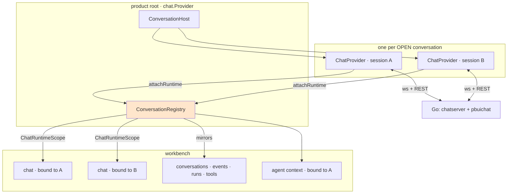

# Code review guide: what to audit in the multi-agent workbench, and what I already know is wrong

*For an external auditor. Written by the author of the change, on the assumption that you have not seen this codebase before and that your time is better spent on the four places it is actually load-bearing than on the sixty files it touches.*

---

## 0 · How to use this document

Read §1 and §2 to know what the system is. Then go straight to **§8, the list of things I know are wrong or faked** — it is the honest inventory, and everything in it is a lead you do not have to find yourself. §3 to §7 are the reasoning behind the API shapes, so that when you disagree you are disagreeing with an argument rather than guessing at one. §9 is the review plan with file references in the order I would read them.

Two conventions. Where I write **"I took a shortcut here"** I mean the code is knowingly not what it should be, and I say what the right thing would have been. Where I write **"this is broken and not mine"** I mean a defect in a dependency or an adjacent package that this change works around; those are worth your attention precisely because the workaround is the thing most likely to rot.

The change under review is the ticket `PBUI-AGENT-4`: 71 files, roughly 6700 insertions, six phases, `b428c5e..HEAD`. 208 tests in `packages/pbui-chat` plus the Go suite.

---

## 1 · What the system is

PBUI is a UI grammar. Its premise is that every concrete object a user or an agent names becomes a **presentation**: a live thing with a tone, a documentation line, and a right-click menu of **verbs**. Verbs are serialisable data drawn from a closed **vocabulary** the product declares, so the same action has one name whether a person clicks it, an agent emits it, or a trace records it.

Three packages matter here.

- **`@hyperslop-systems/pbui`** — the presentation layer: `createPbui`, `Presentation`, `ObjectMenu`, the atoms (`Button`, `Text`, `Chip`, `SelectInput`, …). Products never hand-write form controls; a test enforces that.
- **`@hyperslop-systems/pbui-workbench`** — the layout: workspaces, tiles, applications. An application is a descriptor (`defineApp`); an application that is a view OF something is `docBound` with `bindings: ["program"]` and the workbench de-duplicates, titles and links tiles for it.
- **`@hyperslop-systems/pbui-chat`** — the agent layer over `@go-go-golems/chat-provider`: the transcript, typed mentions, human tools, the verb router, the vocabulary, and — as of this change — conversations.

The server is Go: `pkg/chatserver` (routes, sessions), `pkg/pbuichat` (the plugin that turns model output into PBUI entities, validates verbs, and generates the system prompt), on top of `sessionstream` (an event hub with a hydration store) and `pinocchio/chatapp`.

### What this change did

Before it, a product had exactly one agent, and that was structural rather than intentional. `ChatProvider` — chat-provider's React entry point — builds its whole runtime inside a `useMemo`: one Redux store, one tool registry, one WebSocket manager, one client, and an `overlay` slice whose `sessionId` is a single string. `createPbuiChat` had matched that with module-level state: one `pending` (mentions queued for the next send), one `chatClientRef`, one router binding to whichever client mounted last.

The change makes a **conversation** a first-class object and a workbench **document**, so a product holds as many as the user wants; adds five tiles for working with several; and gives a model two tools for seeing and messaging its neighbours.



---

## 2 · The four things that are load-bearing

If you review nothing else, review these. Everything else in the change is presentation over them.

| # | What | File | Why it is load-bearing |
|---|---|---|---|
| 1 | The registry and the provider-per-conversation host | `conversations/registry.ts`, `conversations/ConversationHost.tsx` | owns every runtime's lifecycle; a mistake here leaks sockets or shows the wrong transcript |
| 2 | Session-aware routing | `router/createVerbRouter.ts`, `createPbuiChat.tsx` | decides which session a verb, a trace and a tool call belong to |
| 3 | Cross-conversation derivation | `conversations/selectors.ts` | three memos; get one wrong and you get an infinite render or stale state |
| 4 | The handoff gate | `tools/conversationTools.ts`, `demo/src/chat.ts` | the only place a model can start work in another session |

---

## 3 · The registry: API and reasoning

### The shape

```ts
export interface ConversationRecord {
  id: string;                                  // the session id; the server mints it, never the browser
  title: string;
  titledBy: "auto" | "human" | "agent";
  createdAt: string; lastActivityAt: string;
  pinned: boolean; archived: boolean;
  messageCount: number;
  model?: string | null; provider?: string | null;
}

export interface ConversationMirror {         // read from an open runtime's Redux store
  runStatus: string;
  wsStatus: TransportStatus | "closed";
  error: string | null;
  streaming: boolean;
  stats: ChatRunStats | null;
  waiting: number;                             // parked human tools; computed, never stored
}

export interface ConversationSnapshot extends ConversationRecord, ConversationMirror {
  runtime: ChatRuntime | null;
  open: boolean;                               // true between open() and close(), even before the runtime attaches
  active: boolean;
}
```

### Why records persist and runtimes do not

A record is a few hundred bytes in `localStorage`; a runtime is a Redux store, a socket, a tool registry and a tool runtime. Keeping a socket per *known* conversation would not survive a user with twenty, and serves nothing while no tile shows it. So a runtime exists between `open(id)` and `close(id)` — and, importantly, **not** between "a tile mounted" and "a tile unmounted": closing every chat tile for a minute is not ending the conversation.

**Review question.** `close()` is only ever called explicitly (by a verb, by archiving, by forgetting). There is no idle reaper. A user who opens twenty conversations and closes their tiles holds twenty sockets until they reload. The design document (R6) contemplated an idle grace period and I did not build one. Decide whether that is acceptable for your deployment.

### Why the runtime is captured, not constructed — and what I would rather have done

The design called for a factory:

```ts
// what §4.1 of the design describes, and what does NOT compile
export function createChatRuntime(config: ChatProviderConfig & { sessionId: string }): ChatRuntime
```

It cannot be written. `createChatClient` requires a `ToolRuntime`, and `createToolRuntime` is not reachable through any of chat-provider 0.5.0's export paths:

```json
"exports": {
  ".": "./index.js", "./core": "./core/index.js", "./store": "./store/store.js",
  "./tools": "./tools/index.js", "./widgets": "./widgets/index.js",
  "./ws": "./ws/index.js", "./debug": "./debug/index.js"
}
```

`./tools` re-exports the registry and the hooks, not the runtime, and there is no wildcard, so a deep import does not resolve. Vendoring the 111-line implementation does not help on its own: it is built on `parseToolInput`, `parseToolResult` and `formatToolValidationError`, which are also unexported — so vendoring means vendoring the tool contract's validation and accepting two copies that will drift.

What ships instead: `ConversationHost` renders one `<ChatProvider>` per open conversation **at the product root**, and a capture component reports the graph up.

```tsx
function Capture({ registry, conversationId }) {
  const context = useChatRuntime();
  const store = useChatStore() as unknown as ChatStore;
  useEffect(() => {
    store.dispatch(overlaySlice.actions.setSessionId(conversationId));   // before connect()
    registry.attachRuntime(conversationId, { store, context });
    if (registry.autoConnect()) void context.client.connect().catch(() => undefined);
    return () => {
      registry.detachRuntime(conversationId);
      context.client.reset();                                            // ChatProvider has no cleanup
    };
  }, [registry, conversationId, store, context]);
  return null;
}
```

The dispatch before `connect()` is what makes the runtime speak to a known session: `ensureSession` reads the overlay first and only then consults the URL, local storage, or `POST /sessions`. Every runtime's `sessionPolicy` is `{ restore: "never" }` for the same reason.

**I took a shortcut here, and it is the largest one in the change.** The right fix is upstream: export `createToolRuntime` and the two parse helpers from chat-provider, then delete `ConversationHost` and write the factory. The registry's API does not change. Until then this is a workaround with three consequences worth auditing:

1. A runtime appears one effect *after* `open(id)`, so `ConversationScope` renders "opening conversation…" for a frame.
2. `client.reset()` on unmount clears the timeline as well as disconnecting. Correct today because the store is thrown away with the provider; wrong the moment a runtime is reused.
3. Two `chat.Provider`s in one React tree mount two hosts, which re-attach every runtime and discard the stores. A test of mine did exactly that before I noticed. Products mount one; **nothing enforces it**.

### The mirror, and why it is small

```ts
function mirrorOf(runtime: ChatRuntime): ConversationMirror {
  const state = runtime.store.getState();
  const entities = selectTimelineEntities(state);
  return {
    runStatus: state.overlay.runStatus,
    wsStatus: state.overlay.wsStatus,
    error: state.overlay.error,
    streaming: state.runStats.isStreaming,
    stats: selectRunStats(state),
    waiting: countWaiting(runtime, entities),
  };
}
```

One subscription per open runtime, and the registry re-notifies its own subscribers only when a mirrored field changed by `Object.is`. Cross-conversation tiles then read snapshots rather than subscribing to N stores.

**Review question.** `sync()` — the mirror function, not the server sync — runs on *every* store notification of *every* open runtime, and `countWaiting` walks all timeline entities each time. That is fine at demo scale and unmeasured at ten conversations with long transcripts. If you profile anything, profile this.

---

## 4 · Session-aware routing

### The API

```ts
export interface PerformOptions {
  actor?: Actor;                       // "human" | "agent"
  provenance?: Record<string, unknown>;
  conversationId?: string;             // added by this change
}

export type RouterBinding = Omit<RouterContext, "perform" | "conversationId" | "client" | "actor"> & {
  conversation(conversationId?: string): { id: string; client: ChatClient } | null;
};
```

### Reasoning

A `VerbRouter` is **per product** and must stay so: the vocabulary, the verb families and the handlers are product facts, not session facts. What is a session fact is exactly two things — where the trace POST goes, and where `sendToAgent` sends. So the binding resolves a conversation per call (the one named, else the active one), and `perform` hands the handler a context carrying that conversation's id, its client, and a `sendToAgent` pre-targeted at it.

That last detail is deliberate and easy to miss:

```ts
sendToAgent: (template, refs, explicit) =>
  bound.sendToAgent(template, refs, explicit ?? (conversation ? { conversationId: conversation.id } : undefined)),
```

A handler that awaits — `compareWith` opens accept mode and waits for a click — must not send to whichever conversation became active while it waited.

### `RouterContext.actor`, and why it had to be added

The rule (design D7) is that a **human owns** a conversation's title, and an agent may only name one nobody has claimed. That cannot be enforced by a handler that does not know who is asking, and the router had the value all along and kept it for the trace. Adding it is three lines and closes the rule:

```ts
if (ctx.actor === "agent" && snapshot.titledBy === "human") {
  throw new Error("the user named this conversation; ask them before renaming it");
}
```

**Where to look for holes.** Every call site that performs a verb from inside a conversation must pass `conversationId`. I believe the list is complete — chips and menus inside a conversation tile get it from `PbuiChatContext`, frontend tools from their per-session closure, everything else defaults to the active conversation — but this is an "every call site" claim and those are the ones that rot. `grep -rn "router.perform\|\.perform(" packages/pbui-chat/src packages/pbui-chat/demo/src` is your audit.

### Per-conversation tool sets

A frontend tool's `execute` receives `{ signal, toolCallId }` and nothing else, so a shared descriptor cannot know which model called it. Three approaches were tried; two are wrong and worth knowing about, because they are what a reviewer would suggest:

- **Pass a `conversationId` in the execution context.** Fails: `createWorkbenchTools` and `createSandboxTools` call `options.perform(verb)` from a dozen places deep inside their own closures and never see the context.
- **An ambient "current conversation" set around the call.** Fails: `execute` awaits, so two calls from two conversations interleave and the ambient is wrong for one of them. This one is dangerous because it *appears* to work in single-conversation testing.
- **Build the tool set per conversation.** What ships. `toolsFor(id)` memoises a `{ workbenchTools, sandboxTools, conversationTools, extension }` whose `perform` closes over the id.

A consequence the design did not state and which you should decide you agree with: **each agent gets its own layout undo ring**, because `createWorkbenchTools` holds its history internally. I claim that is what "undo what you just did" must mean with two agents rearranging one screen. It is also a behaviour change nobody asked for.

---

## 5 · Cross-conversation derivation: the three memos

This is the subtlest code in the change and the place I would concentrate a correctness review.

`useConversations` is `useSyncExternalStore`, which compares snapshots **by identity**. A selector that *reads* (`all()`, `activeId()`) is trivially stable. A selector that *derives* is not, and returns a new array on every call — which re-renders forever:

```
Error: Maximum update depth exceeded.
 ❯ forceStoreRerender react-dom-client.development.js:8261:18
```

Three memos exist, and each key is a claim about what the value depends on. Audit the claims, not the code.

```ts
// 1. per runtime
memos.set(runtime, { entities, title: conversationTitle, parked, calls });

// 2. the join across conversations
trafficMemos.set(registry, { key: [snapshots, ...perRuntimeCallArrays], rows });

// 3. waiting, derived from the join
waitingMemos.set(registry, { key: [traffic], rows });
```

- `entities` — `selectTimelineEntities` is a reselect selector, stable until the timeline changes. ✔
- `title` — the rows carry it, so a rename must miss the memo. ✔ (tested)
- `parked` — a string of `1`/`0` from `isPendingHumanTool` over human tool calls with no result. **This is the one that is not obvious.** Answering a parked tool produces no entity until the result frame arrives, so an entity-only key reports `waiting: true` after the user has decided. The signature costs one pass over tool calls and allocates nothing.

There is a second, separate problem the memos do not solve: **the registry does not notify on entity changes**. A tool call arriving changes no mirrored field, so a tile subscribed only to the registry never re-renders. Hence:

```ts
export function useToolTraffic(registry: ConversationRegistry): ToolCall[] {
  // subscribes to the registry AND to each open runtime's store,
  // re-attaching only when the SET of open runtimes changes
}
```

**Review questions.**
- `useToolTraffic`'s `reattach` runs inside the registry's notification, which fires on every mirror change of every conversation. The comparison is array-identity per runtime and cheap; the frequency is unmeasured.
- `parkedSignature` runs on every `toolCallsOf` call including memo hits — it has to, being part of the key. For a long transcript this is the one unavoidable pass.
- I did not write a test that *proves* the memo prevents the infinite loop; the loop was observed, fixed, and the tests that exist assert the values. A test asserting render counts would be stronger.

---

## 6 · The handoff gate

`conversation_send` is the only way a model starts work in another session, and it is `confirm` by default. The refusal ladder, in order, from `tools/conversationTools.ts`:

```
policy deny                    → "this product does not let agents message each other"
unknown target                 → "no conversation <id>; call conversation_list for the ids"
target is itself               → "that is this conversation; answer the user directly instead"
target disconnected            → "<title> is disconnected; ask the user to open it first"
empty prompt                   → "a message needs something in it"
prompt too long                → "that message is N characters; the limit is M"
confirm and no confirmationId  → "…call pbui_propose…then call this again with that proposal's id…" + product hint
isApproved says no             → "proposal <id> was not approved for this message"
```

### The design decision worth auditing

`isApproved` takes the **target and the message**, not only the proposal id:

```ts
isApproved?(confirmationId: string, target: string, prompt: string): boolean;
```

An `isApproved(id)` that only asks "was this proposal approved" authorises every later send equally: approve one handoff and the same id sends anything, anywhere. The product implements the check; the demo's reads the `pbui_propose` tool call out of the timeline and compares the fields the user actually read:

```ts
const fields = input.fields ?? [];
return fields.find((f) => f.label === "to")?.value === target
    && fields.find((f) => f.label === "message")?.value === prompt;
```

Reading the timeline rather than keeping a set of approved ids means the check survives a reload, because the session hydrates its tool calls.

**Where I would attack this if I were you.**

- The demo's check scans **every open conversation's** entities looking for the proposal. The proposal is always in the *sending* conversation. It is O(entities × conversations) and it means a proposal approved in conversation B could authorise a send from conversation A if the ids collided. Ids are per-message and unlikely to collide; this is still a real weakening and I should have passed the sender's id in.
- Field labels (`to`, `message`) are a convention between the scripted engine and the demo's check, communicated to the model through a free-text `confirmationHint`. It is stringly typed on both ends. A structured proposal payload would be better.
- There is **no rate limit**. A model that is approved once cannot reuse the approval, but nothing stops a model proposing repeatedly. The gate stops the loop; it does not stop the pestering.
- The one place the gate genuinely proved itself: in a browser check the receiving agent tried to hand the work straight back and stopped at the proposal. That is the R9 loop, caught live — and it is worth noticing that what stopped it was the *human* step, not any cycle detection. **There is no cycle detection.**

---

## 7 · The server side

```
GET   /api/chat/sessions          → { sessions: SessionRecord[] }   (new)
PATCH /api/chat/sessions/{id}     → { title }                       (new)
POST  /api/chat/sessions          → mints a uuid, now also indexed
POST  /api/chat/sessions/{id}/messages → also touches the index
```

The index is deliberately weak, and every method follows from that:

```go
// SessionIndex is a CONVENIENCE, not a source of truth. The hub and the
// hydration store remain authoritative for a session's events.
type SessionIndex interface {
    Remember(ctx, id, at) error
    Touch(ctx, id, at, counted bool) error
    Retitle(ctx, id, title) error
    List(ctx) ([]SessionRecord, error)
    Close() error
}
```

- `Touch` **inserts** a session it has never seen, so a browser holding an id from before a restart keeps working.
- A failed `Remember` is a log line; `HandleCreateSession` still returns the id.
- The table is rebuildable from the event stream except for titles, so an in-memory default is acceptable and `Options.SessionsDB` is an option.

The browser therefore **merges**, and `serverPatch` in `registry.ts` is four fields with four different rules — the title defers to a human, the count takes the maximum, `createdAt` only on adoption, `lastActivityAt` the later. `SyncResult.unknownToServer` reports records the server does not list; they are **kept**, and the tile says so.

**Review questions.** No authentication or authorisation anywhere on these routes — consistent with the rest of this demo server, and disqualifying for anything real. No pagination on `List`. No deletion and no retention, so a long-lived server accumulates rows forever. `Touch` runs before the run starts, so a submission that then fails is still counted.

---

## 8 · What I know is wrong, faked, or deferred

This is the section to read. I have separated *my* shortcuts from *pre-existing* defects this change works around, because the second kind is where a workaround will rot.

### 8.1 Shortcuts and fakes I took

| # | What | Where | What the right thing would have been |
|---|---|---|---|
| S1 | A runtime is captured from a rendered `<ChatProvider>` instead of constructed | `conversations/ConversationHost.tsx` | export `createToolRuntime` upstream and write the factory; deletes the host entirely |
| S2 | `chatRuntimeOf` **monkey-patches** `client.tools.syncManifest` to record the manifest | `conversations/runtime.ts` | a hook in chat-provider. The patch is also only *partly* effective — see B2 |
| S3 | The demo's `approvedSend` scans every open conversation for the proposal | `demo/src/chat.ts` | pass the sending conversation id and look only there |
| S4 | Handoff approval uses stringly-typed proposal `fields` (`to`, `message`) matched by label | `demo/src/chat.ts`, `scripted/scenarios.go` | a structured payload on `pbui_propose` |
| S5 | `ConversationsTile.startNew` guards with a `busy` flag that a second fast click can beat | `ConversationsTile.tsx` | disable through a promise the registry owns, or de-duplicate in `create()` |
| S6 | The Runs tile has never been seen with real numbers — the scripted engine reports no usage, so every token figure is `0` | `RunsTile.tsx` | run it once against the real runtime |
| S7 | `streamRate` presents `estimateOutputTokens(streamChars)` as a rate without saying it is an estimate | `conversations/selectors.ts` | label it, or only show a rate when the provider reports usage |
| S8 | `conversation_send` accepts `refs` and nothing exercises them end to end | `tools/conversationTools.ts` | the scripted scenario should forward the objects it names |
| S9 | **No storybook stories** for any of the five new tiles; they are listed in the test's `STORY_FREE` set | `test/component-folders.test.ts` | stories, as the pbui playbook wants |
| S10 | **No checked-in end-to-end test.** Every browser verification in this ticket was manual, through Playwright MCP, and is evidenced only by screenshots and diary entries | — | a Playwright spec in the repo |
| S11 | The events-tile family map is a hand-written list of event names | `EventsTile.tsx` | generated from the Go event vocabulary, or supplied by the server |
| S12 | `sync()` has no caller but a button; nothing reconciles on load | `registry.ts` | a rule for when to sync — I did not write one because syncing on load would adopt every session the server remembers into every browser |
| S13 | I could not produce a crash from the Rules-of-Hooks violation I fixed in `ContextTile` (a hook below an early return, reachable via "Drop it from the list"). The fix is right; the regression test guards rather than proves | `ContextTile.tsx` | a test that asserts the render, or a lint rule in CI |
| S14 | No `react-hooks` lint rule is enforced in this package, which is why S13 survived review by me | — | enable it |

### 8.2 Things that are broken and are not mine

These are the ones to look at hardest, because each is load-bearing for a workaround.

**B1 — `createToolRuntime` and the tool parse helpers are unexported (chat-provider 0.5.0).** The cause of S1. Note the shape of the trap: the symbols exist on disk in `tools/toolRuntime.js`, so a design written from `.d.ts` files does not notice. Checking that a symbol exists is not checking that it is importable.

**B2 — `connect()` and `send()` call an internal sync closure, not the exposed `client.tools.syncManifest`.**

```js
async connect() {
    const sessionId = await ensureSession();
    await ensureConnection(sessionId);
    await syncToolManifest();       // the closure. tools.syncManifest is an alias nobody calls.
}
```

So S2's monkey-patch records only *our* syncs. The agent-context tile therefore reads the tool **registry** for "what can this model be offered" and uses `lastManifest` only for a "last advertised" stamp. If you are auditing that tile, that is why it does not simply show `lastManifest`.

**B3 — `ChatProvider` has no cleanup.** Unmounting it does not disconnect its socket. Our capture calls `client.reset()`, which also clears the timeline — acceptable only because the store dies with the provider.

**B4 — chat-provider's debug classifier files every unlisted `ui-event` under `timeline`,** and takes a `familyAliases` option no product had ever supplied. Three of six family chips in the Events tile could never match anything. `DEFAULT_EVENT_FAMILIES` fixes it in this repo; the default is still wrong upstream.

**B5 — the Go server re-validates reported verbs against the vocabulary it embedded at compile time** (`pkg/pbuichat/trace.go:134`), overwriting `performed` with `rejected:`. A binary started before `pnpm vocab` therefore disagrees with the browser about what happened — the trace says a verb was rejected while its effect is plainly on screen. It cost me two debugging sessions. Adding a verb kind is three steps: schema, regenerate, **restart**.

**B6 — the workbench persists an invalid document before it fails.** `store.replaceDocument` with a hand-built document that fails validation blanks the page, and `onMutate` has already written it to `localStorage`, so reloading does not recover. Clearing two storage keys does. This bit me twice; a product's users can reach it only through an agent's raw mutation tool, which is off by default.

**B7 — `activePlacementId()` returns `null` immediately after `selectWorkspace`,** so a script that switches workspace and then splits gets `null` back from every verb. Observed while arranging tiles; not investigated.

**B8 — `pbui` atoms drop unknown props** (`Toolbar`, `Text` discard `aria-label`, `data-*`), which is why test hooks in this codebase live on wrapper elements. Pre-existing and documented in earlier tickets.

### 8.3 Things I decided not to do, on purpose

- **No idle reaper for open conversations** (design R6). Closing a tile does not close a conversation; nothing closes one but an explicit gesture.
- **No cycle detection between agents.** The `confirm` gate is the only thing preventing an agent loop, and it works by requiring a human.
- **Pin/archive/close/forget are verbs**, so they appear in the trace the agent reads. I first argued they should not be; the objects-first rule overruled that, and I think the rule is right. You may disagree — the argument is in the diary, step 4.
- **The design document was not rewritten to match the outcome.** It has a §4.10 listing the seven things the code refused. If you want to know what was considered and rejected, the original text is intact.

---

## 9 · A review plan

### Read in this order

1. `packages/pbui-chat/src/conversations/registry.ts` — the whole lifecycle. Start at `attachRuntime`, `sync` (the mirror), and `snapshotOf`.
2. `packages/pbui-chat/src/conversations/ConversationHost.tsx` — 70 lines, and the riskiest 70 in the change.
3. `packages/pbui-chat/src/conversations/runtime.ts` — the doc comment explains B1 and S1 in full.
4. `packages/pbui-chat/src/createPbuiChat.tsx` — `toolsFor`, `sendTo`, `configFor`, and the single `router.bind` in `Binder`.
5. `packages/pbui-chat/src/router/createVerbRouter.ts` — `conversation()` resolution and the `report` that follows it.
6. `packages/pbui-chat/src/conversations/selectors.ts` — the three memo keys.
7. `packages/pbui-chat/src/tools/conversationTools.ts` — the refusal ladder.
8. `pkg/chatserver/sessions.go` — the interface doc comment justifies the rest.
9. The five tiles, which are presentation over the above and where I would expect the fewest defects.

### Specific things to try to break

- Open three conversations, close the middle one, and check that no socket survives and no tile shows the wrong transcript.
- Perform a verb from a chip inside conversation B while A is active; assert the trace POST went to B (`/api/chat/sessions/B/verbs`).
- Queue a mention in A, then send from B; A's refs must not ride on B's message.
- Approve a handoff proposal, then have the model call `conversation_send` with a *different* message and the same `confirmationId`.
- Answer a parked human tool and confirm the Tools tile's *waiting* count drops without a further frame arriving.
- Rename a conversation as a human, then have an agent try to rename it.
- Start the server fresh (empty index) with records in `localStorage`, press *sync*, and confirm nothing is dropped.
- Mount `chat.Provider` twice and observe what happens. I expect it to be bad.

### Commands

```bash
pnpm --filter @hyperslop-systems/pbui-chat test        # 208
pnpm --filter @hyperslop-systems/pbui-chat typecheck
pnpm --filter @hyperslop-systems/pbui-chat-demo typecheck
GOWORK=off go test ./pkg/...
make chat-ui && make chat-serve                        # then http://localhost:8090/
```

`window.__pbuiDemo` in the demo exposes `conversations`, `workbench`, `router`, `vocabulary`, `library`, `engine`, `instances` — it is how every browser check in this ticket was driven, and it is the fastest way to set up a state by hand.

---

## 10 · API reference (what this change added)

### `packages/pbui-chat`

| Symbol | File | Note |
|---|---|---|
| `createConversationRegistry(options)` | `conversations/registry.ts` | records, runtimes, mirrors, activation, `sync()` |
| `useConversations(registry, selector)` | `conversations/registry.ts` | **selector must return a stable reference** |
| `ConversationHost`, `ChatRuntimeScope` | `conversations/ConversationHost.tsx` | one provider per open conversation |
| `ConversationScope`, `ActiveConversationScope` | `conversations/` | what a tile wraps its content in |
| `ConversationVerbSchemas`, `CONVERSATION_VERB_DOCS`, `performConversationVerb` | `conversations/verbs.ts` | nine kinds, one dispatcher |
| `selectToolTraffic`, `selectWaiting`, `useToolTraffic`, `useWaiting`, `streamRate` | `conversations/selectors.ts` | the memos |
| `createConversationApps(chat, options?)` | `apps/createConversationApps.tsx` | the five helper tiles |
| `createConversationTools(options)` | `tools/conversationTools.ts` | `conversation_list`, `conversation_send` |
| `DEFAULT_EVENT_FAMILIES` | `conversations/EventsTile/EventsTile.tsx` | the family map |
| `PerformOptions.conversationId`, `RouterContext.actor` | `router/createVerbRouter.ts` | session targeting, and who is asking |

### `pkg/chatserver`

| Symbol | Note |
|---|---|
| `SessionIndex`, `NewMemorySessionIndex`, `NewSQLiteSessionIndex` | `sessions.go` |
| `Options.SessionsDB` | empty means in-memory |
| `HandleListSessions`, `HandleRetitleSession` | the two new routes |
| `ToolConversationList`, `ToolConversationSend`, `conversationsSection` | `pkg/pbuichat/prompt.go`; the prompt section is gated on the `conversation` type |

---

## 11 · Where the reasoning is written down

- **The design**, with decision records D1–D12, failure modes R1–R14, and §4.10 (*what changed between the design and the build*): `design-doc/01-intern-guide-….md`.
- **The diary**, eight steps, one per phase plus the objects-first correction, with every failure recorded verbatim as it happened: `reference/01-diary.md`. If you want to know *why* something is the way it is, this is usually faster than reading the code.
- **Screenshots** from each browser check: `various/01`–`10`.
- **The package README**, written at the close-out: `packages/pbui-chat/README.md`.
