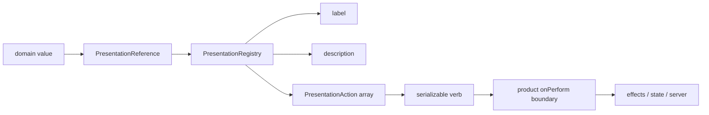
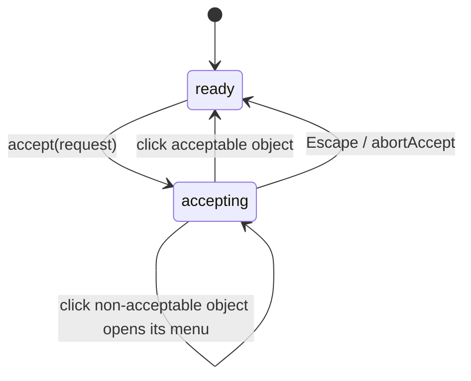

# PBUI itself: core presentation system, components, chrome, accessibility and design-system code review

## 0. Reader contract and scope

This document reviews **PBUI itself**, the root `@hyperslop-systems/pbui` package. It does not treat the chat runtime or the workbench document model as part of the core. Those are reviewed separately in documents 04 and 05.

PBUI core is two related things:

1. A **typed object-interaction grammar**. Products define value types, descriptors and serializable verbs. PBUI turns references to those values into focusable presentations with a default gesture, a right-click object menu, accept mode and self-documenting mouse/keyboard hints.
2. A **small React design system and shell toolkit**. It provides atoms, molecules, organisms, dialogs, tile chrome, launcher mechanics, drag behavior, tokens and stylesheet wiring without taking ownership of product state or routing.

The review is anchored at commit `e21343b` for source line references and at `328d4c2` for the first review evidence commit. The reproducible inventory is `various/11-review-inventory.md`: 132 production files / 7,437 lines, 12 test files / 96 passing tests, and 41 TSX implementations with 41 Storybook stories. Browser evidence is in `various/18-launcher-focus-after-escape.json` and `various/19-object-menu-focus-after-escape.json`.

## 1. Executive summary

PBUI has a strong conceptual center: **everything nameable becomes an object, and every action on that object is data**. The implementation reflects that center unusually well. `PresentationAction.disabledBecause` makes availability and its explanation one value; `Presentation.activate` makes the default verb and its documentation one value; `inComposite` gives a presentation one explicit way to yield keyboard semantics to a tree/grid/listbox. These contracts are not decorative types: their comments document defects the old shapes permitted, and their tests pin behavior.

The core is mature enough to be depended on, but not yet finished as an accessibility-grade interaction substrate. The most important defect found by this review is not visual: **Dialog and ObjectMenu move focus into themselves and do not return it when they close**. In the live demo, Escape from the launcher and Escape from a keyboard-opened object menu both left `document.activeElement === document.body`. A keyboard user loses their place after every modal/menu cancellation.

The second important issue is API consistency. Components such as `Button`, `TextInput` and `SelectInput` extend native element attributes and forward them. `Text` and `Toolbar` enumerate a narrow set and silently drop `aria-*`, `data-*`, event handlers and other native attributes. The package's own multi-agent reviewer guide already records this as dependency defect B8. This makes instrumentation and accessible labeling depend on wrapper elements rather than the component API.

### 1.1 Findings at a glance

| ID | Severity | Finding | Evidence |
|---|---:|---|---|
| C1 | **High** | Dialog and ObjectMenu do not restore focus to the invocation target | `Dialog.tsx:20-103`; `createPbui.tsx:468-571`; live artifacts `18` and `19` both report `activeTag: BODY` |
| C2 | **High** | Structural/polymorphic components inconsistently drop native `aria-*`, `data-*` and handlers | `Text.tsx:13-65`; `Toolbar.tsx:11-42`; contrast `Button.tsx:56-92` and `TextInput.tsx:56-89` |
| C3 | Medium | Escape-surface ordering is registration-order, and simultaneous nested surfaces close in the wrong order | `surfaces.ts:1-136`; explicitly demonstrated by `surfaces.test.tsx` |
| C4 | Medium | `createPbui.tsx` is a 679-line interaction monolith with five responsibilities and page-global effects | inventory; symbols at `createPbui.tsx:178,203,293,468,586,618` |
| C5 | Medium | Accept requests have no owner cancellation/timeout and a Provider unmount can strand an awaiting caller | pending ref and `accept`/`settle` at `createPbui.tsx:212-245` |
| C6 | Medium | Async verb execution has no busy/error state in ObjectMenu; repeat clicks and rejected promises are delegated entirely to products | `PbuiProviderProps.onPerform`; menu action at `createPbui.tsx:551-569` |
| C7 | Low | ObjectMenu positioning assumes a 300×340 box instead of measuring rendered bounds | `createPbui.tsx:503-504` |
| C8 | Low | Global Escape ownership is intentionally module state; tests require explicit reset and multi-bundle semantics must remain guarded | `surfaces.ts:42-70,129-136` |

### 1.2 What is already strong

- All 41 core TSX implementations have stories; all three Storybook/build/package smoke checks passed.
- Token coverage, stylesheet reachability and cascade order are enforced from source rather than `dist` (`tokens-defined.test.ts`, `styles-wiring.test.ts`).
- A clean packed consumer built successfully with one React 19.2.8 instance (`pnpm consumer:smoke`).
- Transient Escape ownership, composite semantics, click propagation, disabled reasons and keyboard parity have targeted regression tests.
- Chrome is document-model-neutral: `TileFrame`, `LauncherShell` and `useTileDrag` accept callbacks and DOM geometry rather than importing the workbench.
- PBUI remains state-manager-neutral. Product state, routing and effects are injected, not hidden in the package.

## 2. The core mental model

### 2.1 Values, references, descriptors and verbs

A product supplies four pieces:

- **Values** — a TypeScript map from presentation type to value shape.
- **Reference** — `{ type, value }`, a discriminated union derived from that map (`types.ts:4-17`).
- **Descriptor** — label, optional description, optional actions and optional tone (`types.ts:113-119`).
- **Verb** — product-owned serializable data carried by each action.

```ts
interface Values {
  person: { id: string; name: string };
  order: { id: string; total: number };
}

type Verb =
  | { kind: "person.email"; personId: string }
  | { kind: "order.open"; orderId: string };
```

The registry is deliberately boring. `createPresentationRegistry` closes over a descriptor map and provides `labelFor`, `describeFor`, `actionsFor`, `toneFor` and `has` (`registry.ts:13-75`). Missing descriptors degrade to a fallback label and raw description rather than crashing.



The important boundary is the last one. PBUI does not execute product effects. `PbuiProviderProps.onPerform` is required (`createPbui.tsx:35-49`) so a menu cannot render working-looking commands that silently disappear.

### 2.2 Presentation is behavior, not decoration

`Presentation` (`createPbui.tsx:293`) renders a span/div/SVG group with:

- object identity in `data-ptype`;
- descriptor tone in `data-tone`;
- standalone `role="button"` and `tabIndex=0`, unless inside a composite;
- right-click / ContextMenu / Shift+F10 object-menu behavior;
- left-click / Enter / Space behavior;
- accept-mode interception;
- mouse/focus documentation.

The click precedence is:

```text
if event was already handled by an inner Presentation:
    ignore
else mark native event handled

if this reference satisfies the active accept request:
    stop propagation
    resolve the request
else if activate is present:
    run activate.run if supplied
    allow the host row to see the click
else:
    stop propagation
    open the object menu
```

`Symbol.for("pbui.presentation.handled")` makes nested presentations and even duplicate PBUI bundles agree about which presentation owned a click (`createPbui.tsx:58-65,346-379`). Keyboard activation calls `.click()` so mouse and keyboard take the same path (`createPbui.tsx:397-433`). This is exactly the kind of subtle semantic that should remain centralized.

### 2.3 Accept mode

`pbui.accept({ types, prompt, filter? })` returns a promise. While it is pending:

- the AcceptBanner announces a page-wide mode;
- acceptable presentations carry `data-state="acceptable"`;
- a left click resolves the promise with the reference;
- conversions may turn one reference type into another;
- Escape resolves it with `null`.



Only one request can be pending. A second caller receives `null` immediately (`createPbui.tsx:228-239`). This is safe against overlapping modes, but the API does not expose cancellation ownership. A component that starts an accept and then unmounts leaves its promise pending until some unrelated user action or global Escape settles it.

### 2.4 Object menu and mouse documentation

`ObjectMenu` reads actions at render time from the current environment. Disabled actions remain visible with `disabledBecause`, teaching the rule instead of hiding the verb. Arrow keys move among enabled entries. `MouseDocLine` exposes the current default gesture visibly and in a polite live region. `AcceptBanner` exposes the modal interaction change in an assertive live region.

This self-documenting behavior is a genuine PBUI differentiator. It also means focus handling is foundational: the menu and banner are not optional ornamentation; they are the keyboard path into the object grammar.

## 3. Component and chrome architecture

### 3.1 Layers

```text
foundation  Text · CodeText · Divider · Kbd · VisuallyHidden
atoms       Button · IconButton · TextInput · SelectInput · Chip · Meter …
molecules   Callout · EmptyState · InlineRename · DiffHunk · FileDropZone …
organisms   FileBrowser · RadarPanel · TransportBar · BackdropPanel
layout      Surface · Stack · Toolbar · AppBody
chrome      LauncherShell · TileFrame · useTileDrag · shortcut routing
protocol    createPbui / Presentation / ObjectMenu / AcceptBanner / MouseDocLine
```

The layers are conventions rather than runtime dependencies, but the source tree makes ownership legible. The strongest organisms remain product-neutral: `FileBrowser` accepts roots, load states, controlled expansion/selection and verb callbacks; it does not fetch or mutate a filesystem.

### 3.2 Chrome is callback-oriented

`TileFrame` has no workbench-document import. It receives a title slot, tone, close/split callbacks, drag grip and drop zone (`TileFrame.tsx:19-66`). `LauncherShell` receives grouped rows, query state and choice callbacks (`LauncherShell.tsx:24-56`). `useTileDrag` owns only DOM element registration, hit testing and pointer lifecycle (`useTileDrag.ts:84-202`).

This separation is correct. It lets the workbench use the same chrome while preserving a testable, reusable shell.

### 3.3 Styling and theming

`src/index.ts` is also the CSS assembly definition:

1. zero-specificity token defaults;
2. zero-specificity presentation fallbacks;
3. CSS modules pulled in by exports;
4. public part styles imported last to win equal-specificity ties.

`tokens.css` defines every no-fallback `--pbui-*` read. Product roots override it because defaults use `:where(:root)` at zero specificity. Tests prove no token is undefined, no top-level stylesheet is orphaned, every CSS module is imported, and the parts sheets come after component modules.

The package also ships `pbuiVite()` to deduplicate React for `link:` development. This is a good example of packaging knowledge traveling with the package rather than living in a product README.

## 4. API reference for an intern

### 4.1 Presentation API

| API | Contract | Review note |
|---|---|---|
| `createPresentationRegistry(descriptors)` | Pure descriptor lookup plus fallbacks | Stable and intentionally small |
| `createPbui(options)` | Produces bound Provider and components | Currently a large single module |
| `pbui.Provider` | Environment + required `onPerform` + optional `onAccept` | Product effect boundary |
| `pbui.Presentation` | Object semantics, menu, accept, activation, docs | Most load-bearing component |
| `pbui.ObjectMenu` | Current object's actions, keyboard navigation | Needs focus return |
| `pbui.AcceptBanner` | Announces page-wide accept mode | Uses Escape ownership stack |
| `pbui.MouseDocLine` | Visible and screen-reader interaction docs | Product chooses placement |
| `pbui.usePbui()` | Current environment and interaction state | Throws outside Provider |
| `presentationTypes(...)` | Type-safe list helper | Convenience only |

### 4.2 Chrome and surface API

| API | Purpose | State ownership |
|---|---|---|
| `Dialog` | Non-destructive modal + focus trap | Mounted = open; caller closes |
| `useEscapeSurface(open, id?)` | Register global Escape precedence | Module-global stack |
| `LauncherShell` | Search/listbox/dialog mechanics | Query and choose callbacks belong to product |
| `TileFrame` | Tone bar, drag grip, split/close controls | No layout state |
| `useTileDrag` | Pointer drag registry and hit testing | Transient module + hook state |
| `routeWorkbenchKey` | Pure Mod+K arbitration | Caller supplies context |

### 4.3 Native-prop policy today

There are two incompatible patterns:

```ts
// Native-preserving
interface ButtonProps extends Omit<ButtonHTMLAttributes<HTMLButtonElement>, "type"> {}
function Button({ ...rest }) { return <button {...rest} />; }

// Native-narrowing
interface TextProps { title?: string; className?: string; id?: string; /* ... */ }
function Text(props) { return <Tag className=... title=... id=... />; }
```

The second pattern is why `<Text aria-label="…" data-testid="…">` does not type-check and a cast/wrapper loses the attribute at runtime. This is not merely a testing inconvenience; polymorphic components need the native accessibility surface of the element they render.

## 5. Detailed findings

### C1 — High: transient surfaces lose the user's focus location

`Dialog` captures no invocation element and performs no cleanup focus (`Dialog.tsx:20-103`). `ObjectMenu` focuses its first enabled button when opened, but closing only changes state (`createPbui.tsx:477-497`). In the browser:

```json
{ "activeTag": "BODY", "launcherPresent": false }
{ "activeTag": "BODY", "activeType": null, "menuPresent": false }
```

The second probe began by focusing `[data-ptype="workspace"]`, opened its menu with Shift+F10, then pressed Escape. The workspace did not regain focus.

**Why it matters.** After Escape, the next Tab starts from document order rather than from the object the user was operating. In a large workbench this can jump across dozens of controls. Screen-reader virtual position and keyboard focus also diverge.

**Recommended contract.** A transient surface should remember the focused element when it opens and restore it if still connected when it closes. A caller may override the return target when the action intentionally navigates elsewhere.

```ts
function useReturnFocus(open: boolean, explicit?: HTMLElement | null) {
  const previous = useRef<HTMLElement | null>(null);
  useLayoutEffect(() => {
    if (!open) return;
    previous.current = explicit ?? (document.activeElement as HTMLElement | null);
    return () => {
      const target = previous.current;
      if (target?.isConnected) queueMicrotask(() => target.focus());
    };
  }, [open, explicit]);
}
```

For ObjectMenu, store the invocation element in `MenuState`, not only coordinates. Pointer opening may focus the presentation first or explicitly pass `event.currentTarget`; keyboard opening already has it.

### C2 — High: native element attributes are inconsistently available

`Text` supports `as: ElementType` but not the props of that element. `Toolbar` supports `as: "div" | "header" | "nav"` but cannot receive `aria-label`, so a `<Toolbar as="nav">` cannot be named without a wrapper. The chat review's known defect B8 observed this in production for `aria-label` and `data-*`.

**Recommended contract.** Use a typed polymorphic helper for public primitives and forward remaining props after controlled fields.

```ts
type PolymorphicProps<T extends ElementType, Own> =
  Own & { as?: T } & Omit<ComponentPropsWithoutRef<T>, keyof Own | "as">;

function Text<T extends ElementType = "span">({ as, ...props }: PolymorphicProps<T, TextOwnProps>) {
  const Tag = as ?? "span";
  const { size, tone, strong, prose, truncate, className, ...native } = props;
  return <Tag {...native} className={classes(...)} />;
}
```

Guard against API overreach: forward native semantics, not arbitrary styling knobs. PBUI may continue controlling `className` composition and tokenized visual variants.

### C3 — Medium: Escape ordering has a documented wrong case

The stack orders by effect registration. Child effects run before parent effects, so simultaneously mounted nested dialogs seat the outer dialog on top. The test explicitly expects Escape to close the outer and take the inner with it. That honesty is good; the behavior is still wrong if nested surfaces become real.

**Recommendation.** Keep the simple stack until a real nested surface exists, but promote the constraint to public Dialog documentation and fail a development assertion if a dialog is mounted inside another dialog in the same commit. If nesting becomes supported, register DOM nodes and rank by top-layer/containment rather than effect order.

### C4 — Medium: the interaction runtime is too concentrated

`createPbui.tsx` is 679 lines and owns:

- store/context state;
- accepted-reference conversion;
- presentation event semantics;
- menu rendering and positioning;
- mouse docs;
- accept banner;
- page-global event subscriptions.

This does not make it incorrect. It makes review coupling high: a focus fix, menu geometry fix and accept cancellation fix all touch the same file.

**Recommended internal split, with no public API change:**

```text
presentation/createPbui.tsx          factory + returned API only
presentation/PbuiProvider.tsx        state machine/context
presentation/Presentation.tsx        event semantics
presentation/ObjectMenu.tsx          menu/focus/position
presentation/AcceptSurface.tsx       banner + cancellation
presentation/MouseDocLine.tsx        documentation view
presentation/acceptedReference.ts    pure conversion/filter helper
```

Do this only behind behavior tests; do not redesign the public API simultaneously.

### C5 — Medium: accept-mode lifetime is not tied to its caller

An `accept()` promise survives until selection or global abort. There is no `AbortSignal`, owner token or timeout. If a component starts accept and unmounts, its continuation may execute later against dead state, or never settle.

**Recommendation.** Add optional cancellation without changing the simple call:

```ts
accept(request, { signal } = {}): Promise<Reference | null>
```

Abort settles with `null`. Provider unmount settles any pending request. Keep the one-request rule.

### C6 — Medium: action execution has no in-core feedback

ObjectMenu closes immediately and calls `onPerform`. It does not guard repeat invocations, mark an action busy, or surface a rejected promise. PBUI correctly refuses to own product error UX, but the interaction boundary should at least make failure observable.

Options:

1. Keep `onPerform: void | Promise<void>` and add `onPerformError(error, verb)` to Provider.
2. Return a small result (`performed | rejected`) and let the menu announce rejection.
3. Keep the core unchanged and require every product router to absorb failures into trace/toast state.

**Decision proposed:** option 1. It preserves domain neutrality while ending unhandled promise rejection as an implicit contract.

### C7 — Low: menu bounds are guessed

The menu clamps x against `innerWidth - 300` and y against `innerHeight - 340`, but action count, labels, localization and zoom change actual dimensions. Measure after render and reposition using the menu's bounding box. Prefer CSS `position-try` only when browser support fits the product baseline.

## 6. Design decisions

### Decision: Preserve the typed object grammar

- **Context:** Findings could tempt a rewrite toward generic command/menu components.
- **Options considered:** generic command registry; headless menu only; keep typed references/descriptors/verbs.
- **Decision:** Keep the current object grammar.
- **Rationale:** It unifies human menus, agent-visible verbs, trace data and object mentions with one serializable vocabulary.
- **Consequences:** Product descriptors remain explicit; PBUI must maintain strong keyboard/focus behavior because it owns the interaction grammar.
- **Status:** accepted.

### Decision: Forward native semantics from polymorphic primitives

- **Context:** `Text` and `Toolbar` cannot express native accessible naming or instrumentation.
- **Options considered:** add individual props as requested; `...rest: any`; typed polymorphic native props.
- **Decision:** Typed native forwarding.
- **Rationale:** It is extensible without forfeiting type safety or tokenized visuals.
- **Consequences:** Type definitions become more advanced; compile-only API tests are required.
- **Status:** proposed.

### Decision: Focus return belongs to the surface primitive

- **Context:** Every consumer otherwise reimplements it, and most will forget.
- **Options considered:** caller-only; Dialog/ObjectMenu internal; one global focus manager.
- **Decision:** Internal by default with an override for navigation.
- **Rationale:** The surface is the layer that steals focus and knows when it closes.
- **Consequences:** Object menu state must remember an element/ref, not just coordinates.
- **Status:** proposed.

### Decision: Refactor internals without changing public behavior

- **Context:** `createPbui.tsx` is large but behavior-sensitive.
- **Options considered:** leave monolith; public API redesign; internal extraction.
- **Decision:** Internal extraction after focus and cancellation tests exist.
- **Rationale:** Lowers review coupling without combining refactor and behavior changes.
- **Consequences:** Keep returned `pbui.*` symbols stable.
- **Status:** proposed.

## 7. Testing and validation strategy

### 7.1 Existing gates that should remain required

```bash
pnpm --include-workspace-root --filter @hyperslop-systems/pbui test
pnpm --include-workspace-root --filter @hyperslop-systems/pbui typecheck
pnpm --include-workspace-root --filter @hyperslop-systems/pbui build
pnpm --include-workspace-root --filter @hyperslop-systems/pbui build-storybook
pnpm consumer:smoke
pnpm pack:check
```

All passed during this review. The consumer smoke is especially valuable because it verifies the packed surface and duplicate-React requirement, not merely workspace resolution.

### 7.2 Missing focused tests

Add tests that fail today:

- focus returns to the launcher button after Escape;
- focus returns to a keyboard-invoked Presentation after ObjectMenu Escape;
- choosing a navigation action may override focus return;
- `Text as="nav" aria-label="…"` and `Toolbar as="nav" aria-label="…"` compile and render the attribute;
- Provider unmount resolves a pending accept with `null`;
- ObjectMenu repositions based on measured size at viewport edges;
- `onPerformError` observes a rejected async action if that API is accepted.

### 7.3 Accessibility validation

Storybook currently includes the a11y addon, but a successful static build is not an accessibility test run. Add interaction tests or a browser runner for:

- tab order before/open/after Dialog;
- menu arrow navigation and return focus;
- accept-mode announcement and cancellation;
- high zoom / narrow viewport menu bounds;
- FileBrowser roving active descendant with a Presentation row;
- reduced motion and forced-colors behavior.

## 8. Phased remediation plan

### Phase C0 — Correct keyboard continuity

1. Add failing Dialog and ObjectMenu focus-return tests.
2. Implement a reusable return-focus hook.
3. Give `MenuState` an invocation element or stable focus target.
4. Validate mouse, keyboard and action-navigation close paths in the demo.

### Phase C1 — Normalize native prop contracts

1. Define one typed polymorphic-props helper.
2. Migrate `Text`, `SectionLabel`, `Toolbar`, `Stack`, `Surface` and similar structural primitives.
3. Add compile/render API tests for `aria-*`, `data-*`, refs and event handlers.
4. Document which props PBUI intentionally owns and overrides.

### Phase C2 — Make interaction lifetime explicit

1. Add optional abort support to `accept`.
2. Settle pending accept on Provider unmount.
3. Add Provider-level async action error reporting.
4. Decide whether menu actions need a busy state or whether product routing remains responsible.

### Phase C3 — Internal extraction

Extract `createPbui.tsx` by responsibility with zero public API drift. Keep all existing tests and add render-count/identity tests where context value stability matters.

### Phase C4 — Surface and geometry hardening

Measure menu bounds, document nested-surface constraints, and add a browser accessibility regression lane.

## 9. Intern checklist: adding a PBUI object safely

1. Add the value type to the product's `Values` map.
2. Add a descriptor with a stable label and structured description.
3. Define actions as serializable verbs; never call effects from the descriptor.
4. Use `disabledBecause`, not hidden unavailable actions, for short object menus.
5. Route verbs through the product's one effect boundary.
6. Render the value with `Presentation`; use `inComposite` inside tree/grid/listbox items.
7. Give `activate` one object containing both behavior and documentation.
8. Test right-click, Shift+F10, Enter/Space, accept mode and focus return.
9. Add a Storybook story for default, unavailable and accept-mode states.
10. Use CSS variables/tokens; add every new no-fallback token to `tokens.css` in the same change.

## 10. Risks and open questions

- Should `PresentationReference` include a first-class stable `id`, or should identity remain inside each value? Chat introduces a wire reference with `{type,id,value}` and pays conversion casts; changing core is broad and needs its own design.
- Should `tone` remain open string data, or should the package distinguish semantic tones from CSS token references?
- Does SVG Presentation need a separate accessibility contract? `role`, `tabIndex` and focus behavior differ across SVG/browser combinations.
- Should Dialog use native `<dialog>` once its top-layer and focus behavior meet the browser baseline?
- Is the page-global Escape stack expected to coordinate separate package versions, as click handling does with `Symbol.for`? Current module state coordinates only one loaded module instance.

## 11. Evidence and references

### Key source files

- `src/presentation/types.ts:4-143` — references, actions, descriptors, accept/menu state.
- `src/presentation/registry.ts:13-75` — registry API and fallback behavior.
- `src/presentation/createPbui.tsx:178-669` — factory, state and interaction components.
- `src/surfaces.ts:1-136` — Escape stack.
- `src/components/Dialog/Dialog.tsx:20-103` — modal/focus trap.
- `src/components/foundation/Text/Text.tsx:13-65` — narrow polymorphic API.
- `src/components/layout/Toolbar/Toolbar.tsx:11-42` — narrow structural API.
- `src/components/atoms/Button/Button.tsx:56-92` — native forwarding contrast.
- `src/chrome/LauncherShell.tsx:24-181` — launcher mechanics.
- `src/chrome/TileFrame.tsx:19-132` — model-neutral tile chrome.
- `src/chrome/useTileDrag.ts:84-202` — DOM drag registry.
- `src/index.ts` — public surface and CSS order.
- `src/tokens.css` and `src/styles-wiring.test.ts` — theme contract and guards.

### Review artifacts

- `various/11-review-inventory.md` — scope/coverage inventory.
- `various/18-launcher-focus-after-escape.json` — Dialog focus loss.
- `various/19-object-menu-focus-after-escape.json` — ObjectMenu focus loss.
- `various/20-browser-console-warnings.txt` — no browser errors/warnings in the exercised flow.
- `various/29-review-line-anchors.txt` — reproducible symbol anchors.

### Related ticket docs

- `design-doc/04-…` — JavaScript API and workbench interaction review.
- `design-doc/05-…` — agent framework and helper-tile review.
- `design-doc/02-…` — original author self-review and known shortcut inventory.
- `reference/01-diary.md`, Step 9 onward — investigation chronology and exact validation evidence.
