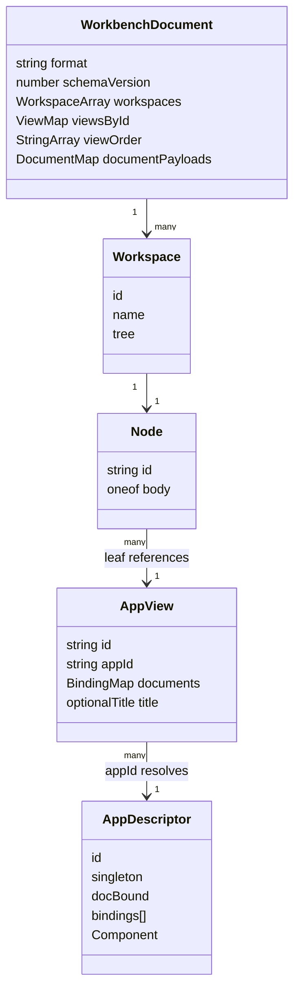
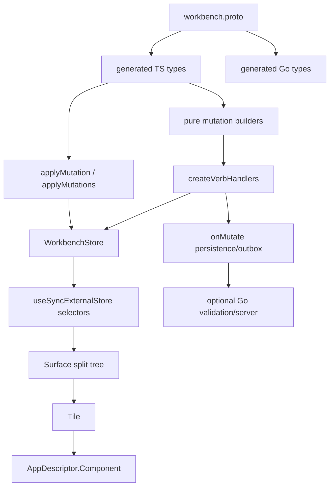

# PBUI JavaScript API and interaction: workbench, protocol, verbs, state and integration code review

## 0. Scope and relationship to the other reviews

This document reviews the JavaScript/TypeScript API that turns PBUI's object grammar into a mutable tiled workbench. It covers two packages:

- `@hyperslop-systems/workbench-protocol` — generated protobuf types plus a React-free, store-free structural mutation layer.
- `@hyperslop-systems/pbui-workbench` — application descriptors, local state, high-level verbs, launcher policy hooks and React rendering.

Document 03 explains presentations, menus, components and chrome. Document 05 explains chat, agents and helper tiles layered on this workbench.

Evidence is from commit `e21343b`, fresh protocol/workbench tests and typechecks, `make protocol-check`, Storybook builds, and live workbench interaction. The inventory reports 33 production files / 4,047 lines, nine test files / 115 workbench tests plus 44 protocol tests. The largest file is `pbui-workbench/src/verbs.ts` at 894 lines.

## 1. Executive summary

The JavaScript design has a sound separation of concerns:

1. A **wire document** stores workspaces, logical views, placement trees and document payloads.
2. A **pure applier** clones and structurally applies typed mutations.
3. A **store** atomically commits a batch and distinguishes mutation rejection from post-commit hook failure.
4. **High-level verbs** translate user intent into protocol batches and local UI state changes.
5. **React components** render one workspace's split tree and invoke those same verbs.
6. A product router may carry the verb as data, trace it and hand it to `performWorkbenchVerb`.

The view/placement distinction is the strongest design choice. A view says *what* an app shows; a placement says *where* that view appears. Two placements can link one view without duplicating its state. Doc-bound applications de-duplicate by bindings, and singletons de-duplicate by app id.

The highest API defect is small but consequential: `performWorkbenchVerb` returns `boolean` specifically so an agent-facing router can report a refusal, and `createWorkbench().perform` actually returns that boolean at runtime — but the public `Workbench` interface types `perform(verb): void` (`types.ts:90`). Consumers using the public object are told to discard the outcome the implementation's own comments call load-bearing.

The second high-risk issue is wholesale document replacement. `restore()` validates serialized input with `parseDocument`; public `store.replaceDocument(document)` accepts any typed object without structural or semantic validation. The earlier ticket's live debugging twice persisted an invalid hand-built document that blanked the page. TypeScript type compatibility is not runtime graph validity.

The architecture also contains duplicated intent logic: the protocol package's `createWorkbenchClient` and the workbench package's `createVerbHandlers` both implement placement/link/replace/default-binding behavior. The workbench implementation has fixes and policies the older client does not. This is a drift boundary that should be collapsed or explicitly deprecated.

## 2. Workbench vocabulary for a new intern

### 2.1 Document, workspace, view, placement and app

These words are not interchangeable:

- **WorkbenchDocument** — serializable root, format/schema version, workspaces, views, view order and domain documents.
- **Workspace** — a named split tree. Which workspace this browser currently shows is local state and not serialized into the document.
- **AppView** — a logical instance of an application: id, app id, document bindings and optional custom title.
- **Placement / Node** — where a view appears. A leaf references one view; a split has direction, ratio and two children.
- **AppDescriptor** — executable JavaScript catalog entry: title, tone, singleton/doc-bound behavior and React component.
- **DocumentPayload** — product data included in the workbench protocol and referenced by a view binding.



A linked view is the case where two or more leaves reference the same AppView. Editing application state keyed by view then updates both placements. A duplicated view has a new AppView id and independent state.

### 2.2 Why the protocol is protobuf

`workbench.proto` defines the document and every mutation once for Go and TypeScript. Buf generates Go under `gen/go` and TypeScript under `packages/workbench-protocol/src/generated`. JSON serialization uses protobuf JSON (`toJson`/`fromJson`), not an ad hoc object codec.

Benefits:

- stable field names and oneof semantics;
- generated types on both sides;
- mutation fixtures can prove TypeScript/Go parity;
- browser and server can exchange the same batches;
- integer/revision evolution has a declared schema.

The limitation is equally important: the TypeScript applier is **structural only**. The Go server performs full graph/catalog/limits/security validation after applying. Local success is optimistic, not proof the server will accept the batch (`client/apply.ts:1-17`).

## 3. Architecture from data to pixels



### 3.1 Protocol mutation layer

`applyMutation` clones the document and handles each oneof arm (`apply.ts:65-344`). `MutationError` carries stable `code`, `path` and `detail`, matching Go. `applyMutations` applies left-to-right and returns only after the full batch succeeds (`apply.ts:347-353`). Because intermediate documents remain local variables, a throw leaves the caller's original document untouched.

Representative mutation arms:

- workspace create/rename/delete;
- document put/delete;
- view create/configure/clone/delete/close;
- placement replace/split/close;
- split resize.

Pure query/build helpers (`builders.ts`) find leaves, count placements, locate workspaces and produce mutation batches for split/close/swap/dock.

### 3.2 Store layer

`createWorkbenchStore` holds:

```ts
interface WorkbenchState {
  document: WorkbenchDocument;
  workspaceId: string;
  activePlacementId: string | null;
  launcherOpen: boolean;
  launcherFrom: string | null;
}
```

The separation is correct: selected workspace, active tile and launcher state are this browser's transient state and do not belong in the shared document.

Mutation flow (`store.ts:101-137`):

```text
if batch is empty: return false
try nextDocument = applyMutations(current, batch)
catch MutationError:
    onRejected or console.warn
    return false
commit nextDocument
try onMutate(batch, nextDocument)
catch:
    onPostCommitError or console.error
return true
```

Post-commit errors do not turn success into failure. That matters for agents: retrying a committed mutation because local persistence failed would duplicate the visible change.

### 3.3 High-level verb layer

`WorkbenchVerb` is a union of user intent: split, close, swap, dock, activate, resize, place, rename, open/rebind/link/replace views, workspace lifecycle and launcher lifecycle (`verbs.ts:43-85`). `workbenchVerbs` builds data objects. `createVerbHandlers` translates those into mutation batches or local `setState` calls (`verbs.ts:376-795`). `performWorkbenchVerb` is the exhaustive dispatcher and returns whether anything changed (`verbs.ts:828-888`).

High-level verbs add policy not present in the protocol:

- singleton and non-duplicable handling;
- doc-bound de-duplication by exact binding set;
- geometry-based split direction;
- default document binding;
- view garbage collection;
- cross-workspace go-to;
- active-placement maintenance;
- split ratio clamp/snap.

### 3.4 React layer

`createWorkbench` composes app registry, store, verb handlers and three bound components (`createWorkbench.tsx:45-137`). `Surface` renders the selected workspace's recursive Node tree. `SplitPane` keeps pointer movement in local state and commits one mutation on release, avoiding persistence writes at pointer frequency. `Tile` resolves view and app, activates on pointer/focus capture, wires chrome verbs and isolates app render errors with a per-tile boundary.

This is a good performance shape:

```text
pointermove divider → component-local live ratio
pointerup           → one split.resize mutation → one document commit → one persistence call
```

## 4. Public API reference

### 4.1 Document helpers

| API | Meaning | Failure behavior |
|---|---|---|
| `emptyDocument(options?)` | Valid empty protocol root without workspace | Caller must add workspace before rendering/restoring |
| `tile(appId, options?)` | Declarative one-tile LayoutSpec | No catalog validation |
| `split(direction, ratio, a, b)` | Declarative split LayoutSpec | Ratio passed through to applier |
| `layout(spec, options?)` | One-workspace document through protocol mutations | Throws on mutation failure |
| `workspaces(list, options?)` | Multi-workspace document | Rejects empty list/duplicate explicit ids |
| `singleTile(appId, options?)` | Shortest renderable workbench | Creates one workspace |
| `serializeDocument(doc)` | Protobuf JSON string | Assumes typed input |
| `parseDocument(json)` | Basic usable graph or `null` | Catches JSON/protobuf/format/tree failures |
| `specOf(doc, node)` | Inverse tree description | Returns visible missing placeholders rather than throwing |

### 4.2 Workbench construction

```ts
const wb = createWorkbench({
  apps,
  initial: layout(...),
  splitPolicy: "duplicate" | "link" | { app: "launcher" } | fn,
  binding: { source: "program", defaultDocumentId, isBindable, unbound: ["launcher"] },
  onMutate: persistOrQueue,
  onRejected: reportMutationError,
  onPostCommitError: reportPersistenceFailure,
});
```

The returned object exposes registry, store, verb handlers, hooks, mutation/serialization methods, focus helpers and bound React components.

### 4.3 App descriptor

| Field | Meaning |
|---|---|
| `id`, `title`, `tone`, `Component` | Required catalog identity and rendering |
| `singleton` | At most one logical view; extra placements link |
| `duplicable` | Whether bare split duplicates; defaults to `!singleton` |
| `docBound` | View is of named documents; identical bindings de-duplicate |
| `bindings` | Required binding keys for callers/tools to validate |
| `titleFor(view)` | Dynamic tile title from bindings |
| `group`, `blurb`, `available` | Launcher policy/metadata |

The workbench intentionally still renders unavailable apps already present in a saved layout. Availability controls offering, not destructive filtering.

### 4.4 Workbench verb outcomes

Handlers return `boolean`, `string | null` or `number | null`. The dispatcher normalizes this to `boolean`. Callers should use that result when a verb originates from an agent or remote request; UI chrome attached to a live placement may ignore it.

## 5. Key interaction sequences

### 5.1 Open a doc-bound view

```text
openView(appId, documents, near?)
  app = registry.get(appId)
  if app.docBound:
      find existing view with exactly same bindings
      if found: goToView(existing.id), possibly switching workspace
  target = preferred placement, else active, else first leaf
  create AppView(appId, documents)
  create placementSplit beside target using rendered geometry
  commit [viewCreate, placementSplit] atomically
  activate new placement
```

### 5.2 Replace one linked placement

```text
replace(placementId, appId, documents?)
  resolve current view
  if target app is an existing singleton:
      link placement to existing view
  else if current view has one placement:
      viewConfigure in place (preserve view + placement identity)
  else:
      create new view
      placementReplace only this leaf
```

The placement-count branch prevents changing both linked twins when only one pane was replaced.

### 5.3 Dock drag

```text
pointerdown on TileFrame grip
  useTileDrag registers window move/up/cancel/blur
pointermove
  hit-test module registry of connected tile elements
  classify center or nearest edge
  render DropZoneOverlay with outcome label
pointerup
  center → swap placements
  edge   → [placementSplit at target, placementClose at source]
cancel/blur/unmount
  teardown with no mutation
```

### 5.4 Server-backed integration

A product with a server may use the same optimistic flow:

```text
user/agent verb
  → high-level handler builds Mutation[]
  → local structural apply
  → commit local document
  → onMutate appends batch to outbox
  → server re-applies + validates full graph/revision
  → accept revision OR conflict repair
```

The repository has Go validation and workbench API packages, but `pbui-workbench` itself remains local/server-free.

## 6. Detailed findings

### J1 — High: `Workbench.perform` hides the outcome its implementation returns

`performWorkbenchVerb(...): boolean` has a long comment explaining why the boolean is load-bearing for agent callers. `createWorkbench` assigns:

```ts
perform: (verb) => performWorkbenchVerb(verbs, verb)
```

but `Workbench` declares:

```ts
perform(verb: WorkbenchVerb): void;
```

A JavaScript caller receives the boolean at runtime. A TypeScript caller using the public type cannot inspect it. This is an API contract contradiction.

**Fix:** change the interface to `perform(verb): boolean` and add a compile/runtime public API test. This is a source-compatible improvement for callers that ignored the value; confirm semver policy for type-return widening.

### J2 — High: wholesale document replacement is an unsafe public door

`restore(json)` uses `parseDocument` before replacement. `store.replaceDocument(document)` does not validate. The earlier phase diary records two cases where a hand-built invalid document blanked the page and persisted through reload in a product adapter.

A TypeScript `WorkbenchDocument` may still be invalid at runtime:

- workspace without a tree;
- leaf references absent view;
- duplicate node ids;
- ratio out of range;
- invalid app/catalog or bindings;
- credential-like payload rejected by server validation.

**Recommended split:**

```ts
replaceDocument(input: unknown): Result<void, DocumentValidationError> // safe public
unsafeReplaceDocument(document: WorkbenchDocument): void               // internal/test adapter only
```

At minimum call a shared `validateUsableDocument` before state commit. `parseDocument` should expose its reason instead of only `null` for diagnostic callers.

### J3 — Medium-high: two configured client/verb implementations can drift

`workbench-protocol/src/client/builders.ts:300-468` implements `createWorkbenchClient`, including default binding, replace, link and split-with-app. `pbui-workbench/src/verbs.ts:376-795` independently implements richer versions of the same behavior.

Evidence of drift already appears in comments: workbench verbs contain fixes for cross-workspace doc-bound go-to, singleton `{app}` split policy, orphan cleanup and linked replacement. Maintaining both requires every bug fix to be recognized as shared.

**Decision needed:**

- Move policy-neutral batch construction into protocol/client and have workbench verbs call it; or
- mark `createWorkbenchClient` legacy/deprecated, migrate remaining products, then remove it.

Do not leave both as equally endorsed public APIs.

### J4 — Medium: local structural acceptance is easy to mistake for server validity

The applier's header documents the limitation, but `store.mutate()` returns plain boolean. A local product without a server is fine; a connected product needs an explicit optimistic/pending/confirmed state and conflict handling.

**Recommendation:** keep the pure applier, but document a reference outbox adapter and standard mutation lifecycle:

```ts
type MutationState =
  | { kind: "committed-local"; batchId: string }
  | { kind: "confirmed"; revision: bigint }
  | { kind: "conflict"; error: WorkbenchConflict };
```

### J5 — Medium: required app bindings are metadata, not enforced by direct UI verbs

`AppDescriptor.bindings` tells tools and descriptions what an app needs, but the workbench intentionally permits unbound placement because products may bind later. The direct `place`/`split` path can therefore render a legal but empty tile when no `binding` config supplies defaults.

This is a policy seam, not automatically a bug. It needs a clearer distinction:

- `placeDraft(app)` — allow unbound;
- `openView(app, bindings)` — enforce required keys;
- launcher should hide/disable apps it cannot bind, with a reason.

Agent tools already validate more aggressively; humans and agents should not get different truth from the same verb.

### J6 — Medium: repeated splitting has no usable minimum pane policy

`SplitPane` renders `minmax(0, ratio fr)`. Repeated `place()` calls split the current target 50/50. The live review placed Conversations, Events, Runs and Tools sequentially and produced columns narrow enough to show one or two characters per line (`various/26-all-helper-tiles-live.png`).

The workbench needs a policy before committing a split:

```text
measure target rectangle
predict both child rectangles at chosen ratio
if either child < minWidth/minHeight for app class:
    choose other direction, another target, a workspace, or refuse with reason
```

Do not hard-code one global pixel minimum without considering dense helper tiles versus editors. An app descriptor may optionally declare minimum useful dimensions, with conservative shell defaults.

### J7 — Medium: workspace selection clears the active placement and creates a sequencing hazard

`selectWorkspace` deliberately sets `activePlacementId: null`. This prevents hidden placements from receiving later global actions. A script that selects a workspace and immediately asks `activePlacementId()` gets null; the earlier review observed exactly this while arranging tiles.

The API should provide the next safe target:

```ts
selectWorkspace(id): { selected: boolean; firstPlacementId: string | null }
```

or `selectWorkspace` may activate the first leaf by explicit policy. Do not make consumers wait for React; the document already contains the leaf synchronously.

### J8 — Medium: no migration path beyond strict schema version 1

`parseDocument` rejects anything not `format === "pbui.workbench"` and `schemaVersion === 1`. Strict refusal is safer than guessing, but there is no migration registry. As soon as schema version 2 ships, every persisted local layout falls back unless each product adds its own migration before calling parse.

Add a central migration pipeline before changing the version:

```ts
migrateWorkbenchJson(raw): { json: unknown; from: number; to: number; warnings: string[] }
```

### J9 — Medium-low: `isWorkbenchVerb` is a namespace check, not validation

It accepts any object with a string kind matching `/^(tile|split|app|view|workspace|launcher)\./`. That is useful dispatch classification, but the name reads stronger than the contract. Untrusted data still needs schema validation.

Rename to `hasWorkbenchVerbNamespace` or add a real Zod/protobuf-backed validator and keep the coarse helper explicitly internal.

### J10 — Medium-low: package-level onboarding is missing

There is no `packages/pbui-workbench/README.md` or `packages/workbench-protocol/README.md`, even though both manifests include README in package files or are published surfaces. Root README mentions protocol development but not the model/API described here. The generated `.d.ts` comments are rich; an intern should not have to discover the system by opening an 894-line verbs file.

This document can seed both package READMEs, but ticket docs should not be the only consumer-facing reference.

### J11 — Low: `createVerbHandlers` is a maintenance hotspot

At 894 lines, `verbs.ts` combines types/builders, query helpers, mutation orchestration and workspace policies. Split by intent after J3 is decided:

```text
verbs/types.ts
verbs/placement.ts
verbs/view.ts
verbs/workspace.ts
verbs/launcher.ts
verbs/perform.ts
```

Keep one public barrel and exhaustive dispatcher.

## 7. Strengths worth preserving

### Atomic local batches

A failed mutation does not partially install. The store reports `MutationError` with stable code/path/detail.

### View/placement separation

Linking, duplication, singleton behavior and cross-workspace navigation follow from one model rather than component-local state.

### Local state outside shared document

Active tile, selected workspace and launcher mode do not pollute serialization or make browser tabs fight over cursor state.

### High-frequency interaction isolation

Divider drags and tile hit tests avoid dispatching/persisting on every pointer move.

### App render containment

One app error becomes one tile Callout with retry, not a blank workbench.

### Protocol parity

`make protocol-check` regenerated both languages with no diff, and mutation fixtures/tests passed.

## 8. Design decisions

### Decision: Keep protocol, intent and rendering as separate layers

- **Context:** Duplicate logic may invite collapsing everything into one state library.
- **Options considered:** component-owned layout; protocol-only low-level API; current layered design.
- **Decision:** Keep the layers, remove duplication within them.
- **Rationale:** Wire stability, pure testing, product policy and React rendering are distinct concerns.
- **Consequences:** Public docs must teach which layer to use.
- **Status:** accepted.

### Decision: One authoritative high-level mutation builder

- **Context:** `createWorkbenchClient` and `createVerbHandlers` overlap.
- **Options considered:** maintain both; protocol client authoritative; workbench verbs authoritative.
- **Decision:** Extract policy-neutral builders into protocol/client, leave app/DOM policy in workbench verbs, deprecate overlapping configured methods.
- **Rationale:** Shared structural behavior belongs below React while app catalog and geometry do not.
- **Consequences:** Requires migration tests proving identical batches.
- **Status:** proposed.

### Decision: Safe document replacement by default

- **Context:** Public typed inputs can be malformed at runtime and blank/persist the page.
- **Options considered:** trust TypeScript; validate graph; make unsafe path explicit.
- **Decision:** Validate public replacement and isolate unsafe replacement.
- **Rationale:** Layout persistence and agent mutation make runtime data untrusted.
- **Consequences:** Need structured validation errors rather than `null`.
- **Status:** proposed.

### Decision: Return outcomes from all intent doors

- **Context:** Agent routers need to distinguish no-op/refusal from performed.
- **Options considered:** throwing only; boolean; rich result.
- **Decision:** Fix `Workbench.perform` to return boolean now; consider rich result later without weakening current checks.
- **Rationale:** Matches actual dispatcher and minimizes change.
- **Consequences:** Public type and docs update.
- **Status:** proposed.

## 9. Testing strategy

### 9.1 Fresh evidence from this review

```text
workbench-protocol: 3 files, 44 tests passed
pbui-workbench:      9 files, 115 tests passed
both typechecks passed
pbui-workbench production build passed
pbui-workbench Storybook build passed
make protocol-check passed with no generated diff
```

### 9.2 Missing tests to add

- public `Workbench.perform` type/runtime outcome;
- safe rejection of malformed `replaceDocument` graphs;
- migration from one synthetic prior schema version;
- parity tests between overlapping protocol client and workbench verbs during consolidation;
- split refusal/alternate direction at minimum useful dimensions;
- select-workspace then place in one synchronous command sequence;
- launcher/Dialog focus return (shared with document 03);
- server conflict/outbox reference integration;
- app required-binding behavior for human launcher and agent tools.

### 9.3 Interaction smoke plan

1. Build a two-workspace layout.
2. Place singleton, duplicable and doc-bound apps.
3. Split, link, replace and verify linked identity.
4. Drag swap and edge dock.
5. Resize by pointer and keyboard.
6. Open launcher globally and per-pane.
7. Switch workspaces and go to a view across workspaces.
8. Serialize, reload, restore and compare descriptions.
9. Attempt malformed restore and verify the current layout remains.
10. Repeat at a narrow viewport and prevent unusable panes.

## 10. Phased roadmap

### Phase J0 — Correct public contracts

- Return boolean from `Workbench.perform` type.
- Rename/document `isWorkbenchVerb` as coarse classification or add validation.
- Add package READMEs from this guide.

### Phase J1 — Safe document boundary

- Extract graph validation with structured errors.
- Validate `replaceDocument` by default.
- Add migration registry and corrupt-storage preservation guidance.

### Phase J2 — Collapse duplicate client logic

- Inventory callers of `createWorkbenchClient`.
- Extract shared pure builders.
- Add parity tests.
- Deprecate/remove overlapping configured API in a declared version.

### Phase J3 — Layout usability policy

- Add app/shell minimum useful dimensions.
- Make placement target/direction selection geometry-aware.
- Return an actionable refusal instead of producing a sliver.
- Return a target placement from workspace selection.

### Phase J4 — Connected reference adapter

- Document/build an outbox adapter with revision/conflict states.
- Keep local-only `createWorkbench` simple.

### Phase J5 — Internal modularization

Split `verbs.ts` by intent after shared builders settle. Avoid a simultaneous behavior rewrite.

## 11. Intern implementation guidance

### Adding a new workbench verb

1. Decide whether it changes the shared document or local browser state.
2. Add the serializable union member and builder.
3. For document changes, express it as existing/new protocol mutations.
4. Return false/null on stale ids or refusal; never report a no-op as performed.
5. Update `describeWorkbenchVerb` in user language.
6. Add the dispatcher case.
7. Test mutation shape, document result, rejection and cross-workspace behavior.
8. If agent-visible, add vocabulary schema/docs and route outcome propagation.
9. Regenerate only if the protobuf itself changed.
10. Run protocol parity, package tests, typecheck and browser smoke.

### Adding an application

```ts
const app = defineApp({
  id: "program",
  title: "program",
  tone: "var(--pbui-tone-program)",
  singleton: false,
  duplicable: true,
  docBound: true,
  bindings: ["program"],
  titleFor: view => library.title(view.documents.program),
  Component: ProgramTile,
});
```

Then supply launcher rows for document choices; doc-bound apps are intentionally not placed without a document by the default launcher.

## 12. Risks and open questions

- Which products still use `createWorkbenchClient`, and what migration window is required?
- Should the workbench package expose a rich `PerformResult` with code/path/detail rather than boolean?
- Are minimum dimensions app metadata, layout policy or responsive component responsibility?
- How should schema migrations interact with protobuf unknown fields and server revisioning?
- Should app catalog validation move into the local safe document validator, or remain server-only?
- Should selected workspace persist through a generic workbench option rather than every product writing a subscription?
- Can `parseDocument` share Go's full validation catalog without coupling a local package to product app ids?

## 13. Evidence and references

### Core files

- `proto/hyperslop/pbui/workbench/v1/workbench.proto` — data and mutation schema.
- `packages/workbench-protocol/src/client/apply.ts:1-353` — structural applier.
- `packages/workbench-protocol/src/client/builders.ts:1-468` — queries/builders/configured client.
- `packages/pbui-workbench/src/document.ts:28-240` — layout dialect and codecs.
- `packages/pbui-workbench/src/store.ts:11-158` — state and commit semantics.
- `packages/pbui-workbench/src/apps.ts:1-124` — app descriptor/registry.
- `packages/pbui-workbench/src/verbs.ts:43-888` — intent API.
- `packages/pbui-workbench/src/createWorkbench.tsx:15-137` — composition/public object.
- `packages/pbui-workbench/src/types.ts:81-119` — public `Workbench` contract.
- `packages/pbui-workbench/src/components/{Surface,SplitPane,Tile}/` — rendering.
- `packages/pbui-workbench/src/tileDescriptor.ts:15-172` — tiles as PBUI objects.

### Review artifacts

- `various/11-review-inventory.md` — file/coverage inventory.
- `various/26-all-helper-tiles-live.png` — repeated split geometry producing narrow panes.
- `various/25-helper-tiles-placement.json` — verb results from live placements.
- `various/29-review-line-anchors.txt` — symbol anchors.

### Related documents

- `design-doc/03-…` — PBUI core and accessibility.
- `design-doc/05-…` — agent framework layered on the workbench.
- `reference/01-diary.md` — commands, failures and browser evidence.
