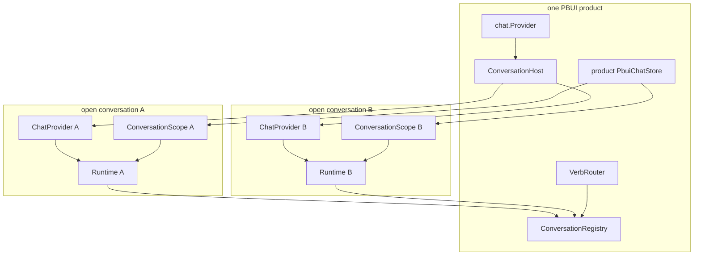
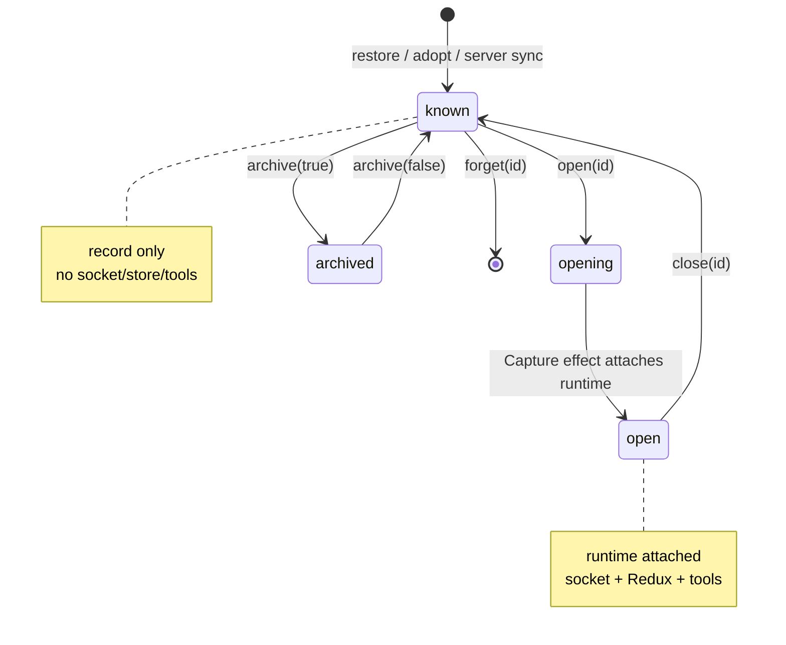
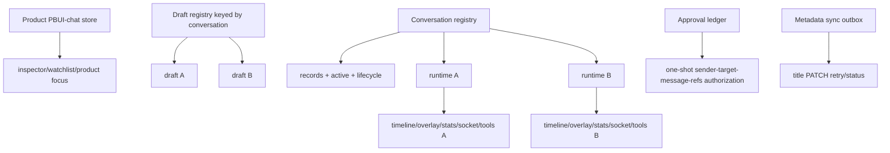

# Agent framework and tiles: multi-conversation runtime, routing, tools, server and helper-tile code review

## 0. Scope, evidence and how to read this

This document reviews the complete agent layer over PBUI and the workbench:

- `@hyperslop-systems/pbui-chat`;
- its Gold Coin Shop demo integration;
- `@go-go-golems/chat-provider` 0.5.0 where its public API constrains the design;
- the Go `pkg/chatserver` and `pkg/pbuichat` boundaries;
- the five multi-agent helper tiles.

Read §1–§4 for the system model. Read §5 for tile-by-tile behavior. Read §6 for API/flow references. Read **§7 first for review findings** if you are auditing rather than onboarding. §9 is the remediation architecture and §11 is the validation plan.

The original author review (`design-doc/02`) listed known shortcuts and dependency defects. This review used it as a lead list, then re-read code, ran 208 chat tests plus Go suites/typechecks/builds, built Storybook, restarted the current server and drove two live conversations in a browser. The live pass found defects not listed in the original review.

Evidence anchors:

- source baseline: commit `e21343b`;
- review evidence commit: `328d4c2`;
- inventory: `various/11-review-inventory.md` (199 production files / 18,265 lines in agent scope; 19 test files; only 7 stories for 45 TSX implementations);
- shared-draft proof: `various/14-shared-draft-defect.png` and `15-browser-probe-shared-draft.json`;
- closed-scope proof: `various/16-closed-conversation-stuck-opening-snapshot.md` and `17-closed-conversation-stuck-opening.png`;
- title-sync proof: `various/22-24`.

## 1. Executive summary

The multi-agent architecture has the right large-scale boundaries. A **conversation record** persists cheaply; an expensive **runtime** exists only while open; one product-wide router resolves a session per call; tool sets are instantiated per conversation so an asynchronous tool never guesses which model called it; cross-conversation tiles use registry mirrors and explicit multi-store subscriptions rather than merging all timelines into one store. These are sound decisions.

The implementation is nevertheless not ready to claim full multi-conversation isolation. The most severe live defect is that **every mounted composer uses the same product-wide draft**. With two chat tiles open, filling only the second textarea changed both textareas to `SECOND-ONLY-DRAFT-PROBE`. Sending from either clears both. The design made queued refs per conversation but left editable text and draft refs in one `PbuiChatStore`.

The second live defect is lifecycle ambiguity. Calling `conversations.close(activeId)` while its chat tile remains mounted removes its runtime; the tile and active trace tile then render `opening conversation…` forever. That label was designed for the one-frame gap between `open()` and provider attachment, but the same `runtime === null` condition also means deliberately closed. Archive uses close too, so it inherits the ambiguity.

The browser/server title contract is incomplete. Go exposes `PATCH /api/chat/sessions/{id}` so another browser can receive a title, and the docs say clients send one, but `registry.rename()` only patches local storage. A live rename produced no network request and the server list still contained no title.

The handoff approval gate is directionally correct but weaker than its documentation. It binds approval to target and prompt, which is better than id-only approval. It does not bind to the sending conversation, uses string-labeled proposal fields, scans all open conversations, and does not consume approval. The same approved id can authorize the same message repeatedly. There is no rate limit or cycle detection.

### 1.1 Ranked findings

| ID | Severity | Finding | Evidence |
|---|---:|---|---|
| A1 | **Critical** | Draft text and draft refs are shared across conversations | `Composer.tsx` reads `chat.store.draft`; one store at `createPbuiChat.tsx:146`; live artifacts `14-15` |
| A2 | **High** | Explicitly closed mounted scopes are stuck displaying `opening conversation…`; active followers also lose runtime | `ConversationScope.tsx:19-53`; registry close at `532-539`; live artifacts `16-17` |
| A3 | **High** | Human/agent rename never calls server PATCH, so second-browser title synchronization does not exist | registry `rename` at `541-545`; Go route `handlers.go:141`; no frontend PATCH; artifacts `22-24` |
| A4 | **High** | Handoff approval is reusable and not sender-bound; product check scans all conversations and is stringly typed | `conversationTools.ts:149-160`; demo `chat.ts:105-129` |
| A5 | **High** | Session list/title/message/tool/verb/WebSocket routes have no authentication or authorization | `server.go:222-236`; consistent with demo, unsafe for deployment |
| A6 | Medium-high | Runtime capture depends on one ChatProvider per open conversation and monkey-patches a client method it cannot fully observe | `ConversationHost.tsx`; `runtime.ts`; dependency lexical sync closure |
| A7 | Medium | Pending refs/focus can survive a failure before `sendMessageBody` and ride a later prompt | `sendTo` queues before `client.send`; dependency sync happens before body construction |
| A8 | Medium | No idle reaper or registry disposal; sockets, per-id toolsets and `beforeunload` listeners can accumulate | open/close API; `toolsByConversation`; registry line 664 |
| A9 | Medium | Closing drops mirrored run stats, so Runs cannot show closed conversations' last totals as designed | `detachRuntime` deletes mirror; record has no stats |
| A10 | Medium | Context manifest observability is partial and comments/contracts disagree with dependency behavior | runtime wrapper vs lexical `syncToolManifest`; Context tile workaround |
| A11 | Medium | Closing a conversation with waiting human tools silently clears local pending state rather than refusing or reporting cancellation | descriptor close has no waiting guard; chat-provider reset clears set only |
| A12 | Medium | No checked-in E2E and no stories for the five helper tiles; demo `pnpm test` fails because it has no test files | inventory; live command failure |
| A13 | Medium-low | Multi-store mirrors/selectors do O(transcript/tool calls) work on frequent store notifications and remain unprofiled | registry `mirrorOf/sync`; selectors `parkedSignature` |
| A14 | Low | Live token rate may be estimated but UI does not label it as an estimate | `streamRate`; upstream stats behavior |
| A15 | Low | Event family map is handwritten and can drift from Go/UI event vocabulary | `DEFAULT_EVENT_FAMILIES` |
| A16 | Low-medium | QuickJS/chat demo builds are heavy and emit browser-external and chunk-size warnings | `make chat-ui`; chat Storybook 2.08 MB worker |

## 2. System model

### 2.1 Session, conversation, runtime, scope and active conversation

- **Session** — server identity (`uuid`) and event stream.
- **Conversation** — browser record for a session: title, ownership, dates, pin/archive flags, counts and optional model/provider.
- **Runtime** — one chat-provider graph: Redux store, client, WebSocket manager, tool registry/runtime, widget registry and timeline adapters.
- **Scope** — React providers that make chat hooks read one runtime.
- **Active conversation** — registry id followed by singleton tiles and used when a verb/send names no conversation.



The last two arrows show A1: the product chat store intentionally serves product-wide inspector/watchlist/focus state, but Composer also takes its draft from that store.

### 2.2 What chat-provider builds

`ChatProvider` 0.5.0 creates, in one `useMemo(config)`:

```text
createChatStore
createToolRegistry
createWidgetRegistry
createTimelineAdapterRegistry + core adapters
createToolRuntime
createChatClient + createWsManager
install extensions
provide Redux + ChatRuntime contexts
```

One provider is one store and one overlay session id. Multi-session support therefore uses many providers rather than rewriting chat-provider slices.

The intended factory could not be built because `createToolRuntime` and its parse helpers are on disk but absent from every exported package path. `ConversationHost` renders one provider per `openIds()` and `Capture` dispatches the registry's session id before `connect()`, then attaches the graph to the registry (`ConversationHost.tsx:25-59`).

### 2.3 Conversation record/runtime lifecycle



The implementation currently has no explicit UI state for `known but intentionally closed`; `ConversationScope` collapses opening and closed into `runtime === null`.

### 2.4 Registry storage and mirrors

`createConversationRegistry` owns:

- `records: Map<id, ConversationRecord>`;
- `mirrors: Map<id, ConversationMirror>`;
- `runtimes`, store unsubscribers and stable configs;
- `openSet`, active id and requested rename id;
- stable snapshot/open-id caches;
- debounced localStorage persistence.

One subscription per runtime computes overlay status, run stats and waiting count, then folds message count, activity time, model/provider and auto title into the record (`registry.ts:382-425`). Cross-conversation UI reads small snapshots instead of subscribing to all Redux stores.

### 2.5 Product-wide and per-conversation state

Current ownership:

| State | Owner | Correct? |
|---|---|---|
| transcript, overlay, run stats | runtime Redux store | yes |
| socket/client/tool registry | runtime | yes |
| queued refs/focus for next send | `pending[conversationId]` | yes, except failure cleanup |
| draft text and draft reference map | one product PbuiChatStore | **no for multiple composers** |
| inspected object, watchlist, product focus | product PbuiChatStore | yes |
| conversation records/active id | registry | yes |
| layout/workspaces | workbench store | yes |
| debug events | shared debug store keyed by conversation id | yes |

## 3. Session-aware routing and trace attribution

The router is one per product because vocabulary and family handlers are product facts. Per call it resolves:

```ts
const conversation = binding?.conversation(options?.conversationId) ?? null;
```

It validates the verb, selects `local | agent | tool`, builds a context with actor, conversation id, client and runtime lookup, catches handler errors into `rejected:…`, then POSTs the outcome to that same session's `/verbs` endpoint (`createVerbRouter.ts:132-231`). Reports are serialized through `reportQueue` so client sequence order is stable.

The important await-safe closure:

```ts
sendToAgent: (template, refs, explicit) =>
  bound.sendToAgent(
    template,
    refs,
    explicit ?? (conversation ? { conversationId: conversation.id } : undefined),
  )
```

A handler may open accept mode and wait while the user activates another conversation. It still sends back to the conversation where the verb began.

### 3.1 Actor ownership

`RouterContext.actor` is not trace decoration. `conversation.rename` refuses an agent when `titledBy === "human"`. Human/agent ownership is enforced at the handler using the actor the router carries.

### 3.2 Routing caveat

Every call site inside a conversation must pass its id or run through a closure that does. Untargeted product surfaces intentionally use active. This remains an “all call sites” invariant; tests should include chips, object menus, frontend tools, program-generated intents and delayed accept handlers.

## 4. Tools and agent-to-agent handoff

### 4.1 Why tools are built per conversation

A frontend tool receives only signal and tool-call id. It does not receive session id. Ambient current-conversation state would race across awaits. `toolsFor(id)` creates workbench, sandbox and conversation tools whose `perform` closure supplies `{ actor: "agent", conversationId: id }` (`createPbuiChat.tsx:202-249`).

Each conversation therefore also gets its own workbench undo ring. This is defensible: “undo what you just did” should undo that agent's latest layout action rather than another agent's.

### 4.2 `conversation_list`

Returns browser-known conversations with:

- id/title;
- `isYou`, `isActive`;
- open/status/streaming;
- message count/activity/waiting;
- pin/archive/model when present.

It intentionally reads browser records rather than treating server index as authoritative.

### 4.3 `conversation_send`

Refusal ladder:

```text
policy deny
unknown target
self target
target closed
empty prompt
prompt too long
confirm policy without confirmation id
confirmation does not authorize target + prompt
router refuses conversation.send
```

The design correctly checks approval against target and prompt rather than proposal id alone. The demo implements approval by finding a `pbui_propose` tool call with matching string labels `to` and `message` and approved result.

### 4.4 Why the current gate is still insufficient

The check signature lacks sender:

```ts
isApproved(confirmationId, target, prompt): boolean
```

The demo scans every open runtime, so an approval found in conversation B can authorize A if ids collide or are attacker-controlled. More directly, no layer marks an approval consumed. Calling `conversation_send` repeatedly with the same id, target and prompt passes repeatedly. The original self-review's sentence that approval cannot be reused is not supported by code.

A production gate needs a ledger:

```ts
interface ApprovedHandoff {
  proposalId: string;
  senderConversationId: string;
  targetConversationId: string;
  promptDigest: string;
  refsDigest: string;
  approvedAt: string;
  consumedAt: string | null;
}

consumeHandoff(exactRequest): Result<ApprovedHandoff, Refusal>
```

Consumption must be atomic relative to send initiation. Refs belong in the binding too; approving a prompt while allowing arbitrary attached objects is not exact authorization.

## 5. Helper tiles, one by one

### 5.1 Conversations

**Purpose:** registry control plane. It lists records, creates/syncs, filters, toggles archived and renders each row as a `conversation` Presentation. Actions live in the product descriptor, not a row of buttons.

**Reads:** `registry.all()` snapshots.

**Writes:** conversation verbs for new/open/select/rename/pin/archive/close/forget; workbench verbs for Tools/Context views.

**Review notes:**

- re-renders on every mirror change of every conversation;
- rapid New clicks can mint multiple sessions;
- close/archive leaves mounted tiles in ambiguous state (A2);
- waiting count links to Tools but close does not guard waiting tools;
- rename remains local only (A3).

### 5.2 Events

**Purpose:** bounded, classified wire/UI debug stream per target conversation.

**Reads:** shared `ChatDebugEventStore` keyed by conversation id.

**Features:** follow active or pin target, family chips, text filter, pause snapshot, clear, copy JSON, raw event object menu.

**Strength:** ingestion classifier summarizes once; tile does not invent another event store.

**Review notes:** handwritten family aliases can drift; no helper-tile story; 300 rendered-row cap is visible while store cap defaults 1,000.

### 5.3 Runs

**Purpose:** cross-conversation model/provider/run/token/duration view with a live output rate and totals.

**Reads:** registry mirrors only.

**Strength:** does not subscribe directly to N stores.

**Review notes:** scripted engine supplies zero usage, so real token values remain unverified; rate may be estimated but unlabeled; closing deletes mirror stats (A9).

### 5.4 Tools

**Purpose:** “waiting for you” followed by every open conversation's tool calls, input/result/error/duration and go-to.

**Reads:** each runtime timeline plus tool registry/runtime pending state.

**Subscription design:** `useToolTraffic` subscribes to registry and current runtime stores, reattaching when runtime set changes. Per-runtime memo keys are entities identity, conversation title and parked signature; aggregate memo keys are snapshot/call-array identities.

**Strength:** the code explicitly solves stable snapshot identity and pending-human-tool changes not represented by timeline entities.

**Review notes:** the parked signature walks relevant calls for every selector invocation; store notifications may be frequent; closed conversations disappear from traffic even if unresolved state hydrates later.

### 5.5 Agent Context

**Purpose:** what one model can be offered and what the last browser send carried.

**Reads:** runtime tool registry, partial `lastManifest`, `lastSend`, PBUI environment, vocabulary, snapshot model/provider.

**Strength:** doc-bound so two agents can be compared side by side.

**Review notes:** automatic manifest syncs call a lexical dependency closure and are not observed by the monkey patch; the tile correctly reads current registry instead, but “last advertised” is known only after explicit wrapper sync. The UI reason for unavailable is generic because registry has boolean availability without cause.

## 6. API and protocol reference

### 6.1 Browser conversation registry

| Method | Contract |
|---|---|
| `create(options?)` | POST session, adopt, open/activate by default |
| `adopt(id, patch?)` | Add a known server/session id locally |
| `open(id)` | Mark runtime desired; host attaches asynchronously |
| `close(id)` | Remove desired runtime; keep record |
| `activate(id)` | Select target for followers/untargeted verbs |
| `rename/pin/archive/forget` | Mutate local record |
| `sync()` | Merge server list, never replace browser records |
| `runtimeFor/activeRuntime/forEachOpen` | Access attached runtime(s) |
| `configFor(id)` | Stable ChatProvider config per id |
| `attachRuntime/detachRuntime` | Host-only capture lifecycle |
| `useConversations(registry, selector)` | External-store hook; selector output must be identity-stable |

### 6.2 Runtime

```ts
interface ChatRuntime {
  sessionId: string;
  store: ChatStore;
  client: ChatClient;
  context: ChatRuntimeContextValue;
  toolRegistry: ToolRegistry;
  toolRuntime: ToolRuntime;
  lastManifest: ManifestRecord | null;
  lastSend: SendRecord | null;
  syncManifest(): Promise<void>;
  recordSend(prompt, body): void;
}
```

### 6.3 Router

```ts
router.perform(verb, target?, {
  actor?: "human" | "agent",
  provenance?: Record<string, unknown>,
  conversationId?: string,
}): Promise<"performed" | `rejected:${string}`>
```

### 6.4 Helper app ids

| id | singleton/doc-bound | target |
|---|---|---|
| `conversations` | singleton | all records |
| `chat-events` | singleton | active or pinned |
| `chat-runs` | singleton | all snapshots |
| `chat-tools` | singleton | all open runtimes |
| `conversation-context` | doc-bound on `conversation` | one conversation |

### 6.5 Go HTTP API

| Method | Endpoint | Purpose |
|---|---|---|
| POST | `/api/chat/sessions` | mint id and remember in convenience index |
| GET | `/api/chat/sessions` | list indexed sessions |
| GET | `/api/chat/sessions/{id}` | hydrated snapshot |
| PATCH | `/api/chat/sessions/{id}` | retitle index record |
| POST | `/api/chat/sessions/{id}/messages` | hydrate trace, touch index, start run |
| POST | `/api/chat/sessions/{id}/stop` | stop run |
| POST | `/api/chat/sessions/{id}/tools/manifest` | replace offered browser tools |
| POST | `/api/chat/sessions/{id}/tools/results` | answer frontend/human call |
| POST | `/api/chat/sessions/{id}/verbs` | append performed/rejected verb trace |
| GET | `/api/chat/ws` | sessionstream transport |

The session index is memory or SQLite. It is explicitly a convenience: `Touch` inserts an unknown id, Remember failure does not prevent session creation, and browser sync merges.

## 7. Detailed findings

### A1 — Critical: all composers share one draft

`createPbuiChat` creates one `PbuiChatStore` (`createPbuiChat.tsx:146`). `Composer` reads/writes `chat.store.draft`. `ConversationScope` overrides `send` and runtime, but not store. Therefore two conversation tiles bind their textareas to the same state.

Live proof:

```js
const boxes = page.getByRole("textbox", { name: "message to the agent" });
await boxes.nth(1).fill("SECOND-ONLY-DRAFT-PROBE");
await boxes.evaluateAll(es => es.map(e => e.value));
// ["SECOND-ONLY-DRAFT-PROBE", "SECOND-ONLY-DRAFT-PROBE"]
```

**Impact:**

- private text intended for A appears in B;
- sending in B clears A's draft;
- draft reference chips/focus may be sent from the wrong composer;
- concurrent agent work is unsafe for human input.

**Fix boundary:** do not duplicate the whole product store. Key only draft state by conversation.

```ts
interface PbuiChatState {
  drafts: Record<string, Draft>;
  focus: Reference | null;       // decide whether product-wide or keyed separately
  inspected: ...;                // product-wide
  watchlist: ...;                // product-wide
}

useDraft(conversationId)
setDraftText(conversationId, text)
clearDraft(conversationId)
insertReference(conversationId, ref, label)
```

Define a separate key for surfaces outside a conversation only if they genuinely compose.

### A2 — High: closed is rendered as opening forever

`ConversationScope` calls `registry.open(id)` only in an effect keyed by registry/id. It renders `opening conversation…` whenever `snapshot.runtime` is null. After explicit close, dependencies do not change, so the effect does not reopen and the label cannot become true.

Live state after cleanup:

```text
chat tile B  → opening conversation…
trace tile   → opening conversation…
registry B   → open:false, active:true, runtime:null
```

**Fix:** model the scope state explicitly.

```ts
if (!snapshot) return <MissingConversation />;
if (!snapshot.open) return <ClosedConversation onOpen={() => registry.open(id)} />;
if (!snapshot.runtime) return <OpeningConversation />;
return <RuntimeScope runtime={snapshot.runtime}>…</RuntimeScope>;
```

Then decide policy:

- active closed record may remain active and followers show “closed”; or
- close moves active to another open conversation; or
- close closes placements too.

Recommended: keep record/placement orthogonal, show explicit closed + reconnect, and choose the most recent open conversation as active when available.

### A3 — High: title synchronization route is orphaned

`registry.rename` only calls `patchRecord`. No frontend `PATCH` exists. Browser probe renamed B to `BROWSER-TITLE-SYNC-PROBE`; network requests contained no PATCH; GET session list still returned the id with no title (`various/24-server-sessions-after-local-rename.json`).

**Fix design:** optimistic local update plus background exact-title PATCH.

```ts
async rename(id, title, by) {
  const previous = record(id);
  patchLocal(id, { title, titledBy: by, titleSync: "pending" });
  try {
    await PATCH(id, { title });
    patchLocal(id, { titleSync: "synced" });
  } catch (error) {
    // Keep human title; expose retry rather than reverting what user sees.
    patchLocal(id, { titleSync: "failed", titleSyncError: message(error) });
  }
}
```

Agent/human ownership must remain local and should not be inferred from server title. Server authorization is required before making the route deployable.

### A4 — High: handoff approval is replayable and not sender-bound

The package calls `isApproved(id, target, prompt)`. The demo returns true if any open conversation has an approved proposal with matching string fields. It stores no consumed set.

**Attack/defect cases:**

- replay exact send repeatedly;
- approval in B authorizes A if proposal ids collide/match;
- refs change without invalidating approval;
- labels `to`/`message` drift;
- repeated proposals pester user; no rate limit;
- A→B→A cycles rely only on human noticing.

**Fix:** structured, sender-bound, one-shot approval as in §4.4; add per-sender proposal/send rate limits and optional cycle/depth provenance.

### A5 — High: server routes trust every caller

Any network caller can list sessions, retitle one, start runs, stop runs, replace manifests, submit tool results and append verbs. Session ids are UUIDs but the list endpoint reveals them. This is acceptable for a local scripted demo and disqualifying for shared deployment.

**Minimum production boundary:**

- authenticate principal/browser;
- authorize session membership per route and WS subscribe;
- CSRF/origin protections for cookie auth;
- rate/body limits per operation;
- audit identity separate from claimed `actor` in browser payload;
- tool result authorization bound to session + outstanding call;
- session list scoped to principal/workspace.

Do not treat `actor: "human" | "agent"` from the browser as security identity.

### A6 — Medium-high: runtime capture is a fragile compatibility layer

`ConversationHost` depends on:

- one host mounted for the product;
- stable ChatProvider config/context identity;
- dispatching session id in an effect before connect;
- `client.reset()` as missing provider cleanup;
- re-providing private-ish context shape via recovered hook return type;
- monkey-patching client method for partial manifest observation.

A second `chat.Provider` attaches new runtimes and discards stores. Nothing enforces singleton mounting. StrictMode attach/detach is another edge.

**Right fix:** upstream exports/factory.

```ts
createChatRuntime(config): { store, context, dispose }
<ChatRuntimeScope runtime={runtime}>…</ChatRuntimeScope>
```

Upstream must export `createToolRuntime` and validation helpers or the factory itself. Then registry creates/disposes runtimes without hidden React capture.

### A7 — Medium: queued refs/focus survive pre-body failures

`sendTo` stores pending refs then calls `runtime.client.send`. chat-provider performs ensure session/connection and manifest sync before invoking `sendMessageBody`. If connection or manifest sync fails, pending is not deleted. A later plain prompt can receive stale refs/focus.

**Fix:** tie pending to one send token or clear on failure.

```ts
const sendId = crypto.randomUUID();
pending.set(target, { sendId, refs, focus });
try {
  await client.send({ prompt, metadata: { sendId } });
} finally {
  pending.deleteIfSame(target, sendId);
}
```

Best fix is chat-provider accepting the complete body directly so side-channel queuing disappears.

### A8 — Medium: lifecycle resources accumulate

Known records are cheap; open runtimes are not. There is no idle reaper. `toolsByConversation` retains toolsets even after `forget`; registry installs a global anonymous `beforeunload` listener with no `dispose`; configs remain until forget; many open conversations mean many sockets.

Add explicit registry/chat disposal and policy metrics:

```ts
interface ConversationRegistry {
  dispose(): void; // close runtimes, unsubscribe stores/window, flush
  reapIdle(policy): string[];
}
```

Delete per-id toolsets/configs on forget and after disposal. Expose open socket/runtime counts in diagnostics.

### A9 — Medium: closed run statistics vanish

`ConversationRecord` persists model/provider/count but not totals. `detachRuntime` deletes mirror. Runs tile therefore cannot honor the design claim that closed rows show last-known totals.

Options:

1. persist a compact last-stats summary in the record;
2. keep mirrors in memory after detach but not reload;
3. label closed stats unavailable.

Recommended: persist totals/completedRuns/last duration/stop reason with schema migration; they are summary metadata, not transcript duplication.

### A10 — Medium: manifest observability is partial

Dependency `connect()` and `send()` call lexical `syncToolManifest()`, not `client.tools.syncManifest`. Replacing exposed method records explicit `runtime.syncManifest()` only. Runtime comments have oscillated between claiming all syncs and admitting partial observation.

**Fix:** upstream callback:

```ts
onToolManifestSynced({ sessionId, revision, tools, at, reason: "connect" | "send" | "manual" })
```

Until then, name local state `lastExplicitManifestSync`, and Context tile should say current registry plus unknown automatic advertisement time.

### A11 — Medium: waiting human tools and close do not follow the documented policy

The original design R11 said close would refuse without confirmation and parked tools would be answered cancelled. Descriptor close has no waiting guard. `client.reset()` calls `cancelActiveFrontendTools`, which clears `pendingHumanTools` but submits no cancelled result for human calls. The server timeline remains requested and may re-park on hydration.

Choose and implement one contract:

- **pause:** allow close, preserve request server-side, clearly say it will return when reopened;
- **cancel:** submit cancelled result for every parked call before disconnect;
- **refuse:** require explicit confirmation when waiting > 0.

Recommended default: refuse/confirm, then cancel explicitly if user proceeds. Silent local clearing is ambiguous.

### A12 — Medium: browser coverage is not checked in

Automated unit suites are substantial, but there is no repository Playwright spec for:

- two independent drafts;
- two streaming transcripts;
- close/reopen mounted scope;
- cross-session trace attribution;
- handoff approval/replay;
- focus return;
- title PATCH/second-browser sync.

The five helper tiles have no stories. `pnpm --filter @hyperslop-systems/pbui-chat-demo test` fails with:

```text
No test files found, exiting with code 1
```

Either add demo tests or remove/replace the misleading script. Add stories with synthetic registry/runtime fixtures for every helper tile.

### A13 — Medium-low: cross-runtime computation needs profiling

Registry store notifications run `mirrorOf`, timeline selection, waiting scan and message filtering. Tool selectors scan pending candidates to make `parkedSignature`. The memoization is thoughtful, but cost depends on N open runtimes × transcript size × frame frequency.

Add a benchmark fixture with 10 conversations, 5,000 entities each, streaming frames and 500 tool calls. Record mirror time, selector time and React render count. Optimization should follow measurement, not replace correct memo keys speculatively.

### A14–A16 — presentation and build debt

- Label stream rate as estimated when provider usage is inferred.
- Generate/default event family aliases from one vocabulary or server metadata.
- Split/lazy-load sandbox/QuickJS where possible; current demo build warns at 745 kB JS and Storybook emits a 2.08 MB worker. Browser-externalized `fs/path/crypto` warnings deserve a runtime smoke of QuickJS paths, not dismissal because build passed.

## 8. What is strong and should not be lost

- Conversation records and runtimes are separate, avoiding sockets for every remembered session.
- Router resolution is per call and await-safe.
- Tool descriptors are per session, preventing ambient-race attribution.
- Human title ownership is explicit.
- Server index is correctly treated as weak and merge-only.
- Cross-store selectors document identity dependencies rather than relying on accidental memoization.
- Events use an existing bounded debug store.
- Helper rows are PBUI objects with right-click verbs, consistent with the system grammar.
- Server and browser tests cover many refusal paths and merge rules.
- Trace reports include rejections, not only successes.

## 9. Proposed target architecture

### 9.1 State ownership after correction



### 9.2 Conversation lifecycle state machine

```ts
type RuntimeState =
  | { kind: "closed" }
  | { kind: "opening"; since: string }
  | { kind: "open"; runtime: ChatRuntime }
  | { kind: "closing" }
  | { kind: "failed"; error: string; retryable: boolean };
```

Registry methods become async where useful:

```ts
open(id): Promise<ChatRuntime>
close(id, { waiting: "refuse" | "cancel" | "preserve" }): Promise<void>
```

A scope renders by `RuntimeState`, never by a nullable runtime alone.

### 9.3 Exact handoff authorization

```text
agent calls conversation_send(request)
  policy deny → refuse
  validate target/self/open/prompt/refs
  policy confirm:
    approvalLedger.consume({
      proposalId,
      senderConversationId,
      targetConversationId,
      promptDigest,
      refsDigest
    }) atomically
  enforce rate + cycle/depth policy
  router.perform(conversation.send, conversationId=sender)
  target send uses target runtime
  trace records sender, target and approval id
```

### 9.4 Metadata synchronization

Records should distinguish local ownership from sync state:

```ts
interface ConversationRecord {
  title: string;
  titledBy: "auto" | "human" | "agent";
  titleSync: "local" | "pending" | "synced" | "failed";
  compactStats?: PersistedRunSummary;
}
```

Server list should return only sessions authorized for the current principal/workspace.

## 10. Design decisions

### Decision: Keep one product router, resolve conversation per call

- **Context:** Multiple sessions share vocabulary and handlers.
- **Options considered:** router per runtime; one router bound to active client; current resolver binding.
- **Decision:** Keep current resolver binding.
- **Rationale:** Product facts stay singleton while trace/send destinations remain session facts.
- **Consequences:** Every conversation-origin call path must carry id; keep audit tests.
- **Status:** accepted.

### Decision: Key drafts, do not clone the product store

- **Context:** A1 requires isolation but inspector/watchlist are intentionally global.
- **Options considered:** store per runtime; product-wide draft; keyed draft registry.
- **Decision:** keyed draft registry/slice.
- **Rationale:** Changes only state whose meaning is conversation-specific.
- **Consequences:** migrate draft actions/selectors and define cleanup/persistence.
- **Status:** proposed.

### Decision: Closed is a first-class state

- **Context:** Null runtime currently means opening, closed and failed.
- **Options considered:** auto-reopen every scope; close placements; explicit lifecycle state.
- **Decision:** explicit state with reconnect UI.
- **Rationale:** Preserves orthogonality between record, runtime and tile while making state honest.
- **Consequences:** Scope and active-follower empty states change; tests required.
- **Status:** proposed.

### Decision: Upstream runtime factory replaces capture workaround

- **Context:** Missing exports forced provider capture.
- **Options considered:** vendor internals; keep workaround forever; upstream factory/exports.
- **Decision:** upstream factory.
- **Rationale:** Runtime lifecycle is chat-provider's responsibility and removes React timing/cleanup hacks.
- **Consequences:** coordinated dependency release and migration.
- **Status:** proposed.

### Decision: Handoff approvals are exact and one-shot

- **Context:** Starting another model run is a security/cost side effect.
- **Options considered:** id-only; target+prompt reusable; exact consumed ledger.
- **Decision:** exact consumed ledger including sender/target/prompt/refs.
- **Rationale:** User approval authorizes one visible operation, not a class of future operations.
- **Consequences:** product must persist/derive ledger through hydration and atomically consume.
- **Status:** proposed.

### Decision: Session index remains weak, access control does not

- **Context:** Index convenience is a good availability design but routes are open.
- **Options considered:** make index authoritative; keep weak index and add scoped auth.
- **Decision:** keep weak index; authenticate/authorize every operation separately.
- **Rationale:** Reliability and access control are orthogonal.
- **Consequences:** list is principal-scoped; known-id hydration also checks authorization.
- **Status:** proposed.

## 11. Testing and validation

### 11.1 Fresh automated evidence

```text
pbui-chat: 21 test files, 208 tests passed
pbui-chat typecheck passed
pbui-chat production build passed
pbui-chat Storybook build passed (with QuickJS/chunk warnings)
pbui-chat demo typecheck/build passed
Go ./pkg/... tests passed
make ci-check passed
make protocol-check passed
browser console: 0 errors, 0 warnings in exercised flow
```

`pbui-sandbox` also passed 103 tests because its tools/runtime are installed per conversation. Demo `test` script failed only because no tests exist; record this as missing coverage, not a product regression.

### 11.2 Required checked-in browser tests

1. **Draft isolation** — type in B; A unchanged; send B; A draft preserved.
2. **Parallel runs** — send A and B before either completes; timeline/status stay isolated.
3. **Close mounted scope** — explicit closed UI, reconnect, no stale socket.
4. **Archive active** — declared active-follower policy.
5. **Trace attribution** — click verb in B while A active; POST path B.
6. **Pending refs failure** — manifest/connect fails before body; next prompt has no stale refs.
7. **Title sync** — rename; PATCH; second clean browser sync sees title; failed PATCH exposes retry.
8. **Approval exactness** — wrong sender/target/prompt/refs rejected; replay rejected.
9. **Cycle/rate policy** — repeated propose/send constrained.
10. **Waiting close** — refusal/cancel/preserve policy visible and server-consistent.
11. **Manifest diagnostics** — connect/send/manual reason and timestamp accurate after upstream hook.
12. **Auth** — unauthorized list/WS/message/tool result denied.

### 11.3 Helper tile stories

For each tile provide:

- default populated;
- empty/no active/closed;
- streaming/waiting/error;
- narrow width;
- several conversations;
- keyboard/object-menu interactions;
- theme and unstyled/token override where applicable.

### 11.4 Performance benchmark

Synthetic benchmark parameters:

```text
10 open runtimes
5,000 timeline entities/runtime
500 tool calls/runtime
3 runtimes streaming at 20 frames/s
50 registry subscribers
```

Measure p50/p95 `mirrorOf`, `selectToolTraffic`, React commit count and heap after open/close/forget cycles.

## 12. Phased remediation roadmap

### Phase A0 — Stop cross-conversation data loss

- Key draft text/ref state by conversation.
- Add two-composer E2E.
- Clear/migrate drafts on forget only, not close.
- Fix pending side-channel cleanup on failed sends.

### Phase A1 — Make lifecycle honest

- Add explicit runtime state.
- Render closed/opening/failed separately.
- Define active-on-close policy.
- Define waiting-tool close behavior.
- Add `dispose` and idle policy.

### Phase A2 — Complete metadata synchronization

- Wire optimistic title PATCH with retry state.
- Add second-browser test.
- Persist compact run summary for closed rows.
- Schema-migrate local conversation snapshot.

### Phase A3 — Harden handoff policy

- Structured proposal payload.
- Sender/target/prompt/refs binding.
- Atomic one-shot consumption.
- Rate limit and optional cycle/depth provenance.
- Trace approval id and sender explicitly.

### Phase A4 — Secure server boundary

- Authentication/session authorization.
- Scoped list and WS subscriptions.
- CSRF/origin/rate controls.
- Validate tool results against outstanding calls.
- Separate authenticated principal from claimed actor.

### Phase A5 — Remove compatibility workaround

- Upstream chat-provider runtime factory/exports, cleanup and manifest-sync callback.
- Replace ConversationHost capture.
- Delete monkey patch and providerTypes recovery.
- Add one-provider/StrictMode lifecycle tests during migration.

### Phase A6 — Observability and UX hardening

- Helper stories/E2E lane.
- Profile cross-runtime selectors.
- Label estimated rates.
- Generate event families.
- Split/lazy-load sandbox runtime.

## 13. Intern guide: tracing one message end to end

```text
Composer(B)
  read draft[B]
  collect mention refs
  chat.send in ConversationScope(B)
  sendTo(B, body)
  runtime B client.send(prompt)
  ensure session id already overlay=B
  ensure WS connection B
  sync B tool manifest
  sendMessageBodyFor(B)
    consume pending refs/focus B
    record lastSend B
  POST /sessions/B/messages
Go handler
  validate body
  hydrate trace B
  touch weak session index
  start scripted/real run B
sessionstream
  events → hydration store + WS subscribers
chat-provider runtime B
  apply snapshot/live adapters into store B
Messages(B)
  select timeline B and render
registry mirror B
  update status/count/title/stats for cross-conversation tiles
```

At every arrow ask: *which session id is being used, and where did it come from?* Most multi-agent defects are ownership errors at that boundary.

## 14. Intern guide: adding a helper tile

1. Decide target cardinality: one conversation (doc-bound), active/pinned singleton, or all conversations.
2. Prefer registry mirrors for small cross-conversation fields.
3. If timeline entities are required, subscribe to runtime stores explicitly and memoize stable outputs.
4. Make every row a PBUI Presentation when it names an object.
5. Keep gestures as verbs; keep filters/new actions as controls when no object exists.
6. Add empty, closed, error, waiting and narrow-width states.
7. Add story, unit selector test and live browser test.
8. State whether closed conversations retain data.
9. Profile the N-runtime path with realistic transcript sizes.
10. Document server/source-of-truth assumptions.

## 15. Risks and open questions

- Should drafts persist across page reload, and if so under conversation records or a separate storage schema?
- Should active conversation be required to be open?
- Does closing a tile contribute to idle runtime reaping, and how is “no tile shows it” observed without coupling registry to workbench?
- Should archived conversations ever auto-open because a saved placement references them?
- How should title conflicts between two browsers be resolved beyond “human wins locally”?
- Is session index title last-write-wins acceptable once authenticated?
- Should approval ledger live in hydrated timeline, server tool manager, or product state?
- Can agent handoff provenance be included in receiving prompt and used for cycle/depth policy?
- Should helper tile state (event target pin/filter/pause) be per placement or singleton application state?
- What is the maximum supported number of open conversations/sockets?
- Does real runtime usage populate run stats exactly as expected? It was not exercised in this review.

## 16. Evidence and references

### Browser/package core

- `packages/pbui-chat/src/createPbuiChat.tsx:126-488` — assembly and ownership.
- `packages/pbui-chat/src/context.tsx` — context contract.
- `packages/pbui-chat/src/composer/Composer/Composer.tsx` — shared draft defect.
- `packages/pbui-chat/src/router/createVerbRouter.ts:13-231` — routing/reporting.
- `packages/pbui-chat/src/conversations/registry.ts:13-678` — registry.
- `packages/pbui-chat/src/conversations/runtime.ts:1-121` — captured runtime and monkey patch.
- `packages/pbui-chat/src/conversations/ConversationHost.tsx:16-75` — host/capture.
- `packages/pbui-chat/src/conversations/ConversationScope.tsx:12-60` — scope/closed defect.
- `packages/pbui-chat/src/conversations/selectors.ts:1-216` — cross-store derivation.
- `packages/pbui-chat/src/conversations/verbs.ts` — lifecycle verbs.
- `packages/pbui-chat/src/tools/conversationTools.ts:1-180` — handoff tools.
- `packages/pbui-chat/src/apps/createConversationApps.tsx` — five app descriptors.
- `packages/pbui-chat/demo/src/chat.ts` — product handlers and approval scan.
- `packages/pbui-chat/demo/src/pbui/descriptors/conversation.ts` — object menu policy.

### Dependency anchors

- `packages/pbui-chat/node_modules/@go-go-golems/chat-provider/react/ChatProvider.js` — runtime construction and no cleanup.
- `.../core/createChatClient.js:105-179` — lexical manifest sync before body creation.
- `.../tools/toolRuntime.js` — pending human tools and local clearing.
- dependency `package.json` exports — missing runtime factory/tool runtime paths.

### Go anchors

- `pkg/chatserver/server.go:32-236` — server composition and routes.
- `pkg/chatserver/handlers.go:101-357` — HTTP behavior.
- `pkg/chatserver/sessions.go:18-250` — weak index.
- `pkg/pbuichat/prompt.go` — conversation prompt section.
- `pkg/pbuichat/trace.go` — server vocabulary re-validation.
- `pkg/chatserver/scripted/scenarios.go` — scripted handoff.

### Review artifacts

- `various/11-review-inventory.md` — size/coverage.
- `various/13-browser-initial-snapshot.md` — healthy initial UI.
- `various/14-shared-draft-defect.png` and `15-browser-probe-shared-draft.json` — A1.
- `various/16-closed-conversation-stuck-opening-snapshot.md` and `17-…png` — A2.
- `various/20-browser-console-warnings.txt` — exercised flow console clean.
- `various/21-browser-network-requests.txt` — live session/manifest/message/verb traffic.
- `various/22-title-rename-local-result.json`, `23-network-after-title-rename.txt`, `24-server-sessions-after-local-rename.json` — A3.
- `various/26-all-helper-tiles-live.png`, `27-…snapshot.md`, `28-agent-context-live-snapshot.md` — live helper tiles.
- `various/29-review-line-anchors.txt` — symbol anchors.

### Related ticket docs

- `design-doc/01-…` — original design and implementation guide.
- `design-doc/02-…` — original author review/known shortcuts.
- `design-doc/03-…` — PBUI core review.
- `design-doc/04-…` — workbench/protocol API review.
- `reference/01-diary.md`, Step 9 onward — chronological evidence, failures and commands.
