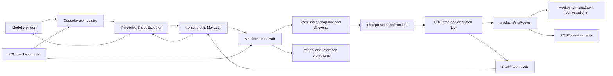
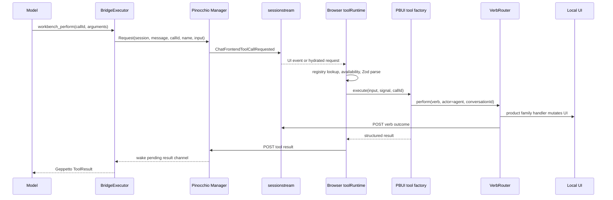
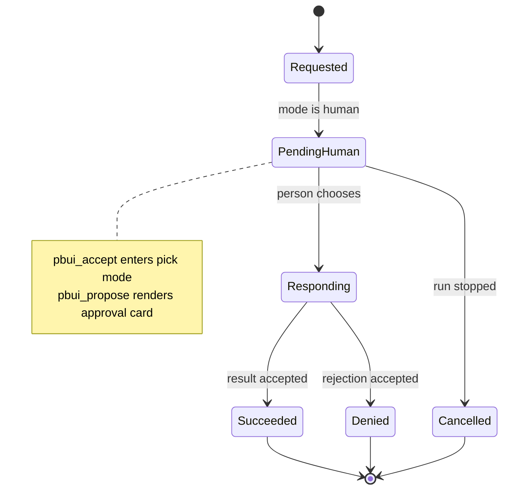

# Tool calls and agent UI interaction: frontend tools, approval gates, verb routing, observability, and code review

## Executive summary

PBUI gives an agent several distinct ways to affect what a person sees. A backend tool can publish a structured widget. A browser tool can read or rearrange the workbench, create a sandbox program, or hand work to another conversation. A human tool can pause inference until the person clicks an object or approves a proposal. An assistant-authored widget can also contain a verb chip which the person later invokes. Those paths converge on the same product vocabulary and, for high-level UI actions, the same verb router.

That architecture has a strong center: tools are constructed per conversation, schemas are generated from Zod or Go types, unavailable capabilities are omitted from the model registry, high-level UI mutations reuse product verbs, `actor: "agent"` is carried into the trace, and dangerous workbench operations fail closed by default. The implementation is unusually explicit about model-usable error messages, stable ids, layout limits, sandbox dry runs, and the distinction between browser-owned state and server-owned inference.

The weakest part is not UI rendering. It is **invocation identity across the round trip**:

1. the model calls a provider tool;
2. Pinocchio parks that call in a process-global pending map;
3. sessionstream publishes a request;
4. one or more browsers may execute it;
5. a browser POSTs a result;
6. Pinocchio resumes the parked model call.

The pending map is keyed only by `toolCallId`. The result handler does not require the command's session id or supplied tool name to match the pending call. The server routes are unauthenticated. The executable probe in `various/35-cross-session-tool-result-probe.md` parked a request in `victim-session`, submitted a differently named result under `attacker-session`, and proved that the victim request received `source=attacker`. This is **Critical for any shared or remotely reachable deployment**. It is still a correctness defect in a loopback demo.

The browser side also lacks terminal idempotency. It suppresses a tool-call id only while automatic execution is active or while a human call is pending; after completion it forgets the id. Reconciliation of the same request can execute the UI mutation again. Human responses can be submitted twice. Approval semantics are fragmented across three factories: workbench confirmations are consumed in memory, conversation confirmations are not consumed, and sandbox create/action-definition confirmation paths check but do not spend ids. The demo cannot complete workbench or sandbox confirmation flows because it does not wire their `isApproved` callbacks.

### Review verdict

- **Conceptual model:** strong. Backend, automatic frontend, human frontend, and presentation verbs are useful boundaries.
- **Local UI mutation design:** mostly strong for high-level workbench verbs; mixed for raw mutations, undo, and sandbox library writes, which bypass the verb trace.
- **Schema and model ergonomics:** strong, with concrete examples, limits, and actionable errors.
- **Invocation/result security:** unsafe outside a trusted single-user environment.
- **Idempotency and multi-client behavior:** underspecified and currently unsafe for consequential automatic tools.
- **Approval enforcement:** directionally correct but inconsistent, process-local, and incomplete in the demo wiring.
- **Observability:** broad but split across tool traffic, debug events, and verb traces; no single causal record ties request, approval, UI effect, result, and model continuation together.

The recommended design is an explicit, server-issued `ToolInvocationKey`, a designated browser executor lease, a durable terminal-call ledger, and one server-owned approval ledger. Every effect should emit one causal audit envelope even when the effect remains browser-local.

## Scope and evidence

This review covers the full control plane rather than only the two conversation tools:

- model-facing prompt and tool registry construction;
- backend PBUI tools and automatic result projection;
- browser manifest registration and synchronization;
- Pinocchio's frontend bridge and pending request manager;
- sessionstream request/result events and hydration;
- chat-provider's browser registry and runtime;
- `pbui_accept` and `pbui_propose` human interactions;
- workbench, sandbox, and conversation frontend tools;
- product verb routing and server-side verb trace reporting;
- Tools, Events, and Agent Context helper-tile observability;
- cancellation, reconnect, duplicate delivery, multi-tab, approval, and security behavior.

It does not review model-provider quality, the visual design of every tool card, or the internals of the QuickJS sandbox except where they define a tool's side-effect boundary.

### Evidence used

The review combines source inspection with executable and live evidence:

- `various/28-agent-context-live-snapshot.md`: live 17-descriptor browser manifest.
- `various/21-browser-network-requests.txt`: live session, manifest, message, verb, and result traffic.
- `various/33-tool-runtime-probes.md`: replay and approval-consumption probes.
- `various/35-cross-session-tool-result-probe.md`: cross-session result-binding probe.
- `various/36-pbui-chat-tool-review-tests.txt`: 208 PBUI-chat tests passing.
- `various/37-go-tool-review-tests.txt`: focused chatserver and pbuichat tests passing.
- `various/38-pinocchio-frontendtools-tests.txt`: focused bridge/manager tests passing.
- `various/39-tool-review-line-anchors.txt`: current line anchors for reviewed symbols.

The probe word **PASS** means “the script reproduced the current reviewed behavior.” For hazards, that is evidence of a defect, not an endorsement.

## 1. Mental model for an intern

Three terms that sound interchangeable are not interchangeable here.

### 1.1 A tool call is a model/runtime transaction

A tool has a model-visible name, description, input schema, call id, arguments, execution mode, result, status, and duration. The model requests it while producing an answer and usually cannot continue until it gets the result.

Examples:

- `pbui_widget` runs on the server and publishes a widget.
- `workbench_describe` runs in the browser and returns current layout ids.
- `pbui_propose` runs in the browser but requires a human response.

### 1.2 A verb is a product UI command

A verb is a serializable product action such as:

```json
{"kind":"tile.split","placementId":"p-12","direction":"row","appId":"tools"}
```

The router validates it against the product vocabulary, selects a `local`, `agent`, or `tool` family handler, performs it, and POSTs the outcome to the conversation trace. A tool may call a verb, but a mouse click or widget chip may call the same verb without involving a model tool transaction.

### 1.3 A presentation is an object/action grammar

A reference such as `[[product:2049|Gold Eagle]]` can render as a chip, participate in focus/mentions, and expose object-menu actions. A model can publish references or verbs through text/widgets; the person still decides whether to click them.

This gives four interaction classes:

| Class | Executor | Blocks the model? | Typical UI effect |
|---|---|---:|---|
| Backend tool | Go runtime | Yes | publish widget/reference data |
| Automatic frontend tool | Browser JS | Yes | inspect or mutate local UI |
| Human frontend tool | Browser + person | Yes | pick an object or approve/reject |
| Presentation verb | Product router | No model call required | perform one product action and trace it |

A sound review must follow all four. Looking only at `conversation_send` misses workbench mutation; looking only at verbs misses the result channel that resumes inference.

## 2. Architecture and call flow

### 2.1 Component map



The central split is at `BridgeExecutor.ExecuteToolCall` in sibling repository `pinocchio/pkg/chatapp/frontendtools/bridge.go:76-130`. If a provider tool name resolves to an available browser manifest descriptor, execution crosses the WebSocket/HTTP bridge. Otherwise, the default backend executor runs it in Go.

### 2.2 One automatic frontend call, step by step



Key implementation points:

- `createPbuiChat.tsx:202-242` constructs a tool set **per conversation**.
- Its `perform` closure always supplies `{actor: "agent", conversationId}`.
- `toolRuntime.js:24-84` validates availability/input, executes, and POSTs a result.
- `createVerbRouter.ts:187-241` validates, invokes a family handler, serializes trace reports, and returns `performed` or `rejected:…`.
- `manager.go:143-184` parks the backend call until a result or context cancellation.

### 2.3 Human tool state machine



The desired machine has one terminal transition. Current browser code stores only a `pendingHumanTools` set. `respondToHumanTool` deletes the id and submits regardless of whether it was pending (`toolRuntime.js:90-100`). There is no compare-and-set, terminal ledger, or synchronous card state. The state diagram is therefore aspirational at the duplicate-response edge.

## 3. Tool catalog and ownership

### 3.1 Backend tools

`pkg/pbuichat/tools.go:77-132` registers three backend PBUI tools per session:

| Tool | Reads/writes | UI interaction |
|---|---|---|
| `pbui_widget` | validates and publishes a widget document | structured content appears in transcript; references and verb chips become interactive |
| `pbui_trace` | reads that session's verb trace | lets the model recall UI actions |
| `pbui_describe_types` | reads vocabulary | teaches exact types and verbs on demand |

Product backend tools (`products`, `product` in `pkg/chatserver/demo/tools.go`) run in Go. Projection rules can turn row-shaped results into table widgets (`pkg/pbuichat/plugin.go:167-232`). The backend path does not ask the browser to execute arbitrary code.

### 3.2 Human frontend tools

| Tool | Browser mechanism | Result |
|---|---|---|
| `pbui_accept` | mounts a card, enters PBUI accept mode once | selected `Reference` or `{cancelled:true}` |
| `pbui_propose` | renders proposal fields and Approve/Reject buttons | `{decision,id}` |

`pbui_accept` is a genuine interaction tool: the agent cannot manufacture the chosen reference. `pbui_propose` is currently both a human interaction and an informal approval source for other factories. That dual use is where fragmented authorization appears.

### 3.3 Workbench frontend tools

| Tool | Purpose | Mutates? | Default policy |
|---|---|---:|---|
| `workbench_describe` | enumerate apps, workspaces, placements, splits | No | available when workbench attached |
| `workbench_create_workspace` | validate and create recursive layout | Yes | allow |
| `workbench_open_tile` | open/reuse a bound view | Yes | allow |
| `workbench_switch_workspace` | select a workspace | Yes | allow |
| `workbench_perform` | perform high-level workbench verbs | Yes | per verb |
| `workbench_apply` | raw atomic protobuf mutation batch | Yes | unavailable unless explicitly enabled |

Strong details in `workbenchTools.ts` include flat provider-compatible layout schemas, app/binding checks, actionable unknown-id errors, tile/workspace/depth limits, dry application of raw batches, and confirm-by-default destructive verbs.

The live Agent Context tile reported all six descriptors, but `workbench_apply` was unavailable and therefore omitted from the server's model registry. The Context tile shows the browser registry, not exactly the provider-visible subset.

### 3.4 Sandbox frontend tools

| Tool | Purpose | Persistent effect |
|---|---|---:|
| `sandbox_describe` | list library, runtime status, DSL | No |
| `sandbox_test` | load/render/replay events without storing | No |
| `sandbox_create_app` | validate and store an agent program | Yes |
| `sandbox_update_app` | validate and version existing program | Yes |
| `sandbox_open` | open program tile with bindings | Yes |
| `sandbox_define_action` | add an object-menu action | Yes |
| `sandbox_remove` | remove program/action, close program tiles | Yes |

The test-before-store design is good. The engine runs with source/tree/intent limits, and persistent writes happen only after a successful dry render. Pinned or human-authored artifacts escalate update/removal from allow to confirm.

### 3.5 Conversation frontend tools

- `conversation_list` returns browser-owned conversation records and explicitly identifies “you” and active conversation.
- `conversation_send` sends to another open conversation and starts a run there. It rejects self-send, disconnected targets, empty/oversized prompts, denied policy, and mismatched approval.

These must be per-conversation because a frontend tool's execution callback receives no session id. `createPbuiChat` correctly captures the caller's conversation id in each tool set.

## 4. Discovery and manifest lifecycle

### 4.1 Browser registration

`ChatToolRegistry.register` normalizes a descriptor and stores it by name. `manifest()` converts Zod schemas to JSON Schema and evaluates dynamic availability. Each registration increments a local integer revision.

PBUI installs this extension for every conversation:

```ts
tools: [
  pbuiAcceptTool,
  pbuiProposeTool,
  ...workbenchTools.tools,
  ...sandboxTools.tools,
  ...conversationTools.tools,
]
```

That produces 17 descriptors in the demo. Backend PBUI/product tools are absent from this browser list because the Go runtime registers them separately.

### 4.2 Availability

Workbenches and sandboxes are attached after chat construction because their app descriptors depend on chat. Tools use callbacks such as:

```ts
available: () => getWorkbench() !== null
```

This is a sound capability pattern. The browser runtime rechecks availability at execution, and Pinocchio skips unavailable descriptors when constructing the provider registry.

### 4.3 Synchronization

The client POSTs `{revision, tools}`:

- on connect;
- before every send;
- when an extension is installed/removed;
- when PBUI attaches/detaches workbench or sandbox.

The server's manager stores the latest arrival, not the highest revision. PBUI's `syncAllManifests()` fires unawaited parallel requests. The revision exists on the wire but does not enforce ordering (`manager.go:75-89`). Two tabs attached to one session also share one server manifest even when their available UI capabilities differ.

A safer manifest identity is:

```ts
interface ManifestVersion {
  sessionId: string;
  clientInstanceId: string;
  connectionGeneration: number;
  revision: number;
}
```

The server should reject an older revision for the same client generation and explicitly choose which client owns execution.

## 5. How UI mutations are actually performed

### 5.1 High-level workbench changes use the router

A workbench tool validates a candidate, checks policy, snapshots the document, then calls the product router. The demo handler delegates to `performWorkbenchVerb`; false becomes a rejected outcome. This is the best part of the agent/UI contract: mouse actions and agent actions share the same vocabulary and mutation implementation.

The router then POSTs:

```json
{
  "clientSeq": "timestamp-counter",
  "actor": "agent",
  "verb": {"kind":"tile.split","placementId":"…"},
  "outcome": "performed"
}
```

Reports are queued so trace order follows perform order.

### 5.2 Raw workbench mutation bypasses the router

When enabled, `workbench_apply` parses protobuf JSON, classifies destructive cases, dry-runs `applyMutations`, and calls `wb.mutate(batch)` directly (`workbenchTools.ts:660-735`). No `router.perform` call means no verb trace entry. The Tools tile still shows the tool call, but `pbui_trace` does not show the individual UI effect.

### 5.3 Sandbox persistence partly bypasses the router

- `program.open` and remove paths use product verbs.
- program creation/update and action definition write directly to `ProgramLibrary`.
- the policy gate may construct a verb-shaped approval subject, but successful direct writes do not automatically produce verb trace entries.

The tool traffic is observable; the product action trace is incomplete. That distinction should be explicit rather than hidden behind comments saying agent UI effects share one door.

### 5.4 Backend tools publish rather than mutate layout

`pbui_widget` emits a widget request event. The browser renders it in the transcript. Opening it as a workbench tile remains a separate verb, typically initiated by a person. This separation is safe and legible: structured answer generation is not automatic layout control.

## 6. Trust and correctness invariants

A frontend tool call crosses process, transport, package, React, and product boundaries. The following facts must remain true:

1. **Session binding:** only a result from the session/client assigned the request may resolve it.
2. **Tool binding:** the result tool name must equal the requested tool.
3. **Run binding:** a late result from an older run must not wake a newer call with a reused id.
4. **At-most-once effect:** duplicate UI events/snapshots must not repeat a completed mutation.
5. **At-most-once result:** double click/retry must produce one terminal result.
6. **Manifest binding:** a call may use only a descriptor available in the manifest version selected for the run.
7. **Approval binding:** approval must name sender, operation, arguments, target, and relevant references.
8. **Approval consumption:** one approval authorizes one successful effect, durably across reloads and factories.
9. **Executor ownership:** one designated browser executes an automatic tool call.
10. **Audit causality:** request, approval, effect, result, and continuation share one correlation id.

Current code fully satisfies schema validation and active-call duplicate suppression. It does not fully satisfy the ten invariants above.

## 7. Ranked findings

| ID | Severity | Finding | Primary evidence |
|---|---|---|---|
| T1 | **Critical** | Pending frontend results are not bound to session or tool name | executable Go probe; `manager.go:25-34,92-131,143-165` |
| T2 | **Critical/High** | Tool/session routes are unauthenticated; session listing/snapshots expose the namespace needed to target T1 | `server.go:206-221`; handlers |
| T3 | **High** | Completed automatic frontend calls can execute again after snapshot reconciliation | executable Node probe; `toolRuntime.js:24-84` |
| T4 | **High** | One session may have multiple browser executors; every subscriber can perform the same local side effect and race results | WS fanout + no client/executor id |
| T5 | **High** | Approval consumption is fragmented, non-durable, and absent on conversation send plus sandbox create/action definition | executable probes; three tool factories |
| T6 | **High** | Human tool responses are not compare-and-set; duplicate clicks/calls can submit multiple terminal results | executable probe; `respondToHumanTool` |
| T7 | **High** | Manifest revisions do not prevent stale overwrite; multi-tab manifests have undefined ownership | registry/client sync + `HandleManifest` |
| T8 | Medium-high | Demo advertises proposal workflow for workbench/sandbox confirm operations but wires no approval validator, so approved operations remain impossible | demo `chat.ts:284-305`; defaults return false |
| T9 | Medium | Raw mutations, undo, and several sandbox library writes bypass the verb trace | direct `wb.mutate`, `replaceDocument`, `putProgram`, `putAction` |
| T10 | Medium | `workbench_perform` is partial, snapshots before knowing anything will apply, and returns unusable undo tokens | `workbenchTools.ts:577-633` |
| T11 | Medium | Pending refs/focus survive connection or manifest-sync failure and may attach to a later message | `createPbuiChat.tsx:304-311`; client send order |
| T12 | Medium | Automatic browser execution has no per-tool deadline; cancellation relies on tool cooperation and run stop | `AbortController` only |
| T13 | Medium | Server result validation accepts arbitrary status strings, unsolicited ids, and mismatched names, publishing them to timeline even without a pending call | handlers + manager result path |
| T14 | Medium-low | Tool observability is split and some Agent Context wording conflates registered, available, advertised, requested, and executed | helper tile + lexical sync path |
| T15 | Medium-low | Tool registration silently replaces duplicate names; manifest sync cleanup is fire-and-forget | `toolRegistry.js:14-28`; extensions |
| T16 | Low/Performance | Provider batches execute sequentially, so a parked human tool can head-of-line block independent read tools | `bridge.go:133-142` |

### T1 — Critical: cross-session result acceptance

Pinocchio stores:

```go
pending map[string]*pendingCall
```

`pendingCall` records message id, tool name, and channel, but not session id. `Request` assigns `m.pending[req.ToolCallID]`. `HandleResult` retrieves by id alone. It fills a blank result tool name from pending state but never rejects a supplied mismatch and never compares `cmd.SessionId`.

The probe performed this sequence:

```text
Request(victim-session, shared-call-id, dangerous_browser_tool)
HandleResult(attacker-session, shared-call-id, different_name_is_accepted)
=> victim receives {source: attacker}
```

There is a second failure mode: two concurrent sessions using the same provider call id overwrite the same map entry. Whichever result arrives can wake the wrong run; the earlier request may hang until cancellation.

**Impact:** forge approval/tool results, resume a victim model with attacker-controlled data, race or hang runs, corrupt timeline attribution. With an automatic destructive tool, the forged result does not itself perform the browser mutation, but it can convince the model that one occurred and influence subsequent calls. With a human approval tool, a forged `approve` resumes the consequential workflow.

**Remediation:** use a composite server key and strict match:

```go
type InvocationKey struct {
    SessionID  sessionstream.SessionId
    MessageID  string
    ToolCallID string
    ToolName   string
}

func (m *Manager) HandleResult(principal Principal, cmd Command) error {
    key := InvocationKey{
        SessionID: cmd.SessionId,
        MessageID: cmd.MessageId,
        ToolCallID: cmd.ToolCallId,
        ToolName: cmd.ToolName,
    }
    pending, ok := m.pending[key]
    if !ok { return ErrUnknownOrTerminalInvocation }
    if principal.ClientID != pending.ExecutorClientID { return ErrWrongExecutor }
    return pending.CompleteOnce(cmd)
}
```

If protocol compatibility prevents adding message id immediately, `(sessionId, toolCallId)` plus exact tool-name comparison is the minimum safe first patch. Also reject duplicate pending insertion; never overwrite.

### T2 — Critical/High: no route authorization

`RegisterRoutes` exposes list, snapshot, message, stop, manifest, result, and verb routes with no authentication/authorization middleware. The list endpoint returns session ids. The snapshot includes pending tool entities/tool-call ids. This converts T1 from an internal keying bug into a reachable shared-host vulnerability.

Severity is **Critical on a shared network service**, **High on a single-machine service exposed to untrusted local processes/browser content**, and an accepted but documented limitation only when bound to loopback for one trusted user.

Use the repository's existing `authkit` primitives or an equivalent principal. Authorize each session route and WebSocket subscription. Browser result submission should require a short-lived capability issued for that invocation, not merely possession of a session UUID.

### T3 — High: completed automatic call replay

The browser runtime has:

```js
activeControllers: Map<toolCallId, AbortController>
pendingHumanTools: Set<toolCallId>
```

Both suppress duplicates only while non-terminal. `activeControllers.delete` runs after result submission. A stale/hydrated request can then execute again. The executable probe reconciled the same request after its first result and observed two executions and two result POSTs.

For `workbench_describe`, replay wastes work. For `workbench_perform`, `sandbox_create_app`, or `conversation_send`, replay is a second side effect.

Add a bounded terminal ledger keyed by the full invocation key:

```ts
type InvocationState =
  | { phase: "running"; controller: AbortController }
  | { phase: "waiting-human" }
  | { phase: "terminal"; status: ToolStatus; resultDigest: string };
```

A reconciled terminal request should not execute. It may re-submit the cached terminal result if the server explicitly asks for recovery. The server must make result acceptance idempotent too.

### T4 — High: no designated browser executor

Sessionstream fans UI events to subscribers. Nothing in the frontend request identifies which browser instance should execute it. Two tabs open on the same session can both receive the request, both pass local deduplication, mutate their own browser state, and POST results. The backend channel accepts whichever result it observes first while publishing both result events.

A session needs an executor lease:

```text
session S
  executorClientId = C7
  leaseGeneration = 12
  expiresAt = …
```

The manifest belongs to that client generation. Frontend call events target it. A second tab may observe the call but must not execute unless it acquires the lease. Human calls need an explicit handoff/visibility policy so the approval card appears in the user's active client.

### T5 — High: approval semantics are fragmented

Current behavior by factory:

| Factory | Checks exact subject? | Spends after success? | Durable? |
|---|---:|---:|---:|
| Workbench | product callback receives verb | Yes | No; per-factory in-memory set |
| Conversation | callback receives target + prompt | **No** | No |
| Sandbox update/remove | callback receives verb | Yes | No |
| Sandbox create | callback receives subject | **No** | No |
| Sandbox action definition | callback receives subject | **No** | No |
| Raw mutation | separate exact callback | Yes | No |

Even “spent” workbench approval can be reused after reload, from another conversation's tool factory, or through another factory because each owns a separate set. Conversation approval excludes refs and sender. The demo scans all conversation timelines for string-labeled proposal fields.

Replace callbacks and local sets with one approval service:

```ts
interface ApprovalSubject {
  senderConversationId: string;
  operation: string;
  canonicalArguments: JsonValue;
  targetIds: string[];
  referenceKeys: string[];
}

interface ApprovalLedger {
  propose(subject: ApprovalSubject): Promise<ApprovalCapability>;
  consume(capability: string, subject: ApprovalSubject): Promise<"consumed">;
}
```

The backend should mint a random, single-use capability only after recording the human decision. Canonical argument hashing prevents string-label ambiguity. Consumption and effect initiation should be atomic where feasible.

### T6 — High: duplicate human responses

`respondToHumanTool` removes an id from `pendingHumanTools`, then always submits. Calling it twice submits twice. `ProposeToolCard` does not pass local `decision` state to `ProposalCard`; its buttons remain enabled until the server round trip updates the timeline and unmounts/replaces the pending card.

Fix both ends:

- browser `completeHumanTool` performs a synchronous pending-to-responding compare-and-set;
- card stores/receives local decision and disables both buttons immediately;
- server accepts only the first terminal result for an invocation;
- retries return the accepted terminal result rather than appending another event.

### T7 — High: stale manifest overwrite

The browser revision is monotonic only within one registry instance. Server `HandleManifest` blindly replaces the current manifest. `syncAllManifests` does not serialize requests and ignores errors. Slow revision 8 can arrive after revision 9 and remove a newly attached capability. Two tabs both start revisions near zero and overwrite one another.

Treat manifest update as compare-and-set on `(clientInstanceId, generation, revision)`. Surface rejected stale updates to the Context tile. Freeze the selected manifest version into a run so the provider registry and browser executor agree.

### T8 — Medium-high: demo confirmation workflows cannot complete

`createWorkbenchTools` and `createSandboxTools` default `isApproved` to false. The demo passes `conversationTools.isApproved` only. Therefore:

- a model can call `pbui_propose` for `tile.close`;
- the person can approve;
- the repeated `workbench_perform` still returns “no approved proposal.”

Fail-closed is correct, but advertising an impossible workflow is not. Either wire one shared approval ledger to all factories or mark confirm-gated operations unavailable with an explanation the model sees. Agent Context's environment already reports `canApprove:false`; policy and manifest should honor that fact.

### T9 — Medium: incomplete action trace

Tool traffic and verb trace answer different questions:

- tool traffic: “what model tool call happened?”
- verb trace: “what product UI action happened?”

That split is valid, but raw mutation, undo, program creation/update, and action definition currently lack a corresponding verb trace. An intern reading `pbui_trace` can miss real agent-authored state changes.

Introduce an `EffectEnvelope` at the effect gateway:

```ts
interface EffectEnvelope {
  invocation: ToolInvocationKey;
  actor: "agent" | "human";
  effectKind: string;
  canonicalInput: JsonValue;
  outcome: "performed" | "rejected" | "cancelled";
  beforeRevision?: string;
  afterRevision?: string;
}
```

High-level verbs can embed their existing trace. Raw/sandbox effects emit equivalent records. Avoid duplicating full sensitive payloads; store digests/redacted summaries where appropriate.

### T10 — Medium: partial workbench batches and misleading undo

`workbench_perform` snapshots before validating candidates. If every candidate is invalid, it returns an undo token for no change. With several verbs, earlier verbs can apply while a later one fails. A shared confirmation id is spent after the first confirm-gated success, so a second destructive verb in the same call is rejected. The result accurately reports each item, but the operation is not atomic.

The undo ring is per conversation while the workbench document is shared. Restoring an old whole-document snapshot can erase another agent's later changes. `undo()` directly replaces the document, bypasses policy/trace, and no current tool/helper surface consumes the returned token.

Choose explicit semantics:

- `workbench_perform`: validate whole plan first; either declare sequential partial behavior prominently or add `atomic:true` using protocol mutations;
- create snapshots only immediately before the first valid effect;
- return an undo capability only when a visible, policy-checked undo path exists;
- use revision-checked inverse operations, not stale whole-document replacement, in multi-agent mode.

### T11 — Medium: stale pending refs after send failure

`sendTo` writes pending refs/focus before `client.send`. The client ensures session, connects, and syncs the manifest before calling `sendMessageBody`, where pending metadata is deleted. If those preflight steps fail, pending remains. A later plain send can inherit old refs/focus.

Use a call-scoped body closure or clear pending in `finally`:

```ts
pending.set(sendId, context)
try {
  await client.send(message, { sendId })
} finally {
  pending.delete(sendId)
}
```

Key by send operation, not only conversation, so concurrent sends cannot overwrite one another.

### T12 — Medium: no browser execution deadline

The runtime creates an `AbortController`, but no timeout. `stop()` aborts; a tool must observe `signal` to stop. Most PBUI tool functions do not accept/check the signal because their operations are short, but sandbox operations can await engine work. A hung promise parks inference.

Add descriptor-level `timeoutMs` with safe defaults and a terminal timeout status. Timeout must not imply rollback; effectful tools need idempotency and an outcome query because completion may race timeout.

### T13 — Medium: permissive result protocol

The HTTP handler accepts any nonempty call id, arbitrary status string, optional/mismatched name, and result object. Manager publishes a result event even if no pending call exists. This can pollute timeline and complicate incident analysis.

Validate:

- status enum;
- exact pending invocation tuple;
- result against the registered result schema where available;
- terminal transition once;
- body size per tool/result class;
- authenticated executor/client generation.

Unsolicited/late results should produce a diagnostic event, not a normal result entity.

### T14 — Medium-low: observability vocabulary is imprecise

The Agent Context tile showed “tools · 17” and “advertised on connect and on every send,” including unavailable `workbench_apply`. The provider sees only available tools. Automatic attach syncs are not fully reflected in “last advertised” instrumentation because lexical client closures bypass monkey-patched wrappers.

Display separate states:

```text
registered  available  manifest-acked  selected-for-run  requested  running  terminal
```

Tools tile rows should include session, message/run, call id, manifest revision, executor client, policy decision/approval id, effect trace id, retries, and terminal source.

### T15 — Medium-low: duplicate registration is silent

Registering the same tool name overwrites the previous descriptor and increments revision. Cleanup of the older registration wisely does not delete the newer one, but no warning explains shadowing. Extension composition can therefore change behavior by order.

Reject duplicate names by default. Permit explicit replacement with `replaceTool(name, expectedOwner, next)` and show owner extension in manifests/debug views.

### T16 — Low/Performance: serial batch execution

`BridgeExecutor.ExecuteToolCalls` loops sequentially. This preserves UI ordering, which is desirable for mutations. It also means an independent backend/read call behind `pbui_propose` waits for the person.

Classify tools with concurrency semantics:

- `read`: may run concurrently;
- `ui-write`: serialize per executor/workbench revision;
- `human`: park independently;
- `backend-write`: use domain ordering.

Do not parallelize all calls blindly; provider output often assumes order.

## 8. What the implementation does especially well

A review should preserve these strengths.

### 8.1 Per-conversation closures

Frontend execution callbacks do not receive session identity. Capturing conversation id in `toolsFor(id)` prevents the active-tab race that a shared tool set would create. Keep this even after invocation keys are added.

### 8.2 Model-actionable validation

Errors say which id was unknown, list available ids, describe missing bindings, show limits, and instruct the model to call discovery tools. This is substantially better than generic schema failure.

### 8.3 High-level action reuse

`performWorkbenchVerb` is one door for mouse and model for normal operations. The router records rejections as well as successes and preserves actor/conversation attribution.

### 8.4 Safe defaults

- raw mutations off;
- launcher control denied;
- destructive layout changes confirm;
- conversation handoff confirm;
- no approval callback means refusal;
- sandbox validates before persistence;
- self-handoff and closed targets rejected.

### 8.5 Prompt/manifest split

The generated prompt teaches capabilities based on product vocabulary; actual manifest availability decides what the provider can call. This lets fixed-layout/single-conversation products omit irrelevant tool sets.

## 9. Proposed target design

### 9.1 Invocation contract

```ts
interface ToolInvocationKey {
  sessionId: string;
  messageId: string;
  runId: string;
  toolCallId: string;
  toolName: string;
  manifest: {
    clientInstanceId: string;
    generation: number;
    revision: number;
  };
}

interface FrontendToolRequest {
  key: ToolInvocationKey;
  executorClientId: string;
  input: JsonObject;
  inputDigest: string;
  mode: "automatic" | "human";
  deadline: string;
  resultCapability: string;
}

interface FrontendToolResult {
  key: ToolInvocationKey;
  executorClientId: string;
  resultCapability: string;
  status: "success" | "failed" | "denied" | "cancelled" | "timeout";
  result?: JsonObject;
  error?: string;
  effectTraceIds?: string[];
}
```

The random result capability is scoped to one key and one executor. It is not a replacement for authenticated transport; it limits confused-deputy/replay damage.

### 9.2 Server completion algorithm

```text
submitResult(principal, result):
  authenticate principal
  key = canonical(result.key)
  pending = pendingByKey.get(key)
  if absent:
    if terminalByKey contains same digest: return previous acknowledgement
    reject as unknown or late
  require principal may access key.sessionId
  require pending.executorClientId == result.executorClientId
  require constantTimeEqual(pending.capability, result.capability)
  require pending.toolName == result.key.toolName
  validate status and result schema
  atomically move pending -> terminal
  publish one terminal result event
  resolve parked run once
```

### 9.3 Browser execution algorithm

```text
onRequest(request):
  state = invocationLedger[request.key]
  if state is running or waiting-human: ignore duplicate
  if state is terminal:
    re-submit cached result only when server requests recovery
    return
  require request.executorClientId == thisClient
  require manifest revision and input digest match
  parse input with local schema
  mark running or waiting-human before rendering/executing
  run with deadline and AbortSignal
  complete exactly once
  cache terminal result in bounded durable ledger
```

### 9.4 Unified effect and approval boundary

All effectful tools call an `AgentEffectGateway`:

```ts
interface AgentEffectGateway {
  execute(request: {
    invocation: ToolInvocationKey;
    subject: ApprovalSubject;
    policy: "allow" | "confirm" | "deny";
    approvalCapability?: string;
    expectedRevision?: string;
    effect(): Promise<EffectResult>;
  }): Promise<EffectResult>;
}
```

The gateway consumes approval, checks revision, emits effect trace, and returns correlation ids. Workbench verbs remain the domain dispatcher; sandbox library writes get equivalent tracing instead of being forced into fake workbench verbs.

## 10. Decision records

### Decision 1: Full invocation identity, not tool-call id alone

- **Context:** provider ids are not a security boundary and may collide across sessions/runs.
- **Options:** globally assume ids unique; `(session,id)`; full invocation key.
- **Decision:** use session, run/message, call id, tool name, and manifest generation.
- **Rationale:** each field already exists at a boundary and closes a distinct late/cross-session ambiguity.
- **Consequences:** protocol fields and storage indexes expand; logs become much easier to correlate.
- **Status:** proposed.

### Decision 2: One designated frontend executor per session generation

- **Context:** multiple browser subscribers otherwise execute the same local effect.
- **Options:** first result wins; all execute; explicit executor lease.
- **Decision:** explicit lease with visible takeover.
- **Rationale:** local UI state belongs to a concrete browser instance.
- **Consequences:** inactive tabs observe but do not execute; human call handoff needs UX.
- **Status:** proposed.

### Decision 3: Server-owned, one-shot approval ledger

- **Context:** local sets differ by factory and reset on reload.
- **Options:** keep callbacks; shared browser store; server ledger/capability.
- **Decision:** server ledger with canonical subject and one-use capability.
- **Rationale:** authorization controls a server-mediated model continuation and must survive reload consistently.
- **Consequences:** offline-only products need a local ledger implementation with identical interface.
- **Status:** proposed.

### Decision 4: Terminal idempotency at browser and server

- **Context:** either side can retry/reconcile.
- **Options:** rely on transport; browser-only dedupe; dual terminal ledgers.
- **Decision:** dual ledgers with idempotent acknowledgement.
- **Rationale:** exactly-once delivery is unavailable; at-most-once effect requires application state.
- **Consequences:** bounded retention and digesting are required.
- **Status:** proposed.

### Decision 5: One causal audit envelope, multiple domain traces

- **Context:** tool traffic and verb trace serve different audiences.
- **Options:** merge everything; leave disconnected; correlate envelopes.
- **Decision:** preserve domain views but correlate with invocation/effect ids.
- **Rationale:** no view has to duplicate every payload, yet investigators can reconstruct causality.
- **Consequences:** adapters/helper tiles gain correlation fields.
- **Status:** proposed.

### Decision 6: Monotonic, client-scoped manifests

- **Context:** arrival order and multi-tab overwrite are undefined.
- **Options:** last arrival; highest session revision; client generation plus executor selection.
- **Decision:** client-scoped monotonic revisions, freeze selected version per run.
- **Rationale:** one integer cannot compare independent registries.
- **Consequences:** server stores several client manifests or only active executor manifest plus history.
- **Status:** proposed.

## 11. Phased remediation plan

### Phase 0 — Contain the trust-boundary defect

1. In Pinocchio, key pending calls by at least `(sessionId, toolCallId)`.
2. Store/compare tool name and reject duplicate pending insertion.
3. Validate terminal status enum and reject unsolicited normal results.
4. Require authorization for session list/snapshot/message/manifest/result/verb/WS routes.
5. Add regression tests based on `scripts/05-cross-session-tool-result-probe.go`.

Exit criterion: no command under another session id or tool name can resolve a parked call.

### Phase 1 — Idempotency and human completion

1. Add browser invocation ledger with terminal LRU.
2. Make human response a compare-and-set and disable controls synchronously.
3. Make server terminal completion idempotent.
4. Add call deadlines and cancellation outcomes.
5. Test snapshot replay before, during, and after result persistence.

Exit criterion: each invocation causes at most one browser effect and one terminal server event under duplicate delivery/reconnect/double click.

### Phase 2 — Unified approval

1. Define canonical `ApprovalSubject`.
2. Implement one approval ledger and capability consumption.
3. Wire workbench, sandbox, conversation, and raw mutation through it.
4. Include sender and refs in handoff subjects.
5. Remove per-factory `spent` sets after migration.
6. Make unavailable confirmation capability visible to manifest/prompt.

Exit criterion: exact approval works once across reload and cannot cross sender/factory/operation.

### Phase 3 — Executor and manifest ownership

1. Assign browser client ids and connection generations.
2. Implement executor lease/takeover.
3. Scope manifests to client generation and reject stale revisions.
4. Freeze manifest revision into each run/invocation.
5. Route human cards to active executor with visible handoff.

Exit criterion: two tabs cannot both execute one automatic request or overwrite each other's selected manifest silently.

### Phase 4 — Effect audit and transactional semantics

1. Add invocation/effect ids to router reports.
2. Trace raw workbench and sandbox persistence effects.
3. Preflight whole `workbench_perform` plans; document/implement atomicity.
4. Replace stale snapshot undo with revision-checked inverse operations or remove the advertised token.
5. Update Tools/Events/Context tiles to show causal state.

Exit criterion: one query can reconstruct model request → approval → UI effect → result → continuation.

## 12. Testing strategy

### 12.1 Pinocchio manager tests

Add table-driven tests for:

- same call id, different sessions;
- same session/id, wrong tool name;
- duplicate pending insertion;
- duplicate terminal result, same digest;
- duplicate terminal result, different digest;
- late result after cancellation;
- unsolicited result;
- invalid status;
- client/executor mismatch;
- result capability mismatch.

The current focused Pinocchio suite passes but does not cover the cross-session probe.

### 12.2 Browser runtime tests

Use a fake submitter and exact execution counter:

1. duplicate UI event while running → one execution;
2. same request after success → zero additional effects;
3. same request after failed result POST → cached retry, no re-execution;
4. snapshot plus buffered event → one execution;
5. stop during cooperative tool → one cancelled terminal state;
6. double human response → one POST;
7. remount pending human card → no second accept-mode entry unless explicitly resumed.

### 12.3 Approval property matrix

For every effectful operation, vary:

```text
sender × target × arguments × refs × approval id × factory × reload × attempt number
```

Only the exact first attempt may perform. Include workbench raw/high-level, conversation send, sandbox create/update/open/define/remove.

### 12.4 Multi-tab browser integration

Open two Playwright contexts on one session:

- assert only lease owner executes automatic calls;
- move lease and assert old owner stops;
- prove manifests cannot regress;
- prove a human card is actionable in one place;
- disconnect owner mid-call and exercise recovery without duplicate effect.

### 12.5 UI/effect assertions

Do not stop at tool result JSON. Assert concrete UI state and trace:

- exact workbench revision/tree;
- exact program library revision;
- exact target conversation message count;
- one tool terminal entity;
- one effect/verb trace with actor agent;
- one model continuation.

### 12.6 Security tests

Run HTTP/WebSocket tests as two principals. A principal must not list, subscribe, submit results, mutate manifests, append verbs, or start/stop another principal's sessions. Treat session UUID knowledge as non-authorizing.

## 13. Review checklist for future tools

Before adding a tool, answer:

- Who owns the state: server, active browser, shared browser storage, or one conversation?
- Is it backend, automatic frontend, human frontend, or merely a verb?
- What exact manifest makes it provider-visible?
- What stable ids must come from discovery rather than model invention?
- Is it read-only, reversible, consequential, or destructive?
- What is the canonical approval subject?
- Is approval consumed exactly once and durably?
- What happens on duplicate request, duplicate result, timeout, stop, reconnect, and reload?
- Which browser executes when two subscribe?
- Does it route through a product domain dispatcher?
- What UI state proves success?
- Which tool/effect/verb trace ids correlate it?
- Can its input/result expose secrets in helper tiles or logs?
- What bounded limits protect model context and UI responsiveness?

## 14. References

### PBUI repository

- `packages/pbui-chat/src/createPbuiChat.tsx:176-249,267-318,367-401,453-478` — per-conversation tools, send context, manifest refresh, router binding.
- `packages/pbui-chat/src/tools/workbenchTools.ts:73-180,230-281,399-740` — workbench schemas, policies, tools, raw mutation, undo.
- `packages/pbui-chat/src/tools/sandboxTools.ts:1-147,156-289,340-605` — sandbox policy, validation, direct library writes, routed open/remove.
- `packages/pbui-chat/src/tools/conversationTools.ts:1-180` — list/send, caller identity, approval check.
- `packages/pbui-chat/src/tools/acceptTool.tsx` — PBUI accept-mode human tool.
- `packages/pbui-chat/src/tools/proposeTool.tsx` and `ProposalCard/ProposalCard.tsx` — approval card and response path.
- `packages/pbui-chat/src/router/createVerbRouter.ts:121-243` — validation, family dispatch, actor/session binding, trace report queue.
- `packages/pbui-chat/demo/src/chat.ts:99-129,134-276,284-305` — demo approval scan and product handlers.
- `pkg/pbuichat/tools.go:77-186` — backend PBUI tools.
- `pkg/pbuichat/prompt.go:1-216` — generated model instructions.
- `pkg/pbuichat/plugin.go:82-232` — runtime event handling and tool-result widget projection.
- `pkg/chatserver/real_runtime.go:90-154` — registry composition and frontend bridge executor.
- `pkg/chatserver/handlers.go:254-318` — manifest/result HTTP decoding and commands.
- `pkg/chatserver/server.go:206-221` — route surface.

### Installed browser dependency

- `packages/pbui-chat/node_modules/@go-go-golems/chat-provider/tools/toolRegistry.js` — registry and manifest.
- `.../tools/toolRuntime.js` — browser request execution and human response.
- `.../core/createChatClient.js:105-180` — manifest/result/message HTTP order.
- `.../ws/sessionStreamTransport.js` — snapshot/event hydration and reconnect.
- `.../ws/wsManager.js` — request delivery and debug events.

### Sibling Pinocchio repository

- `../pinocchio/pkg/chatapp/frontendtools/manager.go:25-215` — manifest and global pending-call manager.
- `../pinocchio/pkg/chatapp/frontendtools/bridge.go:61-245` — provider-name resolution, request bridge, serial batch execution.

### Executable review artifacts

- `scripts/04-tool-runtime-probes.mjs` / `various/33-tool-runtime-probes.md`.
- `scripts/05-cross-session-tool-result-probe.go` / `various/35-cross-session-tool-result-probe.md`.
- `various/39-tool-review-line-anchors.txt`.

## Conclusion

PBUI's agent/UI design is not an uncontrolled “model writes DOM” system. It has typed tools, typed references, product verbs, dynamic availability, policy gates, sandbox limits, and an explicit browser bridge. Those are the correct primitives.

The next engineering step is to make the transport and authorization semantics as strong as the UI grammar. A tool call must be a first-class invocation owned by one session, run, tool, manifest generation, and browser executor. Its approval and terminal result must be one-shot. Its effect must be idempotent and causally traceable. Once those invariants are implemented, the existing high-level tool factories and verb router become a solid foundation rather than a set of well-designed local components connected by an under-specified distributed transaction.
