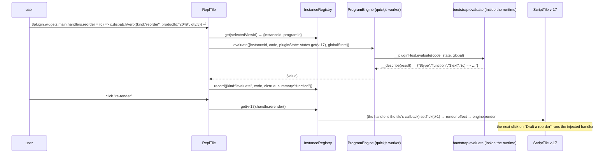

# Intern guide: observing, driving and editing running programs

> The sandbox can run a program the agent wrote. It cannot yet show you what that program is doing, let you poke at it, replay what happened to it, draft a new one by hand, or show you what changed between versions. This guide designs those five tools and the one piece of shared machinery they all stand on.

## 0 · How to read this

You are joining after `PBUI-AGENT-3` landed. That ticket's guide (`ttmp/2026/08/21/PBUI-AGENT-3--…/design-doc/01-intern-guide-…md`) explains the sandbox itself — the `definePlugin` dialect, the host loop, the two engines, the library, the tools. This guide assumes you have read its §3 (the pattern) and §5 (the design), and it re-states only what you need to build on.

Sections 1–3 are analysis: the gestures we want, the system as it is today, and the gap between the two. Section 4 is the design, with decision records. Section 5 is the implementation plan, phase by phase, with file-level guidance and pseudocode. Sections 6–11 are reference: sequences, failure modes, testing, APIs, files, open questions.

Conventions: file references are repo-relative from `pbui/`; `packages/pbui-sandbox/src/host/useProgramInstance.ts:142-195` means those lines at commit `d2c5b2c`. Pseudocode is TypeScript-shaped but not compiled. A *program* is the source the agent or a human wrote; an *instance* is one load of one program version in one engine; a *tile* is a placement of a view in the workbench. One view can have several placements (linked tiles), and one program can have several views.

## 1 · What we are building

Five scenes, each a tile. They share a vocabulary — *the selected sandbox* — that Section 4.1 defines.

**Scene 1 — Inspect.** A days-of-cover tile shows "40 d" and you do not believe it. You click *inspect* in its header. A second tile opens beside it with the instance's state as JSON (`{"days": 45}`), its resolved bindings (the product, with stock and `sold30d`), and its render tree as an outline you can hover to highlight the atom it became. You change `days` to `30` in the editor; the program tile re-renders. You pick the `reorder` handler from the outline and fire it; the timeline records the verb.

**Scene 2 — REPL.** You want to know why `Math.round(stock / (sold30d / 30))` says 40. You open the REPL tile, which is already pointed at the selected sandbox. You type `$global.shared.documents.product.value` and read the numbers. You type `$plugin.widgets.main.render({pluginState: {days: 1}, globalState: $global})` and see the tree the program would build for one day. You patch `$plugin.widgets.main.handlers.reorder = (ctx) => ctx.dispatchVerb({kind: "reorder", productId: "2049", qty: 5})` and press *re-render*: the live tile now runs your handler. Under QuickJS that patch is still inside the sandbox; under eval it is still inside the closure.

**Scene 3 — Timeline.** Three program tiles are open and something emitted a verb you did not expect. You open the timeline and see every load, render, event, intent, error and evaluation across all instances, newest first, with durations against the limits. You filter to one program, read the intents an event produced and what happened to each (applied, ignored, performed, rejected), and copy the events as the `events` argument `sandbox_test` takes, so the agent can reproduce the sequence.

**Scene 4 — Playground.** You want a tile the agent has not written. You open the playground, which holds a draft: a source editor, a bindings picker (product 2049), and a live rendering of the draft that updates as you type (debounced) and that you can click. When it does what you want you save it; it becomes `prg-5` in the library and opens as a tile. When it throws, the error is the same `{phase, code, message}` the agent sees, and *ask the agent* sends the draft and the error to the chat.

**Scene 5 — Versions.** The agent updated `prg-3` three times and the third broke the meter. You open *source & versions* for `prg-3`: the current source, a list `v3 · agent · 15:42 / v2 · agent · 15:31 / v1 · human · seed`, and a diff between any two. You click *roll back to v2*; that is `v4` with v2's source, every tile showing it reloads, and the history keeps all four.

What the scenes have in common: nothing in them changes what a program *is*. A program stays pure functions over JSON; the tools read the host's side of the boundary (state, trees, intents, timings) and push through doors the host already has (`states.set`, `onEvent`, `putProgram`) or one new door that keeps the boundary (`evaluate`, Section 4.3).

## 2 · The system as it stands

This section is what an intern must hold in their head before touching the code. Each part names the file that defines it.

### 2.1 The package map

```
packages/pbui-sandbox/src
  bootstrap.ts          BOOTSTRAP_SOURCE: definePlugin, ui.*, __pluginHost {getMeta, render, event}
  contracts.ts          UINode (13 kinds), DispatchIntent, LoadedProgram, ProgramGlobalState
  limits.ts             DEFAULT_LIMITS (source 64 KiB, treeNodes 2000, render/event 100 ms, …)
  engine.ts             ProgramEngine {load, render, event, dispose, health}, toProgramError
  engines/evalEngine.ts new Function + shadowed globals; same-thread
  quickjs/              runtimeService (one runtime per instance), worker, workerEngine, directEngine
  validate/             uiSchema (tree), intents
  render/UINodeRenderer UINode → pbui atoms; ref → renderReference()
  library.ts            ProgramRecord, ActionRecord, createProgramLibrary → localStorage
  state.ts              createProgramStateStore: view-keyed program state
  host/useProgramInstance.ts   the loop: load → render → event → reduce → render
  ScriptTile/           the one tile; header chip, body, details log, error callout
  createScriptApp.tsx   defineApp({id: "script", docBound, bindings: ["program"]})
  actions.ts            withGeneratedActions: stored actions into type menus
```

`packages/pbui-chat/src/tools/sandboxTools.ts` holds the seven `sandbox_*` tools and the shared dry run `check()`; `packages/pbui-chat/demo/src/{sandbox,workbench,chat}.ts` wire the demo.

### 2.2 The host loop, and where its knowledge lives

`useProgramInstance(options): ProgramInstance` (`host/useProgramInstance.ts:60-310`) is the whole runtime for one tile. Read it once, slowly. It owns:

- **Identity.** `instanceId` is `<viewId>:<programId>:v<version>#<mountCounter>` (line 131). The version is in the id, so an update is a fresh `load`, never a re-evaluation in a dirty context.
- **Three effects.** *load* on `(programId, source, version, viewId)`: dispose the previous instance, `engine.load`, seed state from `initialState` or probe-render the previous state (lines 123-183). *render* on `(meta, globalState, pluginState)`: one `engine.render` per widget; a changed tree replaces `trees`, an equal tree keeps its object identity (lines 186-212). *event* on demand: `engine.event` → intents → `reducePluginIntent` for plugin scope, `perform(verb, {provenance})` for verb scope (lines 215-258).
- **A log.** `InstanceLogEntry {at, kind: "intent"|"error"|"note", text, outcome?}`, kept to 50, as pre-formatted strings (lines 7-13, 97-99).
- **The state.** Not here: `ProgramStateStore` (`state.ts`) keyed by view id, so linked placements share one state.

Everything the loop knows — status, meta, trees, error, log — is returned to the caller and to no one else. That is the fact this ticket changes.

### 2.3 The engine boundary

`ProgramEngine` (`engine.ts:32-40`) is five async methods; everything that crosses it is JSON. Under eval, `load` runs one `new Function(...SHADOWED_GLOBALS, bootstrap + source + "return __pluginHost")` (`engines/evalEngine.ts:118`), so the program's top-level declarations, the bootstrap's `__plugin` and `__ui`, and `__pluginHost` all live in one function scope that the engine keeps as a closure. Under QuickJS, the bootstrap is evaluated once per runtime followed by `globalThis.__pluginHost = __pluginHost` (`quickjs/runtimeService.ts:119`), then the source, then `globalThis.__pluginHost.getMeta()`; later calls are `evalCode` strings (`render`, `event`, lines 147-175) built with `toJsLiteral`. Both engines validate trees and intents with the same validators.

The two facts the REPL depends on: under eval, a *direct* `eval(code)` inside the bootstrap's scope sees that scope; under QuickJS, every `evalCode` in the same context sees the global lexical scope the bootstrap and program declared into. Section 4.3 uses both.

### 2.4 The library

`ProgramRecord` (`library.ts:12-26`) holds `source`, `version`, `bindings`, `meta`, `by`, `pinned`, `lastError`. `putProgram` with an `id` bumps `version` and replaces `source`; the previous source is gone. `recordError` writes `lastError` without a version bump (line 315, "errors are diagnostics, not edits"). Persistence is debounced 300 ms to one `localStorage` key; a corrupt entry is moved aside, never silently reset.

### 2.5 The tile and the app model

`ScriptTile` (`ScriptTile/ScriptTile.tsx`) resolves `view.documents` minus the `program` key through `options.resolve`, calls the hook, and renders header, error callout, widgets and a details log. `createScriptApp` wraps it as `defineApp({id: "script", docBound: true, bindings: ["program"], duplicable: false})`.

The workbench's app model (`packages/pbui-workbench/src/apps.ts`) is what the five tiles are built from:

| Field | Meaning | Used by |
|---|---|---|
| `singleton: true` | at most one logical view; the launcher offers "go to"; a split links a second placement | REPL, Timeline, Playground |
| `docBound: true` + `bindings` | a view OF a document; `openView` with identical bindings goes to the existing tile | Inspector, Source & Versions (bound to `program`) |
| `titleFor(view)` | the tile title from the bindings | both doc-bound tiles name their program |
| `group` / `blurb` | launcher grouping | all five, group `SANDBOX` |

Inside a tile, `useWorkbench()` (`packages/pbui-workbench/src/context.tsx:6`) gives `verbs.openView(appId, documents, {near})`, `verbs.close(placementId)`, `activePlacementId()`. The notes app uses it; the script tile will too.

### 2.6 The agent's view

`sandbox_describe` (`sandboxTools.ts:293-329`) lists programs with the tiles showing them (`summarise(program, wb)`), actions, limits, the dialect. `check()` (lines 176-233) is the dry run every mutating tool runs: load, render, replay events through `reducePluginIntent`, render again, dispose. It knows nothing about running instances, because nothing outside a tile does.

## 3 · Gap analysis

| Scene needs | Exists | Missing |
|---|---|---|
| Read a running instance's state | `states.get(viewId)` | nothing tells you which views are running what |
| Read its trees, meta, error | inside the hook's React state | a host-side store other tiles can subscribe to |
| Fire a handler from outside | `instance.onEvent` returned to the tile only | a handle reachable by view id |
| Durations against the limits | none measured | timing around each engine call |
| Structured intents per event | log entries are strings | entries as data, with a global order |
| "The selected sandbox" | none | a selection in the store, set on tile focus |
| Evaluate code inside an instance | `evalCode`/closure exist, not exposed | `ProgramEngine.evaluate`, bootstrap `evaluate`, worker request |
| Highlight a tree node in the tile | renderer emits `data-kind` | `data-node-path`, and a highlight hook |
| Edit a draft and run it live | the hook can run any `ProgramRecord` | a draft record outside the library; a playground store |
| Previous sources | overwritten on `putProgram` | `history` on the record; `rollback` |
| Line diff | `DiffHunk` renders a `Hunk` | a `diffLines(a, b): Hunk` function |
| Agent awareness of instances | `summarise(program, wb)` counts tiles | registry data in `sandbox_describe` |

None of the gaps is in the dialect, the validators, the vocabulary or the Go side. This ticket adds no verb kinds and no prompt text.

## 4 · Design

### 4.1 The instance registry — the selected sandbox

The registry is a host-owned store, a sibling of `ProgramStateStore`, that every `useProgramInstance` publishes into and every devtool reads from. It answers three questions: *what is running*, *what happened to it*, and *which one are we talking about*.

```ts
// packages/pbui-sandbox/src/instances.ts

export interface InstanceTimings {
  loadMs?: number;
  lastRenderMs?: number;
  lastEventMs?: number;
  renders: number;
  events: number;
  errors: number;
  timeouts: number;
}

export interface InstanceSnapshot {
  viewId: string;
  placementIds: string[];              // every placement that mounted this view
  programId: string;
  version: number;
  instanceId: string | null;           // null while loading or after an error in load
  status: "idle" | "loading" | "ready" | "error";
  meta: LoadedProgram | null;
  trees: Record<string, UINode>;
  error: ProgramErrorPayload | null;
  timings: InstanceTimings;
  /** What a devtool may do to the instance. Registered by the hook; null once unmounted. */
  handle: InstanceHandle | null;
}

export interface InstanceHandle {
  fire(widgetId: string, ref: UIEventRef, payload?: unknown): void;
  reset(): void;
  /** Re-run render without a state change — after an injection through the REPL. */
  rerender(): void;
}

export type TimelineEntry = { seq: number; at: string; viewId: string; programId: string; version: number; instanceId: string | null } & (
  | { kind: "load"; durationMs: number }
  | { kind: "render"; widgetId: string; durationMs: number; nodeCount: number }
  | { kind: "event"; widgetId: string; handler: string; args: unknown; durationMs: number; intents: DispatchIntent[] }
  | { kind: "intent"; intent: DispatchIntent; outcome: "applied" | "ignored" | "performed" | "rejected"; detail?: string }
  | { kind: "error"; phase: ProgramPhase; code: ProgramErrorCode; message: string }
  | { kind: "evaluate"; code: string; durationMs: number; ok: boolean; summary: string }
  | { kind: "note"; text: string }
);

export interface InstanceRegistry {
  get(viewId: string): InstanceSnapshot | null;
  all(): InstanceSnapshot[];
  selectedViewId(): string | null;
  select(viewId: string | null): void;
  timeline(): readonly TimelineEntry[];        // newest last; a ring of `keep` entries
  clearTimeline(): void;
  subscribe(listener: () => void): () => void;
  /* written by the host loop */
  publish(viewId: string, patch: Partial<InstanceSnapshot>): void;
  record(entry: Omit<TimelineEntry, "seq" | "at">): void;
  unmount(viewId: string, placementId: string): void;
}

export function createInstanceRegistry(options?: { keep?: number; now?(): string }): InstanceRegistry;
export function useInstances(registry, selector): T;  // useSyncExternalStore, like useLibrary
```

Three properties matter.

**Keyed by view, like state.** Two linked placements of one view are one instance; `placementIds` records both so the inspector can say "showing in 2 tiles". `unmount` removes a placement and drops the snapshot when the last one goes; the handle is nulled, so a devtool holding a stale snapshot cannot fire into a disposed instance.

**The timeline is one ring, global, ordered by `seq`.** Per-instance logs were the first design and are wrong for the Timeline tile: the question "what happened across the three tiles in the last ten seconds" needs one order. `keep` defaults to 500 entries. The script tile's *details* disclosure becomes a filter of this ring by view id, and the hook's own `log` state goes away (D2).

**Selection is in the store, not in any tile.** `select(viewId)` is called when a script tile receives focus or is clicked, when the inspector's picker changes, and when the REPL's picker changes. Singletons (REPL, Timeline's default filter) follow `selectedViewId()`; doc-bound tiles (Inspector, Source) are bound to a program and use the selection only to choose among that program's instances. Selection is not persisted; on reload it is null until a tile is focused.

Snapshots hold `trees` by reference from the hook's state, which already keeps an unchanged tree's identity (`useProgramInstance.ts:200`); the registry's `publish` replaces only the fields in the patch, so subscribers that select `get(viewId)?.trees` re-render only when a tree changed.

### 4.2 One options object for every host

Today `ScriptTileOptions` carries `library, engine, states, resolve, useEnv, perform, renderReference, askToFix`. Every devtool needs most of it plus the registry. Rather than five option types, one:

```ts
// packages/pbui-sandbox/src/host/hostOptions.ts
export interface SandboxHost {
  library: ProgramLibrary;
  engine: ProgramEngine;
  states: ProgramStateStore;
  instances: InstanceRegistry;
  resolve(key: string, id: string): UIReference | null;
  useEnv(): Record<string, unknown>;
  perform(verb: VerbLike, options: { provenance: { programId: string } }): Promise<string>;
  renderReference(reference: UIReference, label: string): ReactNode;
  /** Offered by the playground and the script tile's error callout. */
  askAgent?(template: string, refs: UIReference[]): void;
  /** Choices for a binding key in the playground's picker: `product → [{id, label}]`. Optional; free text otherwise. */
  bindingChoices?(key: string): { id: string; label: string }[];
}

export function createScriptApp(host: SandboxHost, options?: { group?: string; tone?: string }): AppDescriptor;
export function createSandboxDevtools(host: SandboxHost, options?: { group?: string }): AppDescriptor[];
```

`askToFix(program, error)` becomes `askAgent(template, refs)`: the script tile composes the template itself, and the playground and the versions tile can use the same door. The demo's `workbench.ts` builds one `host` object and registers `[...createChatApps(chat), ...createDemoApps(), createScriptApp(host), ...createSandboxDevtools(host)]`.

### 4.3 `evaluate`: the REPL's door through the boundary

The REPL must run arbitrary code *inside* a live instance — with access to the program's `definePlugin` result, the bootstrap's `ui` helpers, the current state and global state — and return a value the host can show. The obvious place for the host side is a new engine method; the place that keeps both engines identical is the bootstrap.

```js
// appended to BOOTSTRAP_SOURCE, inside __pluginHost
evaluate(code, pluginState, globalState) {
  const $plugin = __plugin;
  const $ui = __ui;
  const $state = pluginState;
  const $global = globalState;
  const $widget = __plugin && __plugin.widgets ? Object.keys(__plugin.widgets)[0] : "main";
  const $render = (s = $state, g = $global, w = $widget) => __pluginHost.render(w, s, g);
  const $event = (handler, args, s = $state, g = $global, w = $widget) => __pluginHost.event(w, handler, args, s, g);
  // Direct eval: sees this scope, the bootstrap's, and the program's top-level declarations.
  return __describe(eval(code));
}
```

`__describe` turns the result into something that survives the boundary: JSON-serialisable values pass through; `undefined`, functions, symbols, bigints and cyclic objects become `{ "$type": "function", "$text": "render(…)" }`-style markers; an `Error` becomes `{ "$type": "error", name, message }` so the REPL prints it as an error, not a value. The engine side:

```ts
// engine.ts
export interface EvaluateInput { instanceId: string; code: string; pluginState: unknown; globalState: unknown }
export interface EvaluateResult { value: unknown }          // already described; never a live object
interface ProgramEngine { …; evaluate(input: EvaluateInput): Promise<EvaluateResult>; }
```

- **eval engine:** `host.evaluate(code, clone(pluginState), clone(globalState))`, result `clone`d. The `"use strict"` prelude makes the direct eval strict too: a REPL line cannot create a new binding in the closure, but it can read every existing one and *mutate the objects* they point to — which is exactly what injection is (`$plugin.widgets.main.handlers.x = …`).
- **QuickJS:** `evalToNative(vm, \`globalThis.__pluginHost.evaluate(${literal(code)}, ${literal(state)}, ${literal(global)})\`, "<instanceId>.repl.js", limits.evaluateMs)`. The interrupt handler applies, so `while(true){}` at the REPL is a `RUNTIME_TIMEOUT`, not a hung worker.
- **worker protocol:** one more request `{type: "evaluate", instanceId, code, pluginState, globalState}` and result `{ value }`.
- **limits:** `evaluateMs: 1000` (a REPL line may legitimately render several times).

Why not a separate "debug context"? Because the point is to reach the *live* objects: patching `$plugin.widgets.main.render` must change what the tile shows next. A fresh context would have its own `__plugin`. Why not expose `eval` on the engine directly, outside the bootstrap? Because then the eval engine and QuickJS would differ in what the code can see (closure scope versus global scope), and the REPL's helper names (`$state`, `$render`) would have to be injected twice. One bootstrap function, two one-line engine wrappers.

Trust: `evaluate` has the same reach as the program itself and no more. Under QuickJS it cannot leave the runtime. Under eval it is the same `new Function` scope with the same shadowed globals — a speed bump, as the AGENT-3 guide's §5.11 says of the whole eval engine. The REPL is a developer tool; the tools (`sandbox_*`) do not expose `evaluate` to the model (D7).

### 4.4 Program Inspector

**App:** `program-inspector`, `docBound`, `bindings: ["program"]`, optional `view` binding, `singleton: false`, `duplicable: false`, `titleFor → "inspect · " + program title`.

**Instance choice.** The tile lists `instances.all().filter(i => i.programId === programId)`. If `view.documents.view` names one of them, that one; else the selected sandbox if it runs this program; else the most recently published. A `SelectInput` at the top switches; switching calls `instances.select(viewId)`.

**Panes** (a segmented toolbar, one pane at a time, so the tile works at 300 px wide):

- *state* — `JsonBlock` of `states.get(viewId)`, and below it a `TextArea code` editor with *apply* (`JSON.parse` → `states.set`; a parse error shows inline) and *reset* (`handle.reset()`). Applying records a `note` timeline entry `"state set from inspector"`.
- *bindings* — one row per key in `meta.bindings ∪ keys(documents)`: the key, the resolved reference rendered through `host.renderReference` (so it has the product's own menu), or `unresolved` with *ask the agent what this is* when `askAgent` exists. `env` as a `JsonBlock`.
- *tree* — per widget, an outline of the `UINode` tree: `kind`, the props that identify a node (`text`, `label`, `value`, `fraction`, `headers.length × rows.length`), and for nodes with `onClick`/`onChange` a *fire* button that calls `handle.fire(widgetId, ref)` (for `onChange`, a small `TextInput` for the value, sent as `{ value }`, matching what the renderer sends). Counts against limits in the header: `14 nodes · depth 4 · limit 2000 / 16`. Hovering an outline row sets `instances.publish(viewId, { highlight: path })`; the renderer reads it (4.10).
- *meta* — `LoadedProgram` as a `JsonBlock`, the instance id, engine kind, timings (`load 6 ms · last render 4 ms · 12 renders · 0 timeouts`), placements.

**Paths.** A node's path is its position: `"root"`, `"root.0"`, `"root.0.2"` — the same keys the renderer already builds for React (`UINodeRenderer.tsx:42`, `key`), which is why the highlight costs one data attribute.

### 4.5 REPL

**App:** `sandbox-repl`, `singleton: true`, group `SANDBOX`.

**Target.** A `SelectInput` of running instances (`title · viewId · vN`), defaulting to the selected sandbox and following it when it changes unless the user pinned the picker (a `CheckboxRow` "follow selection", on by default). No instance → an `EmptyState` that says to open a program tile.

**Input.** A `TextArea code rows=3`; Enter runs, Shift+Enter inserts a newline; ↑/↓ walk the history (kept in React state, 50 lines; not persisted). *Run* button for the mouse.

**Output.** A `ResultLog` with one line per evaluation: the code as a `CodeLine`, then the value as a `JsonBlock` (collapsed over 20 lines), or an error line (`TypeError: …`) in the danger tone, with the duration. A value that is a `UINode` (has `kind` in `SANDBOX_UI_KINDS`) gets a *render here* toggle that draws it with `UINodeRenderer` — reading `$render({days: 1})` as pixels is the point of half the REPL's use.

**Actions on a result.** *set as state* when the value is a plain object (`states.set(viewId, value)`), *apply intents* when the value is an intents array from `$event` (runs them through `handle`-less host logic — `reducePluginIntent` and `host.perform` — and records them on the timeline as `intent` entries with `detail: "from REPL"`), *re-render* always (`handle.rerender()`).

**Helpers**, listed in the tile's empty state and in a `?` popover: `$plugin` (the definePlugin result, live), `$ui`, `$state`, `$global`, `$render(state?, global?, widget?)`, `$event(handler, args?, state?, global?, widget?)`, `$widget`. The program's own top-level names are in scope too.

**Every evaluation** goes through `engine.evaluate` and is recorded on the timeline as an `evaluate` entry with the code and a one-line summary of the value (`"{days: 45}"`, `"UINode panel (14 nodes)"`, `"TypeError: …"`).

### 4.6 Dispatch Timeline

**App:** `sandbox-timeline`, `singleton: true`.

**Rows.** `instances.timeline()` newest first, each row: time (`HH:MM:SS.mmm`), program title and version, kind badge, the line. Per kind:

| kind | line |
|---|---|
| load | `loaded in 6 ms` |
| render | `main · 14 nodes · 4 ms` (danger tone above `renderMs`) |
| event | `reorder {"qty": 5} · 0.8 ms → 2 intents` (intents expand under it) |
| intent | `state/merge {"days": 30} ✓ applied` / `verb reorder → performed` / `verb x → rejected: …` |
| error | `render · RUNTIME_TIMEOUT · InternalError: interrupted` |
| evaluate | `$render({days:1}) → UINode panel (14 nodes) · 3 ms` |
| note | the text |

**Controls.** Filter by program (select, default "all", with *selected sandbox* as a choice), by kind (chips, multi), *pause* (freeze the rendered list; entries keep arriving in the ring), *clear* (`clearTimeline()`), *copy as events*: the filtered `event` entries of one instance, oldest first, as `[{handler, args}]` JSON to the clipboard — the exact shape of `sandbox_test`'s `events` argument, so a human can paste it into the chat.

**Row actions.** An event row offers *fire again* (`handle.fire` with the recorded args) when the instance is still running; an error row offers *inspect* (open the inspector for that program and view) and *ask the agent* (the same template as the script tile's error callout).

### 4.7 Playground

**App:** `sandbox-playground`, `singleton: true`.

**The draft lives in a store, not in the tile.** A tile unmounts when the layout changes; a draft someone typed for ten minutes must not. `createPlaygroundStore({ key })` persists `{ source, bindings: Record<string,string>, fromProgramId?: string, updatedAt }` to `localStorage` under `<libraryKey>.playground`, debounced like the library. The tile reads and writes it.

**The draft runs as a live instance.** The playground renders `useProgramInstance` with a synthetic record `{ id: "draft", title: "draft", source, version: draftVersion, bindings, by: "human", … }`, `viewId: "playground"`, `placementId` the tile's, and the host's `states`/`instances`. `draftVersion` increments when the debounced source changes (400 ms after the last keystroke), so each edit is a fresh load and the instance id changes — exactly how a library update reloads a tile. The registry then lists the draft as a running instance (`programId: "draft"`), so the REPL can target it and the timeline shows its events. That is a feature: you can REPL into your draft.

**Panes.** Left, the editor (`TextArea code`, monospace, the whole height) with a status line: `ok · main · 14 nodes · 3 ms` or the error in the danger tone with phase and code. Right, *bindings* (one row per key the draft's `meta.bindings` declares plus any the user adds: a `SelectInput` from `host.bindingChoices(key)` when it returns choices, else a `TextInput` for the id; the resolved reference shown under it), then the live rendering (`UINodeRenderer` with events wired to the instance, so clicks work and verbs go through `host.perform` with `provenance: {programId: "draft"}`).

**Buttons.** *save as new* → `library.putProgram({title: meta.title, source, bindings, meta, by: "human"})`, then `host.perform({kind: "program.open", programId, documents: bindings})` — the verb the product already has; the draft's `fromProgramId` is set to the new id. *update prg-N* (when `fromProgramId` is set) → `putProgram({id, …})`, a version bump, every tile reloads. *load from…* → a `SelectInput` of library programs; choosing one replaces the draft (with a confirm when the draft differs from the last saved text). *ask the agent* → `host.askAgent("here is a program draft that fails with …: {source}", [])`. *clear*.

**Limits.** The editor refuses nothing while typing, but `byteLength(source) > limits.sourceBytes` shows in the status line and disables save; the engine enforces it at load anyway.

### 4.8 Source & Versions

**Library change.** `ProgramRecord` gains `history: ProgramVersion[]` where `ProgramVersion = { version, source, title, bindings, meta, by, at }`, newest first, capped at `limits.historyDepth` (default 10). `putProgram` on an existing record pushes the *previous* current version onto `history` before replacing it; the current version is not duplicated in `history`. `library.rollback(id, version): ProgramRecord` finds the entry and calls `putProgram({id, ...entry, by: "human"})`, so a rollback is an ordinary update (new version, tiles reload, tools see it) whose source happens to be old. `recordError` stays history-free. The snapshot's `schema_version` stays 1; a record without `history` reads as `[]` (the restore path fills it).

**App:** `program-source`, `docBound`, `bindings: ["program"]`, `duplicable: false`.

**Panes.** *source* — the current source in a `<pre>` of `CodeText` with line numbers, the header chip `v3 · agent · 15:42`, and *copy*, *edit in playground* (`playground.setDraft({source, bindings, fromProgramId})` then `openView("sandbox-playground", {})`). *versions* — the list `current v3 · agent · 15:42 / v2 · agent / v1 · human`, each with *roll back* (confirm when the program is pinned; the verb path is not needed because rollback is a library call the human makes — but it is recorded on the timeline as a `note` and the trace is untouched, which D9 discusses). *diff* — two selects (base, target; defaults: previous and current) and a `DiffHunk` of `diffLines(base.source, target.source)`.

**`diffLines`.** A line-level LCS (Myers is unnecessary at 64 KiB and 10 versions; an O(n·m) LCS over at most ~2000 lines each is a few milliseconds) producing `DiffRow[]` with `before`/`after` numbers and a `Hunk` with counts. Lives in `devtools/diffLines.ts`, tested on its own.

### 4.9 Script tile changes

- Header gains *inspect* (`useWorkbench().verbs.openView("program-inspector", { program: program.id, view: view.id }, { near: placementId })`) and *source* (`openView("program-source", { program })`). Both only when the registry knows the app ids exist — `host.devtools?: boolean`, set by `createSandboxDevtools`, keeps a product without devtools from showing dead buttons.
- The tile's root calls `instances.select(view.id)` on focus-within and on click. A tile has no focus of its own; a `tabIndex={-1}` container with `onFocusCapture` and `onClick` is enough.
- The *details* log reads `instances.timeline().filter(e => e.viewId === view.id)` and formats it with the same `formatEntry(entry)` the Timeline tile uses; the hook's `log` field is removed.
- `askToFix` becomes `host.askAgent(template, [programRef])` with the template composed here.

### 4.10 Renderer: paths and highlight

`renderNode(node, context, key)` already threads a `key` that is the path. Add `data-node-path={key}` on the wrapper `span` the renderer emits per child (`UINodeRenderer.tsx:42`) and on the root. Highlighting is CSS: the tile's root gets `data-highlight="<path>"` from the registry snapshot's `highlight` field, and a rule `[data-highlight="root.0.2"] [data-node-path="root.0.2"] { outline: … }` cannot be written generically — so instead the renderer receives `highlightPath?: string` and sets `data-highlighted="true"` on the matching wrapper; the CSS module styles that attribute with the focus-ring token. One prop, one attribute, no DOM queries.

### 4.11 The agent's side

`attachSandbox(library, engine, instances?)`: when a registry is given, `sandbox_describe` adds to each program `running: [{ viewId, version, status, lastRenderMs, timeouts, error? }]`, and `check()` is unchanged. No new tool: a model that wants the inspector calls `workbench_open_tile({appId: "program-inspector", documents: {program: "prg-3"}})`, which already works because the inspector is a doc-bound app with declared bindings. `evaluate` is deliberately not a tool (D7).

### 4.12 Decision records

**D1 — One registry, keyed by view, with the selection inside it.** *Options:* per-tile React state with a context; a registry per devtool; one store. *Decision:* one store, `createInstanceRegistry`, keyed by view id like `ProgramStateStore`. *Why:* the selection must be shared by tiles that are not ancestors of each other; view keying keeps linked placements as one instance; one subscription model (`useSyncExternalStore`) matches the library and the state store. *Consequence:* the hook takes `instances` as a required option; tests construct one.

**D2 — The timeline replaces the hook's log.** *Options:* keep `log` and add the ring; derive the per-tile log from the ring. *Decision:* derive. *Why:* two records of the same events drift; the ring is structured, the log was strings. *Consequence:* `InstanceLogEntry` is deleted; `ProgramInstance.log` is gone; the script tile formats timeline entries.

**D3 — `evaluate` is a bootstrap function, exposed by a one-line engine method.** *Options:* an engine-level `eval` outside the bootstrap; a separate debug context; a worker-only feature. *Decision:* bootstrap `__pluginHost.evaluate(code, state, global)` using direct `eval`; both engines wrap it. *Why:* identical scope and helpers under both engines; reaches the live `__plugin`. *Consequence:* `BOOTSTRAP_VERSION` becomes 2; the conformance suite gains evaluate cases that run on both engines.

**D4 — The playground runs a live instance, not the dry run.** *Options:* call the tools' `check()`; mount the draft through `useProgramInstance`. *Decision:* live instance with a synthetic record and `viewId: "playground"`. *Why:* clicks, state, REPL access and the timeline come for free; the dry run remains the model's tool. *Consequence:* the registry shows a `draft` program; `sandbox_describe` filters it out of `running` unless asked.

**D5 — Drafts persist in their own store.** *Options:* React state; the library as an unsaved record; a separate `localStorage` key. *Decision:* `createPlaygroundStore` under `<libraryKey>.playground`. *Why:* the library's records are "programs that exist"; a draft is not one; tile remounts must not lose typing. *Consequence:* one more key, one more `onRejected` path.

**D6 — History on the record, rollback as an update.** *Options:* a separate versions map; history entries in the record; no history (git-like external store). *Decision:* `history` on `ProgramRecord`, capped; `rollback` = `putProgram` with an old source. *Why:* the record is the unit the library persists and exports; a rollback that is an update keeps every invariant (version bump → reload, tools see the change). *Consequence:* records grow by up to `historyDepth × source`; the 1 MiB library limit applies, so the cap defaults to 10 and the versions tile shows the bytes.

**D7 — `evaluate` is not an agent tool.** *Why:* the tools give the model a complete dry run already; a REPL into a user's live tile is a developer act, and the policy table has no row that would make it safe to offer by default. *Status:* accepted; revisit with a `confirm`-gated `sandbox_evaluate` if a gesture needs it.

**D8 — Devtools are ordinary app descriptors in the sandbox package, behind one factory.** *Options:* a separate package; an opt-in entry (`pbui-sandbox/devtools`); the main entry. *Decision:* `createSandboxDevtools(host)` exported from the main entry. *Why:* they share the host options, the renderer and the CSS; a product opts out by not calling the factory; tree-shaking handles the rest. *Consequence:* the package's CSS grows; the structural tests already scan it.

**D9 — Rollback, state edits and REPL injections are not verbs.** *Options:* add `program.rollback`, `program.setState` verb kinds; keep them as direct host calls. *Decision:* direct calls, recorded on the timeline. *Why:* a verb is what the product's vocabulary declares and the trace audits; these are developer actions on a developer surface, and minting verb kinds per devtool button reopens the "one kind per artifact" mistake the AGENT-3 guide forbids. *Consequence:* the trace does not see a rollback; the library's `updatedAt` and the timeline do. Q3 asks whether a product wants otherwise.

**D10 — Paths are the renderer's existing keys.** *Why:* the renderer already computes `root.0.2`; the inspector's outline computes the same by the same rule (`children` index). *Consequence:* the rule is documented in one place (`validate/uiSchema.ts` exports `walkNodes(tree, visit(node, path))`) and both the outline and the renderer use it.

**D11 — Timings are measured by the hook with `performance.now()`.** *Why:* the hook is the only place that sees every engine call; engines stay unaware of clocks; the worker engine's timings include the message round trip, which is what the user experiences.

**D12 — The inspector is doc-bound to `program`, the REPL and timeline are singletons.** *Why:* "inspect prg-3" is a sentence with an object; "the REPL" and "the timeline" are not. De-dup then comes from the workbench: two *inspect* clicks on one program's tiles go to one inspector.

## 5 · Implementation plan

Six phases. Each ends with tests green in `pbui-sandbox`, `pbui-chat` and `pbui-workbench`, a browser check in the demo, a commit, and a diary step. Every phase wires the demo as it goes, so nothing waits for the end to be seen.

### Phase 0 — The registry, the host options, the hook refactor

*Files:* `src/instances.ts` (new), `src/host/hostOptions.ts` (new), `src/host/useProgramInstance.ts`, `src/ScriptTile/ScriptTile.tsx`, `src/createScriptApp.tsx`, `src/index.ts`, `src/render/UINodeRenderer/UINodeRenderer.tsx` (paths), `demo/src/{sandbox,workbench}.ts`.

1. Write `createInstanceRegistry` with `publish/record/unmount/select/timeline` and `useInstances`. Tests: publish merges; unmount of the last placement drops the snapshot and nulls the handle; the ring keeps `keep`; `seq` is monotonic; `select` notifies.
2. In the hook: accept `instances`; wrap each engine call in `performance.now()`; replace `note(...)` with `instances.record(...)`; publish `status/meta/trees/error/timings/instanceId` after each effect; register the handle on load and null it on cleanup; remove `log`. `rerender` is a counter in state that the render effect depends on.
3. `SandboxHost`; `createScriptApp(host)`; the script tile reads its log from the registry, selects on focus/click, and shows *inspect*/*source* only when `host.devtools`.
4. Renderer: `data-node-path`, `highlightPath` prop.
5. Demo: `export const instances = createInstanceRegistry()` in `sandbox.ts`; `host` in `workbench.ts`; `window.__pbuiDemo.instances`.

*Pseudocode — the hook's render effect after the change:*

```ts
const started = performance.now();
for (const widgetId of meta.widgets) {
  next[widgetId] = await engine.render({ instanceId, widgetId, pluginState, globalState });
  instances.record({ kind: "render", viewId, programId, version, instanceId, widgetId,
                     durationMs: performance.now() - started, nodeCount: countNodes(next[widgetId]) });
}
setTrees((current) => equal(current, next) ? current : next);
instances.publish(viewId, { status: "ready", trees: next, error: null, timings: bump(t => ({ ...t, renders: t.renders + 1, lastRenderMs })) });
```

*Acceptance:* the demo runs as before; `__pbuiDemo.instances.all()` lists the open program tiles; clicking a tile changes `selectedViewId()`; the details disclosure shows the same lines as before.

### Phase 1 — Program Inspector

*Files:* `src/devtools/InspectorTile/{InspectorTile.tsx, TreeOutline.tsx, StatePane.tsx, BindingsPane.tsx, InspectorTile.module.css}`, `src/devtools/createSandboxDevtools.tsx` (new; registers the inspector first), `src/validate/uiSchema.ts` (`walkNodes`), `src/devtools/format.ts` (`summariseNode`, `formatEntry`).

Tests: the outline lists `kind` and path for the days-of-cover tree; *fire* on the `reorder` button row calls the handle with `{handler: "reorder"}`; *apply* with invalid JSON shows the error and does not call `states.set`; hover publishes `highlight`; with no running instance the tile shows the empty state with *open it* (which performs `program.open`).

*Acceptance in the browser:* Scene 1 end to end, screenshot `various/01-inspector.png`.

### Phase 2 — `evaluate` and the REPL

*Files:* `src/bootstrap.ts` (`evaluate`, `__describe`, `BOOTSTRAP_VERSION = 2`), `src/engine.ts`, `src/engines/evalEngine.ts`, `src/quickjs/{protocol,worker,workerEngine,directEngine,runtimeService}.ts`, `src/limits.ts` (`evaluateMs`), `src/engines/conformance.ts` (evaluate cases), `src/devtools/ReplTile/{ReplTile.tsx, ReplTile.module.css}`.

Conformance cases (run on both engines): `1 + 1` → 2; `$state` equals the passed state; `$render({count: 3})` returns a valid tree; `$plugin.widgets.main.handlers.inc = …` then `$event("inc")` returns the patched intents; `undefined` → `{$type: "undefined"}`; `() => 1` → `{$type: "function"}`; `throw new TypeError("x")` rejects with name `TypeError`; `while(true){}` under QuickJS → `RuntimeTimeout` (eval engine: skipped, documented); a `fetch(…)` reference → `ReferenceError` under eval, `ReferenceError` under QuickJS (no host).

Tile tests: Enter runs and appends a line; ↑ recalls; *set as state* calls `states.set`; a `UINode` result shows *render here*; the target follows the selection until unpinned.

*Acceptance:* Scene 2; `various/02-repl.png`.

### Phase 3 — Dispatch Timeline

*Files:* `src/devtools/TimelineTile/{TimelineTile.tsx, TimelineTile.module.css}`, `src/devtools/format.ts` (`formatEntry` shared with the script tile's log).

Tests: rows newest first; filter by program and by kind; pause freezes the list while `timeline()` grows; *copy as events* produces `[{handler, args}]` oldest first for one instance (clipboard mocked); an error row offers *inspect* which opens the inspector bound to that program and view.

*Acceptance:* Scene 3; `various/03-timeline.png`.

### Phase 4 — Playground

*Files:* `src/devtools/playgroundStore.ts`, `src/devtools/PlaygroundTile/{PlaygroundTile.tsx, BindingsPicker.tsx, PlaygroundTile.module.css}`, `demo/src/sandbox.ts` (`bindingChoices` for `product`, `metal`, `category`, `order`).

Tests: the store persists and restores a draft, debounced; typing bumps `draftVersion` after the debounce and the registry shows `programId: "draft"`; a load error shows phase and code; *save as new* calls `putProgram` with `by: "human"` and performs `program.open` with the bindings; *update* bumps the version of `fromProgramId`; a draft over `sourceBytes` disables save; *load from* replaces the draft.

*Acceptance:* Scene 4; `various/04-playground.png`.

### Phase 5 — Source & Versions

*Files:* `src/library.ts` (`history`, `rollback`, `historyDepth`), `src/limits.ts`, `src/devtools/diffLines.ts`, `src/devtools/SourceTile/{SourceTile.tsx, VersionsPane.tsx, SourceTile.module.css}`.

Tests: `putProgram` on an existing record pushes the previous version and caps at `historyDepth`; `rollback` creates a new version with the old source and `by: "human"`; a restored snapshot without `history` reads `[]`; `diffLines` on known pairs (insert, delete, replace, identical, empty); the tile lists versions and renders a hunk; *roll back* on a pinned program asks first.

*Acceptance:* Scene 5; `various/05-versions.png`.

### Phase 6 — Integration and close-out

`attachSandbox(library, engine, instances)` and `running` in `sandbox_describe` (tests in `sandboxTools.test.ts`); `pbui-sandbox/README.md` gains a devtools section; storybook stories for the five tiles with a fake registry (`src/devtools/stories/`); a Playwright pass over the five scenes; the guide's §5 rewritten as built; the diary close-out; reMarkable re-upload.

## 6 · Sequences

### 6.1 Inspect, then fire a handler

```
user clicks "inspect" in the days-of-cover tile (view v-17)
  ScriptTile → useWorkbench().verbs.openView("program-inspector", {program: "prg-3", view: "v-17"}, {near: placementId})
  workbench: docBound + identical bindings? no → new tile beside
InspectorTile mounts
  programId = view.documents.program; target = instances.get(view.documents.view) ?? byProgram(...)
  useInstances(instances, r => r.get("v-17"))  → snapshot {status: "ready", trees, meta, timings}
  statePane: useProgramState(states, "v-17")   → {days: 45}
user hovers "button Draft a reorder" in the outline
  instances.publish("v-17", {highlight: "root.0.3"})
  ScriptTile (subscribed to its own snapshot) passes highlightPath → renderer sets data-highlighted on root.0.3
user clicks "fire"
  snapshot.handle.fire("main", {handler: "reorder"})
  → the tile's onEvent → engine.event … → instances.record({kind: "event", …}), intents → perform(verb, {provenance})
  → instances.record({kind: "intent", intent, outcome: "performed"})
```

### 6.2 A REPL injection



### 6.3 Save a draft from the playground

```
PlaygroundTile: source changes → debounce 400 ms → playground.set({source}) → draftVersion++
  useProgramInstance({program: {id: "draft", version: draftVersion, source, …}, viewId: "playground"})
  → load → render → instances.publish("playground", …)
user clicks "save as new"
  meta = instances.get("playground").meta
  record = library.putProgram({title: meta.title, source, bindings: keys(draft.bindings), meta: {declaredId, widgets}, by: "human"})
  host.perform({kind: "program.open", programId: record.id, documents: draft.bindings}, {provenance: {programId: record.id}})
  playground.set({fromProgramId: record.id})
```

### 6.4 Roll back

```
SourceTile: click "roll back to v2"
  pinned? → confirm dialog (pbui Dialog) → yes
  library.rollback("prg-3", 2)
    entry = record.history.find(v => v.version === 2)
    putProgram({id: "prg-3", title: entry.title, source: entry.source, bindings: entry.bindings, meta: entry.meta, by: "human"})
      → history = [current v3, ...history].slice(0, historyDepth); version = 4
  every ScriptTile on prg-3: program.version changed → load effect → fresh instance
  instances.record({kind: "note", viewId, text: "rolled back to v2 (now v4)"})
```

## 7 · Failure modes to design against

- **R1 A stale handle fires into a disposed instance.** The registry nulls `handle` on unmount and the tile's `fire` checks `instanceRef.current`; the REPL and inspector disable their buttons when `snapshot.handle` is null. Test it.
- **R2 The registry re-renders every subscriber on every `record`.** `useInstances` takes a selector and `useSyncExternalStore` compares the selected value; selectors must return stable references (`get(viewId)` returns the same snapshot object until a `publish`). The timeline tile selects `timeline()` which changes on every record — by design; it is the one subscriber that wants that.
- **R3 `publish` inside the hook's effects loops.** The hook publishes only from effects and callbacks, never during render, and `publish` with a patch that changes nothing must not emit (compare fields by identity). The regression test from AGENT-3 (count renders under unstable callbacks) stays and gains a registry.
- **R4 Direct eval under strict mode cannot declare.** `let x = 1` at the REPL is a `SyntaxError`-free no-op that leaves nothing behind — document it in the helper popover: "use `$plugin.scratch = …` to keep values".
- **R5 `__describe` on a cyclic object.** `JSON.stringify` throws; `__describe` catches and returns `{$type: "cyclic"}`. `$plugin` itself is cyclic-free but large; cap the described depth at 8 and the string length at `limits.textChars`.
- **R6 A REPL line that mutates `pluginState`.** The host passes a clone (eval) or a literal (QuickJS); mutations are lost on return. The REPL says so in the helper text and offers *set as state* for the intended effect.
- **R7 The worker dies mid-evaluation.** `workerEngine.onerror` rejects every pending call; the REPL shows the error and the timeline records it; the engine monitor is out of scope here (AGENT-3 Q-list), so the remedy is a reload.
- **R8 Two playground tiles.** The app is a singleton; a split links placements to the one view. The draft store is one per library key, so two workspaces share a draft; acceptable and stated in the tile.
- **R9 History growth.** Ten versions of a 64 KiB program is 640 KiB, most of a 1 MiB library. The versions tile shows `history: 120 KiB`; `historyDepth` is a limit a product may lower; `commit()` already refuses a library over the limit with a message naming the fix.
- **R10 The inspector's outline and the renderer disagree on paths.** Both use `walkNodes` (D10); a test renders a fixture tree and asserts every `data-node-path` in the DOM appears in the outline and vice versa.
- **R11 Playground `program.open` before the debounce flushed.** *save* reads the store's current `source` (the editor's value), not the last-loaded draft; if the current draft has not loaded yet (`status: "loading"`), save is disabled until it does, because `meta.widgets` and `bindings` come from the loaded meta.
- **R12 Highlight outlives the inspector.** The inspector clears `highlight` on unmount and on mouse leave.
- **R13 `toJsLiteral(code)` for QuickJS.** The REPL code is a JS string embedded in a JS string; `JSON.stringify` escapes it correctly, including `</script>` and U+2028.
- **R14 Timeline `copy as events` under no clipboard permission.** `navigator.clipboard.writeText` rejects; fall back to showing the JSON in a `TextArea` the user can select.

## 8 · Testing strategy

| Layer | Where | What |
|---|---|---|
| registry | `instances.test.ts` | publish/unmount/select/ring/seq; selector stability |
| hook | `useProgramInstance.test.tsx` | timings recorded; handle registered and nulled; rerender reloads nothing but re-renders; the busy-loop regression with a registry |
| engines | `engines/conformance.ts` (+ quickjs) | evaluate cases of Phase 2 on both engines |
| renderer | `UINodeRenderer.test.tsx` | paths on every wrapper; `highlightPath` marks one |
| library | `library.test.ts` | history push/cap; rollback; restore without history |
| diff | `diffLines.test.ts` | known pairs |
| tiles | `devtools/*/… .test.tsx` | the behaviours listed per phase, with a fake registry and `memoryStorage()` |
| tools | `pbui-chat/src/tools/sandboxTools.test.ts` | `running` in describe; `draft` filtered |
| structural | `pbui-chat/test/*` | already scan `pbui-sandbox/src`: no raw controls, no hex, grid columns |
| browser | Playwright, manual | the five scenes, screenshots under `various/` |

Test doubles: `createInstanceRegistry()` is cheap and real — use it rather than a fake; `createEvalEngine()` for tile tests; `createQuickJsDirectEngine()` only in the conformance file (node environment).

## 9 · API reference (as designed)

```ts
// instances.ts
createInstanceRegistry(options?: { keep?: number; now?(): string }): InstanceRegistry
useInstances<T>(registry: InstanceRegistry, selector: (r: InstanceRegistry) => T): T
formatEntry(entry: TimelineEntry): string                       // devtools/format.ts

// host/hostOptions.ts
interface SandboxHost { library; engine; states; instances; resolve; useEnv; perform; renderReference; askAgent?; bindingChoices?; devtools?: boolean }

// engine.ts
interface ProgramEngine { …; evaluate(input: { instanceId; code; pluginState; globalState }): Promise<{ value: unknown }> }
limits.evaluateMs = 1000; limits.historyDepth = 10

// library.ts
interface ProgramVersion { version; source; title; bindings; meta; by; at }
ProgramRecord.history: ProgramVersion[]
ProgramLibrary.rollback(id: string, version: number): ProgramRecord

// devtools
createSandboxDevtools(host: SandboxHost, options?: { group?: string }): AppDescriptor[]
  // ids: "program-inspector" | "sandbox-repl" | "sandbox-timeline" | "sandbox-playground" | "program-source"
createPlaygroundStore(options: { key: string; storage?: LibraryStorage | null; debounceMs?: number }): PlaygroundStore
diffLines(before: string, after: string): Hunk

// render
UINodeRendererProps.highlightPath?: string
walkNodes(tree: UINode, visit: (node: UINode, path: string, depth: number) => void): void   // validate/uiSchema.ts

// pbui-chat
chat.attachSandbox(library, engine, instances?)
sandbox_describe → programs[].running: { viewId; version; status; lastRenderMs?; timeouts; error? }[]
```

## 10 · File reference

| File | Role in this ticket |
|---|---|
| `packages/pbui-sandbox/src/instances.ts` | new: registry, timeline ring, selection |
| `packages/pbui-sandbox/src/host/hostOptions.ts` | new: `SandboxHost` |
| `packages/pbui-sandbox/src/host/useProgramInstance.ts` | publishes, records, registers the handle; no log |
| `packages/pbui-sandbox/src/ScriptTile/ScriptTile.tsx` | inspect/source buttons, select on focus, registry log |
| `packages/pbui-sandbox/src/bootstrap.ts` | `evaluate`, `__describe`, version 2 |
| `packages/pbui-sandbox/src/engine.ts`, `engines/evalEngine.ts`, `quickjs/*` | `evaluate` |
| `packages/pbui-sandbox/src/engines/conformance.ts` | evaluate cases |
| `packages/pbui-sandbox/src/render/UINodeRenderer/UINodeRenderer.tsx` | paths, highlight |
| `packages/pbui-sandbox/src/validate/uiSchema.ts` | `walkNodes` |
| `packages/pbui-sandbox/src/library.ts` | history, rollback |
| `packages/pbui-sandbox/src/devtools/**` | the five tiles, the factory, `format.ts`, `diffLines.ts`, `playgroundStore.ts` |
| `packages/pbui-sandbox/src/index.ts` | exports |
| `packages/pbui-chat/src/createPbuiChat.tsx`, `src/tools/sandboxTools.ts` | `attachSandbox(…, instances)`, `running` |
| `packages/pbui-chat/demo/src/{sandbox,workbench}.ts` | registry, host, devtools registered, `bindingChoices` |
| `packages/pbui-workbench/src/apps.ts`, `context.tsx` | read-only: the app model and `useWorkbench` |

## 11 · Open questions

| # | Question | Recommendation |
|---|---|---|
| Q1 | Should the selection be persisted across reloads? | No; it names a live instance, which a reload destroys. |
| Q2 | Should the inspector allow editing `globalState.shared.documents` (a fake binding)? | Later, in the playground's picker only; the inspector shows what the product resolved. |
| Q3 | Should rollback be a verb so the trace sees it? | Not now (D9); if a product audits program changes, add `program.rollback` there and have the tile perform it. |
| Q4 | Should the REPL keep its history in the playground store? | Only if users ask; an in-memory history is enough for a debugging session. |
| Q5 | Should `evaluate` be offered to the model behind `confirm`? | Not in this ticket (D7). |
| Q6 | A `diffLines` with intra-line highlighting? | `DiffHunk` rows are whole lines; keep it line-level. |
| Q7 | Should the timeline persist (`localStorage`) for post-mortems? | No; *copy as events* is the export. |

## 12 · Glossary

- **instance** — one load of one program version in one engine; id `viewId:programId:vN#mount`.
- **selected sandbox** — `instances.selectedViewId()`; the instance singletons act on by default.
- **handle** — the callbacks a mounted tile registers so a devtool can fire, reset or re-render it.
- **timeline** — the registry's global ring of structured entries; the Timeline tile shows it, the script tile filters it.
- **draft** — the playground's unsaved program, run as instance `playground`/`draft`.
- **history** — previous versions on a `ProgramRecord`; rollback is an update with an old source.
