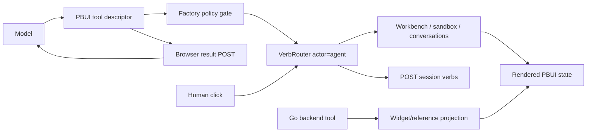
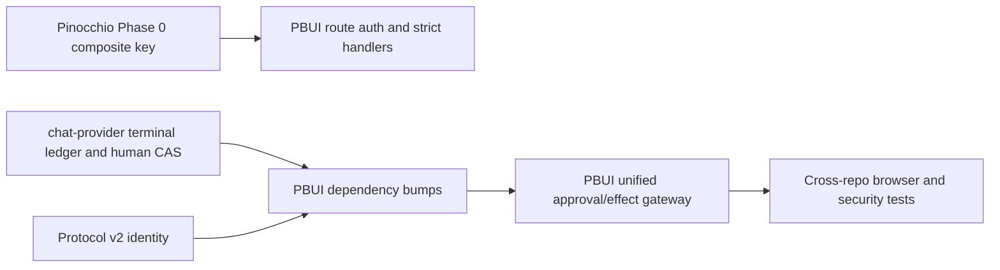

# PBUI agent-to-UI hardening: architecture, security, approvals, implementation guide

## Executive summary

PBUI is the product layer where agent capability becomes visible UI behavior. The repository owns:

- typed references, presentations, object menus, and accept mode;
- chat composition, per-conversation runtimes, mentions/focus, and tool factories;
- the workbench document/verbs and sandbox program library;
- the product verb router and trace reports;
- Go chat/session/tool/result/verb HTTP routes;
- the demo's approval policy and multi-conversation behavior.

The architecture is fundamentally sound: an agent does not write DOM directly. It calls typed backend, automatic frontend, or human tools. High-level UI changes become serializable product verbs. The same workbench verb dispatcher serves mouse gestures and agent tools, and the trace distinguishes `actor: human` from `actor: agent`.

The PBUI-owned defects cluster into four boundaries:

1. **Server trust boundary.** Chat session, snapshot, message, stop, manifest, result, verb, and WebSocket routes are unauthenticated. Session listing reveals ids. This makes the Pinocchio cross-session pending-result defect exploitable on a shared host and permits direct session/run/tool mutation independently.
2. **Approval boundary.** Workbench, sandbox, and conversation factories each implement confirmation differently. Consumption is in-memory and factory-local; conversation send does not consume; sandbox create/action definition check but do not spend; the demo wires only conversation approval, so workbench/sandbox confirm workflows cannot succeed after a visible approval.
3. **Effect/audit boundary.** High-level workbench actions use `router.perform`, but raw workbench mutations, whole-document undo, and several sandbox library writes bypass the verb trace. Tool traffic and UI effect history cannot be causally joined.
4. **Conversation/UI state boundary.** One product-wide composer draft is shared by multiple conversation tiles; closed conversations can remain labeled “opening”; rename never PATCHes the server; failed send preflight can leak queued refs/focus into a later message.

This design introduces one PBUI `ApprovalLedger`, one `AgentEffectGateway`, authenticated session principals, conversation-keyed composer state, explicit conversation lifecycle, title synchronization, operation-keyed send context, preflighted/revision-aware workbench plans, focus restoration, corrected public contracts, and minimum pane constraints. It also defines how PBUI consumes the Pinocchio and react-chat fixes without duplicating their responsibilities.

## 1. Scope and relationship to PBUI-AGENT-4

This ticket is the implementation handoff for findings owned by the PBUI repository. The originating review is:

- `PBUI-AGENT-4/design-doc/06-tool-calls-and-agent-ui-interaction-...code-review.md`.

It also incorporates critical findings from review docs 03–05:

- shared composer draft;
- closed conversation stuck opening;
- title PATCH orphaned;
- Dialog/ObjectMenu focus loss;
- workbench return-type and pane-size issues.

### In scope

- PBUI Go server authorization and request validation integration.
- PBUI approval subject/ledger/gateway APIs.
- workbench, sandbox, conversation tool policy integration.
- causal effect/verb/tool trace correlation.
- per-conversation composer drafts.
- explicit conversation lifecycle and title persistence.
- send refs/focus transaction lifecycle.
- workbench plan/undo semantics.
- Dialog/ObjectMenu focus restoration.
- `Workbench.perform` type correction and minimum pane sizing.
- integration/version bumps for Pinocchio and chat-provider.

### Out of scope

- implementing Pinocchio's pending-call map fix; see `PINOCCHIO-TOOLCALL-1`.
- implementing chat-provider's browser terminal ledger/executor lease; see `REACT-CHAT-TOOL-RUNTIME-1`.
- replacing typed references/presentations/verbs.
- adding compatibility shims that preserve unsafe behavior.

## 2. System orientation for a new intern

### 2.1 Package layers

| Layer | Main path | Responsibility |
|---|---|---|
| PBUI core | `src/` | presentation descriptors, references, surface primitives, tokens/chrome |
| Workbench | `packages/pbui-workbench` | immutable protobuf document, app registry, verbs, rendering |
| Protocol | `packages/workbench-protocol` | generated document/mutation types and pure applier |
| Sandbox | `packages/pbui-sandbox` | constrained agent-authored program engine/library/actions |
| Chat | `packages/pbui-chat` | transcripts, composer, router, tools, multi-conversation registry/scopes |
| Go PBUI plugin | `pkg/pbuichat` | backend tools, prompt, refs/widgets, trace projection |
| Go server | `pkg/chatserver` | HTTP/WS routes, Pinocchio/sessionstream wiring, session index |

### 2.2 Concepts that must remain distinct

- **Reference:** serializable object identity/value/provenance.
- **Presentation:** product-owned rendering/actions for a reference.
- **Verb:** serializable product command routed as local/agent/tool.
- **Tool call:** model/runtime transaction that may execute a verb.
- **Effect:** actual state transition in workbench/library/conversation/server.
- **Approval:** human authorization for one canonical consequential effect.
- **Trace:** durable/observable account of request, decision, effect, and outcome.

A model tool can execute a verb. A human can click the same verb. A backend tool can publish a widget containing a verb without executing it. Keeping these boundaries is the reason PBUI is safer than direct model-driven DOM mutation.

### 2.3 Current agent-to-UI flow



The problem is not the normal high-level path. It is the side paths that bypass the router or use independent approval state.

## 3. Current implementation map

### 3.1 `createPbuiChat`

`packages/pbui-chat/src/createPbuiChat.tsx` assembles one product chat instance and one `ConversationRegistry`. It creates workbench/sandbox/conversation tool sets per conversation so `perform` captures the correct conversation id:

```ts
const perform = verb =>
  router.perform(verb, undefined, { actor: 'agent', conversationId })
```

This is correct and must remain.

The same factory currently owns:

- one product-wide `PbuiChatStore` (including one draft);
- pending message refs/focus keyed by conversation;
- lazy tool sets and manifests;
- workbench/sandbox attachment;
- router binding and send-to-agent formatting.

### 3.2 Tool factories

- `workbenchTools.ts` wraps high-level workbench verbs, raw mutations, policy, and a per-toolset undo ring.
- `sandboxTools.ts` validates/runs/stores programs/actions and routes some effects as verbs.
- `conversationTools.ts` lists sessions and starts an agent handoff.
- `acceptTool.tsx` and `proposeTool.tsx` render human tools.

Each factory currently owns its own approval callback/consumption behavior.

### 3.3 Router and trace

`createVerbRouter.ts` validates against vocabulary, selects `local|agent|tool`, binds conversation context, executes the handler, and queues a POST to `/api/chat/sessions/{id}/verbs`. It records success and rejection. Provenance is embedded under `_provenance`.

### 3.4 Go routes

`pkg/chatserver/server.go:RegisterRoutes` mounts health, vocabulary, sessions, snapshot, title, messages, stop, manifests, results, verbs, and WS directly on `http.ServeMux`. There is no principal/middleware in route signatures.

### 3.5 Conversation state

The registry persists records and captures a `ChatRuntime` for open conversations. `ConversationScope`/`ConversationHost` bind React subtrees. A record can be known, open, closed, active, archived, or forgotten, but the rendering lifecycle currently conflates absent runtime with “opening.”

## 4. Requirements and invariants

### Security

1. Every session route identifies an authenticated principal.
2. A principal can act only on authorized sessions.
3. Session list returns only authorized sessions.
4. WebSocket subscription follows the same authorization.
5. tool manifest/result bodies are mapped to the full Pinocchio invocation contract.
6. Browser client/executor identity cannot be chosen arbitrarily by an untrusted caller.

### Approval

7. One approval subject is canonical across workbench/sandbox/conversation.
8. Approval binds sender, operation, arguments, targets, and references.
9. One capability authorizes one successful effect.
10. Consumption survives reload and cannot cross factory/conversation.
11. Failed validation/refused effect does not consume approval.
12. If approval infrastructure is unavailable, confirm-gated tools are not advertised as performable.

### Effects and traces

13. Every persistent/local agent effect has one effect envelope.
14. Tool invocation, approval, effect, verb trace, and result share correlation ids.
15. Duplicate request does not duplicate effect (dependency runtime plus revision/idempotency guard).
16. Raw mutation and library writes are not audit blind spots.

### Conversation/UI state

17. Draft text/refs belong to one conversation.
18. Closed is explicit and never displayed as indefinitely opening.
19. Title rename has defined local/server ordering and failure UX.
20. refs/focus belong to one send operation and cannot leak after failure.
21. focus returns to invoker when transient surfaces close.
22. workbench public types match runtime values.
23. splits cannot create panes below usability constraints.

## 5. Server authorization design

### 5.1 Principal and authorizer

Reuse PBUI's `pkg/authkit` primitives where appropriate, but keep chatserver dependent on a small interface:

```go
type Principal struct {
    Subject string
    ClientID string
    Scopes map[string]bool
}

type SessionAuthorizer interface {
    Authenticate(*http.Request) (Principal, error)
    CanListSessions(context.Context, Principal) bool
    CanAccessSession(context.Context, Principal, sessionstream.SessionId, SessionAction) bool
}
```

Actions should distinguish read, send, stop, retitle, manifest-write, tool-result, verb-write, and subscribe. A single `session:*` permission may be acceptable initially; explicit action enums make future policy review possible.

### 5.2 Middleware/context

```go
func (s *Server) requireSession(action SessionAction, next sessionHandler) http.HandlerFunc {
  return func(w http.ResponseWriter, r *http.Request) {
    principal, err := s.authorizer.Authenticate(r)
    if err != nil { writeError(w, 401, "unauthorized"); return }
    sid := sessionIDFrom(r)
    if !s.authorizer.CanAccessSession(r.Context(), principal, sid, action) {
      writeError(w, 403, "forbidden"); return
    }
    next(w, r, principal, sid)
  }
}
```

Do not distinguish “session exists” from “not authorized” to an unrelated principal. Keep detailed reason in structured server logs.

### 5.3 Route matrix

| Route | Action |
|---|---|
| `GET /sessions` | list-own |
| `POST /sessions` | create |
| `GET /sessions/{id}` | read snapshot |
| `PATCH /sessions/{id}` | retitle |
| `POST .../messages` | send/run |
| `POST .../stop` | stop |
| `POST .../tools/manifest` | executor manifest-write |
| `POST .../tools/results` | executor result-write |
| `POST .../verbs` | effect trace-write |
| WS subscribe | subscribe/read |

Manifest/result additionally require authenticated `ClientID` equal to the selected browser executor identity from the Pinocchio protocol.

### 5.4 Local development

Provide an explicit development authorizer enabled only by a CLI/config option and loopback binding. Do not silently default to unauthenticated on arbitrary bind addresses. Health/vocabulary may remain public if product requirements allow.

## 6. Unified approval ledger

### 6.1 Why callbacks are insufficient

Current signatures differ:

```ts
workbench: isApproved(id, verb)
conversation: isApproved(id, target, prompt)
sandbox: isApproved(id, verb)
raw: isRawApproved(id, mutations)
```

Consumption sets live inside factory closures. Therefore approval can replay after reload, cross factories, or not be consumed at all.

### 6.2 Canonical subject

```ts
export interface ApprovalSubject {
  version: 1;
  senderConversationId: string;
  operation: string;
  arguments: JsonValue;          // canonical domain input
  targetIds: string[];
  referenceKeys: string[];
  effectScope: 'workbench' | 'sandbox' | 'conversation' | 'server';
}

export interface ApprovalCapability {
  id: string;
  subjectDigest: string;
  issuedAt: string;
  expiresAt: string;
}
```

Canonical JSON rules must define sorted object keys, number/string handling, omitted fields, and reference ordering. Never hash UI labels as authority.

### 6.3 Ledger API

```ts
export interface ApprovalLedger {
  subjectFor(effect: AgentEffect): ApprovalSubject;
  lookup(proposalId: string): Promise<ApprovalCapability | null>;
  consume(
    capability: ApprovalCapability,
    subject: ApprovalSubject,
    effectId: string,
  ): Promise<'consumed' | 'already-used' | 'mismatch' | 'expired'>;
}
```

Target implementation is server-backed because human proposal results and model continuation already cross the server. An offline/local product can implement the same interface with durable browser storage and compare-and-set semantics.

### 6.4 Atomicity

Ideal ordering:

```text
validate effect
reserve/consume approval for effectId
perform effect with idempotency/revision precondition
record outcome
if effect rejected before side effect: release reservation
if performed: finalize consumption
```

For local UI, strict database transaction is impossible. Use a two-phase approval reservation tied to a unique effect id and make the effect revision-checked/idempotent. Never mark an approval reusable merely because result POST failed after effect.

### 6.5 Tool-factory integration

Replace local `spent` sets and callbacks with one injected gateway:

```ts
const result = await effectGateway.execute({
  invocation,
  effect: { kind: 'tile.close', placementId },
  policy: policyFor('tile.close'),
  approvalCapability,
  expectedRevision: workbench.revision(),
  perform: () => router.perform(verb, ..., agentContext),
})
```

Conversation subject includes sender + target + prompt + refs. Sandbox create subject includes title, source digest, bindings, open behavior. Action definition includes full behavior. Raw mutations include canonical protobuf JSON digest.

### 6.6 Availability

If a product cannot approve:

- confirm-gated effect descriptors should be unavailable or clearly return a machine-readable capability-unavailable reason;
- the generated prompt must not instruct the model to call `pbui_propose` for an impossible follow-up;
- Agent Context should distinguish registered/unavailable/provider-advertised.

## 7. Agent effect gateway and causal trace

### 7.1 Effect envelope

```ts
export interface EffectEnvelope {
  effectId: string;
  invocationKey?: ToolInvocationKey;
  actor: 'agent' | 'human';
  conversationId: string | null;
  effectKind: string;
  canonicalInput: JsonValue;
  inputDigest: string;
  approvalId?: string;
  beforeRevision?: string;
  afterRevision?: string;
  outcome: Outcome;
  occurredAt: string;
}
```

The envelope is not a duplicate full transcript. It is correlation metadata plus safe/canonical effect summary.

### 7.2 Gateway responsibilities

```text
execute(effect request):
  validate domain input
  classify policy
  acquire/consume exact approval when required
  verify expected revision/idempotency key
  perform domain effect
  emit effect envelope
  correlate router trace and tool result
  return structured outcome
```

### 7.3 High-level verbs

Keep `router.perform` as the high-level dispatcher. Extend `PerformOptions` with `effectId`, `invocationKey`, and approval correlation. Router reports use those fields rather than burying provenance in an unconstrained `_provenance` object.

### 7.4 Raw workbench mutations

`workbench_apply` currently calls `wb.mutate(batch)` directly. Route it through gateway with effect kind `workbench.mutation_batch`, canonical mutation digest, before/after workbench revision, and destructive classification. It need not invent one fake high-level verb per mutation.

### 7.5 Sandbox persistence

Program create/update and action definition write directly to `ProgramLibrary`. Wrap each write in gateway and emit revision/version evidence. Program opening/removal may still decompose into product verbs; correlation shows both parent tool effect and child UI effects.

### 7.6 Undo

Current whole-document `replaceDocument` bypasses trace and may erase another agent's later work. Replace with revision-checked inverse plan:

```ts
interface UndoPlan {
  token: string;
  createdByEffectId: string;
  expectedCurrentRevision: string;
  inverse: WorkbenchVerb[] | Mutation[];
  expiresAt: string;
}
```

Undo is a normal confirm/allow policy decision, emits an effect, and rejects stale revision with a clear message. If inverse operations cannot be generated safely, remove the returned undo token from agent results until a real path exists.

## 8. Conversation-local composer state

### 8.1 Current defect

`createPbuiChat` creates one `PbuiChatStore`; `chatStore.ts` has one `draft:{text,refs}`; every `Composer` reads it. Two conversation tiles therefore mirror text and reference chips.

### 8.2 Target state

Keep product-wide inspector/watchlist state global. Key only composer state:

```ts
interface PbuiChatState {
  drafts: Record<string, ComposerDraft>;
  // existing product-wide state remains global
}

interface DraftActions {
  setDraftText(conversationId: string, text: string): void;
  insertReference(conversationId: string, ref: Reference, label: string): void;
  clearDraft(conversationId: string): void;
  forgetDraft(conversationId: string): void;
}
```

`ConversationScope` already provides conversation id; `Composer` requires it from context. Outside conversation scope, target the active conversation explicitly or disable composer with an explanation.

### 8.3 Lifecycle/persistence

- closing runtime keeps draft by default so reopen restores work;
- forgetting a conversation removes draft;
- archived conversation retains draft unless product policy says otherwise;
- bound max count/bytes and evict only forgotten/old drafts;
- storage migration maps legacy single draft to the active/legacy conversation once, then removes old key.

### 8.4 Tests

- type in A, B unchanged;
- references in A do not appear in B;
- send A clears only A;
- close/reopen A preserves draft;
- forget A deletes draft;
- active switch does not move drafts.

## 9. Conversation lifecycle and title sync

### 9.1 Explicit lifecycle

Represent runtime lifecycle separately from record flags:

```ts
type ConversationRuntimeState =
  | { phase: 'closed' }
  | { phase: 'opening'; attempt: number }
  | { phase: 'open'; runtime: ChatRuntime }
  | { phase: 'failed'; error: string; retryable: boolean }
  | { phase: 'closing' };
```

UI behavior:

- `closed`: “conversation is closed” + Open action;
- `opening`: progress + Cancel/diagnostic;
- `failed`: error + Retry;
- `open`: render runtime scope;
- `closing`: short transition.

Do not infer opening merely because a record has no runtime.

### 9.2 Title synchronization

Define ownership:

- browser local title is immediate UI source;
- server index is cross-browser convenience;
- human rename wins over agent-generated default;
- PATCH failure remains visible/retryable and does not silently revert the user's local title.

API:

```ts
async rename(id, title, actor): Promise<{
  local: 'updated';
  remote: 'updated' | 'queued' | 'failed';
}>
```

Persist an outbox record for remote retry if offline. Use last-updated/version to avoid old retry overwriting a newer title. Server PATCH authorizes session ownership.

## 10. Send refs/focus transaction

### 10.1 Current order

`sendTo` stores pending context by conversation, then `client.send` may ensure session/connect/sync manifest before `sendMessageBody` consumes it. Preflight failure leaves stale context.

### 10.2 Target API

```ts
interface SendOperation {
  id: string;
  conversationId: string;
  prompt: string;
  refs: Reference[];
  focus?: Focus;
}

await runtime.client.send(
  { prompt },
  { operationId, buildBody: () => exactOperationBody }
)
```

If chat-provider API cannot change immediately, PBUI wraps pending context in `try/finally` and keys by unique operation id. Concurrent sends cannot overwrite each other. `recordSend` records the exact body only after it is constructed for that operation.

### Tests

- connect failure leaves no pending context;
- manifest sync failure leaves no pending context;
- second plain send has no stale refs;
- two concurrent sends receive their own refs/focus;
- handoff target receives exact context.

## 11. Workbench plan and UI hardening

### 11.1 Preflight before snapshot/effect

`workbench_perform` should parse/validate all candidates and policy first. Return a plan:

```ts
interface WorkbenchPlan {
  valid: PlannedVerb[];
  errors: PlannedError[];
  destructive: PlannedVerb[];
  expectedRevision: string;
  atomic: boolean;
}
```

Choose and document one behavior:

- `atomic:true`: all valid/preconditions, then one mutation batch;
- `atomic:false`: sequential partial application, explicit per-item results.

Default consequential multi-verb calls to atomic where protocol supports it. Create undo plan only if at least one effect applies.

### 11.2 Revision

Expose document revision/digest in `describeWorkbench` and tool results. Agent calls should include expected revision for plans based on prior ids/layout. Stale requests return “workbench changed; call workbench_describe again.”

### 11.3 `Workbench.perform` type

Runtime returns whether action was accepted/performed. Public type must say so:

```ts
perform(verb: WorkbenchVerb): boolean
```

Audit every call site for intentionally ignored return. Do not keep a `void` compatibility type that hides refusal.

### 11.4 Minimum pane size

Ratio alone does not prevent repeated splits from making nested panes unusable. Split validation needs rendered/minimum constraints:

```ts
interface PaneConstraints {
  minInlinePx: number;
  minBlockPx: number;
  minFraction: number;
}
```

At split/resize:

- calculate available container dimensions;
- clamp/reject ratio so both children meet min size;
- keyboard and pointer use same rule;
- agent tool receives actionable rejection;
- server/protocol document remains serializable independent of current viewport, while renderer enforces runtime constraints.

## 12. Focus restoration

Dialog/ObjectMenu steal focus and must return it by default.

```ts
function useReturnFocus(open: boolean, explicit?: HTMLElement | null) {
  const invoker = useRef<HTMLElement | null>(null)
  useLayoutEffect(() => {
    if (open) invoker.current = explicit ?? activeElementIfFocusable()
    else queueMicrotask(() => focusIfConnected(invoker.current))
  }, [open, explicit])
}
```

Rules:

- restore on Escape, close button, backdrop, selection, and programmatic close;
- if invoker was removed, focus a documented fallback (owning tile/surface), not body;
- nested surfaces restore to immediate parent invoker;
- add React tests and live keyboard browser checks.

## 13. Cross-repo integration contract

### Pinocchio

PBUI expects Pinocchio to:

- key pending requests by session/tool invocation identity;
- validate exact result session/tool/executor;
- make terminal completion idempotent;
- expose v2 invocation/manifest fields and stable errors.

PBUI changes:

- upgrade Go dependency;
- update result/manifest HTTP structs;
- pass authenticated principal/client identity;
- map Pinocchio stable errors to HTTP status/body.

### react-chat/chat-provider

PBUI expects chat-provider to:

- retain terminal browser invocation state;
- prevent automatic replay and duplicate human completion;
- obey executor assignment;
- serialize/ack manifest sync;
- include full result identity/capability.

PBUI changes:

- upgrade package version;
- adapt runtime/context types;
- remove partial manifest monkey-patch assumptions;
- run consumer/live multi-tab tests.

### Rollout order



## 14. File-level implementation plan

### Phase 0 — Contain critical defects

**PBUI files:** `pkg/chatserver/server.go`, `handlers.go`, options/cmd wiring/tests; chat store/composer tests.

1. add explicit authorizer/principal interfaces and secure defaults;
2. wrap all session/WS routes with action checks;
3. filter session list;
4. bind manifest/result to authenticated client id;
5. upgrade Pinocchio composite-key patch;
6. key composer draft by conversation;
7. add security and two-composer regression tests.

### Phase 1 — Approval and effect primitives

**Files:** new focused packages/modules under `packages/pbui-chat/src/effects` or `approval`; tool factories/router/types/tests; Go persistence/API as selected.

1. define canonical subject/effect envelope;
2. implement ledger/reservation/consume API;
3. wire proposal human result to ledger;
4. route all three tool factories through gateway;
5. remove local spent sets/callback mismatch;
6. expose correlation in trace/helper tiles;
7. make capability availability affect manifest/prompt.

### Phase 2 — Conversation correctness

1. explicit runtime lifecycle state;
2. close/open/retry UI and selectors;
3. rename PATCH outbox/version behavior;
4. operation-keyed send context and failure cleanup;
5. targeted tests and live browser scenarios.

### Phase 3 — Workbench/effect completeness

1. plan/preflight workbench batches;
2. revision/precondition support;
3. causal trace raw/sandbox effects;
4. inverse/revision undo or remove unusable tokens;
5. fix perform return type;
6. minimum pane constraints.

### Phase 4 — Accessibility/observability/release

1. [x] Dialog/ObjectMenu focus restoration;
2. [x] Tools/Events/Context correlation vocabulary;
3. [ ] multi-tab executor E2E with upgraded chat-provider;
4. [x] build/test/package/consumer validation for PBUI-owned code and released Pinocchio;
5. [x] docs/migration/release evidence, with the unresolved executor release recorded explicitly.

> **Implementation status, 2026-08-25:** PBUI-owned focus, correlation, package, rendered, and documentation work is complete. npm `@go-go-golems/chat-provider@0.5.1` now publishes the merged per-runtime terminal ledger and PBUI's local dependency update is under validation, but independent tabs still execute independently. The remaining coordinated contract is the concise `(client_instance_id, connection_id, assignment_id)` design in react-chat's `REACT-CHAT-TOOL-RUNTIME-1/design-doc/02-concise-frontend-tool-executor-ownership-protocol.md`; it intentionally does not require timed leases. See `reference/02-phase-2-5-requirement-to-evidence-audit.md` for the failing two-tab evidence.

## 15. Test strategy

### 15.1 Server/security

Two principals A/B:

- A cannot list/read/retitle/send/stop/manifest/result/verb/subscribe B;
- unauthorized existing and missing session responses do not leak existence;
- manifest/result client id mismatch rejected;
- body limits/status/result schema errors stable;
- local dev mode only accepted under explicit config.

### 15.2 Approval matrix

Vary:

```text
sender × operation × arguments × target × refs × factory × approval × reload × attempt
```

Only the exact first successful effect performs. Wrong sender/refs/args/factory and replay reject. Validation failure leaves approval available or reserved according to documented state.

### 15.3 Conversation/browser

- two drafts isolated;
- close shows closed, reopen works;
- rename reaches server/second browser;
- failed send cannot leak context;
- two tabs, one frontend executor;
- duplicate/reconnect request causes one UI effect;
- double proposal click submits/consumes once.

### 15.4 Effect/trace

For high-level verb, raw mutation, program create/update/open/remove, action define/remove, handoff:

- one tool request;
- zero/one approval;
- one effect envelope;
- expected domain revision/state;
- correlated verb trace(s);
- one terminal tool result;
- one model continuation.

### 15.5 Accessibility/workbench

- Escape restores launcher/ObjectMenu invoker;
- removed invoker falls back to owning tile;
- nested surface restoration;
- split pointer/keyboard/agent paths enforce same pane constraints;
- `perform` boolean type/call sites compile.

### 15.6 Commands

```bash
pnpm --filter @hyperslop-systems/pbui test
pnpm --filter @hyperslop-systems/pbui-workbench test
pnpm --filter @hyperslop-systems/pbui-chat test
pnpm --filter @hyperslop-systems/pbui-sandbox test
pnpm -r typecheck
GOWORK=off go test ./pkg/... -count=1
make ci-check
make protocol-check
pnpm consumer:smoke
pnpm pack:check
```

Add focused real-browser tests for multi-conversation/multi-tab tool flows; unit green alone did not expose the original defects.

## 16. Risks and alternatives

### Alternative: patch each factory separately

Rejected. It preserves inconsistent/durable semantics and future drift. One ledger/gateway is less code over time.

### Alternative: keep routes unauthenticated because demo is local

Rejected as repository default. Explicit loopback development mode is acceptable; shared binding must fail closed.

### Alternative: put every effect into a fake verb

Rejected. Domain effects such as raw mutation batch/program write deserve typed effect envelopes; high-level verbs remain appropriate where they exist.

### Alternative: duplicate entire chat store per conversation

Rejected for the draft fix. Inspector/watchlist/environment are product-wide. Key the conversation-owned slice only.

### Alternative: optimistic title PATCH with silent failure

Rejected. Local-first UX is fine; failure must be observable/retryable and versioned.

### Alternative: whole-document undo with last-writer-wins

Rejected in multi-agent mode. It can erase unrelated later changes. Use inverse/revision preconditions or remove the promise.

## 17. Intern implementation checklist

- [x] read PBUI-AGENT-4 review docs 03–06 and diary evidence;
- [x] keep agent tools per conversation;
- [x] no unauthenticated session route remains by default;
- [x] approval subject is canonical and includes sender/refs;
- [x] no tool factory owns an independent spent set;
- [x] all persistent agent effects emit correlation envelopes;
- [x] drafts are conversation-local;
- [x] closed/opening/failed are distinct;
- [x] title sync has version/retry tests;
- [x] send context is operation-scoped and cleared on all failures;
- [x] workbench plans declare atomicity and revision;
- [x] unsafe whole-document undo tokens/API are removed, so undo cannot overwrite newer work;
- [x] focus returns after every tested surface close path;
- [x] publish the merged per-runtime browser terminal ledger as immutable npm `0.5.1` and begin exact PBUI consumption;
- [ ] implement and publish the concise three-part executor assignment contract, then pass the two-tab one-executor browser/network audit; all other browser, JS/TS, Go, package, and doc validations pass.

## 18. References

- `packages/pbui-chat/src/createPbuiChat.tsx:140-478` — assembly, tool sets, pending send context, manifests, router binding.
- `packages/pbui-chat/src/store/chatStore.ts:40-156` — product-wide state and shared draft.
- `packages/pbui-chat/src/composer/Composer/Composer.tsx` — draft consumption/send.
- `packages/pbui-chat/src/tools/workbenchTools.ts:73-281,399-752` — policy, approval consumption, workbench tools/raw/undo.
- `packages/pbui-chat/src/tools/sandboxTools.ts:1-147,340-605` — sandbox policy and persistence paths.
- `packages/pbui-chat/src/tools/conversationTools.ts:1-180` — handoff validation/approval.
- `packages/pbui-chat/src/router/createVerbRouter.ts:121-243` — family dispatch and trace reports.
- `packages/pbui-chat/src/conversations/registry.ts`, `ConversationHost.tsx`, `ConversationScope.tsx`, selectors — lifecycle/records/scopes.
- `packages/pbui-chat/demo/src/chat.ts:99-305` — current product approval wiring and handlers.
- `pkg/chatserver/server.go:220-238` — route registration.
- `pkg/chatserver/handlers.go:254-318` — manifest/result boundaries.
- `packages/pbui-workbench/src/store.ts`, `createWorkbench.tsx`, `verbs.ts`, SplitPane — document replacement/contracts/layout.
- `src/components/Dialog/Dialog.tsx` and ObjectMenu — transient surface focus.
- `PBUI-AGENT-4` design docs 03–06 and artifacts 33/35 — original evidence and broader design.
- sibling tickets `PINOCCHIO-TOOLCALL-1` and `REACT-CHAT-TOOL-RUNTIME-1` — dependency contracts.

## Conclusion

PBUI should preserve its core architecture: typed objects, typed actions, serializable verbs, browser-owned local UI, and per-conversation agent tools. The fixes are about making ownership and trust explicit, not replacing those primitives.

Secure the routes, centralize exact one-shot approval, correlate every effect, and isolate conversation-owned state. Then integrate Pinocchio's invocation binding and chat-provider's terminal browser ledger. The result is a system where an intern can answer—using code and traces—who requested an action, who approved it, which browser executed it, what changed, whether it was retried, and why the model resumed.
