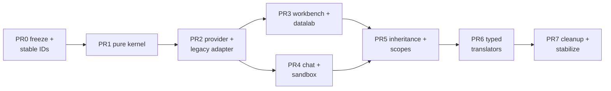

# Intern Guide: Implementing the Action Selection Kernel in Current PBUI

## 0. How to read this guide

Two documents govern this ticket.

The **source guide** —
`sources/PBUI-ACTIONS-1-source-audited-implementation-guide.md` in this ticket
— is the design of record for the kernel's *semantics*: the resolver pipeline,
the availability model, identity rules, trace contracts, and the full test
matrix. It was audited against the pbui 0.6.0 snapshot. When this guide and
the source guide disagree on a semantic question, the source guide wins unless
the disagreement is one of the four amendments in section 5.

**This guide** is the implementation companion against current HEAD. It exists
because the snapshot has drifted (section 3), because the source guide leaves
three integration questions open that the current codebase forces us to answer
(section 5), and because an intern needs the system tour (section 2) that the
source guide compresses into line references.

Read in this order: section 2 of this guide with the referenced files open →
source guide sections 6–18 (the kernel) → this guide's sections 4–8 → source
guide sections 20–27 as each consumer PR begins.

Paths without a package prefix are relative to the pbui repository root
`/home/manuel/workspaces/2026-08-24/use-optkit/pbui/`.

## 1. What this ticket does, in one paragraph

PBUI's object menus are built today from one exact-type lookup: a
presentation's descriptor owns both its representation (label, description,
tone) *and* its actions, and `ObjectMenu` asks `registry.actionsFor(reference,
environment)` when it renders. That single decision blocks five things the
products now need: actions contributed by several independent packages,
actions inherited from abstract types, an explanation of *why* an action is
absent or disabled, deterministic handling of conflicting contributions, and a
guarantee that the verb a user clicks was computed from current state. This
ticket replaces exactly that one seam with a small pure action-selection
kernel — and deliberately nothing else: representation descriptors, the
`Presentation` gesture/accessibility layer, accept mode, focus and Escape
infrastructure, serializable verbs, and every product's verb router stay as
they are.

## 2. The system as it exists at HEAD

### 2.1 References, descriptors, and the registry

A product declares its object world as a `PresentationValues` interface; a
**reference** is `{type, value}` where `type` is a key of that interface
(`src/presentation/types.ts:4-15`). The type is the type *as the interface
understands it* — two structurally identical values with different keys are
different objects to the UI, and that distinction drives everything.

A **descriptor** is one pure object per type
(`src/presentation/types.ts:114-119`):

```ts
export interface PresentationDescriptor<Value, Environment, Verb> {
  label(value: Value, environment: Environment): ReactNode;
  describe?(value: Value, environment: Environment): unknown;
  actions?(value: Value, environment: Environment): readonly PresentationAction<Verb>[];
  tone?: PresentationTone;
}
```

`createPresentationRegistry` closes a partial map of descriptors
(`src/presentation/registry.ts:30-79`). `actionsFor` is one exact lookup with
an empty-array fallback (`registry.ts:69-72`). There is no subtyping, no
composition, no explanation — a missing descriptor or a missing `actions`
callback and the menu is silently empty.

An **action** row (`types.ts:25-112`) carries `id`, `label`, a serializable
`verb`, optional `description`/`group`/`danger`, and the one-field invariant
this codebase is proud of: `disabledBecause?: string` — present ⇔ unavailable,
and the string is why. The long comment above it explains the history (it used
to be two fields; the pair produced the same bug in every product) and the
`disabled?: never` tombstones below it are the house pattern for removing
fields from structurally-inferred returns: deletion alone is silent because
excess-property checks do not fire on inferred return types, so removed fields
are typed `never` to force a compile error. **PR 7 must use this exact pattern
when removing `PresentationDescriptor.actions`.**

### 2.2 The Provider, the menu, and perform

`createPbui({registry, defaultEnvironment, conversions, renderMenuHeader})`
(`src/presentation/createPbui.tsx`) returns the product-bound `Provider`,
`Presentation`, `ObjectMenu`, `MouseDocLine`, and `AcceptBanner`. The pieces
this ticket touches:

- **Menu state** is deliberately light (`types.ts:135-140`):
  `{reference, x, y, returnFocus}`. The menu does **not** store resolved
  actions; `ObjectMenu` recomputes `registry.actionsFor(reference,
  environment)` on every render (`createPbui.tsx:509`). This
  recompute-on-render property is the precedent for the kernel's "a rendered
  menu is not durable authority" rule.
- **Perform** closes the menu and delegates the raw verb
  (`createPbui.tsx:267-270`):

  ```ts
  perform: (verb) => { setMenu(null); return onPerform(verb); },
  ```

  `onPerform` is *required* (`createPbui.tsx:50-53`) — a provider with no
  router would render working menus whose commands silently disappear. Note
  what is absent: no revalidation. The verb baked into the menu row at render
  time is delegated as-is, however stale.
- **Accept mode** (`createPbui.tsx:187-202` and around): `acceptedReference`
  checks exact target membership first, then runs `conversions` callbacks in
  array order, first success wins. Both the highlight check (`isAcceptable`)
  and the click path (`satisfyAccept`) go through the same function — a
  property the translator work must preserve.
- **Gestures and accessibility**: `Presentation` implements three left-click
  contracts through one `activate` prop, inner/outer presentation click
  ownership via a `Symbol.for` marker, Enter/Space routed through `.click()`,
  `inComposite` role/tab-stop yielding, ContextMenu and Shift+F10, mouse-doc
  and live-region output. `ObjectMenu` captures the invoker, restores focus
  (`src/focus.ts`), registers as an Escape surface (`src/surfaces.ts`),
  focuses the first enabled row, and handles arrows and click-away. **None of
  this is rewritten by this ticket.** The tests in
  `src/presentation/createPbui.test.tsx` and `instanceChrome.test.tsx` are the
  migration fence: PR 2 is not done if any of them changed meaning.

### 2.3 The four consumers and their workarounds

Each consumer demonstrates one pressure the exact lookup cannot express:

- **pbui-workbench** (`packages/pbui-workbench/src/tileDescriptor.ts:30,125`)
  — the shared `<tile>` descriptor takes `extra?(tile)` and concatenates the
  product's rows last. Proof that actions need open composition even where
  representation stays closed; the merge owner is the wrong package.
- **datalab-ui** (`packages/datalab-ui/src/pbui/registry.ts:84`) — adapts its
  own action shape into pbui's with manufactured IDs:
  `` id: `${descriptor.ptype}:${index}:${action.label}` ``. A label edit or an
  inserted row changes identity; unusable for overrides, traces, or
  revalidation. Its `<datum>` descriptor
  (`src/pbui/descriptors/datum.ts:29-64`) emits two filter actions per
  categorical field, capped at four — the dynamic-family requirement.
- **pbui-sandbox** (`packages/pbui-sandbox/src/actions.ts`) —
  `withGeneratedActions(base, options)` wraps the whole registry and appends
  live agent-created actions from the program library when `actionsFor` runs.
  The library mints stable `act-N` ids (`src/library.ts`), which is exactly
  the identity the kernel's revalidation needs — the wrapper, not the data, is
  the problem.
- **pbui-chat demo** (`packages/pbui-chat/demo/src/pbui/registry.ts:48`) —
  same unstable-ID adapter pattern as datalab, plus dependence on the sandbox
  wrapper; the chat verb router (`packages/pbui-chat/src/router/
  createVerbRouter.ts`) and effect gateway (`src/tools/agentEffectGateway.ts`)
  own validation, family dispatch, approvals, idempotency, and the durable
  trace — the effect boundary the kernel must *not* absorb.

### 2.4 Why the seam is the problem (condensed)

The exact descriptor callback conflates four ownership models: representation
has one owner per concrete type; actions have many independent contributors;
inherited behavior belongs to semantic type relationships; and live generated
actions appear after the descriptor map closed. The workarounds (`extra`,
wrapper, adapters) each reinstate array-order semantics and unstable identity.
And the perform path delegates stale verbs: the menu row's verb is whatever
the state was at render, with no check at click time. The source guide's
section 4 table maps each required behavior to why the callback cannot express
it; internalize that table before writing kernel code.

## 3. Drift audit: snapshot vs HEAD

Verified 2026-08-26 against HEAD (`task/use-optkit`, after the agent-packages
release and the P-series review fixes):

| Source-guide claim | Status at HEAD |
| --- | --- |
| Exact `actionsFor` lookup | unchanged (`registry.ts:69-72`) |
| Menu resolves at render | unchanged (`createPbui.tsx:509`) |
| Raw-verb perform, no revalidation | unchanged (`createPbui.tsx:267-270`) |
| `disabledBecause` one-field invariant + tombstones | unchanged (`types.ts:25-112`) |
| `tileDescriptor.extra` seam | unchanged (`tileDescriptor.ts:30,125`) |
| Sandbox registry wrapper | unchanged (`pbui-sandbox/src/actions.ts`) |
| Unstable `${ptype}:${index}:${label}` adapter IDs | unchanged in **both** datalab-ui (`registry.ts:84`) and chat demo (`registry.ts:48`) |
| Conversions ordered-array semantics | unchanged (`createPbui.tsx:187-202`) |
| `onPerform` optionality | **drifted:** now required (`e903dbd`) — one migration step already done |
| `MenuState` location | **drifted:** moved into `types.ts:135-140`; still holds `reference` |
| `createPbui.tsx` size | 685 lines (was 679); P-series commits changed click-bubbling (P4), merged prop pairs (P3.4-3.5), fixed ARIA nesting and focus restoration (`ab2a629`) — gesture semantics subtly newer than the audit |
| pbui-chat internals | **drifted:** PBUI-TOOLCALL-1 landed the executor-aware tool runtime around the router/gateway. The seam holds, but PR 4 must re-audit `createVerbRouter.ts` and `agentEffectGateway.ts` line-by-line before migrating chat |

Consequence: the design transfers intact; the *integration* PRs (2 and 4)
must be written against HEAD behavior, not the guide's line numbers, and PR 0
must freeze HEAD behavior (including the P-series gesture fixes) as the
goldens.

## 4. The kernel, condensed to its load-bearing contracts

This section is deliberately a compression. Every contract here is specified
in full in the source guide (section references given); implement from there,
use this as the map.

### 4.1 The shape of the whole thing

```text
reference + ActionQuery + SelectionSnapshot
        │
        ▼
validated type graph ── rules / families (independent contributions)
        │
        ▼
scope filter → type reachability → family expansion → conditions
        │
        ▼
partition by action ID → specificity → scope → priority → ambiguity
        │
        ▼
ResolvedAction[] + compact trace          (pure; no effects; no React)
        │
        ▼  (user clicks)
fresh re-resolution → same candidate still wins? → bind → onPerform(verb)
```

### 4.2 Five identities (source §7)

- **Runtime type ID** — a node in the nominal type graph; concrete (`tile`)
  or abstract (`object`). Concrete references stay restricted to
  `PresentationValues` keys; abstract nodes need no payload.
- **Rule ID** — one declaration by one package (`workbench.tile.close`).
  Globally unique; appears in traces.
- **Family ID + instance key → candidate ID** — a dynamic contribution source
  and its stable per-expansion keys (`datalab.datum.filters/keep:region`).
  Array index and label are forbidden as identity.
- **Action ID** — the *conceptual* operation (`presentation.open`). Several
  rules implementing one action ID compete; different action IDs accumulate.
  The rule-vs-action distinction is what makes overrides expressible at all.
- Menu `group`/`order` are presentation metadata; changing menu order must
  never change which rule wins.

### 4.3 Type graph (source §8)

Nominal, validated at registration (duplicates, unknown parents, cycles →
throw), BFS shortest-distance for specificity, multiple inheritance allowed.
The one subtle contract: **inheritance never coerces payloads**. An inherited
rule for abstract `document` receives the *original* concrete reference; the
API makes this visible with two factories, `actions.exact(type, …)` (narrowed
payload) and `actions.inherited(typeNode, …)` (generic reference).

### 4.4 Selection snapshot (source §9)

The resolver never reads live stores. The product supplies
`snapshotFor(query, environment)` returning
`{revision, scopes, modes, capabilities, product}` — immutable, query-local
facts plus a revision that advances whenever any resolution-relevant fact
changes. The revision is drift telemetry, not authorization; perform always
re-resolves. Datalab's environment already separates cheap schema access from
expensive table evaluation — snapshots must preserve that cost boundary
(schema-only facts for render-adjacent paths).

### 4.5 Availability: four states, two kinds of absence (source §10)

```ts
type Availability =
  | { kind: "available" }
  | { kind: "unavailable"; because: string; code?: string }   // visible, disabled, one reason
  | { kind: "inapplicable"; because: "not-relevant" | "not-applicable" }  // absent, permits fallback
  | { kind: "hidden"; because: "not-disclosed" | "policy" };  // absent, SUPPRESSES fallback
```

The distinction is a policy-safety mechanism, not taxonomy: a hidden
`secret-file.open` must keep suppressing generic `document.open`, while an
irrelevant `restore` on a live file must not block a genuinely different
fallback. Unavailable specific rules also suppress generic fallback — falling
back to generic `delete` around a protected-file rule would bypass the policy.
This quartet is the part of the design most worth internalizing before coding
the resolver.

### 4.6 Conditions (source §11)

Minimal algebra: `all`, `mode`, `capability`, `predicate` — nothing else in
phase 1; named product predicates are the escape hatch, are the only nodes
that read `snapshot.product`, return full `Availability` (not boolean), and
fail closed on unknown IDs. `all` short-circuits to the first non-available
child so a disabled row carries exactly one actionable reason.

### 4.7 Resolver (source §15)

The 16-step pipeline; the precedence ladder within one action ID is: smallest
type distance → nearest active scope → highest explicit priority → **ambiguity
returned as data, nothing selected**. Registration order, import order, array
order, labels, and menu order are never tie-breakers, and a permutation test
enforces it. Binding runs only for the uniquely selected *available*
candidate. The trace is emitted by the same branches that selected — never a
second debug resolver.

### 4.8 Fresh revalidation (source §18)

```ts
async function performAction(stale) {
  const fresh = actions.resolve(stale.query, snapshotFor(stale.query, environment));
  const current = fresh.actions.find((a) => a.action === stale.action);
  if (!current)                                  return refused("action-no-longer-resolves");
  if (current.candidateId !== stale.candidateId) return refused("action-implementation-changed");
  if (current.status.kind !== "available")       return refused("action-no-longer-available", …);
  await onPerform(current.verb);                 // the FRESH verb, never the stale one
  return { kind: "delegated" };
}
```

Both the action ID *and* the candidate ID must match — a newly loaded
more-specific rule must not silently change semantics after the user chose a
row. `delegated` means PBUI crossed its boundary, not that the domain accepted
the mutation; authorization stays in product routers (chat gateway approvals,
workbench mutation preflight).

### 4.9 Typed translators (source §19; last)

Direct edges only (no chaining), subtype satisfaction preserves the concrete
reference, one resolver for highlight and click, ambiguity opens an explicit
chooser that participates in `useEscapeSurface`/`focus.ts` like every other
transient surface. Replaces the two ordered conversions
(`datalab.cat-to-field`, `chat.row-to-product`) only after the action kernel
is stable.

## 5. Four amendments for the current codebase

These are the places this ticket deviates from or completes the source guide.
Each was validated against HEAD; each keeps the guide's semantics intact.

### Amendment A — Two perform entry points, not a signature change

Source §17.2 changes context `perform` to accept a `ResolvedAction`. At HEAD
that breaks real callers: tile chrome buttons and product toolbars call
`pbui.perform(verb)` with hand-built verbs (deliberately — "the tile and the
menu cannot drift into two different flows"). Those calls construct the verb
at click time from live props, so they never had the stale-menu problem the
revalidation solves.

**Decision:** keep `perform(verb)` exactly as-is (raw delegation), add
`performAction(resolved: ResolvedAction): Promise<PerformResult>` implementing
§4.8. `ObjectMenu` switches to `performAction`; chrome/toolbars keep
`perform`. Both end at `onPerform(verb)`, so the effect boundary stays single.
Document on `perform` that menu-derived actions must go through
`performAction`.

### Amendment B — Optional kernel with an automatic legacy adapter

Source PR 2 has every product pass `actions` + `snapshotFor` immediately.
**Decision:** both options are optional in `createPbui`. When `actions` is
absent, the provider constructs the source-§23 legacy family internally from
the descriptor registry, with a trivial snapshot
(`{revision: 0, scopes: ["global"], modes: ∅, capabilities: ∅, product: {}}`).

Consequences: after PR 2, every existing product compiles unchanged and
behaves identically, there is still exactly one live selection engine (the
kernel — the legacy path is a family inside it, not a bypass), and products
opt in per package. The adapter is deleted in PR 7 per the source guide's exit
criterion; it must not survive as a permanent second model. Revalidation
through the legacy family re-invokes the descriptor callback with the current
environment, which is strictly better than today's stale-verb delegation even
before any product migrates.

### Amendment C — Shared-package contributions as exported fragments

The source guide removes `tileDescriptor.extra` but does not specify how a
*shared package* contributes types, scopes, and rules to a *product-owned*
registry. **Decision:** pbui-workbench exports composable fragments:

```ts
// packages/pbui-workbench/src/actions.ts (new)
export const workbenchTypeDefinitions: readonly PresentationTypeDefinition[];
  // "tile", "workspace" as concrete nodes (abstract parents arrive in PR 5)
export const workbenchScopes: readonly ScopeId[];        // ["workbench"]
export function workbenchActionContributions():
  readonly Contribution<WorkbenchValues, WorkbenchFacts, WorkbenchVerb>[];
  // tile.split / tile.close / tile.swap / view rename / workspace ops …
```

A product spreads them:

```ts
const registry = createActionRegistry({
  graph: createPresentationTypeGraph([...workbenchTypeDefinitions, ...productTypes]),
  scopes: [...productScopes, ...workbenchScopes, "global"],
  contributions: [...workbenchActionContributions(), ...productContributions],
});
```

A product adding tile actions registers its own `exact("tile", …)` rules under
its own rule IDs — no callback seam, no merge owner, and the kernel's
override/ambiguity machinery arbitrates. `createTileDescriptor` keeps
label/describe/tone only. The "Shown in N tiles" informational row stays
modeled as a disabled action during migration (source §20.1).

### Amendment D — Stable IDs land in PR 0, before the goldens

Source §23.2 warns not to fossilize label/index IDs but sequences the fix
loosely. **Decision:** fixing the two adapters
(`datalab-ui/src/pbui/registry.ts:84`, chat demo `registry.ts:48`) to
deliberate IDs (Appendix B conventions of the source guide) is part of PR 0,
*before* golden fixtures are recorded — otherwise the migration fence
enshrines `field:2:Map to y` and every later PR fails goldens for identity
reasons rather than behavior reasons.

## 6. File-by-file implementation plan

### 6.1 New pure-kernel files (PR 1)

```text
src/presentation/actions/
  ids.ts            branded RuleId/FamilyId/CandidateId/ActionId/ScopeId/ModeId helpers
  types.ts          ActionQuery, ActionMetadata, rules, families, ResolvedAction,
                    ResolutionResult, SelectionAmbiguity, ResolutionTraceEntry
  typeGraph.ts      createPresentationTypeGraph: validation + BFS distances
  availability.ts   the four-state type + available()/unavailable()/… helpers
  conditions.ts     all/mode/capability/predicate + evaluator (fail-closed)
  registry.ts       createActionRegistry: indexes by (declared type, invocation),
                    registration validation, diagnostics()
  resolve.ts        the 16-step resolver + compact trace emission
  explain.ts        describeTraceEntry + verbose materializer
  legacy.ts         legacyDescriptorFamily (Amendment B's internal adapter)
  perform.ts        the revalidation algorithm (pure part; React glue in createPbui)
  index.ts          public exports
  *.test.ts         per-module tests + permutation invariants
```

No React imports anywhere under `actions/`. Everything testable in Node.

### 6.2 Changed files by PR

| PR | Files | Change |
| --- | --- | --- |
| 0 | `datalab-ui/src/pbui/registry.ts`, chat demo `registry.ts` | deliberate stable IDs (Amendment D) |
| 0 | new `*.golden.test.ts` in core + each consumer | freeze HEAD menus: labels, order, disabled reasons, verbs; generated-action liveness; conversion order |
| 1 | `src/presentation/actions/**` (new) | the kernel |
| 2 | `src/presentation/createPbui.tsx` | optional `actions`/`snapshotFor`; `MenuState` gains `invocation` (query derived); ObjectMenu maps `ResolvedAction`; `performAction` (Amendment A); ambiguity row |
| 2 | `src/presentation/types.ts` | `MenuState` extension; no descriptor changes yet |
| 2 | `public/presentation-parts.css` | `[data-part="menu-ambiguity"]` only |
| 2 | `src/presentation/index.ts`, root exports | export kernel API |
| 3 | `pbui-workbench/src/actions.ts` (new), `tileDescriptor.ts` | fragments (Amendment C); delete `extra` |
| 3 | `datalab-ui/src/pbui/**` | field channel rules, datum family, doc/stage `inapplicable`, delete adapter |
| 4 | `pbui-sandbox/src/actions.ts` | replace wrapper with `createGeneratedActionsFamily` |
| 4 | chat demo `pbui/**` | 19 descriptors → representation-only + rules/families |
| 5 | product graphs | abstract `object` + inherited `object.inspect`/`object.watch`; scope stacks |
| 6 | `src/presentation/translators/**` (new), both `runtime.tsx` | typed translators + chooser |
| 7 | `types.ts`, `registry.ts`, playbooks, Storybook | remove `descriptor.actions` with `never` tombstone; delete `legacy.ts`; rename registry interface with deprecated alias |

### 6.3 The PR ladder with exit criteria



- **PR 0 exit:** behavior migration is reviewable as equivalence; adapter IDs
  are deliberate; goldens record HEAD (including P-series gesture behavior).
- **PR 1 exit:** resolver contract stable, UI-independent; permutation tests
  pass; exported under an internal subpath.
- **PR 2 exit:** one live selection engine; zero product changes; every
  existing `createPbui.test.tsx`/`instanceChrome.test.tsx` contract preserved
  unmodified; menu behavior byte-identical to goldens.
- **PR 3 exit:** two materially different consumer styles (shared-package
  fragments; product rules + a bounded family) prove the API; `extra` gone.
- **PR 4 exit:** live generated actions flow through the kernel; chat router
  and gateway receive unchanged domain verbs; optional `pbuiAction`
  provenance wired where `PerformOptions.provenance` accepts it. Re-audit
  chat internals (PBUI-TOOLCALL-1 landed since the source audit) before
  starting.
- **PR 5 exit:** inheritance delivers value beyond exact migration
  (inspect/watch dedup across datalab's ~15 types is the demonstrated-reuse
  case the source guide requires); discovered ambiguities resolved and
  documented.
- **PR 6 exit:** accept is typed, deterministic, explained; chooser is a
  proper Escape/focus surface; the two conversions behave identically before
  ambiguity features switch on.
- **PR 7 exit:** source guide §29 definition of done, plus: no
  `descriptor.actions` users in-repo, tombstones in place, version bumped
  (0.7.0), playbooks and Storybook updated.

## 7. Testing strategy

The source guide §24 is the authoritative matrix; the compressed shape:

- **The migration fence:** every existing presentation/chrome behavior test is
  preserved, not replaced by resolver unit tests. Kernel work that needs a
  fence test changed is wrong until proven otherwise.
- **Kernel tables:** the §24.3 resolver table (specific-over-generic,
  unavailable-suppresses, inapplicable-permits, hidden-suppresses, ambiguity,
  scope, priority, permutation) as data-driven tests.
- **Family invariants:** stable candidate IDs across identical snapshots;
  duplicate keys rejected; label changes do not change identity; sandbox
  liveness without registry rebuild; datum family cap and pairing.
- **Revalidation:** all seven §24.6 cases, plus `onPerform` never called on
  refusal and rejection surfacing as `failed` without claiming domain
  acceptance.
- **Goldens:** per-consumer menu snapshots recorded in PR 0, asserted through
  PR 7. A golden change in any migration PR is a finding, not a fixup.
- **Property-style invariants** without new dependencies: deterministic
  permutations per §24.9.

## 8. Interaction with the OPTKIT workbench track

The ragttc workbench product (OPTKIT-022/023, in the rag-ttc repository) is
greenfield. If PRs 1–2 land before its descriptor step, it should:

- write action contributions natively (rules/families, never descriptor
  `actions()`), with rule/action IDs following the source guide Appendix B
  conventions from day one;
- express its authoring gates as conditions — the designed
  `disabledBecause: "no proposal draft is open"` becomes
  `predicate("draft.active")`, and OPTKIT-024's review-mode ideas become
  `mode` conditions rather than bespoke checks;
- keep its OPTKIT-021 conversions table shaped so each row becomes one typed
  translator in PR 6 (`verdict → case`, `delta → case`, `candidate → arm`, …);
- treat `trial → arm`-style substitution as a PR 5 subtyping candidate rather
  than a conversion, once inheritance exists.

Nothing in OPTKIT-022 *waits* on this ticket — the legacy adapter path keeps
descriptor actions working — but coordinating IDs now means that product
migrates by deletion instead of rewrite.

## 9. Pitfalls

- **Do not rewrite `Presentation` gesture logic while integrating the menu.**
  The P-series commits show how subtle click ownership is at HEAD; PR 2's diff
  to `createPbui.tsx` should be additive around the menu and perform paths.
- **Do not let the legacy adapter become permanent.** It exists so PR 2 ships
  with zero product changes; PR 7 deletes it. Two first-class action models is
  the failure mode.
- **Do not bind unselected candidates.** Binding is post-selection only —
  earlier binding is wasted work and produces misleading audit values.
- **Do not use `danger` for policy.** It styles and confirms; authorization
  lives in product routers and the chat gateway.
- **Do not add condition operators speculatively.** `all`/`mode`/`capability`/
  `predicate` until a real repository interaction demands more (source §30,
  invariant 18).
- **Do not trust the source guide's line numbers.** They reference the 0.6.0
  snapshot; the claims were re-verified (section 3) but the offsets have
  moved. Verify against HEAD when in doubt.
- **Fail closed everywhere.** Unknown predicate, unknown operator, invalid
  graph, duplicate IDs — throw at registration or refuse at resolution; never
  default to available.

## 10. Glossary

- **Reference / presentation type:** `{type, value}`; the type as the
  interface understands it.
- **Descriptor:** per-type representation policy (label/describe/tone) — after
  this ticket, *only* that.
- **Rule / family / candidate:** a static declaration; a bounded dynamic
  generator; one concrete competitor (rule, or family instance) in a
  resolution.
- **Action ID:** the conceptual operation rules compete to implement.
- **Snapshot:** immutable, revisioned, query-local facts the resolver reads.
- **Availability quartet:** available / unavailable (visible + one reason) /
  inapplicable (absent, permits fallback) / hidden (absent, suppresses
  fallback).
- **Ambiguity:** declarations that do not decide; returned as data, never
  executed through.
- **Revalidation:** fresh resolve at perform; same action *and* same candidate
  must win, and the fresh verb is delegated.
- **Translator:** a typed, scoped, explained replacement for an ordered
  conversion callback.
