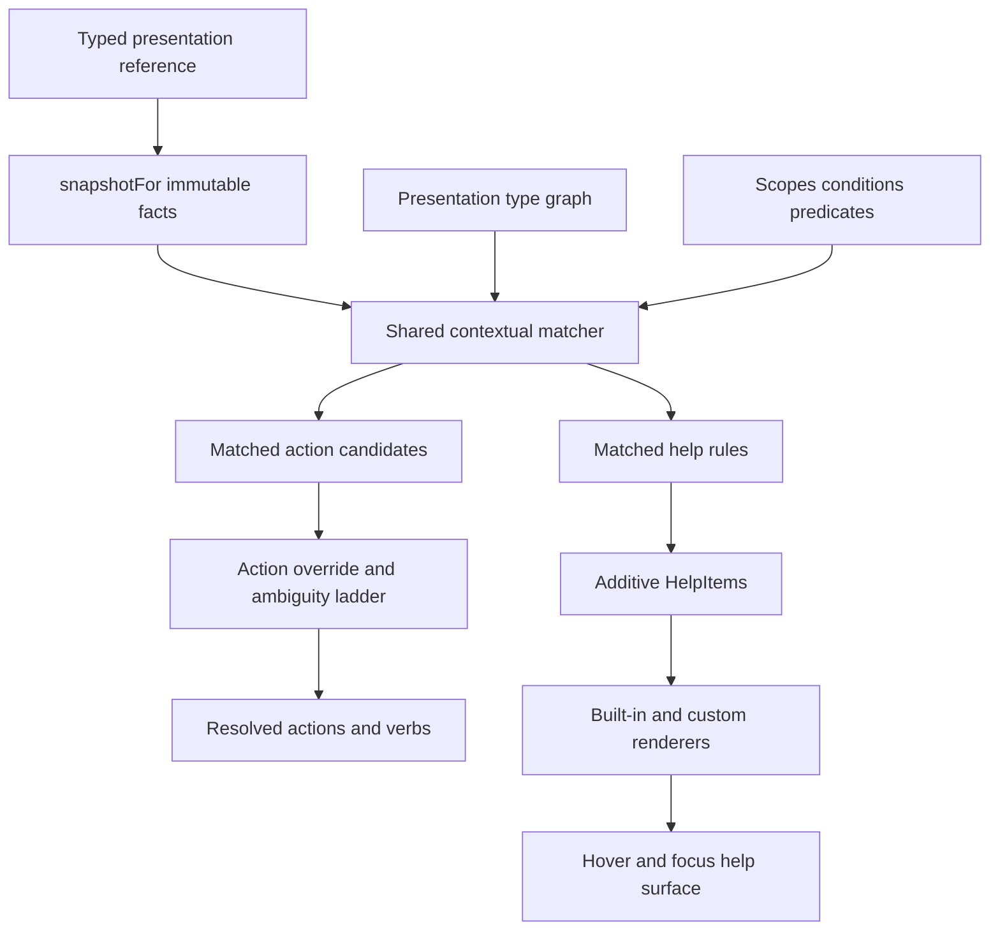

# Intern Guide to the PBUI Contextual Help Kernel

## 1. Executive summary

PBUI already answers a contextual question: given a typed presentation, an invocation, and an immutable product snapshot, which actions apply? Its action kernel uses a nominal runtime type graph, active scopes, conditions, named predicates, explicit priority, and deterministic ambiguity handling. Products provide the snapshot through `snapshotFor`; the resolver never reads a live store.

Contextual help asks a closely related question: given the same typed presentation and snapshot, which explanatory items should be shown? Help should reuse the existing type, scope, condition, and snapshot matching machinery. It should not become an action, use `onPerform`, or participate in the action override ladder. Actions compete by conceptual action ID and select one implementation. Help contributions accumulate.

This ticket introduces a sibling **help kernel** with a deliberately small first release:

- exact and inherited help rules;
- the same presentation type graph, scope stack, condition algebra, named predicates, and immutable product facts used by actions;
- additive help-item resolution with stable IDs and numeric ordering;
- built-in text, Markdown, fields, notice, and available-actions renderers;
- a registry for custom typed React renderers;
- one shared help surface opened from pointer hover and keyboard focus;
- one Datalab custom help component proving the extension seam.

The first version is synchronous. It does not fetch data, cache remote content, analyze multi-selection, or define a general overlay framework. A rule resolves against facts already captured by `snapshotFor`.

## 2. The current PBUI architecture

### 2.1 Presentations separate identity from representation

A product defines `PresentationValues`, mapping runtime type IDs to concrete payloads. A presented object is a `PresentationReference<Values>`:

```ts
export type PresentationReference<Values, Type = keyof Values> = {
  type: Type;
  value: Values[Type];
};
```

Descriptors in `src/presentation/registry.ts` are representation policy only. They provide label, description, and tone. Since pbui 0.8, descriptors do not own menus or actions.

That separation must remain intact. Static tooltip text in a descriptor cannot account for active scopes, modes, capabilities, query-local product facts, inherited types, or product-specific custom rendering. Help belongs beside the action kernel, not back inside descriptors.

### 2.2 Products capture immutable facts

`createPbui` accepts a product function:

```ts
snapshotFor(
  query: ActionQuery<Values>,
  environment: Environment,
): SelectionSnapshot<ProductFacts>;
```

The snapshot contains:

```ts
interface SelectionSnapshot<ProductFacts> {
  revision: string | number;
  scopes: readonly ScopeId[];       // nearest/local first
  modes: ReadonlySet<ModeId>;
  capabilities: ReadonlySet<string>;
  product: Readonly<ProductFacts>;
}
```

Datalab demonstrates the intended boundary in `packages/datalab-ui/src/pbui/actions.ts`. `snapshotForDatalab` derives an active document, target document, field type, categorical fields, and a revision from the presentation subject plus product environment. Action rules read only this frozen value.

Help rules should read the same snapshot. A field's action and its help must not disagree because one read current schema state and the other read a component prop captured at a different time.

### 2.3 The action resolver has two distinct halves

`resolveActions` currently performs two conceptual jobs.

The first half determines contextual reachability and status:

1. Find the concrete subject type and all ancestors in the type graph.
2. Reject rules not valid for the current invocation.
3. Find the nearest declared scope that is active.
4. Expand dynamic action families.
5. Evaluate declarative conditions and optional pure tests.
6. Remove `inapplicable` candidates while retaining the override meaning of hidden and unavailable candidates.

The second half is action-specific competition:

1. Partition candidates by action ID.
2. Prefer smallest type distance.
3. Prefer nearest active scope.
4. Prefer highest explicit priority.
5. Return ambiguity instead of using registration order.
6. Bind a verb only for the uniquely selected available candidate.

Help should reuse the first half. It should not reuse the second half because help items do not implement competing versions of one command. Every matching help rule may contribute content.



## 3. Problem statement

PBUI products currently have several unsatisfactory ways to explain an object:

- hard-code a browser `title` string at the component call site;
- add explanatory text to a descriptor that cannot see query-local facts;
- duplicate action predicates in a tooltip component;
- open an Inspector for information that should be available at a glance;
- build a product-specific popover unrelated to PBUI presentation identity.

These approaches diverge as soon as help depends on context. A protected object may have different help in an editor scope than in a global scope. A field's useful explanation depends on its live data type. Available actions and their disabled reasons already come from the action kernel and should not be reconstructed by a tooltip.

The system needs one typed way to compute contextual help while allowing products to render domain-specific content such as progress summaries, compact charts, or evidence blocks.

## 4. Scope of the first release

### Included

- One help query for one `PresentationReference`.
- Exact and inherited type matching.
- Active scope matching.
- Existing `Condition` and named predicate evaluation.
- Existing `SelectionSnapshot<ProductFacts>`.
- Stable help rule and item IDs.
- Additive item composition sorted by explicit order.
- Built-in text, Markdown, fields, notice, and actions items.
- Custom typed React help renderers.
- Pointer hover and keyboard focus opening the same content.
- Unit tests, component tests, and Storybook examples.

### Deferred

- Asynchronous rule evaluation or network loading.
- Multi-object or selection relationship help.
- Help-specific authorization framework.
- A second predicate language.
- Replacement, exclusion, or complex section merge policies.
- Agent-facing help export.
- Analytics and hover telemetry.
- Touch long-press behavior.
- Rich Markdown plugins, raw HTML, and product-specific mention syntax.

Deferring these features keeps the first implementation small enough for one frontend engineer while preserving an extension path.

## 5. Design overview

The help system has four pieces:

```text
HelpRule      declares when help applies and produces items
HelpKernel    resolves matching rules against a subject and snapshot
HelpItem      is structured data naming a renderer and payload
HelpRenderer  renders one item as React content
```

The action and help systems share contextual matching but have separate registries and results:

```text
action registry: matched rules → action partitions → selected verbs
help registry:   matched rules → additive help items → rendered content
```

## 6. Shared contextual matching

### 6.1 Extract a pure matcher from `resolveActions`

Do not rewrite the action resolver. Extract the smallest reusable operations from its front half into a focused module, proposed as:

```text
src/presentation/context/
  match.ts
  types.ts
```

Proposed types:

```ts
export interface ContextTarget {
  subject: RuntimeTypeId;
  match: "exact" | "subtypes";
  scopes: readonly ScopeId[];
  when?: Condition;
}

export interface ContextMatch {
  declaredType: RuntimeTypeId;
  concreteType: RuntimeTypeId;
  typeDistance: number;
  scope: ScopeId;
  scopeIndex: number;
  priority: number;
}

export function matchContext<Values extends PresentationValues, ProductFacts>(
  target: ContextTarget,
  subject: PresentationReference<Values>,
  snapshot: SelectionSnapshot<ProductFacts>,
  graph: PresentationTypeGraph,
  predicates: ReadonlyMap<PredicateId, ProductPredicate<Values, ProductFacts>>,
):
  | { kind: "matched"; match: ContextMatch }
  | { kind: "rejected"; stage: "type" | "scope" | "condition"; reason: string };
```

The extracted function owns:

- exact versus subtype reachability;
- shortest ancestor distance;
- nearest active declared scope;
- condition evaluation;
- match provenance.

Action-specific invocation checks, family expansion, availability override semantics, partitioning, ambiguity, verb binding, and action traces remain in `actions/resolve.ts`.

### 6.2 Preserve action behavior byte-for-byte

This refactor is only acceptable if existing action tests remain unchanged. Add a permutation or fixture test comparing resolution before and after extraction if practical. At minimum, the full action test suite and Datalab menu goldens must remain green.

Do not generalize all action types into one large generic framework. A small shared `matchContext` function is sufficient.

### 6.3 Help query and snapshot adaptation

The first version does not need to change `ActionInvocation` or every product's `snapshotFor` signature. The help runtime can ask the product for the existing introspection snapshot:

```ts
const actionQuery: ActionQuery<Values> = {
  subject: reference,
  invocation: "introspection",
};
const snapshot = snapshotFor(actionQuery, environment);
const result = help.resolve({ subject: reference }, snapshot);
```

`introspection` already means a non-performing contextual query. Help rules have their own registry, so action invocation filtering is irrelevant to help selection.

This adapter is intentionally conservative. A future release may introduce a generic `InteractionQuery` with `help` as an invocation after real consumers show that help needs facts different from action introspection.

## 7. Help rule API

### 7.1 Rule contracts

Use exact and inherited factories matching the action authoring model:

```ts
export interface ExactHelpRule<
  Values extends PresentationValues,
  Type extends PresentationType<Values>,
  ProductFacts,
> {
  id: HelpRuleId;
  subject: Type;
  match: "exact";
  scopes: readonly ScopeId[];
  when?: Condition;
  test?(context: ExactRuleContext<Values, Type, ProductFacts>): Availability;
  priority?: number;
  help(context: ExactRuleContext<Values, Type, ProductFacts>): readonly HelpItem[];
}

export interface InheritedHelpRule<Values, ProductFacts> {
  id: HelpRuleId;
  subject: RuntimeTypeId;
  match: "subtypes";
  scopes: readonly ScopeId[];
  when?: Condition;
  test?(context: InheritedRuleContext<Values, ProductFacts>): Availability;
  priority?: number;
  help(context: InheritedRuleContext<Values, ProductFacts>): readonly HelpItem[];
}
```

For the first version, only `available` matches. `unavailable`, `inapplicable`, and `hidden` produce no help items. This avoids importing action override semantics into additive help. A help rule that explains an unavailable action can resolve the action registry and emit an actions item instead.

Factories preserve payload typing:

```ts
const define = defineHelp<PresentationValues, DatalabFacts>();

const fieldHelp = define.exact("field", {
  id: "datalab.field.help",
  scopes: ["datalab"],
  help: ({ subject, snapshot }) => [
    // subject.value is FieldRef here
  ],
});
```

No dynamic family abstraction is needed initially. A rule's `help` callback can return any bounded number of items.

### 7.2 Additive composition

All matching help rules contribute. Rules do not shadow each other by type distance or priority. Type distance and priority determine display ordering only:

```text
nearest type first
nearest scope first
highest rule priority first
item order ascending
stable item id last
```

A proposed resolved result:

```ts
export interface HelpResolution {
  items: readonly ResolvedHelpItem[];
  diagnostics: readonly HelpDiagnostic[];
  snapshotRevision: string | number;
  registryVersion: string | number;
}

export interface ResolvedHelpItem extends HelpItem {
  provenance: {
    ruleId: HelpRuleId;
    declaredType: RuntimeTypeId;
    concreteType: RuntimeTypeId;
    typeDistance: number;
    scope: ScopeId;
    scopeIndex: number;
    priority: number;
  };
}
```

Stable item IDs are required. If two matched rules emit the same ID, resolution should keep neither silently. Return a duplicate diagnostic and omit the duplicate IDs, or throw in development registry tests. The recommended first behavior is to throw from `resolve` because duplicate IDs are an authoring defect and help does not run during ordinary render.

## 8. Help item and renderer APIs

### 8.1 Generic item

```ts
export interface HelpItem<Payload = unknown> {
  id: HelpItemId;
  kind: HelpKind;
  title?: string;
  order?: number;
  payload: Payload;
}
```

`kind` selects a renderer. `id` identifies a semantic item within one resolution. `title` and `order` are common presentation metadata.

### 8.2 Typed item definition helper

```ts
export interface HelpRendererProps<Payload, Values, ProductFacts> {
  item: ResolvedHelpItem<Payload>;
  subject: PresentationReference<Values>;
  snapshot: SelectionSnapshot<ProductFacts>;
}

export function defineHelpItem<Payload>(
  kind: string,
  Renderer: ComponentType<HelpRendererProps<Payload, any, any>>,
) {
  return {
    kind,
    Renderer,
    create(input: Omit<HelpItem<Payload>, "kind">): HelpItem<Payload> {
      return { ...input, kind };
    },
  };
}
```

The helper prevents a product from spelling a custom kind differently when registering and emitting it.

### 8.3 Renderer registry

```ts
export interface HelpRendererRegistry {
  register(definition: HelpItemDefinition<unknown>): void;
  rendererFor(kind: HelpKind): HelpRenderer | null;
}

export function createHelpRendererRegistry(
  definitions: readonly HelpItemDefinition<unknown>[],
): HelpRendererRegistry;
```

Construction fails on duplicate kinds. Unknown item kinds render a development warning and omit the item rather than crashing an entire application surface.

The registry is React-specific and belongs outside the pure help selector:

```text
src/presentation/help/       pure rules and resolution
src/components/Help/         React renderers and surface
```

## 9. Built-in help patterns

### 9.1 Text

```ts
interface TextHelpPayload {
  text: string;
}
```

Use for one short paragraph. Render as text, never `dangerouslySetInnerHTML`.

### 9.2 Markdown

```ts
interface MarkdownHelpPayload {
  markdown: string;
  compact?: boolean;
}
```

PBUI already contains a safe bounded Markdown implementation in `packages/pbui-chat/src/markdown/PbuiMarkdown/PbuiMarkdown.tsx`. The core help renderer should extract or reproduce its generic subset rather than add a full Markdown dependency for the first version.

Supported syntax:

- paragraphs separated by blank lines;
- line breaks;
- `**strong**`;
- inline code;
- fenced code blocks;
- unordered lists;
- headings rendered with compact help typography.

Explicitly unsupported initially:

- raw HTML;
- arbitrary links and images;
- tables;
- chat `[[type:id|label]]` mentions;
- plugins or embedded components.

The parser returns React nodes from text and never evaluates HTML. Keep the generic block splitter in PBUI core; pbui-chat may later consume it and layer mention rendering on top.

Dynamic values interpolated into Markdown must be escaped. Prefer the fields renderer for arbitrary user-controlled labels and values.

### 9.3 Fields

```ts
interface FieldsHelpPayload {
  fields: readonly {
    label: string;
    value: string;
  }[];
}
```

Render as a compact description list. Values remain strings in the built-in pattern. Products needing chips, progress bars, or links should define a custom renderer.

### 9.4 Notice

```ts
interface NoticeHelpPayload {
  tone: "info" | "warning" | "error";
  message: string;
}
```

Use for a short state explanation such as stale progress or an invalid field mapping. The tone is visual metadata; the message remains present as text.

### 9.5 Actions

```ts
interface ActionsHelpPayload<Values, Verb> {
  actions: readonly ResolvedAction<Values, Verb>[];
}
```

The item is produced by resolving the existing action registry with the same subject and snapshot. It displays available actions and unavailable reasons. It must not reconstruct applicability or bind verbs itself.

The simplest first renderer is informational: action label and disabled reason. If actions become clickable in the help surface, clicks must call `performAction` so fresh revalidation remains intact.

## 10. Custom component example

A custom component proves the system is not limited to prose. Datalab is the recommended reference because its action facts already include field type, target document, and categorical fields.

```ts
interface FieldSummaryPayload {
  name: string;
  type: FieldType | null;
  targetName: string;
}

const fieldSummaryHelp = defineHelpItem<FieldSummaryPayload>(
  "datalab.field-summary",
  FieldSummaryHelp,
);
```

Renderer:

```tsx
function FieldSummaryHelp({ item }: HelpRendererProps<FieldSummaryPayload>) {
  const { name, type, targetName } = item.payload;
  return (
    <div data-part="help-field-summary">
      <strong>{name}</strong>
      <span>{type === null ? "Not in pipeline output" : TYPE_LABEL[type]}</span>
      <span>Target chart: {targetName}</span>
    </div>
  );
}
```

Rule:

```ts
define.exact("field", {
  id: "datalab.field.context-help",
  scopes: ["datalab"],
  help: ({ subject, snapshot }) => [
    markdownHelp.create({
      id: "field.meaning",
      title: "Field",
      order: 0,
      payload: {
        markdown: "A **field** is one named column in the current pipeline output.",
      },
    }),
    fieldSummaryHelp.create({
      id: "field.summary",
      title: "Current context",
      order: 10,
      payload: {
        name: subject.value.name,
        type: snapshot.product.fieldType,
        targetName: snapshot.product.targetName,
      },
    }),
  ],
});
```

This example should live in a Storybook fixture or Datalab integration test, not become a mandatory PBUI core dependency.

## 11. Help kernel registry

Proposed construction:

```ts
export interface CreateHelpRegistryOptions<Values, ProductFacts> {
  graph: PresentationTypeGraph;
  scopes: readonly ScopeId[];
  predicates?: readonly PredicateDefinition<Values, ProductFacts>[];
  contributions: readonly HelpContribution<Values, ProductFacts>[];
  version?: string | number;
}

export interface HelpRegistry<Values, ProductFacts> {
  resolve(
    subject: PresentationReference<Values>,
    snapshot: SelectionSnapshot<ProductFacts>,
  ): HelpResolution<Values, ProductFacts>;
  diagnostics(): readonly HelpRegistryDiagnostic[];
}
```

Construction validates:

- unique rule IDs;
- known subject types;
- at least one declared scope;
- known scopes;
- finite priorities and item orders;
- all referenced predicate IDs;
- no wildcard rules in the first release.

Unlike the action registry, it does not need guaranteed action-collision analysis, action vocabulary export, families, candidate IDs, or ambiguity partitions.

## 12. `createPbui` integration

### 12.1 Optional configuration

Help is a new optional feature, unlike the required action kernel:

```ts
interface CreatePbuiOptions<Values, Environment, Verb, ProductFacts> {
  registry: PresentationDescriptorRegistry<Values, Environment>;
  actions: ActionRegistry<Values, ProductFacts, Verb>;
  snapshotFor(...): SelectionSnapshot<ProductFacts>;

  help?: HelpRegistry<Values, ProductFacts>;
  helpRenderers?: HelpRendererRegistry;
}
```

If `help` is absent, `Presentation` behaves exactly as it does today and does not allocate help state or resolve rules.

### 12.2 Provider state

Add one active help state:

```ts
interface HelpState<Values, ProductFacts> {
  reference: PresentationReference<Values>;
  resolution: HelpResolution<Values, ProductFacts>;
  anchor: HTMLElement;
  trigger: "pointer" | "focus";
}
```

The Provider exposes:

```ts
openHelp(reference, anchor, trigger): void;
closeHelp(reference): void;
help: HelpState | null;
```

`openHelp` obtains the same query-local snapshot used by action introspection and resolves help lazily. Like current primary-action resolution, it should not resolve every presentation on render.

### 12.3 Pointer and focus behavior

`Presentation` already owns pointer enter/leave and focus/blur behavior for the mouse documentation strip. Extend those handlers rather than adding a wrapper element that could invalidate SVG, table, or composite markup.

```text
pointer enter:
  update mouse doc
  schedule help open after short delay

pointer leave:
  clear mouse doc
  cancel unopened help or close pointer-triggered help

focus:
  update mouse doc
  open help immediately or after keyboard-friendly short delay

blur:
  close focus-triggered help unless focus moved into an interactive help surface
```

The first surface should be non-interactive. That simplifies focus management: help closes on blur and cannot contain buttons. The actions renderer is informational in v1. If clickable actions are later added, use a persistent Inspector or explicitly managed popover rather than changing hover-card focus semantics casually.

### 12.4 Shared surface

Expose a component from the pbui instance:

```ts
export const ContextHelp = pbui.ContextHelp;
```

Products mount it once beside `ObjectMenu`:

```tsx
<PbuiProvider ...>
  <Application />
  <ObjectMenu />
  <ContextHelp />
</PbuiProvider>
```

The surface uses one fixed/portal layer, is anchored to the active presentation, and renders `HelpContent` through the renderer registry.

## 13. Accessibility contract

Hover is only one trigger. The same information must appear on keyboard focus.

The first release should follow these rules:

- A help-enabled `Presentation` remains focusable under its existing standalone/composite rules.
- Focus and pointer resolve identical items from the same kernel.
- The help surface uses `role="tooltip"` only while it is non-interactive.
- The presented element references the surface with `aria-describedby` while open.
- The surface does not steal focus.
- Escape closes open help through the existing surface stack if integrated there.
- Content never relies on color alone; notices include text.
- Rapid pointer movement does not announce every transient target to screen readers. Focus-triggered help is the reliable accessible path.

Storybook a11y checks and DOM tests should verify `aria-describedby`, unique IDs, focus retention, and composite presentations.

## 14. Styling contract

Add stable parts rather than requiring product selectors over internal classes:

```text
data-part="context-help"
data-part="help-item"
data-part="help-title"
data-part="help-text"
data-part="help-markdown"
data-part="help-fields"
data-part="help-notice"
data-part="help-actions"
```

Use existing PBUI spacing, typography, surface, border, and tone tokens. Keep the card compact with a maximum width and height. Long Markdown code blocks scroll inside the card.

Add the parts to `public/presentation-parts.css` or a focused help stylesheet that is imported through `src/index.ts` in the established cascade order.

## 15. Resolution pseudocode

```text
resolveHelp(subject, snapshot):
    context = { subject, snapshot }
    matched = []

    for rule in registry.rules:
        match = matchContext(rule, subject, snapshot, graph, predicates)
        if rejected:
            continue

        if rule.test exists and rule.test(context) is not available:
            continue

        items = rule.help(context)
        for item in items:
            validate item id, kind, order
            matched.append({ item, rule, match })

    reject duplicate item ids

    sort matched by:
        typeDistance ascending
        scopeIndex ascending
        rule priority descending
        item order ascending
        item id ascending

    return immutable resolution with snapshot revision and provenance
```

The resolver is pure. It does not render React, subscribe to stores, perform effects, or invoke action verbs.

## 16. Suggested file layout

```text
src/presentation/context/
  match.ts
  match.test.ts
  types.ts

src/presentation/help/
  define.ts
  index.ts
  registry.ts
  registry.test.ts
  resolve.ts
  resolve.test.ts
  types.ts

src/components/ContextHelp/
  ContextHelp.tsx
  ContextHelp.module.css
  HelpContent.tsx
  builtins.tsx
  markdown.tsx
  markdown.test.tsx
  index.ts

src/presentation/createPbui.tsx
src/presentation/createPbui.test.tsx
src/presentation/Pbui.stories.tsx
public/presentation-parts.css
```

If the frontend colleague finds this too many files for the first patch, `context/match.ts`, `help/types.ts`, `help/resolve.ts`, and one `ContextHelp.tsx` are the essential boundaries. Split further after behavior is proven.

## 17. Implementation phases

### Phase 1 — Freeze current action behavior

- Add focused fixtures for exact, inherited, scope, condition, predicate, and priority behavior.
- Confirm Datalab menu goldens pass.
- Identify the exact branches in `resolveActions` that are generic reachability/status matching.

### Phase 2 — Extract shared contextual matcher

- Add `matchContext` and unit tests.
- Refactor action collection to call it.
- Keep action resolution output and traces unchanged.
- Run action permutation, registry, perform, presentation, and Datalab golden tests.

### Phase 3 — Pure help kernel

- Add help IDs, exact/inherited factories, registry validation, and additive resolver.
- Reuse graph, scopes, conditions, predicates, snapshot, and exact/inherited contexts.
- Add ordering, duplicate-ID, unknown-type/scope/predicate, and no-match tests.

### Phase 4 — Built-in and custom renderers

- Add text, Markdown, fields, notice, and actions item definitions.
- Extract a safe generic Markdown subset from the pbui-chat implementation without chat mentions.
- Add renderer registry and duplicate/unknown-kind tests.
- Add one custom renderer fixture.

### Phase 5 — Runtime surface

- Add optional `help` and `helpRenderers` to `createPbui`.
- Resolve lazily on pointer enter and focus.
- Mount one `ContextHelp` surface.
- Add delayed pointer open, immediate focus path, leave/blur close, and Escape behavior.
- Add `aria-describedby` and non-interactive tooltip semantics.

### Phase 6 — Product proof and handoff

- Add Datalab field Markdown plus custom summary help in Storybook or integration fixture.
- Verify action availability displayed in help comes from action resolution.
- Update package exports and consumer smoke tests.
- Document authoring rules and add a migration-free release note.

## 18. Test plan

### Pure matcher tests

- exact match accepts only the concrete type;
- inherited match uses shortest ancestor distance;
- nearest active scope is selected from inner-to-outer snapshot order;
- unknown/inactive scopes reject;
- conditions and named predicates produce the same result for action and help callers;
- matching is independent of rule registration order.

### Help registry tests

- duplicate rule IDs fail construction;
- unknown types, scopes, and predicates fail construction;
- several matching rules accumulate;
- exact and inherited items sort predictably;
- non-available tests produce no items;
- duplicate item IDs fail loudly;
- callbacks receive correctly narrowed exact payloads;
- inherited callbacks retain the original concrete payload.

### Renderer tests

- each built-in renders its semantic structure;
- Markdown renders headings, paragraphs, lists, strong text, inline code, and fenced code;
- Markdown never renders raw HTML;
- unknown renderer kinds do not crash the whole surface;
- custom typed renderer receives its payload and provenance;
- action help uses resolved action labels and unavailable reasons.

### Runtime tests

- no configured help preserves current DOM and event behavior;
- help is resolved lazily, not during every presentation render;
- hover and focus show identical content;
- pointer leave and blur close help;
- nested Presentations open help for the inner handled target only;
- `inComposite` presentations retain existing role/tab behavior;
- SVG presentations remain valid;
- `aria-describedby` exists only while help is open;
- opening the object menu closes help;
- action clicks still revalidate through `performAction` and are unaffected by help.

### Commands

```bash
pnpm test
pnpm typecheck
pnpm build
pnpm --filter @hyperslop-systems/datalab-ui test
pnpm --filter @hyperslop-systems/datalab-ui typecheck
pnpm --filter @hyperslop-systems/datalab-ui build
```

Use the repository's exact package filters if names differ. Run Storybook interaction/a11y checks for the help surface.

## 19. API example end to end

```ts
const define = defineHelp<PresentationValues, DatalabFacts>();

const helpRegistry = createHelpRegistry({
  graph: datadropActionRegistry.graph,
  scopes: ["datalab", "global"],
  contributions: [
    define.exact("field", {
      id: "datalab.field.help",
      scopes: ["datalab"],
      help: ({ subject, snapshot }) => [
        markdownHelp.create({
          id: "field.description",
          title: "Field",
          order: 0,
          payload: {
            markdown: `**${escapeMarkdown(subject.value.name)}** is a column in the current pipeline output.`,
          },
        }),
        fieldSummaryHelp.create({
          id: "field.summary",
          order: 10,
          payload: {
            name: subject.value.name,
            type: snapshot.product.fieldType,
            targetName: snapshot.product.targetName,
          },
        }),
      ],
    }),
  ],
});

const renderers = createHelpRendererRegistry([
  textHelp,
  markdownHelp,
  fieldsHelp,
  noticeHelp,
  actionsHelp,
  fieldSummaryHelp,
]);

const pbui = createPbui({
  registry: datadropRegistry,
  actions: datadropActionRegistry,
  snapshotFor: snapshotForDatalab,
  help: helpRegistry,
  helpRenderers: renderers,
  defaultEnvironment: EMPTY_ENVIRONMENT,
});
```

The product continues to render ordinary presentations:

```tsx
<pbui.Presentation reference={fieldReference}>
  {fieldReference.value.name}
</pbui.Presentation>
```

It mounts the surface once:

```tsx
<pbui.Provider environment={environment} onPerform={perform}>
  <Workbench />
  <pbui.ObjectMenu />
  <pbui.ContextHelp />
</pbui.Provider>
```

## 20. Design decisions

### Decision 1: sibling kernel, shared matcher

- **Context:** Actions and help use the same typed context, but only actions need command competition and verb dispatch.
- **Decision:** Extract contextual matching and build a separate additive help resolver.
- **Consequence:** One applicability model; two clear terminal semantics.
- **Status:** proposed.

### Decision 2: additive help, no override ladder

- **Context:** Different packages may contribute identity, state, explanation, and domain visualization simultaneously.
- **Decision:** Accumulate all matching help items and order them deterministically.
- **Consequence:** Duplicate stable IDs are authoring errors; help rules do not shadow each other.
- **Status:** proposed.

### Decision 3: built-in patterns plus custom typed renderers

- **Context:** Most help is prose or fields, but products need progress bars, charts, and evidence views.
- **Decision:** Ship five built-ins and a renderer registry keyed by typed item definitions.
- **Consequence:** PBUI core stays generic without forcing every product into Markdown.
- **Status:** proposed.

### Decision 4: safe bounded Markdown

- **Context:** Markdown is useful for authored explanations; a full parser/plugin surface adds weight and untrusted HTML risk.
- **Decision:** Start with the already-proven pbui-chat subset, excluding raw HTML and mention syntax.
- **Consequence:** Tables, links, images, and plugins wait for demonstrated demand.
- **Status:** proposed.

### Decision 5: one non-interactive hover/focus surface

- **Context:** Interactive popovers create focus-transfer and dismissal complexity.
- **Decision:** Version one is informational and rendered as a tooltip for both hover and focus.
- **Consequence:** Action rows are descriptive; executable help actions require a later persistent surface design.
- **Status:** proposed.

## 21. Alternatives rejected

### Put help on descriptors

Rejected because descriptors do not receive the immutable query snapshot and were deliberately reduced to representation policy. This would restore the coupling removed by the actions-kernel migration.

### Model help as actions

Rejected because help is additive declarative content and has no verb, fresh revalidation, or effect boundary. It would distort action partitions and agent vocabulary.

### Duplicate action selectors in a help package

Rejected because type inheritance, scopes, conditions, and predicates would drift. The purpose of this ticket is to share that exact machinery.

### Make all help Markdown

Rejected because progress, charts, evidence, and structured domain state need custom components. Markdown remains one built-in item kind.

### Add `react-markdown` immediately

Rejected for the first version because PBUI already contains a bounded safe parser in pbui-chat, and the required hover-help syntax is small. Reconsider if links, tables, or CommonMark compatibility become real requirements.

### Resolve help during React render

Rejected because the current Presentation deliberately resolves primary actions lazily. Large grids must not pay rule resolution cost for every cell on every render.

## 22. Review checklist for the frontend colleague

Before implementation:

- Read `actions/types.ts`, `conditions.ts`, and the first half of `actions/resolve.ts`.
- Read `createPbui.tsx` hover/focus/menu behavior and nested Presentation tests.
- Run current action and Datalab golden tests to establish a baseline.

During implementation:

- Keep the pure matcher free of React and effects.
- Preserve action traces and resolution output.
- Keep help optional and lazy.
- Require stable IDs for rules, items, and renderer kinds.
- Do not use registration order as semantic precedence.
- Do not render raw HTML from Markdown.
- Do not add interactive controls to a `role="tooltip"` surface.

Before handoff:

- Demonstrate one exact and one inherited help rule.
- Demonstrate Markdown and one custom renderer.
- Demonstrate hover and keyboard focus parity.
- Demonstrate that available-action help comes from the action registry.
- Run core, Datalab, typecheck, build, Storybook, and accessibility checks.

## 23. File reference map

- `src/presentation/actions/types.ts` — query, snapshot, contexts, action rules, results, and perform envelope.
- `src/presentation/actions/conditions.ts` — reusable pure condition algebra and named predicates.
- `src/presentation/actions/typeGraph.ts` — runtime type inheritance and shortest ancestor distance.
- `src/presentation/actions/resolve.ts` — shared matching source plus action-specific override ladder.
- `src/presentation/actions/registry.ts` — fail-fast registry validation pattern.
- `src/presentation/actions/define.ts` — exact/inherited factory typing pattern.
- `src/presentation/createPbui.tsx` — Provider state, lazy resolution, Presentation events, menu and focus ownership.
- `src/presentation/createPbui.test.tsx` — nested presentation, hover/focus, menu, and composite behavior.
- `src/presentation/Pbui.stories.tsx` — core integration story location.
- `public/presentation-parts.css` — stable product styling parts.
- `packages/datalab-ui/src/pbui/actions.ts` — production action rules and query-local snapshot facts.
- `packages/datalab-ui/src/pbui/runtime.tsx` — product `createPbui` composition.
- `packages/pbui-chat/src/markdown/PbuiMarkdown/PbuiMarkdown.tsx` — existing safe Markdown subset and block parser.
- `packages/pbui-workbench/src/actions.ts` — reusable package action fragments and graph composition.

## 24. Definition of done

PBUI-HELP-001 is complete when a product can register exact or inherited contextual help rules over the existing action type graph, scopes, conditions, predicates, and snapshots; resolve additive stable help items; render built-in Markdown and product-defined typed components; and expose identical non-interactive help on pointer hover and keyboard focus without changing action selection, dispatch, descriptor, composite-widget, or no-help behavior.
