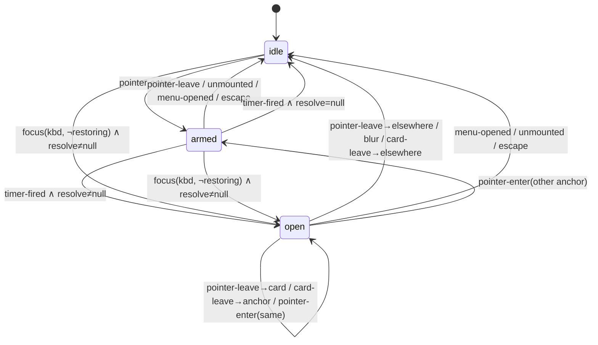

# Intern Guide to the Help Surface State Machine

## 1. Why this ticket exists

PBUI-HELP-001 shipped a contextual help system in two halves. The **kernel**
half — which help applies to a typed subject — is pure and disciplined: a
registry, a resolver, deterministic ordering, fail-fast validation, property
tests. The **surface** half — when the card opens, closes, and where it sits —
was written the way tooltips are usually written: policy spread across event
handlers.

Code review then found, in successive rounds on
[PR #20](https://github.com/hyperslop-systems/pbui/pull/20), seven defects in
that surface. Five of them are the *same defect*:

| Round | Finding | Nature |
| --- | --- | --- |
| 2 | menu close (pointer) reopened the card via focus return | missing transition |
| 2 | keyboard menu close reopened the card | missing transition |
| 3 | overflowing card content unreachable | interaction gap |
| 3 | 4px anchor/card gap closed the card mid-crossing | geometry × transition |
| 3 | unmounting a presentation left an orphan card | missing transition |
| 4 | armed hover timer fires over an open menu | missing transition |
| 4 | card extends below the viewport | geometry |

Each fix was locally correct and globally unverified, because the thing being
fixed — a state machine — existed only implicitly, distributed across six
locations: four `Presentation` event handlers, the `Presentation` unmount
cleanup, `Provider.openMenu`, `ContextHelp`'s mouseleave, `ContextHelp`'s
keydown, and two module-level flags (`lastInputWasKeyboard`,
`isRestoringFocus`). A reviewer enumerating event interleavings will always
outrun point patches against that structure.

This ticket writes the machine down **once**, as data and a pure function,
with its invariants encoded as a fuzz test — and rebuilds the runtime as a
thin adapter over it. The two open PR findings (timer-over-menu, viewport
overflow) are absorbed as consequences of the model, not patched.

The approach is not novel *for this repo*: it is the action kernel's own
medicine applied one layer up. `resolveActions` is a pure function whose
precedence ladder is explicit and permutation-tested precisely because the
pre-kernel descriptor system had the same "policy scattered across call
sites" disease.

## 2. System context: what an implementer must already know

Read these before writing code. Each is small.

### 2.1 The presentation runtime (`src/presentation/createPbui.tsx`)

`createPbui(options)` returns a per-product component family. The pieces that
matter here:

- **`Provider`** holds all transient interaction state: the open menu
  (`MenuState | null`), accept mode, the mouse-doc string, and — since
  HELP-001 — the open help card (`PbuiHelpState | null`).
- **`Presentation`** wraps one typed object. Its `onMouseEnter` /
  `onMouseLeave` / `onFocus` / `onBlur` currently *both* update the mouse doc
  *and* decide help policy (arm a 350ms timer, cancel it, open on keyboard
  focus, close with a relatedTarget carve-out for the card).
- **`ObjectMenu`** renders the context menu; on close it returns focus to the
  invoker through `queueFocusReturn`, which is what made "focus" an event the
  help system had to reason about.
- **`ContextHelp`** renders the one card: `role="tooltip"`, non-focusable,
  positioned `fixed` from the anchor's bounding rect, Escape via the
  escape-surface stack, PageUp/PageDown scrolling for keyboard-opened help.

### 2.2 The help kernel (`src/presentation/help/`)

Pure, React-free. `HelpRegistry.resolve(subject, snapshot) → HelpResolution`
returns ordered additive items with provenance. The machine never re-implements
any of this; it only decides **when** to call it. Resolution is lazy by
contract — on the gesture, never per render (the datalab grid cost boundary,
HELP-001 design doc §12.2).

### 2.3 Page-wide coordination modules

- **`src/surfaces.ts`** — the escape-surface stack. Transient surfaces
  register on open; only the topmost owns Escape. Module state, deliberately:
  "topmost" is a page property, not a subtree property.
- **`src/focus.ts`** — focus capture/return for transient surfaces, plus
  `isRestoringFocus()`: true synchronously while a focus-*return* `.focus()`
  call is dispatching (focus events fire inside `.focus()`).
- **Input modality** (in `createPbui.tsx`) — `lastInputWasKeyboard`, set by
  capture-phase `keydown`, cleared by `pointerdown`. The `:focus-visible`
  idea, tracked by hand because jsdom cannot test the pseudo-class.

These three stay. The machine does not absorb them; it **consumes them as
event fields** (a focus event arrives already annotated with
`{keyboard, restoring}`), which keeps the machine deterministic and the
platform-quirk handling at the adapter edge.

### 2.4 The reviewer's model (worth internalizing)

Every finding so far is an instance of one question: *"here is a physically
possible sequence of user events — does the surface end in a state you
intended?"* The fuzz test in §7 mechanizes exactly that question.

## 3. Design principles

1. **Policy is data.** Every open/close/arm/disarm decision lives in one pure
   transition function. Event handlers translate DOM facts into events and
   dispatch; they contain zero policy.
2. **One owner per fact.** The armed-timer fact moves from
   per-`Presentation` refs (N potential timers on an N-cell grid, where the
   domain has exactly one armed state) into the machine (exactly one).
3. **Effects are state sync, not commands.** The interpreter compares machine
   state to the world: `armed` ⟹ a timeout is running; not-`armed` ⟹ it is
   not. No command vocabulary, no imperative choreography to get out of order.
4. **Invariants are tests, not comments.** The properties in §6 are asserted
   over thousands of generated plausible event sequences on every test run.
5. **Geometry is a pure function of rectangles.** Placement takes numbers and
   returns numbers; the component feeds it measurements.
6. **External behavior is preserved.** Every existing test in
   `createPbui.help.test.tsx` passes unchanged, except where a test pinned a
   behavior the reviewer identified as a bug.

## 4. The formal model

### 4.1 State space

```ts
type HelpSurfaceState<Values, ProductFacts> = {
  /** I1's guard input: mirrors whether the object menu is open. */
  menuOpen: boolean;
  surface:
    | { kind: "idle" }
    | { kind: "armed"; anchor: Element; reference: PresentationReference<Values> }
    | {
        kind: "open";
        anchor: Element;
        reference: PresentationReference<Values>;
        trigger: "pointer" | "focus";
        resolution: HelpResolution;
        snapshot: SelectionSnapshot<ProductFacts>;
      };
};
```

Three surface states, one boolean input. That is the entire space. `armed`
means "the pointer is resting; a timer is (by state-sync) running." `open`
carries everything `ContextHelp` needs to render, so opening is atomic: there
is no moment where a card exists without its content.

### 4.2 Event alphabet

Every way the world can poke the surface, written down once:

```ts
type HelpSurfaceEvent<Values> =
  | { type: "pointer-enter"; anchor: Element; reference: PresentationReference<Values> }
  | { type: "pointer-leave"; anchor: Element; into: "card" | "elsewhere" }
  | { type: "timer-fired"; anchor: Element }
  | { type: "focus"; anchor: Element; reference: PresentationReference<Values>;
      keyboard: boolean; restoring: boolean }
  | { type: "blur"; anchor: Element }
  | { type: "card-leave"; into: "anchor" | "elsewhere" }
  | { type: "menu-opened" }
  | { type: "menu-closed" }
  | { type: "unmounted"; anchor: Element }
  | { type: "escape" };
```

Classification happens at the adapter edge: the `Presentation` mouseleave
handler inspects `relatedTarget` and says `into: "card" | "elsewhere"`; the
focus handler reads the modality flag and `isRestoringFocus()` and stamps the
booleans. The machine never touches the DOM.

### 4.3 Dependencies

```ts
interface HelpSurfaceDeps<Values, ProductFacts> {
  /** Lazy resolution; null means "no rule contributed — show nothing". */
  resolve(reference: PresentationReference<Values>): {
    resolution: HelpResolution;
    snapshot: SelectionSnapshot<ProductFacts>;
  } | null;
}
```

Injected the way `matchContext` receives its predicate map: the machine stays
pure because `resolve` itself is pure (registry + snapshot in, data out). The
machine calls it in exactly two transitions (`timer-fired`, keyboard `focus`),
which *is* the laziness contract, now enforced structurally.

### 4.4 The transition function

```ts
export function helpSurfaceStep<Values, ProductFacts>(
  state: HelpSurfaceState<Values, ProductFacts>,
  event: HelpSurfaceEvent<Values>,
  deps: HelpSurfaceDeps<Values, ProductFacts>,
): HelpSurfaceState<Values, ProductFacts>;
```

No commands, no effects, no React. Unchanged inputs may return the same state
object (referential no-op), which the hook exploits to skip renders.

### 4.5 The transition table

Rows are events; cells say the next `surface` (and `menuOpen` where it
changes). `a` is the event's anchor; `x` is the state's anchor. Anything not
listed is a no-op (return the same state).

| Event | `idle` | `armed(x)` | `open(x, trig)` | guard |
| --- | --- | --- | --- | --- |
| `pointer-enter(a)` | `armed(a)` | `armed(a)` (re-target) | `a === x` → stay `open`; else `armed(a)` | ignored entirely when `menuOpen` |
| `pointer-leave(a, into)` | — | `a === x` → `idle` | `a === x` ∧ `into = "elsewhere"` → `idle`; `into = "card"` → stay | |
| `timer-fired(a)` | — | `a === x` → `resolve` ? `open(a, "pointer")` : `idle` | — | ignored when `menuOpen` (defense in depth; MO already disarms) |
| `focus(a, kbd, restoring)` | `kbd ∧ ¬restoring` → `resolve` ? `open(a, "focus")` : `idle` | same (replaces the arm) | same, incl. re-resolve on the same anchor | ignored when `menuOpen` or `¬kbd` or `restoring` |
| `blur(a)` | — | — | `a === x` → `idle` | pointer arming survives blur |
| `card-leave(into)` | — | — | `into = "elsewhere"` → `idle`; `"anchor"` → stay | |
| `menu-opened` | `menuOpen := true` | `idle`, `menuOpen := true` | `idle`, `menuOpen := true` | **this row is PR #20 round-4 finding 1** |
| `menu-closed` | `menuOpen := false` | (unreachable) | (unreachable) | surface is provably idle here — I1 |
| `unmounted(a)` | — | `a === x` → `idle` | `a === x` → `idle` | |
| `escape` | — | `idle` | `idle` | adapter dispatches only when the card owns Escape |

Reading the table beats reading six handlers, and the two open PR findings
appear as single cells: `menu-opened` from `armed` (the timer bug) is one
transition; the viewport bug is not in this table at all because it is
geometry (§5).

### 4.6 State diagram



## 5. Placement geometry

Today's placement is two clamps written inline in `ContextHelp`, and the
round-4 finding shows why that fails: near the viewport bottom the card keeps
its CSS `max-height: 280px` while the clamp reserves a flat 60px, so most of
the card hangs below the fold, unreachable.

Placement becomes a pure function in `src/presentation/help/place.ts`:

```ts
export interface Rect { left: number; top: number; right: number; bottom: number; }
export interface Size { width: number; height: number; }

export interface HelpPlacement {
  left: number;
  top: number;
  /** Hard cap for the card; the CSS max-height stays as the outer bound. */
  maxHeight: number;
  side: "below" | "above";
}

export function placeHelpCard(anchor: Rect, card: Size, viewport: Size): HelpPlacement;
```

Rules, in order:

1. **Flush, never gapped.** The card touches the anchor edge it hangs from —
   `top = anchor.bottom` below, `top = anchor.top − height` above. Any gap
   belongs to neither element and a slow pointer crossing it fires the
   anchor's leave (round-3 finding; the flush rule is now load-bearing and
   must not regress to an offset).
2. **Prefer below.** `spaceBelow = viewport.height − anchor.bottom − MARGIN`;
   if `card.height ≤ spaceBelow`, place below with
   `maxHeight = spaceBelow`.
3. **Flip above when it genuinely wins.** If below cannot fit the card and
   `spaceAbove > spaceBelow`, place above with
   `maxHeight = min(card.height, spaceAbove)` and the card's *bottom* edge
   flush against `anchor.top`.
4. **Otherwise stay below, capped.** `maxHeight = max(spaceBelow, MIN_CARD)`
   so a pathological anchor at the very bottom still shows a usable sliver
   that scrolls (reachable per round 3) rather than a clipped void.
5. **Horizontal clamp.** `left = clamp(anchor.left, 0, viewport.width − card.width)`.

`MARGIN = 8` (breathing room to the viewport edge, not to the anchor);
`MIN_CARD = 48` (roughly one item row). The component measures the rendered
card in a layout effect and applies the result imperatively — measurement is
the only DOM-dependent step, and it feeds plain numbers in:

```text
useLayoutEffect on [state.open, resolution]:
    anchorRect = state.anchor.getBoundingClientRect()
    cardSize   = { width: card.offsetWidth, height: card.scrollHeight }
    p = placeHelpCard(anchorRect, cardSize, { innerWidth, innerHeight })
    card.style.left = p.left; card.style.top = p.top
    card.style.maxHeight = p.maxHeight; card.dataset.side = p.side
```

Deferred, recorded here as decisions rather than accidents: the card does not
track a moving anchor (page scroll/resize while open — a future `scroll`
event should close it, as menus conventionally do), and an open card does not
re-resolve on snapshot revision changes (a tooltip may show facts one
revision old; `performAction`'s fresh revalidation still protects every
mutation).

## 6. Invariants

These are the review findings restated as properties. The fuzz test asserts
all of them after *every* step of every generated sequence.

- **I1 — mutual exclusion.** `menuOpen ⟹ surface = idle`. Subsumes rounds 2
  (both focus-return bugs, together with the `restoring` event field) and 4
  (armed timer firing over the menu).
- **I2 — no orphan card.** `open(x) ⟹` the world model says `x` is mounted,
  and (trigger `pointer` ⟹ pointer ∈ {x, card}) ∧ (trigger `focus` ⟹ focus
  is on `x`). Subsumes the unmount and gap findings.
- **I3 — armed is attended.** `armed(x) ⟹` pointer is over `x` and
  `¬menuOpen`.
- **I4 — laziness.** `deps.resolve` is called only inside `timer-fired` and
  keyboard-`focus` transitions. (Asserted by call counting in the fuzz
  harness.)
- **I5 — placement containment.** For all inputs:
  `0 ≤ left ≤ viewport.width − card.width`,
  `top ≥ 0`, `top + min(card.height, maxHeight) ≤ viewport.height`, and the
  flush edge touches the anchor exactly. (Property test over random
  rectangles in `place.test.ts`.)

## 7. The fuzz harness

Purely generated sequences must be *physically plausible* — a
`pointer-leave(a)` can only follow the pointer actually being over `a`. The
harness therefore keeps a tiny world model and only emits legal events:

```text
world = { anchors: [a1..a4], mounted: set, pointerAt: anchor|card|nowhere,
          focusAt: anchor|nowhere, menuOpen: bool }

repeat N times (N ≈ 3000 sequences × ≤ 40 steps):
    event = pick uniformly among events legal in `world`
      pointer-enter(a)   if pointerAt ≠ a, a mounted
      pointer-leave      if pointerAt is an anchor  (into: card only if surface open)
      timer-fired        if machine.surface.kind == "armed"
      focus(a, kbd, restoring) any mounted a; kbd/restoring random
      blur               if focusAt is an anchor
      card-leave         if pointerAt == card
      menu-opened/closed toggling world.menuOpen
      unmounted(a)       if a mounted (re-mount later with a fresh element)
      escape             if surface open
    world  = advance(world, event)
    state  = helpSurfaceStep(state, event, countingDeps)
    assert I1..I4 against (state, world)
```

A seeded PRNG makes failures reproducible; on assertion failure the harness
prints the full event sequence, which is a ready-made regression test. This
is the reviewer's job description, automated.

## 8. Runtime integration

### 8.1 The hook (lives in `createPbui.tsx` — it imports React; the machine must not)

```text
function useHelpSurface(deps):
    depsRef = useRef(deps); depsRef.current = deps        # latest env/registry
    [state, setState] = useState({ menuOpen: false, surface: idle })
    dispatch = useCallback(event =>
        setState(s => helpSurfaceStep(s, event, depsRef.current)), [])

    # Effects as state sync (§3.3): exactly one timer, provider-owned.
    useEffect on [state.surface]:
        if surface.kind == "armed":
            t = setTimeout(() => dispatch({type: "timer-fired", anchor}), 350ms)
            return () => clearTimeout(t)

    return [state, dispatch]
```

Re-arming on a new anchor replaces `armed(x)` with `armed(a)`; the effect's
cleanup/re-run restarts the single timer automatically. The
per-`Presentation` timer refs, their cancel helper, and their unmount
choreography are deleted.

### 8.2 Wiring map (who dispatches what)

| Source | Dispatches |
| --- | --- |
| `Presentation.onMouseEnter` | `pointer-enter` |
| `Presentation.onMouseLeave` | `pointer-leave` with `into` from `relatedTarget.closest('[data-pbui="context-help"]')` |
| `Presentation.onFocus` | `focus` with `{keyboard: lastInputWasKeyboard, restoring: isRestoringFocus()}` |
| `Presentation.onBlur` | `blur` |
| `Presentation` unmount cleanup | `unmounted` (element ref still survives the null detach) |
| Provider effect on `menu !== null` | `menu-opened` / `menu-closed` — an *effect on the menu state*, so every path that closes the menu (`closeMenu`, `perform`, `performAction`, `accept`) is covered without touching any of them |
| `ContextHelp.onMouseLeave` | `card-leave` with `into` from `anchor.contains(relatedTarget)` |
| `ContextHelp` Escape (when it owns Escape) | `escape` |

The context value replaces `openHelp`/`closeHelp` with one `helpDispatch`;
`help` (the open-card view state) and `helpEnabled`/`helpSurfaceId` keep their
shapes so `ContextHelp` and the aria wiring change minimally.

### 8.3 What `ContextHelp` keeps

Rendering, the renderer registry hand-off, `role="tooltip"`,
PageUp/PageDown paging for focus-opened help (imperative scrolling is not
policy), and the escape-surface registration. It loses its inline positioning
math to `placeHelpCard`.

## 9. File plan

```text
src/presentation/help/
  machine.ts          helpSurfaceStep, state/event/deps types   (new, pure)
  machine.test.ts     table row tests + the fuzz harness        (new)
  place.ts            placeHelpCard                             (new, pure)
  place.test.ts       rule tests + containment property test    (new)
  index.ts            + exports for machine and placement

src/presentation/createPbui.tsx
  - per-Presentation timer refs, openHelp/closeHelp, inline clamps: deleted
  + useHelpSurface hook, dispatching handlers, menu-sync effect,
    layout-effect placement

src/presentation/createPbui.help.test.tsx
  unchanged assertions, plus: timer-over-menu regression,
  placement smoke via data-side
```

## 10. Test plan

- **Table tests** — one focused test per non-trivial cell of §4.5, named
  after the cell (`"menu-opened disarms a pending timer"`).
- **Fuzz** — §7, ≥ 3000 seeded sequences asserting I1–I4 each step.
- **Placement** — §6 I5 as a property over random rects, plus the four rule
  examples (fits below, flips above, capped sliver, horizontal clamp).
- **Runtime** — the existing 15 help tests pass unchanged (they encode the
  externally visible contract); add the timer-over-menu round-4 regression.
- **Full gates** — root `pnpm test` / `typecheck` / `build`; datalab suite
  (532 + 1 pre-existing baseline failure); consumer smoke.

## 11. Implementation phases

1. **P1 — this document**, ticket bookkeeping, reMarkable upload.
2. **P2 — pure machine**: `machine.ts`, table tests, fuzz harness green
   against the table *before* any runtime change.
3. **P3 — placement**: `place.ts` + tests.
4. **P4 — integration**: rebuild the runtime on the machine; all existing
   tests green; new regressions added.
5. **P5 — PR absorption**: reply/resolve the two round-4 threads pointing at
   the machine cells that subsume them; request re-review; handoff notes.

## 12. Definition of done

The help surface has no open/close/arm policy outside `helpSurfaceStep`; the
fuzz harness holds I1–I4 over seeded random plausible sequences; placement
satisfies I5 by property test; both open PR #20 findings are closed by
construction; every pre-existing help test passes unchanged; and the next
reviewer round has to find a *modeling* error to find anything at all.

## 13. Follow-ups this ticket does not do (recorded, not forgotten)

- Close-on-scroll / anchor tracking for the open card (§5).
- The `Presentation` click-ownership ladder and the accept flow are the next
  two candidates for the same pattern; the transient-surface coordination
  modules (`surfaces.ts`, `focus.ts`, modality) converge on a shared protocol
  only when a third machine makes the shape undeniable.
- Datalab's shortcut routing wants the action registry's collision-validation
  treatment (its baseline test failure is a routing-table conflict).
