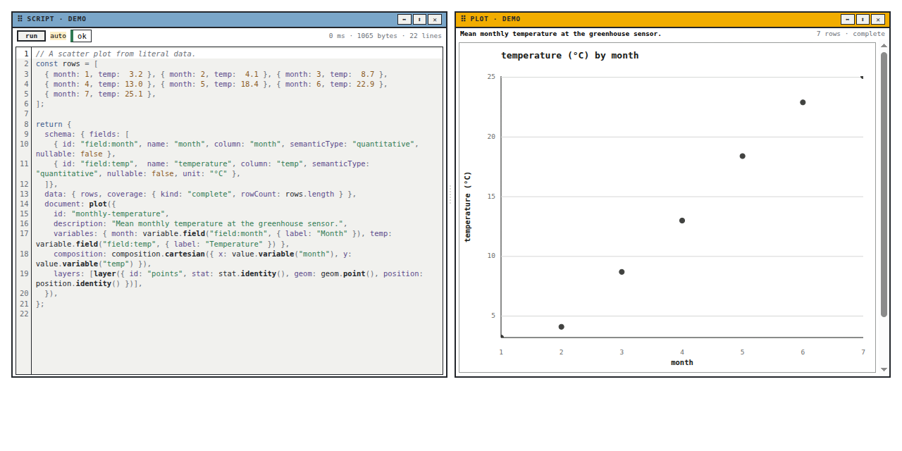
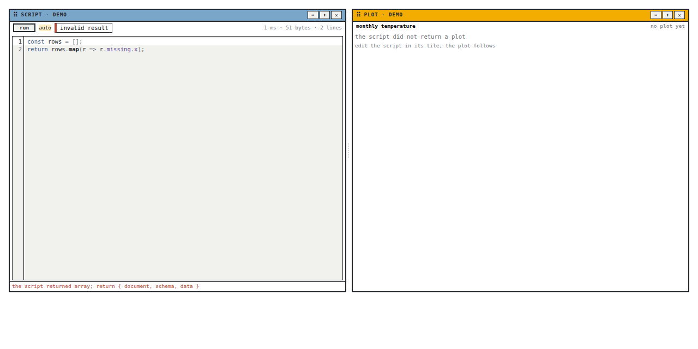
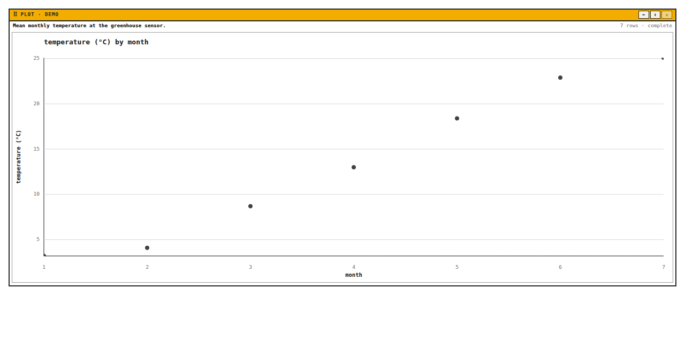
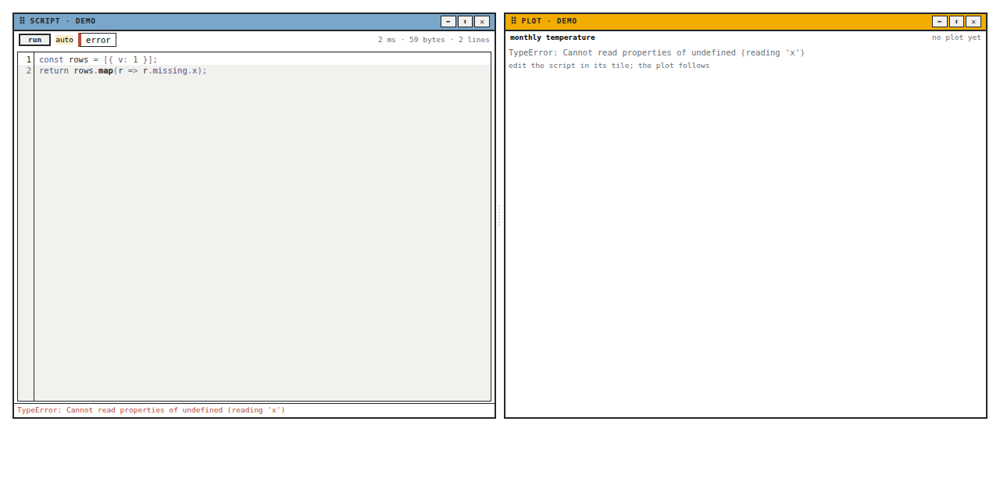
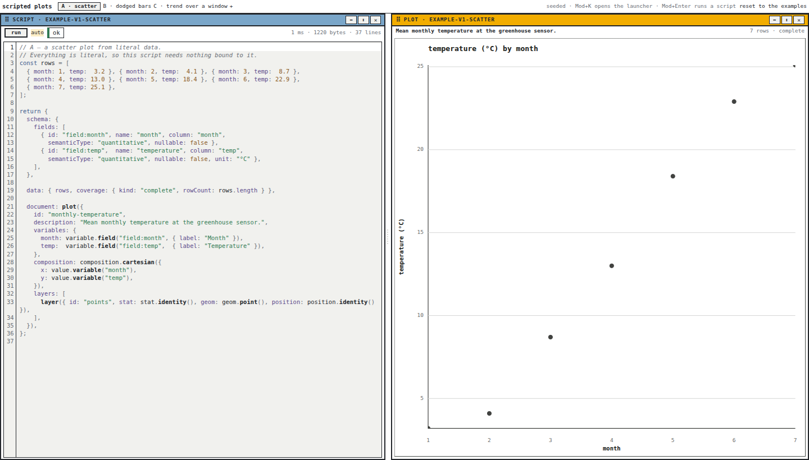
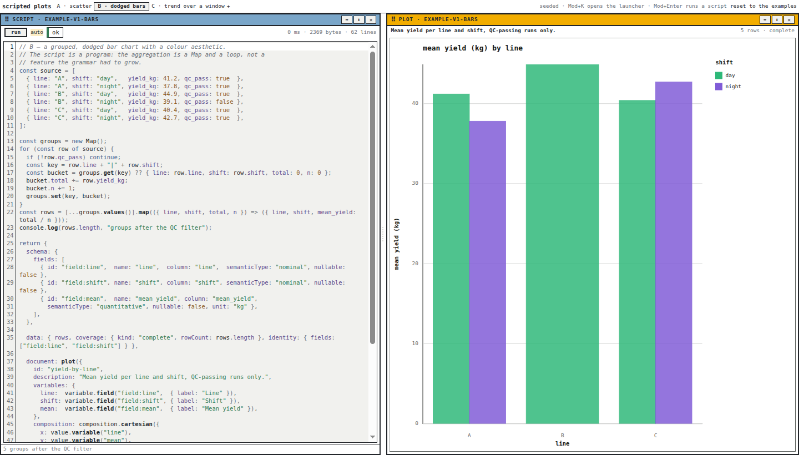
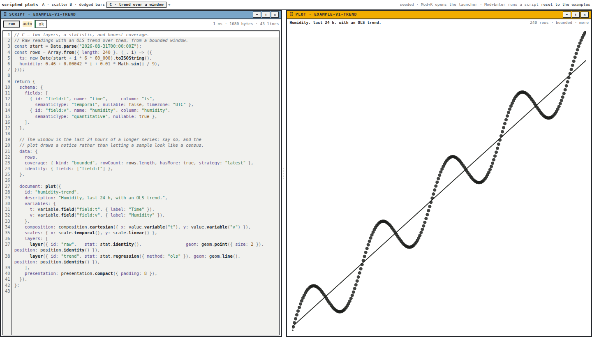

# Diary

## Goal

Record the implementation of PBUI-PLOTSCRIPT-1 — the `@hyperslop-systems/pbui-plotscript`
package and its demo: a JavaScript editor tile beside a plot tile, both views
of one script document, run live through the plot shim from PBUI-PLOTKIT-1.

## Step 1: Scaffold `packages/pbui-plotscript` and its `demo/`

Phase 0 was already true — PBUI-PLOTKIT-1 landed in this branch an hour
earlier and every package builds in dependency order — so this step is the
package skeleton and the demo skeleton, both proven by an empty build and
typecheck before any feature code exists.

### Prompt Context

**User prompt (verbatim):** "Ok, continue"

**Assistant interpretation:** Proceed with the recommended next item, PBUI-PLOTSCRIPT-1, in the same working method as the previous ticket: plan slip, per-phase slips, diary, commits per phase, screenshots.

**Inferred user intent:** Get the runnable editor-beside-plot example that the original request was about.

**Commit (code):** b063aba — "pbui-plotscript: scaffold the package and its demo"

### What I did
- `packages/pbui-plotscript/` with `package.json` (deps: pbui, pbui-editor, pbui-sandbox, pbui-workbench, plot 0.3.1, workbench-protocol, @bufbuild/protobuf), `tsconfig*.json`, `vite.config.ts` (every dependency externalised; jsdom + the CodeMirror `Range` stubs for tests), `.storybook/` on port 6011, an empty `src/index.ts`.
- `packages/pbui-plotscript/demo/` following `packages/pbui-chat/demo`: private package, Vite on port 5175, `pbuiVite()` for React dedupe, a placeholder `main.tsx`.
- `pnpm-workspace.yaml` gains `- "packages/pbui-plotscript/demo"` (design D1: `packages/*` does not match a nested directory).
- `pnpm install`; package build and both typechecks green.

### Why
- Design D1/D2 in the ticket guide.

### What worked
- Everything on the first run; the build order lesson from PLOTKIT-1 Step 1 held.

### What didn't work
- N/A

### What I learned
- `ResponsivePlot` takes `onOutcome(outcome)` — a hook to read diagnostics out of the plot tile without re-running `renderPlot`; the plot tile will use it for its status line.

### What was tricky to build
- N/A (scaffold).

### What warrants a second pair of eyes
- `@hyperslop-systems/plot` is pinned at `0.3.1` from the registry, the same as `datalab-ui`; the local `plot/` checkout is also 0.3.1. If the local checkout moves ahead, this package will not see it until published or `link:`ed.

### What should be done in the future
- N/A

### Code review instructions
- `packages/pbui-plotscript/package.json`, `vite.config.ts`, `pnpm-workspace.yaml`.
- Validate: `pnpm --filter @hyperslop-systems/pbui-plotscript build typecheck && pnpm --filter @hyperslop-systems/pbui-plotscript-demo typecheck`.

### Technical details
- Ports: Storybook 6011, demo 5175.

## Step 2: The script document, the draft store, and the runner

Phase 2 is everything below the tiles. `document.ts` stores a script in the
workbench document as a `DocumentPayload` (D3), `draftStore.ts` holds the
editor's live text outside the document, and `runner.ts` owns a sandbox
instance per script, the debounce, a run ticket, and the last good result. One
change reached back into PBUI-PLOTKIT-1: `buildPlotScriptCode` now captures
`console` output, because the design asks the tile to show logs and the
JSON-string boundary is the only way they can ride back.

The draft store is the one structural decision the design left implicit. A
keystroke is not a document mutation: with the document as the only store,
every keystroke would be a protobuf batch and an `onMutate` call. The runner
writes the document at the moment it runs — the same moment the plot changes —
and the editor shows the draft in between, which is exactly the
`draft.source` / `loaded` split `PlaygroundTile` already uses.

### Prompt Context

**User prompt (verbatim):** (see Step 1)

**Assistant interpretation:** Build phase 2 as designed (§8, §9 D3): the `DocumentPayload` document, the store, the runner with staleness and last-good rules, log capture, and tests for each.

**Inferred user intent:** The tiles in phase 3 should be thin; the rules that make the demo pleasant to type into belong here, tested.

**Commit (code):** 126832d — "pbui-plotscript: the script document, the draft store and the runner"

### What I did
- `pbui-sandbox/src/plot/plotScript.ts`: the evaluated expression now returns `{ value, logs }`; a local `console` shadows the engine's; `PlotScriptRun` gains `logs: ScriptLog[]` on every status. Two tests added/updated; sandbox 205/205.
- `document.ts`: `PLOTSCRIPT_FORMAT = "pbui.plotscript"`, `readPlotScript`, `listPlotScripts`, `plotScriptMutation` (`documentPut`), `deletePlotScriptMutation`. Modelled on `rebalance/configDocument.ts`; id/format/version on the envelope, body `{ name, source, updatedAt }`.
- `draftStore.ts`: `createDraftStore()` with `get/set/seed/forget/subscribe` and `useDraft`.
- `runner.ts`: `createPlotScriptRunner({ engine, debounceMs, limits, onRan })` → `getState/subscribe/run/schedule/dispose/disposeAll`, `useScriptRun`. Instance id `plot-script:<id>`, loaded lazily with `PLOT_HOST_PROGRAM`.
- Tests: 4 document, 6 runner (ok; lastGood survives error and invalid; **stale run discarded**; debounce + cancel with fake timers; log capture + instance isolation; dispose/reload).

### Why
- §8.1's two rules, and D3. The stale-run test blocks the first `evaluate` behind a promise and lets the second finish first — the shape of the bug it guards against.

### What worked
- 9/10 on the first run, typecheck clean.

### What didn't work
- `round-trips through serialize/parse` failed with `expected null`: `parseDocument` refuses a document with no workspace (`doc.workspaces.length === 0 → null`), and I had built on `emptyDocument`. The test now seeds one tile with `layout(tile("plot-view"))`. A one-line fix, and a fact worth knowing: a document that is only payloads is not a workbench.

### What I learned
- `PlaygroundTile`'s draft/loaded split generalises: draft store + document-on-run is the same idea with the document as the "loaded" side.

### What was tricky to build
- **Ticket vs. runCount.** A ticket increments at run *start* (so a stale finish can be recognised); `runCount` increments at *publish* (so the plot tile can key a stale chip on "has anything been published since my lastGood"). Conflating them makes the stale test pass and the chip wrong.
- **A failed load must not poison later runs**: `ensureLoaded` deletes its cached promise on rejection.

### What warrants a second pair of eyes
- `onRan` is where the document write will hang (phase 3). It fires for every published run including failures; the tile decides whether to write only on `ok`.
- `toProgramError(error, "event")` — the phase label is a guess; the sandbox has no "evaluate" phase.

### What should be done in the future
- N/A

### Code review instructions
- `src/runner.ts` first (the ticket/runCount comment), then `src/document.ts`, then `src/runner.test.ts` "discards a stale run".
- Validate: `pnpm --filter @hyperslop-systems/pbui-plotscript test typecheck build`.

### Technical details
- Logs shape: `{ level: "log" | "info" | "warn" | "error", text }`; non-string args are `JSON.stringify`'d.

## Step 3: The script tile, the plot tile, and the first picture of the demo

Phase 3 is the two tiles and their descriptors, tested inside a real
`createWorkbench` Surface rather than in isolation — the document write, the
draft, the runner and the workbench context all have to agree for the tests
to pass, and they did on the first run. Then Storybook, and the first
screenshot of the thing this whole pair of tickets was for: a script on the
left, a scatter on the right, `7 rows · complete`.

### Prompt Context

**User prompt (verbatim):** "don't forget to take screenshots"

**Assistant interpretation:** Build phase 3 (§8, §9 D6) and capture the running tiles into the ticket as I go.

**Inferred user intent:** See the demo working, not only its tests.

**Commit (code):** 2ff7f91 — "pbui-plotscript: the script tile, the plot tile, and their app descriptors"
**Commit (code):** 506c12a — "pbui-plotscript: plot pane never scrolls; split the failing story into invalid vs throwing"

### What I did
- `host.ts`: `createPlotScriptHost({ engine?, debounceMs?, limits? })` → `{ engine, runner, drafts }`; `PLOT_BINDING = "plot"`.
- `ScriptTile/`: `CodeEditor` over the draft; toolbar `run` (`Mod+Enter`) · `auto` toggle · a status `Chip` (`not run / running… / ok / invalid result / error`) · ms/bytes/lines; a `RunPane` for the error or guard message and the console logs. Seeds the draft and runs once on first sight; **writes the document only when a run succeeds**, keyed on `runCount`.
- `PlotTile/`: `ResponsivePlot` over `lastGood`, `theme="embedded"`; a `stale` chip (`Chip state="stale"`) when the last run failed or the draft differs from what was drawn; `onOutcome` for the diagnostics count; runs the document's source itself if opened with nothing run yet, so a plot without an editor still draws.
- `apps.tsx`: `createPlotScriptApps(host)` → `plot-script` and `plot-view`, both `docBound` with `bindings: ["plot"]`, `titleFor` naming the script.
- `test-setup.ts`: a `ResizeObserver` stub reporting 640×360 so `ResponsivePlot` renders in jsdom.
- `tiles.test.tsx` (4 tests): both mount and draw; typing → debounce → good run writes the document, then a bad run keeps the SVG, marks stale, and leaves the document alone; console output reaches the pane; unbound and missing-script tiles say so.
- `Tiles.stories.tsx`: pair, plot-alone, invalid-result, throwing-script.
- Storybook on 6011; three screenshots via Playwright.

### Why
- D6 (two tiles). The "document only on success" rule keeps `PlotScriptDoc.source` equal to "what the plot shows", so a reload draws the last good plot and not a half-typed line.

### What worked
- 14/14 on the first run, typecheck clean twice. The stub `ResizeObserver` was enough for `ResponsivePlot`.

### What didn't work
- The first pair screenshot was Storybook's cold-start spinner: Vite was still bundling dependencies for a package that had never run Storybook. Waited on `rows · complete` and retook it.
- The plot pane grew a vertical scrollbar (visible in the first pair screenshot): the `AppBody` cell plus padding let a 100%-tall plot overflow by the padding. `overflow: hidden` on `.body` and `.plot`. Fixed in 506c12a.
- The story I had named "a script that throws" did not throw: `[].map(r => r.missing.x)` over an empty array returns `[]`, which is an *invalid result*, not an error. Split into `InvalidResult` and `ThrowingScript` (one row, so `.missing.x` actually dereferences `undefined`).

### What I learned
- `Chip` already has `state="stale"` — the design's stale marker cost one prop.
- **A finding for the plot package, not this one:** in the scatter, the month-7 point at 25.1 °C sits clipped at the top edge of a 5–25 axis. The linear scale's nice-ing appears to round the domain max *down* past the data max. Visible in `01-p3-editor-beside-plot.png` and `03-p3-plot-alone.png`. Not fixed here.

### What was tricky to build
- **Who runs first.** Both tiles want to run the document's source on mount so either works alone; with both open that is two runs of the same source. Each checks `runner.getState(id).status === "idle"` before running, and the runner's ticket makes a duplicate harmless anyway.
- **Stale semantics.** "Stale" is *the plot does not reflect the draft*: `draft !== lastGoodSource`, or the last run failed. Keying it on the draft store rather than the document means it appears the moment you type, which is the honest signal.

### What warrants a second pair of eyes
- The document write happens inside a `useEffect` in the script tile keyed on `runCount`. With two linked script tiles of one document, both effects fire; `documentPut` is idempotent so the second is a no-op batch, but it is still a second mutation.
- The `stale` chip title text and the empty states are my wording.

### What should be done in the future
- Report the domain-max clipping to `@hyperslop-systems/plot`.
- Map an engine error line to an `EditorDiagnostic` once an engine reports one.

### Code review instructions
- `src/ScriptTile/ScriptTile.tsx` (the two effects and their comments), `src/PlotTile/PlotTile.tsx` (`stale`), `src/tiles.test.tsx` test 2.
- Validate: `pnpm --filter @hyperslop-systems/pbui-plotscript test typecheck build`; `pnpm --filter @hyperslop-systems/pbui-plotscript storybook` (6011) → `Plotscript/Tiles`.

### Technical details
- Story ids: `plotscript-tiles--editor-beside-plot`, `--plot-alone`, `--invalid-result`, `--throwing-script`.

### Screenshots

*Script on the left with the `ok` chip and `0 ms · 1065 bytes · 22 lines`; the scatter on the right, `7 rows · complete`. The month-7 point is clipped at the top — the plot package's domain, noted above.*

*`invalid result` in the chip, the guard's sentence in the pane — "the script returned array; return { document, schema, data }" — and the plot tile explaining itself instead of blanking.*

*The plot tile alone runs the document's source itself and draws.*

*The engine's own error in the pane.*

## Step 4: The three examples and the demo app

Phase 4 turns the guide's three worked scripts into seeded documents and
wraps everything in a runnable reference product: one workspace per example,
so the workspace strip is the example picker; the whole document — layout and
scripts — persisted to `localStorage` on every committed batch and restorable
to the seed with one button.

The accessibility snapshot Playwright returns alongside a screenshot found
something the picture did not: the plot was emitting
`interaction.identity.missing` because none of the examples declared
`data.identity`. One field per example fixed it and gave the marks stable
interaction targets.

### Prompt Context

**User prompt (verbatim):** (see Step 1; screenshots per "don't forget to take screenshots")

**Assistant interpretation:** Phase 4 as designed (§12): `examples.ts`, an integration test per example, the demo app; screenshots of each workspace.

**Inferred user intent:** The thing the original request described, running, in a browser.

**Commit (code):** 48bb255 — "pbui-plotscript: the three worked examples and the demo app"
**Commit (code):** ad79e72 — "pbui-plotscript: the examples declare data identity"

### What I did
- `src/examples.ts`: `SCATTER_SOURCE`, `BARS_SOURCE`, `TREND_SOURCE` and `EXAMPLE_SCRIPTS` under ids `example-v1-{scatter,bars,trend}`; the bars script `console.log`s its group count so the pane has something to show.
- `src/examples.test.ts`: each example runs through the runner and `renderPlot` with no error diagnostics; ids are versioned and unique.
- `demo/src/workbench.ts`: `seedDocument()` = `workspaces([...])` (one per example, `plot-script` beside `plot-view`, both bound to the example's id) plus the three `plotScriptMutation`s; `createDemoWorkbench()` restores from `localStorage` via `parseDocument`, and `onMutate` writes `serialize()` back.
- `demo/src/App.tsx`: the strip (`WorkspaceStrip`, a status line, "reset to the examples"), `Surface`, `Launcher`, `Rebalance`.
- `demo/src/main.tsx`: the stylesheet order — pbui, workbench, editor, sandbox, plot, this package, then the demo's own.
- Demo build: 962 KB / 308 KB gzip (CodeMirror + plot + React); typecheck clean.
- Three demo screenshots, one per workspace.

### Why
- D2 (a reference product proves the packages end to end where Storybook alone would not exercise `createWorkbench`, the launcher or the tile chrome) and the versioned-id discipline from datalab's `welcome.ts`.

### What worked
- All three examples rendered on the first run of the integration test; the demo came up with no console errors.

### What didn't work
- Adding `identity` broke the package build: `Expected a semicolon or an implicit semicolon after a statement` — I had written a comment containing backticks *inside* the template literal that holds the script, which terminated the literal. The example sources are template strings; anything in them is JavaScript-in-a-string, comments included. Removed the backticks. One collateral test failure in `tiles.test.tsx` vanished with the fix.
- A Playwright click by snapshot ref failed (`Ref f13e8 not found`) because Vite's HMR had reloaded the page between snapshot and click; a text selector (`button:has-text("B · dodged bars")`) is stable across reloads.

### What I learned
- `workspaces()` wants an `id` per workspace or mints `ws-…`; giving each example's workspace `ws-<script id>` keeps the persisted layout stable across reseeds.
- The plot's `interaction.identity.missing` notice is a `status` element in the DOM, easy to miss visually and obvious in the accessibility tree — worth checking snapshots, not only pixels.

### What was tricky to build
- **Persistence granularity.** `onMutate` fires once per committed batch, and the script tile writes the document only on a successful run, so `localStorage` sees one write per good run, not per keystroke. That was the point of the draft store (Step 2), and the demo is where it shows.

### What warrants a second pair of eyes
- The demo bundles QuickJS-free (`createEvalEngine` by default). The moment scripts are shareable, D5 says `createQuickJsEngine` — the demo would then need `worker: { format: "es" }` in its Vite config, as `pbui-chat/demo` has.
- The 25.1 °C clipping (Step 3) is visible again in the scatter workspace.

### What should be done in the future
- Phase 5 items: QuickJS behind the same host, byte/row budget counters in the toolbar, a `serialize`/`restore` round-trip test at the demo level, version history.

### Code review instructions
- `src/examples.ts` beside the guide's §10; `demo/src/workbench.ts` (`seedDocument`, `onMutate`).
- Validate: `pnpm --filter @hyperslop-systems/pbui-plotscript test`, then `pnpm --filter @hyperslop-systems/pbui-plotscript-demo dev` (port 5175).

### Technical details
- `STORAGE_KEY = "pbui-plotscript-demo.workbench.v1"`.

### Screenshots

*The demo at 1440×820: the strip with the three examples, `script · example-v1-scatter` beside `plot · example-v1-scatter`, `1 ms · 1220 bytes · 37 lines`, `7 rows · complete`.*

*Example B: the `Map`-and-loop aggregation, dodged bars by shift with a legend, and the script's own `console.log` — `5 groups after the QC filter` — in the pane.*

*Example C: 240 humidity readings with an OLS trend, `240 rows · bounded · more` — the honest-coverage notice for a windowed series.*
