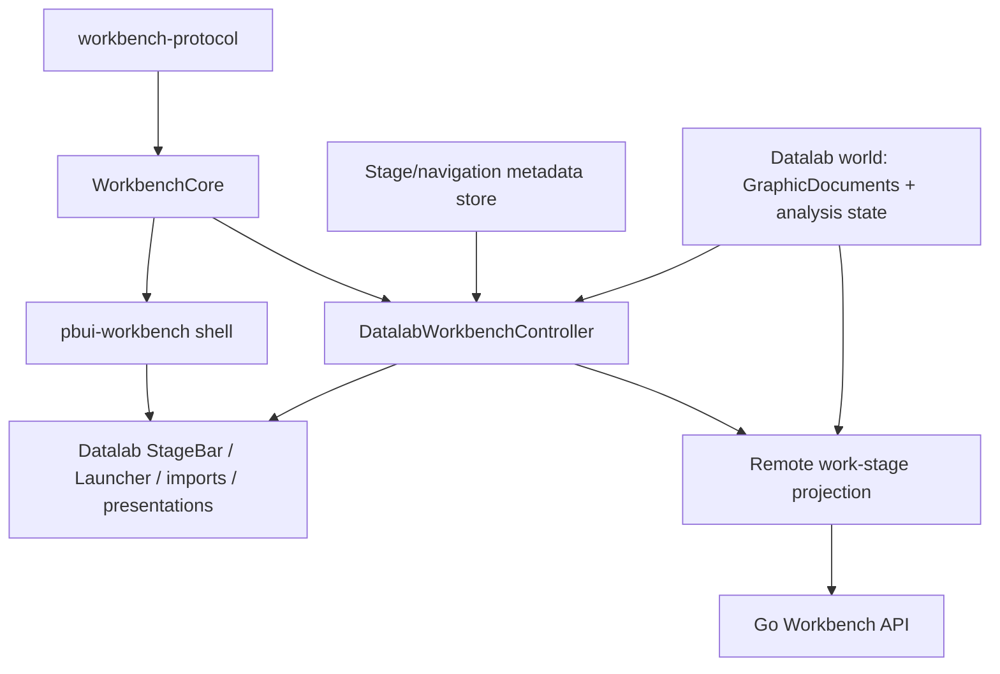

# Intern guide to consolidating Datalab onto workbench-core

## 0. How to use this guide

Datalab UI already speaks the Workbench protocol at its remote boundary, but internally owns a second implementation of workspaces, logical views, placements, split trees, mutation policy, rendering, persistence, and remote adoption. PBUI-WORKBENCH-CORE-1 now provides the canonical implementation those layers previously lacked.

This ticket removes the duplicated **spatial semantics**. It does not turn Datalab into a generic demo or move its analytical model into Workbench core. Datalab keeps:

- stages and audiences;
- application/workspace allow-lists;
- `GraphicDocument` and analysis/DuckDB behavior;
- product verbs and PBUI presentations;
- portable tile/workspace/stage bundles;
- templates, notices, tutorials, auth routing, and full-frame embedding;
- its remote policy selecting only the user “work” stage.

Read first:

1. PBUI-WORKBENCH-CORE-1 design docs 01–04;
2. PBUI-WORKBENCH-2 §10, especially §10.4–10.5;
3. DATALAB-VIEW-001 for why views and placements are already distinct;
4. this guide for the current cutover.

The migration depends on Workbench stabilization: transaction publication, a true headless dependency boundary, and shared binding/source semantics should land before Datalab switches its source of truth.

## 1. Executive summary

Datalab has the same durable spatial model twice:

```text
Datalab runtime
  store/layoutTree.ts    Node
  store/layout.ts        AppView, Workspace, reducers
  components             NodeView, SplitView, Tile
  remote/codec.ts        encode/decode
          │
          ▼
Workbench protocol
  WorkbenchDocument, Node, AppView, Workspace
          ▲
          │
workbench-core
  planner, index, validation, shell, persistence, sync
```

The duplication is not only type spelling. `layout.ts` is 1,162 lines and implements split, close, duplicate, linked duplicate, replace, swap, dock, workspace create/delete/rename/clone, session pointers, and orphan repair. The same policy now exists in `workbench-core`. Thirty-seven Datalab files import `store/layout`; production code contains 52 `layoutActions.*` uses; 26 files name the local `Node`; only three files currently import the protocol and none imports workbench-core.

The migration should establish:

```text
workbench-core
  canonical WorkbenchDocument
  canonical workspace/view/placement/tree state
  commands, validation, index, geometry and React Surface

Datalab navigation metadata
  Stage definitions
  workspace → stage membership
  pinned/audience/app-scope/chrome policy
  remembered workspace per stage
  Datalab-only dialogs/notices/import state

Datalab world
  canonical full GraphicDocument values
  snapshots, pins, watch, trace and analysis state

Datalab remote projection
  select work-stage Workbench subgraph
  join full GraphicDocuments from world
  encode canonical WorkbenchDocument for server
```

The chosen first migration keeps analytical documents in `world.docs`. The Workbench document contains source-owned identity payloads sufficient for binding validation; the transport projection replaces those identity payloads with full canonical graphic payloads. This follows the earlier PBUI-WORKBENCH-2 recommendation to keep world and layout ownership separate while deleting the tree/view codec halves.

Do **not** migrate by changing Datalab’s local `Node` to protobuf `Node` inside the existing reducers. That experiment already produced 308 type errors across 25 files, and the reducers/components being rewritten would then be deleted. Spatial reducers and rendering must cut over together behind a Datalab adapter.

## 2. Baseline and evidence

At review time:

```text
@hyperslop-systems/datalab-ui typecheck: pass
49 test files: 554 tests passed
store/layout.ts:             1,162 lines
store/layoutTree.ts:            96 lines
remote/codec.ts:               264 lines
appkit/useRemoteWorkbench.ts:  401 lines
test/layers.test.ts:           344 lines
```

Import/use counts:

```text
files importing store/layout:            37
production layoutActions.* call sites:   52
files naming the local Node type:        26
files importing workbench-protocol:       3
files importing workbench-core:           0
```

The earlier PBUI-WORKBENCH-2 investigation measured the naive protocol-node substitution at 308 TypeScript errors across 25 files. Its conclusion remains valid: type replacement and shell replacement are one continuous migration, not useful separate phases.

## 3. Domain model: what belongs where

### 3.1 Workbench spatial domain

These concepts now have one owner, Workbench core:

```text
WorkbenchDocument
  ├── workspaces: Workspace[]
  │      └── tree: Node
  │             ├── leaf → AppView id
  │             └── split → two Nodes + ratio
  ├── views: Record<ViewId, AppView>
  ├── viewOrder: ViewId[]
  └── documents: Record<DocumentId, DocumentPayload>
```

The important identity law is:

```text
application != logical view != placement != workspace != document
```

Datalab already learned this law in DATALAB-VIEW-001. Its local types closely mirror the protocol. That similarity is why consolidation is now possible.

### 3.2 Datalab Stage domain

A Stage is above a workspace. It describes product navigation and rendering policy:

```ts
interface Stage {
  id: string;
  name: string;
  apps: string[] | null;
  chrome: {
    masthead: boolean;
    workspaces: boolean;
    stageBar: boolean;
  };
  currentSpaceId: string;
  pinned?: boolean;
  audience?: "any" | "anonymous" | "authenticated";
}
```

Stages are not generic Workbench semantics because:

- they encode Datalab authentication audiences;
- code-defined stages replace stored definitions on every load;
- only one stage is sent to the remote Workbench host;
- stage chrome controls Datalab masthead and navigation;
- stage/workspace app allow-lists are product policy.

Keep Stage in Datalab.

### 3.3 Datalab analytical world

`world.ts` owns `GraphicDocument`, snapshots, pins, watch entries, trace, and inspected state. These are application semantics, not spatial semantics.

A chart view binds a graphic document by id:

```text
Workbench AppView.documents.primary = graphic document id
```

The full `GraphicDocument` remains canonical in `world.docs` for the first migration. Workbench core receives a source-owned payload representing that id. Analysis and authoring continue to read the world slice.

### 3.4 Browser-local UI state

Datalab has transient state beyond the generic Workbench shell:

- pending portable-bundle import;
- export notice;
- inline rename target;
- first-sign-in marker;
- rich launcher invocation/query semantics;
- full-frame state owned by `WorkbenchInstance`.

Do not put these into Workbench core. They may remain in a smaller Datalab navigation/UI slice.

## 4. Current architecture

### 4.1 Redux layout slice

`store/layout.ts` currently owns both generic and product concepts:

```text
generic spatial
  spaces, views, viewOrder
  split/close/resize/swap/dock
  clone/link/replace view
  current workspace and active placement

Datalab product
  stages, stage membership and audience
  pinned workspaces
  app allow-lists
  pending import, notices, rename, just-signed-up
  rich launcher invocation
```

This mixed ownership is the migration seam.

### 4.2 Local tree algebra

`layoutTree.ts` defines:

```ts
type Node =
  | { id; type: "leaf"; viewId }
  | { id; type: "split"; dir; a; b; ratio };
```

It implements update, remove, find, count, remove-by-view, clone, and ratio snap. Workbench protocol/client and Workbench core now provide these semantics and stronger validation.

### 4.3 Rendering

`NodeView` recursively renders `SplitView` or `Tile`. Datalab’s components implement:

- split flex geometry and separator keyboard behavior;
- pointer resize;
- tile drag/drop and swap/dock;
- title, linked-placement count, close checks;
- per-tile error boundary;
- split/close controls;
- active-placement tracking.

`pbui-workbench` now implements these mechanics through Surface, Tile, SplitPane, geometry measurement, placement mode, and core commands. Datalab should retain only its presentation slots and product actions.

### 4.4 Launcher

Datalab’s launcher is richer than the generic shell:

- searches current and other stages/workspaces;
- supports `wsN` and `+` query grammar;
- intersects instance, stage, and workspace app scopes;
- supports navigate, fill-launcher, and replace invocations;
- chooses a preferred placement of linked views;
- explains unavailable/limited results;
- restores focus inside one Workbench instance.

Do not replace it with the default launcher in the first cutover. Retain its query/index/presentation, but feed it Workbench core’s document/index and execute Workbench commands.

### 4.5 Local persistence

`persist.ts` serializes two domains:

```text
world subset
+ layout/stage subset
```

It validates aggressively, repairs pinned stages, excludes transient fields, and scans for credential-shaped keys. Preserve those behaviors while replacing the spatial payload with canonical protobuf JSON.

### 4.6 Remote projection

`remote/codec.ts` converts local Node/AppView/GraphicDocument types to protocol types. `useRemoteWorkbench.ts` does more than encoding:

```text
outbound:
  choose spaces where stageId == WORK_STAGE_ID
  collect reachable view ids
  collect reachable document ids
  join full GraphicDocuments from world
  encode WorkbenchDocument

inbound:
  decode remote document
  preserve views/docs belonging to local-only stages
  reject document-id namespace collision
  replace remote-owned work-stage subgraph
```

After migration, node/view conversion disappears. Reachability and stage ownership remain; rename this layer as synchronization projection policy rather than pretending it is only a codec.

## 5. Target architecture



### 5.1 Canonical ownership table

| Fact | Owner after cutover |
|---|---|
| workspace id/name/tree | WorkbenchCore document |
| view id/app/title/bindings | WorkbenchCore document |
| selected workspace/active placement | WorkbenchCore session |
| node/placement indexes | WorkbenchCore index |
| stage id/name/audience/chrome | Datalab stage metadata |
| workspace→stage and workspace app scope | Datalab stage metadata |
| remembered workspace per stage | Datalab stage metadata |
| pinned stage/workspace policy | Datalab stage metadata/controller |
| full GraphicDocument | Datalab world |
| Workbench binding identity payload | Workbench document source |
| pending import/export notice/rich launcher | Datalab UI/navigation store |
| generic launcher/link/rebalance shell state | pbui-workbench shell store |
| remote revision/conflict | Datalab remote controller |

### 5.2 No mirrored workspace pointer

Current state stores `currentSpaceId` twice: on `LayoutState` and the current Stage. The migration should remove the global mirror.

Canonical current workspace:

```text
core.getState().session.workspaceId
```

Derived current stage:

```text
workspaceMetadata[currentWorkspaceId].stageId
```

Stage memory remains:

```ts
rememberedWorkspaceByStage: Record<StageId, WorkspaceId>
```

When selecting a workspace:

```text
core.execute(session.selectWorkspace)
→ on success update rememberedWorkspaceByStage[its stage]
```

When selecting a stage:

```text
find remembered existing workspace in stage
else first workspace in stage
execute session.selectWorkspace
```

### 5.3 Stage metadata shape

```ts
interface DatalabStageState {
  stages: readonly StageDefinition[];
  workspace: Readonly<Record<WorkspaceId, {
    stageId: StageId;
    pinned: boolean;
    apps: readonly AppId[] | null;
  }>>;
  rememberedWorkspaceByStage: Readonly<Record<StageId, WorkspaceId>>;
  pendingImport: PendingImport | null;
  notice: ExportNotice | null;
  renamingId: string | null;
  launcher: DatalabLauncherInvocation | null;
  justSignedUp: boolean;
}
```

`currentStageId` can be derived from the core-selected workspace. If a short migration requires storing it, add an invariant test and remove it before completion.

### 5.4 Datalab Workbench controller

Create one product adapter per Workbench instance:

```ts
interface DatalabWorkbench {
  core: WorkbenchCore;
  shell: WorkbenchShell;
  stages: DatalabStageStore;

  execute(command: WorkbenchCommand): ExecuteResult;
  selectWorkspace(id: string): ExecuteResult;
  selectStage(id: string): ExecuteResult;
  createWorkspace(stageId: string, name?: string): ExecuteResult;
  removeWorkspace(id: string): ExecuteResult;
  renameWorkspace(id: string, name: string): ExecuteResult;

  currentStage(): StageDefinition;
  workspacesOfStage(stageId: string): Workspace[];
  availableApps(workspaceId: string): WorkbenchApp[];
}
```

The adapter enforces Datalab-only policy before calling core:

- pinned stages/workspaces cannot be renamed/deleted/moved;
- every stage keeps at least one workspace;
- audience controls visibility, not authorization;
- instance ∩ stage ∩ workspace app scopes constrain launch choices;
- unknown metadata defaults to the work stage during repair.

### 5.5 Product policy is not a core validator

A raw core command could rename a pinned workspace. That is acceptable at the generic semantic layer: “pinned” is not in the protocol. Datalab’s public UI/verb/agent door must route through `DatalabWorkbench`, which refuses it.

This is analogous to authorization: protocol validity and product permission are separate checks.

## 6. Application migration

### 6.1 Convert descriptors

Current:

```ts
interface AppDescriptor {
  id: string;
  title: string;
  tone: string;
  docBound: boolean;
  duplicable: boolean;
  singleton: boolean;
  Component: ComponentType<AppProps>;
}
```

Target:

```ts
const app = defineWorkbenchApp({
  manifest: {
    id: old.id,
    viewCardinality: old.singleton ? "one" : "many",
    duplicatePlacement: old.duplicable ? "clone" : "link",
    bindings: old.docBound
      ? { primary: { required: true, formats: [GRAPHIC_FORMAT] } }
      : {},
    ports: old.docBound ? [documentSlotPort("primary")] : [],
    launch: old.docBound ? "requires-bindings" : "unbound",
  },
  presentation: {
    title: old.title,
    tone: old.tone,
    Component: old.Component,
  },
});
```

This uses the binding model proposed by PBUI-WORKBENCH-CORE-1 design doc 04. If that model changes, adapt the mapping, not Datalab’s domain.

### 6.2 Preserve explicit registration behavior

Datalab currently registers through import side effects in `apps/all.ts`. Workbench app arrays are explicit and reject duplicate ids. Build the array after all app modules load:

```ts
const datalabApps = allApps().map(toWorkbenchApp);
```

Longer term, remove import-side-effect registration, but do not combine that cleanup with spatial migration unless tests prove initialization order is stable.

### 6.3 Document source for GraphicDocuments

Create a source over `world.docs`:

```ts
function graphicDocumentSource(store: DatalabStore): DocumentSource {
  return {
    id: "datalab.graphic-documents",
    format: "datadrop.gog.document",
    update: "identity-only",
    list: () => store.getState().world.docOrder.map((id) => ({ id })),
    subscribe: (notify) => store.subscribe(notify),
  };
}
```

The Workbench copy is an identity envelope, not the full analytical source of truth. The stabilized source contract must prevent it from deleting non-owned payloads.

## 7. Seed and pinned-stage conversion

### 7.1 Build protocol-native seeds

Replace `createLayoutBuilder` with Workbench core `layout`, `workspaces`, `buildLayout`, or a ticket-local seed compiler that emits one `WorkbenchDocument` and Stage metadata.

Input remains product-friendly:

```ts
interface DatalabWorkspaceSeed {
  id: string;
  name: string;
  stageId: string;
  pinned: boolean;
  apps?: string[] | null;
  layout: LayoutSpec;
}
```

Output:

```ts
interface DatalabSeed {
  document: WorkbenchDocument;
  stages: DatalabStageState;
}
```

### 7.2 Preserve singleton sharing across workspaces

Pinned layouts deliberately place the same singleton logical view in several workspaces. A naive independent call to `buildLayout` per workspace creates duplicate singleton views.

The seed compiler must carry:

```text
singletonAppIds
existingViewsByAppId
```

across every workspace in document order. Add a golden asserting one singleton view id has several placement ids.

### 7.3 Merge code-defined and user state

Current `mergeStages` replaces code-defined workspaces and retains user workspaces. Preserve that policy, but operate on protocol workspaces/views.

Pseudocode:

```text
mergePinned(seed, restored):
  pinnedWorkspaceIds = seed metadata where pinned
  keep restored workspaces not pinned
  keep views reachable from kept restored workspaces
  install seed pinned workspaces/views
  append kept user workspaces/views
  deduplicate singleton apps according to explicit policy
  merge stage definitions from code
  retain remembered workspace when still valid
  repair each stage to at least one workspace
  validate complete WorkbenchDocument
```

Do not identify “obsolete pinned views” from `viewOrder` alone; compute reachability through the structural index.

## 8. Spatial command migration

### 8.1 Action mapping

| Datalab action/verb | Workbench command |
|---|---|
| `setRatio` | `commands.resize` |
| `splitLeaf` without app | `commands.duplicate` with product duplicate policy `{app:"launcher"}` |
| `splitLeaf` with app | generalized `view.show` with split placement |
| `closeLeaf` / `removePlacement` | `commands.close` |
| `duplicateView` | `commands.duplicate` with clone policy |
| `createLinkedDuplicate` | `view.show(existing, split)` |
| `createViewInPlacement` | `view.show(application, replace)` |
| `replacePlacementWithView` | `view.show(existing, replace)` |
| `renameView` | `commands.setTitle` |
| `setViewDocument` | `commands.rebind` |
| `swapTiles` | `commands.swap` |
| `dockTile` | `commands.dock` |
| `addSpace` | `commands.createWorkspace` |
| `removeSpace` | Datalab policy check + `commands.deleteWorkspace` |
| `renameSpace` | Datalab policy check + `commands.renameWorkspace` |
| `cloneSpace` | `commands.cloneWorkspace` + metadata copy |
| `setCurrentSpace` | `commands.selectWorkspace` + stage memory |

### 8.2 Close-view semantics

Datalab has `closeView`, which removes every placement of one view across workspaces and repairs emptied workspaces with launcher views. Workbench core has placement close and workspace invariants, not necessarily this product operation as one command.

Implement a Datalab compound planner/helper:

```text
placements = core.index.placementsByViewId[viewId]
for each workspace:
  if closing all leaves:
    replace one placement with launcher view
    close remaining placements
  else:
    close every placement
```

Execute as one core command sequence where possible. If the sequence cannot express a last-placement replacement atomically, add a focused `DatalabWorkbench.closeView` that constructs one validated raw batch using protocol primitives. Do not add a generic core command solely for one product until another consumer needs it.

### 8.3 Metadata-coupled workspace operations

Workspace create/clone/delete also change Stage metadata. Version one may use a two-step controller with repairable metadata:

```text
pre-mint workspace id
execute core command naming that id
if success: update stage metadata synchronously in the same event turn
```

Unknown workspace metadata is interpreted as work-stage membership until the second step. On startup and after restore, a reconciliation pass fills missing metadata and removes metadata for absent workspaces.

Do not create bidirectional subscriptions that mutate each other synchronously. The Workbench stabilization ticket’s reentrancy rules apply.

## 9. Rendering cutover

### 9.1 Replace recursive spatial components

Delete after cutover:

```text
components/organisms/SplitView/SplitView.tsx
local NodeView recursion
spatial portions of components/organisms/Tile/Tile.tsx
```

Use:

```tsx
<workbench.Surface
  renderTitle={renderDatalabTitle}
  renderBadges={renderDatalabBadges}
  tileAction={renderDatalabTileActions}
/>
```

The generic shell supplies:

- recursive tree rendering;
- resize and keyboard separators;
- drag/drop, swap/dock/replace;
- active placement and focus;
- close/split controls;
- per-tile error boundary;
- linked-placement marker.

Datalab supplies:

- PBUI `<Presentation type="tile">` title;
- custom rename/import/export/template actions;
- analytical document label;
- product tones and application components.

### 9.2 Keep Datalab shell chrome

`WorkbenchShell.tsx` remains the Datalab page composition but becomes:

```tsx
<div data-workbench-shell>
  {chrome.masthead && <DatalabMasthead><StageBar /></DatalabMasthead>}
  <AcceptBanner />
  {chrome.workspaces && <DatalabWorkspaceStrip />}
  <workbench.Surface renderTitle={...} />
  <DatalabLauncher />
  <ImportDialog />
  <ExportNotice />
  <ObjectMenu />
  <ContextHelp />
</div>
```

Keep the global shortcut ownership rule for multiple embedded Workbenches. The PBUI shell’s launcher shortcut should be disabled when Datalab’s launcher owns Mod+K.

### 9.3 One Workbench per instance

`WorkbenchInstance` creates an independent Redux store today. It must also create one independent core/shell/controller:

```tsx
<DatalabWorkbenchProvider store={instanceStore} seed={instanceSeed}>
  <WorkbenchShell />
</DatalabWorkbenchProvider>
```

Never use a module-global core. Placement ids may repeat across instances; every DOM query must remain scoped to the shell root.

## 10. Launcher migration

### 10.1 Retain the query language

Keep:

- `parseLauncherQuery`;
- stage/workspace grouping;
- `wsN` scoping;
- limits and explanations;
- preferred linked placement;
- keyboard listbox behavior.

Replace its data input:

```text
layout.views            → core.document.views
layout.viewOrder        → core.document.viewOrder
layout.spaces           → core.document.workspaces
local tree walks        → core.index placements/workspace maps
layout current space    → core.session.workspaceId
stage membership        → Datalab stage metadata
world docs              → world docs (unchanged)
```

### 10.2 Replace choices with commands

```text
placed row in navigate mode
  → commands.goTo(viewId), optionally with candidate/preferred placement support

new row beside working tile
  → commands.open(appId, {primary: activeDocId}, {near: activePlacement})

new row replacing launcher tile
  → commands.replace(placementId, appId, {primary: activeDocId})

existing row in replace mode
  → commands.link(placementId, viewId)
```

If `goTo(viewId)` cannot honor Datalab’s preferred placement among linked occurrences, add an explicit core command/request field rather than restoring a direct workspace/DOM manipulation path:

```ts
{ kind: "existing", viewId, preferredPlacementId? }
```

Only add it after a focused behavior test proves the difference matters.

### 10.3 App scope

Preserve intersection:

```text
instance apps ∩ stage apps ∩ target workspace apps
```

The target workspace decides placement availability, even when it is not current. This was a prior correctness finding and must have a golden.

## 11. Stages and workspace strip

### 11.1 Stage selection

```ts
function selectStage(stageId): ExecuteResult {
  if (!visible(stageId, auth)) return refused("stage_unavailable");
  const workspaceId = repairedRememberedWorkspace(stageId);
  const result = core.execute(commands.selectWorkspace(workspaceId));
  if (result.ok) stages.remember(stageId, workspaceId);
  return result;
}
```

Audience is a rendering/navigation condition; server authorization remains separate.

### 11.2 Workspace strip

Keep Datalab’s Stage-scoped strip because the generic strip lists the whole document. Read workspaces from core and filter by metadata:

```text
core.document.workspaces
  .filter(ws => metadata[ws.id].stageId == currentStage)
```

Actions route through controller. Pinned markers and delete/rename refusal stay product-owned.

### 11.3 Stage invariants

- every workspace belongs to exactly one stage after repair;
- every stage has at least one workspace;
- selected workspace belongs to derived current stage;
- remembered workspace belongs to its stage and exists;
- pinned stage/workspace definitions come from code;
- moving/deleting cannot strand a stage;
- current stage is visible for the current auth state after gate effect.

## 12. Portable bundles, templates, and clipboard

### 12.1 Preserve portable representation

Datalab bundles intentionally omit runtime ids and preserve shared view/document relationships through indexed references. This is not replaced by Workbench `serialize()`.

Keep the portable format, but change its adapters:

```text
WorkbenchDocument + Stage metadata + world docs
          │ export
          ▼
portable Bundle
          │ import
          ▼
validated protocol mutations + Stage metadata changes + world document additions
```

### 12.2 Export

For a tile/workspace/stage:

1. identify workspace/placement through core index;
2. collect reachable views;
3. collect bound graphic document ids;
4. read full documents from `world.docs`;
5. serialize portable graph with sharing preserved;
6. apply secret scan before clipboard write;
7. emit Datalab notice and trace.

### 12.3 Import

Parse and validate first. Mint all ids outside reducers. Build:

```ts
interface PreparedDatalabImport {
  worldDocuments: Record<string, GraphicDocument>;
  coreMutations: readonly Mutation[];
  stagePatch: StagePatch;
  explanation: string;
}
```

Apply in safe dependency order:

```text
add world documents first
→ core.apply complete spatial/document-stub batch
→ apply stage metadata
→ on core refusal, remove only newly-added unreferenced world documents or retain as imported library documents according to explicit policy
```

A stronger future transaction coordinator could stage all three stores. Do not hide rollback assumptions; test them.

### 12.4 Template storage

Templates remain portable bundles, not Workbench snapshots. This lets templates import into another Workbench without id collisions and keeps stage/workspace identity local.

## 13. Local persistence

### 13.1 New envelope

```ts
interface PersistedDatalab {
  version: 6;
  world: PersistedWorld;
  workbench: unknown;       // protobuf JSON, identity payloads/stubs
  stages: PersistedStageState;
}
```

Transient shell/Datalab UI state remains excluded.

### 13.2 Load

```text
parse envelope
→ validate world documents and secret policy
→ parse Workbench protobuf structurally
→ hydrate graphic-document source identities
→ merge pinned workspaces/stages from code
→ validate Workbench against Datalab manifests
→ reconcile stage metadata
→ create core and Redux world/stage stores once
```

Do not render defaults then replace; construct from the final accepted state.

### 13.3 Migration from version 5

Version 5 already has local `spaces/views/viewOrder`. Convert directly:

```text
local Node          → protocol Node
local AppView       → protocol AppView
local Workspace     → protocol Workspace
world GraphicDocs   → source-owned identity payloads in Workbench document
Stage fields        → new stage metadata
```

Use the existing remote encoder helpers as migration evidence, but write one explicit version-5 migrator and freeze fixtures.

## 14. Remote synchronization

### 14.1 Keep Datalab-specific projection policy

The generic Workbench sync module assumes the whole core document is server-owned. Datalab sends only work-stage workspaces and full graphic documents reachable from them. Therefore the first migration keeps a Datalab remote controller.

Rename concepts to reveal policy:

```text
remote/codec.ts
  protocol parsing + GraphicDocument envelope codec only

remote/projection.ts
  projectWorkStage(...)
  mergeRemoteWorkStage(...)
  assertNamespace(...)

appkit/useRemoteWorkbench.ts
  HTTP revision/conflict/stream controller over projection
```

### 14.2 Outbound projection

```text
capture core state C0 and Redux world W0
workspaces = core workspaces whose metadata.stageId == WORK_STAGE_ID
views = reachable through those workspace trees
ids = documents bound by those views
payloads = full GraphicDocuments from W0 for ids
wire = WorkbenchDocument(workspaces, views, payloads)
verify core revision and Redux state identities unchanged
if changed: rebuild; else send
```

The capture verification prevents a wire document built from mismatched moments.

### 14.3 Inbound merge

```text
parse and validate server WorkbenchDocument
split full GraphicDocuments from payloads
build source identity payloads for core
preserve local-only stage workspaces/views
reject id collision with local-only documents
build complete candidate core document
validate candidate
add/replace world documents
replace core document
repair stage metadata and session
clear transient placement/rename/launcher targets
```

World documents should be installed before views referencing them become visible. Extra old world documents are harmless during one render; missing new documents are not.

### 14.4 Conflict behavior

Preserve current explicit conflict UI. Do not silently rebase a remote whole-document replacement. Datalab’s current controller has a valid policy:

```text
new remote revision + local dirty state
→ visible conflict
→ user chooses reload/retry
```

The generic batch sync may be adopted later if the Go endpoint and stage projection support it naturally.

## 15. Redux reduction

### 15.1 What leaves Redux layout

Delete:

- `spaces`, `views`, `viewOrder`;
- `currentSpaceId`, `activePlacementId`;
- local `Node`, `AppView`, `Workspace`;
- spatial/view reducers listed in §8;
- tree helpers and geometry reducers;
- remote spatial replacement extra reducer.

### 15.2 What remains

Keep or move to a renamed `navigation`/`stages` slice:

- stages and workspace metadata;
- remembered workspaces;
- pending import;
- export notice;
- renaming target;
- Datalab launcher invocation;
- just-signed-up signal.

### 15.3 World remains product-owned

Do not move `world.ts`’s analysis/editing reducers merely to make one Workbench document the in-memory source of every payload. That is a separate architecture decision and would turn this migration into an analytical-state rewrite.

## 16. Layer-graph changes

Datalab’s enforced layer graph is a strength. Update it deliberately.

Target edges:

```text
model     → no Workbench/React/store
analysis  → model
api       → model + protocol wire types
store     → model + pbui vocabulary; stage/UI metadata only
remote    → model + protocol + workbench-core types + stage projection
appkit    → workbench-core + pbui-workbench + store + remote
organisms → appkit/controller + product presentation
pages     → shell/controller + product layers
```

Add package-level allowed dependencies:

```text
datalab-ui runtime may depend on:
  pbui
  workbench-protocol
  workbench-core
  pbui-workbench
  plot
  Redux
```

The model and analysis layers must not import Workbench.

## 17. Decision records

### Decision 1 — Workbench core owns spatial state

- **Context:** Datalab and Workbench core independently implement the same workspace/view/placement tree.
- **Options considered:** retain both; use core only as renderer; make core canonical.
- **Decision:** Workbench core owns all spatial state and semantic commands.
- **Rationale:** removes duplicate semantics and codec halves; gains validation, links, rebalance, persistence primitives, and shared tests.
- **Consequences:** Redux layout slice shrinks; components and verbs migrate together.
- **Status:** proposed.

### Decision 2 — Stage remains a Datalab product layer

- **Context:** Stage includes audience, pinned code definitions, chrome, and remote sendability.
- **Options considered:** add Stage to protocol; encode as workspace fields; retain product metadata.
- **Decision:** retain Stage metadata outside Workbench core.
- **Rationale:** no other Workbench consumer demonstrates this concept; avoid premature protocol expansion.
- **Consequences:** a Datalab controller joins core workspace state with stage metadata.
- **Status:** proposed.

### Decision 3 — full GraphicDocuments remain in world state for version one

- **Context:** 487-line world logic and analysis selectors edit/read GraphicDocuments; remote Workbench payloads include them.
- **Options considered:** move full docs into core; duplicate full docs; keep world canonical and core identity payloads.
- **Decision:** keep world canonical; mirror source-owned identity payloads into core; project full payloads at persistence/remote boundaries.
- **Rationale:** removes spatial duplication without rewriting analytical state.
- **Consequences:** projection remains product-specific; source semantics must be stabilized first.
- **Status:** proposed.

### Decision 4 — spatial reducer and renderer cut over together

- **Context:** replacing only local Node produced 308 errors and rewrites reducers that Surface later deletes.
- **Options considered:** type-first migration; renderer-first adapter; one vertical continuous cutover.
- **Decision:** build adapter/goldens first, then switch reducers and rendering in one integration phase.
- **Rationale:** avoids throwaway code and red intermediate commits.
- **Consequences:** larger focused phase with stronger behavior fixtures.
- **Status:** proposed.

### Decision 5 — keep Datalab launcher initially

- **Context:** Datalab launcher has stage/workspace grammar and scoping absent from generic launcher rows.
- **Options considered:** delete it; expand generic launcher first; adapt it to core.
- **Decision:** adapt existing launcher data/commands to core.
- **Rationale:** preserves product semantics and avoids bloating generic shell during migration.
- **Consequences:** later compare abstractions and upstream only proven common capabilities.
- **Status:** proposed.

### Decision 6 — keep Datalab remote whole-document conflict policy

- **Context:** only the work stage is remote and full documents come from another store.
- **Options considered:** generic core sync immediately; retain projection controller; protocol stage extension.
- **Decision:** retain and rename the product projection/controller for first migration.
- **Rationale:** honest ownership and lower migration risk.
- **Consequences:** generic sync consolidation remains future work.
- **Status:** proposed.

### Decision 7 — hard cut over local spatial APIs

- **Context:** alpha code can remove duplicate reducers directly.
- **Options considered:** compatibility adapters; dual state; coordinated deletion.
- **Decision:** no long-lived aliases or synchronized duplicate state.
- **Rationale:** dual state would be worse than current explicit conversion.
- **Consequences:** all 37 importing files migrate in the release train.
- **Status:** accepted.

## 18. Implementation phases

### Phase 0 — contract inventory and goldens

- Freeze all 554 tests as baseline.
- Add action→Workbench-command mapping fixtures.
- Add seed/pinned-stage canonical snapshots.
- Add launcher query/result goldens over a WorkbenchDocument/index.
- Add version-5 persistence and remote fixture conversions.
- Inventory all 52 spatial action uses and classify generic/product/transient.

Exit gate: every deleted behavior is covered by a migration fixture.

### Phase 1 — app and source adapter

- Add workbench-core and pbui-workbench dependencies.
- Convert app descriptors to `WorkbenchApp` projections.
- Add graphic document source over world state.
- Implement Datalab seed compiler producing protocol document + stage metadata.
- Add Stage metadata reconciliation selectors.

Exit gate: a headless core can construct every pinned Datalab seed and passes strict validation.

### Phase 2 — Datalab controller

- Create one controller/provider per Workbench instance.
- Implement stage selection and workspace metadata policy.
- Translate spatial verbs to Workbench commands.
- Implement close-view compound behavior.
- Add pinned/last-workspace refusals.

Exit gate: reducer behavior goldens pass through controller/core without rendering.

### Phase 3 — Surface cutover

- Replace NodeView/SplitView recursion with shell Surface.
- Port title Presentation, custom actions, document title, and error treatment into slots.
- Disable generic shortcuts Datalab owns.
- Preserve scoped root and multi-instance focus.
- Delete old spatial renderer files after parity.

Exit gate: component/browser tests pass on generic Surface.

### Phase 4 — Stage/workspace/launcher cutover

- Adapt WorkspaceStrip to core workspaces + Stage metadata.
- Adapt StageBar to controller selection.
- Adapt launcher index/query to core document/index.
- Execute view.show/session commands for choices.
- Move active placement to core session.
- Remove currentSpaceId mirror.

Exit gate: stage, launcher, shortcut, and instance tests pass.

### Phase 5 — bundles/templates/import/export

- Rewrite portable adapters over protocol values.
- Preserve shared views and document references.
- Prepare world/core/stage import operations explicitly.
- Preserve credential scan, notices, and trace.
- Port template storage.

Exit gate: existing portable worked examples and limits pass unchanged semantically.

### Phase 6 — persistence and remote projection

- Add version-6 local envelope and version-5 migrator.
- Split protocol codec from work-stage projection.
- Replace local Node/AppView encode/decode with canonical protocol values.
- Add coherent core/world capture checks.
- Port inbound remote merge and transient repair.
- Keep visible whole-document conflicts.

Exit gate: local reload and remote fixture tests pass without a second spatial model.

### Phase 7 — Redux deletion

- Shrink/rename layout slice to Stage/UI metadata.
- Delete spatial reducers and `layoutTree.ts`.
- Delete local `AppView`, `Node`, `Workspace` types.
- Remove obsolete remote codec functions.
- Remove compatibility selectors/actions.
- Update layer graph and API surface.

Exit gate:

```text
rg local Node/AppView/Workspace definitions → zero
rg spatial layoutActions reducers → zero
all Workbench spatial writes route through DatalabWorkbench/Core
```

### Phase 8 — verification and release

- typecheck/test/build Datalab and PBUI dependencies;
- run property tests and protocol/Go validation;
- run Storybook/browser scenes for product and six embedded instances;
- verify local migration, remote conflict, bundle import/export, auth stage gate;
- update README and migration guide;
- record performance for 15-tile Surface, launcher index, remote projection, and analysis selectors.

## 19. Test strategy

### 19.1 Spatial parity

Test:

```text
split launcher pane
split named app with active document
close placement / refuse last placement
clone independent view
linked duplicate
replace with new/existing view
swap and dock
rename/rebind propagation across linked placements
workspace create/delete/rename/clone
close view across several workspaces
```

Compare logical views, placement→view mapping, workspace names/order, session, and refusal—not implementation action names.

### 19.2 Stage properties

```text
every workspace belongs to one stage
selected workspace determines current stage
select stage restores remembered workspace
moving/deleting cannot empty source stage
pinned objects refuse mutation
merge restores code-defined pinned layouts
unknown workspace metadata repairs into work stage
```

### 19.3 Launcher

Keep all existing query grammar tests. Add adapter tests for:

- active placement preference;
- target-workspace app scope;
- linked view in several workspaces;
- unplaced view handling;
- doc-bound app gets active document binding;
- navigate does not destroy current tile;
- one ambiguous command opens chooser rather than guessing.

### 19.4 Multi-instance

- each `WorkbenchInstance` owns a distinct core and shell;
- module-global analysis runtime may remain shared only where intended;
- same placement id in two instances never crosses DOM root;
- persistence defaults to memory for embedded instances;
- one global shortcut acts only on focused/lone instance;
- Escape surface ownership remains global and LIFO.

### 19.5 Persistence

- version-5 fixture migrates byte-semantically to one version-6 state;
- pinned workspaces come from code;
- user workspaces survive;
- transient fields never persist;
- source identities hydrate before validation;
- credentials block write;
- corrupt data falls back with a reason.

### 19.6 Remote

- linked view across workspaces round-trips;
- only work-stage workspaces are sent;
- local-only stage views/docs survive adoption;
- namespace collision refuses;
- coherent capture retries if core/world moves;
- remote dirty conflict remains visible;
- stream revision ordering remains bigint-safe;
- rejected replacement leaves current state intact.

### 19.7 Portable bundles

Retain limits for bytes, depth, leaves, views, documents, and workspaces. Preserve graph sharing:

```text
one logical view placed twice before export
→ one portable view referenced twice
→ one logical Workbench view after import
```

### 19.8 Performance

Measure rather than assume:

- core index rebuild over 15 tiles;
- Surface rerender when one GraphicDocument changes;
- divider pointer path;
- launcher index/search over all stages;
- work-stage projection;
- version-5 migration.

The analytical world selector boundary must still prevent one document edit from rerendering every expensive tile.

## 20. Deletion list

Final branch removes or replaces:

```text
store/layoutTree.ts
store/layout.ts spatial types and reducers
NodeView and SplitView local recursion
Tile spatial drag/split/close mechanics
remote decodeNode / encodeNode
RemoteWorkspace local tree type
RemoteWorkbenchState local AppView/tree duplication
layout.currentSpaceId mirror
layout.activePlacementId
layout.spaces / views / viewOrder
spatial cases in applyLayoutVerb.ts
```

Retain, relocated if needed:

```text
Stage definitions and merge policy
launcher query/index semantics
portable bundle model
Datalab PBUI descriptors/verbs
GraphicDocument world and analysis
remote revision/conflict/stream behavior
import/export notices and secret guard
```

## 21. Risks and mitigations

### Risk: Workbench stabilization changes underneath migration

Mitigation: make design doc 04 completion a prerequisite. Pin workspace versions during the migration.

### Risk: Stage metadata and core workspace change separately

Mitigation: controller owns all product operations, unknown metadata has deterministic repair, and tests cover create/clone/delete failure. Consider a product transaction wrapper only if real intermediate-state bugs remain.

### Risk: identity payloads become a second full document copy

Mitigation: keep them identity-only. Full GraphicDocument remains in world and is joined only at persistence/remote export.

### Risk: generic Surface cannot express Datalab tile chrome

Mitigation: prototype one chart tile with renderTitle/renderBadges/tileAction before deleting local rendering. Add a narrow shell slot only for demonstrated missing capability.

### Risk: rich launcher pressures generic Workbench API

Mitigation: adapt Datalab launcher first. Upstream only reusable query/placement capabilities proven by another product.

### Risk: pinned layout merge creates singleton conflicts

Mitigation: compile all workspaces with one manifest catalog and carry singleton identity across seeds; validate merged document before construction.

### Risk: remote adoption is not atomic across core and Redux world

Mitigation: install new world documents before core views, gate rendering during remote adoption if necessary, and test that no tile observes a missing document. A future combined runtime is outside first scope.

### Risk: huge one-shot diff

Mitigation: Phase 0–2 are additive. Phase 3–4 form the continuous spatial cutover. Commit the deletion only after parity is green; do not maintain dual runtime state afterward.

## 22. Intern review checklist

For every changed file ask:

- Is this fact spatial, Stage policy, analytical data, or transient UI?
- Is Workbench core now the only spatial owner?
- Does a product command route through the Datalab controller?
- Does a pinned/audience/app-scope rule remain enforced?
- Does a linked view remain one logical id?
- Does a document binding resolve against the source identity payload?
- Does remote projection use full world documents, not stubs?
- Can two Workbench instances cross-focus or share state accidentally?
- Is a local/remote/persisted transition validated before installation?
- Did this change preserve the portable graph rather than flatten sharing?

Recommended reading order:

1. `store/layoutTree.ts` and first 400 lines of `store/layout.ts`;
2. remainder of `layout.ts` and `store/stages.ts`;
3. `components/organisms/SplitView` and `Tile`;
4. `WorkbenchShell`, `WorkspaceStrip`, `StageBar`, `LauncherDialog`;
5. `appkit/registry.ts` and `AppScope.tsx`;
6. `store/persist.ts`;
7. `remote/codec.ts`, `store/remote.ts`, `useRemoteWorkbench.ts`;
8. `model/portable.ts`, `store/bundles.ts`, `store/effects.ts`;
9. Workbench core commands/index/source/persistence APIs.

## 23. Completion gates

- [ ] Datalab depends on workbench-core and pbui-workbench explicitly.
- [ ] One WorkbenchCore exists per Workbench instance.
- [ ] Workbench core is the only workspace/view/placement/tree owner.
- [ ] Stage remains explicit Datalab metadata.
- [ ] Current workspace is canonical in core session; no Redux mirror remains.
- [ ] All spatial verbs compile to Workbench commands or one documented product batch.
- [ ] Generic Surface renders Datalab tiles and preserves PBUI presentation behavior.
- [ ] Datalab launcher retains query/scoping/navigation behavior over core index.
- [ ] Pinned/audience/stage constraints pass.
- [ ] GraphicDocuments remain canonical in world with source-owned binding identities in core.
- [ ] Version-5 local persistence migrates.
- [ ] Remote work-stage projection round-trips and preserves local-only stages.
- [ ] Portable bundles preserve linked views and shared documents.
- [ ] `layoutTree.ts` and generic spatial reducers/components are deleted.
- [ ] Layer graph remains acyclic and model/analysis remain Workbench-free.
- [ ] 554 baseline tests are mapped, ported, or intentionally replaced.
- [ ] Typecheck, tests, builds, browser scenes, protocol fixtures, and Go validation pass.

## 24. Open questions

1. Does generic `view.show(existing,navigate)` need a preferred placement id for Datalab’s launcher?
2. Is an identity-only `datadrop.gog.document` payload valid under the Go host validator, or should source identities use a dedicated reference format?
3. Should Stage metadata eventually become a product system document for atomic import/export, or remain outside the Workbench document?
4. Is remote whole-document replacement still the intended endpoint after generic batch sync stabilizes?
5. Which Datalab tile-title capabilities, if any, are missing from Surface slots?
6. Should close-view become a generic core command after Datalab proves another consumer needs it?
7. Can import ordering tolerate one render with extra world docs, or does the provider need an adoption gate?
8. Should app registration side effects be removed in this ticket or a separate cleanup?

None blocks Phase 0. Questions 2 and the Workbench stabilization dependency block the source adapter’s final representation.

## 25. File and API references

### Datalab spatial implementation

- `packages/datalab-ui/src/store/layoutTree.ts` — duplicate Node algebra/helpers.
- `packages/datalab-ui/src/store/layout.ts` — 1,162-line mixed spatial/Stage/UI slice.
- `packages/datalab-ui/src/store/stages.ts` — pinned stage/workspace definitions and merge policy.
- `packages/datalab-ui/src/store/applyLayoutVerb.ts` — verb-to-layout-action interpreter.
- `packages/datalab-ui/src/components/organisms/SplitView/SplitView.tsx` — duplicate recursive renderer/divider.
- `packages/datalab-ui/src/components/organisms/Tile/Tile.tsx` — duplicate spatial tile mechanics plus product presentation.
- `packages/datalab-ui/src/components/pages/Workbench/WorkbenchShell.tsx` — Datalab shell and keyboard ownership.

### Datalab product layers to retain

- `packages/datalab-ui/src/appkit/registry.ts` — current app semantic/presentation declaration.
- `packages/datalab-ui/src/appkit/AppScope.tsx` — instance/stage/workspace app intersection.
- `packages/datalab-ui/src/components/organisms/LauncherDialog/LauncherDialog.tsx` — rich launcher behavior.
- `packages/datalab-ui/src/components/organisms/ViewSwitcher/*` — launcher query/index model.
- `packages/datalab-ui/src/components/organisms/WorkspaceStrip/WorkspaceStrip.tsx` — Stage-scoped workspace chrome.
- `packages/datalab-ui/src/components/organisms/StageBar/StageBar.tsx` — audience-aware Stage navigation.
- `packages/datalab-ui/src/store/world.ts` — analytical document source of truth.
- `packages/datalab-ui/src/model/portable.ts` — portable graph format.

### Persistence and remote

- `packages/datalab-ui/src/store/persist.ts` — local envelope, migration, secret guard.
- `packages/datalab-ui/src/remote/codec.ts` — current local/protocol conversion.
- `packages/datalab-ui/src/store/remote.ts` — cross-slice adoption action.
- `packages/datalab-ui/src/appkit/useRemoteWorkbench.ts` — projection, revision, conflict, SSE.
- `packages/datalab-ui/src/api/workbenchProtocol.ts` — API wire boundary.

### Target foundation

- `packages/workbench-core/src/createWorkbenchCore.ts` — canonical state/execution gateway.
- `packages/workbench-core/src/commands.ts` and `planner/*` — semantic operations.
- `packages/workbench-core/src/graph.ts` and `queries.ts` — canonical joins.
- `packages/workbench-core/src/sources.ts` — source identities after stabilization.
- `packages/pbui-workbench/src/createWorkbenchShell.tsx` — React shell.
- `packages/pbui-workbench/src/components/Surface/Surface.tsx` — target spatial renderer.

### Historical design evidence

- `PBUI-WORKBENCH-2` design §10.4–10.5 — why naive Datalab migration was not executable and why world docs remain separate.
- `DATALAB-VIEW-001` — logical view versus placement and launcher semantics.
- `PBUI-WORKBENCH-CORE-1` design docs 03–04 — implementation assessment and required stabilization.

## 26. Final recommendation

Treat this as one large migration made of small evidence and adapter phases, followed by one coordinated spatial cutover. Do not write a protobuf-shaped Redux tree and then delete it. Do not mirror Workbench state bidirectionally into Redux. Do not discard Stage, launcher, bundle, or remote policy just because their current file also contains duplicated spatial semantics.

The durable architecture is:

```text
Workbench core owns space
Datalab Stage owns product navigation
Datalab world owns analysis documents
Datalab projection owns what crosses its remote boundary
```

That removes the largest remaining semantic duplication in PBUI while preserving what is genuinely specific and valuable in Datalab.
