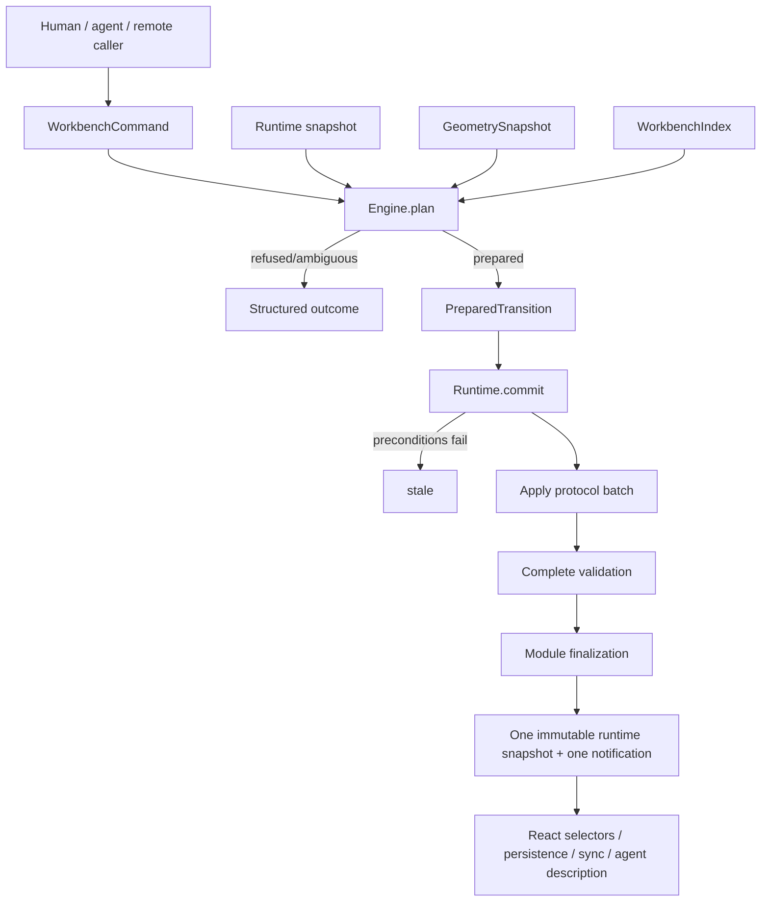

# Intern guide to the PBUI workbench core consolidation and hard cutover

## 0. How to use this guide

This document is both an architecture explanation and an implementation plan. It starts from the workbench that exists at PBUI commit `04d1d7c6df8f3ece8ccbe16a8cdd8cba4a229da5`, checks the imported assessment against the code, and defines the hard-cutover destination. It does not preserve source compatibility: PBUI is still alpha, so the goal is one coherent final architecture rather than an old API wrapped around a new one.

A new engineer should read in this order:

1. Read §§1–4 to learn the domain model and current execution path.
2. Read §5 for the evidence-backed problems.
3. Read §§6–15 as the **ideal design**: the more precise long-term architecture and the reasoning behind it.
4. Read §16 and `02-version-one-simplification-decisions.md` as the **implementation design**: these govern what this ticket will actually build first.
5. Follow §17 phase by phase; use §§18–20 as the migration and validation checklists.

The imported source is preserved verbatim at `sources/01-workbench-architectural-assessment.md`. It supplied the central direction—make planning pure, separate the engine/runtime/shell, index the graph, split identity resolution from spatial placement, and strengthen sync. This guide validates those claims, updates parts that have already moved (notably presentation-kernel-derived link dependencies), and makes the package/API cutover concrete.

> **Design status.** Sections 6–15 intentionally preserve the ideal design so future work can see what was simplified and why. Section 16 is the chosen first implementation and supersedes the ideal wherever they differ. The companion simplification record is the living decision log; implementation phases and ticket tasks follow the chosen design.

## 1. Executive summary

The Workbench has outgrown its package description. It is no longer merely “a split tree of tiles” (`packages/pbui-workbench/package.json`). It is the shared coordination substrate used to persist application views and documents, place the same logical view in multiple locations, connect typed ports, diagnose and repair layout geometry, expose commands to humans and agents, and synchronize those changes with a server.

The durable idea is strong:

> **A workbench is a persistent, addressable spatial coordination environment. Applications contribute semantics and rendering; the workbench owns logical view identity, placement, resource binding, typed coordination topology, and transactional manipulation.**

The current code contains most of the right pieces but assembles them at the wrong boundary. `createWorkbench()` constructs a document store, application registry, link runtime, semantic handlers, a shadow-store planner, placement controller, DOM root and focus helpers, and five bound React components (`createWorkbench.tsx:66-243`). The 1,407-line `verbs.ts` combines command syntax, identity policy, binding defaults, graph queries, DOM measurement, mutation construction, link maintenance, local UI state, and execution. `WorkbenchState` has become a shared drawer for semantic session state and unrelated transient dialogs (`store.ts:12-37`).

The most urgent correctness defect is not aesthetic. Planning is documented as preflight “without touching the real workbench,” yet the shadow handlers receive the live link runtime (`createWorkbench.tsx:101-125`). Link execution writes runtime effects (`links/handlers.ts:121-150`). The ticket’s executable probe demonstrates that `plan(identity.add)` leaves the document untouched but changes the live runtime revision from 1 to 2 and creates class `σ1`. Planning is therefore observably impure.

The **ideal design** uses four explicit layers:

```text
Workbench Protocol
    durable protobuf document + primitive Mutation instruction set
            │
            ▼
Workbench Engine (headless, pure)
    catalog + index + queries + command planner + validation + modules
            │
            ▼
Workbench Runtime (headless, transactional)
    revisions + session + link values + commit + persistence/sync ports
            │
            ▼
PBUI React Shell
    rendering + measurement + drag + focus + launcher/dialog controllers
```

The ideal canonical operation is:

```text
plan(snapshot, command) -> prepared transition | refusal | ambiguity
commit(prepared transition, current snapshot) -> applied receipt | stale
```

A fully elaborated prepared transition contains protocol mutations, session effects, runtime effects, explicit preconditions, created/affected ids, and a human-readable explanation. Planning performs no store writes, no runtime writes, no DOM reads, and no React work. The React shell measures the DOM into a versioned `GeometrySnapshot` and passes data to the engine.

The **chosen first implementation** keeps pure planning internally but exposes fresh `core.execute(command)` rather than long-lived commit handles. It uses one coarse local revision, a structural index plus on-demand document queries, one shell-local store, essential local validation, one explicit links collaborator, execution-time geometry, batch-preserving structural sync, a small app-definition API, and a small structured result. Section 16 is authoritative for this scope.

The hard cutover also:

- replaces internal `tile.*` semantic names with `placement.*`;
- collapses `app.place`, `app.placeAt`, `view.open`, `tile.replace`, and `tile.link` onto one identity-resolution plus placement-resolution pipeline;
- splits application manifests from React presentation while preserving one ergonomic app declaration;
- replaces `singleton`/`duplicable` booleans with explicit cardinality and clone-placement policy;
- generalizes default document binding over declared document slots;
- centralizes graph indexes and orphan cleanup;
- makes all mutation doors pass through one extension-aware transaction coordinator;
- preserves atomic batch boundaries in sync and rebases by re-planning intent, not blindly replaying structurally applicable mutations;
- removes the unused overlapping `createWorkbenchClient` API;
- moves launcher, rebalance-dialog, relation-palette, chooser, and link-mode state into dedicated shell controllers;
- replaces booleans and nullable ids as the canonical result with structured outcomes;
- validates replacements locally with the same graph/catalog rules the Go host enforces.

## 2. Scope, goals, and non-goals

### 2.1 Long-term ideal goals

The cutover must produce:

1. A React-free semantic engine usable by browsers, agents, tests, workers, and server-side tooling.
2. Deterministic, side-effect-free planning.
3. Atomic commit of durable mutations, semantic session effects, and runtime effects.
4. Explicit dependency revisions for stale-plan detection.
5. One authoritative implementation of view identity, placement, binding, cleanup, and link maintenance policy.
6. A small, coherent public API with deliberate package/subpath boundaries.
7. A React shell that is an adapter and renderer, not the semantic owner.
8. Local validation closely matching Go validation and returning structured diagnostics.
9. Sync semantics honest about concurrency and preserving semantic transaction boundaries.
10. A coordinated migration of every first-party consumer, followed by deletion of the old APIs.

### 2.2 Hard-cutover assumption

No compatibility façade, deprecated alias, dual command vocabulary, or fallback constructor should ship. Intermediate commits on an integration branch may temporarily bridge old callers, but the final commit removes those bridges. Persisted data compatibility is considered separately: a source/API hard cutover does not require casually discarding valid user workbench documents.

### 2.3 Non-goals

This pass does not:

- make application documents part of workbench semantics;
- turn protocol mutations into user-intent commands;
- adopt a CRDT or claim collaborative concurrent editing;
- merge rebalance’s mathematically distinct algorithms into one generic algorithm;
- put DOM nodes, React components, focus, or dialogs into the engine;
- expose arbitrary plugin code through persisted documents;
- infer automatic relation paths beyond what the PBUI presentation kernel declares;
- add backwards-compatibility adapters.

## 3. The domain model

### 3.1 The five identities

The protocol defines the durable graph at `proto/hyperslop/pbui/workbench/v1/workbench.proto:11-65`:

| Entity | Role | Owns | Does not own |
|---|---|---|---|
| Application manifest | executable type/class | app identity, cardinality, clone policy, ports | a particular open view |
| `AppView` | logical instance | app id, title, document bindings | geometry |
| Placement (`Node.leaf`) | spatial occurrence | placement id and a reference to a view | app state |
| Workspace | spatial context | one binary placement tree | browser selection |
| `DocumentPayload` | durable resource | opaque format/version/body | application interpretation |

The core invariant is:

```text
application != view != placement != document != workspace
```

Two placements may reference one view:

```text
placement p1 ─┐
              ├──> view v ──> app manifest A
placement p2 ─┘          └──> documents { source: r1 }
```

Changing `v.title` changes both tiles. Closing `p1` does not delete `v` while `p2` remains. An independent duplicate creates `v2`; it does not duplicate `r1` unless an application-specific command explicitly does so.

### 3.2 Geometry is a tree; semantics are a graph

Each workspace uses a binary tree:

```text
Layout ::= Placement(viewId)
         | Split(direction, ratio, Layout, Layout)
```

The full workbench is not a tree. Placements point into a shared view map; views point into a shared document map; persistent links point between view ports. A useful formalization is:

```text
D = (R, V, W, L)

R = durable resources/documents
V = logical application views
W = workspace layout trees
L = persistent coordination topology
```

with external application catalog `A`:

```text
app   : V -> A
place : P -> V
bind  ⊆ V × Slot × R
```

A view may have many placements. This graph character is why repeatedly walking all workspace trees in every command is both error-prone and conceptually wrong; the engine needs a canonical derived index (§10).

### 3.3 Durable, session, runtime, and shell state

The future architecture recognizes four lifetimes:

| Lifetime | Examples | Persistence |
|---|---|---|
| Durable document | workspaces, views, bindings, links document, app documents | serialized and synchronized |
| Semantic session | selected workspace, active placement | browser/session only |
| Semantic runtime | emitted port values, context cells, identity-class cells | in memory, reconstructed |
| Shell UI | launcher open, rebalance modal, connect overlay, chooser, palette, focus | controller/component local |

Today all but component-local state are partly merged into `WorkbenchState` (`store.ts:12-37`). The target makes lifetime and ownership visible in types.

### 3.4 Workbench ownership boundary

The Workbench owns:

- workbench/view/placement/workspace identity;
- view-to-document bindings as opaque ids;
- workspace layout and feasibility policy;
- persistent link topology between declared app ports;
- semantic commands, planning, refusal, and commit;
- validation, serialization contracts, and sync semantics;
- headless descriptions for agents.

Applications own:

- what a document payload means;
- application state and domain operations;
- how a view renders;
- domain-specific titles and launcher prose;
- domain authorization.

The React shell owns:

- DOM measurement;
- focus and pointer mechanics;
- transient modes and dialogs;
- visual tile, split, wire, launcher, and rebalance presentation;
- translating UI gestures into semantic commands.

## 4. Current architecture: data to pixels

### 4.1 Current module map

```text
workbench.proto
   ├── generated TypeScript ──> protocol/client apply + builders
   └── generated Go ──────────> pkg/workbench apply + Validate

protocol WorkbenchDocument
   │
   ▼
WorkbenchStore (document + session + shell state)
   │
   ▼
createVerbHandlers (1,407-line semantic/UI/DOM integration point)
   ├── protocol mutation builders
   ├── app registry and default-binding policy
   ├── link handlers + link runtime
   ├── DOM geometry through root()
   └── local shell state writes
   │
   ▼
createWorkbench
   ├── plan via shadow WorkbenchStore
   ├── placement controller
   ├── focus/root ownership
   └── bound React components
       Surface / Launcher / WorkspaceStrip / Rebalance / RebalanceBadge
```

### 4.2 Protocol and primitive mutation layer

The protobuf schema contains 16 mutation arms (`workbench.proto:93-111`). These are an appropriate portable instruction set: rename roots/workspaces, put/delete documents, create/configure/clone/delete/close views, replace/split/close placements, resize splits, and replace a whole workspace tree.

The TypeScript applier clones and structurally applies each mutation (`packages/workbench-protocol/src/client/apply.ts`). The Go path clones, applies a full batch, then validates the complete graph (`pkg/workbench/mutation.go:14-36`). Go validation checks format/version, resource limits, global node ids, view order, application catalog, singleton cardinality, binding declarations, document existence, document validators, credentials, and split shape/ratio (`pkg/workbench/validate.go:20-190`).

The distinction is healthy:

```text
semantic command
      ↓ planner
protocol Mutation[]
      ↓ structural applier
WorkbenchDocument
      ↓ complete graph validation
accepted document
```

Do not add every user intention to protobuf. A command such as “show this application near that placement, reusing a matching view” should compile to primitive mutations.

### 4.3 Store and commit behavior

`createWorkbenchStore` uses `useSyncExternalStore` and atomically applies one mutation array (`store.ts:91-165`). `onMutate` runs after commit, while post-commit callback failures are reported separately so callers do not retry an already-visible change (`store.ts:126-154`). This is a sound behavior to preserve.

Two boundaries are unsafe:

1. Public `replaceDocument(document)` accepts any typed object without runtime graph/catalog validation (`store.ts:156-163`).
2. Public `workbench.mutate` points directly to `store.mutate` (`createWorkbench.tsx:166`), bypassing the link-maintenance wrapper local to `createVerbHandlers`.

The second point means “all mutation doors maintain extensions” is false. Verb-originated view deletion runs link cleanup; raw mutations, sync adoption, restore, and product adapters can bypass it.

### 4.4 App catalog

`AppDescriptor` mixes semantic and React presentation fields (`apps.ts:22-67`):

```text
semantic:    id, singleton, duplicable, ports, available
presentation:title, tone, group, blurb, titleFor, Component
```

`singleton` and `duplicable` describe two axes using booleans. The server has a separate semantic `ApplicationDescriptor` with `Singleton` and `DocumentBindings` (`pkg/workbench/model.go`), so browser and server catalogs can drift.

Document-bound behavior is now derived from ports, which is better than the old `docBound` flag (`apps.ts:38-47,85-92`). However, the global `BindingConfig` still assumes one privileged key named `source` (`verbs.ts:561-575`). Apps may declare multiple document-slot ports, so creation policy has not caught up with the app model.

### 4.5 High-level verbs

`WorkbenchVerb` combines four categories (`verbs.ts:97-134`):

- durable layout/view/workspace commands;
- semantic session commands (`workspace.select`, `tile.activate`, `view.goTo`);
- shell UI commands (`launcher.open`, `rebalance.open`, link mode/palette);
- persistent link commands imported from the PBUI link kernel.

The handlers add valuable policy: singleton reuse, exact-binding deduplication, linked-view-safe replacement, default bindings, cross-workspace navigation, layout feasibility, view garbage collection, and link lifecycle maintenance. The problem is concentration, not absence.

Several commands overlap internally:

```text
app.place
app.placeAt
view.open
placement/tile replace
placement/tile link
view.goTo
```

Each independently answers two questions:

1. **Identity:** reuse an existing view, link it, clone it, or create a view?
2. **Space:** navigate, split, dock, replace, or select a default target?

The repeated branches at `verbs.ts:794-1038` are evidence that those axes should be explicit services rather than command-specific control flow.

### 4.6 DOM geometry in semantic handlers

The verb environment requires `root(): HTMLElement | null` (`verbs.ts:577-591`). Handler code queries `[data-placement-id]` and `[data-split-id]`, calls `getBoundingClientRect`, reads CSS, calculates split bounds, and recursively tests a `LayoutSpec` (`verbs.ts:686-772`). `place`, `placeAt`, `openView`, and workspace creation use that data (`verbs.ts:880-1038,1159-1179`).

The semantic questions are valid: can this placement split, what axis is longer, and is this layout feasible? The dependency shape is wrong. A planner should consume a geometry value, not discover a DOM.

### 4.7 Links and extension-like behavior

Persistent link topology lives in a `pbui.links` `DocumentPayload`; transient values live in `LinkRuntime`. This separation is good. `createLinkHandlers` derives snapshots, delegates semantic link planning to PBUI’s link kernel, writes one links-document mutation, and applies runtime effects (`links/handlers.ts:101-150`). It also maintains links when views are deleted, cloned, or retargeted (`links/handlers.ts:241-265`).

Presentation integration has advanced beyond the imported assessment: ecommerce now passes `shop.pbui.presentation.linkDeps(...)`, so link relation semantics can be projected from the compiled presentation. The remaining weakness is that `createWorkbench` still accepts an optional parallel `LinkEnvironment` and synthesizes an isolated declared-port graph when absent (`links/handlers.ts:85-103`). The target definition should install links as a compiled workbench module using the canonical presentation projection.

### 4.8 Rebalance

The rebalancer contains several legitimately distinct pure algorithms:

- exact binary-tree geometry and binary↔n-ary analysis conversion (`rebalance/analysisTree.ts`);
- bottom-up minimum-size propagation and diagnosis (`rebalance/propagate.ts`);
- convex and donor-based ratio repair (`projectLower.ts`, `strategies.ts`, `repairPass.ts`);
- combinatorial reshape/rebuild (`structural.ts`);
- proposal generation, deduplication, policy and scoring (`slate.ts`).

Do not “consolidate” these into one generic solver. Consolidate their integration. Rebalance configuration is another system document (`pbui.rebalance-config`), and its React-aware store is explicitly isolated (`rebalance/configStore.ts`). The target keeps the pure algorithms and gives the engine a constrained `workspace.rebalance` command that proves leaf/view preservation.

### 4.9 Persistence and sync

Local persistence correctly stores the document and selected workspace but not transient dialogs (`persistence.ts`). Server sync is React-free and handles bootstrap, request ids, conflict refetch, invalid batches, backoff, and streams (`sync.ts`).

Its current rebase model is structurally optimistic:

```text
server document
for each queued Mutation:
    if applyMutation accepts it: keep and apply
    else: drop
```

This is visible at `sync.ts:218-241`. Structural applicability is weaker than semantic intent. A stale `workspaceSetTree` may still apply while overwriting another layout. A stale `viewConfigure` may still target an id whose meaning changed.

The outbox also flattens committed batch boundaries into `Mutation[]` (`sync.ts:136-139,368-373`). The `onInvalid: "isolate"` path sends individual mutations (`sync.ts:335-343`), even though local commit promised the original batch was one semantic transition. The target queues transactions/commands, preserves atomic batches, and re-plans intent.

### 4.10 Public surface and consumers

The root barrel is 188 lines with 64 `export` statements. It exposes assembly, stores, command handlers, link internals, every shell component, rebalance internals, persistence, and many types through one import path (`packages/pbui-workbench/src/index.ts`). This makes “supported foundation” indistinguishable from implementation detail.

The package manifest says `README.md` ships, but no `packages/pbui-workbench/README.md` exists. This ticket document is therefore also the seed for future package docs.

A workspace scan found files importing `@hyperslop-systems/pbui-workbench` in these repositories (counts are importing files, excluding generated/build/ticket artifacts):

```text
pbui       87
agentlogic 10
turboproof  9
hyperblog   7
rag-ttc    45
datalab     0 in this checkout
```

These are migration scope indicators, not usage counts. They establish that the hard cutover must be coordinated across repositories rather than declared complete after PBUI tests pass.

## 5. Evidence-backed findings

### F1 — Critical: planning mutates the live link runtime

**Evidence.** `createWorkbench.plan()` creates a shadow store but passes the real `runtime` to shadow handlers (`createWorkbench.tsx:101-125`). Link execution applies `result.effects` to that runtime (`links/handlers.ts:146-150`).

The executable probe in `scripts/01-plan-purity-probe.test.ts` produced:

```json
{
  "planOk": true,
  "documentUnchanged": true,
  "runtimeRevisionBefore": 1,
  "runtimeRevisionAfter": 2,
  "classCountBefore": 0,
  "classCountAfter": 1,
  "classIdsAfter": ["σ1"]
}
```

**Impact.** A preflight can change values read by mounted applications even if the caller never commits the plan. A failed later command can leave runtime effects from an abandoned plan.

**Required correction.** Link planning returns runtime effects as data. Only transition commit interprets them.

### F2 — High: the plan algebra is narrower than the command algebra

`WorkbenchState` includes launcher, rebalance, link mode, show chooser, and relation palette state (`store.ts:12-37`). `WorkbenchPlan.finalState` captures only workspace, active placement, launcher open and launcher source (`types.ts:148-155`). Yet shell verbs can mutate the omitted fields.

**Impact.** Sequence planning has undefined behavior depending on which local state a command happens to touch.

**Required correction.** Remove shell actions from semantic commands. Prepared transitions carry only semantic session/runtime effects. Shell controllers handle their own actions.

### F3 — High: one documented commit pipeline does not exist

Verb handlers wrap store mutation with link maintenance and runtime cleanup (`verbs.ts:620-640`), but `Workbench.mutate` calls the store directly (`createWorkbench.tsx:166`). `replaceDocument`, restore, reset, and sync adoption also bypass the wrapper.

**Impact.** Link topology and transient link values can become stale depending on which public door changed the same document.

**Required correction.** The runtime has one `commitTransition`/`replaceSnapshot` boundary. Modules participate there regardless of command origin.

### F4 — High: freshness uses accidental object identity

`applyPlan` accepts only when `current.document === plan.baseDocument` (`createWorkbench.tsx:149-153`). This catches document replacement but not changed runtime, geometry, catalog, or policy. A geometry-dependent split may be applied after the viewport changed because the document object is unchanged.

**Required correction.** Plans state explicit revision preconditions for every dependency consulted.

### F5 — High: sync replay tests syntax, not meaning

One-by-one `applyMutation` replay (`sync.ts:218-241`) cannot know whether a stale tree replacement, resize, configuration, or replacement still represents the user’s intention.

**Required correction.** Queue semantic transaction entries and re-plan commands against the new snapshot. Mark raw protocol transactions with explicit replay policy (`replay`, `conditional`, or `conflict`).

### F6 — Medium-high: batch boundaries disappear in sync

The outbox is a flat mutation list, and invalid isolation splits it further. This contradicts the local API’s atomic transition semantics.

**Required correction.** `OutboxEntry` owns one transaction id and one indivisible mutation batch. Never isolate below semantic transaction boundaries unless the originating command explicitly declared its operations independent.

### F7 — Medium-high: duplicated high-level clients already drifted

`workbench-protocol/client/builders.ts:285-500` exports `createWorkbenchClient`, while `pbui-workbench/verbs.ts` independently implements richer versions of default binding, replacement, linking, and splitting. Current production search finds no caller of `createWorkbenchClient`; only its tests instantiate it.

**Required correction.** Delete the configured client in the hard cutover. Keep policy-neutral primitive builders in protocol; put all catalog/policy-aware planning in the engine.

### F8 — Medium-high: document replacement is under-validated

`parseDocument` checks format/version, nonempty workspaces, trees and referenced views, but not global id uniqueness, catalog membership, singleton count, declared binding slots, required bindings, all Go limits, document validators, or credential fields. `replaceDocument` checks nothing.

**Required correction.** Add a TypeScript complete-graph validator with pluggable app/document dependencies and parity fixtures against Go. Public parse/replace returns structured success or diagnostics.

### F9 — Medium: identity and spatial policies are entangled

The repeated branches in `split`, `place`, `placeAt`, `openAt`, `openView`, `replace`, and `link` decide both which view should exist and where it should appear.

**Required correction.** Implement `resolveView` and `resolvePlacement` separately, then compose them in one `view.show` planner.

### F10 — Medium: one privileged binding slot conflicts with multi-slot ports

Apps can declare multiple `documentSlot` ports (`apps.ts:38-47`), but `BindingConfig` fills only `source` (`verbs.ts:566-575`).

**Required correction.** Initial binding policy receives the app manifest and every declared slot, and returns a complete binding map or a structured refusal.

### F11 — Medium: terminology leaks visual ownership into semantics

Commands named `tile.close`, `tile.split`, `tile.link`, and `tile.replace` manipulate protocol placements. A tile sounds like an application-owning UI object; a placement is explicitly an occurrence of a logical view.

**Required correction.** Use `placement.*` in engine commands. React labels may continue saying “tile.”

### F12 — Medium: orphan-view policy is implicit and scattered

Go validation permits unplaced views. Handlers explicitly delete orphans after link, replacement, close, and workspace deletion (`verbs.ts:530-538,1109-1126,1185-1202`).

**Decision.** After a completed runtime transaction, every view must have at least one placement. Temporary unplaced views are permitted only inside an atomic mutation batch. If hidden/background views are needed later, model them as an explicit durable state instead of accidental orphans.

### F13 — Medium: semantic and React app catalogs are coupled

The engine currently requires a descriptor containing `Component`, tone, title and launcher prose even for headless use (`apps.ts:22-67`). The Go catalog independently restates a smaller semantic subset.

**Required correction.** Compile one ergonomic app declaration into a semantic manifest and a presentation entry. The engine sees only manifests; React sees presentation entries joined by app id.

### F14 — Medium: graph knowledge is repeatedly recomputed

The code repeatedly derives placement→workspace, placement→view, view→placements, app→views and node lookup across verbs, links, launcher, description and components. Search found 179 uses of the core tree-query names across workbench/protocol sources and tests.

**Required correction.** Build one immutable `WorkbenchIndex` per document revision and use it throughout planning and description.

### F15 — Low but visible: the public barrel does not communicate stability

A caller can import low-level rebalance algorithms, raw components, stores, shell assembly and semantic internals from the same root. Package documentation is absent.

**Required correction.** Define small root APIs and explicit subpaths for protocol, core, React shell, sync, rebalance and testing.

## 6. Ideal design — decisions

> **Ideal-design reference.** The decisions in §§6–15 describe the maximally explicit architecture. They remain here to document the destination and tradeoffs; §16 marks which pieces are implemented now, simplified, or deferred.

### Decision 1: Introduce a real headless engine package

- **Context:** Internal separation alone still leaves agents/tests importing a React package and encourages semantic code to reach shell facilities.
- **Options considered:** Keep one package with folders; move semantics into protocol; add a dedicated engine package.
- **Decision:** Add `@hyperslop-systems/workbench-core` (repository directory `packages/workbench-core`). Keep `workbench-protocol` as wire/primitive machinery and `pbui-workbench` as the PBUI React shell.
- **Rationale:** Protocol mutations are too low-level to own product policy, while React is too high-level. A separately typechecked package gives the headless boundary an enforceable import graph.
- **Consequences:** One additional package, but fewer conceptual entry points. Add a test that core has no React/DOM imports.
- **Status:** proposed.

### Decision 2: Make planning the canonical semantic abstraction

- **Context:** Direct imperative handlers duplicate policy and cannot be safely composed or explained.
- **Options considered:** Keep imperative handlers; command reducer; pure plan/commit.
- **Decision:** `engine.plan(snapshot, command)` returns a structured prepared transition or refusal/ambiguity. Runtime commit is separate.
- **Rationale:** Supports agents, dry runs, compound commands, audit, sync rebase, and side-effect isolation.
- **Consequences:** UI convenience methods become thin `execute(command)` wrappers.
- **Status:** proposed.

### Decision 3: One observable runtime transaction

- **Context:** Durable store, session state and link runtime currently notify independently and can expose intermediate states.
- **Options considered:** Keep stores separate; coordinate notifications; one runtime snapshot/store.
- **Decision:** The runtime owns one immutable observable snapshot containing document, semantic session, module runtime state and revision counters. A transition produces one notification.
- **Rationale:** Atomicity must be observable, not only true inside the protocol applier.
- **Consequences:** Link hooks move to shell adapters over runtime selectors. Redux adapters implement the same transactional port.
- **Status:** proposed.

### Decision 4: Shell state lives in controllers, not Workbench session

- **Context:** Every new dialog adds fields to `WorkbenchState` and leaks into planning/adapters.
- **Options considered:** Keep one UI state object; component local only; dedicated controllers.
- **Decision:** Keep semantic session to selected workspace and active placement. Launcher, placement mode, rebalance, connect mode, show chooser and relation palette each use a focused controller/store.
- **Rationale:** Matches the already-successful placement-controller pattern and keeps lifetimes explicit.
- **Consequences:** Shell composition creates and provides controllers; semantic engine never sees open/closed dialogs.
- **Status:** proposed.

### Decision 5: Separate app manifest from app presentation

- **Context:** Headless planning currently depends on React `Component`-bearing descriptors.
- **Options considered:** Two manually maintained registries; one mixed descriptor; one declaration compiled into two projections.
- **Decision:** `defineWorkbenchApp` accepts `{manifest, presentation}` and validates both once. Engine catalog is the manifest projection; shell registry is the presentation projection.
- **Rationale:** No duplicated app ids or semantic declarations, but clean dependency direction.
- **Consequences:** Go catalogs should be generated or parity-checked from the semantic manifest source where feasible.
- **Status:** proposed.

### Decision 6: No orphan views after commit

- **Context:** Cleanup is repeated and hidden views have no explicit semantics.
- **Options considered:** Allow orphans; garbage collect opportunistically; make placement mandatory.
- **Decision:** Every committed view has at least one placement. Engine cleanup is centralized in transition finalization.
- **Rationale:** Matches current user behavior and removes handler-specific garbage collection.
- **Consequences:** Go/TS complete validators gain an `unplaced_view` diagnostic. Batch intermediates remain legal.
- **Status:** proposed.

### Decision 7: Rebalance preserves placement membership and view mapping

- **Context:** Raw `workspaceSetTree` can add/drop/reassign leaves, while rebalance claims only to rearrange.
- **Options considered:** Trust callers; expose only resize; validate a preservation law.
- **Decision:** `workspace.rebalance` requires:

```text
map(before leaves, placementId -> viewId)
  == map(after leaves, placementId -> viewId)
```

- **Rationale:** This is stronger and more useful than equal leaf count.
- **Consequences:** Raw `workspaceSetTree` remains protocol-level/admin input, not the normal semantic command.
- **Status:** proposed.

### Decision 8: Sync is optimistic intent replay, not collaborative merge

- **Context:** Current mutation replay can overwrite semantically concurrent work.
- **Options considered:** Document current limitation only; CRDT; command re-planning with conflict policies.
- **Decision:** Preserve transaction entries and re-plan commands against fresh server state. Return explicit conflicts when meaning cannot be preserved.
- **Rationale:** Stronger than structural replay without adopting CRDT complexity.
- **Consequences:** Some currently “successful” stale replays become visible conflicts. This is intentional.
- **Status:** proposed.

### Decision 9: Hard cut over package and command APIs

- **Context:** Alpha status permits correction before accidental compatibility becomes permanent.
- **Options considered:** aliases/deprecations; feature flag; coordinated hard cutover.
- **Decision:** Migrate all first-party consumers in one release train and delete old APIs.
- **Rationale:** The requested outcome is a foundational system, not another compatibility layer.
- **Consequences:** Requires workspace-wide branch coordination and a published migration note.
- **Status:** accepted for this ticket.

## 7. Ideal design — architecture and dependency direction

### 7.1 Package responsibilities

```text
packages/workbench-protocol
  generated protobuf types
  primitive structural apply
  primitive mutation constructors
  protocol JSON codec
  parity fixtures
  NO app policy, NO React, NO runtime

packages/workbench-core
  semantic app manifests and catalog
  complete TS validation
  immutable WorkbenchIndex
  semantic commands and schemas
  pure planner and modules
  prepared transitions and preconditions
  transactional runtime and selectors
  headless describe/query API
  persistence/sync ports (or small subpaths)
  NO React, NO DOM

packages/pbui-workbench
  app presentation projection
  React context and hooks
  Surface / Tile / Split / WorkspaceStrip
  geometry measurement adapter
  launcher, placement, rebalance, linking UI controllers
  focus and shortcut arbitration
  rebalance UI; pure rebalance algorithms imported from core/rebalance
```

### 7.2 Runtime data flow



### 7.3 Pure planning boundary

The engine accepts values only:

```ts
interface WorkbenchWorld {
  document: WorkbenchDocument;
  session: WorkbenchSession;
  modules: WorkbenchModuleSnapshot;
  geometry: GeometrySnapshot | null;
  revisions: WorkbenchRevisions;
  index: WorkbenchIndex;
}
```

It must not accept:

- `HTMLElement` or callbacks returning one;
- mutable stores;
- React components/hooks;
- focus functions;
- link runtime mutation methods;
- persistence callbacks.

## 8. Ideal design — public APIs

The sketches below specify ownership and result shape. Names may change during implementation, but the boundaries and invariants should not.

### 8.1 App declaration

```ts
const ordersApp = defineWorkbenchApp({
  manifest: {
    id: "orders",
    viewCardinality: "many",       // "one" | "many"
    duplicatePlacement: "clone",  // "clone" | "link"
    ports: definePorts([
      {
        name: "relation",
        direction: "in",
        documentSlot: true,
        contract: { valueType: "relation", semanticRole: "relation" },
        doc: "the relation document shown by this view",
      },
      {
        name: "order",
        direction: "out",
        contract: { valueType: "order", semanticRole: "selection" },
        doc: "the selected order",
      },
    ]),
  },
  presentation: {
    title: "Orders",
    tone: "var(--pbui-tone-orders)",
    group: "DATA",
    blurb: "Browse and select orders",
    titleFor(view) { /* presentation-only */ },
    Component: OrdersTile,
  },
});
```

The two semantic axes replace negated booleans:

| Current | Target |
|---|---|
| `singleton: true` | `viewCardinality: "one"` |
| `singleton: false` | `viewCardinality: "many"` |
| `duplicable: false` | `duplicatePlacement: "link"` |
| `duplicable: true` | `duplicatePlacement: "clone"` |

### 8.2 Definition compilation

```ts
const definition = defineWorkbench({
  id: "shop.workbench",
  apps: [ordersApp, orderDetailApp, plotApp],
  policy: {
    split: { minInlinePx: 240, minBlockPx: 160, minFraction: 0.10 },
    initialDocuments: shopInitialDocuments,
    emptyPlacement: { appId: "launcher" },
  },
  modules: [
    workbenchLinks({ presentation: shopPresentation }),
    rebalanceDocuments(),
  ],
  documentValidators: [shopDocumentValidator],
});
```

Compilation fails fast on duplicate apps/modules, invalid policies, undeclared port types, contradictory cardinality/clone policy, duplicate document formats, and invalid initial-binding policy declarations.

### 8.3 Engine, runtime, and React shell

```ts
const engine = createWorkbenchEngine(definition);

const runtime = createWorkbenchRuntime({
  engine,
  initial: initialDocument,
  initialSession: { workspaceId: "main", activePlacementId: null },
  onCommit(receipt) { persistence.enqueue(receipt); },
  onRefused(refusal) { notices.show(refusal.because); },
});

const shell = createWorkbenchReact({
  runtime,
  apps: definition.presentations,
});

root.render(
  <shell.Provider>
    <shell.WorkspaceStrip />
    <shell.Surface />
    <shell.Launcher />
    <shell.Rebalance />
  </shell.Provider>,
);
```

`createWorkbench(...)` may exist only as a thin sample-oriented convenience that calls these constructors. The canonical documentation and tests use the explicit layers.

### 8.4 Command algebra

```ts
type WorkbenchCommand =
  | { kind: "placement.duplicate"; placementId: PlacementId; axis?: Axis }
  | { kind: "placement.close"; placementId: PlacementId }
  | { kind: "placement.swap"; a: PlacementId; b: PlacementId }
  | { kind: "placement.dock"; source: PlacementId; target: PlacementId; edge: Edge }
  | { kind: "placement.resize"; splitId: SplitId; ratio: number }
  | { kind: "view.show"; view: ViewRequest; placement: PlacementRequest }
  | { kind: "view.configure"; viewId: ViewId; title?: TitleChange; documents?: BindingChange }
  | { kind: "workspace.create"; name: string; layout?: LayoutSpec }
  | { kind: "workspace.rename"; workspaceId: WorkspaceId; name: string }
  | { kind: "workspace.delete"; workspaceId: WorkspaceId }
  | { kind: "workspace.clone"; workspaceId: WorkspaceId; name?: string }
  | { kind: "workspace.rebalance"; workspaceId: WorkspaceId; tree: Node }
  | { kind: "session.selectWorkspace"; workspaceId: WorkspaceId }
  | { kind: "session.activatePlacement"; placementId: PlacementId | null }
  | WorkbenchLinkCommand;
```

Not commands:

```text
launcher.open / launcher.close
rebalance.open / rebalance.close
link.mode.open / link.mode.close
relation.palette.open / close
show chooser open / close
```

Those are `WorkbenchShellAction`s owned by controllers.

### 8.5 View identity and placement requests

```ts
type ViewRequest =
  | { kind: "existing"; viewId: ViewId }
  | {
      kind: "application";
      appId: AppId;
      documents?: Readonly<Record<DocumentSlot, DocumentId>>;
      title?: string;
      reuse?: "manifest-default" | "same-bindings" | "never";
      requestedViewId?: ViewId;
    };

type PlacementRequest =
  | { kind: "navigate" }
  | { kind: "auto"; near?: PlacementId }
  | { kind: "split"; target: PlacementId; edge?: Edge; axis?: Axis }
  | { kind: "replace"; target: PlacementId };
```

The planner performs:

```text
resolvedView = resolveView(world, request.view)
resolvedPlace = resolvePlacement(world, request.placement, resolvedView)
transition  = materialize(resolvedView, resolvedPlace)
```

This one pipeline replaces command-specific copies of singleton reuse, exact-binding deduplication, empty-pane filling, default target selection, geometry direction, create/link/configure, and activation.

### 8.6 Initial binding policy

```ts
interface InitialDocumentPolicy {
  resolve(input: {
    app: WorkbenchAppManifest;
    slots: readonly DocumentSlot[];
    requested: Readonly<Record<string, string>>;
    document: WorkbenchDocument;
    index: WorkbenchIndex;
  }):
    | { kind: "bound"; documents: Readonly<Record<DocumentSlot, DocumentId>> }
    | { kind: "refused"; code: string; because: string; missing: readonly DocumentSlot[] };
}
```

No special global `source` key. An app with no slots gets `{}`. An app with required slots either gets all required ids or is refused before a broken tile is created.

### 8.7 Structured outcomes

```ts
type PlanResult =
  | { kind: "prepared"; transition: PreparedTransition }
  | { kind: "refused"; code: string; because: string; path?: string; command: WorkbenchCommand }
  | { kind: "ambiguous"; because: string; choices: readonly CommandChoice[] };

type ExecuteResult =
  | { kind: "applied"; receipt: TransitionReceipt }
  | { kind: "refused"; code: string; because: string; path?: string }
  | { kind: "ambiguous"; choices: readonly CommandChoice[] }
  | { kind: "stale"; failed: readonly PreconditionFailure[] };
```

Buttons may ignore an `applied` receipt. Agent and sync callers must not lose refusal/staleness detail.

## 9. Ideal design — prepared transitions and commit semantics

### 9.1 Data shape

```ts
interface PreparedTransition {
  id: TransactionId;
  command: WorkbenchCommand | readonly WorkbenchCommand[];
  preconditions: readonly Precondition[];
  mutations: readonly Mutation[];
  sessionEffects: readonly SessionEffect[];
  runtimeEffects: readonly RuntimeEffect[];
  intents: readonly AfterCommitIntent[];
  affected: {
    workspaces: readonly WorkspaceId[];
    views: readonly ViewId[];
    placements: readonly PlacementId[];
    documents: readonly DocumentId[];
  };
  explanation: string;
}
```

`AfterCommitIntent` contains optional semantic hints such as “focus placement X” or “announce Y.” It is not executed by the engine. The React shell may interpret it after a successful receipt; a headless caller may ignore it.

### 9.2 Preconditions

```ts
type Precondition =
  | { kind: "document-revision"; equals: number }
  | { kind: "runtime-revision"; module: string; equals: number }
  | { kind: "geometry-revision"; equals: number }
  | { kind: "definition-revision"; equals: string }
  | { kind: "entity"; entity: string; id: string; fingerprint: string };
```

Only dependencies actually consulted are included. A workspace rename need not depend on geometry. An auto-split does. A link identity merge depends on link runtime values if merge policy selected one of them.

### 9.3 Planning pseudocode

```text
plan(world, commands):
    assert world is an immutable snapshot
    draftDocument = world.document
    draftSession = world.session
    accumulated = empty transition

    for command in commands:
        handler = compiled command table[command.kind]
        fragment = handler.plan({ world, draftDocument, draftSession, index })
        if fragment refuses or is ambiguous:
            return that outcome with command index

        draftDocument = structuralApply(draftDocument, fragment.mutations)
        draftSession = applySessionEffects(draftSession, fragment.sessionEffects)
        index = buildOrIncrementIndex(draftDocument)
        append fragment data; DO NOT execute effects

    for module in definition.modules:
        maintenance = module.maintain(world, draftDocument, accumulated)
        append maintenance mutations/effects
        structurally apply maintenance to draftDocument

    finalize orphan cleanup once
    validate complete draft graph against compiled definition
    derive exact preconditions from dependencies read
    return prepared transition
```

No shadow store is needed. A planner manipulates local values, not observable objects.

### 9.4 Commit pseudocode

```text
commit(prepared):
    current = runtime.snapshot()
    failures = check(prepared.preconditions, current)
    if failures: return stale(failures)

    nextDocument = applyMutations(current.document, prepared.mutations)
    validate(nextDocument, definition)
    nextSession = reduce(current.session, prepared.sessionEffects)
    nextModules = reduceModuleRuntime(current.modules, prepared.runtimeEffects)

    next = freeze({
        ...current,
        revision: current.revision + 1,
        documentRevision: mutations.length ? current.documentRevision + 1 : current.documentRevision,
        document: nextDocument,
        session: repairSession(nextSession, nextDocument),
        modules: nextModules,
    })
    publish exactly once
    call post-commit observers with receipt (errors cannot roll back commit)
    return applied(receipt)
```

### 9.5 Replacement semantics

`replaceSnapshot` is not an escape hatch. It:

1. parses and fully validates the incoming document;
2. computes module replacement effects (drop values for absent views, rebuild caches);
3. repairs selected workspace and active placement;
4. increments document/runtime revisions;
5. publishes once;
6. reports structured diagnostics or an applied receipt.

An `unsafeInstallDocument` helper may exist only under `/testing` and must not be exported from production entry points.

## 10. Ideal design — comprehensive canonical index and queries

### 10.1 Index shape

```ts
interface WorkbenchIndex {
  workspaceById: ReadonlyMap<WorkspaceId, Workspace>;
  nodeById: ReadonlyMap<NodeId, Node>;
  workspaceByNodeId: ReadonlyMap<NodeId, WorkspaceId>;
  viewByPlacementId: ReadonlyMap<PlacementId, ViewId>;
  placementsByViewId: ReadonlyMap<ViewId, readonly PlacementRef[]>;
  viewsByAppId: ReadonlyMap<AppId, readonly ViewId[]>;
  viewsByDocumentId: ReadonlyMap<DocumentId, readonly ViewBindingRef[]>;
  documentsByFormat: ReadonlyMap<string, readonly DocumentId[]>;
  orphanViewIds: readonly ViewId[];
}
```

Build it once per document revision. Construction validates duplicate node ids and malformed leaves early. Queries become O(1) or proportional to result size instead of repeated full-tree walks.

### 10.2 Query API

```ts
index.workspaceOfPlacement(id)
index.viewOfPlacement(id)
index.placementsOfView(id)
index.viewsOfApp(id)
index.bindingsToDocument(id)
index.firstPlacement(viewId, workspaceId?)
index.assertPlacement(id)
```

The engine, description API, launcher model, links module, rebalance adapter and React shell all use this index. Protocol/client may retain tiny standalone tree helpers for primitive tests, but workbench semantic code must not reimplement graph joins.

### 10.3 Incremental indexing

Start with full rebuild keyed by document revision. At current limits (256 nodes, 128 views), clarity beats incremental complexity. Profile before adding mutation-delta indexing. The interface permits a future incremental implementation without exposing it.

## 11. Ideal design — geometry and layout feasibility

### 11.1 Geometry snapshot

```ts
interface GeometrySnapshot {
  revision: number;
  viewport: Rect;
  divider: { inline: number; block: number };
  placements: ReadonlyMap<PlacementId, Rect>;
  splits: ReadonlyMap<SplitId, { rect: Rect; direction: Axis }>;
}
```

The React shell owns:

```text
DOM -> GeometrySnapshot
```

The engine owns:

```text
(document, geometry, policy, command) -> feasibility decision
```

### 11.2 Headless behavior

If geometry is absent:

- explicit split axis/edge uses relative `minFraction` constraints;
- automatic longer-axis placement uses a deterministic policy fallback configured in the definition;
- operations that require guaranteed pixel feasibility may return `geometry-required` rather than pretending a DOM exists.

This behavior must be declared per command and tested. Headless agents and browsers should not silently use different semantic rules.

### 11.3 Two validity layers

Keep these names separate:

```text
protocol validity   — representable tree, ratio in [0.05, 0.95], valid ids
layout feasibility  — useful at the current viewport and app/policy minima
```

A saved layout can remain valid while becoming infeasible on a phone. Rebalance repairs feasibility; it does not launder invalid protocol data.

### 11.4 Rebalance law

Before accepting `workspace.rebalance`:

```text
before = Map(leaves(oldTree), p => [p.id, p.viewId])
after  = Map(leaves(newTree), p => [p.id, p.viewId])
require deepEqual(before, after)
```

Property tests should generate trees and prove every proposal emitted by `buildSlate` satisfies this law.

## 12. Ideal design — modules and system documents

### 12.1 Why a module boundary is needed

Links and rebalance configuration already store Workbench-level behavior in `DocumentPayload` objects. Link topology additionally reacts to view lifecycle and has transient runtime effects. Hard-coding `links.maintenance` inside placement/view handlers will not scale to more coordination systems.

### 12.2 Narrow module contract

```ts
interface WorkbenchModule<State = unknown> {
  id: string;
  formats: readonly string[];

  validateDocument?(payload: DocumentPayload, context: ValidationContext): Diagnostic[];
  readRuntime?(document: WorkbenchDocument): State;

  commandHandlers?: ReadonlyMap<string, CommandHandler>;

  maintain?(input: {
    before: WorkbenchWorld;
    afterDocument: WorkbenchDocument;
    mutations: readonly Mutation[];
    indexBefore: WorkbenchIndex;
    indexAfter: WorkbenchIndex;
  }): PlanFragment;

  replaceEffects?(before: WorkbenchWorld, after: WorkbenchDocument): readonly RuntimeEffect[];
  describe?(world: WorkbenchWorld): unknown;
}
```

This is a compiled internal extension point, not a runtime plugin loader. Modules are supplied by trusted code at definition construction. Duplicate ids/formats fail construction.

### 12.3 Link module

`workbenchLinks({presentation})` provides:

- link command handlers backed by the PBUI link kernel;
- `pbui.links` codec/validator;
- lifecycle maintenance for removed/cloned/retargeted views;
- runtime state reducer for emitted/context/class/attended cells;
- link description projection;
- explicit runtime revision dependencies.

The planner receives a `LinkSnapshot` value and returns document/runtime effects. It never receives `LinkRuntime.apply`.

### 12.4 Rebalance module

Keep pure analysis under `workbench-core/rebalance`. The React dialog/controller remains in `pbui-workbench`. The module owns the config document format and constrained rebalance command, not modal-open state.

### 12.5 Application documents

Application-specific documents remain opaque to core. Products register format validators/migrations. The Workbench validates references and delegates payload meaning.

## 13. Ideal design — validation and protocol alignment

### 13.1 Complete TypeScript validation

Add:

```ts
validateWorkbenchDocument(document, {
  applications: semanticCatalog,
  documents: documentValidators,
  limits,
  modules,
}): ValidationResult
```

It should match Go diagnostic codes and paths for:

- format/version;
- workspace count and ids;
- global node ids, depth/count, split direction/ratio/children;
- leaf→view references;
- view map/id/order consistency;
- app existence and cardinality;
- declared/required document slots;
- document existence, size, body, credential fields and product validation;
- no orphan views at transaction boundary;
- module/system-document validity.

### 13.2 Structured parsing

Replace null-only parsing with:

```ts
type ParseWorkbenchResult =
  | { ok: true; document: WorkbenchDocument; migrations: MigrationNotice[] }
  | { ok: false; diagnostics: readonly WorkbenchDiagnostic[]; rawPreserved?: string };
```

Local persistence may fall back to a default for UI continuity, but it should preserve/report corrupt raw data so users can export or diagnose it.

### 13.3 TS/Go parity

Extend shared fixtures beyond primitive mutations:

```text
contracts/workbench/v1/valid/*
contracts/workbench/v1/invalid/*
packages/workbench-protocol/fixtures/mutations/*
```

Both languages must assert the same accept/reject result and primary code/path. A schema or validator change is incomplete until both suites pass.

### 13.4 Protocol cleanup

Delete `ClientConfig`, `WorkbenchClient`, and `createWorkbenchClient` from `workbench-protocol/client`. Retain only primitive document queries/builders that do not know application policy. Consider moving ids behind an injected `IdGenerator`; deterministic planners and property tests should not depend on global `crypto.randomUUID()`.

## 14. Ideal design — React shell and controllers

### 14.1 Shell composition

The shell receives a runtime and presentation registry. It never constructs semantic handlers. Components call `runtime.execute(command)` and interpret structured results.

```text
createWorkbenchReact
  ├── GeometryController
  ├── FocusController
  ├── PlacementController
  ├── LauncherController
  ├── RebalanceController
  ├── LinkUiController
  └── bound components
```

### 14.2 Minimal semantic session

```ts
interface WorkbenchSession {
  workspaceId: WorkspaceId;
  activePlacementId: PlacementId | null;
}
```

`repairSession` runs after every document commit/replacement. The selected workspace must exist; the active placement must belong to it. Switching workspaces should explicitly choose whether to activate the first placement; the command receipt should report the selected target instead of forcing callers to infer it from React.

### 14.3 Controller examples

```ts
interface LauncherController {
  getState(): { open: boolean; from: PlacementId | null; query: string };
  open(from?: PlacementId): void;
  close(): void;
  choose(rowId: string): Promise<ExecuteResult>;
  subscribe(listener: () => void): () => void;
}

interface LinkUiController {
  getState(): {
    mode: "off" | "connect";
    chooser: ShowChoiceState | null;
    relationPalette: RelationPaletteState | null;
  };
  dispatch(action: LinkUiAction): void;
}
```

These controllers can use the PBUI escape-surface and shortcut systems in the React package. Redux products may adapt them independently of the semantic runtime.

### 14.4 Preserve good rendering behavior

Keep:

- a per-tile error boundary (`components/Tile/Tile.tsx`);
- app state outside layout nodes;
- one-cell grid/min-size discipline;
- keyboard-operable split separators;
- pointer-local divider state with one commit on release;
- focus by placement id after successful placement;
- explicit tile/view linked badge;
- scoped root ownership for multiple workbenches;
- product-rendered title/badge/port/wire hooks where they express presentation policy.

## 15. Ideal design — persistence and synchronization

### 15.1 Local persistence

Persistence subscribes to runtime receipts or selected snapshot fields, not every shell controller. The envelope contains:

```ts
interface PersistedWorkbenchSnapshot {
  envelopeVersion: number;
  document: unknown;       // protobuf JSON
  session?: { workspaceId: WorkspaceId };
}
```

Active placement and shell UI remain transient. Migrations are centralized and structured.

### 15.2 Outbox entry

```ts
interface OutboxEntry {
  id: TransactionId;
  command: WorkbenchCommand | readonly WorkbenchCommand[];
  mutations: readonly Mutation[];
  baseServerRevision: ServerRevision;
  replay: "replan" | "conditional" | "conflict";
  explanation: string;
}
```

One local transition creates one outbox entry. The transport sends its batch atomically with its stable transaction id.

### 15.3 Conflict algorithm

```text
on 409:
    fresh = client.get()
    shadow = runtimeSnapshotFrom(fresh)
    kept = []
    conflicts = []

    for entry in queued transactions, in order:
        if entry.replay == conflict:
            conflicts += entry
            continue

        result = engine.plan(shadow, entry.command)
        if result is prepared and semantic target/preconditions still hold:
            shadow = applyPreparedLocally(shadow, result.transition)
            kept += recompiled entry(result.transition)
        else:
            conflicts += { entry, result }

    runtime.replaceSnapshot(shadow)
    expose conflicts to product/user
    retry kept in transaction order
```

### 15.4 Mutation policies

Examples:

| Operation | Default stale policy |
|---|---|
| unique `viewCreate` | re-plan/replay if id still free |
| workspace rename | conditional on workspace identity/fingerprint |
| split near placement | re-plan if placement still exists and feasible |
| `workspaceSetTree` / rebalance | conflict if source tree fingerprint changed |
| split resize | conditional on split identity and optional prior ratio |
| view configure | conditional on view/app/binding fingerprint |
| link follow | re-plan against current ports/types/cycles |

### 15.5 Concurrency statement

Document the guarantee honestly:

> Version 1 provides optimistic single-user/multi-client persistence with intent-aware conflict detection. It does not provide collaborative concurrent layout editing or CRDT convergence.

## 16. Chosen first-version implementation design

This section is authoritative for the implementation in this ticket. The ideal design in §§6–15 remains a long-term reference, not a hidden acceptance criterion. Detailed rationale and the living decision history are in `02-version-one-simplification-decisions.md`.

### 16.1 What remains unchanged from the ideal

The first version keeps the boundaries that address observed problems:

- distinct application, view, placement, document, and workspace identities;
- `workbench-protocol` as the durable primitive instruction layer;
- a separate React-free and DOM-free `workbench-core` package;
- pure internal planning and atomic protocol mutation batches;
- one execution gateway for durable change, cleanup, validation, persistence observation, and links maintenance;
- semantic session state separate from transient shell state;
- semantic app manifests separate from React presentation entries;
- positive cardinality and clone-placement policies;
- slot-aware initial document binding;
- semantic `placement.*` terminology;
- generalized `view.show` with independent `resolveView` and `resolvePlacement` stages;
- explicit non-durable transition effects; their final link-cell representation remains deferred;
- rebalance preservation of `placementId → viewId`;
- hard cutover without compatibility aliases.

### 16.2 Ideal versus chosen design

| Concern | Ideal design (§§6–15) | Chosen first implementation |
|---|---|---|
| Plan freshness | Dependency-specific document/runtime/geometry/definition/entity preconditions | One coarse local semantic revision; normal calls plan and apply inside `execute` |
| Public assembly | Compile definition, create engine, create runtime, create React shell | `createWorkbenchCore(...)`, then `createWorkbenchShell(...)` |
| Plan lifetime | Public prepared transitions may be committed later | `preview` is advisory; acceptance executes/replans the original command |
| Shell follow-up | Planned `AfterCommitIntent[]` | Shell reacts to small execution results |
| Shell state | Focused controller per transient feature | One shell-local store; placement mode remains a separate async controller |
| Extensibility | Generic `WorkbenchModule` registry | One narrow explicit links collaborator; generalize after a second example |
| App definition | Compiled definition, fragments/revisions/validators/modules | Small manifest/presentation helper and immutable app lists |
| Validation | Full TS/Go parity, limits, payload validators, credentials | Essential structural/catalog/binding checks; server remains authoritative |
| Orphan views | Reject every committed orphan | Generated commands avoid/clean new orphans; imported orphans remain legal |
| Index | Comprehensive materialized graph projection | Structural index plus centralized on-demand document/format/orphan queries |
| Geometry | Versioned full snapshot and geometry preconditions | Geometry measured and supplied immediately at execution time |
| Sync | Store commands and re-plan intent with operation-specific policies | Preserve whole mutation batches; retry or conflict each batch atomically |
| Results | Rich prepared/refused/ambiguous/stale results and detailed receipts | Small success/refusal/choice result with only demonstrated ids |

### 16.3 Chosen core API

```ts
const core = createWorkbenchCore({
  initial,
  apps: appManifests,
  policy: {
    split: { minInlinePx: 240, minBlockPx: 160, minFraction: 0.1 },
    initialDocuments,
    emptyPlacement: { appId: "launcher" },
  },
  links: createWorkbenchLinks({ presentation }),
});

const shell = createWorkbenchShell({
  core,
  apps: appPresentations,
});
```

The core’s normal semantic door is fresh execution:

```ts
const result = core.execute(command, {
  geometry: shell.measureFor(command),
});
```

Internally:

```text
capture {revision, document, session, index, link snapshot}
→ plan against immutable values
→ refuse or produce {mutations, explicit local effects, result data}
→ confirm the one local revision still matches
→ structurally apply the complete mutation batch
→ run essential validation
→ apply explicit links maintenance/effects through the one gateway
→ rebuild the structural index
→ install document/session/index and report one small result
```

`core.preview(command)` runs the pure planning half and returns an advisory description/choice. A preview cannot be passed to `commit`; accepting it calls `execute(command)` again.

### 16.4 Chosen generalized `view.show`

```ts
type ViewRequest =
  | { kind: "existing"; viewId: ViewId }
  | {
      kind: "application";
      appId: AppId;
      documents?: Readonly<Record<DocumentSlot, DocumentId>>;
      title?: string;
      reuse?: "manifest-default" | "same-bindings" | "never";
      requestedViewId?: ViewId;
    };

type PlacementRequest =
  | { kind: "navigate" }
  | { kind: "auto"; near?: PlacementId }
  | { kind: "split"; target: PlacementId; edge?: Edge; axis?: Axis }
  | { kind: "replace"; target: PlacementId };
```

Convenience builders may express split, place, open, replace, and link workflows, but compile to:

```ts
{ kind: "view.show", view: ViewRequest, placement: PlacementRequest }
```

The planner keeps identity and geometry independent:

```text
resolvedView = resolveView(world, command.view)
resolvedPlacement = resolvePlacement(world, command.placement, resolvedView, geometry)
transition = materialize(resolvedView, resolvedPlacement)
```

### 16.5 Chosen structural index

Precompute only relationships used by nearly every command:

```ts
interface WorkbenchIndex {
  workspaceById: ReadonlyMap<WorkspaceId, Workspace>;
  nodeById: ReadonlyMap<NodeId, Node>;
  workspaceByNodeId: ReadonlyMap<NodeId, WorkspaceId>;
  viewByPlacementId: ReadonlyMap<PlacementId, ViewId>;
  placementsByViewId: ReadonlyMap<ViewId, readonly PlacementRef[]>;
  viewsByAppId: ReadonlyMap<AppId, readonly ViewId[]>;
}
```

Keep less-common relationships as shared query functions:

```ts
viewsUsingDocument(document, documentId)
documentsWithFormat(document, format)
orphanViewIds(document, index)
```

This does not remove binding validation, orphan cleanup, format lookup, or exact-binding reuse. It computes those answers on demand. Rebuild the index wholesale after each document revision; do not implement incremental maintenance.

### 16.6 Chosen links integration

Do not ship the ideal generic `WorkbenchModule` interface yet. `createWorkbenchLinks(...)` is a concrete collaborator used by the one core execution gateway for:

- link commands;
- `pbui.links` document updates;
- lifecycle maintenance after view deletion, cloning, or retargeting;
- link descriptions;
- non-durable effects once their cell semantics are settled.

It must return changes as data during planning and must never mutate live runtime state from `preview` or the planner. Revisit a general module abstraction only after another subsystem demonstrates the same lifecycle.

### 16.7 Chosen shell and geometry

```ts
interface WorkbenchShellState {
  launcher: { from: PlacementId | null; query: string } | null;
  rebalanceOpen: boolean;
  linkModeOpen: boolean;
  showChooser: ShowChoice | null;
  relationPalette: RelationPaletteState | null;
}
```

This store is separate from `WorkbenchSession`. Placement mode remains its own controller because it is an asynchronous interaction. Focus is a shell helper invoked after a successful result.

Geometry is an immutable value measured immediately before execution. It has no first-version revision token. Explicit/headless commands use deterministic configured fallbacks when measurements are unavailable.

### 16.8 Chosen app and result APIs

One helper produces two projections:

```ts
const app = defineWorkbenchApp({
  manifest: { id, viewCardinality, duplicatePlacement, ports },
  presentation: { title, tone, Component, titleFor, group, blurb },
});
```

The first result API is intentionally small:

```ts
type ExecuteResult =
  | {
      ok: true;
      changed: boolean;
      createdPlacementId?: PlacementId;
      selectedWorkspaceId?: WorkspaceId;
    }
  | {
      ok: false;
      code: string;
      because: string;
      choices?: readonly Choice[];
    };
```

Internal logging may retain command, mutations, and richer diagnostics. Those are not stable public result fields yet.

### 16.9 Chosen persistence and sync

The local persistence envelope remains document plus optional selected workspace. Sync changes its outbox from a flat mutation list to atomic entries:

```ts
interface OutboxEntry {
  id: string;
  mutations: readonly Mutation[];
}
```

On a server conflict, fetch the current document and try each complete queued batch with `applyMutations`. Keep or reject the whole batch. Never isolate individual mutations. Treat destructive `workspaceSetTree`/rebalance batches as conflicts when their base server revision moved. This remains optimistic single-user/multi-client persistence, not semantic merge or collaborative editing.

## 17. Implementation phases for the chosen first version

Each phase should land as a focused commit with tests. Do not combine all renames, behavior changes, package moves, and consumer migrations in one unreviewable diff.

### Phase 0 — Freeze evidence and contracts

**Purpose.** Protect the behavior worth keeping before extraction.

Tasks:

- Keep the plan-purity probe and invert its assertions when fixed.
- Add golden command→transition fixtures for split, close, dock, clone, exact-binding reuse, singleton reuse, linked replacement, link lifecycle, and rebalance.
- Inventory all imports/consumers and assign migration owners.
- Record public entry points and identify intended final subpaths.
- Add a no-React/no-DOM dependency test scaffold for the future core package.

Exit gate:

```text
existing protocol tests: 48 green
existing workbench tests: 281 green
new transition goldens describe current intended semantics
known defects are tests, not comments only
```

### Phase 1 — Protocol hygiene, essential validation, and structural index

Files:

```text
packages/workbench-protocol/src/client/{apply,builders,index}.ts
packages/workbench-core/src/{validation,index,queries,diagnostics}.ts (new)
contracts/workbench/v1/**
```

Tasks:

1. Create `packages/workbench-core` with enforced no-React/no-DOM imports.
2. Implement the six-map structural `WorkbenchIndex` and rebuild it wholesale per document revision.
3. Add shared on-demand queries for document bindings, document formats, and orphan views.
4. Implement essential format/tree/id/view-order/app-cardinality/binding validation.
5. Keep imported orphan views legal; add tests that core-generated commands do not create new accidental orphans.
6. Delete `createWorkbenchClient` and its configured-client tests.
7. Preserve existing primitive mutation parity fixtures; do not expand this phase into complete Go validator parity.

Exit gate: malformed structural/catalog replacements are refused; index queries match slow traversal references; no production caller references `createWorkbenchClient`; core imports no React or DOM.

### Phase 2 — Small app model and core assembly

Files:

```text
packages/workbench-core/src/{apps,policy,createWorkbenchCore}.ts
packages/pbui-workbench/src/{apps,createWorkbenchShell}.tsx
```

Tasks:

- Introduce semantic manifest and React presentation projections.
- Replace booleans with `viewCardinality` and `duplicatePlacement`.
- Add one `defineWorkbenchApp({manifest, presentation})` convenience helper.
- Implement slot-aware initial-document policy.
- Add one public `createWorkbenchCore(...)` constructor and one shell constructor.
- Do not add fragments, definition revisions, generic plugin compilation, or generated Go catalogs.

Exit gate: headless app/core construction imports no React; manifest/presentation ids agree; required slots are checked before view creation.

### Phase 3 — Pure planner, generalized `view.show`, and fresh execution

Files:

```text
packages/workbench-core/src/commands/**
packages/workbench-core/src/planner/**
packages/workbench-core/src/effects/**
packages/workbench-core/src/execute.ts
packages/pbui-workbench/src/verbs.ts (shrinks, then deleted)
```

Tasks:

1. Define `placement.*`, workspace/session, link, and generalized `view.show` command schemas.
2. Implement `resolveView`, `resolvePlacement`, and `materialize` as pure stages.
3. Retain explicit non-durable effects rather than collapsing everything into a session patch.
4. Implement `core.execute(command)` as capture → plan → coarse-revision check → apply.
5. Implement advisory `core.preview(command)` with no public commit handle.
6. Use the small success/refusal/choice result shape.
7. Move link planning to return changes as data rather than execute them.
8. Invert the purity probe: preview/planning must not change document or live runtime state.

Exit gate: planner property tests prove input immutability and zero observer notification; `execute` always plans fresh; the existing identity probe is inverted and green.

### Phase 4 — One execution gateway and explicit links integration

Files:

```text
packages/workbench-core/src/{state,execute,replace}.ts
packages/workbench-core/src/links/**
packages/pbui-workbench/src/{store,links/runtime,links/handlers}.ts
```

Tasks:

- Store document, semantic session, structural index, and one local semantic revision in core state.
- Add one concrete `createWorkbenchLinks(...)` collaborator; do not create a generic module API.
- Route command mutations, raw document transactions, restore/reset, and sync adoption through one gateway.
- Apply links lifecycle maintenance consistently for view delete/clone/retarget regardless of entry door.
- Use centralized on-demand orphan queries to clean only views made unreachable by the current command.
- Make replacement run essential validation and rebuild the structural index.
- Ensure post-commit observer failure cannot turn an applied change into failure.

Exit gate: every durable public operation uses one gateway; equivalent view lifecycle changes maintain links identically; no preview or plan performs live effects.

### Phase 5 — Execution-time geometry, rebalance, and shell-local state

Files:

```text
packages/workbench-core/src/{geometry,rebalance}/**
packages/pbui-workbench/src/{geometry,shellState,placement}/**
packages/pbui-workbench/src/rebalance/**
```

Tasks:

- Move pure feasibility math and rebalance algorithms into core subpaths.
- Measure immutable geometry in the shell immediately before relevant execution.
- Remove `root(): HTMLElement` from semantic APIs; do not add geometry revision preconditions.
- Define and test deterministic headless fallback behavior.
- Add `workspace.rebalance` preservation validation and property tests.
- Move launcher, rebalance, link mode, chooser, and palette into one shell-local store.
- Keep asynchronous placement mode as a separate controller; keep focus as a helper.

Exit gate: core tests run without browser globals; geometry-dependent commands accept data rather than DOM; rebalance preserves placement→view mapping.

### Phase 6 — React shell cutover

Files:

```text
packages/pbui-workbench/src/react/**
packages/pbui-workbench/src/components/**
packages/pbui-workbench/src/{createWorkbenchShell,types,context,index}.ts*
```

Tasks:

- Bind the React shell to `WorkbenchCore` and the app presentation list.
- Convert Surface/Tile/Split/Launcher/Rebalance/link UI to core selectors plus the one shell-local store.
- React to successful execution results for focus and announcements; do not interpret planned shell intents.
- Replace `tile.*` semantic calls with `placement.*` and `view.show` commands.
- Delete bound-component construction from the semantic core.
- Define final root/subpath exports and add package README.

Exit gate: React shell tests pass; headless core executes the same semantic commands without constructing the shell.

### Phase 7 — Persistence and batch-preserving sync

Files:

```text
packages/workbench-core/src/persistence/**
packages/workbench-core/src/sync/**
packages/pbui-workbench/src/{persistence,sync}.ts (deleted at cutover)
```

Tasks:

- Keep the local envelope to document plus optional selected workspace.
- Represent each committed mutation batch as one `OutboxEntry` with a stable id.
- On conflict, apply/reject each complete queued batch against the fetched server document.
- Remove mutation-level `isolate`; never send half of a local semantic transaction.
- Treat stale destructive whole-tree/rebalance batches as conflicts rather than automatic replay.
- Add tests for response adoption while another complete local batch is queued.
- Document that sync remains optimistic single-user/multi-client persistence.

Exit gate: no queued transaction can be partially sent; batch conflicts are surfaced; no command-replanning framework is required.

### Phase 8 — Consumer migration and deletion

Migrate in dependency order:

1. PBUI workbench stories/tests.
2. pbui-chat and pbui-sandbox.
3. pbui-ecommerce and pbui-plotscript.
4. rag-ttc.
5. agentlogic.
6. hyperblog.
7. turboproof.
8. datalab when its workbench branch is present.

For each consumer:

- migrate app declarations to manifest/presentation projections;
- replace direct `store`/`verbs` access with core query/execute APIs;
- move launcher/rebalance/link UI state adapters to the shell-local store;
- replace raw `replaceDocument` and raw lifecycle mutations;
- run unit/type/build plus one browser smoke;
- update package versions and lockfiles.

Then delete every legacy symbol in §18. Do not leave aliases “for later.”

### Phase 9 — Release audit and documentation

- Run all package and external consumer suites.
- Run Go tests and protocol generation checks.
- Run property/fuzz tests.
- Compare bundle boundaries and confirm core has no React/DOM.
- Write package READMEs and migration note.
- Record performance baselines for index build, plan, commit, link snapshot and rebalance slate.
- Release protocol/core/shell versions in dependency order.

## 18. Hard-cutover deletion list

The final branch must remove or replace:

### Protocol

- `ClientConfig`.
- `WorkbenchClient`.
- `createWorkbenchClient`.
- Policy-aware `replaceApp`, `linkViewIntoPlacement`, and `splitWithApp` from protocol.

### Workbench command/runtime

- the monolithic `packages/pbui-workbench/src/verbs.ts` implementation;
- semantic `tile.*` command kinds;
- `app.place` and `app.placeAt` as separate planners;
- `launcher.*`, `rebalance.open/close`, link-mode and palette actions from `WorkbenchCommand`;
- `WorkbenchPlan.baseDocument` object-identity precondition;
- partial `WorkbenchPlan.finalState`;
- canonical boolean/nullable command outcomes;
- `VerbEnvironment.root()`;
- `BindingConfig.source`;
- direct public `store.mutate`/`replaceDocument` lifecycle bypasses;
- shadow-store planning;
- link handlers’ imperative `runtime.apply` during planning.

### App model

- mixed semantic/presentation `AppDescriptor` as engine input;
- `singleton` and `duplicable` boolean public policy;
- optional synthesized link graph for link-enabled products, unless the definition explicitly requests equality-only semantics.

### Shell state

- `launcherOpen` and `launcherFrom` in semantic runtime state;
- `rebalanceOpen` in semantic runtime state;
- `linkModeOpen`, `showChooser`, and `relationPalette` in semantic runtime state;
- focus/root methods on the headless runtime.

### Public exports

- the 188-line everything-barrel shape;
- raw implementation components/algorithms from the package root;
- undocumented production `unsafe` replacement helpers.

## 19. Testing and validation strategy for the chosen first version

### 19.1 Baseline captured for this ticket

At commit `04d1d7c6`:

```text
@hyperslop-systems/workbench-protocol
  typecheck: pass
  tests: 3 files, 48 tests passed

@hyperslop-systems/pbui-workbench
  typecheck: pass
  tests: 31 files, 281 tests passed

protocol mutation fixtures: 28
pbui-workbench production TS/TSX: approximately 10,001 lines
```

### 19.2 Unit tests

- structural index construction and duplicate-id refusal;
- on-demand document-binding, format, and orphan queries;
- essential local validation diagnostics;
- manifest/presentation projection and app cardinality;
- view identity resolution matrix;
- placement resolution matrix with and without execution-time geometry;
- slot-aware initial bindings;
- generalized `view.show` materialization;
- explicit local effect planning without live execution;
- coarse-revision fresh execution;
- links lifecycle maintenance through every durable gateway;
- shell-local state and session repair;
- batch-preserving sync state machine.

### 19.3 Property tests

Properties should include:

```text
preview/planning does not mutate any input or notify any observer
same world + command + deterministic ids => same internal transition
failed execution leaves core state unchanged
core-generated commands do not introduce accidental orphan views
placement ids are globally unique
view order is a bijection with view map keys
close/dock/replace preserve unrelated branches
rebalance preserves placementId -> viewId map
structural index queries equal slow reference traversals
on-demand document/orphan queries equal direct scans
one local mutation batch remains one sync outbox entry
```

### 19.4 Protocol parity

Every protocol mutation change still needs TypeScript and Go fixtures. Essential core validation receives focused tests, but complete byte/security/product-validator parity is deferred. Run:

```bash
make protocol-check
go test ./pkg/workbench ./pkg/workbenchapi
pnpm --filter @hyperslop-systems/workbench-protocol test
pnpm --filter @hyperslop-systems/workbench-core test
```

### 19.5 Integration tests

- human and agent callers execute the same command representation;
- exact-binding `view.show` navigates or links according to placement request;
- one semantic transaction causes one persistence entry and one sync outbox entry;
- raw document changes still pass the core gateway, essential validation, and links maintenance;
- validated replacement rebuilds the structural index and repairs session pointers;
- Redux adapters expose the same `WorkbenchCore` behavior without a mirrored document;
- execution-time geometry changes placement decisions without entering core state;
- link planning has no live effects during preview;
- rebalance preview is recalculated/freshly executed and preserves placement→view mapping.

### 19.6 Sync conflict tests

Model two clients:

1. stale workspace-tree/rebalance batches conflict after another topology change;
2. a structurally applicable complete batch is retried as one unit;
3. a structurally invalid complete batch is rejected as one unit;
4. view creation plus placement is never split into separate requests;
5. link topology plus lifecycle maintenance remains one batch;
6. no semantic batch is split on 422;
7. a response arriving while another complete local batch queues preserves both;
8. the status API reports batch conflicts without claiming collaborative merge.

### 19.7 Browser smoke

For ecommerce, chat, rag-ttc, agentlogic, hyperblog and turboproof:

- render multiple workspaces;
- split, close, swap, dock, replace and resize;
- use global and per-placement launcher;
- duplicate and link views;
- exercise port follow/hold/identity/derive where supported;
- open rebalance and accept a proposal;
- serialize/reload;
- narrow viewport and verify feasibility/refusal;
- confirm focus return and keyboard separators;
- assert no console errors.

## 20. Intern implementation walkthrough

### 20.1 Start with behavior, not folders

Before moving code, run the baseline commands and read these files in order:

1. `proto/hyperslop/pbui/workbench/v1/workbench.proto`.
2. `packages/workbench-protocol/src/client/apply.ts`.
3. `pkg/workbench/validate.go`.
4. `packages/pbui-workbench/src/store.ts`.
5. `packages/pbui-workbench/src/verbs.ts`.
6. `packages/pbui-workbench/src/createWorkbench.tsx`.
7. `packages/pbui-workbench/src/links/handlers.ts` and `links/runtime.ts`.
8. `packages/pbui-workbench/src/rebalance/{analysisTree,propagate,slate,structural}.ts`.
9. `packages/pbui-workbench/src/components/{Surface,SplitPane,Tile}/`.
10. one small consumer (`pbui-plotscript`) and one complex consumer (`rag-ttc`).

### 20.2 Implement one vertical command first

Use `placement.close` as the first core slice because it touches the structural index, protocol mutations, on-demand orphan cleanup, explicit links maintenance, session repair, the small result, and the one execution gateway without requiring geometry.

```text
command schema
  -> structural index lookup
  -> close primitive mutation
  -> on-demand orphan query and cleanup
  -> explicit links collaborator maintenance
  -> essential validation
  -> rebuild structural index
  -> install through core.execute
  -> small success/refusal result
  -> React close button adapter
```

Once this is green, implement split with execution-time geometry, generalized `view.show`, workspace operations, then the rest of links.

### 20.3 Review checklist for each command

Ask:

- Which state lifetime does this change?
- Does it need durable mutations, explicit local effects, or both?
- Is every generated id injected/deterministic in tests?
- Are mutations atomic and correctly ordered?
- Does this command create or clean an unreachable view?
- Does the explicit links collaborator need maintenance?
- What stable refusal code and explanation does an agent receive?
- Does geometry need to be measured immediately before execution?
- Which successful result id, if any, does the shell need for focus or feedback?
- Can the authoritative server still reject something essential local validation accepts?

### 20.4 Avoid these implementation traps

- Do not recreate a shadow observable store inside the planner.
- Do not call links/runtime mutation methods during planning or preview.
- Do not read DOM from core.
- Do not preserve old names as aliases.
- Do not make the protocol package aware of app renderers.
- Do not flatten transaction batches in sync.
- Do not use registration order as a semantic tie-breaker.
- Do not optimize the index incrementally before measuring.
- Do not treat TypeScript typechecking as runtime graph validation.
- Do not rewrite rebalance algorithms merely to make files look uniform.

## 21. Risks and mitigations for the chosen first version

### Risk: package split increases import complexity

Mitigation: keep exactly three conceptual packages with small documented entry points. Do not create packages for links, controllers, persistence, or rebalance merely to mirror folders.

### Risk: the explicit links collaborator becomes accidental hard-coding

Mitigation: keep its interface narrow and planner-facing, with changes returned as data. Do not spread link-specific branches through placement/view planners. Extract a generic module contract only when a second lifecycle collaborator proves the common shape.

### Risk: essential local validation accepts something the server rejects

Mitigation: document the server as authoritative, surface stable rejection codes, and keep optimistic rollback/adoption behavior. Promote a server rule into local validation only when it affects normal interaction or causes repeated failures.

### Risk: imported orphan views retain ambiguous meaning

Mitigation: prevent core-generated commands from creating new accidental orphans, centralize the query/cleanup helper, and postpone rejecting imported orphans until a real background/restoration use case is decided.

### Risk: batch-level structural replay preserves syntax but not intent

Mitigation: preserve atomic batches, conflict destructive whole-tree/rebalance operations, report conflicts honestly, and state that version one is not collaborative editing. Introduce command replanning only if observed conflicts justify it.

### Risk: unversioned geometry changes between measurement and execution

Mitigation: measure immediately before `execute`, keep planning/application synchronous, and recompute previews when accepted. A rare resize in that interval may produce a less-ideal layout but cannot bypass protocol validity.

### Risk: coordinated consumer cutover is large

Mitigation: use an integration branch, prerelease workspace packages, a migration matrix, and consumer-by-consumer green commits. Release only after old production symbols have zero references.

## 22. Completion gates for the chosen first version

The first implementation is complete only when all are true:

- [ ] `workbench-core` imports no React, React DOM, CSS, browser globals, or DOM types.
- [ ] Preview/internal planning is pure; the ticket probe’s live runtime revision remains unchanged.
- [ ] `core.execute` plans fresh and uses one coarse local semantic revision.
- [ ] All durable changes, replacement, restore/reset, and sync adoption use one execution gateway.
- [ ] Protocol mutations remain atomic batches and explicit non-durable effects are not executed during planning.
- [ ] Public execution returns the small success/refusal/choice shape with stable codes and explanations.
- [ ] App semantics and React presentation are separate projections of one small declaration helper.
- [ ] Initial bindings operate over every declared document slot.
- [ ] The six-map structural `WorkbenchIndex` is rebuilt per document revision.
- [ ] Document-binding, format, and orphan questions use centralized on-demand queries.
- [ ] Core-generated commands do not introduce accidental orphan views; imported orphans remain accepted.
- [ ] Generalized `view.show` uses separate view and placement resolution.
- [ ] Links participate through one explicit collaborator and all lifecycle entry doors maintain them consistently.
- [ ] Execution-time geometry replaces DOM access in semantic code.
- [ ] Rebalance preserves the complete placement→view mapping.
- [ ] Essential local format/tree/id/view-order/app/binding validation passes.
- [ ] Sync preserves complete mutation batches and never mutation-isolates an atomic transaction.
- [ ] Destructive stale tree/rebalance batches surface conflicts.
- [ ] `createWorkbenchClient` and legacy command/shell-state APIs are deleted.
- [ ] Root exports are small, package README exists, and subpaths are documented.
- [ ] PBUI and every listed external consumer typecheck, test, and build.
- [ ] Representative browser smokes pass without console errors.

## 23. Open questions to settle during Phase 0/1

These are bounded implementation questions, not reasons to retain the current architecture:

1. Should persistence/sync be core root exports or `workbench-core/persistence` and `/sync` subpaths? Recommendation: subpaths in the same package.
2. What exact explicit effect representation should links use after identity-cell persistence semantics are decided?
3. What is the narrow method set of the concrete links collaborator?
4. Should selected-workspace persistence be a core envelope option or product concern? Recommendation: explicit core-envelope opt-in.
5. What deterministic axis should headless automatic placement choose when geometry is absent?
6. Should an already-satisfied command return `{ok:true, changed:false}` or a distinct result? Recommendation: use `changed:false` initially.
7. What, if anything, should an imported unplaced view mean? Version one accepts it but does not create new accidental orphans.

## 24. File and API reference

### Protocol and validation

- `proto/hyperslop/pbui/workbench/v1/workbench.proto:11-65` — durable entities.
- `proto/hyperslop/pbui/workbench/v1/workbench.proto:89-111` — mutation instruction set.
- `packages/workbench-protocol/src/client/apply.ts` — TypeScript structural applier.
- `packages/workbench-protocol/src/client/builders.ts:56-279` — primitive queries/builders worth retaining.
- `packages/workbench-protocol/src/client/builders.ts:285-500` — overlapping configured client to delete.
- `pkg/workbench/mutation.go` — Go apply-then-full-validate batch semantics.
- `pkg/workbench/validate.go:20-190` — complete graph/catalog/document validation.
- `pkg/workbench/model.go` — Go semantic app catalog and limits.
- `pkg/workbench/links.go` — current structural `pbui.links` payload validation.

### Current semantic/runtime integration

- `packages/pbui-workbench/src/apps.ts:22-67` — mixed app descriptor.
- `packages/pbui-workbench/src/store.ts:12-37` — mixed session/shell state.
- `packages/pbui-workbench/src/store.ts:91-165` — atomic document store and unsafe replacement.
- `packages/pbui-workbench/src/verbs.ts:97-134` — mixed command algebra.
- `packages/pbui-workbench/src/verbs.ts:489-575` — repeated graph/binding helpers and one-slot policy.
- `packages/pbui-workbench/src/verbs.ts:610-1312` — semantic hotspot.
- `packages/pbui-workbench/src/createWorkbench.tsx:66-99` — current god constructor.
- `packages/pbui-workbench/src/createWorkbench.tsx:101-157` — impure shadow planner and object-identity commit.
- `packages/pbui-workbench/src/types.ts:148-176` — partial plan and public workbench API.
- `packages/pbui-workbench/src/describe.ts` — current agent-facing projection.

### Links

- `packages/pbui-workbench/src/links/handlers.ts:85-150` — link environment, snapshot and imperative runtime effects.
- `packages/pbui-workbench/src/links/handlers.ts:153-239` — show target resolution and spawn planning.
- `packages/pbui-workbench/src/links/handlers.ts:241-280` — lifecycle maintenance.
- `packages/pbui-workbench/src/links/runtime.ts:17-145` — transient values and revision.
- `src/presentation/links/**` — canonical PBUI link planning/evaluation/identity semantics.

### Geometry, rebalance, and shell

- `packages/pbui-workbench/src/verbs.ts:696-772` — DOM reads currently inside semantic handlers.
- `packages/pbui-workbench/src/rebalance/analysisTree.ts` — exact geometry conversion.
- `packages/pbui-workbench/src/rebalance/propagate.ts` — minimum-size laws.
- `packages/pbui-workbench/src/rebalance/slate.ts` — proposal orchestration.
- `packages/pbui-workbench/src/rebalance/structural.ts` — topology/rebuild algorithms.
- `packages/pbui-workbench/src/rebalance/configDocument.ts` — system document pattern.
- `packages/pbui-workbench/src/components/Surface/Surface.tsx` — tree renderer plus link UI integration.
- `packages/pbui-workbench/src/components/Tile/Tile.tsx` — view/app resolution and chrome adapter.
- `packages/pbui-workbench/src/components/SplitPane/SplitPane.tsx` — divider interaction.
- `packages/pbui-workbench/src/placement.ts` — focused controller pattern to repeat.

### Persistence, sync, and consumers

- `packages/pbui-workbench/src/persistence.ts` — current local envelope.
- `packages/pbui-workbench/src/sync.ts:218-241` — structural mutation rebase.
- `packages/pbui-workbench/src/sync.ts:335-343` — mutation-level invalid isolation.
- `packages/pbui-chat/demo/src/workbench.ts` — complex local consumer.
- `packages/pbui-ecommerce/src/createShop.ts` — compiled-presentation link dependency projection.
- `packages/pbui-plotscript/demo/src/workbench.ts` — small document-heavy consumer.
- `../agentlogic/ui/src/store/workbenchShell.tsx` — local-store product policy adapter.
- `../turboproof/ui/src/store/workbenchShell.ts` — Redux `WorkbenchStore` adapter.
- `../hyperblog/ui/src/components/pages/Workbench/Workbench.tsx` — translated product-verb adapter.
- `../rag-ttc/apps/workbench/web/src/workbench.ts` — large server/document consumer.

### Ticket evidence

- `sources/01-workbench-architectural-assessment.md` — imported starting assessment.
- `scripts/01-plan-purity-probe.test.ts` — executable proof of live-runtime mutation during plan.
- `scripts/01-plan-purity-probe.output.txt` — captured probe output and tool version.
- `reference/01-investigation-diary.md` — chronological investigation, failures and delivery evidence.

## 25. Final architectural statement

The Workbench should be explainable in one equation:

```text
Workbench
  = persistent spatial identity
  + application/resource coordination
  + pure command planning
  + transactional runtime commit
```

React is one shell over that system. Protobuf mutations are its portable instruction set. Application documents remain application-owned. The ideal design admits composable modules and rich plans; the first implementation deliberately uses one explicit links collaborator, fresh execution, a structural index, essential validation, atomic-batch sync, and small results. Agents, humans, and remote clients still cross the same semantic command boundary.

That is the hard-cutover destination: not a larger `createWorkbench`, but a smaller set of boundaries whose composition is explicit and whose correctness can be tested independently. Section 16 and the simplification decision record define what is built now; §§6–15 preserve where the architecture may grow when usage justifies it.
