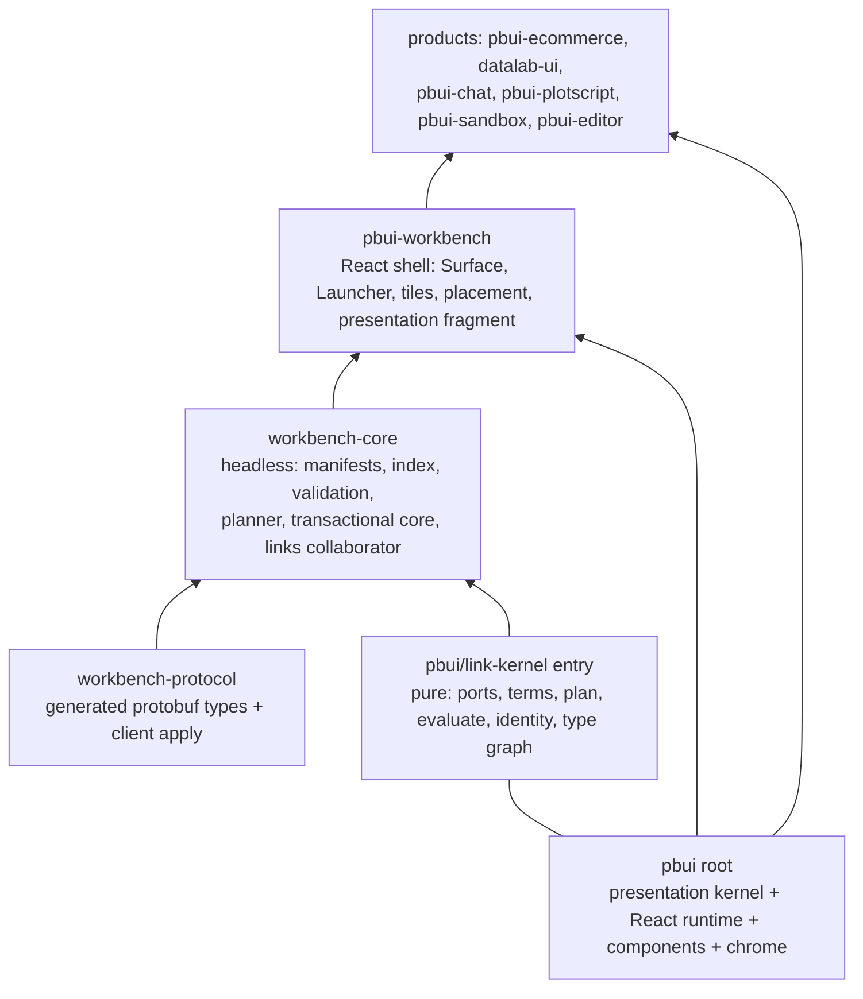
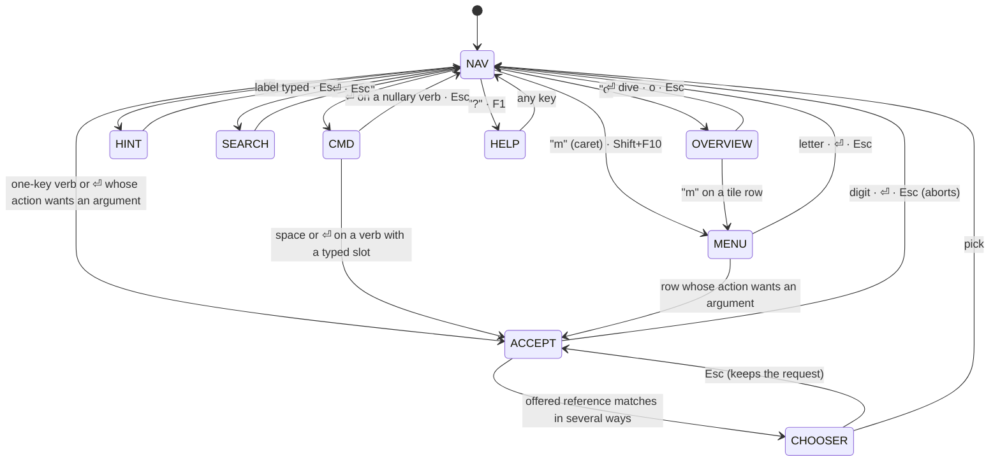

# pbui handheld port: analysis, design and implementation guide

> Ticket `PBUI-HANDHELD-1`. Written 2026-09-04 against pbui `0.12.0` on branch `task/consolidate-pbui-kernel`, the PBUI/HB prototype v0.3 (`sources/pbui-handheld.jsx`), and the ESP32-P4 PicoCalc firmware tree at `/home/manuel/workspaces/2025-12-21/echo-base-documentation/esp32-s3-m5` (projects 0099, 0101, 0102 and the shared `components/`).

## 0. How to read this guide

This document is written for an engineer who is new to pbui, new to the handheld prototype, and possibly new to ESP-IDF. It is long on purpose: the port touches three code bases that were written by different people at different times, and the point of the guide is that you should not have to reconstruct any of them from scratch.

Read it in this order:

1. §1 and §2 tell you what the project is and what "conceptual port" means here.
2. §3 tells you what the target hardware is and which firmware pieces already exist and are measured. Nothing in §3 is speculative; every number is from a diary or a README in the ESP32 tree.
3. §4 is the pbui tour: the compiled presentation, the four sibling engines, the React runtime, and workbench-core. If you already know pbui, skim §4.6 (the pure/pointer-bound split) and move on.
4. §5 is the handheld prototype tour: what PBUI/HB does with a keyboard and how each of its mechanisms maps to a pbui concept.
5. §6 is the gap analysis: what pbui lacks that the handheld needs (a catalog, a line model, a keyboard shell) and what the handheld lacks that pbui has (a real resolver, acceptance, refusal, help, relations).
6. §7 is the design. It contains the decision records. If you disagree with a decision, argue with the record, not with the prose around it.
7. §8 is pseudocode for every key flow; §9 is the phased plan with file names; §10 is how to test; §11 lists risks and open questions; §12 is the file reference.

Conventions: `pbui` (lower case) is the library in this repository. `PBUI/HB` is the handheld prototype in `sources/`. `pbui-handheld` is the new package this guide proposes. "The device" is the ESP32-P4 PicoCalc. File paths in this repository are relative to the repository root; file paths in the ESP32 tree are given in full the first time and shortened afterwards.

## 1. Executive summary

pbui is a domain-neutral presentation library: everything on screen is a typed reference `{ type, value }`, and one compiled declaration (types, scopes, predicates, descriptors, action rules, relations, help rules) decides what each reference can do. Since PBUI-KERNEL-1 the semantic core is pure TypeScript with no React at runtime: `presentation.actions.resolve`, `presentation.accept`, `presentation.help`, the relation system, the link kernel, and `workbench-core`'s command planner are all data-in, data-out functions. Only `createPbui.tsx` (1,392 lines) and the component packages are React. That split is the reason a port to an embedded device is a *conceptual* port rather than a rewrite: the engines can travel, and what has to be rebuilt is the shell that turns a pointer-free keyboard into queries against those engines.

PBUI/HB, the handheld prototype imported into `sources/`, is that shell, already designed and validated in a browser simulator. It replaces hover, click, right-click and drag with four pointing engines (a presentation caret, hint labels, typed cycling, label search), a REPL whose verb completion is scanned off the visible objects, an accept slot that lights typed targets and understands pronouns, a reference tray, and tiles-as-objects in a deck. Its data model is a small hand-rolled version of pbui's: `labelFor` is a descriptor, `CMDS[name].types` is an action rule's subject, `availCmds` is a resolve over visible types, `enterAccept` is an `AcceptRequest`, and `hist` is a presentation history. The prototype is 1,133 lines of JSX whose interaction core is a pure reducer `handleKey(state, key) → state`.

The target is the ESP32-P4 PicoCalc: a 400 MHz dual-core RISC-V with 768 KB internal SRAM and 32 MB PSRAM, a 320×320 RGB565 LCD on SPI at a measured 80 MHz, and a full keyboard read over I2C from an STM32 southbridge. The ESP32 tree already provides proven components for every hardware surface the port needs: `picocalc_lcd` (row blits at roughly 546 rows/s for 8×16 rows), `picocalc_keyboard` (FIFO polling, key codes for arrows, Tab, Esc, F1–F10, Home/End/PgUp/PgDn), `qjs_service` (native QuickJS behind an owner task, 6 ms runtime init, a 100k-iteration loop in 133 ms, a 1,000 ms interrupt deadline), and `visual_repl` (a 40×20 text-cell renderer with styled rows and a text dump for tests). Project 0102 already runs a JavaScript "PicoOS" with a supervisor, app registry, key tokens and a frame loop on that base.

The design recommendation is:

1. **Run the real pbui engines on the device as JavaScript inside QuickJS**, not as a C rewrite. The kernel is already React-free and ES2020-compatible; the cost of a C port is a second implementation of a resolver with a permutation-tested precedence ladder, and the measured QuickJS speed makes a per-keystroke resolve affordable. A C port of hot paths remains an option after profiling (§7.3, Decision 1).
2. **Build a new pure package in this repository, `packages/pbui-handheld`**, that contains the keyboard shell as a reducer over pbui's engines: modes, caret, hints, REPL, accept slot, tray, decks, doc line, and the *line model* (the row intermediate representation the prototype uses). It has two hosts: a browser harness (the prototype's React rendering, kept for development) and the device (§7.2).
3. **Add the two things pbui lacks and the handheld needs**: a *catalog* (enumerate live references of a type, the completion universe for an accept slot) and a *screen index* (which references are visible, in reading order, so the REPL can scan the screen). Both are product-provided data the shell consumes; neither changes the kernel (§7.5).
4. **Use `workbench-core` as the deck engine**: a workspace is a document with a tree, a card is a leaf, and `newtile`/`close`/`switch` are `view.show`, `placement.close` and `session.activatePlacement`. The handheld renders one leaf full-screen and lets the tree exist for later two-pane use (§7.7, Decision 5).
5. **Add a firmware project `0104-esp32-p4-pbui-handheld`** in the ESP32 tree that reuses `picocalc_lcd`, `picocalc_keyboard`, `qjs_service`, and a generalised row renderer; the shell bundle is embedded as a text file and installed into the QuickJS context at boot. The C side owns tasks, I/O, timers and pixels; the JS side owns everything the user can name (§7.10).

The plan is nine phases. Phases 0–3 happen entirely in this repository and end with the shell running against the real kernel in a browser and under desktop `qjs`. Phases 4–7 bring it up on the device. Phase 8 replaces the simulated "grace-period" world with a first real product. The most important early validation is Phase 2's headless conformance run: the shell reducer and the kernel executing the prototype's key scripts under `qjs` and producing byte-identical screen dumps to the browser harness.

## 2. Problem statement and scope

### 2.1 The problem

pbui's interaction model is pointer-first. `Presentation` is a focusable `role="button"` whose left click runs the activation ladder (`src/presentation/interaction/activation.ts`), whose right click opens `ObjectMenu`, whose hover after 350 ms opens contextual help, and whose drag (in the workbench) moves tiles and wires ports. The workbench shell adds three chords (`Mod+K` launcher, `Mod+Shift+K` rebalance, `Mod+Shift+L` link mode; `src/chrome/shortcutRouting.ts:56-61`). Keyboard support exists but is *accessibility keyboard support*: Tab to a presentation, Enter to activate, Shift+F10 for the menu, arrows inside the menu. It assumes a large screen, a DOM, and a pointer somewhere in the room.

The device has none of that. It has a 320×320 panel, a thumb keyboard with arrows, and no pointing device. The question the ticket asks is: which parts of pbui are the *idea* (typed presentations, type-directed actions, accept, help, relations, decks of tiles) and can be carried across, and what has to be designed fresh because it was never separable from the pointer?

### 2.2 What "conceptual port" means here

It does **not** mean compiling `@hyperslop-systems/pbui` for a microcontroller and rendering React on an LCD. It means:

- Preserving the **semantic contracts**: one compiled declaration, closed type world, the precedence ladder, four-state availability, fresh revalidation before perform, typed acceptance with explicit ambiguity, additive help, exposure-gated relations. These are the invariants listed in PBUI-KERNEL-1 §5 and they are what makes pbui pbui.
- Preserving the **command boundary** of the workbench: `WorkbenchCommand` as data, `execute` as the one gateway, session as two pointers.
- **Replacing the shell**: everything in `createPbui.tsx` and `pbui-workbench` that is a DOM event handler becomes a key-driven reducer over the same engines.
- **Adding what a keyboard needs and a pointer never did**: an enumeration of instances (catalog), a reading-order index of what is on screen, presentation histories for defaults, and a textual line model as the render target.

### 2.3 Goals

1. An intern can read this guide and know which pbui files to read, in which order, and what each engine's contract is.
2. A pure package `pbui-handheld` exists in this repository with the keyboard shell as a tested reducer that consumes the real kernel.
3. The same shell runs in a browser harness and under desktop `qjs` with identical output for identical key scripts.
4. A firmware project runs that shell on the PicoCalc with the simulated grace-period world, at interactive latency (target: caret move visible within 50 ms, REPL accept lighting within 100 ms).
5. The path to a real product (files on the SD card, a process monitor, the PicoOS app registry as tiles) is documented as Phase 8.

### 2.4 Non-goals for the first delivery

- Porting the link kernel's *interaction* (connect mode, wire layer, port rails). The link kernel itself is pure and travels for free, but the keyboard grammar for wiring (multi-argument commands) is an open question inherited from the prototype (§11.3).
- Rebalance, geometry measurement, persistence to a server, the sync outbox.
- Contextual help *rendering* beyond markdown-to-lines. The help kernel is used for the doc line and for a `?` overlay; renderer registries are not ported.
- Proportional fonts, Unicode shaping, themes beyond one palette.
- Wi-Fi, HTTP, or any networking on the device.

## 3. The target: hardware and the firmware that already exists

Everything in this section is taken from the ESP32 tree and its docmgr tickets. The tickets are listed in §12.2; the two you must read first are the visual QuickJS REPL guide and the native QuickJS guide.

### 3.1 The chip and the board

The ESP32-P4 (`ESP32-P4NRW32` on the Waveshare ESP32-P4-WIFI6 board) is a dual-core 32-bit RISC-V at up to 400 MHz with an FPU, 768 KB of internal HP SRAM ("L2MEM"), and 32 MB of stacked PSRAM configured as hex PSRAM at 200 MHz with `CONFIG_SPIRAM_USE_MALLOC=y` (`0099-esp32-p4-picocalc-display-keyboard/sdkconfig.defaults`). The console is the CH343 USB-UART bridge on UART0 (GPIO37/38), not USB Serial/JTAG. Flash is configured as 32 MB DIO at 80 MHz in the same defaults file; the earlier QuickJS-WASM guide describes the package as 16 MB flash, so treat the exact flash size as something to confirm from `esptool` output before sizing partitions (§11.7).

The two memory facts that shape the design:

| Fact | Consequence for the port |
|---|---|
| 768 KB internal SRAM, of which DMA-capable buffers must come | LCD row buffers stay small and internal (a 320×16×2 = 10,240 byte row; two of them for queued transfer). The QuickJS heap does **not** live here. |
| 32 MB PSRAM reachable through `malloc` | The QuickJS runtime, the shell state, the world, and the scrollback all live in PSRAM. The existing `qjs_service` default memory limit is 2 MiB; the handheld shell should raise it (§7.10) but has two orders of magnitude of headroom. |

### 3.2 The display path

The PicoCalc LCD is a 320×320 RGB565 panel (ST7365P controller, ILI9488-compatible) driven over `SPI2_HOST` with GPIO-controlled DC. The validated constants are in `0099/main/app_main.c:41-57` and in `components/picocalc_lcd`:

```c
#define LCD_PIN_SCK 3      // Pico GP10
#define LCD_PIN_MOSI 2     // Pico GP11
#define LCD_PIN_CS 7       // Pico GP13
#define LCD_PIN_DC 24      // Pico GP14
#define LCD_PIN_RST 25     // Pico GP15
#define LCD_DEFAULT_SPI_HZ        (80 * 1000 * 1000)
#define LCD_SPI_CLK_SRC           SPI_CLK_SRC_SPLL   // without SPLL the P4 caps SCLK at 20 MHz
#define LCD_SPI_MAX_TRANSFER_SZ   (32 * 1024)
```

Measured throughput (from the SPI optimisation guide's benchmark table and the 0099 README):

| Operation | Measured |
|---|---:|
| Full-screen fill, 32 KiB DMA chunks | 21 ms |
| Full-screen pattern | 33 ms |
| `lcd rowbench 16 200` (one 16-px text row repaint) | 546 rows/s, about 1.8 ms/row |
| `lcd textbench 8 16 20` (whole 40×20 pseudo-text screen) | 21 screens/s, 46 ms/screen |
| `lcd cellbench 8 16 1000` (one 8×16 cell) | 1,206 cells/s |
| `lcd scrollbench 16 20` (scroll-style redraw of 20 rows) | 27 scrolls/s |

The consequence: a keystroke that dirties one or two rows repaints in under 5 ms; a full-screen change (flip a card, open a menu overlay) costs about 45 ms. That is the budget the shell's dirty-row tracking has to respect (§7.8).

The reusable API is `components/picocalc_lcd/include/picocalc_lcd.h`:

```c
esp_err_t picocalc_lcd_init(void);
esp_err_t picocalc_lcd_fill(uint16_t rgb565);
esp_err_t picocalc_lcd_fill_rect(uint16_t x, uint16_t y, uint16_t w, uint16_t h, uint16_t rgb565);
esp_err_t picocalc_lcd_blit_rect(uint16_t x, uint16_t y, uint16_t w, uint16_t h, const uint16_t *pixels, size_t pixel_count);
esp_err_t picocalc_lcd_blit_row(uint16_t y, uint16_t h, const uint16_t *pixels, size_t pixel_count);
int picocalc_lcd_actual_khz(void);
```

The display-server ticket (ESP32-P4-DISPLAY-SERVER) designs a queue-owning task with dirty-region coalescing and queued SPI transfers behind a strict rule: *no code outside the display server may set the LCD window, toggle DC, or reuse an in-flight DMA buffer*. That server does not exist yet as a component; the visual REPL's renderer calls `picocalc_lcd_blit_row` synchronously from its UI task, which is the approach this guide also starts from (Decision 8).

### 3.3 The keyboard path

The PicoCalc keyboard is an STM32 southbridge at I2C address `0x1F` on GPIO50 (SDA) and GPIO49 (SCL), polled at 10 kHz (`components/picocalc_keyboard/include/picocalc_keyboard.h`). The driver reads status register `0x04` (low five bits = FIFO count; `0x20` caps lock; `0x40` num lock) and pops two-byte events from FIFO register `0x09`:

```c
typedef struct { uint8_t state; uint8_t key; bool valid; } picocalc_key_event_t;
// state: 1 pressed, 2 repeated, 3 released
esp_err_t picocalc_keyboard_poll_event(picocalc_key_event_t *event);
```

The key codes the driver names (`picocalc_keyboard.c:180-250`) are the ones the shell's key table must map:

| Code | Key | Code | Key |
|---|---|---|---|
| `0x08` | backspace | `0xb1` | esc |
| `0x09` | tab | `0xb4 0xb5 0xb6 0xb7` | left up down right |
| `0x0a` | enter | `0xc1` | capslock |
| `0x81`–`0x89`, `0x90` | F1–F10 | `0xd0` | break (Shift+Esc) |
| `0x91` | power | `0xd1` | insert |
| `0xa1` | lalt | `0xd2` | home |
| `0xa2` `0xa3` | lshift rshift | `0xd4` | delete |
| `0xa4` | sym | `0xd5` | end |
| `0xa5` | lctrl | `0xd6` `0xd7` | pageup pagedown |
| `0x20`–`0x7e` | printable ASCII (already shifted by the STM32) | | |

Two properties matter for the shell. First, the southbridge emits *repeat* events, so held-key quasimodes (the prototype's hold-`i` peek) are implementable: press = enter peek, released = leave peek. Second, printable characters arrive already composed with Shift/Sym, so `:` `;` `/` `?` `<` `>` `$` arrive as ASCII and the shell does not need a modifier state machine for them. Modifier keys arrive as their own codes and are simply ignored unless a chord is wanted.

The same I2C bus carries the backlight register (`0x05`, 0–255) and the battery register (`0x0B`); the power-off register is `0x0E`. These are documented in the backlight and power tickets and are out of scope here, but they share the bus with the keyboard, so keyboard polling and any later backlight writes must be serialised on one task.

### 3.4 JavaScript on the device: `qjs_service`

Project 0101 compiles upstream QuickJS natively into ESP-IDF (`components/quickjs_native`, the minimal source set `quickjs.c cutils.c dtoa.c libregexp.c libunicode.c`) and wraps it in an owner-task service (`components/qjs_service`). The public API (`qjs_service.h`) is:

```c
typedef struct {
  const char* task_name; uint32_t task_stack_words; uint32_t task_priority; int32_t task_core_id;
  uint32_t queue_len; size_t memory_limit_bytes /* default 2 MiB */; size_t stack_limit_bytes /* 64 KiB */; bool can_block;
} qjs_service_config_t;
esp_err_t qjs_service_start(const qjs_service_config_t*, qjs_service_t**);
esp_err_t qjs_service_eval(qjs_service_t*, const char* code, size_t len, uint32_t timeout_ms, const char* filename, qjs_eval_result_t* out);
esp_err_t qjs_service_run (qjs_service_t*, const qjs_job_t* job);   // synchronous job on the owner task with a JSContext*
esp_err_t qjs_service_post(qjs_service_t*, const qjs_job_t* job);   // asynchronous job
esp_err_t qjs_service_reset(qjs_service_t*, uint32_t timeout_ms);
esp_err_t qjs_service_get_status(qjs_service_t*, qjs_service_status_t*, uint32_t timeout_ms);
```

Only the owner task touches `JSRuntime*`/`JSContext*`; every other task submits work. The design rule that carries into this port: **the shell's JavaScript runs as jobs on the owner task; the keyboard task and the renderer never hold a `JSContext*`.**

Measured on the device (native QuickJS guide, §current-state and diary Step 6):

| Operation | Measured |
|---|---:|
| Runtime + context init | 6 ms |
| `print(1+2)` eval | 2 ms |
| 10k integer loop | 13 ms |
| 100k integer loop | 133 ms |
| `fib(20)` | 32 ms |
| `while(true){}` | interrupted at about 1,000 ms (`InternalError: interrupted`) |
| Owner-task stack that survives `fib(20)` | 32 KiB (12 KiB overflowed) |

Two engineering lessons from those diaries apply directly: top-level `let` in repeated evals collides (wrap bundles in an IIFE), and `JS_SetMaxStackSize` must be a real limit on native QuickJS, not the WASM-era zero.

### 3.5 The visual REPL and PicoOS (project 0102)

Project 0102 is the closest existing thing to what this guide proposes, and its components are the ones to reuse:

- `components/visual_repl` — a fixed-cell renderer: `VISUAL_REPL_COLS 40`, `VISUAL_REPL_ROWS 20`, `CELL_W 8`, `CELL_H 16`, 80 history rows, a 160-character input line, six row styles (system, prompt, input, output, error, status), `visual_repl_render()` for a full repaint, `visual_repl_render_input()` for the input row, and `visual_repl_dump_text()` which returns the screen as text so a test can assert on it without a camera.
- `components/picojs_runtime` — installs a JavaScript app surface into a `JSContext` (`picojs_runtime_install`), drives it with `picojs_runtime_frame_js(ctx, rt, dt_ms)` and `picojs_runtime_key_js(ctx, rt, "up")`, exposes panel widgets (`spark`, `table`, `menu`, `list`, `grid`) and `row`/`col` layouts to JS, and dumps the screen as text.
- `components/picoos_core` — a supervisor with surfaces `LAUNCHER / APP / REPL / SWITCHER / CRASH`, up to 12 registered apps with `autostart`, `preferred_fps`, background ticks, `picoos_key(os, "token")`, `picoos_frame(os, dt_ms)`, and `picoos_launch(os, id)`.
- `0102/js/lib/*.js` — a portable JS layer: a cell screen (`makeScreen(cols, rows)`, cells with `ch/fg/bold/dim`), a simulated OS, and a fluent TUI runtime with apps, panels, focusable menus/tables, key bindings (`app.key("↑↓", fn)`), timers and `renderText()`.
- `0102/main/app_main.cpp` — the wiring: keyboard poll → token (`app_main.cpp:657-668`: `backspace left up down right enter escape home delete end`) → either the REPL editor or `picoos_key`; `/launch /apps /ps /reset /kbd /key TOKEN /frame` slash-commands on the REPL for testing.

What this means for the port: the device already has a text-cell screen model, a key-token bus, a JS app runtime, and slash-command test injection. PicoOS is *not* presentation-based (its apps draw panels; nothing on its screen is a typed reference), but its supervisor, key tokens and frame loop are exactly the host plumbing the pbui shell needs, and its apps are the obvious first "real" objects (`<app>`, `<process>`) once the simulated world is replaced (Phase 8).

### 3.6 Existing peripherals, for orientation only

The tickets for power (STM32 registers `0x0B` battery, `0x0E` power-off), sleep/wake (light and deep sleep, RTC), audio (ES8311 over I2S; PicoCalc PWM speakers), SD card (SDMMC on the Waveshare slot; SPI on the PicoCalc slot), and backlight (STM32 register `0x05`) all exist as design docs with implementation plans against 0099. None is required for the handheld shell. The SD card is the first one a real product will want (files as `<file>` presentations), and the backlight and battery become obvious `<device>` presentations with `dim`/`brighten` verbs once a status bar exists.

## 4. pbui as it stands: the architecture you are porting

This section is the pbui tour. Every claim has a file behind it. The repository is a pnpm workspace; the packages and their layering are enforced by tests in `src/architecture/` (`packageGraph.test.ts`, `rootLayers.test.ts`), so the layer picture below is not a drawing but a checked invariant.

### 4.1 Packages and layers



- `@hyperslop-systems/pbui` (`src/`, version 0.12.0) exports the presentation kernel (`src/presentation/`), the surfaces/escape stack (`src/surfaces.ts`), focus return (`src/focus.ts`), the chrome (`src/chrome/`: launcher shell, tile frame, shortcut routing), the component library (`src/components/`), and visualization helpers. `src/index.ts` also assembles the stylesheet; that whole concern disappears on the device.
- `@hyperslop-systems/pbui/link-kernel` (`src/link-kernel.ts`) is the React-free entry: `src/presentation/links/*` plus the type graph and id types. It exists precisely so `workbench-core` can depend on pbui semantics without React; a `pnpm boundary` check installs the core alone and asserts React is absent (`packages/workbench-core/README.md`, "Package boundary").
- `@hyperslop-systems/workbench-core` (`packages/workbench-core/src`, 6,564 non-test lines, 215 test cases) is the headless workbench engine. "No React, no DOM: a browser shell, an agent, a test, a worker, and a server-side tool all cross the same command boundary" (`README.md`).
- `@hyperslop-systems/workbench-protocol` is generated from `proto/hyperslop/pbui/workbench/v1/workbench.proto`: `WorkbenchDocument { workspaces[], views, view_order }`, `Workspace { id, name, tree: Node }`, `Node = Leaf { view_id } | Split { direction, ratio, a, b }`, `AppView { id, app_id, documents, title }`, and the `Mutation` oneof (`ViewCreate`, `PlacementSplit`, `PlacementClose`, `SplitResize`, `WorkspaceSetTree`, …). `client/apply.ts` applies mutations to a document.
- `@hyperslop-systems/pbui-workbench` is the React shell over the core: `createWorkbenchShell.tsx`, `Surface`, `Tile`, `SplitPane`, `Launcher`, `WorkspaceStrip`, `PortRail`, `WireLayer`, placement mode, and `createWorkbenchPresentationFragment` (the fragment products include to get `<tile>`, `<port>`, `<link>` types and their rules).

The port needs the first three (kernel, link-kernel, core) and reimplements the fourth (shell). Products above the shell are the model for what a device product declaration looks like (§4.7).

### 4.2 The compiled presentation: one declaration, four sibling engines

Since PBUI-KERNEL-1 a product declares its presentation semantics once and compiles them:

```ts
// src/presentation/model/define.ts
const p = definePresentation<Values, Environment, Facts, Verb>();
export const presentation = p.create({
  id, types, knownScopes, defaultActiveScopes, predicates, descriptors,
  actions, relations, help, revision: (facts) => facts.revision, include: [fragments...],
});
```

`compilePresentation` (`src/presentation/model/compile.ts`) merges the root and its included fragments with origin tracking, throws on any structural error (duplicate ids across fragments, a descriptor for an undeclared type, a relation with no exposure, a missing descriptor when `strictDescriptors` is on), and constructs the shared assets and the sibling interpreters. The result, `CompiledPresentation` (`src/presentation/model/types.ts:141-177`), is the object every host uses:

| Member | What it is | Where |
|---|---|---|
| `graph` | The closed, acyclic runtime type graph: `has`, `isSubtype`, `distance`, `ancestors`, `types` | `actions/typeGraph.ts` |
| `knownScopes`, `defaultActiveScopes` | Scope vocabulary and the default inner-to-outer stack | `model/compile.ts` |
| `predicates` | Named product predicates, the only condition nodes that read facts | `context/predicates.ts`, `actions/conditions.ts` |
| `descriptors` | Per-type `label(value, env)`, optional `describe`, `tone` | `registry.ts`, `types.ts:31-36` |
| `actions` | The action registry: `resolve(query, snapshot)`, `explain`, `listReachable`, `vocabulary` | `actions/registry.ts`, `actions/resolve.ts` |
| `relations` | Typed partial functions between references, with exposure | `relations/system.ts` |
| `help` | Additive help rules (nullable) | `help/registry.ts`, `help/resolve.ts` |
| `snapshot(input)` | Validate and materialise one runtime context | `model/compile.ts` |
| `accept(request, reference, snapshot)` | Typed acceptance through subtyping then relations | `acceptance/resolve.ts` |
| `linkDeps(options)` | Project the model onto the link kernel's needs | `model/compile.ts` |
| `vocabulary()`, `diagnostics()`, `originOf()` | Static, JSON-serialisable introspection | `model/vocabulary.ts` |

The runtime context is one explicit shape (`PresentationContextInput`, `model/types.ts:86-92`): `{ facts, revision?, activeScopes?, modes?, capabilities? }`. `snapshot` turns it into a `SelectionSnapshot` (`actions/types.ts:41-52`): `{ revision, scopes (inner→outer), modes, capabilities, product }`. The revision is a semantic token, "drift telemetry, not authorization".

### 4.3 The shared selector and the type graph

All three contextual interpreters (actions, help, relations) share one front half, `matchSelector` (`src/presentation/context/selector.ts`). A selector is a subject (one declared type with `exact` or `subtypes` reach, or the explicit `anyDeclaredType`), zero or more eligible scopes, an optional condition, and a priority. Matching runs type → scope → condition and returns *provenance*, not a boolean:

```ts
interface SelectorMatch { declaredType; concreteType; typeDistance; scope; scopeIndex; priority }
```

Two rules are load-bearing for the port. The type world is **closed**: `matchSelector` throws if the reference's type is not in the graph (`selector.ts:107-112`), so on the device every `<file>`, `<card>`, `<app>` must be declared before it is presented. And subtyping is **substitutability, not conversion**: a rule declared on abstract `inspectable` receives the original `{ type: "order", value }` reference; nothing coerces payloads (`actions/typeGraph.ts` header comment).

The condition algebra is deliberately four operations (`actions/conditions.ts:22-27`): `all`, `mode`, `capability`, `predicate`. `all` short-circuits to the first non-available child so a user sees one actionable reason. Unknown predicate ids throw; nothing defaults to available.

### 4.4 The action engine: resolve, availability, perform

An `ActionQuery` (`actions/types.ts:29-37`) is `{ subject, invocation, gesture? }` where invocation is `"menu" | "primary" | "agent" | "introspection" | "accept"`. Contributions are exact rules, inherited rules, or families (`actions/types.ts:119-215`); each has an `action` id, a selector, optional `invocations`, `when`, `test`, `metadata { label, description, group, order, danger, primary }`, `priority`, and a pure `bind(context) → Verb`.

`resolveActions` (`actions/resolve.ts`) is the engine you will call on every keystroke that needs verbs. Its contract, from the header comment:

> One call, one query, one snapshot, one deterministic result. The precedence ladder within one action id is: smallest type distance → nearest active scope → highest explicit priority → AMBIGUITY RETURNED AS DATA, nothing selected. Registration order, import order, array order, labels, and menu order are never tie-breakers — a permutation test enforces it.

Availability has four states (`actions/availability.ts`): `available`, `unavailable { because }` (shown disabled with a reason), `inapplicable` (leaves the competition, a generic fallback may win), `hidden` (stays in the competition and suppresses fallbacks without disclosure). The result (`ResolutionResult`) carries `actions[]` (each with `status`, `verb` if available, `provenance`, `primary`), `ambiguities[]`, and a `trace[]` emitted by the same branches that select.

Perform is *fresh revalidation* (`actions/perform.ts`): the host re-resolves the stale row's query against a fresh snapshot, and `evaluateFresh` proceeds only if the same candidate still wins and is available; otherwise it returns a refusal code (`action-no-longer-available`, `action-no-longer-resolves`, `action-became-ambiguous`, `action-implementation-changed`). `describeRefusal` (`interaction/refusal.ts`) turns a code into one sentence. In the React runtime this is `performAction` in `createPbui.tsx:576-616`; on the device it is the same eight lines in the shell's `perform` (§8.6).

### 4.5 Acceptance, the accept machine, and the activation ladder

An `AcceptRequest` (`types.ts:52-56`) is `{ types, prompt, filter? }`. `resolveAcceptance` (`acceptance/resolve.ts`) answers "may this reference satisfy that request?": directly, if the reference's type reaches a wanted type (subtyping preserves the reference); otherwise through acceptance-exposed relations whose codomain reaches a wanted type, reduced by nearest scope then highest priority, with a genuine tie returned as `{ kind: "ambiguous", options }`. "Ambiguity is a choice, never a guess."

The accept *flow* is a pure state machine (`interaction/accept.ts`): states `idle | pending{requestId, request} | choosing{…, options}`, events `request | offer | choose | escape | dismiss-chooser | abort`, effects `close-menu | settle | resolve-null`. Its invariants are fuzzed: at most one pending request, a chooser only under a pending request, exactly one terminal effect per request, Escape on the chooser keeps the request, Escape on pending aborts.

The click ladder is `activationOutcome` (`interaction/activation.ts`): `attempt-accept` if a pending request fits, else `activate-host` if the element carries an `activate`, else `perform-primary` if the kernel resolves exactly one available primary, else `open-menu`. Enter and Space on a focused `Presentation` run exactly this ladder (`createPbui.tsx`, `handleKeyDown`). This is the function the handheld's ⏎ becomes.

### 4.6 Relations, help, links, identity: the engines that travel unchanged

**Relations** (`relations/types.ts`, `relations/system.ts`) are named contextual partial functions `Reference<A> ⇀ Reference<B>` with an `exposure` that says which interpreter may *discover* them: `acceptance`, `facet`, or `derivation` (serialisable). Compositions are explicit named step sequences; no path is inferred. The system offers `matches(reference, snapshot, { targets, exposedTo })`, `evaluate`, `apply`. On the device, relations are what make `pin ␣` accept a `<mem>` when the slot wanted a `<ctxseg>` (a `mem→ctxseg` relation exposed to acceptance) instead of the prototype's hard-coded `types: ["ctxseg","mem"]`.

**Help** (`help/types.ts`, `help/resolve.ts`) is additive: every matching rule contributes `HelpItem { id, kind, order, payload }`, and distance/scope/priority order the items but never suppress one. Items are rendered by a registry of renderers (React). On the device the shell renders `help.markdown` items as lines and uses help resolution for the `?` overlay and the peek; nothing else is needed.

**Links** (`links/*`, about 3,400 lines) are the port/binding kernel: `Binding` terms (`ambient | constant | follow | alias | derived | hold | unresolved`, `terms.ts:29-36`), `LinkSnapshot`, `evaluatePort`, `planLink`, `applyLinkVerb`, `badgeOf`, `checkBinding`, identity quotient. It is pure and it compiles into the device bundle for free, but its *user interface* (connect mode, wire layer, port rail) is pointer-native and is deferred (§11.3).

### 4.7 The React runtime: what `createPbui` actually does

`createPbui` (`src/presentation/createPbui.tsx`) takes `{ presentation, defaultEnvironment, contextFor, renderMenuHeader?, helpRenderers? }` and returns a `PbuiInstance` with `Provider`, `Presentation`, `ObjectMenu`, `ContextHelp`, `RefusalNotice`, and hooks. The `Provider` (`createPbui.tsx:378`) owns:

- the accept machine state and its promise map (a product calls `pbui.accept(request)` and awaits a reference or null);
- the menu state `{ reference, x, y, returnFocus }`;
- the help surface machine and its 350 ms hover timer;
- the refusal state and `onRefuse`;
- `mouseDoc` (the Genera-style pointer documentation string);
- `resolve(query)`, `explain(query)`, `perform(verb)`, `performAction(stale)`.

`Presentation` (`createPbui.tsx:642`) renders a `span|div|g` with `data-ptype`, `role="button"`, `tabIndex 0`, and handlers for click (activation ladder), context menu (open menu at pointer), Enter/Space (ladder), ContextMenu/Shift+F10 (menu at the element), hover/focus (help). `ObjectMenu` (`createPbui.tsx:943`) re-resolves `{ subject, invocation: "menu" }` on every render, roves focus with ArrowUp/ArrowDown, and closes on Escape only when it owns the escape surface (`src/surfaces.ts`).

Everything in this list is *policy over engines plus DOM plumbing*. The policy (ladder, accept machine, fresh perform, refusal) already lives in pure modules because KERNEL-4 extracted it. The DOM plumbing (event handlers, focus return, positioning, timers) is what the handheld shell replaces with key handling and a line model.

### 4.8 workbench-core: the deck engine

The core owns one immutable observable state `{ document, session, index, revision }` (`createWorkbenchCore.ts:29-34`), where `session` is exactly two pointers, `{ workspaceId, activePlacementId }` (`session.ts:9-14`), repaired after every install so no observer sees a dangling pointer. Commands are data (`commands.ts:46-70`):

```ts
type WorkbenchCommand =
  | { kind: "placement.duplicate"; placementId; axis? }
  | { kind: "placement.close"; placementId }
  | { kind: "placement.swap" | "placement.dock" | "placement.replaceWith" | "placement.resize"; ... }
  | { kind: "view.show"; view: ViewRequest; placement: PlacementRequest }
  | { kind: "view.configure"; viewId; title?; documents? }
  | { kind: "workspace.create" | "workspace.rename" | "workspace.delete" | "workspace.clone" | "workspace.rebalance"; ... }
  | { kind: "session.selectWorkspace"; workspaceId }
  | { kind: "session.activatePlacement"; placementId | null }
  | WorkbenchLinkCommand;
```

`execute(command)` plans against the captured state, confirms the revision, applies the mutation batch, validates, maintains links, installs once and runs effects; `preview` is the pure half. App manifests (`apps.ts`) declare `viewCardinality`, `duplicatePlacement`, bindings and launch policy. `describeWorkbench` (`describe.ts`) is "the workbench as a small object an agent can read", addressed by the same ids the commands take. That function is the closest thing pbui already has to the prototype's principle that *the screen is a query result*, and it is the seed of the device's screen index (§7.5).

### 4.9 What is pure and what is pointer-bound: the split that defines the port

| Concern | Module | Runtime | Port verdict |
|---|---|---|---|
| Type graph, selector, conditions, predicates | `actions/typeGraph.ts`, `context/*`, `actions/conditions.ts` | pure | travels |
| Action resolve, availability, explain, fresh perform | `actions/resolve.ts`, `availability.ts`, `perform.ts`, `interaction/explain.ts` | pure | travels |
| Acceptance resolve, accept machine, activation ladder, refusal text | `acceptance/*`, `interaction/*` | pure | travels |
| Relations, help resolve | `relations/*`, `help/{resolve,registry,machine}.ts` | pure | travels (help *machine* is hover-timer policy; replace) |
| Link kernel, identity | `links/*` | pure | travels, UI deferred |
| Compiled model, vocabulary, diagnostics | `model/*` | pure | travels |
| Descriptors' `label` returning `ReactNode` | `types.ts:31-36`, `registry.ts` | type-only React | constrain to `string` on the device (Decision 3) |
| Action `metadata.label` as a function returning `ReactNode` | `actions/types.ts:98-101` | type-only React | same constraint |
| Provider state, `Presentation`, `ObjectMenu`, `ContextHelp`, `RefusalNotice` | `createPbui.tsx` | React + DOM | rewrite as the keyboard shell |
| Surfaces (escape stack), focus return | `surfaces.ts`, `focus.ts` | DOM | rewrite as the mode stack and the caret |
| Shortcut routing, launcher shell, tile frame, drag | `chrome/*` | DOM | replaced by the key table, the deck, the overview |
| Components, CSS, tokens | `components/*`, `*.css` | React + DOM | replaced by the line model and one palette |
| Workbench document, commands, planner, session, validation | `workbench-core` | pure | travels |
| Rebalance, persistence, sync | `workbench-core/{rebalance,persistence,sync}` | pure but heavy | not bundled |
| Surface, Tile, SplitPane, Launcher, PortRail, WireLayer, placement mode, geometry | `pbui-workbench` | React + DOM | replaced by decks, overview, `newtile/close/switch` |

The pure column is roughly 8,000 lines of TypeScript with 166 test cases in `src/presentation` and 215 in `workbench-core`. That test corpus is an asset of the port: it runs unchanged against the bundle under `qjs` (§10.2).

### 4.10 A product declaration, for reference

`packages/pbui-ecommerce/src/presentation/{runtime.tsx,actions.ts}` is the smallest complete example. Types are declared with an abstract root (`{ id: "inspectable", abstract: true }`, `{ id: "order", parents: ["inspectable"] }`, …), the product includes the workbench fragment for `<tile>`/`<port>`/`<link>`, declares its scope stack `["shop", ...workbenchScopes, "global"]`, a `revision(facts)` that combines the host revision with the link document and runtime revisions, and a `contextFor(query, environment)` that projects host state into facts. The device product (§7.9) follows this shape exactly; the only difference is that its environment is a world folded from a timeline instead of a host object.

## 5. The handheld prototype (PBUI/HB): what it does and what it is made of

The three imported sources are the interaction specification for this port. The project report explains the design; the manual is the user-facing contract; the JSX is the reference implementation. This section summarises them from the point of view of someone who has to reproduce them over pbui's engines, and it names, for every prototype mechanism, the pbui concept it corresponds to.

### 5.1 The organising principle

From the project report §2: "The screen is a query result, not a picture. Every visible presentation is addressable by type, by label, by recency, and by position-in-reading-order. Keyboard interaction is choosing which of those four address spaces to use." A pointer only has the fourth address space. Three of the four extend to objects that are not on screen.

The manual's contract (§0): "The bottom line never lies." Row 31 always names the mode and what the keys do; "a patient person can learn this whole device by only ever pressing what row 31 suggests."

### 5.2 The screen

53 columns × 32 rows at a 6×10 cell (`COLS = 53`, `CONTENT_ROWS = 28`, `pbui-handheld.jsx:40`): row 0 status bar, row 1 title row with workspace ▸ tile ▸ breadcrumb and `card n/m`, rows 2–29 the work surface, row 30 the tray strip, row 31 the doc line. The device's existing renderer is 40 × 20 at 8×16; §7.8 discusses the difference.

### 5.3 The object layer (three functions)

An object is `(pt, v)`. Three module-level pure functions make it a citizen (`jsx:221-314`):

- `labelFor(pt, v, S)` — the label used everywhere. **pbui:** `descriptors[type].label(value, environment)`.
- `catalog(types, S)` — every live object of those types in the world; the completion universe. **pbui: absent.** pbui resolves per subject and never enumerates instances. This is the first thing the port adds (§7.5).
- `describe(pt, v, S, st)` — the inspector as lines, and lines may carry `pres`, which is what makes drill-in compose. **pbui:** `descriptors[type].describe(value, env)` returns `unknown` for agents/inspectors; the shell needs a *line-producing* describe (§7.5).

Adding an object type means adding a case to those three plus glyph and tone entries; the report records that promoting `card` and `app` to object types in v0.3 immediately gave them hints, caret, yank, tray, menus and the accept slot. That is the pbui closed-type-world discipline, arrived at independently.

### 5.4 The world as a fold

`S = fold(cursor, overrides)` (`jsx:160-216`) replays an event timeline up to a cursor and applies user overrides (`skip`, `taskSet`, `memPin/memUnpin/memForget`, `ctxPin/ctxEvict`) in a fixed order so the invariant "pinned, unforgotten memories have exactly one window segment" holds at every cursor. Tiles render from `S` and own no data. **pbui:** this is the product's `facts` plus `revision`; `fold` is `contextFor`. Reverting is an override, never a timeline edit: that is the same discipline as pbui's verbs being data that a product reducer applies.

### 5.5 Commands as typed signatures

`CMDS` (`jsx:320-338`) maps a verb name to `{ types, doc, needsTray? }`. From that one table the prototype derives what lights up, the completion universe, whether the caret can be the implicit argument, whether a pronoun type-checks, and (via `availCmds`) whether the verb is offered at all. **pbui:** an action rule's `subject` + `match` is `types`; `metadata.label/description` is `doc`; `needsTray` is a `mode` or `capability` condition; and *availability* is the resolver's job, which is strictly richer (four states, scope, conditions, ambiguity) than a `types.some(visible)` test.

### 5.6 The line model

```js
const L = (segs, pres, bg) => ({ segs, pres, bg });   // a screen row
const T = (t, s) => ({ t, s });                        // a styled segment; s = named key | hex | style object
const FILL = { fill: true };                           // flexible spacer
```

A line with a `pres` **is** an object row: it participates in caret order, hint labelling, accept lighting, and menu targeting (`jsx:249-254`). `renderLine` (`jsx:958-1001`) draws the type tone bar, the caret fill, the pulsing outline and digit chip for lit targets, and the hint chip. **pbui:** no equivalent; the DOM is the line model. On the device the line model is the *contract between JS and C* (§7.11).

### 5.7 The modes and the reducer

`handleKey` is one `setSt(s0 => …)` callback (`jsx:657-901`) dispatching on `s.mode ∈ { nav, cmd, accept, search, hint, menu, overview, help }` plus the `scopeWait` (`;` then a type letter) and `peek` (hold `i`) flags. Every branch returns a new state. The report notes this was chosen for testability and that each iteration was verified headlessly by compiling with esbuild and driving the pure strata from Node with a React stub. That property is exactly what lets the shell run under `qjs`.

The NAV key table (manual §9.2): ↑↓ (j k) caret; ←→ ([ ]) cards; 1–9 jump to card; ⇥ next workspace; ⏎ default verb; ⌫ pop drill-in; `f` hints; `;`+letter type hop; `/` label search; `:` command line; `m` menu; `R P E` one-key verbs; `y x t` tray; `r` repeat; hold `i` peek; `o` overview; space/`,`/`.`/`<`/`>` transport; `?` help; Esc up one level.

### 5.8 The REPL and the accept slot

`availCmds(visibleTypes, trayLen)` (`jsx:343-351`) offers a verb when something visible can receive it; `card` and `app` are always treated as visible because the current tile is an object. Space after a verb (or a unique prefix) enters accept (`enterAccept`, `jsx:683-693`): the slot's default is computed by precedence (drop: caret-if-aboard else newest tray entry; caret if type-compatible; for `close`/`open` on a card slot, the current tile; else the last-touched object of a compatible type from `hist`). `acceptCands` (`jsx:694-709`) resolves `$n` against the tray with a type check, filters `catalog(types)` by label substring, sorts the last-touched first, and prepends the caret for `it`. Digits pick lit visible targets only while the buffer is empty (`jsx:768-773`), a gate found by user testing.

**pbui mapping:** `enterAccept` is `acceptDispatch({ type: "request", request: { types, prompt } })`; the lit test per row is `presentation.accept(request, row.pres, snapshot).kind !== "none"` (which also admits relation-mediated matches and surfaces ambiguity as a chooser); the completion universe is the added catalog; `hist` is a presentation history keyed by type; the default chain is shell policy. Selecting a candidate is `acceptDispatch({ type: "offer", reference, resolution })` followed by executing the `settle` effect, which runs the verb through fresh perform.

### 5.9 Noun-first: ⏎, menu, one-key verbs

`defaultVerb(pt)` (`jsx:420`) and `menuFor` (`jsx:421-449`) are hand-written per type. **pbui:** ⏎ is `activationOutcome` with `primary` = the unique available `primary: true` action from `resolve({ subject, invocation: "primary" })`; `m` is `resolve({ subject, invocation: "menu" })` rendered as rows with letter accelerators taken from `metadata`; `R/P/E` are shell key bindings to action ids (`hunk.revert`, `mem.pin`, `ctxseg.evict`) whose availability is checked by the same resolve.

### 5.10 The tray, decks, and the overview

The tray (`y`, `x`, `t`, `$n`) holds references, not copies; entries can dangle and renumber (`jsx:365-373, 386`). Decks: a workspace is an ordered list of cards; `←→` flip, `⇥` cycles workspaces, `o` opens an overview listing workspaces and cards with vitals; ⏎ on an object pushes an inspector card onto a back stack popped by ⌫. `newtile/close/switch` are ordinary typed commands over `<card>`/`<app>` (`jsx:387-416`); the only guard is refusing to close a workspace's last card. The module-level `SP` mirror (`jsx:464`) exists because `labelFor/catalog` need the live layout; the report flags it as prototype plumbing to replace with a threaded context.

**pbui mapping:** the tray is shell state (a list of references) with no kernel counterpart; decks are `workbench-core` documents where each card is a leaf (§7.7); the back stack is shell state; the `SP` mirror disappears because the world handed to `catalog` includes the core's `getState().document`.

### 5.11 What the prototype does not have

The report's open questions (§11) are the port's too: ports and wiring were not ported; multi-argument commands have no grammar; the availability scan may be too strict (`goto` is not offered without a visible `<step>`); hint-label stability is untested; `drop` collides with a task vocabulary; the manual should be a tile; scale beyond 29 events and 6 tiles is untested. Beyond those, the prototype has no fresh revalidation (a stale menu row runs whatever `runCmd` does now), no refusal channel, no four-state availability (a verb is offered or not), no scopes, no relations (type lists are hard-coded), no help kernel (the doc line is a per-type string table, `jsx:1025`), and no persistence. pbui supplies every one of these.

## 6. Gap analysis

Three columns: what the device needs, what pbui has, what PBUI/HB has. A gap is anything that has to be written.

| Need on the device | pbui today | PBUI/HB today | Gap |
|---|---|---|---|
| Typed references with a closed type world | `PresentationReference`, `graph` | `(pt, v)` with a switch per function | none; use pbui |
| Labels for every reference | descriptors (`label` may be `ReactNode`) | `labelFor` | constrain `label` to `string` in the device declaration |
| Verbs per reference with availability, scopes, conditions | `actions.resolve` | `CMDS.types`, `menuFor` | none; use pbui |
| A default verb for ⏎ | `primary: true` + `activationOutcome` | `defaultVerb(pt)` | none; declare primaries |
| Which verbs to *offer* in the REPL | `resolve` per subject | `availCmds(visibleTypes)` | **shell**: union of `resolve` over the visible references, keyed by action id |
| A completion universe for an argument slot | none | `catalog(types, S)` | **new contract**: product-provided `catalog` |
| Which references are on screen, in reading order | none (DOM order) | `presIdx` over lines | **shell**: the line model's `pres` rows |
| Typed acceptance, including through relations, with explicit ambiguity | `accept`, accept machine | `types.includes(pt)` | none; use pbui, add the chooser as a mode |
| Pronouns `$n`, `it`, recency defaults | none (the DOM click *is* the object) | `acceptCands`, `enterAccept`, `hist` | **shell**: tray, histories, default chain |
| Fresh revalidation and refusal | `evaluateFresh`, `describeRefusal` | none | none; use pbui, render refusals on the doc line |
| Help / doc line | help kernel; `mouseDoc` string | per-type string table | **shell**: doc line composed from resolve + help |
| Inspector as lines with nested live references | `describe(): unknown` | `describe()` → lines | **new contract**: line-producing `describe` |
| Workspaces, cards, `newtile/close/switch` | `workbench-core` commands + session | `spaces[]`, `runCmd` | **shell**: deck view over the core's document; policy for one-leaf rendering |
| Drill-in stack, tray, modes, caret per view | none | shell state | **shell**: reducer state |
| A render target | DOM | line model + React | **shell**: line model; **firmware**: row renderer with tone bars, caret, lit, hint chips |
| Keyboard input | DOM events | `window.keydown` | **firmware**: key token bus (exists in 0102) |
| Effects (the domain reducer) | `onPerform(verb)` | `runCmd` mutating overrides | **product**: `onPerform` applies verbs to the world |
| Timers (transport playback, toast expiry, blink) | `setInterval` | `setInterval` | **firmware**: a tick job into the shell |
| Tests without a browser | vitest, jsdom | esbuild + Node stub | **shell**: key-script goldens as screen dumps, runnable under `qjs` |

Everything in the "Gap" column is either shell (the new `pbui-handheld` package), a small new product-side contract (catalog, line-describe), or firmware plumbing that 0102 already prototyped. Nothing requires changing the kernel.

## 7. Design

### 7.1 Principles

1. **Engines port; the shell is rewritten; the domain is a product.** The kernel and the core are used as-is. The shell is a new pure reducer. The first domain is the prototype's simulated run so behaviour can be compared exactly.
2. **The screen is a query result.** Every visible row that stands for an object carries its reference, and every shell feature (caret, hints, REPL availability, accept lighting, menus, doc line) is computed from those references through the kernel. No feature reads pixels or DOM.
3. **One line model between content and pixels.** Tiles, inspectors, overlays and the overview all produce the same row IR; one renderer draws it. This is the prototype's rule and it is what keeps six tiles and nested inspectors consistent.
4. **The bottom line never lies.** The doc line is derived, not authored: mode word + what the caret's object is + the verbs the kernel says apply + what the keys do in this mode.
5. **The reducer is pure and the host is thin.** `step(state, event) → { state, effects }`. Effects are `perform(verb)`, `render(rows)`, `schedule(tick)`. The browser harness and the firmware execute effects; neither contains policy.
6. **Only the owner task touches QuickJS.** Key events and ticks are jobs; rendering reads a row buffer the job produced.

### 7.2 Architecture on the device

```mermaid
flowchart TD
    subgraph HW[PicoCalc hardware]
        KB[keyboard STM32 @ I2C 0x1F]
        LCD[320x320 RGB565 LCD @ SPI2 80 MHz]
    end
    subgraph C[ESP-IDF firmware 0104 · C]
        KT[kbd task<br/>picocalc_keyboard_poll_event → key token] --> Q[(event queue)]
        TK[esp_timer tick] --> Q
        Q --> HOST[pbui_host task<br/>pops events, submits jobs]
        HOST -->|qjs_service_run job| OWN[qjs owner task]
        OWN -->|shell.step(event)| JS
        JS -->|rows JSON / row table| RB[(row buffer<br/>dirty mask)]
        RB --> RND[row renderer<br/>font 8x16 · tone bars · caret · lit · hint chips]
        RND --> LCDDRV[picocalc_lcd_blit_row]
    end
    subgraph JS[QuickJS · pbui-handheld bundle]
        SHELL[shell reducer<br/>modes · caret · REPL · accept slot · tray · decks · doc line]
        LM[line model builders<br/>tiles · describe · overview · help]
        KERNEL[pbui kernel<br/>graph · resolve · accept · relations · help]
        CORE[workbench-core<br/>document · commands · session]
        PROD[product<br/>presentation · catalog · world fold · onPerform]
        SHELL --> LM
        SHELL --> KERNEL
        SHELL --> CORE
        SHELL --> PROD
        LM --> PROD
    end
    KB --> KT
    LCDDRV --> LCD
```

The C side has four responsibilities and no others: read keys, keep time, draw rows, and host QuickJS. The JS side is the entire user-visible system. This is the same split 0102 arrived at for PicoOS (`picoos_key`, `picoos_frame`, `picojs_runtime_dump_text`), generalised: instead of an app drawing panels, the shell produces rows whose cells know which reference they present.

### 7.3 Decision records

#### Decision 1: Run the pbui engines as JavaScript in QuickJS, not as a C port

- **Context:** The kernel is about 8,000 lines of pure TypeScript with 380 tests across pbui and workbench-core. The device has native QuickJS with measured speed (100k loop in 133 ms; `fib(20)` in 32 ms). A per-keystroke resolve over the visible rows (typically 10–30 references, each against a few dozen contributions) is on the order of a few thousand operations.
- **Options considered:** (a) port the kernel to C; (b) run the TypeScript kernel compiled to ES2020 under QuickJS; (c) a hybrid where the shell is C and calls into JS for resolve.
- **Decision:** (b). The whole shell and the kernel run in QuickJS; C hosts I/O.
- **Rationale:** A C port is a second implementation of a resolver whose correctness is defined by permutation tests, four-state availability, and a trace format; keeping one implementation is the point of KERNEL-1. The prototype's reducer is already JavaScript. QuickJS supports the ES2020 features the kernel uses (`Map`, `Set`, spread, optional chaining, `Object.hasOwn` needs a one-line polyfill or an esbuild target of ES2021 with `supported.object-hasown=false`). The measured speed leaves an order of magnitude of headroom under the 50 ms caret budget.
- **Consequences:** The bundle must be built with esbuild as an IIFE, ES2020 target, no `import`, and with `react` marked external and never reached (type-only imports vanish at build). The `label`/`metadata.label` `ReactNode` types must be constrained (Decision 3). Startup cost is the bundle parse, expected in the tens of milliseconds for a few hundred KB (to be measured in Phase 4). If profiling shows resolve dominating, the hot path is `matchSelector`; a C port of *that one function* behind the same interface remains available.
- **Status:** superseded (2026-09-04). The owner chose a C++ implementation of the engine *concepts* on the device, not a 1:1 port, with a C++/embedded colleague leading it. See `reference/02-handoff-to-the-c-engine-port.md`. The rest of this guide (evidence, concept tour, shell design, line model, flows, phases) applies to the C++ port; where a phase says "bundle" or "qjs", read "C++ component" and "host-side unit tests".

#### Decision 2: The shell is a new pure package in this repository, `packages/pbui-handheld`, with two hosts

- **Context:** The prototype is one JSX file mixing pure strata with React rendering. The device cannot run React; the browser is still the fastest place to develop and demo the interaction.
- **Options considered:** (a) keep developing the JSX and extract later; (b) write the shell in the ESP32 tree as device-only JS; (c) a pure TypeScript package here with a browser harness and a `qjs` harness.
- **Decision:** (c). `packages/pbui-handheld/src` contains `shell/` (reducer, modes, key table, tray, histories, doc line), `lines/` (line model types and builders), `catalog.ts` (the contract), `deck/` (the workbench-core adapter), and `harness/` (a React renderer of the line model that reproduces the prototype's look, used by Storybook and by the desktop demo). Dependency policy: `pbui` root entry for types only, `pbui/link-kernel` and `pbui/presentation` for runtime, `workbench-core`, no DOM in `shell/` or `lines/` (fence test, as `workbench-core/fence.test.ts` does).
- **Rationale:** It puts the shell under this repository's architecture tests, vitest, and the same kernel version the products use; the browser harness is the demo the reMarkable reader can run; the `qjs` harness is the conformance gate before hardware.
- **Consequences:** `src/architecture/packagePolicy.ts` gains an entry. The firmware consumes a built artefact (`dist/pbui-handheld.qjs.js`) copied into the ESP32 tree, so the two repositories stay decoupled; the copy step is a Makefile target with the bundle hash recorded in the firmware README.
- **Status:** proposed.

#### Decision 3: Device declarations constrain labels to strings and help payloads to markdown

- **Context:** `PresentationDescriptor.label` returns `ReactNode`; `ActionMetadata.label` may be a function returning `ReactNode`; help items are rendered by a React renderer registry.
- **Options considered:** (a) change the kernel types to `string`; (b) add a device-side type `HandheldPresentationDeclaration` that narrows them and a compile-time check; (c) coerce at runtime with `String(node)`.
- **Decision:** (b), with (c) as the runtime guard. `pbui-handheld` exports `defineHandheldPresentation<…>()` which is `definePresentation` with descriptor and metadata label types narrowed to `string | (ctx) => string`, and a `handheldDiagnostics(presentation)` sweep that renders every declared label with a probe value and reports non-strings.
- **Rationale:** The kernel stays unchanged for web products; the device gets a checked contract instead of `[object Object]` on the LCD.
- **Consequences:** Products written for the device cannot be included in a web product without also providing React labels, which is acceptable: labels are the one place the two hosts legitimately differ.
- **Status:** proposed.

#### Decision 4: Add a product-provided catalog and a line-producing describe as shell contracts, not kernel features

- **Context:** The accept slot needs the completion universe for a set of types; drill-in needs an inspector made of lines with nested references. pbui has neither; the prototype has both as switches.
- **Options considered:** (a) extend `PresentationDescriptor` with `catalog` and `lines`; (b) a separate `HandheldProduct` interface the shell consumes; (c) derive catalogs from workbench-core documents and relations.
- **Decision:** (b):

  ```ts
  interface HandheldProduct<Values, Facts, Verb> {
    presentation: CompiledPresentation<Values, string-labelled, Facts, Verb>;
    contextFor(facts-source): PresentationContextInput<Facts>;
    catalog(types: readonly RuntimeTypeId[], snapshot): readonly PresentationReference<Values>[];
    lines: { [type]: (reference, snapshot, view) => Line[] };   // inspector; lines may carry pres
    apps: readonly HandheldApp[];                                 // tile kinds: id, title, lines(snapshot, view) => Line[], vitals()
    onPerform(verb, envelope): void;                              // the domain reducer
  }
  ```

  `catalog` is expected to respect subtyping (asking for `inspectable` returns every concrete subtype's instances); the shell provides `catalogOf(product, types, snapshot)` that expands abstract types through `graph` before calling it, so products enumerate concrete types only.
- **Rationale:** Enumeration is product knowledge (where do `<file>`s live?) exactly as `contextFor` is; putting it in the kernel would make the kernel opinionated about storage. Keeping `describe(): unknown` for agents and adding `lines` for the handheld avoids overloading one method.
- **Consequences:** `HandheldProduct` is the port's equivalent of `createPbui`'s options. The shell's `availCmds` does not need the catalog (it scans the screen); only accept completion, `switch`, `newtile`, and the overview do.
- **Status:** proposed.

#### Decision 5: Decks are workbench-core documents rendered one leaf at a time

- **Context:** The prototype stores `spaces[].cards[]` and rejects recursive splits on arithmetic (26 columns is the floor for a useful pane). workbench-core stores a binary tree per workspace and has the whole command algebra.
- **Options considered:** (a) keep the prototype's flat deck as shell state; (b) use workbench-core with a "deck policy": every workspace tree is a chain of splits whose leaves are the cards, rendered one at a time; (c) use workbench-core and render real splits when both panes fit.
- **Decision:** (b) now, (c) later. The shell renders the *active placement* full-screen; `←→` walk the leaves of the current workspace in tree order; `session.activatePlacement` is the flip; `newtile` is `view.show { view: { kind: "application", appId }, placement: { kind: "split", target: active, axis: "col" } }`; `close` is `placement.close`; `switch` is `session.selectWorkspace` + `session.activatePlacement`; the last-card guard is the core's own `canClose`. The overview is `describeWorkbench` rendered as lines.
- **Rationale:** It gives the handheld persistence, validation, agent-readable description, deterministic ids and the launcher's row model for free, and it keeps the door open to two-pane layouts (the EDITS list-above/detail-below split becomes a real `col` split when a second app wants it). The core is already React-free and tested.
- **Consequences:** The bundle includes workbench-core (without rebalance/persistence/sync); `<card>` is `<tile>` from the workbench fragment, so the tile rules (`workbench.tile.*`) apply; the shell adds `apps` manifests via `defineAppManifest`. The 26-column floor becomes a policy constant that decides when a split is rendered as two panes and when it is walked.
- **Status:** proposed.

#### Decision 6: One key table, mode-dispatched, with the prototype's bindings as the default

- **Context:** The prototype's key handler is the spec users have already learned from the manual. The PicoCalc emits ASCII already shifted, plus named codes for arrows, Tab, Esc, Enter, Backspace, Home/End/PgUp/PgDn, F1–F10.
- **Options considered:** (a) a configurable command registry with rebinding; (b) a static two-level table (mode → key → intent) like `chrome/shortcutRouting.ts`; (c) hard-coded `if` chains as in the prototype.
- **Decision:** (b). `keymap.ts` maps `(mode, token) → Intent` where `Intent` is a small union (`caret.next`, `deck.next`, `mode.enter:cmd`, `verb.key:R`, …); the reducer switches on intents. Tokens are the firmware's strings (`up`, `down`, `enter`, `backspace`, `escape`, `tab`, `f1`…, or a single printable character). Held-key quasimodes use `pressed`/`released` events for `i` (peek).
- **Rationale:** Testable without a DOM, the same table drives the browser harness (which maps `KeyboardEvent.key` to tokens) and the firmware, and the table is the manual's §9.2 in code.
- **Consequences:** Rebinding is a table edit, not a feature. F-keys are free for device functions (F1 help, F10 power menu) without colliding with the prototype's letters.
- **Status:** proposed.

#### Decision 7: The line model is the JS→C contract, transferred as a compact row table, not JSON per frame

- **Context:** The shell produces up to 32 rows of segments per keystroke; the renderer is C. JSON per frame costs a stringify in JS and a parse in C on every keystroke.
- **Options considered:** (a) JSON string per frame; (b) a preallocated `Uint8Array`/`Uint16Array` cell grid (char, style id, flags) plus a small per-row record (pres flag, tone id, caret/lit/hint chip), written by JS and read by C through `JS_GetArrayBuffer`; (c) C calls back into JS per row.
- **Decision:** (b), with (a) kept for the text dump used by tests. The bundle exports `shell.frame()` which fills `cells: Uint16Array(cols*rows)` (low byte glyph, high byte style id) and `rowMeta: Uint8Array(rows*4)` (`flags`, `tone`, `chip0`, `chip1`) and returns a dirty-row bitmask. The C renderer reads both, repaints dirty rows, and clears the mask.
- **Rationale:** Zero allocation per frame on the C side, one typed-array write per cell on the JS side, and a dirty mask so a caret move repaints two rows. The text dump (`shell.dumpText()`) remains the golden-test format.
- **Consequences:** Glyphs are one byte; the prototype's Unicode glyphs (`ƒ ◇ ☐ μ ⌸ § ⚙ ▣ ▦`) map to a custom 8×16 font page above 0x80 (Decision 8). Segment styles collapse to a style id table (ink/dim/faint/add/del/green/red/hdr/inv plus tone colours).
- **Status:** proposed.

#### Decision 8: Start on the existing 40×20 8×16 renderer with a tone-bar extension; target 53×32 6×10 later

- **Context:** The prototype assumes 53×32 at 6×10. The device's proven renderer is 40×20 at 8×16 (`visual_repl`). A 6×10 font page does not exist yet.
- **Options considered:** (a) draw a 6×10 font first; (b) start at 40×20 and keep the line model column-agnostic; (c) 5×8 for 64×40.
- **Decision:** (b). The shell takes `cols`/`rows` at construction and every builder pads/truncates against them. The renderer gains: a 3-pixel tone bar at the left of `pres` rows, a caret fill (light background + dotted-equivalent 1-px outline), a lit style (background fill + solid red outline; the pulse becomes a 450 ms blink toggled by the tick), and a chip (inverse-video two cells at the row start). A 6×10 font page (53×32) is a Phase 7 item.
- **Rationale:** 40 columns lose the FILES tile's right-hand columns but every mechanism is exercisable; the renderer work is a delta on `visual_repl.cpp` instead of a new component. Row repaint at 8×16 is measured (1.8 ms); 6×10 will be faster per row and slower per screen.
- **Consequences:** The first device builds truncate labels more aggressively than the browser harness; the golden tests run at both geometries.
- **Status:** proposed.

#### Decision 9: The first device product is the prototype's simulated run; the second is PicoOS apps and SD files

- **Context:** The port must be validated against something with known behaviour before it is asked to do new work.
- **Decision:** Phase 3 ports `fold`, `FILES0/TASKS0/MEM0/STEPS`, the six apps and the override reducer verbatim into `packages/pbui-handheld/src/demo/graceperiod/` as a `HandheldProduct`. Phase 8 adds a product whose types are `<app>` and `<process>` from `picoos_core` (`picoos_list_apps`) and `<file>` from the SD card design (`ESP32-P4-PICOCALC-SDCARD`), exposed to JS through `qjs_service_run` jobs that fill facts.
- **Rationale:** The manual's tutorials become acceptance tests; every screen has a known appearance.
- **Consequences:** The `IMP()` runtime-keyword trick from the prototype must be kept in the demo data, because esbuild scans string literals for `import … from` exactly as the artifact host did (report §4).
- **Status:** proposed.

#### Decision 10: Rendering runs synchronously on the host task in v1; a display server is a later refactor

- **Context:** The display-server ticket designs a queue-owning task with dirty coalescing; it is not implemented. The visual REPL draws synchronously and is responsive.
- **Decision:** v1 draws from the `pbui_host` task right after the shell job returns, using `picocalc_lcd_blit_row` with two internal DMA row buffers. Moving to the display server is a swap of the renderer's output function once that component exists.
- **Rationale:** Fewer moving parts for bring-up; the measured row cost makes it adequate.
- **Consequences:** A full repaint (about 45 ms at 40×20) blocks key handling for that long; keys queue and are not lost.
- **Status:** proposed.

### 7.4 The shell state

```ts
interface ShellState<Values> {
  // where
  mode: "nav" | "cmd" | "accept" | "chooser" | "hint" | "search" | "menu" | "overview" | "help";
  peek: boolean;                 // hold-i quasimode
  scopeWait: boolean;            // ";" pressed, waiting for a type letter
  stack: PresentationReference<Values>[];   // drill-in back stack for the active card
  carets: Record<ViewKey, number>;          // caret index per (workspace, placement, stack depth)
  scrolls: Record<ViewKey, number>;
  // engines' state the shell owns
  accept: AcceptState<Values>;              // from pbui interaction/accept.ts
  slot: { actionId; request; buf; sel; dflt; fromCmd } | null;   // the argument slot decoration around a pending request
  menu: { subject; rows: ResolvedAction[]; sel } | null;
  hints: string[]; hintBuf: string; cmdBuf: string; cmdSel: number; searchBuf: string;
  tray: PresentationReference<Values>[];    trayOpen: boolean;
  hist: Record<RuntimeTypeId, PresentationReference<Values>>;   // presentation histories
  lastAction: ActionId | null;              // for "r"
  toast: string | null;
  refusal: RefusalPresentation | null;
  blink: boolean;                           // tick-driven, for lit outlines
  // engines' state the shell reads
  coreRevision: LocalRevision;              // workbench-core state is read through the core, not copied
  productRevision: string | number;
}
```

The reducer signature is `step(state, event, world) → { state, effects }` where `world` bundles the product, the core, and the current snapshot, and `event` is `{ type: "key", token, action: "pressed"|"repeat"|"released" } | { type: "tick", dtMs } | { type: "performed" } | { type: "core-changed" }`. Effects are `perform(verb, envelope)`, `execute(command)`, `render`, `toastLater`.

### 7.5 The screen index and the catalog

Every frame, the shell builds the current view's lines and derives the **screen index**: `presRows = lines.filter(l => l.pres).map(l => l.pres)` in reading order. From it:

- the caret is an index into `presRows` (never into plain text rows);
- hint labels are assigned by position over `presRows`;
- `;x` hops to the next row whose `pres.type` matches;
- `/text` searches `label(pres)` over `presRows`;
- the REPL's availability is `union over presRows of resolve({ subject: pres, invocation: "menu" }).actions where status.kind !== "hidden"`, plus the current tile's own resolution (the tile is always an object), grouped by action id (§8.3);
- accept lighting is `presRows.filter(pres => accept(request, pres, snapshot).kind !== "none")`.

The **catalog** is the product's enumeration, used where the address space is *type* or *label* rather than *position*: the accept slot's typed completion, `switch`'s tile list, `newtile`'s app list, and the overview. The shell never enumerates for availability, which keeps the "offered ⇔ receivable on screen" rule the report argues for; the open question about `goto` (§11.4) is answered by declaring a `shell: true`-like flag as a **scope**: actions declared in a `"shell"` scope are offered regardless of the screen.

### 7.6 Keyboard navigation design

The mode machine, with the keys that move between modes (all other keys are handled inside a mode):



The Esc ladder is the prototype's (`jsx:714-719`): leave a mode; else close peek; else pop one drill-in. It is a stack in the sense of `src/surfaces.ts` (the topmost transient owns Escape), expressed as an ordered `if`.

Key table for NAV, with PicoCalc tokens (the prototype's letters unchanged; F-keys added for device chrome):

| Token(s) | Intent | Notes |
|---|---|---|
| `up` `down` `j` `k` | caret prev/next | over `presRows` |
| `left` `right` `[` `]` | previous/next leaf in the workspace | `session.activatePlacement` |
| `1`…`9` | activate the n-th leaf | |
| `tab` | next workspace | `session.selectWorkspace` |
| `enter` | activation ladder on the caret | `attempt-accept` → `perform-primary` → `open-menu` |
| `backspace` | pop drill-in | |
| `f` | hint mode | labels from `asdfghjklqwertyuiopzxcvbnm`, two letters above 26 |
| `;` then `f h t m c s o` | type hop | letters come from a product-declared `typeKeys` map |
| `/` | label search | |
| `:` | command line | |
| `m`, `f10` | menu on the caret | |
| `R` `P` `E` | one-key verbs | product-declared `verbKeys: { R: ["hunk.revert","hunk.restore"], … }`; the shell performs the first *available* one |
| `y` `x` `t` | tray yank / drop / toggle | |
| `r` | repeat `lastAction` on the caret | refused with a toast if the caret's type does not resolve it |
| `i` (pressed/released) | peek | uses `repeat` events to hold |
| `o` | overview | |
| `space` `,` `.` `<` `>` | transport | product-declared `transport` verbs; absent ⇒ ignored |
| `?` `f1` | help | help kernel items for the caret + the key card |
| `home` `end` `pageup` `pagedown` | caret to first/last, scroll by page | additions the PicoCalc makes cheap |
| `escape`, `break` | Esc ladder | |

The doc line (row 31 / last row) is composed in this order: a toast if one is live; a refusal headline if one is live; the mode word and mode help for non-NAV modes; in NAV, `<type> label · ⏎ <primary label> <one-key verbs that resolve available> · m menu · : cmd · ? help`, where the primary and the one-key verbs come from a single `resolve({ subject: caret, invocation: "menu" })` per caret move (cached by `(reference, snapshot.revision)`).

### 7.7 Tiles as objects over workbench-core

A workspace is a `Workspace { id, name, tree }`; the cards of the prototype are the leaves of `tree` in in-order traversal (`leavesOfWorkspace` in `queries.ts`). The shell's deck adapter:

```ts
interface Deck {
  workspaces(): { id; name; leaves: { placementId; viewId; appId; title }[] }[];
  active(): { workspaceId; placementId };
  flip(delta: 1 | -1): WorkbenchCommand;        // session.activatePlacement(next leaf)
  jump(index: number): WorkbenchCommand;
  nextWorkspace(): WorkbenchCommand[];           // selectWorkspace + activate its first leaf
  newTile(appId): WorkbenchCommand;              // view.show application, placement split col beside active
  close(placementId): WorkbenchCommand | { refused: "last-tile" };
  switchTo(placementId): WorkbenchCommand[];
}
```

`<tile>` is the workbench fragment's type; its presentation value is `{ placementId, viewId }` as in `pbui-workbench/src/tileDescriptor.ts`. The shell's catalog for `tile` is `workspaces().flatMap(w => w.leaves)`. `newtile`'s argument type is `<app>`, declared by the product with the manifest catalog as its enumeration. The tile verbs (`switch`, `close`, `newtile`, `inspect`, `yank`) are action rules on `tile`/`app` in a `"handheld"` fragment that binds `WorkbenchCommand`s; because the shell always includes the current tile in the REPL's subject set, they are always offered.

Rendering policy: `renderMode(split) = both panes ≥ MIN_COLS (26) ? "two-pane" : "walk"`. At 40 columns every split walks; at 53 columns a `col` split of a 27-row EDITS list above a detail becomes the prototype's one fixed split.

### 7.8 Rendering and the line model on the device

Line model (unchanged in shape from the prototype, typed):

```ts
interface Seg { t: string; s?: StyleId; fill?: true }
interface Line<Values> { segs: Seg[]; pres?: PresentationReference<Values>; bg?: "add" | "del" | "sel" }
type StyleId = "ink" | "dim" | "faint" | "hdr" | "add" | "del" | "green" | "red" | "inv" | `tone:${string}`;
```

Frame assembly per keystroke:

1. `lines = view(state, world)` — help card, overview, `describe`-lines of the stack top, or the active app's lines; the EDITS detail is appended by the app itself using the caret it is handed.
2. `presRows` derived; caret clamped; scroll adjusted so the caret line is within the content rows.
3. Decorations per visible row: `isCaret`, `acceptable` (only in accept/chooser modes), `hintChip`, `digitChip`.
4. Chrome rows: status bar (product `status(snapshot)` string), title row (workspace ▸ tile ▸ breadcrumbs, `card n/m`), tray strip, doc line.
5. Write cells and row metadata into the typed arrays; compute the dirty mask by comparing against the previous frame's arrays (a cheap `for` over `cols*rows` 16-bit cells).

The C renderer (`pbui_rows.c`, derived from `visual_repl.cpp`) draws one row into a 320×16×2 DMA buffer: background from `bg`/caret/lit, the tone bar (3 px) if the row has `pres`, glyphs from the 8×16 font with the style's foreground, the chip cells in inverse video, then `picocalc_lcd_blit_row(y, 16, buf, 320*16)`. Two buffers alternate so row *n+1* can be rasterised while *n* transfers, the pattern `lcd_text_screen_queued_timed` already benchmarked in 0099.

### 7.9 The product on the device

The demo product (`packages/pbui-handheld/src/demo/graceperiod/`) is the prototype's world as a `HandheldProduct`:

- `types`: `inspectable` (abstract), `file`, `hunk`, `task`, `mem`, `ctxseg`, `step`, `toolcall` under it; `app`; plus the workbench fragment's `tile`, `port`, `link`.
- `descriptors`: `labelFor` split per type; `tone` per type from the prototype's `TONE`.
- `actions`: one exact rule per `CMDS` entry, `primary: true` on `file.open`, `hunk.open`, `task.cycle`, `step.goto`, `tile.switch`; `hunk.revert`/`hunk.restore` with a predicate `hunk.isReverted` making the inapplicable one *inapplicable* (so the menu shows one row and `R` toggles); `mem.pin`/`mem.unpin` likewise; `tray.drop` with `when: modeOn("tray-nonempty")`; the shell fragment contributes `tile.switch`, `tile.close` (predicate `tile.notLast` → `unavailable("won't close the last tile in a workspace")`), `app.newtile`, `any.yank`, `any.inspect`.
- `relations`: `mem → ctxseg` (`memory.segment`, exposed to acceptance) so `pin ␣` over a `<ctxseg>` slot accepts a memory.
- `help`: one markdown rule per type (the manual's §9.1 rows) and one for `tile`.
- `catalog`: the prototype's `catalog` per concrete type, reading the core's document for tiles.
- `lines`: the prototype's `describe`; `apps`: the six `appLines` builders.
- `onPerform(verb)`: `runCmd` rewritten as a reducer over `{ cursor, overrides }` with the shell effects (`stack.push`, tray, toast) removed, because those are shell state now and the verb only carries domain meaning.

Every verb is `{ kind, ...ids }` data, as the workbench's are, so the listener transcript can be a real log of `PerformEnvelope`s with live references.

### 7.10 Task model and memory on the device

| Task | Priority | Stack | Owns |
|---|---|---|---|
| `qjs_svc` (existing) | 8 | 32 KiB (words per config) | `JSRuntime`, `JSContext`, the shell bundle |
| `pbui_host` (new) | 6 | 16 KiB | event queue consumer, job submission, renderer invocation |
| `kbd_scan` (new, from 0102) | 7 | 4 KiB | I2C polling at 50–100 Hz, token translation |
| ESP console (existing) | default | default | `/key`, `/dump`, `/status` debug commands |

QuickJS configuration for the shell: `memory_limit_bytes` 8 MiB (the 2 MiB default is for REPL snippets; the shell holds the bundle, the world, and scrollback), `stack_limit_bytes` 128 KiB, `task_stack_words` unchanged at the proven 32 KiB, eval deadline for the bundle install 5,000 ms and for a key job 250 ms (a key job that exceeds it is a bug to surface, not to wait on).

The bundle is embedded with `EMBED_TXTFILES` and installed once at boot with `qjs_service_eval(bundle)`; after that every event is `qjs_service_run({ fn: job_key, user: &token })` where the C job calls a cached `JSValue` for `shell.step` and reads the dirty mask back through the shared typed arrays created by a C-provided `host.alloc(cols, rows)`.

### 7.11 API sketches

**JS side (`pbui-handheld` public surface):**

```ts
export function createHandheldShell<Values, Facts, Verb>(options: {
  product: HandheldProduct<Values, Facts, Verb>;
  core: WorkbenchCore;                    // from workbench-core, apps from product.apps
  geometry: { cols: number; rows: number };
  keymap?: Partial<Keymap>;
}): HandheldShell;

interface HandheldShell {
  step(event: ShellEvent): readonly ShellEffect[];   // pure transition + effects the host must run
  frame(): { cells: Uint16Array; rowMeta: Uint8Array; dirty: number /* bitmask */ };
  dumpText(): string;                                 // the golden-test format
  state(): Readonly<ShellState>;
}
```

**C side (`components/pbui_host/include/pbui_host.h`):**

```c
typedef struct { const char *token; uint8_t action; /* 1 pressed 2 repeat 3 released */ } pbui_key_event_t;
esp_err_t pbui_host_start(qjs_service_t *qjs, const char *bundle, size_t bundle_len, uint16_t cols, uint16_t rows);
esp_err_t pbui_host_key(const pbui_key_event_t *ev);      // enqueue; returns immediately
esp_err_t pbui_host_tick(uint32_t dt_ms);                 // enqueue
esp_err_t pbui_host_dump_text(char *dst, size_t len);     // synchronous job; for tests
esp_err_t pbui_host_render_now(void);                     // repaint dirty rows (host task only)
```

**Row renderer (`components/pbui_rows/include/pbui_rows.h`):**

```c
typedef struct { uint8_t flags; /* bit0 pres, bit1 caret, bit2 lit, bit3 chip */ uint8_t tone; uint8_t chip[2]; } pbui_row_meta_t;
esp_err_t pbui_rows_init(uint16_t cols, uint16_t rows);
esp_err_t pbui_rows_paint(const uint16_t *cells, const pbui_row_meta_t *meta, uint32_t dirty_mask, bool blink);
```

## 8. Pseudocode and key flows

The pseudocode is TypeScript-shaped and names real kernel functions. It is code that teaches; the package's tests are the code that runs.

### 8.1 One keystroke, end to end

```mermaid
sequenceDiagram
    participant KB as kbd_scan task
    participant Q as event queue
    participant H as pbui_host task
    participant O as qjs owner task
    participant S as shell (JS)
    participant K as pbui kernel (JS)
    participant R as pbui_rows (C)
    KB->>Q: { token: "down", action: pressed }
    H->>Q: pop
    H->>O: qjs_service_run(job_key)
    O->>S: shell.step({ type: "key", token, action })
    S->>K: resolve / accept as the mode requires
    K-->>S: ResolutionResult / AcceptanceResolution
    S->>S: new state; effects = [render]
    S->>S: frame(): write cells + rowMeta, compute dirty mask
    O-->>H: job done (effects, dirty mask)
    H->>H: run effects that are host-side (none for a caret move)
    H->>R: pbui_rows_paint(cells, meta, dirty, blink)
    R->>R: picocalc_lcd_blit_row per dirty row
```

### 8.2 The reducer skeleton

```ts
function step(st, ev, w): { state, effects } {
  if (ev.type === "tick") return tick(st, ev.dtMs, w);           // blink, toast expiry, transport playback
  if (ev.type === "core-changed") return { state: reindex(st, w), effects: [render] };
  const token = ev.token;
  if (ev.action === "released") return token === "i" ? { state: { ...st, peek: false }, effects: [render] } : same(st);
  if (ev.action === "repeat" && !repeatable(token)) return same(st);

  const view = buildView(st, w);                                  // lines, presRows, caret, vkey
  const cur = view.presRows[view.caret] ?? null;

  if (st.mode === "help") return leaveHelp(st);
  if (token === "escape" || token === "break") return escLadder(st);

  switch (st.mode) {
    case "cmd":      return cmdMode(st, token, view, w);
    case "accept":   return acceptMode(st, token, view, w);
    case "chooser":  return chooserMode(st, token, w);
    case "search":   return searchMode(st, token, view, w);
    case "hint":     return hintMode(st, token, view, w);
    case "menu":     return menuMode(st, token, w);
    case "overview": return overviewMode(st, token, view, w);
  }
  if (st.scopeWait) return typeHop(st, token, view, w);
  return navMode(st, token, view, cur, w);                        // the big table, Decision 6
}
```

### 8.3 REPL availability, scanned off the screen through the kernel

```ts
function offeredVerbs(view, st, w): OfferedVerb[] {
  const subjects = [...view.presRows, w.deck.activeTileReference()];   // the current tile is always an object
  const byAction = new Map<ActionId, { label; slotTypes: Set<RuntimeTypeId>; nullary: boolean }>();
  for (const subject of subjects) {
    const { actions } = w.presentation.actions.resolve({ subject, invocation: "menu" }, w.snapshot);
    for (const a of actions) {
      if (a.status.kind === "hidden" || a.status.kind === "inapplicable") continue;   // unavailable rows ARE offered, and refuse with the reason
      const entry = byAction.get(a.action) ?? { label: a.label, slotTypes: new Set(), nullary: !takesArgument(a) };
      entry.slotTypes.add(subject.type);
      byAction.set(a.action, entry);
    }
  }
  for (const a of w.presentation.actions.listReachable("shell" scope rules)) byAction.set(a.action, …);  // the relief valve for goto
  return [...byAction].sort(byLabel);
}
```

`takesArgument(a)` is a shell convention: an action whose id is declared in the product's `slots: Record<ActionId, AcceptRequest>` map wants an argument; everything else is performed on the subject it was resolved for. This is how `revert ␣` knows to open a `<hunk>` slot while `clear ⏎` runs immediately.

Cost note: with 30 visible rows and 40 contributions this is at most 1,200 selector matches per `:` press; `matchSelector` is a few property reads and a `Map` lookup. It runs on `:` and on each buffer edit in CMD mode, not on every keystroke.

### 8.4 Entering and resolving the argument slot

```ts
function enterSlot(st, actionId, view, cur, w, fromCmd) {
  const request = w.product.slots[actionId];                                   // { types, prompt, filter? }
  const { state: acc, effects } = acceptStep(st.accept, { type: "request", requestId: nextId(), request });
  const dflt = slotDefault(actionId, request, { cur, tile: w.deck.activeTileReference(), tray: st.tray, hist: st.hist }, w);
  return { state: { ...st, mode: "accept", accept: acc, slot: { actionId, request, buf: "", sel: 0, dflt, fromCmd } }, effects: [...effects, render] };
}

function slotDefault(actionId, request, ctx, w) {
  const fits = (r) => r && w.presentation.accept(request, r, w.snapshot).kind !== "none";
  if (actionId === "tray.drop") return ctx.tray.includes(ctx.cur) ? ctx.cur : last(ctx.tray);
  if (fits(ctx.cur)) return ctx.cur;                                            // "it"
  if ((actionId === "tile.close" || actionId === "any.inspect") && fits(ctx.tile)) return ctx.tile;   // "this tile"
  for (const t of typesOf(request)) if (fits(ctx.hist[t]) && stillExists(ctx.hist[t], w)) return ctx.hist[t];  // presentation history
  return null;
}

function slotCandidates(st, view, cur, w): Candidate[] {
  const { request, buf, actionId } = st.slot;
  const q = buf.toLowerCase();
  if (/^\$\d+$/.test(q)) {                                                       // pronoun: tray entry, type-checked by the kernel
    const t = st.tray[Number(q.slice(1)) - 1];
    return t && w.presentation.accept(request, t, w.snapshot).kind !== "none" ? [{ ref: t, why: q }] : [];
  }
  const base = actionId === "tray.drop" ? st.tray : catalogOf(w.product, typesOf(request), w.snapshot);
  let m = base.filter(r => label(r).toLowerCase().includes(q)).map(r => ({ ref: r }));
  m.sort(lastTouchedFirst(st.hist));
  if (q === "it" && cur && w.presentation.accept(request, cur, w.snapshot).kind !== "none") m = [{ ref: cur, why: "it" }, ...m];  // prepend, never replace
  return m;
}

function litRows(st, view, w): Set<number> {                                     // which visible rows glow
  const { request, buf } = st.slot; const q = buf.toLowerCase();
  const lit = new Set<number>();
  view.presRows.forEach((r, i) => {
    if (w.presentation.accept(request, r, w.snapshot).kind === "none") return;
    if (q === "") lit.add(i);
    else if (/^\$\d+$/.test(q)) { const t = st.tray[Number(q.slice(1)) - 1]; if (t && same(t, r)) lit.add(i); }
    else if (q === "it") { if (i === view.caret) lit.add(i); }
    else if (label(r).toLowerCase().includes(q)) lit.add(i);
  });
  return lit;
}
```

Committing a candidate goes through the accept machine so the chooser and the invariants come for free:

```ts
function commitSlot(st, ref, view, w) {
  const resolution = w.presentation.accept(st.slot.request, ref, w.snapshot);   // accepted | ambiguous | none
  const { state: acc, effects } = acceptStep(st.accept, { type: "offer", reference: ref, resolution });
  if (acc.kind === "choosing") return { state: { ...st, mode: "chooser", accept: acc }, effects: [render] };
  const settle = effects.find(e => e.kind === "settle");
  if (!settle) return toast(st, "nothing matched");
  return performOn(st, st.slot.actionId, settle.reference, w);                  // §8.6; also records hist[type] = reference
}
```

Digits pick lit rows only while `buf === ""` (the prototype's gate); after the first typed character, digits are text so `$1` is typeable.

### 8.5 ⏎, the menu, and one-key verbs

```ts
function activate(st, cur, w) {
  const outcome = activationOutcome({
    acceptable: st.accept.kind !== "idle" && w.presentation.accept(pendingRequest(st.accept), cur, w.snapshot).kind !== "none",
    activate: null,                                                              // no host elements on the device
    primary: () => uniqueAvailablePrimary(w.presentation.actions.resolve({ subject: cur, invocation: "primary" }, w.snapshot)),
  });
  switch (outcome.kind) {
    case "attempt-accept":  return commitSlot(st, cur, view, w);
    case "perform-primary": return performResolved(st, outcome.action, w);
    case "open-menu":       return openMenu(st, cur, w);
  }
}

function openMenu(st, cur, w) {
  const { actions, ambiguities } = w.presentation.actions.resolve({ subject: cur, invocation: "menu" }, w.snapshot);
  const rows = actions.filter(a => a.status.kind !== "hidden").sort(byGroupThenOrder)
                      .map(a => ({ action: a, key: accelerator(a), disabled: a.status.kind === "unavailable", because: a.status.because }));
  return { state: { ...st, mode: "menu", menu: { subject: cur, rows, sel: 0, ambiguities } }, effects: [render] };
}

function oneKeyVerb(st, key, cur, w) {                                           // R / P / E
  const ids = w.product.verbKeys[key] ?? [];
  const { actions } = w.presentation.actions.resolve({ subject: cur, invocation: "menu" }, w.snapshot);
  const hit = ids.map(id => actions.find(a => a.action === id && a.status.kind === "available")).find(Boolean);
  return hit ? performResolved(st, hit, w) : toast(st, `${key} does not apply to <${cur.type}>`);
}
```

Accelerators come from `metadata.group`/`label` (first unused letter of the label), so the menu's letters are stable per product and never collide within one menu.

### 8.6 Perform: fresh, refusable, logged

```ts
function performResolved(st, stale: ResolvedAction, w) {
  const fresh = w.presentation.actions.resolve(stale.query, w.freshSnapshot());
  const decision = evaluateFresh(stale, fresh);                                  // pbui actions/perform.ts
  if (decision.kind !== "proceed") {
    const refusal = describeRefusal({ code: decision.code, because: decision.because, label: String(stale.label), subjectLabel: label(stale.query.subject) });
    return { state: { ...st, mode: "nav", refusal, menu: null, slot: null }, effects: [render] };
  }
  const envelope = { invocation: stale.query.invocation, action: decision.action.action, candidateId: decision.action.candidateId, subject: stale.query.subject };
  const next = { ...st, mode: "nav", menu: null, slot: null, accept: IDLE, lastAction: stale.action,
                 hist: { ...st.hist, [stale.query.subject.type]: stale.query.subject },
                 log: [...st.log, { envelope, verb: decision.verb }] };
  return { state: next, effects: [{ kind: "perform", verb: decision.verb, envelope }, render] };
}

function performOn(st, actionId, ref, w) {                                       // the slot path: resolve for THIS subject, then perform
  const { actions } = w.presentation.actions.resolve({ subject: ref, invocation: "accept" }, w.snapshot);
  const a = actions.find(x => x.action === actionId);
  if (!a) return toast(st, `${actionId} does not apply to <${ref.type}>`);
  return performResolved(st, a, w);
}
```

The host runs the `perform` effect by calling `product.onPerform(verb, envelope)`; the product mutates its world (cursor, overrides) and bumps its revision; the host then posts `core-changed`/`world-changed` back so the next frame re-derives everything. The listener tile renders `st.log` with each `envelope.subject` as a live `pres` row: the transcript is "history made of things".

### 8.7 Decks: flip, jump, new tile, close

```ts
function flip(st, delta, w) {
  const leaves = w.deck.leaves(w.core.getState().session.workspaceId);
  const i = leaves.findIndex(l => l.placementId === w.core.getState().session.activePlacementId);
  const next = leaves[(i + delta + leaves.length) % leaves.length];
  return { state: { ...st, stack: [] }, effects: [{ kind: "execute", command: { kind: "session.activatePlacement", placementId: next.placementId } }, render] };
}
// tile.close is an action rule on <tile> whose bind returns { kind: "placement.close", placementId };
// its `test` returns unavailable("won't close the last tile in a workspace") when canClose(...) is false,
// so the menu row is present-but-disabled with the reason, the REPL offers it, and fresh perform refuses it honestly.
// app.newtile binds { kind: "view.show", view: { kind: "application", appId }, placement: { kind: "split", target: activePlacementId, axis: "col" } }
// and the host, after execute, activates the returned placementId.
```

### 8.8 The doc line

```ts
function docLine(st, view, cur, w): { mode: string; text: string } {
  if (st.toast) return { mode: "✓", text: st.toast };
  if (st.refusal) return { mode: "REFUSED", text: `${st.refusal.headline} · ${st.refusal.hint}` };
  switch (st.mode) {
    case "cmd": { const names = offeredVerbs(view, st, w).filter(v => v.label.startsWith(prefix(st.cmdBuf))).slice(0, 6);
                  return { mode: "CMD", text: `» ${st.cmdBuf}▁  ␣=arg  ` + names.map(v => v.label + (v.nullary ? "" : "·" + glyphOf(first(v.slotTypes)))).join(" ") }; }
    case "accept": { const c = slotCandidates(...); const take = st.slot.buf ? (c[st.slot.sel % c.length]?.label ?? "∅") : defaultLabel(st.slot.dflt);
                  return { mode: "ACCEPT", text: `» ${st.slot.actionId} <${typesOf(st.slot.request).join("|")}> ${st.slot.buf}▁ [⏎ ${take}] ${c.length} cand · ${st.slot.buf ? "narrowing lit" : "digits pick lit"} · $n it ok · ⇥ cycle` }; }
    case "chooser": return { mode: "CHOOSE", text: "several ways to take that · ↑↓ ⏎ · esc keeps the slot" };
    case "hint": return { mode: "HINT", text: "type a label · esc cancels   " + st.hintBuf };
    // … search, menu, overview, help, scopeWait as in the prototype …
  }
  if (!cur) return { mode: "READY", text: "↑↓ caret · ←→ cards · : cmd · o overview · ? help" };
  const res = cached(w, cur, () => w.presentation.actions.resolve({ subject: cur, invocation: "menu" }, w.snapshot));
  const primary = uniqueAvailablePrimary(res);
  const keys = Object.entries(w.product.verbKeys).filter(([, ids]) => res.actions.some(a => ids.includes(a.action) && a.status.kind === "available")).map(([k, ids]) => `${k} ${shortLabel(ids, res)}`);
  const tray = st.tray.some(t => same(t, cur)) ? "x drop" : "y yank";
  return { mode: st.playing ? "PLAYING" : "READY", text: `<${cur.type}> ${label(cur).slice(0, 18)} · ⏎ ${primary ? shortLabel(primary) : "menu"} ${keys.join(" ")} ${tray} · m menu · : cmd · ? help` };
}
```

### 8.9 Frame production and the dirty mask

```ts
function frame(): { cells, rowMeta, dirty } {
  const rows = [statusRow(), titleRow(), ...contentRows(), trayRow(), docRow()];          // exactly `rows` entries
  let dirty = 0;
  rows.forEach((row, y) => {
    const changed = writeRow(y, row);   // writes cells[y*cols .. ] and rowMeta[y*4 ..], returns true if any cell/meta differed
    if (changed || (row.lit && blinkChanged)) dirty |= 1 << y;
  });
  return { cells, rowMeta, dirty };
}
```

A caret move dirties two rows; opening the menu overlay dirties the rows it covers; flipping a card dirties everything. The blink bit flips at 450 ms and only dirties lit rows.

## 9. Implementation phases

Each phase ends in something runnable and a diary entry. File paths are proposals; keep them unless a reviewer objects.

### Phase 0: ticket, sources, and this guide

Done with this document: ticket `PBUI-HANDHELD-1`, the three sources under `sources/`, the diary, tasks, changelog, reMarkable upload.

### Phase 1: the pure shell package, browser-hosted, against the prototype's own world

Goal: the prototype's behaviour, byte-for-byte on screen dumps, but as a pure reducer over a line model, still with the prototype's hand-rolled object layer. No kernel yet. This isolates "extract the reducer" from "swap the engines".

1. `packages/pbui-handheld/package.json` (`@hyperslop-systems/pbui-handheld`, `type: module`, `main: dist/index.js`, `exports: { ".", "./harness" }`), `tsconfig.json`, `vitest` config; add the package to `src/architecture/packagePolicy.ts` with allowed edges `pbui` (types + `/presentation`), `pbui/link-kernel`, `workbench-core`, `workbench-protocol`.
2. `src/lines/model.ts` — `Seg`, `Line`, `StyleId`, `L()`, `T()`, `FILL`.
3. `src/shell/state.ts`, `src/shell/keymap.ts`, `src/shell/step.ts`, `src/shell/modes/{nav,cmd,accept,hint,search,menu,overview,help}.ts`, `src/shell/docline.ts`, `src/shell/frame.ts` (rows → cells/rowMeta/dirty + `dumpText`).
4. `src/demo/graceperiod/{timeline,fold,objects,apps,commands}.ts` — the prototype's `STEPS`, `fold`, `labelFor/catalog/describe`, `appLines`, `CMDS/runCmd`, transplanted with types. Keep `IMP()`.
5. `src/harness/Device.tsx` — the prototype's render (bezel, rows, chips, overlays) reading `frame()`/state; `src/harness/keys.ts` mapping `KeyboardEvent` to tokens. A Storybook story `Handheld/Grace period` and a `pnpm demo:handheld` Vite entry.
6. `src/shell/step.test.ts` — key-script goldens: each of the manual's tutorials (§2–§7) as a token list with the expected `dumpText()` after each step; the prototype's own headless checks (tray renumbering, last-tile refusal, pin/unpin segment lifecycle across scrubs, pronoun type-checking).

Exit criterion: the six tutorials pass as goldens; the harness looks like the prototype.

### Phase 2: the kernel underneath, and the `qjs` conformance run

Goal: replace the hand-rolled object and command layers with the compiled presentation, workbench-core decks, acceptance and help; then run the same goldens under desktop `qjs`.

1. `src/product.ts` — `HandheldProduct`, `defineHandheldPresentation`, `handheldDiagnostics` (Decision 3, 4).
2. `src/demo/graceperiod/presentation.ts` — types, descriptors (string labels, tones), actions (one rule per `CMDS` entry; primaries; predicates `hunk.isReverted`, `mem.isPinned`, `tile.notLast`; `tray-nonempty` mode), relations (`memory.segment`), help (manual §9.1 rows), `slots`, `verbKeys`, `typeKeys`.
3. `src/deck/index.ts` — the adapter of §7.7 over `createWorkbenchCore` with `defineAppManifest` per app; `<tile>` from `createWorkbenchPresentationFragment` (it is React-free; verify with the fence test, otherwise lift `linkTypeDefinitions` + the tile rules into a `pbui-handheld` fragment and note the duplication).
4. Rewire `modes/*` to §8.3–8.8: `offeredVerbs`, `enterSlot`, `slotCandidates`, `litRows`, `commitSlot`, `activate`, `openMenu`, `oneKeyVerb`, `performResolved`, the chooser mode.
5. `scripts/build-qjs.mjs` — esbuild: entry `src/qjs-entry.ts` (creates the shell for the demo product, exposes `globalThis.pbuiHandheld = { step, frame, dumpText }`), `format: "iife"`, `target: "es2020"`, `platform: "neutral"`, `external: ["react", "react-dom"]`, `define: { "process.env.NODE_ENV": '"production"' }`; assert the output contains no `require(` and no `import `.
6. `scripts/qjs-goldens.mjs` — runs the golden key scripts under `qjs` (the vendored upstream CLI from `0100-esp32-p4-quickjs-wasm/wasm-src/quickjs`, or a system `qjs`) and diffs `dumpText()` against vitest's.
7. Bundle-size and speed report: bytes, parse time under `qjs`, mean `step` time for the golden scripts; record in the diary.

Exit criterion: goldens pass in vitest and under `qjs` with identical dumps; `handheldDiagnostics` is clean; `pnpm architecture` passes.

### Phase 3: refusals, help, and the transcript

1. Refusal rendering on the doc line and a `REFUSED` mode word; a golden that opens a menu, changes the world underneath (scrub), and confirms the stale row is refused with `action-no-longer-available`.
2. `?` and `F1` show the help kernel's markdown items for the caret above the key card; the peek overlay shows `lines[type]` (inspector) with help below it.
3. The listener tile renders `PerformEnvelope`s with live subject rows; `m` on a transcript row opens that object's menu.

### Phase 4: firmware skeleton `0104-esp32-p4-pbui-handheld`

In the ESP32 tree (`/home/manuel/workspaces/2025-12-21/echo-base-documentation/esp32-s3-m5`):

1. `0104-esp32-p4-pbui-handheld/{CMakeLists.txt,sdkconfig.defaults,partitions.csv,README.md,main/}` cloned from 0102 (`EXTRA_COMPONENT_DIRS` for `quickjs_native qjs_service picocalc_lcd picocalc_keyboard pbui_host pbui_rows`).
2. `components/pbui_host/` — the event queue, `pbui_host_start/key/tick/dump_text/render_now`, the job that calls `pbuiHandheld.step` and reads the typed arrays.
3. `main/app_main.cpp` — start `qjs_service` with the §7.10 config, embed `pbui-handheld.qjs.js` (`EMBED_TXTFILES`), install it, start `kbd_scan` (from 0102's poll loop, emitting tokens with pressed/repeat/released), start the tick timer (50 ms), register console commands `/key <token>`, `/dump`, `/status`.
4. Boot smoke: install completes, `/dump` prints the FILES tile text, `/key down` moves the caret in the dump.

Exit criterion: the golden scripts, replayed over the console as `/key` lines, produce the same dumps as Phase 2.

### Phase 5: the row renderer

1. `components/pbui_rows/` from `visual_repl.cpp`: 8×16 font (extend to a second page for the glyphs `ƒ ◇ ☐ ◐ ☑ μ ⌸ § ⚙ ▣ ▦ ▮ ▯ ▸ ▁ ─ ┌╌┐`), style table (RGB565 for ink, dim, faint, add, del, green, red, hdr, inv, and the tone colours mint/rose/mustard/lavender/blue/sage), tone bar, caret fill and outline, lit fill and outline, chip cells; two DMA row buffers; `pbui_rows_paint` over the dirty mask.
2. Measure: row paint time, full-frame time, keystroke-to-visible latency for a caret move and for `:` `rev` `␣` (lighting five rows).

Exit criterion: caret move visible in < 50 ms; accept lighting in < 100 ms; the manual's tutorials pass by eye on the LCD.

### Phase 6: quasimodes, timers, and polish on device

Peek via pressed/released; blink for lit rows; toast expiry; transport playback at 550 ms per event; the `t` tray strip; the overview.

### Phase 7: the 53×32 geometry

A 6×10 font page; `cols=53 rows=32`; goldens at both geometries; the FILES tile regains its columns.

### Phase 8: a real product

`<app>`/`<process>` from `picoos_list_apps` and `<file>` from the SD card (SDMMC path first, per the SD card ticket) as a second `HandheldProduct`; `launch`, `stop`, `open`, `delete` verbs; `onPerform` bridges to `picoos_launch`/VFS through `qjs_service_run` jobs. Tiles: LAUNCHER (apps), PROCESSES, FILES, LISTENER.

### Phase 9: link kernel on the keyboard (deferred; design only)

`wire a.out → b.in` in the REPL as a two-slot command; `<port>` and `<link>` as citizens with the workbench fragment's rules; the brainstorm's three paths evaluated against §11.3.

## 10. Test strategy

### 10.1 Reducer goldens (the primary gate)

A golden is `{ name, geometry, tokens: string[], expect: string[] }` where `expect[i]` is `dumpText()` after `tokens[i]`. The six tutorials in the manual are the first six goldens; each open question in §11 that gets a decision adds one. Goldens run in vitest (Phase 1), under `qjs` (Phase 2), and on the device through `/key` and `/dump` (Phase 4). One format, three hosts, one diff.

### 10.2 Kernel and core conformance under QuickJS

Bundle `src/presentation/**/*.test.ts` and `packages/workbench-core/src/**/*.test.ts` with a 60-line vitest-compatible shim (`describe/it/expect` with `toEqual`, `toBe`, `toThrow`) and run them under `qjs`. This is the check that the engines behave identically on the target interpreter; expect a handful of environment differences (no `structuredClone` before QuickJS 2024, `Object.hasOwn`, `Intl`) to surface and be polyfilled or targeted around in the esbuild config.

### 10.3 Property tests carried over

The kernel's permutation test (registration order never selects) and the accept machine's fuzz run unchanged. Add a shell property: for every state reachable by the goldens, `docLine()` mentions every key that `step()` would act on in that mode (the "bottom line never lies" invariant, checked mechanically by enumerating the keymap for the mode).

### 10.4 Device measurements

Record per phase: bundle bytes and install time; `step` p50/p95 per mode; row paint; full-frame paint; keystroke-to-visible; internal and PSRAM free after 1,000 golden steps (leak check); QuickJS `malloc_size` from `qjs_service_get_status`.

### 10.5 Serial ownership rule

One owner for `/dev/ttyACM0`: flash, then a tmux monitor session, capture with `tmux capture-pane -p`; never a second monitor. This rule is repeated in every ESP32 ticket because it has bitten every time.

## 11. Risks, alternatives, open questions

### 11.1 Risks

| Risk | Signal | Mitigation |
|---|---|---|
| QuickJS resolve too slow for CMD mode on large tiles | `step` p95 > 30 ms in Phase 2's speed report | Cache `resolve` per `(reference, revision)`; compute `offeredVerbs` only on `:` and buffer edits; as a last resort port `matchSelector` to C |
| Bundle too large or slow to parse | install > 500 ms | Exclude rebalance/persistence/sync; tree-shake help renderers; consider QuickJS bytecode (`qjsc`) embedding |
| `createWorkbenchPresentationFragment` drags React into the bundle | esbuild output contains `react` | Lift the tile/port/link type definitions and rules into a `pbui-handheld` fragment; file a follow-up to split the workbench fragment into a React-free module |
| `ReactNode` labels leak into device declarations | `handheldDiagnostics` reports | Decision 3; run diagnostics in the build script |
| Keyboard repeat floods the queue | dropped keys after holding an arrow | Coalesce consecutive `repeat` events for the same token in `kbd_scan` |
| Glyph coverage | boxes on the LCD | Font page audit in Phase 5 with a golden that prints every glyph |
| The `import` string-literal scan (report §4) | esbuild resolves `./jwt` | Keep `IMP()`; add a build assertion that the bundle's externals list is exactly `react`, `react-dom` |
| Owner-task stack | crash on deep resolve | Keep 32 KiB; measure high-water mark; the kernel is not recursive beyond the type graph's BFS |

### 11.2 Alternatives considered and not taken

- **LVGL** as the renderer (ESP32-P4-PICOCALC-LVGL ticket). It solves flushing and gives widgets, but pbui's screen is made of typed rows, not widgets; a line model over a row blitter is smaller and keeps the "one IR" rule. LVGL remains an option for a graphical product later.
- **A C shell calling JS only for resolve.** Two languages for one state machine; the prototype's reducer is already JS; rejected.
- **Running the React runtime under a DOM shim.** `createPbui` is 1,392 lines of hooks, timers and focus management aimed at a browser; the shell replaces it rather than emulating a browser.
- **PicoOS as the base rather than pbui.** PicoOS apps draw panels; nothing on their screen is a reference; the accept slot, hints and the REPL scan cannot be built on it. PicoOS supplies the host plumbing and the first real objects instead.

### 11.3 Open questions inherited from the prototype

1. **Ports and wiring.** The link kernel travels; its grammar does not exist. The brainstorm's three paths (REPL `wire a.out → b.in`, a hinted port rail, overview marking) need a multi-slot accept grammar: does space advance between slots, and how does slot 2's lit set depend on slot 1's answer (`canFlow` from `links/compatibility.ts` answers the second half). Decide after Phase 3.
2. **Multi-argument commands generally.** Same grammar question; `compare`, `watch $*`.
3. **`drop` naming collision** with a task vocabulary. Rename to `untray` before habits form; the report recommends it.
4. **Availability scan strictness.** Resolved here by the `"shell"` scope: actions declared in it are offered regardless of the screen.
5. **Hint-label stability** across screen changes. Empirical; keep positional labels, add a golden that documents the current behaviour so a change is deliberate.
6. **The manual as a tile.** The help kernel makes this natural: a HELP app whose lines are help items whose key names are `<key>` presentations. Phase 3 stretch.
7. **Scale.** 500 edits and 30 tiles: hint overflow (two-letter labels exist), catalog ranking (last-touched first, then label), overview density. Needs a synthetic world golden.

### 11.4 Open questions new to the port

1. **Flash size** on the actual board (16 MB per the WASM guide, 32 MB per 0099's defaults): confirm before choosing the partition table.
2. **`Object.hasOwn`** and other ES2021+ calls in the kernel under the vendored QuickJS version: enumerate in Phase 2 and decide polyfill vs. esbuild target.
3. **Where `hist` and the tray persist**: shell state is in RAM; should presentation histories survive a reboot (NVS) as CLIM's did across sessions? Default no.
4. **Chooser UX** at 40 columns: the ambiguity list from `resolveAcceptance` is small (two or three relations); render it as a menu-style overlay.
5. **Who owns time**: the transport's playback, blink and toast expiry are ticks; a 50 ms tick job is cheap, but it does wake the owner task twenty times a second. Consider a tick only while something animates.

## 12. References

### 12.1 This repository (pbui)

| Path | Why it matters to the port |
|---|---|
| `src/presentation/model/{types,compile,define}.ts` | `CompiledPresentation`, `definePresentation`, fragment merging, structural validation |
| `src/presentation/actions/{types,resolve,availability,perform,conditions,typeGraph,registry}.ts` | the action engine, the precedence ladder, four-state availability, fresh revalidation |
| `src/presentation/context/{types,selector,predicates}.ts` | the shared selector all interpreters use; the closed-world check |
| `src/presentation/acceptance/{types,resolve}.ts` | typed acceptance through subtyping and relations |
| `src/presentation/interaction/{accept,activation,refusal,explain}.ts` | the accept state machine, the ⏎ ladder, refusal sentences, introspection |
| `src/presentation/relations/{types,system}.ts` | relations and exposure |
| `src/presentation/help/{types,resolve,registry}.ts` | additive help; the doc line's second source |
| `src/presentation/links/*`, `src/link-kernel.ts` | the pure link kernel and its React-free entry (the model for the handheld bundle's entry) |
| `src/presentation/createPbui.tsx` | the React runtime being replaced: Provider state (378), `Presentation` (642), `ObjectMenu` (943), `performAction` (576–616) |
| `src/surfaces.ts`, `src/focus.ts`, `src/chrome/shortcutRouting.ts` | the DOM-side escape stack, focus return and chords the mode machine replaces |
| `src/presentation/types.ts` | descriptors (`label: ReactNode`, the thing Decision 3 narrows), `AcceptRequest`, `PresentationReference` |
| `packages/workbench-core/src/{createWorkbenchCore,commands,document,session,apps,queries,describe}.ts` | the deck engine: state, command algebra, layout builders, session pointers, `canClose`, agent description |
| `packages/workbench-core/README.md` | headless use, boundary checks, invariants |
| `packages/pbui-workbench/src/{links/contributions.ts,tileDescriptor.ts,launcherRows.ts,createWorkbenchShell.tsx}` | the tile/port/link types and rules; the launcher row model; the React shell being replaced |
| `packages/pbui-ecommerce/src/presentation/{runtime.tsx,actions.ts}` | the smallest complete product declaration |
| `src/architecture/{packagePolicy,packageGraph,rootLayers}.ts` | where the new package registers its allowed edges |
| `ttmp/2026/09/02/PBUI-KERNEL-1--…/design-doc/02-clean-cutover-….md` §5, §14 | the semantic invariants and the runtime policy list the port preserves |
| `ttmp/2026/09/03/PBUI-WORKBENCH-CORE-1--…/design-doc/04-…stabilization….md` | transaction stages and the headless boundary |
| `sources/pbui-handheld.jsx`, `sources/pbui-handheld-manual.md`, `sources/pbui-handheld-project-report.md` | the interaction specification, the user contract, the design rationale |

### 12.2 The ESP32 tree (`/home/manuel/workspaces/2025-12-21/echo-base-documentation/esp32-s3-m5`)

| Path | Why it matters |
|---|---|
| `0099-esp32-p4-picocalc-display-keyboard/README.md`, `main/app_main.c`, `sdkconfig.defaults` | pin map, SPLL clock source, 32 KiB DMA, PSRAM config, benchmark commands |
| `components/picocalc_lcd/include/picocalc_lcd.h` | the row blit API |
| `components/picocalc_keyboard/{include/picocalc_keyboard.h,picocalc_keyboard.c}` | I2C registers, event struct, key codes and names |
| `components/qjs_service/include/qjs_service.h` | the owner-task QuickJS API |
| `components/quickjs_native/` | the vendored engine |
| `components/visual_repl/{include/visual_repl.h,visual_repl.cpp}` | the 40×20 renderer and text dump to derive `pbui_rows` from |
| `components/picoos_core/include/picoos_core.h`, `components/picojs_runtime/include/picojs_runtime.h` | the supervisor, key tokens, frame loop; Phase 8's app objects |
| `0102-esp32-p4-visual-quickjs-repl/main/app_main.cpp` (657–715) | key-code → token translation; `/key` injection |
| `0102-esp32-p4-visual-quickjs-repl/js/{README.md,host-shim.js,lib/*.js}` | the desktop `qjs` loop and the portable-JS rules |
| `ttmp/2026/06/24/ESP32-P4-VISUAL-QUICKJS-REPL--…/design-doc/01-….md` | the closest prior design: tasks, model, renderer, decisions |
| `ttmp/2026/06/23/ESP32-P4-NATIVE-QUICKJS--…/design/01-….md` + `reference/01-investigation-diary.md` | service API, measured speeds, the stack-size and IIFE lessons |
| `ttmp/2026/06/23/ESP32-P4-QUICKJS-WASM--…/design/01-….md` §2.2 | chip facts |
| `ttmp/2026/06/01/ESP32-P4-DISPLAY-SERVER--…/design-doc/01-….md` | the future display server and its ownership rule |
| `ttmp/2026/06/01/ESP32-P4-PICOCALC--…/design-doc/04-picocalc-lcd-spi-throughput-optimization-guide.md` | the benchmark table quoted in §3.2 |
| `ttmp/2026/06/01/ESP32-P4-PICOCALC--…/design-doc/03-full-rpico-socket-to-waveshare-esp32-p4-pin-map.md` | why the keyboard is on GPIO50/49 |
| `ttmp/2026/06/01/ESP32-P4-PICOCALC-LVGL--…`, `-SDCARD--…`, `-BACKLIGHT--…`, `-POWER--…`, `-SLEEP--…`, `-AUDIO--…` | the alternative renderer and the peripherals a real product will present |

### 12.3 Background

- Common Lisp Interface Manager: presentations, `accept`, presentation translators, input histories.
- Genera Dynamic Windows: the pointer-documentation line the doc line descends from.
- Vimium: link hints, the ancestor of `f`.

## 13. Glossary

- **Presentation / reference** — a typed `{ type, value }` on screen; the unit of every pbui operation.
- **Compiled presentation** — the product's one declaration after `definePresentation().create()`: graph, descriptors, actions, relations, help, scopes, predicates.
- **Snapshot** — the immutable context of one query: revision, scope stack, modes, capabilities, facts.
- **Selector** — where a declaration applies: subject type (exact/subtypes/any), scopes, condition.
- **Availability** — available, unavailable-with-reason, inapplicable, hidden.
- **Fresh revalidation** — re-resolving a displayed row at perform time; a refusal if the winner changed.
- **Acceptance** — may this reference satisfy that typed request, directly or through an exposed relation.
- **Chooser** — the explicit choice pbui shows when acceptance is ambiguous.
- **Relation / exposure** — a typed partial function between references, discoverable by acceptance, facets or link derivation only if exposed to them.
- **Catalog** — the handheld's enumeration of live references of a type; the completion universe.
- **Screen index** — the visible `pres` rows in reading order; what the caret, hints, REPL scan and lighting address.
- **Line model** — the row IR (`segs`, `pres`, `bg`) every tile and overlay produces and one renderer draws.
- **Deck / card** — a workspace and its leaves in workbench-core terms; the handheld flips through them.
- **Doc line** — the last row; mode word plus what the keys do; derived, never authored.
- **Tray** — a shelf of references addressed `$1…$n`; the keyboard's replacement for drag.
- **Owner task** — the one FreeRTOS task allowed to touch `JSContext*`.
