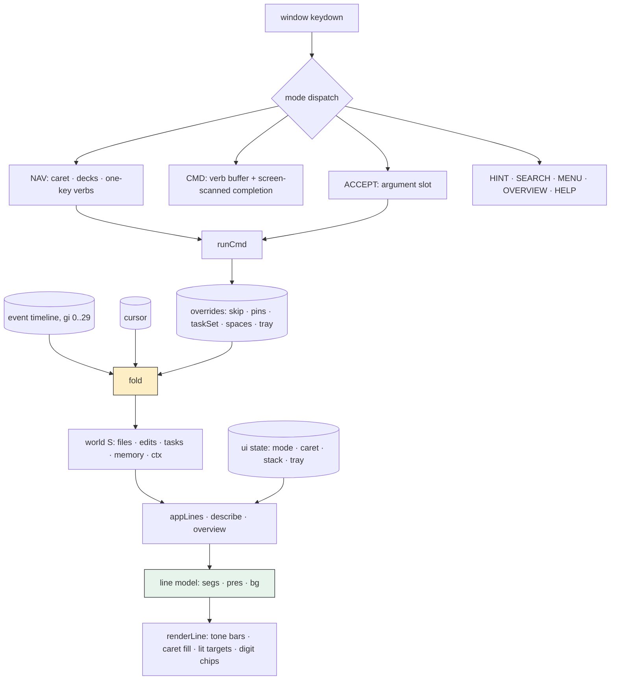
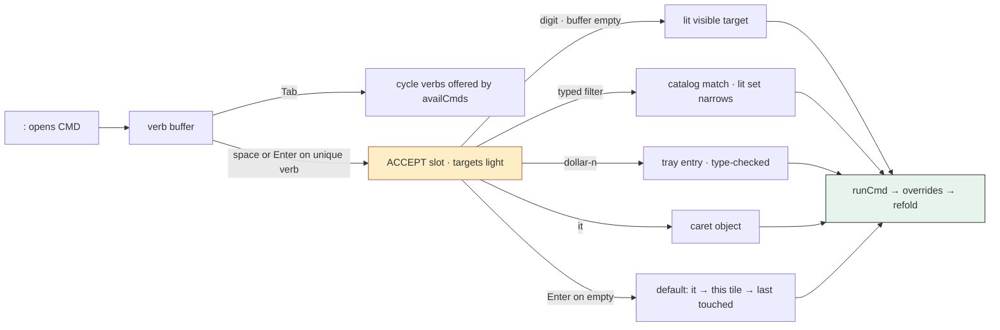

<!-- Vault location: Projects/2026/08/22/pbui-handheld-project-report.md -->
<!-- Sources: see References §10 — the project's primary documents are the four
     artifact files produced during the design/build sessions. -->

# PBUI/HB: A Presentation-Based UI for a Keyboard-Only 320×320 Handheld

## 1 · Executive Summary

This project ports the core ideas of a CLIM/Genera-style presentation-based UI
(PBUI) — typed live objects on screen, context-dependent verbs, and `accept`
as the universal argument-capture mechanism — from a mouse-driven desktop
workbench to a simulated handheld with a 320×320 screen, a bitmap-style
character grid, and no pointing device of any kind. The deliverables are a
design brainstorm, a working single-file React prototype (~1,200 lines, three
feature iterations), and an owner's manual written against the prototype's
exact behavior.

The central finding is that the presentation architecture does not merely
survive the loss of the pointer; several of its mechanisms become *stronger*.
Because every visible thing carries a type and a label, the argument slot of a
command can light its valid targets, complete over the entire live-object
catalog (including off-screen objects, which a mouse cannot reach), and offer
a recency default — so the common case of any command is one to three
keystrokes. Three design moves carry most of the weight: (1) a **presentation
caret** driven by arrow keys as the baseline pointing engine, layered with
hint labels, typed cycling, and label search; (2) a **REPL whose completion is
scanned off the screen** — a verb is offered only when something visible can
receive it — with the spacebar transitioning directly into a lit,
type-filtered argument slot that understands pronouns (`$n` for tray entries,
`it` for the caret); and (3) **tiles as first-class objects**, which makes
window management (`switch`, `close`, `newtile`) fall out of the same
object/verb machinery as everything else, including the rule that the current
tile always offers its verbs to the REPL.

## 2 · The Problem

The starting point was an existing desktop artifact: a PBUI "coding agent
workbench" built as a React prototype. Its header states the program's thesis
directly:

> ```
> PBUI SHELL — CODING AGENT WORKBENCH
> A CLIM / Genera "Dynamic Windows" flavored view onto the work
> of a coding agent — everything except the conversation.
>
> Everything on screen is a typed, LIVE presentation:
>   <run> <step> <task> <file> <edit> <hunk> <sem> <toolcall>
>   <mem> <ctxseg> <symbol> <dataset> <field> <doc> <datum> <cat>
> plus the shell's own <tile> and <workspace>.
> ```
> — `pbui-agent-workbench_3_.jsx`, file header

That workbench leans on four pointer affordances, each mapped to a core PBUI
mechanism: **hover** drives the mouse-documentation line (Genera's idiom for
telling the user what a click will do); **left click** activates a
presentation or answers an `accept`; **right click** opens the per-type verb
menu; and **drag** moves objects between tiles and wires ports. The brief for
this project removed all four at once: the target is a BlackBerry-class
device — 320×320 screen, bitmap font, full keyboard with assignable special
keys, and (after the first design round) arrow keys rather than a thumbwheel.

The constraints shaped the design in three ways. First, the character budget:
at a 6×10 cell the screen holds 53 columns by 32 rows, which rules out the
desktop's free recursive tile splits and dense multi-pane layouts. Second, the
input model: with no pointer, "point at a presentation" must be reinvented as
a keyboard act, and hover-dependent affordances (the doc line, tooltips,
accept-mode highlighting) must be re-derived from focus rather than cursor
position. Third, the interaction economy: on a thumb keyboard, every common
operation should cost very few keystrokes, which pushes the design toward
completion, defaults, and pronouns rather than navigation.

The reframing that unlocked the design is recorded in the brainstorm document
as its single organizing principle:

> **The screen is a query result, not a picture.** Every visible presentation
> is addressable by type, by label, by recency, and by position-in-reading-
> order. Keyboard interaction is choosing which of those four address spaces
> to use.
> — `pbui-handheld-brainstorm.md`, §0

A pointer addresses objects by *screen position* only. A keyboard, paired
with a presentation architecture, can address them by any of four spaces —
and three of those spaces (type, label, recency) extend to objects that are
not on screen at all. The design problem therefore inverted from "how do we
compensate for the missing mouse" to "which address space should each
interaction use."

## 3 · The Data Model

### 3.1 What makes something an object

The prototype's object layer is deliberately minimal. An object is a pair
`(pt, v)` — a presentation type and a value (usually an id). Three functions,
each a plain switch over `pt`, make the pair a first-class citizen:

- `labelFor(pt, v, S)` returns the human-readable name used everywhere: in
  rows, in completion candidates, in tray chips, in toasts.
- `catalog(types, S)` enumerates every live object of the given types in the
  current world — this is the completion universe for a typed argument slot.
- `describe(pt, v, S, st)` renders the object's inspector as a list of lines,
  and those lines may themselves contain presentations, which is what makes
  drill-in navigation compose (a file's inspector lists its hunks as live
  objects; a hunk's inspector links its step).

Everything else in the system — hint labels, accept-mode lighting, verb
menus, the doc line, pronoun resolution — is written against these three
functions and never against any particular tile's rendering. Adding a new
object type to the system means adding a case to each of the three functions
plus entries in two lookup tables (glyph and tone); the shell interactions
then apply to it without further work. This was demonstrated live during the
build when tiles (`card`) and app kinds (`app`) were promoted to object types
in the third iteration: once they had labels, catalog entries, and a
describe case, they immediately worked with hints, the caret, `yank`, the
tray, menus, and the accept slot.

### 3.2 The world as a fold over a timeline

The domain content — a small simulated coding-agent run — is stored as an
event timeline: eight steps, each containing events (`read`, `think`, `tool`,
`edit`, `create`, `task`, `mem`, `compact`), flattened into a single global
sequence with indices `gi ∈ [0, 29]`. The visible world is a pure function:

```
S = fold(cursor, overrides)
```

`fold` replays the timeline up to `cursor` and produces the derived state:
file churn, the list of edits with their diffs and semantic classes, task
statuses, memories, the context-window segments with token counts, and the
compaction at step 8. Every tile renders from `S`; none owns data. Scrubbing
the transport is therefore just moving `cursor` and re-deriving — the whole
screen updates coherently, in reverse as well as forward.

User actions never mutate the timeline. They accumulate in an **overrides**
record — `skip` (reverted edit ids), `taskSet` (status overrides), `memPin` /
`memUnpin` / `memForget`, `ctxPin` / `ctxEvict` — which `fold` applies during
and after replay. Two properties follow. Reverting is non-destructive and
reversible (`restore` removes the id from `skip`). And annotations are
replay-stable: a pinned segment survives scrubbing through the step-8
compaction because the fold consults `ctxPin` at the moment it decides what
to compact.

One subtlety surfaced late and is worth recording because it is the kind of
bug this architecture makes findable. Pinning a memory by override initially
set the memory's `pinned` flag but never materialized its context-window
*segment*, because segments were only created at seed time and at event time.
The user-visible symptom would have been a `pin $1` that "worked" without any
observable effect on the window. The fix applies overrides in a specific
order inside `fold`:

```js
// fold(), override application (excerpt from pbui-handheld.jsx)
memory.forEach((m) => {
  if (memForget.has(m.id)) m.forgotten = true;
  m.pinned = (m.pinned || memPin.has(m.id)) && !memUnpin.has(m.id);
});
/* an override-pin materializes a window segment; an unpin (or forget)
   removes the memory's segment from the window */
ctx = ctx.filter((s) => !(s.mem && (memUnpin.has(s.mem) || memForget.has(s.mem))));
memory.filter((m) => m.pinned && !m.forgotten && !ctx.some((c) => c.mem === m.id))
  .forEach((m) => ctx.push({ id: "c-" + m.id, kind: "memory", /* … */ }));
ctx = ctx.filter((s) => !ctxEvict.has(s.id));
```

The order matters: unpin/forget removals precede pin materialization, which
precedes eviction, so that each override observes the results of the previous
ones and the invariant "pinned, unforgotten memories have exactly one window
segment" holds at every cursor position — including cursors *before* the
memory was learned, where the memory does not exist and no segment may be
conjured.

### 3.3 Commands as typed signatures

Commands are declared as data, and the signature is load-bearing:

```js
const ALL = ["hunk","file","task","mem","ctxseg","step","toolcall","card"];
const CMDS = {
  open:    { types: ALL,               doc: "inspect an object (push a card)" },
  revert:  { types: ["hunk"],          doc: "undo a change" },
  restore: { types: ["hunk"],          doc: "un-revert a change" },
  pin:     { types: ["ctxseg","mem"],  doc: "pin into the window" },
  unpin:   { types: ["ctxseg","mem"],  doc: "unpin" },
  evict:   { types: ["ctxseg"],        doc: "drop from the window" },
  forget:  { types: ["mem"],           doc: "forget a memory" },
  done:    { types: ["task"] }, start: { types: ["task"] },
  goto:    { types: ["step"],          doc: "scrub the run to a step" },
  switch:  { types: ["card"] },
  close:   { types: ["card"],          doc: "close a tile (default: this one)" },
  newtile: { types: ["app"],           doc: "open a new tile after this one" },
  yank:    { types: ALL },
  drop:    { types: ALL, needsTray: true },
  clear:   { types: [],  needsTray: true },
  help:    { types: [] },
};
```

From this one table the system derives: which visible objects light up when
the command's argument slot opens; the completion universe (`catalog(types)`);
whether a caret object can serve as the implicit argument; whether a tray
pronoun type-checks; and — via the availability rule described in §5.3 —
whether the command appears in the REPL's completion at all. A wrongly-typed
argument is not an error case to handle; it is unrepresentable, because every
resolution path filters by `types` before anything runs.

### 3.4 The line model

Rendering is mediated by one intermediate representation. Every tile,
inspector, and overlay produces a list of lines:

```js
const L = (segs, pres, bg) => ({ segs, pres, bg });   // a screen row
const T = (t, s) => ({ t, s });                        // a styled segment
```

A line with a `pres` field *is* an object row: it participates in caret
order, hint labeling, accept lighting, and menu targeting. `bg` marks diff
rows (`add` / `del` tinting). Segment styles are either named keys, raw hex
colors, or style objects, which let the third iteration re-skin the entire
device to the desktop palette by changing one style resolver and the
builders' style arguments, without touching interaction code. The renderer is
a single function that draws a row: type tone bar on the left, cream
selection fill for the caret, pulsing red outline and digit chips for
acceptable targets. The uniformity of the line model is what keeps behavior
consistent across six tiles, nested inspectors, the overview, and the
listener transcript.

## 4 · The Implementation Layer

The prototype is a single React file with no dependencies beyond React
itself, structured as roughly four strata: the simulated run and `fold`
(pure); the object layer (`labelFor` / `catalog` / `describe`, pure); the
command layer (`CMDS`, `availCmds`, `runCmd(st, S, name, obj) → st'`, pure
over the state record); and the component, which owns one monolithic state
record and a single `keydown` handler that dispatches on mode.

The handler follows a reducer discipline: `setSt(s0 => handleKey(s0, key))`,
with every branch returning a new state record. This shape was chosen for
testability, and it paid off — each iteration was verified by compiling the
JSX with esbuild and driving the pure strata from Node with a React stub,
asserting on world folds and command effects (tray renumbering after `drop`,
last-tile close refusal, pin/unpin segment lifecycle across scrubs, pronoun
type-checking). No browser was needed to catch logic errors; the browser was
only needed for feel.

Two implementation details are worth recording for reuse. First, the state
record holds the workspace layout (`spaces`, cards with stable ids) because
tiles can be created and closed at runtime; but `labelFor` and `catalog` are
module-level pure functions that need the live layout to name `card` objects.
The prototype bridges this with a module-level mirror (`let SP = …`) synced at
the top of the render and of every state transition — explicitly marked in
the source as prototype-grade plumbing. A production implementation should
thread a context object instead; the mirror is recorded here so its
load-bearing role is not missed in a port.

Second, the artifact host's bundler scans string literals for `import … from
"…"` patterns, and the simulated repo's file contents contain exactly such
lines. The fix, inherited from the desktop workbench, assembles the keyword
at runtime so fake modules are never mistaken for dependencies:

```js
const _KW = "im" + "port";
const IMP = (what, mod) => _KW + " " + what + " from " + JSON.stringify(mod) + ";";
// FILES0["src/auth/token.ts"] = [ IMP("{ decode, sign }", "./jwt"), … ]
```

This failure mode (three phantom dependencies: `./jwt`, `./token`, `./token`)
cost one full load failure before diagnosis and applies to any system that
embeds source-code-shaped strings inside bundled JavaScript.

## 5 · The UX Paradigm

### 5.1 Pointing without a pointer: four engines

The user's basic act is standing on an object. The prototype layers four
mechanisms, each best at a different distance, all writing to the same caret:

| Engine | Keys | Address space | Reach |
|---|---|---|---|
| Presentation caret | ↑ ↓ (j k) | reading order | adjacent objects |
| Hint labels | `f`, then a letter | screen position, named | anything visible |
| Typed cycling | `;` + f/h/t/m/c/s/o | type | next object of a kind |
| Label search | `/text` ⏎ | label | anything in the tile |

The caret walks only object rows — plain text is unreachable, which keeps
"where am I" and "what can I act on" the same question. The doc line (row 31)
re-derives from the caret what the desktop derived from hover: it names the
focused object's type and label and lists the live verbs, and it is governed
by an explicit contract, stated in the manual as a design guarantee:

> **The bottom line never lies.** … It is the entire user interface's
> contract with you: a patient person can learn this whole device by only
> ever pressing what row 31 suggests.
> — `pbui-handheld-manual.md`, §0

Hover's second job — preview without commitment — is covered by a quasimode:
holding `i` overlays the caret object's inspector; releasing it restores the
screen with the caret unmoved.

### 5.2 Verbs: noun-first and verb-first, one vocabulary

Noun-first interaction is: stand on the object, then ⏎ (its per-type default
verb: files and hunks open, tasks cycle status, steps move the run cursor,
tiles switch), or `m` (the full verb menu with letter accelerators), or a
one-key verb (`R` revert⇄restore, `P` pin⇄unpin, `E` evict). `r` repeats the
last command on the current caret, which turns triage into an alternation of
caret moves and single keys. Verb-first interaction is the REPL, and the two
routes share the `CMDS` table exactly — the menu is generated from the same
declarations the REPL completes over.

### 5.3 The REPL: completion scanned off the screen

What the user does: press `:`, see a prompt on the doc line, and a row of
offered verbs, each tagged with the glyph of its target type
(`revert·◇ pin·⌸ close·▣ …`).

What happens technically: the handler collects the presentation types of the
current view's object rows and filters the command table:

```js
function availCmds(visibleTypes, trayLen) {
  const vis = new Set(visibleTypes);
  vis.add("card"); vis.add("app");        // the current tile is always an object
  return Object.keys(CMDS).filter((n) => {
    const c = CMDS[n];
    if (c.needsTray && !trayLen) return false;
    return !c.types.length || c.types.some((x) => vis.has(x));
  });
}
```

The connection between behavior and architecture is the point: the REPL does
not maintain a curated "context menu" per screen. It asks the screen what is
on it, and offers the verbs those things can receive. On FILES, `revert` is
offered and `pin` is not; on WINDOW the reverse; `drop` and `clear` appear
only while the tray holds something. Two deliberate softenings keep this from
becoming a cage: the scan curates *completion*, not the language (a verb
typed in full always parses), and tile verbs are unconditionally present
because the current tile is itself a visible object — which is the
architectural reading of the requirement "the current tile always exposes its
actions to the REPL."

### 5.4 Space is the argument slot

Pressing space after a verb (or a unique prefix — `rev␣` completes to
`revert`; an ambiguous prefix is refused with the candidate list) transitions
directly into accept mode. At that instant every visible object of the slot's
type lights: cream fill, red outline pulsing to mustard, a red digit chip.
The prompt shows the command, the slot type, the live buffer, and the
bracketed default:

```
ACCEPT » revert <hunk> ▁ [⏎ verifyToken · it] 5 cand · digits pick lit · $n it ok
```

Four resolution paths coexist in the slot, and the lit set tracks the buffer:

1. **A digit** picks the corresponding lit target — but only while the buffer
   is empty; after the first typed character, digits are literal text. (This
   gate exists because `$1` must be typeable; its absence was a bug found by
   user testing, described below.)
2. **Typed text** filters the candidate universe — `catalog(types)`, i.e. the
   whole world, not just the screen — and the visible lit set narrows in sync,
   so the pulsing rows are always exactly the on-screen members of the current
   candidate list.
3. **Pronouns** resolve structurally: `$n` reaches into the tray
   (type-checked — `pin ␣ $1` where `$1` is a file yields zero candidates and
   a refusal, never a guess), and `it` nominates the caret, prepended as the
   top candidate rather than replacing label matches since "it" is also a
   legitimate substring of labels such as "edits."
4. **Bare ⏎** takes the default, which is computed by a fixed precedence:
   the caret if type-compatible; for `close`/`open` on a `card` slot, the
   current tile ("this tile" is printed in the prompt); for `drop`, the caret
   if it is aboard the tray, else the newest tray entry; otherwise the last
   object of that type the user touched — CLIM's presentation histories,
   reduced to a per-type `hist` map updated on every activation.

The pronoun path deserves its bug history, because the failure is
instructive. The first implementation of space-transitions made the older
`pin $1 ⏎` form *unreachable* — space could no longer appear in the command
buffer at all — while the accept slot treated `$1` as a literal substring
filter and, worse, the digit quick-pick intercepted the `1` before it reached
the buffer. The user's question "should I be able to type `pin ␣ $1`?" was
answerable only with "that is the intended grammar and it is broken twice."
The repair moved pronouns into the slot itself and gated the digit path on an
empty buffer. The lesson generalizes: when a mode transition is made more
aggressive (space entering the slot immediately), every token that used to be
typed *after* that point must be re-homed into the new mode, or it silently
falls out of the language.

### 5.5 The tray: references, not copies

`y` places the caret object on the tray as a reference chip (rendered exactly
as the desktop's `Pres` chip: white, ink border, 4px type-tone bar),
addressed `$1…$n`. `x` removes the caret's object; `drop` is the verb form,
and its accept slot is scoped to the tray — its lit targets are only visible
tray members, its candidates are the tray in `$`-order (deliberately not
recency-sorted; the tray's own order is the meaningful one), its default the
newest entry. `clear` empties the shelf. Because entries are references, they
stay live (revert `$1` and every view agrees) and they can dangle (an evicted
segment's chip degrades to `(evicted)`). Dropping removes the reference,
never the referent. Numbers renumber on removal, which the toast states
explicitly.

### 5.6 Tiles are objects; organization is stacking, not tiling

A workspace is an ordered deck of full-screen cards, flipped with ←/→ and
jumped with digits; ⇥ cycles workspaces; `o` opens an iconic overview
(workspace names, tile chips with one-line vital signs) in which ⏎ dives and
`m` opens a tile's verb menu. Drill-ins (⏎ on an object) push inspector
cards onto a back stack popped by ⌫. The desktop's recursive splits were
rejected on arithmetic — 26 columns is the floor for a useful pane — with a
single exception: the EDITS tile renders list-above/detail-below internally,
the detail following the caret, which is the desktop's port-wiring pattern
(`list.selected → inspector.subject`) compiled into one tile.

Because cards carry stable ids and the layout lives in state, `newtile ▦`,
`close ▣`, and `switch ▣` are ordinary typed commands, tiles ride the tray
and appear as live chips in the listener transcript, and `close ␣ ⏎` closes
the current tile by the default-precedence rule rather than by special-case
code. The one guard is refusing to close a workspace's last card.

### 5.7 The transport

`space` plays/pauses the run; `,` / `.` scrub by event; `<` / `>` by step;
and any `§n` step object anywhere answers ⏎ with "move the cursor here."
Because tiles re-derive from `fold(cursor, overrides)`, replay is total: the
context gauge fills, a test fails red at §6 and passes green at §7, the
compaction at §8 folds unpinned segments — through the user's annotations,
which persist across travel.

## 6 · Historical Context

The lineage is explicit. CLIM (the Common Lisp Interface Manager) and its
ancestor, Genera's Dynamic Windows, established the presentation model this
project ports: output is recorded as typed presentation objects; commands
declare typed parameters; `accept` makes every displayed object of the right
type a live input; presentation translators map gestures to commands by type;
and per-type input histories supply defaults. Genera's pointer-documentation
line — a reserved screen line continuously describing what the mouse buttons
would do to the object under the cursor — is the direct ancestor of this
project's doc line; the handheld's contribution is re-deriving it from a
keyboard caret and making its truthfulness an explicit design contract.

The keyboard side of the design descends from two traditions. The hint-label
engine is the link-hint technique popularized by the Vimium browser extension
(and keyboard browsers such as Conkeror before it): label the targets, type
the label. The project's synthesis — §3.5 of the brainstorm — is that CLIM's
`accept` and Vimium's hints compose: an accept slot is hint mode with a type
filter, which shortens labels (digits suffice) and adds completion and
defaults that hint systems lack. The deck-of-cards navigation descends from
the original BlackBerry interaction model, where a thumbwheel moved a caret
from interactable to interactable in reading order; the first design round
assumed that wheel, and the arrow keys of the final hardware profile inherit
its linear-caret semantics unchanged.

## 7 · Modern Comparisons

Two comparisons locate the design. The first maps the desktop workbench's
pointer affordances to their handheld replacements — the porting table that
governed the whole project:

| Desktop (pointer) | Mechanism it powered | Handheld replacement |
|---|---|---|
| Hover | mouse-doc line, previews | caret-driven doc line; hold-`i` peek |
| Left click | activate / answer accept | ⏎ on caret; digits on lit targets |
| Right click | per-type verb menu | `m` menu; one-key verbs R/P/E |
| Drag between tiles | move/copy objects | tray (`y`/`x`/`$n`) |
| Drag to wire ports | dataflow links | not ported (see Open Questions) |
| Accept-mode pulse + click | argument capture | typed hints + completion + defaults + pronouns |
| Free tile splits | layout | decks + overview + one fixed split |

The second compares the REPL against the argument-capture strategies of
systems a modern reader knows:

| System | Verb discovery | Argument capture | Typed? | Off-screen args |
|---|---|---|---|---|
| VS Code command palette | global fuzzy list | secondary quick-pick lists | by convention | yes (lists) |
| Vimium / link hints | fixed gesture set | label the visible targets | no | no |
| Magit | per-buffer transient menus | region/point at invocation | per-command code | limited |
| i3 / tiling WMs | keybindings + exec | none (commands are nullary-ish) | no | n/a |
| **PBUI/HB** | scanned off visible object types | lit targets + catalog completion + pronouns + defaults | by declaration | yes (catalog, `$n`) |

The distinctive cell is the combination in the last row: discovery and
capture are both *derived from the same typed-object substrate* rather than
hand-maintained per feature. A palette can be added to any app; lit,
type-checked, pronoun-capable argument slots require that the screen already
be made of typed objects. That is the practical argument for the
presentation architecture on small devices: it is not one feature but the
precondition for this whole cluster of features.

## 8 · Architecture Diagrams

Data flow — one keydown to pixels:



The REPL's argument slot — every path into `runCmd`:



## 9 · Key Technical Details for Reimplementation

The following TypeScript sketches are code that teaches, not code that runs;
they name the abstractions a port should preserve.

```ts
// The object layer: three functions make a (type, value) pair a citizen.
type PType = "file"|"hunk"|"task"|"mem"|"ctxseg"|"step"|"toolcall"|"card"|"app";
interface Obj { pt: PType; v: string }

interface ObjectLayer {
  labelFor(o: Obj, S: World): string;          // names, everywhere
  catalog(types: PType[], S: World): Obj[];    // the completion universe
  describe(o: Obj, S: World): Line[];          // inspector; lines may nest Objs
}

// The line model: rendering IR shared by every tile, inspector, overlay.
interface Seg { t: string; s?: StyleKey | HexColor | CSS }
interface Line { segs: Seg[]; pres?: Obj; bg?: "add"|"del"|"sel" }

// Commands: the signature is the UI.
interface CommandDef {
  types: PType[];            // [] ⇒ nullary
  needsTray?: boolean;       // availability gate beyond the screen scan
}

// Availability: scanned off the screen; the current tile is always visible.
function availCmds(visible: PType[], trayLen: number): string[];

// The default chain for an empty argument slot, in precedence order.
function slotDefault(cmd: string, types: PType[], ctx: {
  caret?: Obj; currentTile: Obj; tray: Obj[]; hist: Partial<Record<PType,string>>;
}): Obj | null;
// 1. drop: caret-if-aboard, else newest tray entry
// 2. caret if type-compatible                       ("it")
// 3. close/open on a card slot: the current tile    ("this tile")
// 4. last-touched of a compatible type              (presentation history)

// Pronoun resolution inside the slot; digits pick lit targets only when buf === "".
function resolveSlot(buf: string, a: {cmd: string; types: PType[]},
                     ctx: {tray: Obj[]; caret?: Obj}, S: World): Obj[] {
  if (/^\$\d+$/.test(buf)) {
    const t = ctx.tray[parseInt(buf.slice(1)) - 1];
    return t && a.types.includes(t.pt) ? [t] : [];      // type mismatch ⇒ refusal
  }
  const base = a.cmd === "drop" ? ctx.tray : catalog(a.types, S);
  let m = base.filter(o => labelFor(o, S).toLowerCase().includes(buf.toLowerCase()));
  if (buf === "it" && ctx.caret && a.types.includes(ctx.caret.pt))
    m = [ctx.caret, ...m];                              // prepend, don't replace
  return m;
}

// The world: a pure fold; user actions are overrides, never timeline edits.
function fold(cursor: number, ov: Overrides): World;
// Invariant maintained inside fold: pinned ∧ ¬forgotten memories have exactly
// one window segment, at every cursor, applied in the order
// unpin/forget-removal → pin-materialization → eviction.
```

Beyond the sketches, four rules of thumb from the build: keep the key handler
a pure reducer so the logic strata are testable headlessly; keep exactly one
line model between content and pixels so every shell feature applies to every
surface; when a mode transition is made more eager, re-home every token that
used to be typed after the old boundary; and if the host bundles string
literals, never let embedded content spell reserved syntax.

## 10 · References and Sources

Primary project documents (the source collection for this report):

| File | Description |
|------|-------------|
| `/mnt/user-data/uploads/pbui-agent-workbench_3_.jsx` | The desktop PBUI coding-agent workbench (~5,200 lines): presentations, accept, verb menus, ports/wiring, workspaces, transport. The system being ported; quoted in §2. |
| `/mnt/user-data/outputs/pbui-handheld-brainstorm.md` | Design brainstorm: hardware profiles, the four pointing engines, accept-as-typed-hints, decks/overview/drill-in, tray/registers, rejected alternatives, open questions. |
| `/mnt/user-data/outputs/pbui-handheld.jsx` | The prototype, v0.3 (~1,200 lines): all mechanisms described in §3–§5, including the screen-scanned REPL, pronouns, tiles-as-objects, and the desktop palette. |
| `/mnt/user-data/outputs/pbui-handheld-manual.md` | Owner's manual: six tutorials, concepts chapter, full key/command reference, troubleshooting. Written against v0.3 behavior. |

Process guides applied to this report:

| File | Description |
|------|-------------|
| `writing-style.md` | Textbook-style prose rules; quote-directly and comparison-table patterns. |
| `report-structure.md` | Section order and depth template followed above. |
| `deliverable-checklist.md`, `source-collection.md` | Handoff checklist and source pipeline; the tooling steps (docmgr, Kagi, defuddle, reMarkable) do not apply in this environment and were skipped — noted here as the intentional deviation. |

External references (background, not downloaded):

| Reference | URL |
|-----------|-----|
| Common Lisp Interface Manager — presentations, `accept`, translators | https://en.wikipedia.org/wiki/Common_Lisp_Interface_Manager |
| Genera (Dynamic Windows; pointer-documentation line) | https://en.wikipedia.org/wiki/Genera_(operating_system) |
| Vimium — link-hint keyboard navigation | https://github.com/philc/vimium |

## 11 · Open Questions for Future Investigation

**Ports and wiring were not ported.** The desktop's dataflow links between
tiles (an outlet retargets, a wired inlet follows) are absent except as the
hard-coded EDITS split. The brainstorm sketches three keyboard paths
(listener `wire a.out → b.in` with typed completion; a port rail with hinted
inlets; overview marking). It matters because wiring is the desktop's
mechanism for composing tiles into instruments; answering it requires
deciding whether ports are objects (`<port>`, `<link>`) with the full
citizen treatment, which §3.1 suggests they should be.

**Multi-argument commands.** Every current command takes zero or one typed
argument. `wire`, `compare`, and tray-consuming forms (`watch $*`) need a
grammar for sequential slots — does space advance between slots, and how do
the lit sets for slot 2 depend on the answer to slot 1? The accept machinery
appears sufficient, but the prompt design for "slot 2 of 3" is unexplored.

**Is the availability scan too strict?** `goto` is not offered on tiles
without a visible `<step>`, though typing it in full works. A `shell: true`
flag for a small set of globally-sensible commands is the obvious relief
valve; the open question is whether the purity of "offered ⇔ receivable on
screen" is worth occasional friction, which only extended use can answer.

**Hint-label stability.** Labels are assigned by position, so an object's
hint changes as the screen changes. The brainstorm asks whether labels should
stick to objects within a session (spatial memory) at the cost of longer
labels. Empirical; needs usage data.

**Naming collision: `drop`.** The workbench's task vocabulary uses "drop"
for abandoning a task; the handheld uses it for tray removal. If task
verbs grow (`block`, `drop`), one must be renamed (`untray` is the leading
candidate). Trivial to change now, expensive after habits form.

**The manual as a tile.** The manual is external markdown; the system's own
thesis says it should be a HELP deck whose key names are live presentations.
This would test whether the object layer can host *documentation about
itself* — the strongest version of the Genera inheritance — and would replace
the static `?` card.

**Scale.** The prototype's world is 29 events, five edits, six tiles.
Whether the caret/hints/catalog interaction economy holds at 500 edits and 30
tiles (hint overflow, catalog ranking, overview density) is untested and is
the first thing a real deployment would learn.
