# Visual audit: screenshots and inconsistency notes

## Executive Summary

This document is the feedback surface for PBUI-VISUAL-1. It has two halves: the **analysis** (this part, hand-written after viewing the corpus) and the **catalog** (generated, every screenshot numbered and grouped by package and function, with the collectors' one-line notes). Cite exhibits by their code (`WA-011`, `D-CH-001`, `I-C-008`) when giving feedback.

Corpus: 663 screenshots. 583 from the eight storybooks (static), 36 from the four demo apps (driven), 22 interaction states in core/chat/sandbox/editor/plotscript, 21 workbench and linking states (12 from new `VisualAudit` stories, 7 driven link flows, 2 datalab page stories), and the reference artifact. Scripts to regenerate everything are in `scripts/` (01 to 06).

The reference look is `REF-001`: monospace, hairline ink borders, zero radius, pastel-tinted tile headers with a dark masthead and a status footer, outlined chips, and no elevation. Measured against it, the family is **one system at the atom level and four systems at the shell level**. The object menu is pixel-identical everywhere. Tiles, badges, dialogs, banners and page shells are not.

The ten things I would fix first, in order of leverage:

1. **One tile chrome.** Three skins for the same `TileFrame` (orange story tone `WA-011`, white ecommerce `WI-004`, saturated per-app datalab `DW-001`), and four page shells around it (`D-DL-004`, `D-CH-001`, `D-PS-001`, `D-EC-001`). Decide the tone rule (every tile tinted by kind, as in `REF-001` and datalab) and the shell rule (dark masthead + status footer, as in datalab and chat) once.
2. **One chip.** Fifteen chip/badge implementations (inventory §4.1); `WA-003` vs `DL-283` vs `C-089` vs `EC-001` status pills. Extend core `Chip` with the few variants that are real (tone edge, border-style state, glyph-only) and delete the rest.
3. **Dialog and launcher onto the system.** The core Dialog is the only rounded, shadowed, backdrop-dimmed, 18px-titled, rem-spaced surface (`I-C-008`, `C-002`, `WB-005`, `WB-013`). Its defaults live in `public/components.css` in rem with slate fallbacks. datalab already overrides all of it in `dialogs.css`; promote that override into core.
4. **Kill the nested double borders.** Tile-in-tile (`WA-011` bottom right), port cards inside the rail (`WI-002`, firm outer + hair inner), datalab's doc bar pill in a bar in a tile (`DW-001`), chat widget card in tile in pane (`CH-011`). Rule: one border per nesting level, and the inner level drops to a rule or a wash.
5. **Body padding on tiles.** Tile content touches the frame in the workbench stories (`WA-011`: "counter in n-…" starts on the border) and in several datalab organisms (`DL-004` divider). ecommerce and chat pad the body (`D-EC-001`, `D-CH-001`). Make `tile-body` carry `--pbui-space-3` by default and let dense tables opt out.
6. **Un-overload the tan.** `--pbui-selected` (#fdeec6) means: selected row (`I-C-009`), acceptable target (`I-C-003`), drag-over (`I-C-012`), refused connect target (`WI-003`), timeline kind tag (`I-SB-004`), active chip (`C-089`), active doc (`DL-283`). Split into `selected`, `acceptable` and a neutral `tag` wash.
7. **One "unavailable" grammar.** RefusalNotice red left bar (`I-C-006`), inline "— reason" (`I-C-002`), ProposalCard chip+bar (`I-CH-004`), plotscript plain red line (`I-PS-001`), Callout's glyph-only severity (`C-005`), widget error as beige box (`CH-013`). Pick the left-edge-bar idiom (it is already the Chip tone idiom) and use it for every notice.
8. **Fix the fallback drift and the missing tokens.** Eleven tokens are read with fallbacks that disagree with `tokens.css`; six tokens are read only where datalab defines them; pbui-chat reads two border tokens with no fallback and no definition. This is the "margins missing" class of bug: borders silently absent outside datalab.
9. **One label idiom.** Seven uppercase-tracked-label implementations with tracking 0.02/0.04/0.06/0.08/0.1/0.14/0.28em. Route all through `Text[SectionLabel]` and `--pbui-track-label`.
10. **Native controls.** Raw checkboxes, radios, selects and sandboxed program buttons sit unstyled next to styled buttons (`I-SB-001`, `I-C-005`, `C-155`, `DW-001` doc select). Either skin them in `styles.css` at zero specificity or wrap them.

## Decisions (feedback of 2026-09-04)

Answers to the ten priorities, by number:

1. **Tile chrome = datalab's**: every tile tinted by application kind, dark masthead, status footer. Adopted.
2. **One chip.** Adopted.
3. **Never rounded, always the brutalist style.** Applied to the Dialog this means: the dialog panel is the object-menu recipe scaled up (paper, firm ink border, zero radius, no blurred shadow, inverted title bar in the tracked-uppercase label style, tiny bordered close button like the tile bar), body on the px space scale. Backdrop: flat translucent-ink dim, no blur. Confirmed: never rounded, anywhere.
4. **Kill nested double borders.** Adopted.
5. **Un-overload the tan** (see the note on "wash" below). Adopted.
6. Adopted. 7. Adopted. 8. Adopted. 9. Adopted.
10. **Native controls**: global zero-specificity skin in `styles.css` (confirmed), atoms second.

**What a wash is.** A flat, very light background tint with no border (`--pbui-pane-alt` #f1f1ee, or datalab's `--pbui-wash` #f7f7f4), used to set a region apart by tone instead of by a line. In item 4 the inner nesting level becomes a wash instead of a third border; in item 6 chips and tags that carry no state get a neutral wash so the tan is left to mean selected/acceptable only.

**What native controls are.** Checkboxes, radios, `<select>` dropdowns and the buttons drawn by sandboxed programs still render with the browser's default look (grey bevel, rounded, system font) beside pbui's flat square buttons: `I-SB-001` (the Counter's − / + buttons), `I-C-005` (public/developer radios), `C-155` (raw buttons in the Toolbar story), `DW-001` (the "α · —" select in the doc bar), `D-CH-001` (the approver-role checkbox). The fix is either a zero-specificity skin for these elements in `styles.css`, or using the existing `SelectInput`/`CheckboxRow` atoms everywhere and mapping sandbox program buttons onto `Button`.

## The reference and what "consistent" means here

`REF-001` sets the constraints the rest of the analysis uses:

- Type: one monospace face, four sizes (title 13, base 11.5, small 10.5, tiny 9.5). Labels are uppercase + tracked, bold.
- Lines: hairline ink borders everywhere, firm (2px) only for the selected/held emphasis. Radius zero. No blurred shadows (the hard offset shadow on the stat tiles is the part the user wants dropped).
- Colour: paper and pane are white/off-white; ink is near-black; one warm selection tint; a small pastel tone palette (gold, sage, lavender, salmon, teal) used **as tile-header tints and chip fills keyed to object kind**, never as decoration.
- Chrome: dark masthead with product name and workspace tabs, tiles with tinted title bars and tiny bordered icon buttons, a dark status footer with the mode word in gold.
- Density: 2 to 6px internal spacing, 10px between tiles, text never touches a border.

Every finding below is "differs from that" rather than "differs from another package".

## Findings

### 1. Page shells and workbench chrome (the user's "workbench + linking" hunch)

| Demo | Masthead | Workspace strip | Tile header tints | Status footer | Exhibit |
|---|---|---|---|---|---|
| datalab-ui | dark band, wordmark, small-caps nav | bordered buttons + green "+ workspace" | every tile, by kind | yes (gold READY) | `D-DL-004` |
| pbui-chat | dark band, uppercase title | "▸ main +" plain text | inspector only (cream); conversation grey; others white | yes | `D-CH-001` |
| pbui-plotscript | none; plain text row | plain text tabs, active boxed | script grey, plot saturated orange | no | `D-PS-001` |
| pbui-ecommerce | none; "seeded" tiny text | plain text tabs, active boxed | inspector cream only | no | `D-EC-001` |
| workbench stories | none | none | orange (story tone) | no | `WA-011`, `WB-006` |

The same `TileFrame` from `src/chrome` renders under five conventions because the tone comes inline from each product's app descriptor and nobody wrote the rule down. The reference and datalab agree: **every tile is tinted by its application kind**. That is the rule I would adopt, with the pastel tone palette promoted into core tokens (only `--pbui-cat-3` exists in core today; ecommerce reads `cat-1/2/4` which resolve to nothing outside datalab).

Workspace strips: `WB-028` to `WB-030` (active tab boxed, inactive plain), datalab (all boxed, active filled), chat (a triangle glyph and a plus). Three tab grammars. `REF-001` boxes all tabs and fills the active one.

Linking specifics:

- Port cards in the rail (`WI-002`, `WI-004`, `WA-004`) draw a firm outer border and a hair inner border around each port: a box in a box in a tile. One border per card.
- `PortBadge` (`WA-003`) encodes eight states by border style (dotted/solid/double/dashed) at 0.85em on em padding, so it comes out smaller than the title next to it and cramped in the header (`EC-001`, `WI-005`). It is the only em-sized chip in the family. Put it on the `fs-tiny`/`space-2` scale and give the states a second cue (glyph is there; a tone fill for held/fixed would do).
- Connect mode reuses the selection tan for both **acceptable** (`WI-002`) and **refused** (`WI-003`) targets; refusal is text-only.
- The wire (`WI-004`) is a 2px ink bezier drawn over tile chrome, while the wiring overlay in the demo (`D-EC-006`) dims the page and annotates. Two visualisations of the same link.
- Active tile has no visible cue outside launcher-open (`WA-011` "selected / active"), by design per `pbui-workbench/src/styles.css`, but datalab shows a 2px ring (`D-DL-009`). Decide.
- Split dividers are a faint dotted grip on white (`WA-009`, `D-PS-009`): nearly invisible and the only dotted element in the reference vocabulary.
- RebalanceDialog and RelationPalette (`WA-005`, `WA-007`, `WB-013`) are rounded, shadowed cards because they sit on core Dialog; the object menu next to them is flat. See finding 4.
- Header truncation: "NOTES..." vs "NOT…" (`WA-002`, `WA-010`), and the badge simply disappears when the tile narrows; icon buttons collide with the title under ~200px (`WA-004`).

### 2. Tiles, nesting and margins

Box structure as rendered (inventory §5, verified on `WA-011`, `DW-001`, `CH-011`, `EC-002`):

```
workbench Surface (grid, --pbui-wash bg: only defined in datalab)
└ Tile.cell (no border)
  └ TileFrame [data-part=tile]  border-firm ← level 1
    ├ tile-bar  border-bottom firm, tinted
    └ tile-body  NO padding
      └ app root: ecommerce/chat/sandbox tiles: Toolbar[tight] + own padding
                  workbench story apps: text on the border
                  nested Surface → Tile → TileFrame border-firm ← level 2, flush against level 1
                  datalab Tile: DocBar (border-bottom grid) → DocChip pill (hair + 4px edge) ← levels 2, 3
                  chat TilesPanel → PbuiWidget card (hair + 4px edge) → WidgetChild (hair) ← levels 2, 3
```

Concrete rules I would set: `tile-body` pads `space-3` by default; a nested Surface inside a tile gets `space-2` inset so the two firm borders never touch; a card inside a tile is a wash (pane-alt) with a tone edge, not another hairline box; a chip inside a card is text with a tone edge only. That takes `DW-001` from four bordered levels to two.

Missing margins seen: `DL-004` (split divider with content touching), `WA-011` (body text on border), `DL-001` (warning text crowds a row), `I-C-002` (menu reason runs to the edge), `C-001` (drop-zone label placement varies per zone). The datalab tokens define `--pbui-space-6` (24px); nobody else can reach past 16px without a literal, and the inventory counts 20+ distinct spacing literals in use.

### 3. Chips, badges, pills, tags

Inventory §4.1 lists fifteen. In the images: core Chip with tone edge (`C-088`, `C-089`), PortBadge border-style states (`WA-003`), ecommerce status pills with solid/dashed/grey by state (`EC-001`, the one place border style is used as a *state* language deliberately), datalab DocChip filled pill with red edge (`DL-283`, `DW-001`), TypeBadge letter tiles (`DL-231` headers), Tick 17px squares, TokenChip dashed for revoked (`DL-299`), legend swatches filled and borderless (`D-PS-003`), datalab WorkspaceStrip firm-bordered tabs. Three encodings of "active": fill (`C-089`), fill + edge (`DL-283`), border only (`WB-028`).

Proposal: `Chip` gets `tone` (edge colour), `fill` (none | wash | tone), `state` (default | active | stale | revoked, mapped to border style once), `glyph`. PortBadge, DocChip, RoleBadge, ScopeChip, StepRow.kind, TracePanel.kind, TemplateTable.kind and the five hand-copied tone-edge boxes become `Chip` calls. The status pill border-style language from ecommerce becomes the `state` mapping for everyone.

### 4. Menus, dialogs, choosers, banners

- **Object menu**: consistent everywhere (`I-C-001`, `I-C-010`, `I-CH-002`, `WI-001`, `D-DL-005`, `D-EC-002`): ink header bar, hair border, no shadow, dotted separators. This is the anchor.
- **Core Dialog / Launcher** (`I-C-008`, `C-002`, `WB-005`, `D-CH-005`): 0.5rem radius on the panel, 0.25rem on the close button, 18px sans-ish title, 1rem paddings, slate fallbacks, blurred backdrop. datalab replaces it with its own inline "GO TO VIEW" panel (`D-DL-007`). Off-system by construction (`public/components.css`).
- **Accept chooser** (`I-C-004`): sans-serif (font not inherited), grey hairline, 24px blurred shadow. Defined in `presentation-parts.css` with its own palette.
- **Context help** (`presentation-parts.css`): 2px radius fallback, 8px blurred shadow.
- **Banners**: accept banner is danger-filled (`I-C-003`), mouse-doc is ink-filled with gold mode word (`D-CH-001` footer), placing banner in workbench Surface is ink-filled and centred at the bottom, RefusalNotice is a paper box with a 4px danger edge (`I-C-006`), LinkAnnouncer is visually hidden. Four banner idioms for "the system is telling you something about the current mode".

Rule: one floating-surface recipe (the object menu's), used by dialog, launcher, chooser, context help and palette; radius and shadow removed; dialog title on `fs-title`; body on the px space scale. One banner recipe (ink bar, gold mode word) for mode banners; one notice recipe (paper, tone edge) for refusals, callouts and errors.

### 5. Colour semantics

- Selection tan overloaded (summary item 6).
- Tile header tint: kind-keyed in datalab and the reference; single accent (inspector cream) in chat/ecommerce; arbitrary story tones in core `C-003` (sage, lavender) and workbench (orange). Decide "tint = kind" and ship the palette.
- Severity: Callout renders success/warning/info as the same beige box (`C-005`, `C-006`); chat widget errors are beige (`CH-013`, `CH-015`) while proposals get red (`CH-017`); datalab crash boxes are grey (`DL-042`); SignIn refusal grey (`DL-213`). `--pbui-danger` and `--pbui-ok` exist and are barely used as edges.
- Dashed borders mean drop target (`C-016`), stale (`DL-286`), revoked (`DL-299`), lookup failed (`DL-078`), streaming (`CH-016`), on-hold (`EC-001`), ambient port (`WA-003`). One cue, seven meanings.
- Menu item colours: red for destructive (consistent), blue for "Connect…" only in ecommerce (`D-EC-002`), orange italic for disabled-with-reason in chat (`D-CH-004`).
- Categorical chart palette applied in some stories and not others of the same component (`EC-026` vs `EC-027`, `DL-145` vs `DL-139`).
- Off-palette colours: slate fallbacks in components.css (`#0f172a`, `#e2e8f0`, `#cbd5e1`, `#64748b`), blue hint text in empty states (`D-EC-001`, `D-CH-001`), `color-mix()` hovers in ecommerce, blue-outlined unmapped channels in datalab (`DL-166`).

### 6. Typography and labels

- Seven implementations of the uppercase tracked label with five tracking values (inventory §4.2); `chrome.css` tile-title fallback is 0.06em while the token is 0.08em; `components.css` inspector-title is 0.75rem.
- Sans-serif leaks: launcher (`I-C-008`), accept chooser (`I-C-004`), FileBrowser row labels lighter than the menu they open (`I-C-009`), JsonBlock sets its own `ui-monospace` stack instead of `--pbui-font`.
- `fs-tiny` 9.5px vs 10px fallbacks; PortBadge at 0.85em.
- Wordmark casing differs per product (`D-DL-001` "DATA LAB", `D-DL-004` "DATALAB", `D-CH-001` "GOLD COIN SHOP", `D-EC-001` "gold coin shop", `D-PS-001` "scripted plots").

### 7. CSS structure (usage, style, and structure)

**Mechanisms in use.** Core mixes four: CSS modules (atoms, molecules, layout), `data-part` attribute sheets (`chrome.css`, `presentation-parts.css`), `data-pbui-component` attribute sheets with `:not([data-unstyled])` (`components.css`: Dialog, JsonBlock, InspectorPanel), and `:where()` zero-specificity fallbacks (`styles.css`). Workbench, chat, ecommerce, plotscript, sandbox and editor use modules only; datalab uses modules plus five global sheets (`reset`, `tokens`, `dialogs`, `brand`, `scrollbars`, `pbui-extras`) plus inline `style={{}}` on WorkspaceStrip and TruncationNotice. The `data-unstyled` escape hatch exists only for the three components in `components.css`.

**Two definitions of the presentation parts.** `src/styles.css` (`:where`, hair border, plain header, 13rem min) and `public/presentation-parts.css` (firm border, 2px radius fallback, inverted header, 260px min, 320px max-height). Both ship in `dist/pbui.css`, so the second always wins; the first is dead weight except for a consumer who somehow imports only part of the bundle. Fold them: one sheet, zero specificity, token values.

**Fallback drift.** Eleven tokens are read with fallback literals that disagree with `tokens.css` (`border-firm` 1.5px #1f2430 vs 2px #23262b; `selected` #e6ecf5 cool blue vs #fdeec6 warm; `faint` three values; `line` two; `radius` 2px vs 0; `fs-tiny` 10 vs 9.5; `danger` #c0392b vs #b64b37). The `chrome.css` header still says "pbui defines no token values". These fallbacks are a second, older palette embedded in the bundle. Delete every fallback in the parts files: tokens.css is in the same bundle and cannot be absent.

**Tokens defined only in datalab.** `--pbui-border-grid` (read in 6 chat files, 6 datalab), `--pbui-border-rule` (5 chat, 5 datalab), `--pbui-wash` (workbench Surface, chat, datalab), `--pbui-track-banner`, `--pbui-space-6`, `--pbui-selected-wash`, `--pbui-cat-1/2/4..8`, `--pbui-shadow-hard/menu`. pbui-chat reads `border-grid` and `border-rule` with **no fallback**, so those grid lines and rules do not render in the chat storybook or demo. Promote all of them into `src/tokens.css`; make datalab's `tokens.css` an override file rather than a byte-copy of core's 49 tokens (it is a copy today, so every core edit needs a second manual edit).

**Per-package tone tokens.** `--pbui-tone-tool/proposal/widget/row/product/order/metal/message/category/step` are defined only in demo `tokens.css` files; `--pbui-tone-source` is red in chat's demo and green in datalab's. `pbui-sandbox` reads `--pbui-tone-widget` at 8 sites and renders correctly only when hosted by chat's demo. Tone vocabulary belongs in core with a documented mapping from object kind to tone.

**rem in a px system.** `components.css` is the only rem consumer (dialog 1rem, title 1.125rem, json 0.8125rem, inspector 0.75rem) and hardcodes two radii. `tokens.css` documents this defect in its own header and cannot fix it because the radii are literals.

**Duplicated structure.** `flex:1; min-height:0; overflow:auto` hand-copied 12+ times in core and in nearly every tile elsewhere although `AppBody` exists. `Toolbar[tight]` + title + spacer + status copy-pasted across all 7 ecommerce tiles, 5 sandbox tiles, 2 plotscript tiles. Seven `<dl>` key/value implementations. Two Surfaces (core layout Surface: bg/border/padding variants where `hair`/`raised` and `firm`/`floating` are the same borders under four names; workbench Surface: a grid host with a placing banner). Two Tiles (chrome `TileFrame` and datalab `organisms/Tile`).

**Redundant imports.** `src/index.ts` bundles `components.css`, `presentation-parts.css` and `chrome.css` into `dist/pbui.css`; datalab's `styles.ts` and the root `.storybook/preview.ts` import them again. The separate `exports` entries and the `index.ts` header comment suggest consumers should import them; they should not. Either stop bundling them (opt-in parts) or drop the exports.

### 8. Bugs found on the side (not style)

- `pbui-chat` Composer "insert object…" throws `runtime type "message" is not declared in the type graph (PBUI-KERNEL-1 C9)` from `isAcceptable()` and blanks the story; every Composer story shares the vocabulary. Reproducible in the chat storybook.
- `WA-012` WireLayer story draws no wires although the interaction shots do; likely a mount-timing issue in the story composition.
- datalab `PhaseIcon` "Ink" renders icons black on black (`DL-312`); `PhaseRule` "Bars Only" and "Sizes" render blank (`DL-316`, `DL-321`); four Tour stories crash with `useAnalysisResultFor must be used inside AnalysisProvider` (`DL-042` to `DL-045`).
- Many `Apps/*` and lab stories render blank statically (`CH-001` to `CH-004`, `WB-001` to `WB-004`, `SB-001`, `SB-002`, `PS-001` to `PS-004`, `ED-002`, `ED-004`): they need a host size or an interaction. Not broken, but their stories should mount a sized host.
- Core `C-097`/`C-099`: two identical icon buttons, one ink and one danger, no documented reason.
- The ecommerce header badge (`EC-001`) is cramped rather than garbled (PortBadge em sizing), but the sweep read it as text corruption; worth a look at 2x scale.

## Consolidation plan (proposed order)

Each step is independently shippable and screenshot-verifiable with the scripts in this ticket.

1. **Tokens first.** Promote datalab-only tokens and the tone palette into `src/tokens.css`; delete all inline fallbacks in `public/*.css` and `styles.css`; make datalab's `tokens.css` overrides-only; add `--pbui-acceptable` and `--pbui-tag-wash` next to `--pbui-selected`. (Fixes findings 7 fallback drift, chat's missing borders, sandbox's tone.)
2. **Parts files.** Merge `styles.css` + `presentation-parts.css` into one zero-specificity sheet on tokens; rewrite `components.css` in px tokens with radius from `--pbui-radius` and the menu's floating recipe for Dialog; promote datalab `dialogs.css` into it and delete the override. (Fixes launcher, dialog, chooser, context help, rebalance and palette dialogs at once.)
3. **Tile chrome.** In `chrome.css`: `tile-body` padding, nested-surface inset, tone-by-kind default with the core palette, header truncation with ellipsis that keeps the badge, min-width for the action group. Remove the story-only orange tone. Adopt the dark masthead + status footer as a `Shell` in pbui-workbench so chat, plotscript and ecommerce stop hand-rolling headers.
4. **Chip family.** Extend core `Chip`; migrate PortBadge, DocChip, RoleBadge, ScopeChip, TypeBadge, StepRow.kind, TracePanel.kind, TemplateTable.kind, VerbChips, RebalanceBadge, ecommerce status pills. Delete their modules.
5. **Notices and banners.** One `Notice` (paper + tone edge, severity by tone) replaces Callout severities, RefusalNotice, widget errors, plotscript diagnostics, datalab crash boxes; one `ModeBanner` (ink bar, gold mode word) replaces accept banner, placing banner, mouse-doc.
6. **Labels and structure.** Route every uppercase label through `Text[SectionLabel]`; `TileHeader` and `KeyValueList` components; replace hand-copied scroll bodies with `AppBody`; give the two Surfaces distinct names (`Surface` vs `WorkbenchHost`).
7. **Native controls.** Zero-specificity skins for checkbox, radio, select and sandbox program buttons.
8. **Story hygiene.** Sized hosts for `Apps/*` stories; fix the four datalab crashes and the PhaseIcon/PhaseRule renders; keep the `VisualAudit` stories as the regression gallery and re-run scripts 01 to 06 after each step.

## Questions for feedback

1. Tile header tint by kind everywhere (reference, datalab), or a single accent for "special" tiles (chat, ecommerce)?
2. Dark masthead + status footer as the default shell for every product, or only for full apps?
3. Keep border-style as a state language (ecommerce pills, PortBadge) once it is centralised in `Chip`, or move state to tone fills and reserve dashed for drop targets only?
4. Should the Dialog keep a backdrop dim at all, given the reference has no elevation?
5. Is the wiring overlay (`D-EC-006`) the intended link visualisation, with the in-place wires (`WI-004`) as a debug view, or the reverse?
6. Nesting depth: is "two bordered levels max" acceptable for datalab's doc bar, or does the doc bar need to stay a distinct bordered row?


## Screenshot catalog

Every screenshot in the corpus, numbered `CODE-NNN` (the code names the corpus directory, the number is the file's own prefix). Under each image: what the collector saw in italics, and its noted oddity after an arrow. The images are relative links into `various/screenshots/`.


### Reference — `REF`

**REF-001 · pbui-agent-workbench artifact (the look to converge on, minus the hard shadows)**  
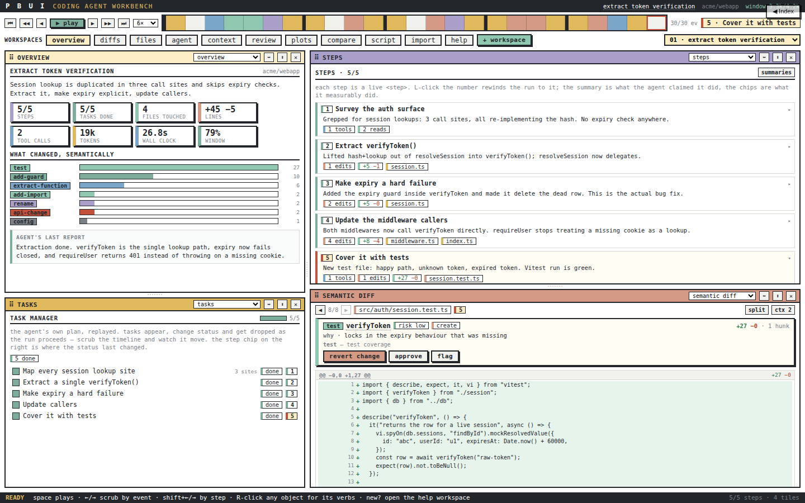


## Part A — Demo apps


### datalab-ui demo (vite, :5173) — `D-DL` (9 shots)

Directory: `various/screenshots/demos/datalab-ui/`

**D-DL-001 · marketing-hero** — Marketing landing page, hero section with live WorkbenchInstance  
_Landing page: black "DATA LAB" wordmark top-left, nav links, live `WorkbenchInstance` hero on the right showing a PIPELINE tile (lavender/purple header bar) above a CHART tile (salmon/coral header bar)_  
→ tile header colour is keyed to app kind (purple=pipeline, coral=chart) — a coding no other demo uses this consistently  
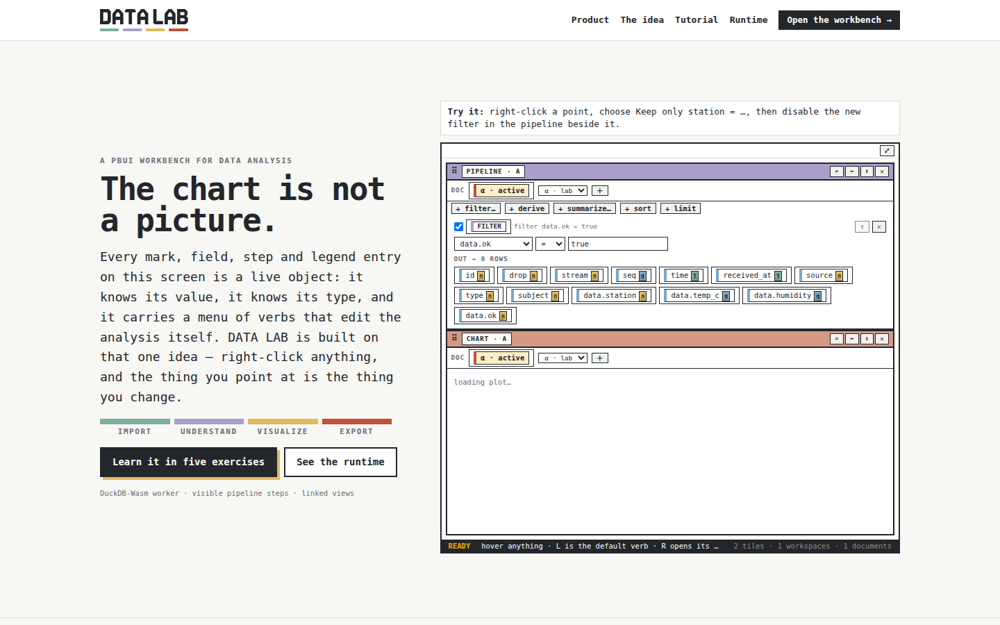

**D-DL-002 · marketing-nav-hover** — Hover state on a marketing nav button  
_Hover state on "Product" nav button — text underlines, no background change_  
→ subtle; easy to miss as a hover affordance (no box, no colour)  


**D-DL-003 · marketing-tutorial-band** — Marketing page scrolled to the tutorial band  
_Page scrolled to interactive tutorial: numbered LESSONS tile (purple header) above a CHEAT SHEET tile (pale-yellow header) with a two-column key/definition table_  
→ good density; note LESSONS purple vs CHEAT SHEET's pale-yellow is the same purple/yellow pairing seen on PIPELINE/ENCODING in the workbench — a deliberate per-kind palette  
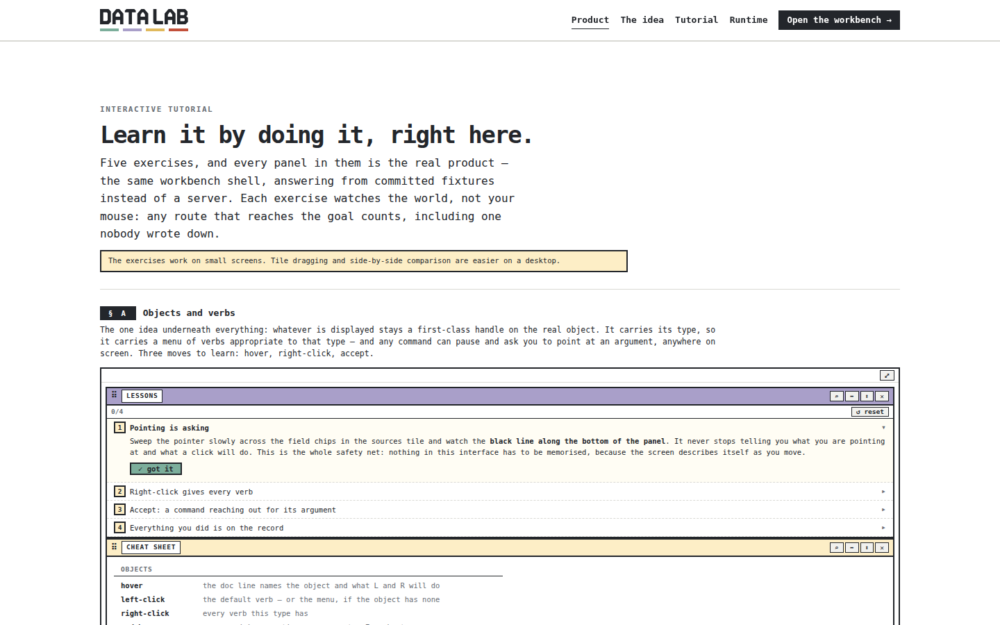

**D-DL-004 · workbench-initial** — Datalab workbench, initial stage/workspace  
_`/ui/` workbench: 4 stacked tiles top-to-bottom — PIPELINE (purple bar), ENCODING (mustard/gold bar), CHART (coral bar), TABLE (teal bar) — each with its own colour; top masthead is solid black with small-caps nav; second light-gray row holds pill-shaped WORKSPACES buttons (build/explore/gallery/help) plus a green "+ workspace" button_  
→ 4 distinct saturated header colours in one screen is a lot of colour for a monochrome-otherwise UI; teal for TABLE, coral for CHART — no legend explaining the mapping  
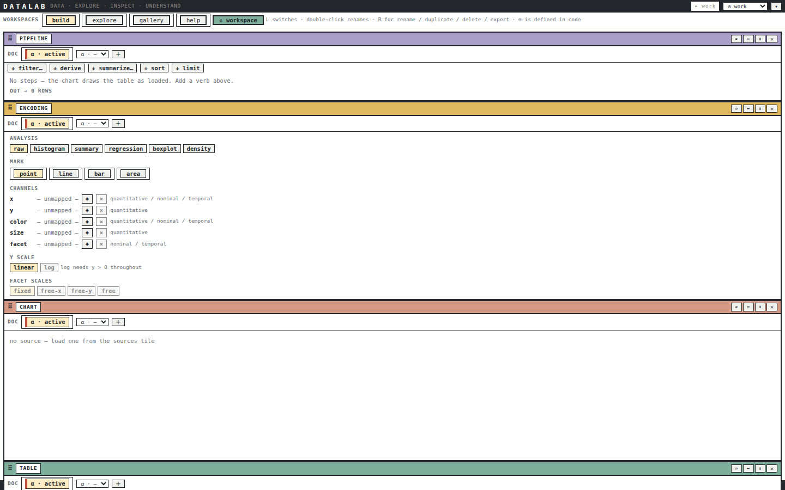

**D-DL-005 · tile-object-menu** — Object menu open on a tile title presentation  
_Right-click menu on the PIPELINE tile bar: black background, white text, header row `<tile> pipeline`, then left-aligned menu items (Replace…, Rename…, Create linked duplicate, Duplicate, Split right, Split below, Copy view to clipboard, Replace from clipboard…, Save as a template…, Inspect, Remove from this workspace, Close view)_  
→ menu is tall (12 items) and un-grouped — no separators between "structural" (split/duplicate) and "destructive" (close) actions, unlike ecommerce/chat menus which visually separate a danger-red item  
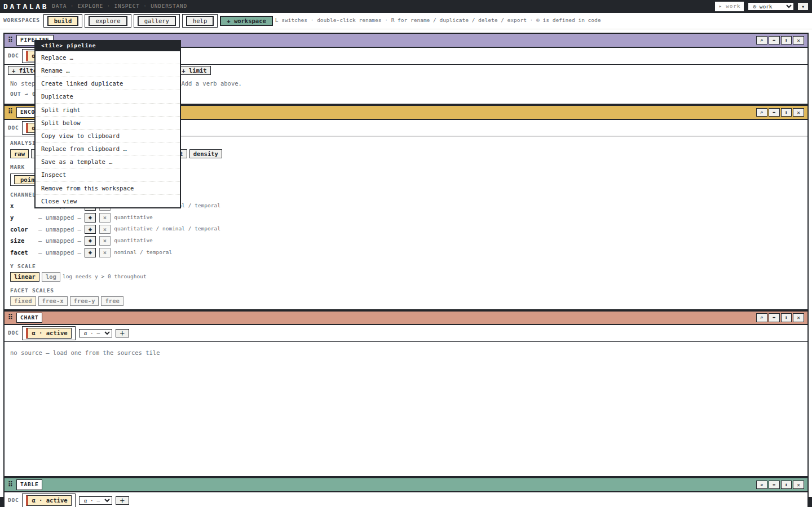

**D-DL-006 · doc-chip-object-menu** — Object menu open on a <doc> chip (α/β/γ)  
_Right-click menu on the "α · active" doc chip: black/white header `<doc> α`, items Snapshot it, Duplicate document, Delete document, Inspect, Add to watchlist_  
→ no "Link to…" family on doc chips in this build — datalab's accept/link flow (if any) is not reachable from the two presentation types tried here  
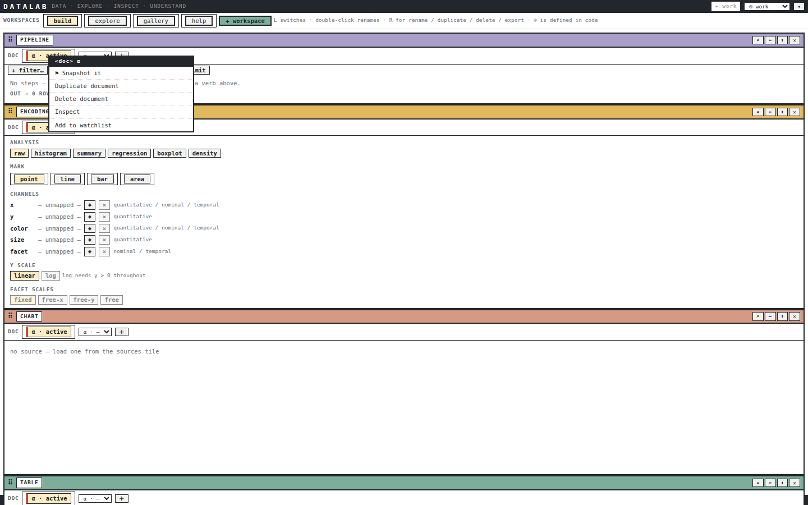

**D-DL-007 · launcher-open** — Launcher dialog (Mod+K)  
_"GO TO VIEW" panel: white box with black border, positioned inline over the ENCODING tile (NOT centered, NOT dimming the rest of the screen), search input, flat result list, "WS1 · BUILD" section header, small × button top-right_  
→ very different chrome from the other three demos' launcher (see cross-demo notes) — no backdrop dimming at all, background tiles stay fully visible and interactive-looking  
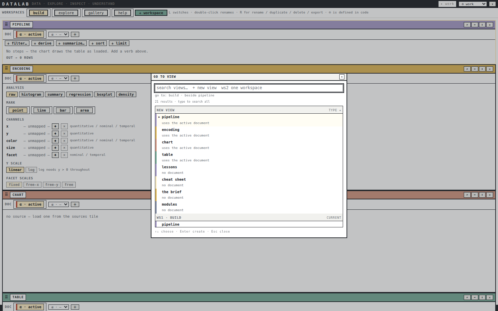

**D-DL-008 · launcher-filtered** — Launcher filtered by query  
_Same panel filtered to "chart": results grouped by workspace (WS1·BUILD, WS2·EXPLORE, WS3·GALLERY, START HERE, 3·ENCODE, 4·DOCS) each with a coloured 3px left-edge bar (purple/teal/gold)_  
→ the left-edge colour bars here don't obviously match the tile-header colours from 004 (e.g. "chart" rows show a teal or gold edge, not coral) — a second, uncoordinated micro-palette  
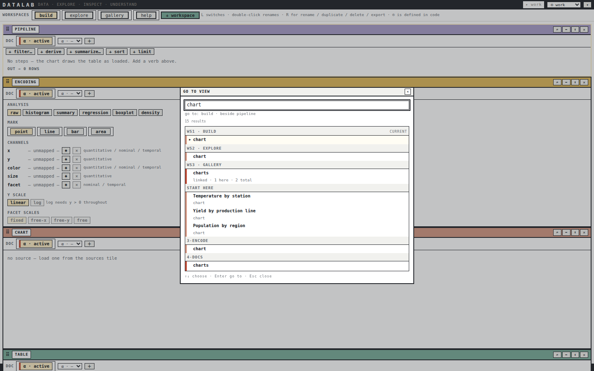

**D-DL-009 · stage-bar** — Stage switcher select in the masthead  
_Workbench with the PIPELINE tile now inside a black 2px focus outline (from prior interactions); stage switcher `▸ work` / `⊚ work ▾` select visible top-right of masthead_  
→ the focus-ring style (solid black double border) is unique to datalab in this set — not seen on ecommerce/chat tiles  
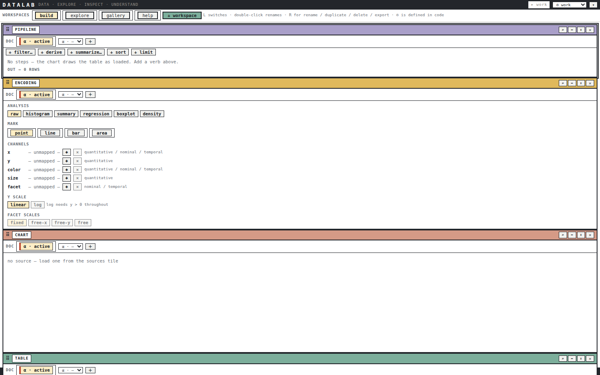


### pbui-chat demo (:5174, Go backend on :8090) — `D-CH` (9 shots)

Directory: `various/screenshots/demos/pbui-chat/`

**D-CH-001 · shop-initial** — Gold Coin Shop initial workbench layout  
_"GOLD COIN SHOP · agent" on a solid **black** masthead, white bold uppercase wordmark, checkbox + buttons top-right; workspace-strip row below (light gray, "▸ main +"); 2×3 tile grid: NEW CONVERSATION (large, left), INSPECTOR/WATCHLIST/TRACE stacked right; amber "READY" status bar at the very bottom_  
→ INSPECTOR tile header is pale yellow, the other three tiles (NEW CONVERSATION, WATCHLIST, TRACE) are plain off-white — inconsistent per-kind colouring (only one of four tiles is coloured)  


**D-CH-002 · approver-role-on** — Approver role checkbox toggled on  
_Same layout, "approver role" checkbox now checked (blue fill)_  
→ checkbox fill colour (blue) doesn't match any accent used elsewhere in this demo (masthead is black/white, tiles are white/pale-yellow) — an isolated blue  
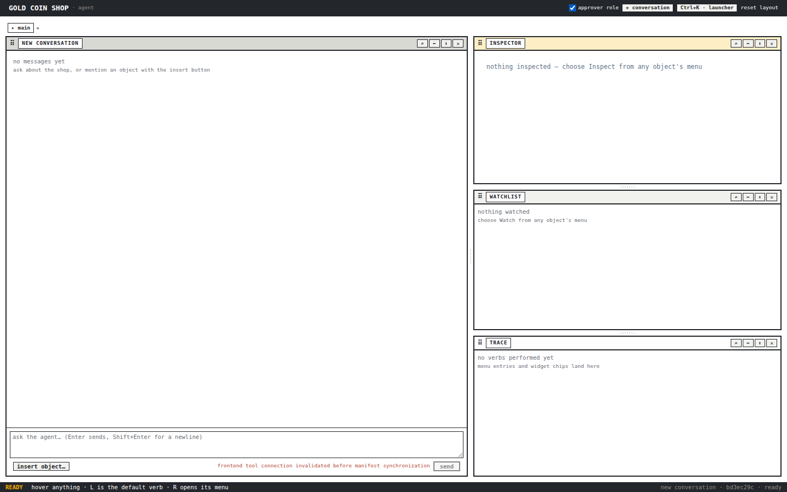

**D-CH-003 · tile-object-menu** — Object menu open on a tile title  
_Object menu on NEW CONVERSATION tile bar: black/white header `<tile> new conversation`, items Split beside, Split below, Show something else here…, Duplicate, Name this tile…, **Close tile** (red text), Ask the agent about this tile, Ask the agent to rearrange this_  
→ red "Close tile" for the only destructive item — good, consistent with ecommerce's red for cancelled/danger states  
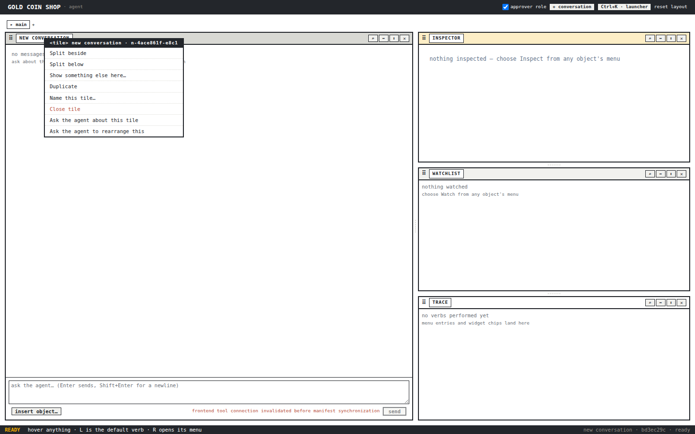

**D-CH-004 · second-tile-object-menu** — Object menu on a second tile (no Link to… family here either)  
_Object menu on INSPECTOR tile bar: black/white header `<tile> inspector`, "Duplicate" item shown disabled/italic in orange ("this application shows one view; splitting links a second tile to it")_  
→ no "Link to…" item anywhere in this demo's menus — the Gold Coin Shop *chat* variant has no cross-tile linking, unlike the Gold Coin Shop *ecommerce* variant which is built entirely around "Link to…"  
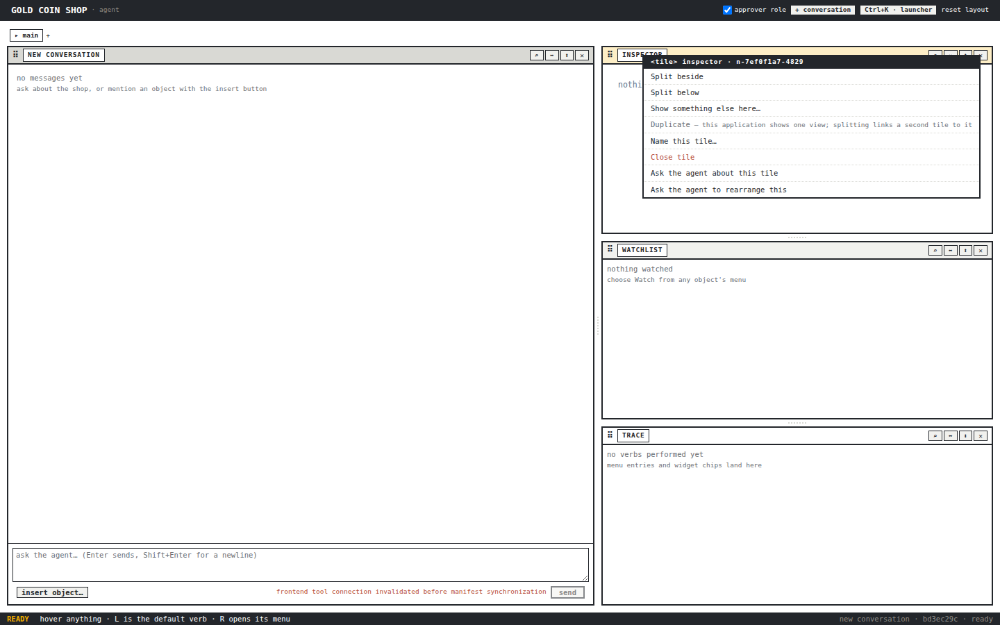

**D-CH-005 · launcher-open** — Launcher dialog (⌘K/Ctrl+K)  
_"Place an application" — centered white modal, dimmed/greyed backdrop covering the whole app, bold title top-left, × top-right in its own box, search input, grouped rows (ON SCREEN / agent / GOLD COIN SHOP / SANDBOX)_  
→ strong contrast with datalab's inline undimmed launcher (007 in that set) — same product family, two different dialog patterns  


**D-CH-006 · launcher-via-button** — Launcher opened via the toolbar button  
_Identical to 005 (opened via the toolbar "Ctrl+K · launcher" button instead of the shortcut)_  
→ confirms shortcut and button converge on the same UI — no finding  
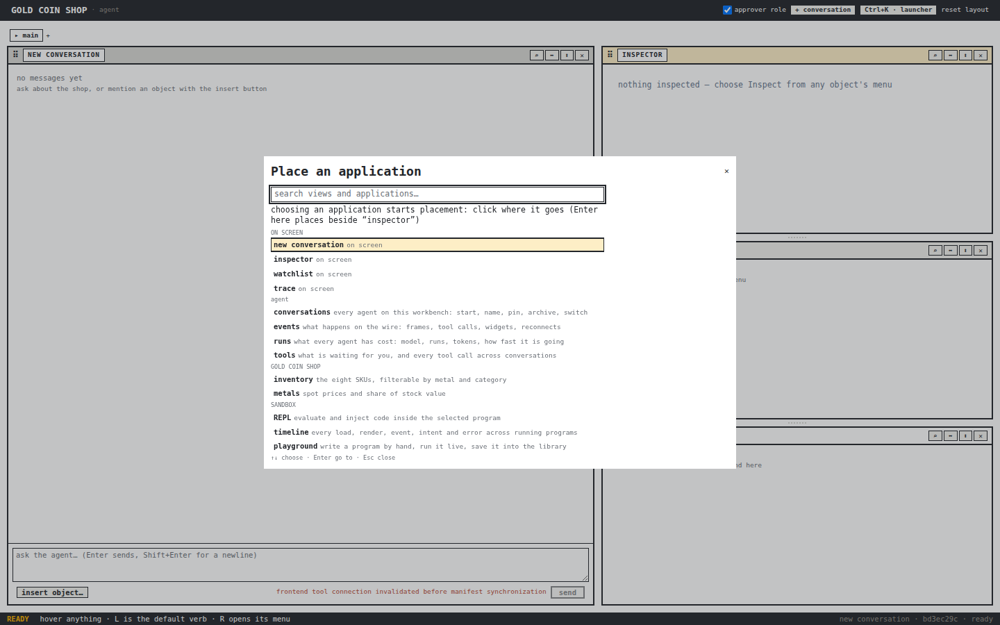

**D-CH-007 · new-conversation** — A second conversation tile opened via + conversation  
_A second NEW CONVERSATION tile added top-right via "+ conversation", pushing INSPECTOR down_  
→ reasonable; conversation tiles are visually identical (no distinguishing colour/number until you read the title)  
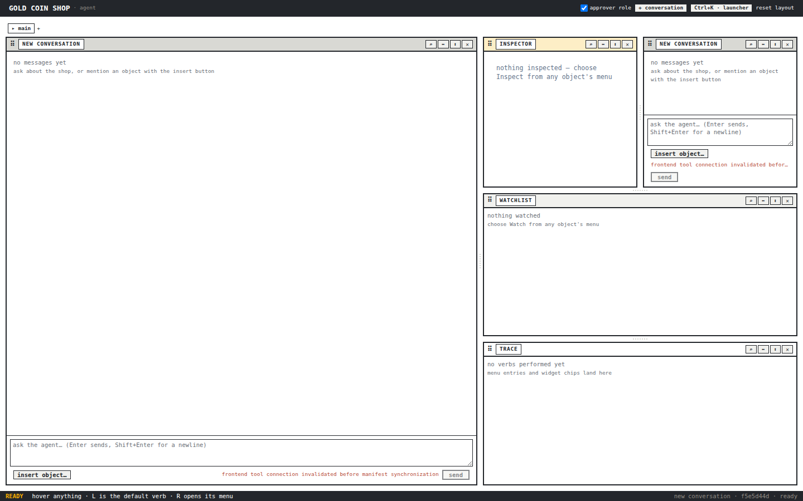

**D-CH-008 · rebalance-dialog** — Rebalance layout-repair dialog (Mod+Shift+K)  
_"Rebalance workspace" modal: two side-by-side proposal cards ("LEAVE AS IS +5 agree" / "W+ BALANCE every split 1/n") each with a small black/pale-blue/mint thumbnail of the resulting layout, Apply+close / Apply / Undo buttons_  
→ same dialog chrome as launcher (centered, dimmed) — good internal consistency; the thumbnail's black rectangle (representing a tile) reads as an error/void at a glance  
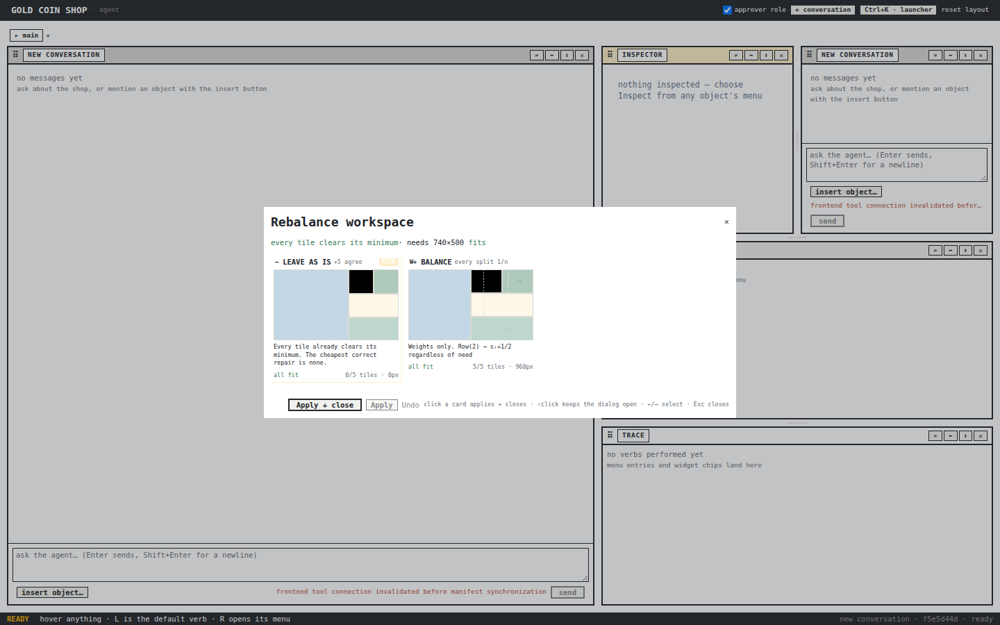

**D-CH-009 · workspace-strip-hover** — Hover state on a workspace strip item  
_"▸ main" workspace button hovered, pale gold/tan highlight fill; bottom status bar now reads "workspace · 5 tiles · you are here — L: go to this workspace R: menu"_  
→ the gold hover fill reappears here and matches datalab's ENCODING/CHEAT-SHEET gold — looks like a shared `--pbui-tone-*` token, a good consistency point  
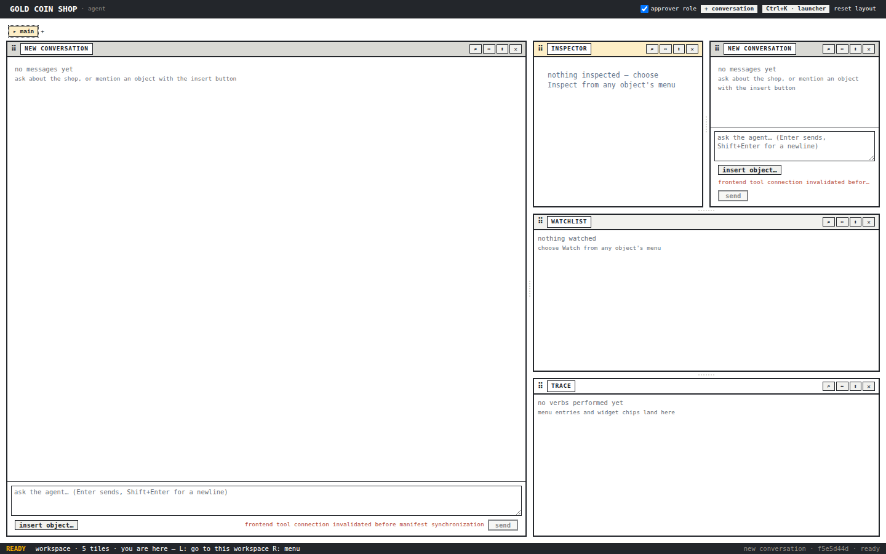


### pbui-plotscript demo (:5175) — `D-PS` (9 shots)

Directory: `various/screenshots/demos/pbui-plotscript/`

**D-PS-001 · workspace-initial** — Scripted plots demo, first example workspace (script + plot split)  
_"scripted plots" plain white masthead (no colour block at all), workspace tabs as plain underlined text "A · scatter  B · dodged bars  C · trend…" (active tab boxed); two tiles: SCRIPT (blue-gray header) code editor left, PLOT (orange/gold header) chart right_  
→ masthead has **no** black/dark band, unlike datalab and pbui-chat — a third visual treatment for "the top row" in this same design system  
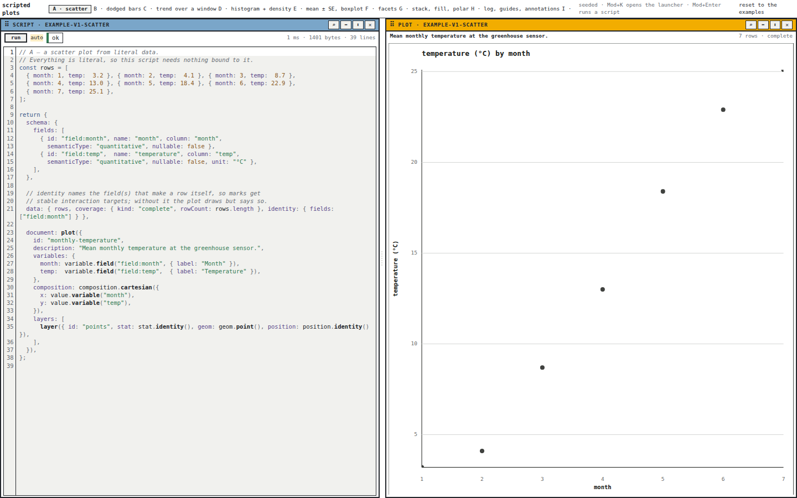

**D-PS-002 · workspace-strip-hover** — Hover state on a workspace-strip button  
_Hover on workspace tab "A · scatter" — no visible style change captured_  
→ tab hover appears to have no visible affordance, unlike the boxed-button hover treatments elsewhere  


**D-PS-003 · workspace-2** — Second example workspace (dodged bars)  
_Workspace "B · dodged bars" selected (now boxed/bordered), grouped bar chart shown (green=day, purple=night) with a legend swatch box top-right of the plot_  
→ plot legend swatches are small filled squares, no border — different chip style from every "chip" elsewhere in the audited demos (those are all outline-only)  
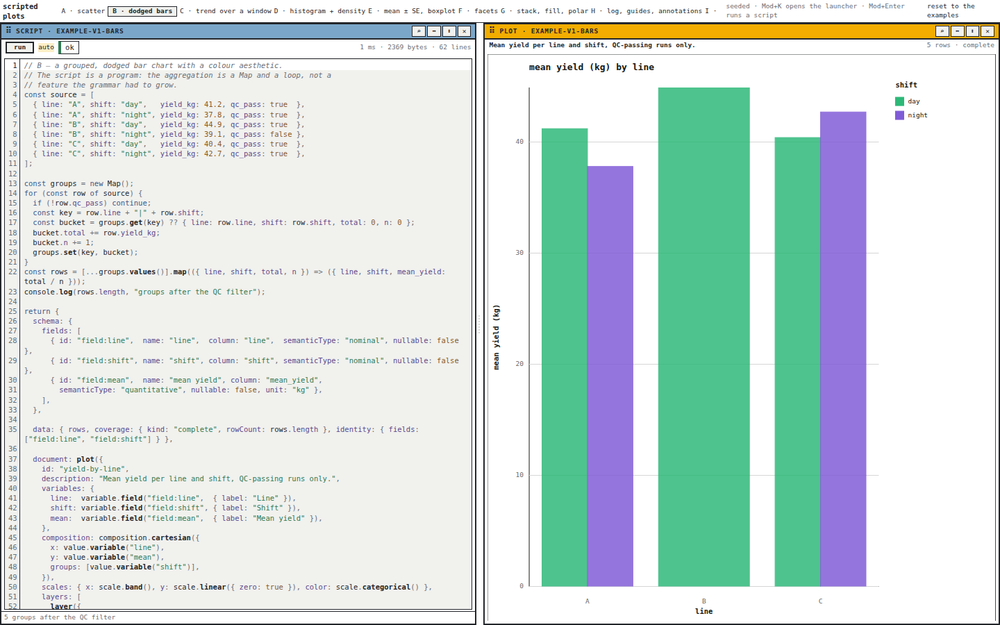

**D-PS-004 · workspace-3** — Third example workspace (trend over a window)  
_Workspace "C · trend over a window" — scatter + regression line plot_  
→ clean; consistent axis/label typography with 003  
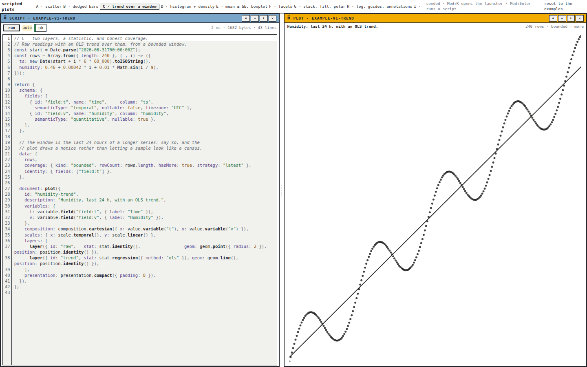

**D-PS-005 · launcher-open** — Launcher dialog (Mod+K)  
_"Open an application" — same centered/dimmed modal as pbui-chat/ecommerce, grouped ON SCREEN / other-workspace items_  
→ matches the shared pbui-workbench launcher chrome (good) — confirms datalab is the outlier, not this demo  
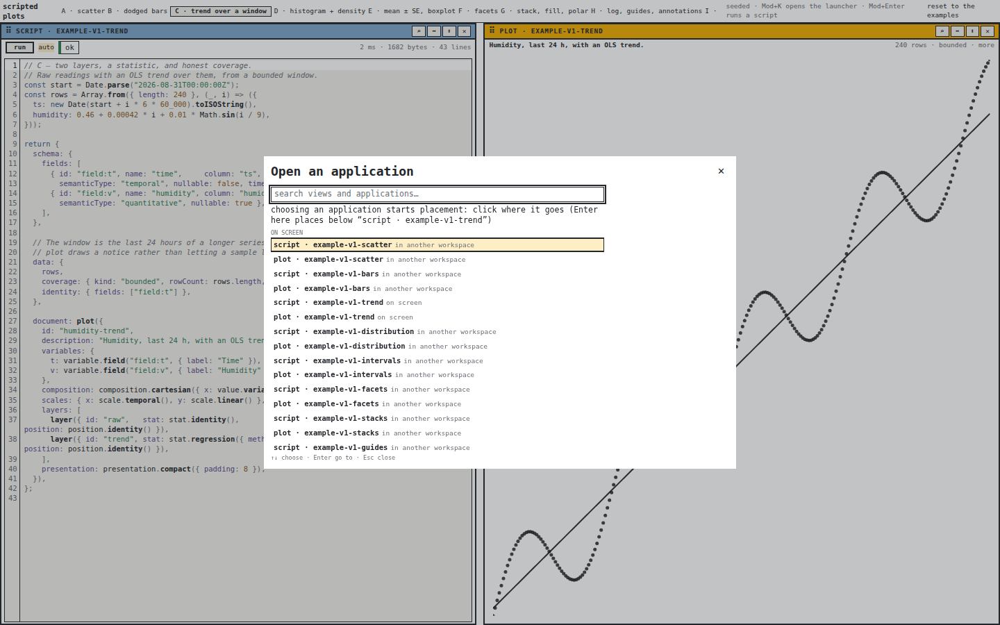

**D-PS-006 · rebalance-dialog** — Rebalance layout-repair dialog (Mod+Shift+K)  
_"Rebalance workspace" modal, same chrome as pbui-chat's, but only 2 tiles/"needs 490×160 fits"_  
→ consistent with pbui-chat's rebalance styling  
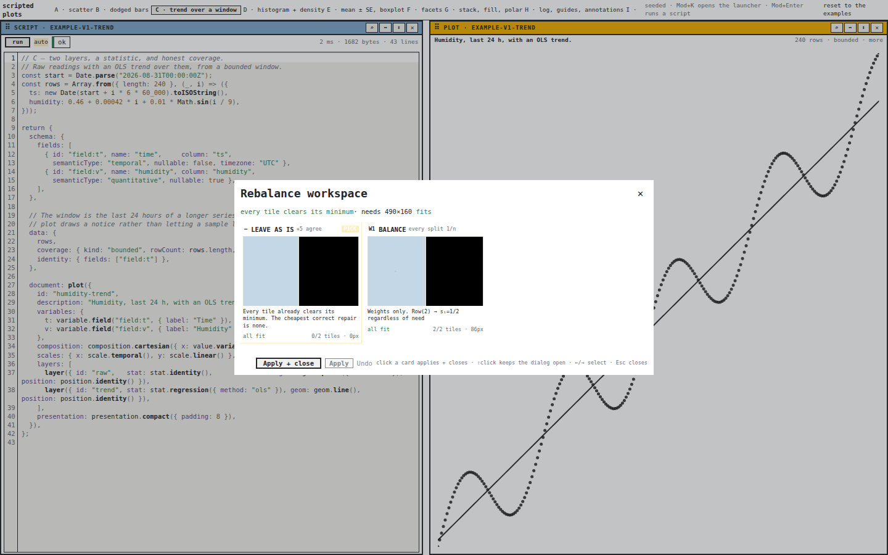

**D-PS-007 · script-run** — After running the focused script (Mod+Enter)  
_After Mod+Enter: SCRIPT tile shows a cursor caret in the editor body; PLOT unchanged (already rendered)_  
→ no visible "ran successfully" affordance (no toast, no flash) — silent success is fine but not verifiable from a screenshot alone  


**D-PS-008 · tile-action-hover** — Hover state on a tile-bar action button  
_Hover on a tile-bar icon button — no visible style change captured_  
→ same "invisible hover" pattern as 002  
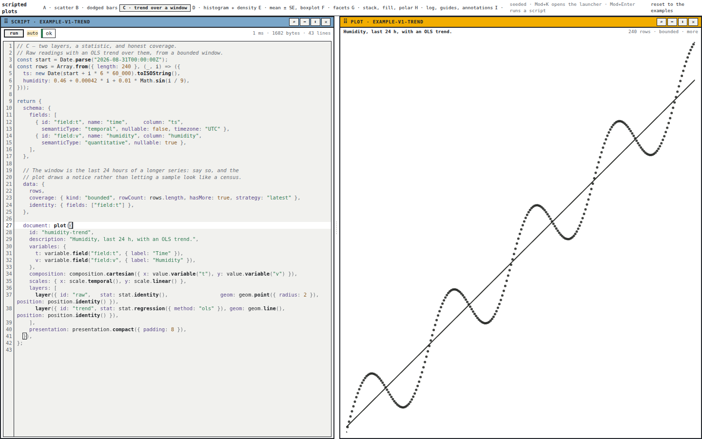

**D-PS-009 · split-divider-hover** — Hover state on the split divider between tiles  
_Hover on the vertical split divider between SCRIPT and PLOT — no visible style change captured_  
→ divider hover cursor change wouldn't show in a screenshot, but no colour/width change either, unlike ecommerce's dashed-outline hover on badges (pbui-ecommerce/007)  


### pbui-ecommerce demo (:5176) — `D-EC` (9 shots)

Directory: `various/screenshots/demos/pbui-ecommerce/`

**D-EC-001 · shop-initial** — Gold coin shop e-commerce demo, initial workbench layout  
_"gold coin shop" **lowercase**, plain paper-white masthead (no colour band), workspace tabs "orders customers sales catalog +" inline with the title; 3-tile layout: ORDERS table (large, left) / ORDER DETAIL (top-right) / INSPECTOR (bottom-right, pale-yellow header); every order id, status, and customer-name cell is individually boxed_  
→ extremely dense "everything is a bordered box" styling — order ids, status pills, and customer names all get 1px black-border rectangles, far more boxing than any other demo's tables (contrast datalab's TABLE tile, which has no per-cell boxes)  
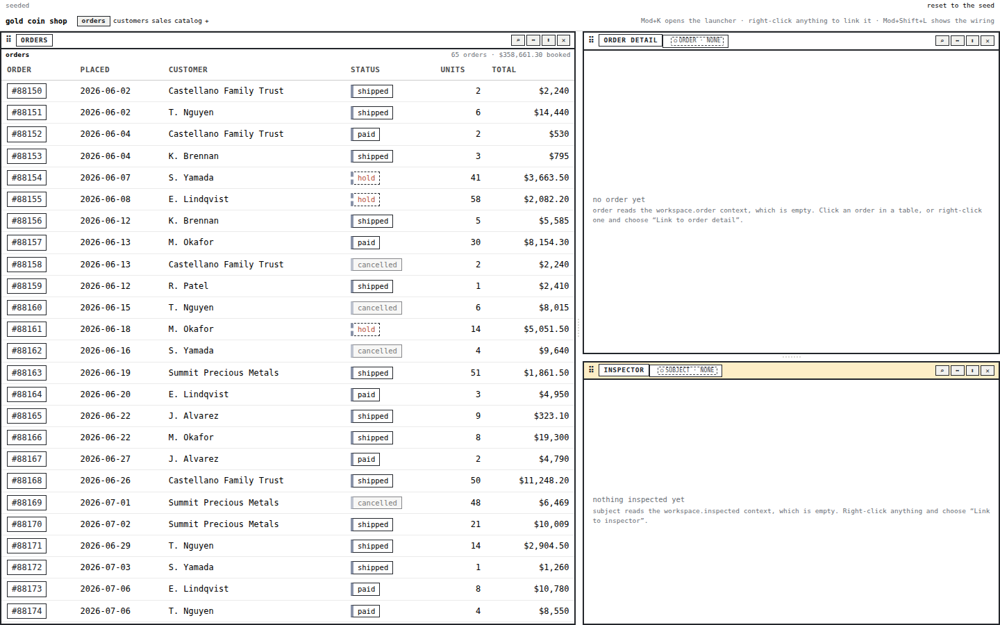

**D-EC-002 · tile-object-menu** — Object menu open on a tile title  
_Menu on ORDERS tile bar: black/white header `<tile> orders`, items Split beside, Split below, Show something else here…, Duplicate, Name this tile…, **Connect…** (blue), **Close tile** (red)_  
→ "Connect…" (blue) is a menu-item colour not seen in any other demo's tile-level menu — a third semantic colour (blue) alongside red/danger and gold/hover  
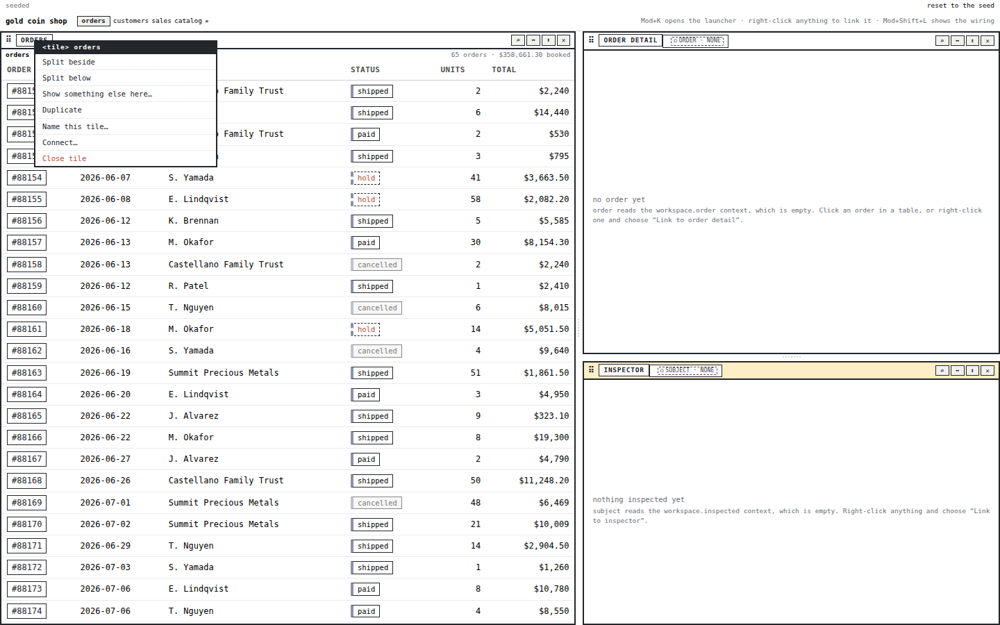

**D-EC-003 · row-object-menu** — Object menu open on a row/item presentation inside a tile  
_Right-click on order row #88150: black/white header `<order> #88150 · Castellano Family Trust`, items "Show details…", **Link to inspector · subject**, **Link to order detail · order**_  
→ this is the richest, clearest "Link to…" menu captured in the whole set — good reference for what the family should look like  
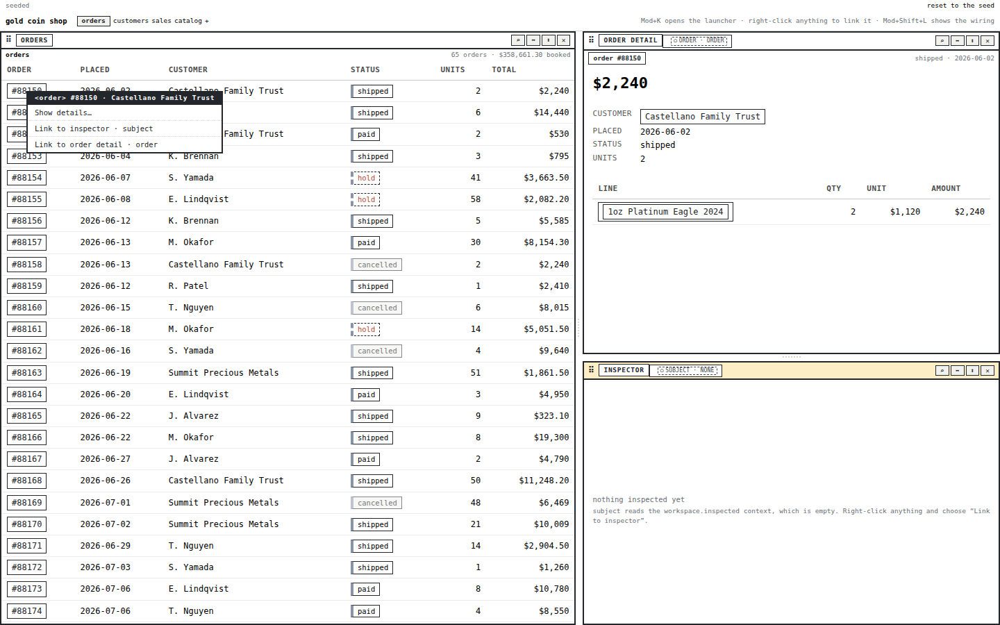

**D-EC-004 · accept-mode** — Accept/link mode — acceptable tiles/rows highlighted after choosing Link to…  
_After choosing "Link to inspector": ORDER DETAIL and INSPECTOR tiles both now show the order's data (linked), INSPECTOR renders raw JSON in a light-gray code block_  
→ this is the *result* of the link, not the intermediate "acceptable" picking state (only one candidate existed, so it resolved immediately) — worth a follow-up run with 2+ candidate targets if the intermediate `data-state="acceptable"` highlight needs a screenshot  
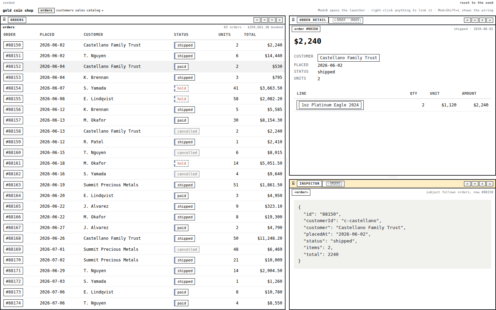

**D-EC-005 · launcher-open** — Launcher dialog (Mod+K)  
_"Open an application" modal — identical chrome to pbui-chat/pbui-plotscript, rows grouped ON SCREEN / in another workspace / GOLD COIN SHOP_  
→ confirms 3 of 4 demos share one launcher visual language; datalab is the outlier  
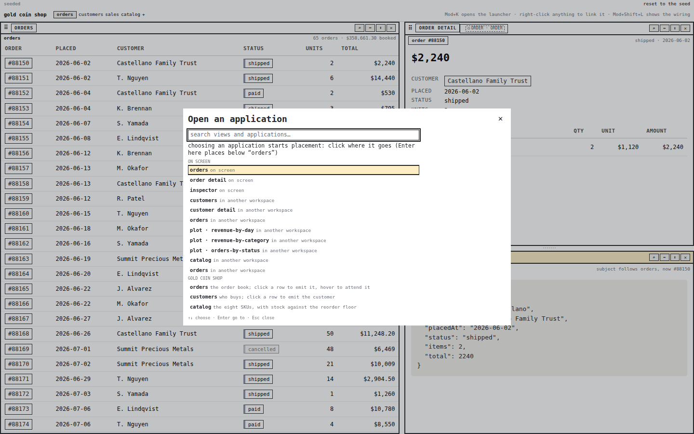

**D-EC-006 · wiring-view** — Link wiring overlay (Mod+Shift+L)  
_Mod+Shift+L: whole canvas dims to low-opacity gray-on-gray except four annotated boxes (selection/filter on ORDERS, order/selection on ORDER DETAIL) connected by a black line/arrow across tiles, with small doc-comment captions under each box_  
→ striking, unique visual (nothing like it exists in the other three demos) — worth considering whether this dim-and-annotate treatment should be reusable design-system chrome rather than ecommerce-only  
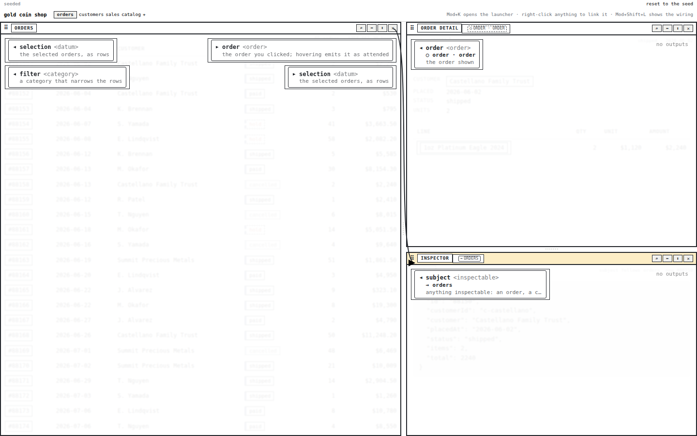

**D-EC-007 · badge-hover** — Hover state on a port badge chip  
_Hovering the "ORDER · ORDER" port badge in the ORDER DETAIL tile bar: dashed gold/orange outline box appears around it_  
→ good, visible hover affordance — contrasts with plotscript's invisible hover states (008/009 there)  


**D-EC-008 · workspace-strip-hover** — Hover state on a workspace strip item  
_Hover on "orders" tab (already active) — no visible change (expected, it's the current tab)_  
→ no finding  
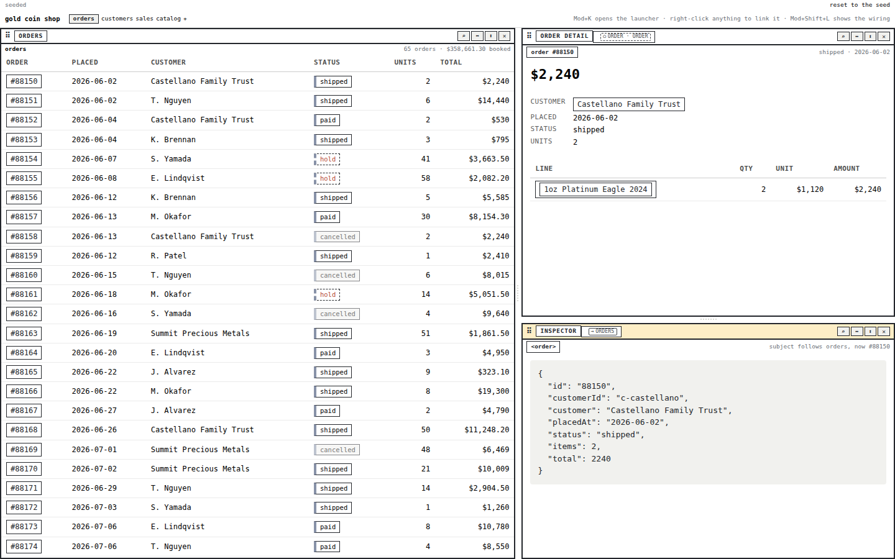

**D-EC-009 · workspace-2** — Second workspace (customers)  
_"customers" workspace: CUSTOMERS table (every customer name individually boxed) left, CUSTOMER DETAIL (empty state) top-right, ORDERS table bottom-right_  
→ same heavy per-cell boxing as 001; CUSTOMER DETAIL's empty-state copy style matches ORDER DETAIL's from 002 — good internal consistency  
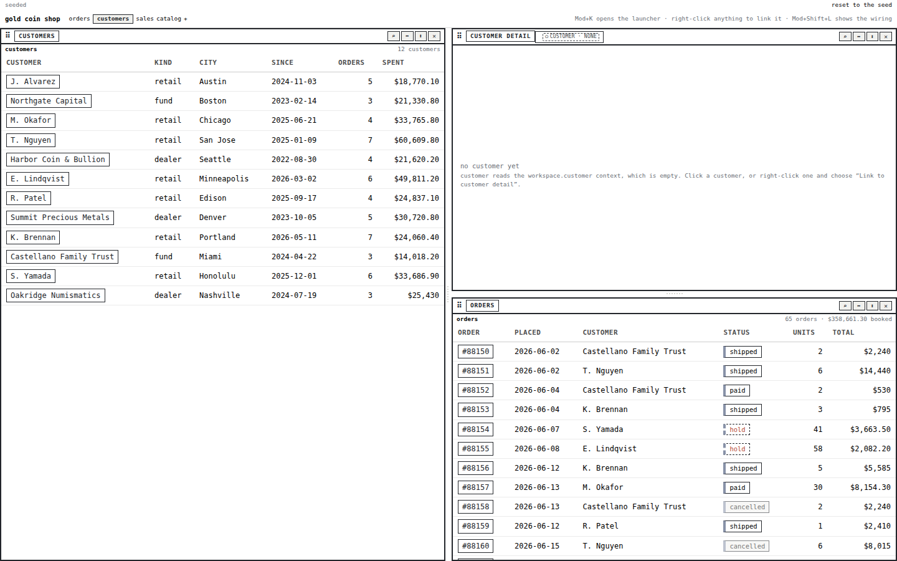


## Part B — Workbench and linking


### pbui-workbench storybook — `WB` (30 shots)

Directory: `various/screenshots/pbui-workbench/` · manifest: `manifest.json`


#### Workbench/CoordinationInspector

**WB-001 · the coordination tile beside a linked pair: ports, wires, contexts, invariants**  
_BLANK/NEEDS INTERACTION — fully white 320x120 canvas_  


#### Workbench/IdentityLab

**WB-002 · Lab**  
_BLANK/NEEDS INTERACTION — fully white canvas_  


#### Workbench/Launcher

**WB-003 · open: a placed singleton is “go to”, the rest “place”**  
_BLANK/NEEDS INTERACTION — fully white canvas_  


**WB-004 · per-pane: show something else in THIS tile**  
_BLANK/NEEDS INTERACTION — fully white canvas_  


**WB-005 · slot: a product's rows model**  
_"Open an application" modal (rounded white card, drop shadow) over a flat grey overlay, with a square-cornered COUNTER tile visible behind_  
→ modal uses rounded corners + shadow while the tile behind it uses sharp square corners and a flat border — two different chrome languages in one screenshot; the backdrop is flat grey rather than a translucent dark scrim  
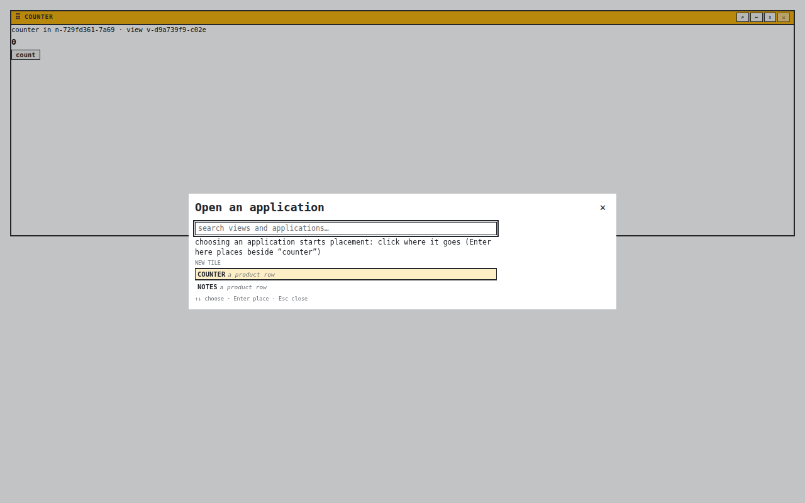


#### Workbench/LinkAnnouncer

**WB-006 · coordination announcements, coalesced per target**  
_"COUNTER A" tile with a solid orange/gold header bar beside "NOTES" tile with a pale cream/tan header bar_  
→ the two tiles use visibly different header-bar colors for what should be the same tile-title-bar component  
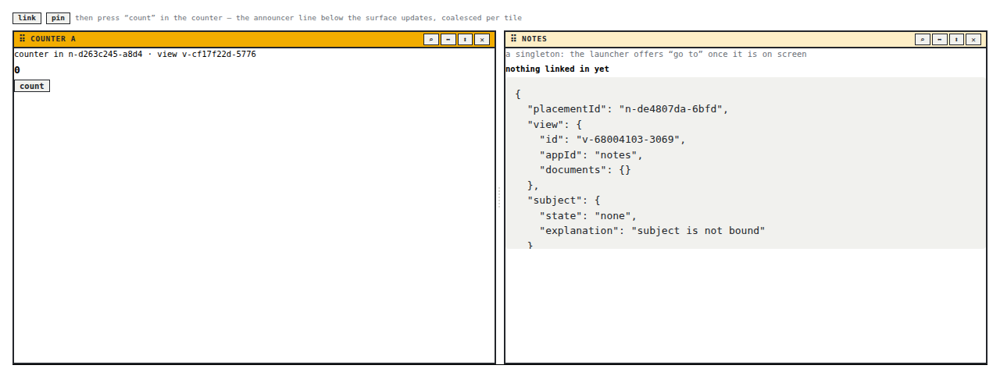


#### Workbench/LinkLab

**WB-007 · Lab**  
_same COUNTER A (orange) / NOTES (cream) tiles, plus a plain-text instruction bar with boxed pin/link/resume/detach/clear buttons_  
→ header-color mismatch repeats from 006; button row otherwise internally consistent  
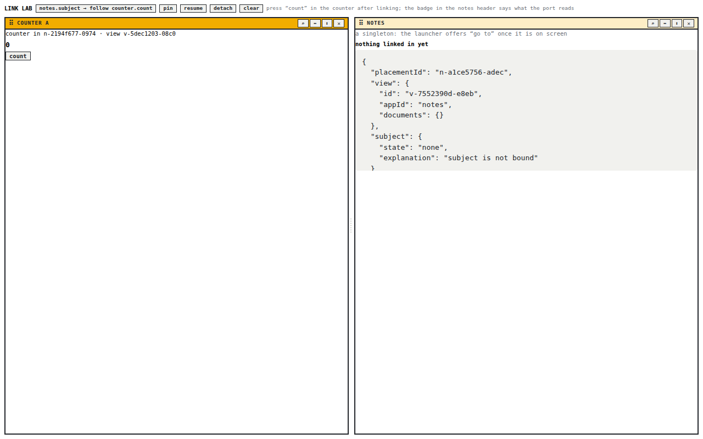


#### Workbench/PortBadge

**WB-008 · every badge state, as it sits after a tile title**  
_8 badge chips in a vertical list, each with a different border treatment_  
→ dotted borders, solid thin borders, a bold/thick border, and a double-line border are all used across badges that are otherwise the same size/shape — many distinct border styles for one badge family  
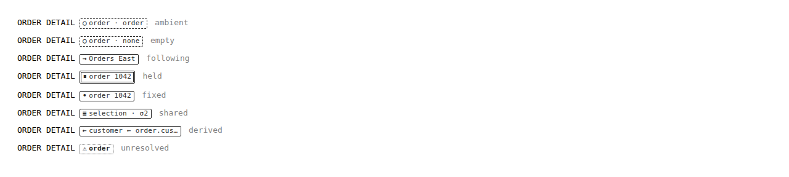


#### Workbench/PortRail

**WB-009 · a wire already declared: notes.subject follows counter.count**  
_a floating tooltip/popover sits over faint, ghosted background text that's barely legible underneath it_  
→ the tooltip has no drop shadow, so it reads as part of the base layout rather than a floating overlay; underlying content is washed out almost to invisibility  
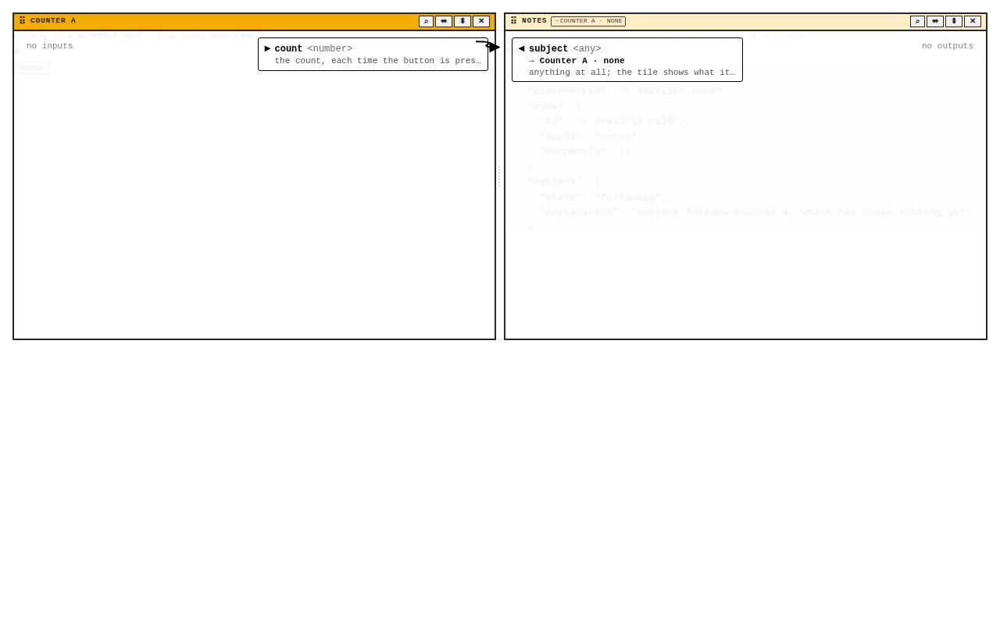

**WB-010 · connect mode: every tile flips to its rail; drag the counter's ▸ count onto the notes' ◂ subject**  
_same two-tile layout, no visible wire or drag-affordance drawn_  
→ the story name promises a visible wire/rail interaction but the static capture shows plain panel content with no graphic wire — needs interaction to render  
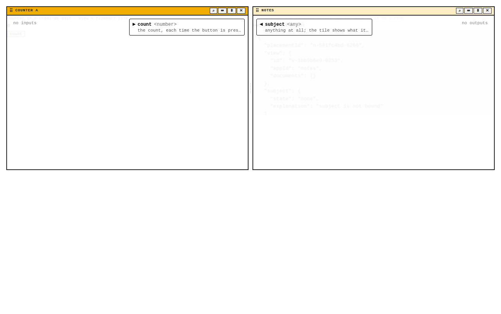


#### Workbench/RebalanceBadge

**WB-011 · Broken Sliver**  
_tiny red-orange-bordered chip "1 tile under minimum" floating next to plain status text, otherwise blank page_  
→ BLANK/NEEDS INTERACTION — badge appears orphaned with no surrounding tile/toolbar chrome  
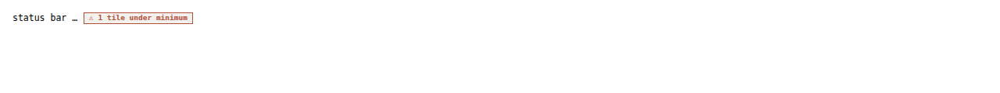

**WB-012 · Healthy**  
_plain text "status bar …" only, otherwise blank page_  
→ BLANK/NEEDS INTERACTION  
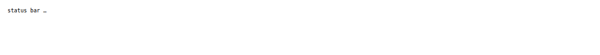


#### Workbench/RebalanceDialog

**WB-013 · Broken**  
_"Rebalance workspace" modal over a grey overlay, comparison cards each with a diagram and stats, action row_  
→ three different affordance styles sit in one action row: a solid/filled button, an outline button, and a bare text link ("Undo") with no button chrome at all  
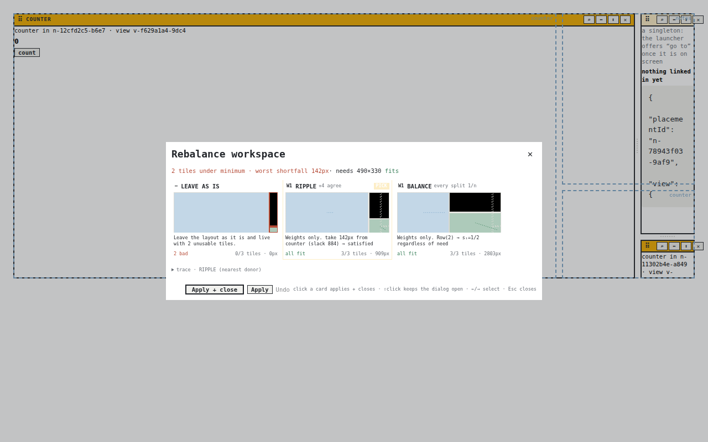

**WB-014 · Shortcut Closed**  
_one tile plus a second tile column cropped at the right edge of the viewport, text truncated mid-line_  
→ layout appears clipped by container width — right-hand panel headers/content are cut off by the image edge rather than wrapping  
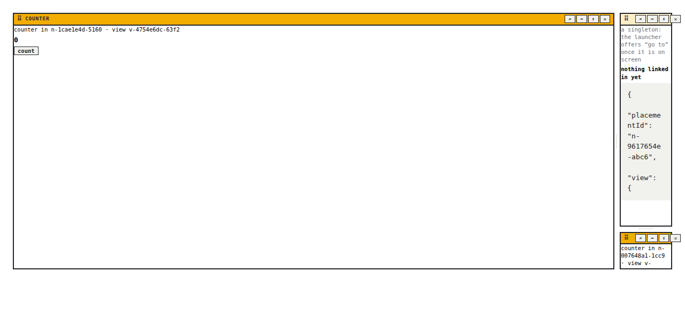


#### Workbench/RebalanceLab

**WB-015 · Lab**  
_"LAYOUTS" toolbar with 9 boxed buttons (one selected/bold), status line, 3 orange-headed COUNTER tiles below_  
→ "REBALANCE · Ctrl+Shift+K" label sits top-right as bare unstyled text in the same row as the boxed layout buttons — inconsistent affordance styling within one toolbar  
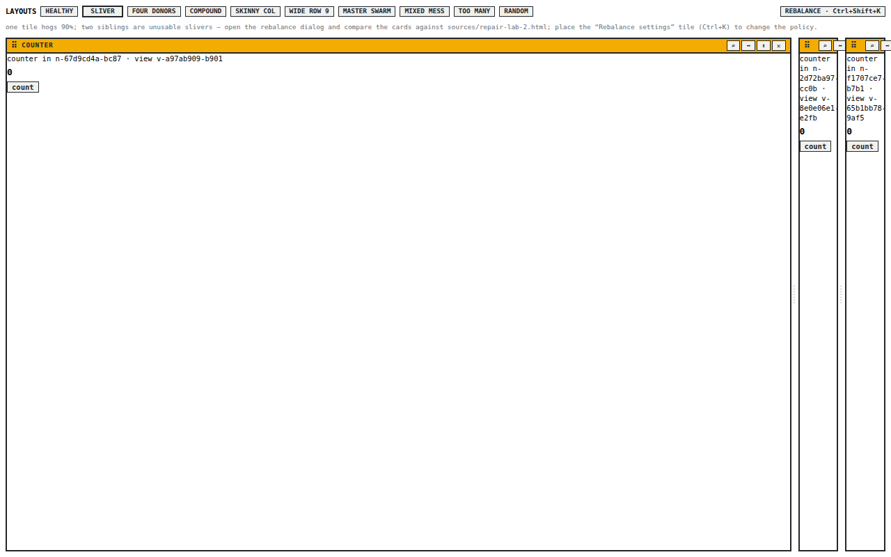


#### Workbench/RebalanceSettings

**WB-016 · Default**  
_COUNTER tile (orange header) beside REBALANCE SETTINGS tile with a distinct blue-grey/slate header bar_  
→ a third tile-header color (slate-blue) appears here, on top of the orange/cream mismatch already seen in 006/007/018 — three different header colors now observed for the same tile-title-bar role  
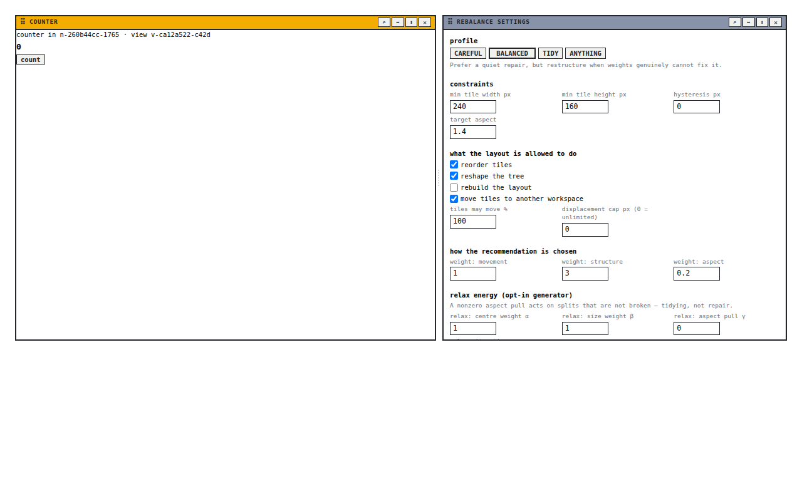


#### Workbench/RelationPalette

**WB-017 · the palette for notes.subject: two relations from the counter's count**  
_"DERIVE…" modal over COUNTER A (orange)/NOTES (cream) tiles with a grey overlay; NOTES tile's JSON code block reads darker/greyer here than elsewhere_  
→ code-block background shade appears to shift under the modal dimming — unclear if that's the overlay or an actual inconsistent token  
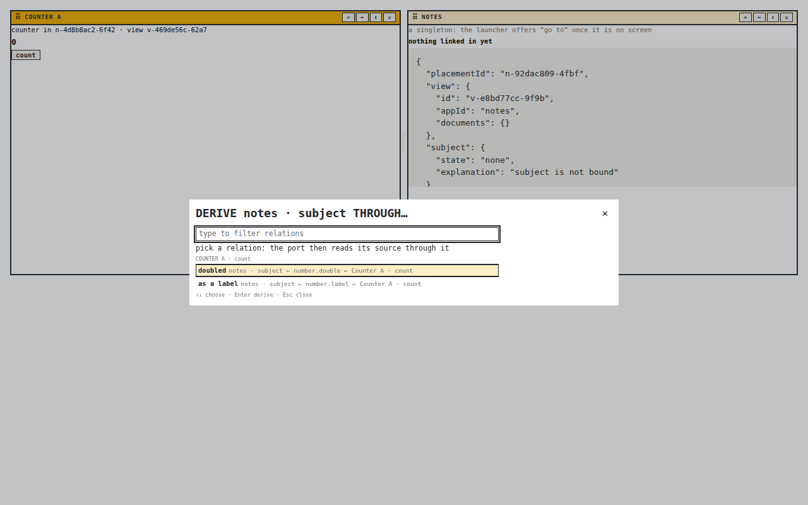


#### Workbench/ShowChooser

**WB-018 · a show with nothing on screen to take it: the chooser offers the spawnable notes tile at two placements**  
_4 tiles (COUNTER A/B/C orange, NOTES cream with a tag chip)_  
→ header-color mismatch (orange vs cream) persists across this grid  
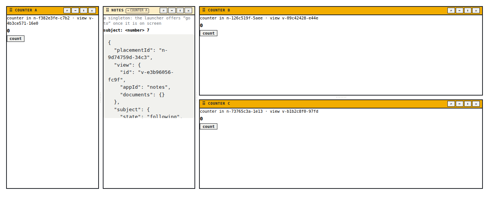


#### Workbench/SplitPane

**WB-019 · nested splits, each divider independently resizable**  
_2x2 nested tile grid, dotted drag-handle marks between panes_  
→ NOTES tile header (cream) again mismatched against the three COUNTER tiles (orange)  
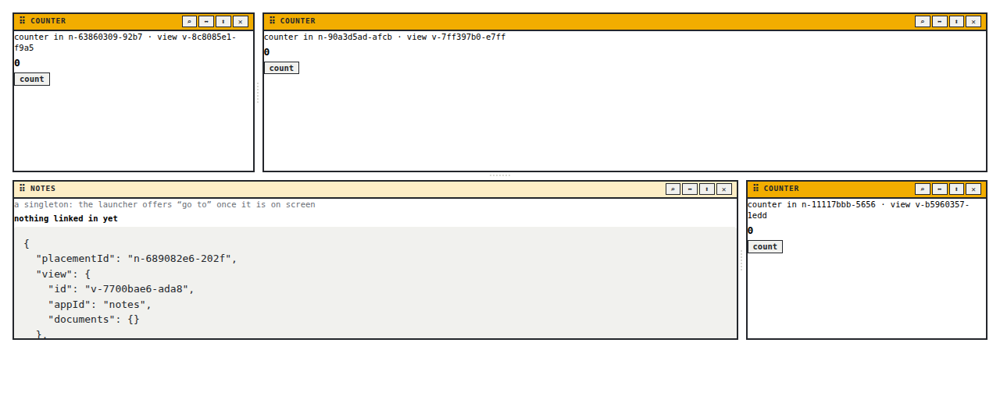


#### Workbench/Surface

**WB-020 · drag: centre swaps the two applications, an edge docks the source beside the target**  
_COUNTER (orange) + NOTES (cream) side by side with instruction text above_  
→ same header-color mismatch as prior screenshots  
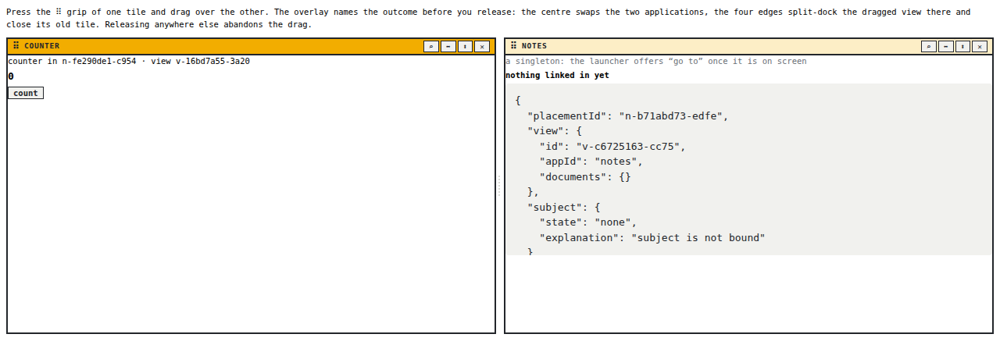

**WB-021 · launcher (⌘K / Ctrl+K) and serialize()/restore()**  
_toolbar row with two boxed buttons plus a bare grey text stat with no chip/box_  
→ a bare text stat sits in the same row as two fully-bordered buttons — inconsistent control styling within one toolbar  
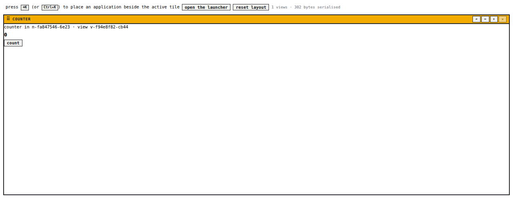

**WB-022 · placement mode: aim a document at a pane (5.E)**  
_instruction bar with two filename buttons, both rendered with the same filled/bold background_  
→ both file-target buttons look equally "selected/active" at once, with no visual distinction for which is the current target  
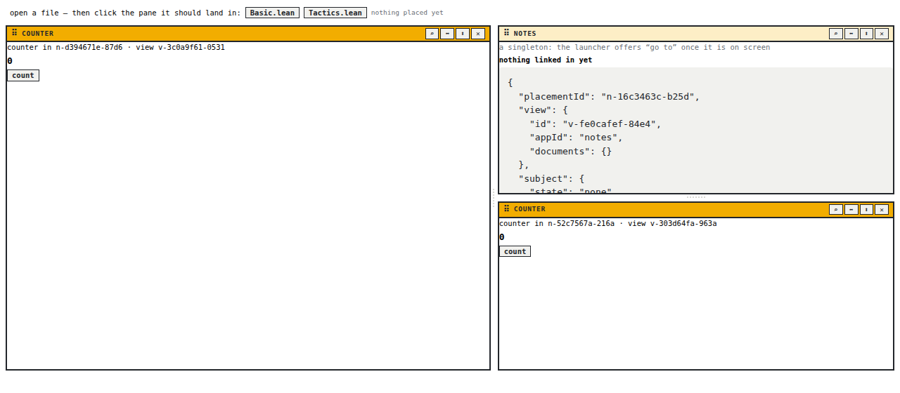

**WB-023 · resize: drag the divider; it snaps at ¼ ⅓ ½ ⅔ ¾ and the arrow keys nudge it**  
_NOTES (cream) + COUNTER (orange) tiles side by side_  
→ header-color mismatch persists; otherwise clean  
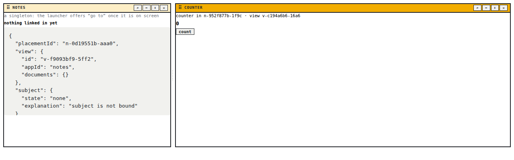

**WB-024 · three tiles: split, close, drag the ⠿ to swap or dock**  
_3 orange-headed tiles in an L-shaped split_  
→ consistent within this screenshot (all headers orange) — no NOTES tile present to contrast against  
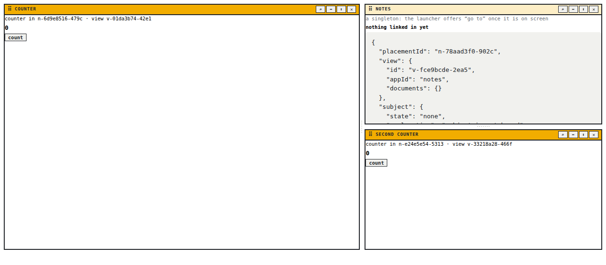


#### Workbench/Tile

**WB-025 · a view of an application this build lacks** ⚠ `workbench-core: unknown_application at views["v-2f6ffd4b-4f3f"].appId: application "retired-app" is not registered`  
_rounded white card, red left-border accent, red bullet, bold error text_  
→ text is clipped by the small 320x120 viewport; this card uses rounded corners + drop shadow, a visually different "modern" style vs the sharp square-cornered tile chrome used everywhere else in the package  


**WB-026 · renderTitle: the product's own title presentation in the bar**  
_COUNTER tile with "· 1 PLACE" appended as plain text in the orange header, NOTES tile (cream) with the same suffix_  
→ the annotation is bare text in the title bar rather than a badge/chip, unlike the dedicated badge-chip component shown for port states (008); header-color mismatch also persists  


#### Workbench/WireLayer

**WB-027 · wire styles: dotted for a held (suspended) follow, dashed and labelled for derived**  
_tiles with a floating tooltip overlapping faint ghosted background content_  
→ same ghosting/overlap issue as 009; no dotted/dashed wire graphic is actually visible in the static capture despite the story title promising wire styling  


#### workbench/WorkspaceStrip

**WB-028 · Custom Row**  
_tab strip: active tab boxed/bold, inactive tabs plain unboxed text_  
→ only the active tab gets a box; a different selection convention than the "LAYOUTS" toolbar (015) where every button stays boxed regardless of selection  


**WB-029 · Default**  
_tab strip, one boxed active tab, others plain text_  
→ same active-vs-inactive tab styling inconsistency as 028  


**WB-030 · With Add**  
_tab strip, "+" add control with no button chrome at all_  
→ bare plus glyph not visually distinguished as clickable compared to bordered buttons used elsewhere  


### pbui-workbench: Visual Audit stories (new) — `WA` (12 shots)

Directory: `various/screenshots/workbench-audit/` · manifest: `manifest.json`


#### Visual Audit

**WA-001 · CoordinationInspector — ports, wires, contexts, invariants**  


**WA-002 · LinkAnnouncer — a few coordination messages, made visible**  


**WA-003 · PortBadge — every state, as it sits after a tile title**  


**WA-004 · PortRail — 0 / 1 / many ports, connect mode**  


**WA-005 · RebalanceDialog — open over a degenerate layout**  


**WA-006 · RebalanceSettings tile + RebalanceBadge, healthy vs broken**  


**WA-007 · RelationPalette — open, two relations offered**  


**WA-008 · ShowChooser — a show with no clear target**  


**WA-009 · SplitPane — nested, each divider independently resizable**  


**WA-010 · Surface — single tile / split / nested split**  


**WA-011 · Tile — header variants**  


**WA-012 · WireLayer — follow, held (dotted), derived (dashed + label), identity (double)**  


### Workbench + linking: driven interactions — `WI` (7 shots)

Directory: `various/screenshots/workbench-interactions/` · manifest: `manifest.json`


#### shop-scenes--scene-1-ambient

**WI-001 · right-click-menu-open**  
right-click an order row: the object menu opens, offering “Link to order detail · order” among other rows  


**WI-002 · connect-mode-acceptable-highlighted**  
Mod+Shift+L then drag ▸ order toward ◂ order mid-flight: the wire-cursor names Follow(...) and the acceptable input lights up before release  


#### shop-scenes--scene-5-incompatible

**WI-003 · connect-mode-refused-target**  
Ctrl-drag onto an incompatible port: the wire-cursor says “cannot share with …” and the target is data-acceptable=false  


#### shop-scenes--scene-7-connect-mode

**WI-004 · completed-link-wires-and-badges**  
connect mode over an already-linked pair: the wire is drawn and the badges at both ends show their state  


#### shop-scenes--scene-2-hold

**WI-005 · paused-pinned-link**  
the detail is pinned (held) on order #88213; the badge reads ⏸ and the row selection no longer moves it  


#### shop-scenes--scene-3-show

**WI-006 · ambiguity-menu-two-targets**  
right-click an order with two open detail tiles: the object menu lists “Link to detail A · order” and “Link to detail B · order” — the user disambiguates by picking a row  


#### workbench-rebalancelab--lab

**WI-007 · rebalance-dialog-proposals**  
RebalanceLab: SLIVER preset (one tile hogs 90%), REBALANCE pressed — the dialog's proposal cards  


### pbui-ecommerce storybook (gold-coin shop) — `EC` (29 shots)

Directory: `various/screenshots/pbui-ecommerce/` · manifest: `manifest.json`


#### Shop/Scenes

**EC-001 · 1 · ambient: an unlinked detail follows the workspace's current order; click rows to move it (Phase 2)**  
_ORDERS table + ORDER DETAIL panel showing order #88213 unlinked_  
→ header link-badge pill next to "ORDER DETAIL" shows overlapping/garbled text inside a dashed border, hard to read vs. the clean solid-border badges elsewhere  


**EC-002 · 2a · follow: right-click an order → Link to order detail · order; the badge reads → orders (Phase 2)**  
_ORDERS + ORDER DETAIL (#88214, badge "← ORDERS") + empty INSPECTOR panel below_  
→ INSPECTOR panel header has a pale cream/tan fill while the sibling ORDERS and ORDER DETAIL headers directly above are plain white — inconsistent header color within the same column  


**EC-003 · 2b · hold: the detail is pinned on #88213; click the badge for Resume / Detach (Phase 2)**  
_ORDERS + ORDER DETAIL pinned (badge "# #88213") + empty INSPECTOR panel_  
→ same cream/tan INSPECTOR header vs. white ORDERS/ORDER DETAIL headers as in 002  


**EC-004 · 3 · show with routing: detail A is held; right-click an order → “Show details…” goes to detail B; with no detail open it spawns one (Phase 4)**  
_ORDERS + two stacked order-detail panels (Detail A #88213, Detail B #88201), badges render clean_  


**EC-005 · 3b · show with nothing to take it: “Show details…” opens a detail beside the table and links it in one plan (Phase 4)**  
_only the ORDERS table is visible, no second/spawned detail panel present_  
→ BLANK/NEEDS INTERACTION — story description implies a spawned detail panel that never rendered, right-click interaction not captured  


**EC-006 · 4 · derived: the customer detail derives through order.customer from the orders table (badge customer ← its customer); the order detail follows (Phase 6)**  
_ORDERS + ORDER DETAIL + CUSTOMER DETAIL (J. Alvarez) three-panel layout_  
→ CUSTOMER DETAIL header badge text is truncated with an ellipsis, cut off mid-word unlike other badges which fit fully  


**EC-007 · 4b · the relation palette: click the customer detail's badge → “Derive through…”, or open it here (Phase 6)**  
_ORDERS + empty CUSTOMER DETAIL + a "DERIVE customer detail…" modal over a dimmed gray backdrop_  
→ modal's highlighted relation row uses a solid tan/amber fill, a saturated color not used anywhere else in the flat white/black UI; backdrop dimming is flat gray rather than a translucent overlay  


**EC-008 · 5 · identity: the orders table and the orders-by-status plot share a selection ≡ σ1 — Shift-click rows, brush the plot (Phase 5)**  
_ORDERS table + bar PLOT orders-by-status, 2 rows selected, one bar has a dashed top segment marking the selection_  
→ consistent, no issues — dashed selection marker matches the app's dashed "hold" badge convention  


**EC-009 · 5b · not identity-compatible: the revenue-by-category plot selects daily_sales cells, not orders — Ctrl-drag in connect mode says why (Phase 5)**  
_two panels flipped into connect-mode "rail" view listing ports for ORDERS and PLOT revenue-by-category, orders table dimmed behind_  
→ consistent, no issues; port-card styling uniform between the two tiles  


**EC-010 · 6 · follow versus identity: the orders filter FOLLOWS the plot's category (badge → plot), a follow rather than a shared cell (Phase 5)**  
_PLOT revenue-by-category (purple/green/gold bars) + ORDERS filtered with a filter chip_  
→ filter chip is a solid amber/tan filled pill, the only filled-color badge in the row — every other badge (order id, status) is white with a black outline, breaking the flat outline-badge convention  


**EC-011 · 7 · connect mode: every tile flips to its rail, every link is a wire; drag ▸ onto ◂, Shift to hold, Esc to leave (Phase 3)**  
_4-tile connect-mode view with a wire arrow drawn from ORDERS to ORDER DETAIL_  
→ INSPECTOR header again pale cream/tan vs. plain white ORDERS/ORDER DETAIL headers; "no outputs" gray label floats top-right of each port card, visually disconnected from the card's border/content  


**EC-012 · 8 · the coordination inspector beside a linked pair: what an agent reads through workbench_describe, for a person (Phase 7)**  
_ORDERS + ORDER DETAIL panels (left) + COORDINATION text panel (right) listing ports/wires/contexts_  
→ COORDINATION panel header uses a solid dark navy/slate-blue fill — a fourth distinct header color (besides white, cream, and orange elsewhere) with no other panel matching it  


**EC-013 · the seeded workbench: four workspaces (orders, customers, sales, catalog)**  
_top nav bar, ORDERS table + empty ORDER DETAIL + empty INSPECTOR (cream header)_  
→ link-badge pills again show garbled/overlapping placeholder text inside dashed borders, same glitch as 001/015/019/020/023  


#### Shop/Tiles/CustomerDetail

**EC-014 · following the customers table: Northgate Capital, a fund**  
_CUSTOMERS table + CUSTOMER DETAIL panel showing Northgate Capital with 3 linked orders_  


**EC-015 · nothing bound yet**  
_CUSTOMERS table + empty CUSTOMER DETAIL panel, "no customer yet" message_  
→ header badge pill text is garbled/overlapping in a dashed border, same defect family as 001/013/019/020/023  


#### Shop/Tiles/CustomersTable

**EC-016 · twelve customers with their summer spend**  
_single CUSTOMERS table, 12 rows, plain white header_  


#### Shop/Tiles/Inspector

**EC-017 · inspecting a SKU, fixed on the value (port.bind)**  
_CATALOG table + INSPECTOR panel (cream header) showing JSON for a SKU_  
→ CATALOG panel header is a solid saturated orange/amber fill, sharply different from every other table/panel header (plain white or pale cream) — the strongest color outlier across the whole set  


**EC-018 · inspecting an order the table presented: subject follows orders.order through <inspectable>**  
_ORDERS table + INSPECTOR panel (cream header) showing JSON for order #88213_  
→ INSPECTOR's cream header again inconsistent with the plain white ORDERS header beside it  


**EC-019 · nothing inspected yet**  
_single full-width INSPECTOR panel with cream/tan header, "nothing inspected yet" empty state_  
→ header badge pill text overlapping/garbled, plus the tan header fill unique among default (non-inspector) panel headers  


#### Shop/Tiles/OrderDetail

**EC-020 · ambient: an unlinked detail shows the workspace's current order (#88213, J. Alvarez); badge ○**  
_ORDERS + ORDER DETAIL panel, order #88213 shown unlinked_  
→ header badge pill text overlapping/garbled, same defect as 001/013/015/019/023  


**EC-021 · following the orders table (#88214, Northgate Capital); badge →**  
_ORDERS + ORDER DETAIL panel (order #88214, Northgate Capital), badge "← ORDERS" renders cleanly_  
→ consistent, no issues — badge text is crisp here, unlike the ambient/waiting states elsewhere  


**EC-022 · held on #88213 while the table has moved on to #88201; badge ⏸**  
_ORDERS + ORDER DETAIL pinned on #88213, badge "# #88213" renders cleanly_  


**EC-023 · nothing presented yet: the empty state names the port and its fallback**  
_ORDERS + empty ORDER DETAIL panel, "no order yet" message_  
→ header badge pill text overlapping/garbled, same recurring defect  


#### Shop/Tiles/OrdersTable

**EC-024 · the order book, sixty-five orders; every id is an <order> presentation**  
_single ORDERS table, 65 rows, plain white header_  


#### Shop/Tiles/ProductCatalog

**EC-025 · the eight SKUs; product, category and metal are three presentation types in one row**  
_single CATALOG table with solid orange/amber header bar, "low"/"out" stock badges in dashed borders with orange/red text_  
→ same strong orange-header outlier as 017; stock warning badges use orange/red text on dashed borders while the orders table's "hold" status badges (same dashed-border style) use plain black/brown text — inconsistent color coding for similarly-styled warning badges  


#### Shop/Tiles/ShopPlot

**EC-026 · orders by status over the orders table; every segment is one order**  
_single bar PLOT panel, bars solid dark charcoal/grey with horizontal stripe texture, no per-category color_  
→ bars are monochrome dark grey while sibling ShopPlot stories (027, 028) use a green/purple/gold categorical palette — this chart doesn't apply the color coding used elsewhere in the same component  


**EC-027 · revenue by category, stacked from the daily cells**  
_bar PLOT, bars colored green (majority), purple, and gold/amber by metal_  
→ consistent internally (see 026 for the cross-story color inconsistency)  


**EC-028 · revenue by day over daily_sales, coloured by metal**  
_scatter PLOT, dots colored green/purple/gold by metal, sparse distribution_  
→ consistent, palette matches 027  


**EC-029 · the sales workspace: all three**  
_three PLOT panels together: revenue-by-day (scatter, colorful), revenue-by-category (bar, colorful), orders-by-status (bar, monochrome dark grey)_  
→ orders-by-status is the only monochrome/uncolored chart sitting directly beside two colorful ones — clearest side-by-side evidence of the color-coding inconsistency flagged in 026  


### datalab-ui: workbench page stories — `DW` (2 shots)

Directory: `various/screenshots/datalab-workbench/` · manifest: `manifest.json`


#### Applications/Workbench

**DW-001 · Default**  


#### Applications/Workbench/DeviceApprovalPage

**DW-002 · Missing Pairing Link**  


## Part C — Interaction states (menus, accept mode, dialogs, devtools)


### core interactions — `I-C` (12 shots)

Directory: `various/screenshots/interactions/core/`

**I-C-001 · object-menu-open** — Right-click on the 'Ada Lovelace' presentation opens the descriptor-provided object menu (role=menu) anchored at the pointer.  
_Right-click on "Ada Lovelace" opens the object menu: black header bar `<person> Ada Lovelace`, white body, one enabled item "Send email", 1px black border, no shadow, no rounded corners, monospace type throughout._  
→ Menu has zero elevation (no box-shadow) and square corners — reads as a terminal popup, not a "floating" UI layer.  


**I-C-002 · menu-disabled-entry-reason** — Right-click on 'You': the Send email menu item is disabled and shows its refusal reason inline via data-part=menu-reason.  
_Same menu on "You": "Send email" renders disabled (greyed) with its refusal reason appended inline after an em dash, same row, smaller/fainter text._  
→ The reason text has no visual separation (no wrap, no secondary line, no icon) — on a longer reason this would run into the menu's right edge; also disabled colour is a fairly light grey, low contrast against the white body.  


**I-C-003 · accept-mode-banner** — After clicking 'pick a person…': the accept banner is shown and eligible presentations (Ada, and the note that can resolve to a person) carry data-state=acceptable styling.  
_Clicking "pick a person…" shows a full-width grey "pick a person…" bar plus a brick-red "ACCEPTING <person> pick a person" strip pinned at the bottom; both presentation chips (Ada, note n-7) get a tan/cream fill + brown border (the "acceptable" treatment)._  
→ The button that started accept mode ("pick a person…") stays visually identical to a normal button — no pressed/active state to show it's the thing that's open.  


**I-C-004 · accept-chooser-open** — Clicking the note (which fits the pending accept request two ways via relations) opens the accept chooser listing both candidate people under the still-pending banner.  
_Clicking the ambiguous "note n-7" chip opens a small floating chooser: white box, thin grey 1px border, no shadow, one grey header row ("This object fits in more than one way") then two bold-labelled options with a `— as <type> via <relation>` caption._  
→ Visually this chooser and the object menu (001) are two different "floating box" recipes: chooser has a plain grey-bordered box with no header bar, the object menu has a solid black header bar. Same conceptual affordance (a small anchored popup), different chrome.  


**I-C-005 · explain-developer-disclosure** — Switching the explain panel from public to developer disclosure: every candidate action's trace and fate appear, not just the rows the real menu would show.  
_Toggling the "developer" radio swaps the explain panel to a scrollable pre-formatted JSON block on a flat light-grey card, no border, no line numbers._  
→ The JSON block here (flat grey card, no border) is a third distinct "boxed content" recipe next to the object-menu's black-header box and the chooser's grey-bordered box — same "structured data in a panel" job, no shared container styling with either.  


**I-C-006 · refusal-notice** — The row was resolved before the directory locked; clicking Email re-checks at click time and refuses, surfacing the RefusalNotice banner with its reason.  
_After the menu closes itself on click, a RefusalNotice banner appears: white box, thick red/brick left border (~4px), bold red-brown headline ("Email" is no longer available…), grey hint line below, small "×" dismiss in the top-right._  
→ This is the only surface in the whole core screenshot set with a coloured left accent bar; the accept-mode banner (003) uses a full-width red bar instead, the disabled-menu-reason (002) uses no colour at all. Three different visual grammars for "something is unavailable, here's why."  


**I-C-007 · tile-drag-dock-preview** — Mid-drag: grip pressed on tile A, pointer moved over tile B's centre — the centre drop-zone overlay (swap) is shown.  
_Mid-drag: "LEAN SOURCE" tile (mint-green bar) and "INTERACTIVE GOALS" tile (dashed red border, pink fill, "⇄ swap applications" label chip) — the centre drop-zone overlay._  
→ Tile title bars use bold uppercase small-caps-style text on a solid pastel tone; this is a third typography/colour treatment again, distinct from the monospace-on-white used by menus/banners and the plain sentence-case prose used everywhere else in the stories.  


**I-C-008 · launcher-filtered-query** — Typing 'goals' into the launcher's search combobox filters the OPEN VIEWS / NEW VIEW groups live.  
_Typing "goals" into the launcher: a centred, rounded-corner white modal on a dimmed grey backdrop, drop shadow, normal-weight sans-serif type (not monospace), selected row highlighted tan/cream._  
→ **Biggest single inconsistency found**: this is the only surface in the whole audit with rounded corners, a drop shadow, and a dimming backdrop. Every other overlay (object menu, accept chooser, refusal notice) is a flat, square-cornered, non-shadowed box directly over the page. The Launcher looks like it was designed against a completely different visual system.  


**I-C-009 · filebrowser-row-selected** — Left-clicking a file row selects it (aria-selected / selection styling) via the presentation-protocol seam.  
_Clicking "lakefile.lean" selects it: tan/cream fill with a thin brown border around the row, tree lines in a lighter, more-proportional-looking font than the menu/banner monospace._  
→ The selected-row tan fill matches the accept-mode "acceptable" fill (003) and the FileDropZone drag-over fill (012) — good reuse — but the tree's own row labels read in a lighter-weight, less-monospaced font than the object menu that pops out of the same row (010), so the organism itself mixes two type treatments.  


**I-C-010 · filebrowser-row-menu-open** — Right-clicking a file row opens its object menu: Rename…, Delete (family-derived rows).  
_Right-click on the same row opens its object menu: black header `<file.entry> lakefile.lean`, "Rename…", "Delete" (red), "Open" — matches 001's chrome exactly._  
→ Good: this menu is pixel-for-pixel consistent with 001, confirming the object-menu recipe is shared correctly across FileBrowser and the raw presentation demo.  


**I-C-011 · inlinerename-editing** — Clicking the workspace name button swaps it for the InlineRename input, focused and pre-filled — the editing state.  
_Clicking the "explore" button swaps it for a focused text input: thin black border, tan/amber background fill, monospace text, no visible focus ring beyond the border itself._  
→ The "editing" affordance is just the pre-existing black border again — nothing distinguishes "this field is now editable/focused" from "this is a normal bordered box," beyond the caret.  


**I-C-012 · filedropzone-drag-over** — A dragover event over the drop zone sets data-state=acceptable — firmer border plus the selection fill.  
_Dispatching `dragover`: the drop zone gets a heavier black border and a tan/cream fill identical to accept-mode's acceptable colour._  
→ Good reuse of the tan "acceptable/active" fill across three unrelated components (003, 009, 012) — this is the strongest example of a shared, deliberate color language in the audit.  


### pbui-chat interactions — `I-CH` (4 shots)

Directory: `various/screenshots/interactions/pbui-chat/`

**I-CH-001 · widget-form-accept-mode** — The form's object field 'pick…' button enters accept mode for the <product> type — banner shown, acceptable presentations highlighted.  
_Clicking "pick…" on the product field enters accept mode: same brick-red "ACCEPT MODE" / "ACCEPTING <product>" banner pair as core (003), the "the Eagle" mention in prose gets the tan/cream acceptable fill. Widget card has a solid blue-purple left accent bar._  
→ Confirms the accept-mode banner chrome is shared verbatim between core and pbui-chat — good. But the widget's left accent bar colour (blue-purple here) differs from the ProposalCard's accent colour (004, red/orange) and the plain Health widget's accent (003, black) for what is structurally the same "card with a coloured left rule" pattern.  


**I-CH-002 · widget-table-row-menu** — Right-clicking a streaming table's row (a <row> presentation) opens its object menu.  
_Right-click on row "#0"'s handle opens its object menu: same black-header/white-body/1px-border chrome as core (001, 010), with "Inspect", "Add to watchlist", "Ask about this row". Sits inside the table's own dashed streaming-state border._  
→ Same object-menu recipe reused correctly a third time (core presentation, core FileBrowser, chat table row) — strong consistency signal. Minor: the menu's black header slightly overlaps/obscures the row's own cells underneath it, unavoidable at this anchor position but worth a glance at z-order/offset.  


**I-CH-003 · widget-title-menu** — Right-clicking the widget's own title presentation opens its menu (open in tile, inspect, ask the agent).  
_Right-click on the widget's own title presentation opens "Inspect / Open in tile / Ask the agent to explain it" — same chrome again, this time overlapping the price stat tile beneath it._  
→ Same menu recipe, fourth confirmation. The widget card itself mixes a lot of accent colours in one view (green "STOCK VS REORDER POINT" bar, orange "-8" delta, red-bordered "American Gold Eagles" chip, purple-bordered "gold" chip) — worth checking token intent vs. incidental variety separately from this audit.  


**I-CH-004 · proposalcard-rejected-live** — Rejecting live from Pending: unlike the static Rejected story (which sets danger:false in args), a real decision leaves the card's original danger styling in place — the two can disagree.  
_Clicking "Reject" live: "danger" and "rejected" chips both shown next to the title, Approve/Reject buttons still visible but now disabled (greyed text/border), red left accent bar remains._  
→ Confirmed divergence from the static story set: the static `Rejected` story sets `danger:false` in its args and shows no red accent bar; a real user rejecting a still-"danger" proposal keeps the red bar. The static sweep alone would miss this — the two "rejected" renderings actually disagree visually.  


### pbui-sandbox interactions — `I-SB` (4 shots)

Directory: `various/screenshots/interactions/pbui-sandbox/`

**I-SB-001 · devtools-initial-content** — Script tile (Counter, running) beside inspector/timeline/REPL, all bound to the same host — the load/render entries and state pane are already populated.  
_Four panes sharing one host: a running "Counter" ScriptTile (top-left), Inspector's state pane (top-right, tan "state" tab active), Timeline (bottom-left, 2 entries), REPL help text (bottom-right)._  
→ The ScriptTile's own "-"/"+" buttons (rendered by the sandboxed program, not the design system) are plain default-browser buttons — light grey bevel, native rounded corners — visually foreign next to every pbui Button around them (flat, black-bordered, square).  


**I-SB-002 · inspector-tree-pane** — Inspector's tree pane after two 'increment' clicks: the render outline with per-node fire buttons.  
_After two "+" clicks: Inspector's "tree" tab shows the render outline (column → text/row → 2 buttons) with "fire decrement"/"fire increment" buttons on the right, correctly styled as flat black-bordered pbui buttons._  
→ Direct contrast with 001: the *same visual job* ("a clickable button in a devtools pane") looks completely different depending on whether the button belongs to the sandboxed program (native chrome) or to the devtools chrome itself (pbui Button). This is the same family of bug as the plain-HTML checkbox/radio inputs used throughout core (003 lock checkbox, 005 disclosure radios) — none of them are re-skinned to match the flat black-border language either.  


**I-SB-003 · repl-with-output** — Evaluating `$state` in the REPL: the result line renders the JSON value beneath the echoed input.  
_Typing `$state` + Enter: result renders as a JSON block under the echoed input, same flat-grey "boxed JSON" recipe as core's explain panel (005)._  
→ Good reuse of the JSON-block recipe between core and sandbox.  


**I-SB-004 · timeline-with-entries** — Timeline after the increments and the REPL evaluate: render/intent/event/evaluate rows, newest first.  
_Timeline after the increments + evaluate: 9 rows (load/render/intent/event/evaluate), newest first, kind labels in tan/amber, durations in grey, "fire again" links on the right._  
→ Kind-label tan/amber colour matches the "acceptable" tan family used everywhere else (core 003/009/012) even though it means something unrelated here (a timeline-entry-kind tag, not an acceptance state) — same token, two different meanings, worth checking if intentional.  


### pbui-editor interactions — `I-ED` (1 shots)

Directory: `various/screenshots/interactions/pbui-editor/`

**I-ED-001 · codeeditor-focused** — Clicking into the JavaScript CodeEditor shows the focus ring alongside its syntax-highlighted content.  
_Clicking into the JavaScript editor: syntax-highlighted content (keywords bold, strings/values in colour) on a pale warm-grey/khaki background, thin 1px grey border around the whole block, caret visible._  
→ No visible focus ring, outline, or border-colour change between unfocused and focused — the only evidence of focus in the screenshot is the caret itself. Every other "this is now active/editable" state in the audit (011 InlineRename, 003/012 acceptable fills) uses a colour or border change; the editor doesn't.  


### pbui-plotscript interactions — `I-PS` (1 shots)

Directory: `various/screenshots/interactions/pbui-plotscript/`

**I-PS-001 · live-edit-error-diagnostic** — Typing a script that throws into the live script tile: the plot pane drops its last plot and shows the engine's error, without navigating to a dedicated 'throwing' story.  
_Typing a throwing script live: the script tile's bar turns to an "error" chip (red-outlined) next to "run"/"auto", a plain-white/black-border error line appears under the editor ("TypeError: Cannot read properties of undefined…"), the plot tile keeps its last good chart with a dashed "stale" chip in the header._  
→ The runtime-error line has no coloured left bar or fill — just red text in an otherwise plain box — a fourth distinct "error/unavailable" treatment alongside core's RefusalNotice (red left bar + red headline), the disabled-menu-item reason (no colour, inline text), and CodeEditor's (not shown here, but static-swept) inline diagnostic markers.  


## Part D — Core library components


### Core library (`@hyperslop-systems/pbui`) storybook — `C` (162 shots)

Directory: `various/screenshots/core/` · manifest: `manifest.json`


#### Chrome/Kit

**C-001 · the five drop-zone previews**  
_five dashed-border pink drop-zone tiles, three showing a bordered instruction box, one showing a small command box "# swap applications"_  
→ inconsistent inner-box placement across the five zones (top-aligned in one, bottom-aligned in others); dashed border color/weight looks uniform but box content type varies (text box vs command chip) with no visual grouping cue  


**C-002 · the launcher shell**  
_"Open a view" modal on blue-gray backdrop, white rounded card, search input, list rows with one highlighted pale-yellow selected row_  


**C-003 · tile frames with live drag/dock**  
_two docked tile frames side by side, black window border, colored title bars with window-control icons_  
→ title bar background color differs per tile (pale sage green vs pale lavender) with no legend explaining the color meaning — reads as arbitrary/inconsistent accent choice  


#### Component Library/Molecules/Callout

**C-004 · The One Time Secret**  
_black-border beige callout box, checkmark heading, monospace token line, "Copy"/"Done" as plain blue text links_  
→ "Copy" and "Done" render as bare blue links with no button chrome, inconsistent with bordered-button styling used elsewhere (e.g. InlineRename, MoreBar)  


**C-005 · The Three It Replaced**  
_three stacked beige callout boxes (published/checkmark, warning/triangle, plain info), identical box styling_  
→ severity conveyed only by tiny glyph, not color — success, warning, and neutral info all share the same beige box/black border with no color differentiation  


**C-006 · Variants Survive Greyscale**  
_three stacked boxes: Info, Done (check), Waiting (triangle), same beige/black-border box style_  
→ same issue as 005 — all three severities render as identical box color, differing only by leading glyph  


#### Component Library/Molecules/DiffHunk

**C-007 · Both Views**  
_bordered "show split" label box, "UNIFIED" caption, diff table with red/green line highlighting_  
→ "show split" renders as a thin sharp-cornered bordered box that looks like a static label rather than an interactive toggle, no visual affordance distinguishing it as clickable  


**C-008 · Capped**  
_green-highlighted added lines followed by a tan/beige "34 more lines — click to show" collapsible bar_  


**C-009 · Empty**  
_thin diff header bar "@@ -0,0 +0,0 @@" with no body content beneath_  
→ BLANK/NEEDS INTERACTION — only a header row renders, rest of frame is blank white  


**C-010 · Split**  
_two-column diff, red-tinted removed cell left, green-tinted added cells right, padded blank cells_  


**C-011 · Unified**  
_single-column diff, red minus line then green plus lines_  


**C-012 · With Blank Lines**  
_diff showing new const/blank line addition, green highlight_  


#### Component Library/Molecules/EmptyState

**C-013 · The Real Cases**  
_three stacked black-border white boxes (YOUR TOKENS, PUBLISH A DATASET, STREAMS) with blue inline links_  
→ box background here reads pure white rather than the beige/off-white used in Callout boxes (004-006) — inconsistent "boxed" surface color across components  


**C-014 · With And Without A Hint**  
_plain unboxed text, "none yet" repeated with/without hint line below_  
→ no border/box at all, unlike the boxed EmptyState in 013 — inconsistent presence of box chrome between EmptyState stories  


#### Component Library/Molecules/FileDropZone

**C-015 · Disabled**  
_"Choose files… or drop them below" label, solid-border beige box "choose a drop and name the dataset first"_  
→ box border is a plain thin solid line, not visually marked as disabled (no dimming/greyscale) compared to enabled variants  


**C-016 · Dragging**  
_"Choose files… or drop them below" label, solid-border beige box "drop files here, or click to choose", italic hint below_  
→ dragging state looks visually identical (same border weight/fill) to the Ready state (017) — no highlight/accent color indicating an active drag-over  


**C-017 · Ready**  
_"Choose CSV files… or drop them below" label, solid-border beige box "drop files here, or click to choose"_  
→ near-indistinguishable from Dragging (016) — border/fill unchanged between states, only surrounding text differs  


#### Component Library/Molecules/InlineRename

**C-018 · Does Not Shift The Row**  
_three small bordered rectangular chips "welcome" / "explore" (thicker focus border) / "gallery"_  
→ chips have sharp square corners, not pill-shaped, inconsistent with rounder chip shapes seen elsewhere (e.g. Legend swatches, close buttons in Dialog)  


**C-019 · Live**  
_single bordered "explore" chip plus olive-colored helper text below_  


#### Component Library/Molecules/JsonBlock

**C-020 · Default**  
_dark navy rounded code block with syntax-highlighted JSON (blue keys, tan strings)_  


**C-021 · Theme Overrides**  
_dark navy code block, appears visually identical to Default_  
→ "Theme Overrides" story renders indistinguishably from Default — no visible theme change applied  


**C-022 · Unserializable**  
_dark navy box, warning triangle glyph, orange/red error text about BigInt_  
→ consistent color scheme with other JsonBlock states, no issues  


**C-023 · Unstyled**  
_plain white background, black monospace JSON text, no box or syntax coloring_  
→ drastic contrast vs Default/Theme Overrides (no dark background, no highlighting) — likely intentional "unstyled" demo but stands out sharply  


#### Component Library/Molecules/KindLegend

**C-024 · Default**  
_horizontal bar rows (file/tool/system/memory) with colored swatches (sage green/blue/gray-purple/light purple) and counts_  


**C-025 · Degenerate**  
_"NO KINDS AT ALL" text plus "EVERY TOTAL IS ZERO" with two near-invisible thin-outline bars, "0 · 0"_  
→ bars render as near-invisible thin outlines with no fill — could be mistaken for a rendering failure  


**C-026 · Formatters**  
_BYTES and DURATIONS sections, colored bars (green/blue/gray-purple, green/purple/orange)_  
→ "md" byte segment is a barely-visible sliver against the full-width "csv" bar — extreme scale disparity makes smallest bar effectively invisible  


**C-027 · Long Names**  
_two bars, label "a-very-l…" truncated vs short label "short"_  
→ label column width is inconsistent between the long truncated label and the short label, so swatch/bar start position shifts between rows  


**C-028 · Sorts Itself**  
_horizontal bars file/tool/system/memory, same styling as Default_  


#### Component Library/Molecules/Legend

**C-029 · Empty**  
_plain unboxed muted text "nothing above this line"_  
→ no box/border, inconsistent with boxed EmptyState (013)  


**C-030 · No Title**  
_three colored square swatches with black outline (green/purple/orange) and labels, no header_  


**C-031 · Overflowing**  
_"STATION" header, 8 colored bordered swatches, "+52 more, not coloured" gray overflow text, footnote_  


**C-032 · Populated**  
_"STATION" header, 4 colored bordered swatches (north/south/east/west)_  


**C-033 · With A Custom Entry Renderer**  
_"STATION" header, 3 colored bordered swatches, identical layout to Populated_  
→ no visible difference from the default renderer — story doesn't visually demonstrate any customization  


#### Component Library/Molecules/MoreBar

**C-034 · Counts**  
_six stacked pale-yellow bordered bars "— N more rows — click to show"_  


**C-035 · Default**  
_single pale-yellow bordered bar "— 1.2k more lines — click to show"_  


**C-036 · Empty**  
_label "HIDDEN = 0, AND HIDDEN = -5" then a plain white bordered box, "both rendered null"_  
→ box is plain white/unfilled rather than the pale-yellow used for populated MoreBar rows (034/035) — different treatment for the empty case  


**C-037 · In A List**  
_four numbered file lines then a pale-yellow "— 36 more lines — click to show" bar_  


#### Component Library/Molecules/ResultLog

**C-038 · Chaining**  
_header text, two small blue-bordered number chips ("3"/"4"), a full-width plain gray-bordered "reset" bar_  
→ "reset" renders as a full-width flat gray bar resembling a MoreBar row rather than a compact button, inconsistent with the small chip-style number boxes above it  


**C-039 · Default**  
_log lines with small blue-bordered inline value chips (data.temp_c, 7, 14)_  


**C-040 · Echo**  
_log line with blue chip "7", followed by muted italic tip text_  


**C-041 · Empty**  
_two plain unboxed text lines_  
→ no box chrome, inconsistent with the wider component set that boxes its empty states  


**C-042 · No Wrapper**  
_describe/sum log identical in style to Default, chips inert_  


**C-043 · Wrapping**  
_sentence with inline bordered chips, mixing green-bordered and blue-bordered chips_  
→ mixed chip border colors (green vs blue) in the same sentence with no legend distinguishing meaning  


#### Component Library/Molecules/SegmentedBar

**C-044 · Composition Versus Budget**  
_"NO TOTAL" borderless segmented bar vs "TOTAL 24000" black-bordered bar with hatched remainder_  
→ border presence inconsistent between the two bars shown together  


**C-045 · Default**  
_single black-bordered segmented bar with gray/lavender/green/blue segments plus hatched remainder_  


**C-046 · Degenerate**  
_four stacked bars: empty, fully-hatched, "every weight zero", "negative weight" solid blue_  
→ the zero/negative-weight bars show an odd thin multicolor hairline sliver at the left edge, looking like a rendering artifact  


**C-047 · Density**  
_three unbordered multi-segment bars (3/12/60 segments)_  
→ no outer border at all, unlike Default (045) and States (049) — inconsistent border treatment across SegmentedBar stories  


**C-048 · Overflow**  
_three-segment bar (green/blue/purple) with a dark maroon/red outline and tiny "OVER" label_  
→ border color is dark red/maroon instead of black; "OVER" text is tiny/low-contrast against the purple segment  


**C-049 · States**  
_single black-bordered bar, four equal segments divided by black lines_  


**C-050 · With Legend**  
_top bar "15k/24k · 62%" with hatched remainder (no border), KindLegend-style list below_  
→ top bar lacks the black border seen in Default (045) — same inconsistency as 044/047  


#### Component Library/Organisms/BackdropPanel

**C-051 · A Different Frame**  
_tall vertical framed grid, scattered colored dot markers_  
→ consistent internally, no issues  


**C-052 · Default**  
_basketball half-court diagram, green filled dots and red/orange hollow-circle markers_  


**C-053 · Empty**  
_same court diagram, no markers_  
→ consistent, correctly shows the empty variant  


**C-054 · Redundant Encoding**  
_court diagram, markers plus header caption explaining fill+color encoding_  


**C-055 · With Zone Summary**  
_court diagram plus bold stat overlay top-left_  


#### Component Library/Organisms/Dialog

**C-056 · Default**  
_white rounded-corner modal card on blue-gray backdrop, bold title, bordered [x] close button, bordered textarea_  


**C-057 · Live Close**  
_identical rendering to Default (056)_  
→ BLANK/NEEDS INTERACTION — static capture shows only the idle dialog, "live close" interaction not captured  


**C-058 · Theme Overrides**  
_dark navy modal card on blue-gray backdrop, light text, blue-bordered close button, textarea_  
→ textarea stays white/light-themed and does not inherit the dark navy card theme — inconsistent theming between dialog chrome and its input field  


**C-059 · Unstyled**  
_no card/backdrop/border at all, plain title, plain bordered close button and textarea_  
→ consistent with the intentional "unstyled" pattern (JsonBlock Unstyled)  


#### Component Library/Organisms/FileBrowser

**C-060 · A Failed Root**  
_bordered tree box, "mini (fixture project)" with children, red error line "vendor: permission denied"_  


**C-061 · Deep Nesting**  
_bordered tree box showing only a single collapsed row, large empty white space below_  
→ very sparse content for a "Deep Nesting" story  


**C-062 · Loading**  
_bordered box showing only "loading…" text, rest blank_  
→ BLANK/NEEDS INTERACTION — no spinner/skeleton content  


**C-063 · No Roots**  
_bordered box, "no file roots on this server" plus hint text_  
→ consistent with other plain-text empty states  


**C-064 · Typical Project**  
_tree list, bold folders, plain file text_  


**C-065 · Unicode Names**  
_tree list with "Café.lean" appearing twice, "定理.lean", "δοκιμή.lean"_  
→ "Café.lean" listed twice in a row — reads as a duplicate rather than a distinct unicode test case  


**C-066 · With Presentation**  
_nested tree, caption "last verb: (none yet)"_  
→ file names under "Mini" render in blue/link-style text while sibling files elsewhere in the same tree render plain black — inconsistent file-name coloring within one tree  


#### Component Library/Organisms/InspectorPanel

**C-067 · Custom Renderer**  
_bold "PERSON" header, plain unboxed key/value list_  
→ plain-text rendering, no box, quite different from the dark JsonBlock-style box used in Default (068) for the same object  


**C-068 · Default**  
_bold "PERSON" header, dark navy JsonBlock-style box with syntax-highlighted JSON_  
→ consistent with JsonBlock Default (020), no issues  


**C-069 · Empty**  
_plain unboxed text "Right-click an object and choose Inspect."_  
→ BLANK/NEEDS INTERACTION — no panel content, just a hint line  


**C-070 · Unstyled**  
_header text "Person" (title case) followed by the same dark navy JSON box as Default_  
→ heading capitalization differs — "PERSON" all-caps in Default/Custom Renderer vs "Person" title-case here  


#### Component Library/Organisms/RadarPanel

**C-071 · Default**  
_radar chart, 3 overlapping semi-transparent colored polygons, bordered legend rows_  


**C-072 · Edges**  
_two stacked single-series radar charts, bordered legend box_  
→ consistent with Default, no issues  


**C-073 · Refusals**  
_three stacked plain-text refusal messages, no chart, no box_  
→ no chart drawn at all — appropriate given the refusals, but visually blank/text-only vs every other RadarPanel story  


**C-074 · Single**  
_single teal radar polygon with bordered legend row_  


**C-075 · Too Many Series**  
_radar chart with 3 of 5 series drawn, orange/tan warning caption_  
→ consistent warning-glyph convention, no issues  


#### Component Library/Organisms/TransportBar

**C-076 · Bounds**  
_four stacked transport bar rows, bordered playback buttons, scrubber tracks, counters_  


**C-077 · Default**  
_single bar, dark filled scrubber thumb mid-track, counter "14 / 31"_  


**C-078 · Empty**  
_single bar, faint/gray disabled-looking thumb, counter shows "–"_  
→ thumb/track render in notably lower-contrast gray than active Default (077); counter format switches from "N / 31" to a bare dash  


**C-079 · Interactive**  
_bar, counter "5 / 8", bold caption "addFilter data.temp_c > 20"_  


**C-080 · Single**  
_bar, counter "1 / 1", caption "newDoc" in blue link-style text_  
→ caption styled as a blue link, inconsistent with plain black bold captions in other TransportBar stories  


#### Design System/Atoms/Button

**C-081 · Bare — the default**  
_inline text row: "Commit" (black), "Discard" (orange/red), "Selected" (yellow-highlighted), "Disabled" (gray), "minting…" (gray italic)_  
→ only "Selected" gets a background highlight; others get none — inconsistent visual-state affordance (caption explains this is the intentionally unstyled catalog)  


**C-082 · Both sizes — the divergence that started this**  
_tiny (9.5px) and small (10.5px) black-bordered square buttons side by side_  
→ caption itself flags the inconsistency: tiny vs small buttons use two different unreconciled font sizes (9.5px vs 10.5px)  


**C-083 · Framed**  
_four buttons: "new doc" (black border/text), "remove" (red border/text), "selected" (solid pale-yellow fill, bold), "disabled" (faded gray)_  
→ consistent square corners; state conveyed by fill/color rather than shape  


**C-084 · Pressed Is Announced**  
_two square buttons "on" (yellow/gold fill) and "off" (white)_  


#### Design System/Atoms/CheckboxRow

**C-085 · Disabled**  
_single grayed-out checked checkbox plus three grayed unchecked labels_  


**C-086 · Sizes**  
_two rows, top checked (blue fill), bottom unchecked_  
→ titled "Sizes" but both checkboxes render at the same visual size — no size differentiation visible  


**C-087 · The Scope Picker**  
_one blue-filled checked box plus three unchecked boxes_  


#### Design System/Atoms/Chip

**C-088 · Every Tone**  
_8 tone chips, each with a colored left-border stripe_  
→ consistent square-cornered chip shape across all tones  


**C-089 · States**  
_5 chips: default (blue border), active (solid yellow fill), stale (dashed border), disabled (faded gray), strong (bold blue border)_  
→ consistent square corners; five materially different treatments by design  


**C-090 · Truncation**  
_single chip, truncated path with ellipsis_  


**C-091 · With Badges**  
_"temp_c_  
→ q" chip with a vertical divider before its badge, and "station n · 12" chip with no divider  


#### Design System/Atoms/CodeLine

**C-092 · Bare**  
_plain JSON code text, blue/orange syntax coloring, no line numbers or border_  


**C-093 · Blame**  
_code line with numbered gutter and small colored blame marks on the left edge_  


**C-094 · Blank Lines**  
_diff hunk with two added blank lines highlighted pale green_  


**C-095 · Default**  
_single numbered code line, plain monospace text_  


**C-096 · Ops**  
_diff view, one red/pink removed line, three green added lines_  


#### Design System/Atoms/IconButton

**C-097 · Bare**  
_three small "x" icon buttons in a row, no borders_  
→ middle "x" glyph renders red/orange while the other two are black — unexplained color inconsistency  


**C-098 · Disabled**  
_two square-bordered icon buttons (up/down arrows)_  
→ both render solid black with no dimming despite the "Disabled" story name  


**C-099 · The Glyphs In Use**  
_row of 5 square icon buttons plus a "⋮" menu glyph_  
→ the two "x" glyph buttons differ in color — one black, one red-orange  


#### Design System/Atoms/LinkAction

**C-100 · Matches Button**  
_"a LinkAction" and "a Button" render as identical square-bordered boxes_  


**C-101 · The Sign In Affordances**  
_plain bold blue-black text links with arrow glyphs_  


#### Design System/Atoms/Meter

**C-102 · Alarm**  
_three meter pairs at 50%/80%/97%, default vs "alarm on" fill_  
→ at 80% the alarm-on bar renders pale green rather than a warning color; only 97% turns red — unintuitive color progression for an "alarm" state  


**C-103 · Default**  
_single gray-blue meter bar with "14.9k / 24k" label_  


**C-104 · Hostile Input**  
_four meter rows for edge-case values (NaN, +Infinity, over-budget, negative)_  
→ consistent — clamps correctly, no broken layout  


**C-105 · Sizes**  
_small fixed-width meter set above a full-row-width meter_  


**C-106 · Tones**  
_four colored fill bars (blue/green/purple/red) each with matching-color label_  


#### Design System/Atoms/SelectInput

**C-107 · Disabled**  
_single grayed-out select showing "reader"_  


**C-108 · Empty**  
_select with placeholder "choose a drop…" plus helper text_  


**C-109 · Populated**  
_two stacked selects_  


**C-110 · With Placeholder**  
_single select, placeholder plus helper text_  


#### Design System/Atoms/Sparkline

**C-111 · Default**  
_small blue line chart in a thin black-bordered box_  


**C-112 · Degenerate**  
_four boxes: empty, one point, flat/zero-range, all non-finite_  
→ the "flat — zero range" box has a distinctly blue-tinted border while the others use plain black borders  


**C-113 · Gaps**  
_single sparkline with a visible break where a sample is missing_  


**C-114 · Sizes**  
_three sparklines of increasing box size_  


**C-115 · Threshold**  
_two sparklines with dashed threshold line, one blue (under), one red (crosses)_  


#### Design System/Atoms/Swatch

**C-116 · In A Legend Row**  
_three small square color swatches with text labels_  


**C-117 · Narrow Container**  
_single red swatch with truncated label_  


**C-118 · The Categorical Palette**  
_row of 8 small color swatches, no labels_  


#### Design System/Atoms/TextArea

**C-119 · Empty**  
_large empty bordered textarea, JSON placeholder snippet top-left_  


**C-120 · Invalid**  
_dashed red border textarea containing CSV data_  


**C-121 · One Long Line**  
_bordered textarea, long JSON id string, visible resize handle_  


**C-122 · With Bundle**  
_bordered textarea, pretty-printed multi-line JSON, resize handle_  


#### Design System/Atoms/TextInput

**C-123 · Disabled**  
_grayed input with pale gray fill_  


**C-124 · Empty**  
_input showing placeholder text_  


**C-125 · Invalid**  
_dashed red border input, red error text below_  


**C-126 · The Four It Replaced**  
_four stacked inputs (text, text, email, password dots), same border/height_  


**C-127 · Widths And Sizes**  
_narrow, wide-empty, and wide-populated inputs_  
→ consistent — three explicit widths as intended  


#### Design System/Foundation/CodeText

**C-128 · Long Unbreakable Values**  
_sha256 hash string wrapping across three lines in a bordered box_  


**C-129 · Sizes**  
_three code-text rows on a very light gray zebra background_  


**C-130 · The Values It Marks**  
_four label:value lines, colored monospace values inline in plain prose_  


#### Design System/Foundation/Divider

**C-131 · Against A Border**  
_bordered box, solid divider vs dashed divider, each labeled_  


**C-132 · Spacing**  
_four dashed dividers, increasing gaps_  


**C-133 · Variants**  
_"dashed separates sections" rule, then "dotted separates rows" label_  
→ the rule preceding the "dotted separates rows" caption renders as a plain solid line, not dotted — visual doesn't match its own label  


**C-134 · Vertical**  
_"left" and "right" text with a gap between them_  
→ no visible vertical rule renders between "left" and "right" — the divider itself doesn't appear  


#### Design System/Foundation/Kbd

**C-135 · In Prose**  
_inline bordered key caps within a sentence, plus a standalone row of key caps_  
→ consistent square key-cap borders throughout  


#### Design System/Foundation/Text

**C-136 · On An Inverted Surface**  
_dark navy bar, bold white heading text, faint gray secondary text_  


**C-137 · Prose And Truncation**  
_looser-leading paragraph, bordered box with truncated dotted path, caption below_  


**C-138 · Section Labels**  
_three uppercase, letter-spaced, gray section-label lines_  


**C-139 · Sizes**  
_five text rows at 8.5/9.5/10.5/11.5/13px, progressively larger_  


**C-140 · Tones**  
_two bordered panels ("ON PANE" white, "ON ALT" pale gray), each with default/faint/danger/ok tone text_  


#### Design System/Foundation/Tokens

**C-141 · Tokens**  
_full token reference sheet: surface/text swatches, presentation-type and field-type tone chips, 8-color categorical palette + gradient ramp, 5-step type scale, structure row (hairline/firm/raised/floating/selected/inverted/kbd), "THE TEN RULES" list (no border-radius anywhere, 1-2px solid borders, offset-never-blurred shadows, one monospace font, etc.)_  
→ this sheet documents the intended system and is the reference every other oddity in this audit should be checked against — e.g. the rounded "an action" buttons at 155 directly contradict Rule 01 here, and the flat/raised/floating surfaces at 151 don't show the promised offset shadow  


#### Design System/Foundation/VisuallyHidden

**C-142 · Live Region**  
_only descriptive caption text visible, component is intentionally screen-reader-only_  
→ not a bug — expected behavior, no visible pixels by design  


**C-143 · Takes No Space**  
_bordered box, "first line"/"second line" adjacent_  


#### Design System/Layout/AppBody

**C-144 · Flush**  
_pale cream/off-white background, "no padding" text_  


**C-145 · Scrolls**  
_bordered box, header "A TILE" with divider, scrollable list rows 1-30_  


#### Design System/Layout/Stack

**C-146 · Directions**  
_"column" and "row" stacks of the same two small pale chips_  


**C-147 · Gaps**  
_six rows of three small boxes with progressively increasing gap sizes_  
→ consistent, gap increases evenly  


**C-148 · Long Content Does Not Blow Out The Box**  
_fixed-width "fixed" chip immediately followed by long truncating text_  
→ no visible gap between the "fixed" chip and adjacent truncated text — they appear to touch  


**C-149 · Wrapping**  
_nine "item N" chips wrapping into two rows_  


#### Design System/Layout/Surface

**C-150 · Borders**  
_"none" (no box), thin-bordered "hair" box, thicker-bordered "firm" box_  
→ consistent progression, no issues  


**C-151 · Elevation**  
_three boxes labeled "flat"/"raised"/"floating"_  
→ all three render with the same plain 1px black border and no visible drop shadow — no elevation differentiation despite the token sheet (141) specifying offset shadows  


**C-152 · Padding**  
_four boxes pad-0/pad-2/pad-3/pad-4_  
→ "pad-0" box has an orange/red-tinted border and text color, others plain black — inconsistent accent singled out on the zero-padding example  


**C-153 · Tones**  
_four boxes: PANE/ALT/SELECTED/INVERTED, each with body + faint text_  


#### Design System/Layout/Toolbar

**C-154 · Does Not Shrink**  
_bordered box, full-width toolbar (label, select, "+" icon button) over scrolling body rows_  


**C-155 · Variants**  
_three boxes (DEFAULT/TIGHT/BORDERED), each with an "an action" button_  
→ the "an action" buttons render with visibly rounded/pill corners, unlike the sharp square corners used by every other button/chip/input in the package — directly contradicts the token sheet's "no border-radius, anywhere" rule (141); most notable inconsistency in core  


#### Presentation/Interaction (KERNEL-4)

**C-156 · Accept Chooser And Banner**  
_gray "pick a person…" trigger bar, two square chips, status text_  


**C-157 · Explain The Menu**  
_chip, blue-filled circular radio buttons, light-gray JSON code panel below_  


**C-158 · Stale Row Refusal**  
_unchecked "directory locked" checkbox, chip, status text_  


#### Presentation/PBUI Protocol

**C-159 · Default**  
_two square chips on white background_  


**C-160 · Theme Overrides**  
_same two chips on dark navy inverted background with light text/borders_  
→ consistent, inverted theme applies correctly  


**C-161 · Two Isolated Providers**  
_side-by-side light-theme and dark-theme panels rendering identical chip content_  


**C-162 · With Contextual Help**  
_two chips on white background_  


## Part E — Chat, plotscript, sandbox, editor storybooks


### pbui-chat storybook — `CH` (19 shots)

Directory: `various/screenshots/pbui-chat/` · manifest: `manifest.json`


#### Apps/ChatApp

**CH-001 · the conversation as a tile: transcript, composer, mouse-doc line**  
_BLANK/NEEDS INTERACTION — fully white 320x120 canvas, nothing rendered_  


#### Apps/PanelApp

**CH-002 · inspector, watchlist and trace, each in the panel frame**  
_BLANK/NEEDS INTERACTION — fully white canvas_  


#### Apps/WidgetApp

**CH-003 · documents.widget names the live instance**  
_BLANK/NEEDS INTERACTION — fully white canvas_  


**CH-004 · the widget left the timeline**  
_BLANK/NEEDS INTERACTION — fully white canvas_  


#### pbui-chat/Composer

**CH-005 · Empty**  
_textarea placeholder "ask the agent…", boxed "insert object…" button, "send" button, dark status bar with orange "READY" label_  
→ send button renders visibly greyed/lighter than the fully-bordered "insert object…" button — looks like a disabled-state treatment but nothing in the frame explains it  


**CH-006 · With Mention**  
_transcript with a mention boxed in a light highlight_  
→ content is cut off right after the "AGENT" label — the 320x120 viewport appears to truncate the transcript mid-render, no closing content visible  


**CH-007 · With Transcript**  
_BLANK/NEEDS INTERACTION — fully white canvas_  


#### pbui-chat/PbuiMarkdown

**CH-008 · Blocks**  
_heading, bullet list with mention chips, shaded SQL code block, dark status bar_  


**CH-009 · Resolved**  
_body text with mention tokens boxed in a light highlight, dark status bar_  
→ mention-chip box has tighter vertical padding than the surrounding text line-height, chip looks slightly stretched/misaligned against the baseline  


**CH-010 · Unresolved**  
_body text with two "unresolved" references boxed identically to resolved mentions_  
→ unresolved references use the exact same chip styling as resolved ones (009) — no color, strikethrough, or icon differentiates a broken reference  


#### pbui-chat/PbuiWidget

**CH-011 · Form**  
_"Reorder draft" card, purple left accent bar, boxed fields, "Price it" button with helper text about missing fields_  
→ "Price it" stays fully black-bordered/solid-looking even though required fields are missing per the helper text — no greyed/disabled treatment like the Composer's send button (005) uses  


**CH-012 · Health**  
_"Gold Eagle health" card, purple accent bar, PRICE/STOCK stats with amber accents, sparkline, segmented bar chart, RELATED chips, action row_  
→ RELATED chips mix red-bordered and purple-bordered treatments for what look like the same chip type; "Teleport" button is dimmed with explanatory subtext — a disabled pattern that 011's "Price it" button doesn't use despite being similarly invalid  


**CH-013 · Invalid**  
_small warning icon, bold "invalid widget document" heading, one detail line, dark status bar_  
→ bare grey/beige box with no red or orange accent despite being an error state  


**CH-014 · Nested**  
_"Metals overview" card, purple accent bar, two nested sub-panels sitting inside the outer card border_  
→ nested sub-panel borders sit flush against the outer card border with no gap, producing a visible double-border seam  


**CH-015 · Server Error**  
_small warning icon, bold "widget error" heading, one detail line, dark status bar_  
→ identical bare/uncolored treatment to "Invalid" (013) — consistent with each other, but both lack red accenting seen elsewhere (e.g. ProposalCard's "danger" chip)  


**CH-016 · Streaming Table**  
_"Top sellers this week" card in a dashed purple border with "streaming" label, sortable table headers_  
→ this is the only dashed-border card observed in the set — every other widget/panel border sampled elsewhere is solid  


#### pbui-chat/ProposalCard

**CH-017 · Approved**  
_title bar with "danger" and "approved" badge chips, orange/red left accent, greyed "Approve" vs bordered "Reject"_  
→ two badge chips sit side by side with visibly different text weight (danger bold/colored vs approved plain) though both share the same square-cornered box shape  


**CH-018 · Pending**  
_same card shape with only a "danger" chip, both action buttons active_  


**CH-019 · Rejected**  
_same card, "rejected" chip and left accent bar_  
→ consistent with 017/018's layout; no new issues beyond the chip-styling notes already flagged  


### pbui-plotscript storybook — `PS` (4 shots)

Directory: `various/screenshots/pbui-plotscript/` · manifest: `manifest.json`


#### Plotscript/Tiles

**PS-001 · a plot tile with no editor open still draws**  
_BLANK/NEEDS INTERACTION — fully white 320x120 canvas_  


**PS-002 · a script that returns the wrong shape: the guard's message in the pane, no plot yet**  
_BLANK/NEEDS INTERACTION — fully white canvas_  


**PS-003 · a script that throws: the engine's error in the pane**  
_BLANK/NEEDS INTERACTION — fully white canvas_  


**PS-004 · script tile beside plot tile, one document**  
_BLANK/NEEDS INTERACTION — fully white canvas_  


### pbui-sandbox storybook — `SB` (2 shots)

Directory: `various/screenshots/pbui-sandbox/` · manifest: `manifest.json`


#### Sandbox/Devtools

**SB-001 · playground: the draft in a CodeEditor, run live**  
_BLANK/NEEDS INTERACTION — fully white 320x120 canvas_  


**SB-002 · source: a read-only CodeEditor with versions and diff**  
_BLANK/NEEDS INTERACTION — fully white canvas_  


### pbui-editor storybook — `ED` (5 shots)

Directory: `various/screenshots/pbui-editor/` · manifest: `manifest.json`


#### Editor/CodeEditor

**ED-001 · diagnostics: an error on a token, a warning on a line, one clamped**  
_small viewport showing 5 code lines with a red "×" diagnostic marker in the gutter on line 3 and a faint tint on that line_  
→ only one diagnostic marker is visible though the story promises an error, a warning, and one clamped diagnostic — the 320x120 viewport likely crops the other two out of view  


**ED-002 · fills a bounded container (the tile case)**  
_BLANK/NEEDS INTERACTION — fully white canvas_  


**ED-003 · JavaScript, sized by rows**  
_full 19-line/836-char code block, syntax-highlighted, footer "836 chars · 19 lines · Mod+Enter runs"_  


**ED-004 · JSON**  
_BLANK/NEEDS INTERACTION — fully white canvas_  


**ED-005 · read-only listing**  
_same code as 003 but visibly cropped to 12 of 19 lines mid-statement, same footer text below_  
→ footer still reads "Mod+Enter runs" even though the story is titled "read-only" — implies an interactive/editable affordance that contradicts the read-only intent; content is cut off with no visible scrollbar or "more" indicator  


## Part F — datalab-ui storybook


### datalab-ui storybook — `DL` (332 shots)

Directory: `various/screenshots/datalab-ui/` · manifest: `manifest.json`


#### Applications/Embedding

**DL-001 · Authoring With Fixtures**  
_stacked Encoding (gold header) + Chart (salmon header) tiles, doc pills, "loading plot…"_  
→ red "△ not in the pipeline output" warning text sits inline in a channel row with no spacing above it, crowds the row  


**DL-002 · Default**  
_full 4-tile build workspace: Pipeline (purple), Encoding (gold), Chart (salmon), Table (green)_  
→ tile header colors are strong/saturated while body chrome stays plain black-on-white — high contrast jump between header bar and content  


**DL-003 · Scoped Applications**  
_same 4-tile stack as Default_  


**DL-004 · Two Instances**  
_two full app instances side by side, split by a thin black divider_  
→ divider is a solid black bar with no padding, content nearly touches it on both sides  


**DL-005 · With Fixtures**  
_Chart + Table tiles both showing "loading plot…" / "loading…" placeholders_  
→ BLANK/NEEDS INTERACTION — only loading-state text visible, no chart or table rendered  


#### Applications/Marketing/Page

**DL-006 · Default**  
_long scrolling marketing/landing page, monospace type, boxed feature sections, footer_  
→ very dense small monospace text with minimal visual hierarchy — headings barely differ in size from body copy  


#### Applications/Tiles

**DL-007 · About**  
_doc/glossary explainer with three example chips (blue field, green stream, red doc)_  
→ three chip styles shown side by side as "the glossary" — inconsistent outline colors for conceptually similar chip shapes  


**DL-008 · All Tiles**  
_giant composite catalog of nearly every tile type stacked vertically_  
→ extremely long single-page stack with many repeated colored header bars — hard to parse where one tile group ends and the next begins  


**DL-009 · Brief**  
_"0/5" progress counter, bulleted brief checklist, "I'm stuck" button_  


**DL-010 · Brief Outside A Tour**  
_plain two-line text "No brief here"_  
→ BLANK/NEEDS INTERACTION — only placeholder text, no chrome/border  


**DL-011 · Chart**  
_rendered line chart, 4 colored series, legend right side_  
→ orange "roof" line spikes to a flat plateau while others hover much lower — dominates the chart with no annotation  


**DL-012 · Chart With No Document**  
_empty doc dropdown, "no source" text_  
→ BLANK/NEEDS INTERACTION — empty doc selector, no chart content  


**DL-013 · Charts**  
_blank canvas, "+ new document" button, one composition summary card at bottom_  
→ large empty white area above a single small card; card sits flush at bottom edge with no margin  


**DL-014 · Cheat**  
_"OBJECTS" reference table_  


**DL-015 · Cheat Outside A Tour**  
_plain two-line text "No cheat sheet here"_  
→ BLANK/NEEDS INTERACTION — only placeholder text  


**DL-016 · Compare**  
_"A empty"/"B empty" labels with "accept…" buttons_  
→ BLANK/NEEDS INTERACTION — nothing to compare yet  


**DL-017 · Encoding**  
_full encoding panel, mark=line highlighted amber, mapped chips with blue outline_  
→ mapped-field chips use a blue focus-style outline even at rest, while unmapped rows use plain gray dashes — two different "field slot" treatments in one panel  


**DL-018 · Gallery**  
_explainer text, "No snapshots. Use ⎙ in the charts tile."_  
→ BLANK/NEEDS INTERACTION — informational text only  


**DL-019 · Inspector**  
_plain text "Nothing inspected yet…"_  
→ BLANK/NEEDS INTERACTION — instructional text only  


**DL-020 · Launcher**  
_centered "OPEN A VIEW" search box with quick links_  
→ search box has a heavy black border and flat fill, everything else on the page is borderless text — stands out sharply  


**DL-021 · Launcher Scoped**  
_same centered search layout, different quick-link set_  


**DL-022 · Lessons**  
_"0/4" step list, step 1 expanded with pale-yellow highlight band_  
→ pale-yellow tint is a distinct warm color not used consistently for "active" state elsewhere  


**DL-023 · Lessons Grammar**  
_"0/6" step list, same expanded-step pattern_  
→ consistent with 022, no new issues  


**DL-024 · Lessons Outside A Tour**  
_plain two-line text "No lessons here"_  
→ BLANK/NEEDS INTERACTION — only placeholder text  


**DL-025 · Modules**  
_reference page: doc-bound and world-singleton chip rows, module description block_  
→ two rows of chips packed edge-to-edge with barely any gap — cramped vs. generous text spacing below  


**DL-026 · Pipeline**  
_field-chip row with small amber type-badges_  
→ amber corner badges are tiny and low-contrast against the white chip background  


**DL-027 · Profile**  
_plain text "not signed in"_  
→ BLANK/NEEDS INTERACTION — auth-gated empty state  


**DL-028 · Sign In**  
_"SIGN IN" heading, paragraph, "Sign in →" link_  


**DL-029 · Sign Up**  
_"DATA LAB" wordmark, light-gray "This deployment is closed" notice box_  
→ notice box reuses the flat pale-gray fill also used for error/crash states — "deployment closed" reads visually identical to an error message  


**DL-030 · Sources**  
_token input, DROP dropdown, STREAMS list, DATASETS dropdown_  
→ large empty vertical whitespace around a handful of small form controls  


**DL-031 · Table**  
_full data grid, amber type-badges in every header cell, alternating row shading_  
→ badges repeat on every column, adding visual noise  


**DL-032 · Templates**  
_"TEMPLATES 0 of 50 saved" header, "Import from clipboard" button, "No stored templates"_  


**DL-033 · Tokens**  
_plain text "not signed in"_  
→ BLANK/NEEDS INTERACTION — auth-gated, identical to 027  


**DL-034 · Trace**  
_plain text "Nothing yet — map a field, add a step."_  
→ BLANK/NEEDS INTERACTION — instructional placeholder only  


**DL-035 · Tutorial 1**  
_numbered steps, one green action button, footer link_  
→ the single green action button is the only saturated-color element on an otherwise black/gray/blue page  


**DL-036 · Tutorial 2**  
_numbered steps, multiple green action buttons_  
→ green buttons vary in width to fit label text with no minimum width — ragged left-aligned edges  


**DL-037 · Tutorial 3**  
_numbered steps, green action buttons_  
→ same ragged-width button issue as 036  


**DL-038 · Tutorial 4**  
_numbered steps, green action buttons_  
→ same ragged-width button issue as 036/037  


**DL-039 · Upload**  
_plain text "sign in to publish a dataset"_  
→ BLANK/NEEDS INTERACTION — auth-gated empty state  


**DL-040 · Watchlist**  
_amber/tan filled "Watch… (accepts anything)" button, "Nothing watched…" caption_  
→ this is the only solid amber-filled button in the whole package — every other action button elsewhere is a text-link or green/white-outlined  


#### Applications/Tour/Band

**DL-041 · Default**  
_very long composite capture spanning quick-link chips and repeated tile groups_  
→ the amber-filled Watch button (40), pale-yellow lesson bands, and gray notice boxes all appear together, making the "special background" inconsistency very visible in one page  


#### Applications/Tour/Section

**DL-042 · The Brief**  
_"§ +" pill, "The brief" heading, gray error box "⚠ The workbench could not render — useAnalysisResultFor must be used inside AnalysisProvider"_  
→ component crash — the intended brief UI never appears, only the gray warning box with a "Try again" link  


**DL-043 · The Grammar**  
_"§ C" pill, "The grammar of graphics" heading, same gray error box_  
→ same workbench-render crash as 042  


**DL-044 · With Rack**  
_"§ D" pill, "The modules" heading, same gray error box_  
→ same crash — no rack layout appears  


**DL-045 · With Rail**  
_"§ A" pill, "Objects and verbs" heading, same gray error box_  
→ same crash — 4 consecutive stories (042-045) all fail identically  


#### Applications/Workbench

**DL-046 · Default**  
_full app chrome: black top nav, workspace tabs, 4 colored tiles_  
→ bottom of the frame cuts off mid-tile with a visible scrollbar track and partial status text — capture appears clipped before full render  


#### Applications/Workbench/DeviceApprovalPage

**DL-047 · Missing Pairing Link**  
_gray "⚠ Invalid device approval link" notice box, "Open Datadrop" link_  
→ consistent with the gray notice-box style used elsewhere  


#### Component Library/Molecules/ChannelRow

**DL-048 · Every Channel**  
_5 unmapped channel rows, "+"/"×" icon pairs, no container_  
→ no border/card wrapper around the row list, unlike CheatCard's framed variant (052)  


**DL-049 · Mapped**  
_x/y chips mapped with "+"/"×" icons_  


**DL-050 · Stale**  
_y-channel shows orange/red "not in the pipeline output" warning text_  
→ warning text runs directly inline with the chip, no background tint or badge separation, relies entirely on color  


**DL-051 · With Live Presentations**  
_x/y chips with dashed blue border and small "△" corner badge_  
→ dashed-blue "live" chip is a third distinct border treatment vs solid blue (049) and plain gray dash (048) for the same "mapped field" concept  


#### Component Library/Molecules/CheatCard

**DL-052 · Framed**  
_"OBJECTS" content inside a solid black-bordered box_  


**DL-053 · Objects**  
_same content, only a thin top rule, no border box_  
→ framed (052) vs unframed (053) variants of identical content look like two different components  


**DL-054 · Shell**  
_"SHELL" content, thin top rule only_  
→ unframed like 053  


**DL-055 · Short**  
_"GRAMMAR" content, thin top rule only, shorter list_  
→ unframed like 053/054  


#### Component Library/Molecules/DocBar

**DL-056 · Follows The Active Document**  
_DOC strip, red-bordered "α" active pill, dropdown, "+" button_  


**DL-057 · Two Tiles One Document**  
_two identical stacked DOC strips_  
→ gap between the two bars but no divider/label distinguishing which tile each belongs to  


#### Component Library/Molecules/DraftResumeList

**DL-058 · Cannot Resume Yet**  
_tan/cream notice box, greyed "resume" text, orange "discard" link_  
→ tan/cream notice tint is a third distinct neutral-notice tone (vs gray crash boxes 042-045, pale-yellow lesson band 022) for similar semantic roles  


**DL-059 · No Drafts**  
_plain text "nothing above this line"_  
→ BLANK/NEEDS INTERACTION — minimal placeholder text only  


**DL-060 · One Draft**  
_tan notice box, active blue "resume" link, orange "discard" link_  
→ same tan/cream tint inconsistency as 058  


**DL-061 · Several Drafts**  
_tan notice box, 3 stacked draft rows_  
→ same tan/cream tint inconsistency as 058  


#### Component Library/Molecules/ErrorNotice

**DL-062 · Carries Without Colour**  
_orange/red "× could not mint the token" text plus accessibility caption_  


**DL-063 · The Real Messages**  
_4 stacked orange "×"-prefixed error lines_  


#### Component Library/Molecules/GoalItem

**DL-064 · A List**  
_mixed list, green "✓" checked (greyed text) and plain "·" bullet pending items_  
→ consistent, checked vs unchecked clearly differentiated  


**DL-065 · Not Yet**  
_single plain "·" bullet item_  


**DL-066 · Satisfied**  
_single item, green "✓" check, greyed text_  


#### Component Library/Molecules/HintList

**DL-067 · Exhausted**  
_5 hint bullet lines fully revealed_  


**DL-068 · Interactive**  
_single bordered "I'm stuck — one hint" button, nothing else_  
→ BLANK/NEEDS INTERACTION — only trigger button rendered  


**DL-069 · Two Revealed**  
_2 hint bullets shown, button still below_  


**DL-070 · Untouched**  
_only the "I'm stuck" button_  
→ BLANK/NEEDS INTERACTION — identical bare-button state to 068  


#### Component Library/Molecules/LessonStep

**DL-071 · As A Rail**  
_4-step list, three different step-status icon treatments (solid green check, muted grey check + "WATCHED" text, plain unstarted)_  
→ icon color coding isn't obviously explained without the accompanying text label  


**DL-072 · Collapsed**  
_single collapsed row, no border box_  
→ no chevron/arrow icon visible to signal it's collapsible  


**DL-073 · Manual**  
_step expanded, pale-yellow band, green "✓ got it" button_  
→ pale-yellow tint again differs from the gray notice-box tint used elsewhere  


**DL-074 · Open**  
_step expanded, pale-yellow band, black-bordered "▶ do it for me" button_  
→ two different action-button styles (solid green in 073 vs white/black-border here) for what represents the same primary CTA  


**DL-075 · Self**  
_dark-filled green check icon, pale-yellow band, no button_  
→ icon fill (solid dark green) differs slightly from the lighter check icon in 071  


**DL-076 · Watched**  
_green check icon, "WATCHED" label, pale-yellow band_  
→ consistent with 071/073-075 palette notes  


#### Component Library/Molecules/MemberInvite

**DL-077 · Default**  
_email input, role dropdown "reader", "add" link_  


**DL-078 · Lookup Failed**  
_input with dashed red border, orange error line_  
→ dashed-red input border is a distinct error language not used by ErrorNotice (062/063), which uses plain orange text with no border change  


#### Component Library/Molecules/MemberRow

**DL-079 · As A Reader**  
_3 stacked green-bordered chip rows, read-only_  


**DL-080 · As An Admin**  
_2 rows with editable role dropdown and red "remove" link_  
→ only 2 of the 3 members from 079 shown — apples-to-oranges comparison between reader/admin views  


**DL-081 · Only An Id**  
_single row with dropdown + remove link_  


**DL-082 · The Owner**  
_single row, greyed-out disabled dropdown and "remove" text_  
→ consistent — disabled state clearly greyed vs active red "remove" in 080/081  


#### Component Library/Molecules/ModuleCard

**DL-083 · Mostly Empty**  
_plain "INSPECTOR" heading with underline rule, description rows_  
→ no card border/box at all despite being named "ModuleCard" — CheatCard's framed variant (052) uses a solid border for comparable content  


**DL-084 · Narrow**  
_text-only "UPLOAD" card, monospace rows, black status bar_  
→ no outer border box; large unused white space to the right of the narrow text column  


**DL-085 · Pipeline**  
_same card layout, "PIPELINE" title_  
→ same missing-border pattern as 084  


**DL-086 · Table**  
_same card layout, "TABLE" title_  
→ same missing-border pattern as 084/085  


#### Component Library/Molecules/PredictPrompt

**DL-087 · The Geom Question**  
_dashed-border question box, two sharp-cornered answer buttons_  


**DL-088 · Three Options**  
_dashed-border box, three answer buttons_  


**DL-089 · Unanswered**  
_dashed-border box, two answer buttons_  


#### Component Library/Molecules/ScopeChecklist

**DL-090 · All Selected**  
_4 native blue checkboxes, all checked_  
→ no outer border box around the row, unlike bordered molecules elsewhere  


**DL-091 · Default**  
_1 of 4 checked_  
→ same no-border pattern as 090  


**DL-092 · Disabled**  
_checkboxes greyed/disabled, extra helper line_  
→ disabled checkboxes render pale washed-out blue rather than standard grey disabled style  


**DL-093 · None Selected**  
_all 4 unchecked_  
→ consistent with siblings  


#### Component Library/Molecules/SpecDiff

**DL-094 · Asymmetric Keys**  
_two-column key/value diff table in a solid black-bordered box, orange-red highlights on differing rows_  
→ consistent, sharp corners, no issues  


**DL-095 · Differing**  
_many rows highlighted orange-red_  
→ consistent with 094  


**DL-096 · Identical**  
_all rows plain black_  


**DL-097 · One Side Empty**  
_right column all dashes, left column all flagged_  


#### Component Library/Molecules/SpecSummary

**DL-098 · A Specification**  
_one-line summary in a tall bordered square box_  
→ text confined to top-left corner, ~90% of the box is empty whitespace  


**DL-099 · No Source**  
_one-line summary_  
→ same large empty-space pattern as 098  


**DL-100 · Nothing Mapped**  
_one-line summary, unmapped channels as em-dash placeholders_  
→ same large empty-space pattern  


**DL-101 · With A Row Budget**  
_one-line summary text_  
→ same large empty-space pattern  


**DL-102 · With Steps**  
_one-line summary text_  
→ same large empty-space pattern  


#### Component Library/Molecules/StepEditor

**DL-103 · Derive**  
_field/operator/field row, raw JSON debug line below, bordered box_  
→ consistent within the StepEditor family; large empty space under the JSON line  


**DL-104 · Derive Log 10**  
_derive row with log10 op, JSON below_  
→ consistent with 103  


**DL-105 · Filter**  
_field/operator/value row, JSON below_  
→ consistent with 103/104  


**DL-106 · Limit**  
_numeric input, label, JSON below_  


**DL-107 · No Fields Available**  
_"(no field)" disabled dropdown, value input_  
→ placeholder text is clipped/truncated at the input's right edge instead of eliding cleanly  


**DL-108 · Sort**  
_field dropdown + "desc" dropdown, JSON below_  


**DL-109 · Summarize**  
_by/mean/field row, JSON below_  


**DL-110 · Summarize Count**  
_by/count row, JSON below_  


#### Component Library/Molecules/StepRow

**DL-111 · Disabled**  
_single unchecked FILTER row, monospace chip, buttons far right_  
→ unchecked/disabled step still shows the full-color chip — weak "disabled" signal  


**DL-112 · Every Kind**  
_5 stacked rows, all checked_  
→ consistent alignment and spacing  


**DL-113 · First Step**  
_single checked FILTER row_  
→ consistent with 111/112  


**DL-114 · Narrow**  
_DERIVE row wrapped onto 2 lines inside its own bordered box, controls pulled inside_  
→ this row grows an actual bordered box around itself when narrow, unlike 111-113's flat outside-the-row controls — different container style from its own siblings  


#### Component Library/Molecules/TokenRow

**DL-115 · Every Scope**  
_token name in blue-bordered input, 4 beige/tan scope chips, "admin" chip with a bold black outline_  
→ "admin" chip has a heavier border than the other 3 pale chips in the same row  


**DL-116 · Not Revokable**  
_token box + 2 tan chips, no revoke link_  
→ consistent chip styling with 115  


**DL-117 · The Lifecycle**  
_4 stacked token rows_  
→ last row's token-name box uses a dashed purple border instead of the solid border used by the other 3 rows  


#### Component Library/Molecules/TruncationNotice

**DL-118 · Both Strategies**  
_two stacked tan/khaki notice boxes with red-orange left accent, green-bordered pill chip inline_  
→ chip pill has rounded corners while the notice box itself is sharp-cornered  


**DL-119 · Not Truncated**  
_plain grey text line, no box_  
→ mostly blank canvas below the single line; big style jump vs 118's colored box  


#### Component Library/Molecules/UploadItemRow

**DL-120 · Every State**  
_6 plain text rows with tiny status glyphs, one row red for failure_  
→ no border box, glyphs low-contrast and easy to miss as the sole state indicator  


**DL-121 · Long Path**  
_single row, path truncated mid-string and wraps to 2 lines_  
→ text wrapping breaks the row into an oddly narrow 2-line stack instead of a clean single-line ellipsis  


**DL-122 · Sizes**  
_4 rows with varying file sizes, amber/orange note about a size limit_  
→ note text is plain grey, no accent color despite being a caveat  


#### Component Library/Molecules/UploadQueueList

**DL-123 · Empty**  
_header, "no files in this batch"_  
→ mostly blank below header, no border box  


**DL-124 · Partial Failure**  
_header + 4 rows, one failed row in red with error detail_  
→ consistent with other UploadQueueList stories  


**DL-125 · Picked**  
_header + 3 queued rows_  


**DL-126 · Ready To Commit**  
_header + 2 done rows + "Commit" action text_  


**DL-127 · Uploading**  
_header + 5 rows, mixed states_  


#### Component Library/Organisms/BriefChecklist

**DL-128 · Complete**  
_"4/4" counter, 4 checkmarked items, boxed callout, "I'm stuck" button_  
→ callout box has a solid border while the rest of the checklist has none — one nested bordered box inside an otherwise borderless card  


**DL-129 · Untouched**  
_"0/4" counter, 4 bullet items, no callout box_  
→ consistent bullet style; big empty space below the short list  


**DL-130 · With Reset**  
_"0/4" plus bordered "↺ reset" button top-right_  
→ reset button is the only bordered element on an otherwise border-free card  


#### Component Library/Organisms/BundleDialog

**DL-131 · Empty**  
_modal on grey overlay, dashed-border empty textarea, greyed "Replace tile" button_  
→ disabled button uses a muted sage-green fill that's very low-contrast against white, easy to mistake for enabled  


**DL-132 · Prefilled**  
_modal, solid-border textarea, active olive-green button, green status dot_  
→ textarea border switches from dashed (empty state, 131) to solid (populated) — inconsistent border treatment tied to state  


**DL-133 · Rejected**  
_textarea with pasted CSV, red "x" status line_  
→ consistent modal chrome with 131/132; error text color clear  


**DL-134 · Unknown Application**  
_JSON textarea, amber warning triangle note, active button_  
→ warning uses a plain triangle glyph with no colored background box, weaker visual weight than red error cards seen elsewhere  


**DL-135 · Workspace**  
_different dialog title, solid-border textarea, active button_  
→ consistent chrome, no issues  


**DL-136 · Wrong Kind**  
_dashed-border textarea, red "x" error text, disabled button_  
→ consistent with 133's error styling  


#### Component Library/Organisms/ChartPanel

**DL-137 · A Target Outside The Data**  
_line chart, dashed orange "target" reference line at the top edge_  
→ "target" label crowds the top axis border, nearly touching the box's top inner edge  


**DL-138 · An Undrawable Reference**  
_dashed empty-state placeholder plus 3 stacked red-bordered error cards_  
→ consistent red error-card style; visually heavy stack of near-identical boxes  


**DL-139 · Area**  
_stacked area chart, colored legend swatches top-right_  
→ consistent with ChartPanel family  


**DL-140 · Bar**  
_dense bar chart, same legend_  


**DL-141 · Boxplot**  
_box-and-whisker plot, shaded IQR bands_  


**DL-142 · Density**  
_4 overlapping density curves_  


**DL-143 · Faceted**  
_2x2 facet grid_  
→ in the top-right facet the "time" x-axis label sits directly against/overlapping the chart's outer right border — collision not present in other facets  


**DL-144 · Filtered**  
_line chart, same style as 139_  


**DL-145 · Histogram**  
_dark grey/near-black bars, no legend_  
→ bars use flat dark grey/black fill instead of the category palette used everywhere else in ChartPanel  


**DL-146 · Line**  
_standard multi-series line chart_  


**DL-147 · Loading**  
_plain "loading plot…" text, otherwise blank box_  
→ BLANK/NEEDS INTERACTION — no spinner glyph, box ~95% empty  


**DL-148 · No Source**  
_"no source" text, blank box_  
→ BLANK/NEEDS INTERACTION — mostly empty box  


**DL-149 · Nothing To Draw Yet**  
_dashed empty placeholder + 2 red error cards_  
→ consistent red-card style with 138  


**DL-150 · Points**  
_scatter plot, standard legend_  


**DL-151 · Regression**  
_scatter plus fitted regression lines with shaded confidence bands_  


**DL-152 · Summarized By Station**  
_dashed placeholder + 3 red error cards_  
→ consistent with 138/149's stacking pattern  


**DL-153 · Summary Intervals**  
_error-bar/point chart by station_  


**DL-154 · Truncated**  
_tan/khaki truncation-notice banner stacked directly above the chart, inside the same outer border_  
→ banner sits flush against the chart's top border with no gap; bottom axis label sits right against the outer border/footer rule too — cramped top and bottom  


**DL-155 · With A Legend**  
_line chart with legend_  


**DL-156 · With Reference Lines**  
_line chart, 3 dashed horizontal reference lines clustered on the right_  
→ the three reference-line labels overlap each other and the chart's own line — illegible cluster of text  


#### Component Library/Organisms/ChartsPanel

**DL-157 · A Document With No Source**  
_3 stacked document cards, red square badge, editable title box, metadata line, action row_  
→ first card lacks a "set active" button (implying already-active) while the other two have it — inconsistent visual signal for active state vs 158/160  


**DL-158 · Many Documents**  
_4 stacked document cards_  
→ one card's header is fully highlighted amber/gold for "active" state — a second, different encoding of the same state vs 157  


**DL-159 · The Last Document**  
_single document card_  
→ consistent card chrome with 157/158  


**DL-160 · Two Documents**  
_2 stacked cards, second has a plain (not highlighted) "set active" button_  
→ reinforces that 158's amber-highlighted card is the outlier treatment  


#### Component Library/Organisms/ComparePanel

**DL-161 · Both Pinned**  
_header with two "accept…" buttons, diff table below with orange-red differing rows_  
→ consistent solid-border box and diff-highlight style, matches SpecDiff family  


**DL-162 · Identical Specs**  
_diff table, mostly matching rows_  
→ consistent with 161  


**DL-163 · Neither Pinned**  
_header only, helper text, no table_  
→ mostly blank body, consistent empty-state text styling  


**DL-164 · Only A Pinned**  
_diff table, column A populated, column B all dashes_  
→ consistent with the "one side empty" dash pattern (097)  


#### Component Library/Organisms/EncodingPanel

**DL-165 · Every Channel Mapped**  
_ANALYSIS/MARK pill rows (selected amber/tan), CHANNELS list, Y SCALE/FACET SCALES pills_  
→ consistent amber-selected-pill treatment across all pill groups  


**DL-166 · Geom Bar**  
_same layout, unmapped channels as greyed placeholder boxes_  
→ unmapped channel boxes use the same blue border as mapped ones with just grey placeholder text — could be confused with a mapped-but-empty state  


**DL-167 · Histogram Analysis**  
_ANALYSIS/CHANNELS/FACET SCALES sections, amber "histogram" pill selected_  


**DL-168 · Log Scale Unavailable**  
_point mark selected, "linear" y-scale pill amber, "log" greyed/disabled_  


**DL-169 · Mapped**  
_same layout, linear/log both outlined_  


**DL-170 · Nothing Mapped**  
_all channels show "— unmapped —"_  


**DL-171 · Stale Mapping**  
_color channel shows orange warning triangle "not in the pipeline output"_  
→ warning glyph/orange text is the only accent-color deviation, otherwise consistent  


**DL-172 · Summary Analysis**  
_"summary" amber pill selected, SE/SD and multiplier toggle rows_  


#### Component Library/Organisms/GalleryPanel

**DL-173 · A Sourceless Snapshot**  
_single card "from a deleted drop", green-outlined chip, pin/x buttons_  
→ pin buttons look like plain bordered boxes with no visual distinction between enabled/disabled  


**DL-174 · Both Pinned**  
_two snapshot cards, "pinned A"/"pinned B"_  


**DL-175 · Empty**  
_italic instructional text only_  
→ mostly blank panel below text — expected empty state, not a bug  


**DL-176 · Populated**  
_two snapshot cards, no pinned labels_  


#### Component Library/Organisms/LauncherDialog

**DL-177 · Arrow Keys Move The Active Row**  
_full-page modal, rows list, first row highlighted pale yellow_  
→ grey backdrop overlay is flat mid-grey rather than a translucent dark scrim  


**DL-178 · Empty Query**  
_same modal, empty search box_  
→ consistent, no issues (same grey backdrop)  


**DL-179 · Missing Workspace**  
_query typed, 0 results, explanatory message_  


**DL-180 · Navigate Creates By Splitting**  
_"+chart" query, 2 results_  


**DL-181 · Navigate From Cold Load**  
_default row list, first-row highlight_  


**DL-182 · New View Query**  
_"+chart" query, 2 results_  


**DL-183 · No Results**  
_0 results, explanatory message_  


**DL-184 · Out Of Scope Target**  
_"Replace this view" modal, one row greyed with explanatory text_  
→ greyed disabled row lacks a visual affordance beyond dim text to indicate non-actionable  


**DL-185 · Replace Target**  
_full row list, sources highlighted_  


**DL-186 · Workspace Query**  
_1 result with metadata line_  


#### Component Library/Organisms/LessonRail

**DL-187 · Default**  
_numbered list 1-4, step 1 expanded in pale-yellow card, "✓ got it" green button, counter top-left_  


**DL-188 · One Step**  
_single-step version, "0/1" counter_  


**DL-189 · With Reset**  
_same as Default plus "↺ reset" button top-right_  


#### Component Library/Organisms/MemberPanel

**DL-190 · As A Writer**  
_three green-outlined member chips, plain text note below_  


**DL-191 · As An Admin**  
_same chips, role dropdowns, "remove"/"admin" actions, add-member row_  
→ one "remove" link greyed/disabled while the other two are red — inconsistent link color/weight across rows in the same list  


**DL-192 · Lookup Failed**  
_add-member input with dashed border, red error text_  
→ dashed input border differs from the solid-border inputs used throughout the rest of the package  


**DL-193 · Nobody Else**  
_"nobody else has access" text, single add-member row_  


**DL-194 · Unowned Drop**  
_note, chips list, one dropdown greyed/disabled_  


#### Component Library/Organisms/ModuleRack

**DL-195 · Controlled**  
_reference doc listing tile chips, "chart" chip selected orange, detail block below_  
→ chips mix orange, green, red, purple, yellow border colors by category — many distinct hues could read as inconsistent if not documented  


**DL-196 · Default**  
_same chip list, none selected_  


**DL-197 · Pipeline**  
_list with "pipeline" chip active, detail block shown_  


**DL-198 · Table**  
_list with "table" chip active, detail block shown_  


**DL-199 · Unknown Ids Dropped**  
_reduced chip list, detail block shown_  


#### Component Library/Organisms/PipelinePanel

**DL-200 · A Chain**  
_FILTER/SUMMARIZE/SORT step chips, field chip row below_  


**DL-201 · A Disabled Step**  
_FILTER step unchecked/greyed, LIMIT step checked_  
→ disabled step's checkbox/label turn light grey but its type badge stays full color — inconsistent contrast between disabled row's badge and label  


**DL-202 · Dropped Rows**  
_single DERIVE step_  


**DL-203 · Empty**  
_"No steps" message_  


**DL-204 · Every Step Kind**  
_full step chain, all checked_  


**DL-205 · One Filter**  
_single FILTER step_  


#### Component Library/Organisms/ProfilePanel

**DL-206 · No Drops Yet**  
_identity card, "DROPS YOU CAN SEE: none yet", sign-out box_  


**DL-207 · No Name From The Provider**  
_identity chip shows raw id instead of name, populated drops list with A/W/R badges_  


**DL-208 · No Other Sessions**  
_populated layout, "no other sessions"_  


**DL-209 · Sessions Still Loading**  
_same layout, "loading…" italic grey text_  


**DL-210 · Signed In**  
_fully populated: identity chip, 3 drop chips, 2 session rows, sign-out box_  


#### Component Library/Organisms/SignInPanel

**DL-211 · Oidc With Signup**  
_"SIGN IN" heading, "Sign in →" link, secondary sign-up link, issuer URL_  


**DL-212 · Oidc Without Signup**  
_same panel minus the secondary link_  


**DL-213 · Provider Refused**  
_grey warning box "⚠ Sign-in did not complete" above sign-in content_  
→ warning box uses plain grey fill with no red/orange accent despite being an error state — inconsistent error-severity color coding  


#### Component Library/Organisms/SignUpPanel

**DL-214 · Closed**  
_wordmark, grey warning box "This deployment is closed", "Sign in →" link_  


**DL-215 · Invitation**  
_wordmark, feature bullet list, two action links_  


**DL-216 · Just Signed Up**  
_wordmark, "WELCOME, ADA LOVELACE" heading, single paragraph, no CTA_  
→ large empty whitespace below single paragraph — sparse but likely intended terminal state  


**DL-217 · Just Signed Up Anonymous**  
_same layout, "YOUR ACCOUNT IS READY" heading_  


**DL-218 · Without Issuer**  
_same feature list as 215, missing the identity-provider URL note_  


#### Component Library/Organisms/SourcePanel

**DL-219 · Could Not List Drops**  
_token input, red error text, empty DROP dropdown_  


**DL-220 · No Datasets**  
_DROP set, 2 stream chips, "no datasets" message_  


**DL-221 · No Drops At All**  
_"no drops here yet" message with CLI hint text_  


**DL-222 · No Files In The Version**  
_dataset selected, "no files in version 3"_  


**DL-223 · No Streams**  
_"no streams" message, dataset populated with 2 file chips_  


**DL-224 · Populated**  
_fully populated: streams, dataset dropdown, 2 file chips_  


**DL-225 · With A Token**  
_same populated layout, token field masked with dots_  


#### Component Library/Organisms/StageBar

**DL-226 · Default**  
_dark navy top nav bar, white workspace dropdown pill on right_  
→ nav bar is dark/black while nearly every other component in this range uses a white background with black border — sharp contrast in overall app chrome vs component panels  


**DL-227 · Single Stage**  
_same nav bar, single pill instead of dropdown_  
→ consistent with 226  


#### Component Library/Organisms/TablePanel

**DL-228 · Loading**  
_plain "loading…" text, large empty whitespace_  
→ BLANK/NEEDS INTERACTION — loading-only state, minimal content  


**DL-229 · No Rows**  
_column-header chip row only, "the pipeline produced no rows" message_  


**DL-230 · No Source**  
_"no source" message, otherwise blank_  


**DL-231 · Populated**  
_data grid, id/drop/stream/seq/time/received_at columns, rows 1-15_  
→ table content only fills the left ~636px of an 1280px-wide canvas, leaving a large blank white area to the right and below — content appears cut off rather than filling the viewport  


**DL-232 · Sorted And Limited**  
_identical visible rendering to 231_  
→ same truncated-width issue as 231  


**DL-233 · Summarized**  
_identical visible rendering to 231/232_  
→ same truncated-width issue; summarized state not visually distinguishable in the captured crop  


**DL-234 · With A Derived Column**  
_identical visible rendering to 231-233_  
→ same truncated-width issue; derived column not visible in the captured crop  


#### Component Library/Organisms/TemplateTable

**DL-235 · Empty**  
_"TEMPLATES 0 of 50 saved" header, "Import from clipboard" button, empty instructions_  


**DL-236 · Full**  
_"50 of 50 saved" header, pale-yellow warning banner, 3 rows_  


**DL-237 · Long Name**  
_3 rows, first has a long wrapped title growing its row height_  
→ long title wraps to 2 lines with awkward vertical centering of its Load button/date column relative to the taller row  


**DL-238 · Populated**  
_3 rows with type chips, uniform row height_  


#### Component Library/Organisms/Tile

**DL-239 · Default**  
_"ABOUT / HELP" tile, pale amber/cream title bar, drag-handle icon, window controls_  
→ title bar background color (pale amber) — see 240-242/245/246 for the wider tile-header-color inconsistency  


**DL-240 · Document Bound**  
_"PIPELINE" tile, light purple/lavender title bar_  
→ title bar is purple here vs amber in 239 and salmon/coral elsewhere — tile header accent color varies by tile kind, unclear whether intentional coding or drift  


**DL-241 · Independent Duplicate Flow**  
_"YIELD BY STATION" tile, salmon/coral title bar, green "active" DOC chip_  
→ third distinct title-bar color (salmon/coral) for a chart-type tile  


**DL-242 · Linked Duplicate Flow**  
_identical rendering to 241_  
→ same salmon/coral header, no visible distinction for "linked" vs "independent" in this crop  


**DL-243 · Menu Opened By Context Click**  
_right-click menu over the amber "ABOUT / HELP" tile, menu has a near-black header bar_  
→ menu's own header uses near-black background, a fourth distinct dark color contrasting with the amber tile behind it; disabled menu items are grey but otherwise identical typography to enabled items — weak disabled-state affordance  


**DL-244 · Menu Opened By Left Click**  
_left-click menu, same dark near-black header, first item highlighted pale yellow_  
→ same dark-menu-header contrast as 243; menu floats with no drop shadow separating it from the page  


**DL-245 · Narrow**  
_"ENCODING" tile, dark navy/black title bar, red "active" DOC chip variant_  
→ a fourth/fifth distinct title-bar color for the encoding tile kind; "active" chip color (red) here differs from the green-bordered amber-fill chip used in 241/242/246  


**DL-246 · Narrow Long Title**  
_salmon/coral title bar, title text abruptly clipped by tile width, no ellipsis_  
→ long title clips at the tile edge with no ellipsis or wrap affordance, unlike TemplateTable's long-name row (237) which wraps instead  


**DL-247 · Rename From Menu**  
_salmon/coral header, same layout as 241/242_  
→ consistent with 241/242/249  


**DL-248 · Renamed**  
_identical rendering to 247_  


**DL-249 · Replace From Menu**  
_amber header, full help text content, no menu open_  
→ consistent with 239  


**DL-250 · Unknown Application**  
_title bar "AN-APP-THAT-WAS-REMOVED" with icon buttons, body entirely empty white_  
→ large blank content area below header, no placeholder text explaining the empty state — reads like a missing-content bug rather than an intentional empty state  


#### Component Library/Organisms/TokensPanel

**DL-251 · Just Minted**  
_"Copy this now" banner with token string, mint form, two existing tokens_  
→ consistent monospace styling, orange links match app accent color  


**DL-252 · Mint Failed**  
_mint form, red inline error_  
→ error text sits directly under the link with no spacing box, otherwise consistent  


**DL-253 · Minting**  
_mint form, "minting…" progress text_  


**DL-254 · No Tokens Yet**  
_mint form, "none yet" message_  


**DL-255 · Not Mintable**  
_disabled/greyed mint form, explanatory paragraph_  
→ disabled fields light grey vs dark explanatory text — subtle but readable contrast  


**DL-256 · Populated**  
_mint form plus two active tokens, solid-border chips_  


**DL-257 · Showing Revoked**  
_one active (solid border) and one revoked (dashed border, muted text) token chip_  
→ revoked token uses a dashed border vs the active token's solid border — real shape inconsistency, though dashed borders elsewhere only appear on FieldChip "stale" (286)  


#### Component Library/Organisms/TracePanel

**DL-258 · A Session**  
_scrubber/playback controls, filter box, numbered event log with colored verb tags_  
→ verb tag colors are not obviously grouped by meaning (red used for both "doc_added" and "step_removed")  


**DL-259 · An Unknown Type**  
_scrubber layout, 4-entry log, one unknown-type tag in plain black/white outline_  
→ correctly distinguishes "unknown type" but creates mixed styling within one log  


**DL-260 · At The Cap**  
_long scrolled event log, no scrubber/filter header visible_  
→ top toolbar chrome present in sibling stories (258/259) is missing/scrolled out of view here — inconsistent chrome across TracePanel stories  


**DL-261 · Empty**  
_plain empty-state text_  


#### Component Library/Organisms/UploadPanel

**DL-262 · A Draft Is Waiting**  
_publish form, warning box, two versions with resume/discard links_  


**DL-263 · Batch Error**  
_file list, red "413 Payload Too Large" error line, all files still queued_  
→ error text sits loose below the file list, no box/border around it unlike the warning panel in 262 — inconsistent treatment of error vs warning states  


**DL-264 · Files Picked**  
_file list, 3 queued CSVs_  


**DL-265 · No Writable Drops**  
_disabled dropdown, greyed drop-zone text_  
→ consistent disabled-state styling  


**DL-266 · Not A Secure Context**  
_drop zone, boxed warning message_  
→ warning box has a solid border and light grey fill, similar to 262's waiting box — consistent  


**DL-267 · Nothing Chosen**  
_disabled dropdown + disabled drop zone_  


**DL-268 · Partial Failure**  
_2 done (green check), 1 failed (red x) with message_  
→ consistent color coding  


**DL-269 · Published**  
_success box "Published — version 4" with link, green checks on file rows_  


**DL-270 · Ready**  
_empty drop zone only_  


**DL-271 · Ready To Commit**  
_file list, 2 done files, "Commit" link in header row_  


**DL-272 · Uploading**  
_file list mixing done/sending/hashing/queued states, distinct glyphs per state_  
→ glyphs (check/half-circle/diamond/dot) are small and similar in weight, could be hard to distinguish at a glance  


#### Component Library/Organisms/ViewSwitcher

**DL-273 · Existing And New Views**  
_grid of colored view-type tiles (green/purple/orange/red/tan/plain white), teal "existing view" row_  
→ color coding across tiles is inconsistent with no clear grouping logic; several tiles plain white/black-border while most are filled color — visually noisy  


**DL-274 · Linked Singleton View**  
_same colorful grid, one existing view shown_  
→ same tile-color inconsistency as 273  


**DL-275 · Only New Views**  
_same colorful grid, no existing views_  
→ same tile-color inconsistency as 273  


**DL-276 · Select Existing View**  
_same colorful grid, two existing views listed_  
→ same tile-color inconsistency as 273  


#### Component Library/Organisms/WatchlistPanel

**DL-277 · An Undescribed Type**  
_amber "Watch…" title box, one workspace row with dropdown + remove button_  


**DL-278 · Empty**  
_amber title box, empty-state text_  


**DL-279 · Mixed Types**  
_6 rows of different watched-item types, each with a different border/accent color (mostly blue, but "doc" red and "cat" tan/orange)_  
→ inconsistent per-type accent-border colors without a visible legend — could read as errors given red is used elsewhere for failure states  


**DL-280 · One Entry**  
_single field row_  


#### Component Library/Organisms/WorkspaceStrip

**DL-281 · Default**  
_dark toolbar, tab buttons, green "+ workspace" button_  
→ no outer black border frame around the panel, unlike most other organism stories in this package — inconsistent story chrome  


**DL-282 · On Both Surfaces**  
_same toolbar on dark and on white background_  
→ no outer border frame here either; the two surfaces otherwise render identically as intended  


#### Design System/Atoms/DocChip

**DL-283 · Active And Not**  
_amber filled "α · active" chip next to plain white "β" chip with red left-accent bar_  
→ red left-accent bar convention differs from FieldChip's dashed-border pattern for a similar "inactive/stale" idea — no single visual language for it  


#### Design System/Atoms/FieldChip

**DL-284 · Ambient**  
_single chip with dashed border and small blue square icon, orange text_  
→ consistent with the documented stale/dashed pattern  


**DL-285 · Every Field In A Fixture**  
_row of 12 field chips, each with a small colored type-letter badge_  
→ badges are tiny and low-contrast at this size, though colors/shapes are consistent across chips  


**DL-286 · Stale**  
_single dashed-border chip in red/orange text_  
→ consistent with the documented "stale" convention  


#### Design System/Atoms/ProvenanceBadge

**DL-287 · Every Source**  
_4 plain underlined abbreviation labels, no chip/box border at all_  
→ unlike sibling atoms (DocChip, FieldChip, RoleBadge, UserChip) which render as bordered boxes, this renders as bare underlined text — inconsistent treatment for what should be the same "chip family"  


#### Design System/Atoms/RoleBadge

**DL-288 · Beside A Chip**  
_three green-bordered chips, each paired with a small R/W/A square badge_  
→ the "A" (admin) square has a reddish/orange border while R/W squares are plain black-border — inconsistent accent color on the admin badge  


**DL-289 · Every Role**  
_R/W/A squares, black borders, labels, greyed "no membership" note_  


#### Design System/Atoms/ScopeChip

**DL-290 · Against The Old Rendering**  
_"before" plain text list vs "after" bordered chip row, "admin" bold/black-outlined vs others plain grey fill_  
→ intentional comparison per caption, no unexpected issues  


**DL-291 · Every Scope**  
_4 scope chips, "admin" bold with black border, other three grey/tan fill with no border_  
→ real shape/weight inconsistency within the same chip set, though documented as intentional  


#### Design System/Atoms/SourceChip

**DL-292 · Stream And Dataset**  
_2 green-outlined "stream" chips + 2 teal-outlined "dataset" chips_  
→ dataset chips noticeably wider due to longer text, otherwise consistent  


#### Design System/Atoms/StateGlyph

**DL-293 · As A Column**  
_vertical list of small state icons next to filenames_  


**DL-294 · The Upload Lifecycle**  
_6 labeled state rows, distinct glyph per state_  
→ glyphs are small and similar (dot variants), low visual distinction between adjacent states but colors/labels consistent  


#### Design System/Atoms/Tick

**DL-295 · A Column**  
_vertical stack mixing checkmark squares with numeric-badge squares_  
→ mixing two different tick "modes" in one column feels inconsistent, may be intentional per story name  


**DL-296 · Pending**  
_single amber-bordered square "3"_  


**DL-297 · Self**  
_single green filled square with checkmark_  


**DL-298 · Watched**  
_single grey/white square with checkmark outline (not filled)_  
→ check style differs from "Self" (297, solid green fill) — appears an intentional watched-vs-self distinction, but a subtle green-vs-grey inconsistency worth flagging  


#### Design System/Atoms/TokenChip

**DL-299 · Lifecycle**  
_3 token chips, last one dashed-border red/orange text_  
→ consistent with the dashed-border-for-revoked convention seen at 257  


#### Design System/Atoms/TypeBadge

**DL-300 · Overridden**  
_small badges: plain "n" amber square, "n*" amber square, then chips with badges_  
→ override badge only differs by a tiny asterisk-like mark and border fill — subtle/low-contrast way to show "overridden" state  


**DL-301 · The Three Types**  
_3 small colored letter squares plus explanatory text_  


#### Design System/Atoms/UserChip

**DL-302 · No Email**  
_single chip with a red/orange left accent bar_  
→ accent bar color differs from the black-border convention used by most other atom chips  


**DL-303 · Only An Id**  
_single chip, red/orange left accent bar_  
→ same as 302, consistent between these two but different from the rest of the atom family  


**DL-304 · Others And You**  
_"ada · you" chip filled amber/tan (selected), "bob" chip plain white/black border_  
→ consistent with documented "your own row marked" behavior  


#### Design System/Brand/Lockup

**DL-305 · Claim**  
_plain text tagline plus nav-style labels, no logo/wordmark graphic shown_  
→ looks unusually bare/text-only compared to other Lockup variants (Hero, Masthead) which show the big wordmark  


**DL-306 · Footer**  
_small wordmark only, no tagline/phase icons_  
→ consistent minimal footer treatment  


**DL-307 · Hero**  
_large wordmark, eyebrow text, 4 phase icons+labels row_  


**DL-308 · Masthead**  
_mid-size wordmark plus eyebrow text, no icon row_  


**DL-309 · On Ink**  
_full lockup inverted white-on-dark-navy_  
→ consistent inversion, colors/spacing match the light version  


**DL-310 · Sheet**  
_multiple lockup variants stacked on one page_  
→ inconsistent left-alignment/spacing rhythm between blocks, but appears to be an intentional "sheet" showcase  


#### Design System/Brand/PhaseIcon

**DL-311 · Default**  
_4 black icons_  


**DL-312 · Ink**  
_solid dark navy rectangle, no icons visible at all_  
→ icons are not rendering/inverting on the dark "ink" background — appears to be an actual bug (black-on-black), unlike Lockup's "On Ink" (309) which correctly inverts to white  


**DL-313 · Large**  
_4 black icons, larger scale_  


**DL-314 · Monochrome**  
_4 black icons, same as Default_  
→ looks visually identical to "Default" (311) with no visible monochrome distinction — possibly a rendering bug or too-subtle difference  


**DL-315 · Small**  
_4 black icons, smaller scale_  


#### Design System/Brand/PhaseRule

**DL-316 · Bars Only**  
_completely blank content area, only footer/status bar visible_  
→ BLANK/NEEDS INTERACTION — nothing rendered at all, likely a real rendering bug  


**DL-317 · Icons And Labels**  
_4 icon+label pairs in a row_  


**DL-318 · Labels On Ink**  
_same row, white-on-dark-navy background_  
→ icons/labels correctly invert to white here (unlike PhaseIcon "Ink", 312, which failed) — inconsistency between PhaseIcon and PhaseRule ink handling  


**DL-319 · Labels On Paper**  
_text-only labels row, white background_  


**DL-320 · Narrow**  
_icon+label row squeezed narrow, causing labels to wrap mid-word ("UNDERST/AND")_  
→ ugly text-wrapping bug, no hyphenation or truncation handling  


**DL-321 · Sizes**  
_completely blank content area, only footer/status bar visible_  
→ BLANK/NEEDS INTERACTION — nothing rendered, same failure pattern as 316  


#### Design System/Brand/Wordmark

**DL-322 · All Sizes**  
_three stacked wordmarks at decreasing sizes_  


**DL-323 · Footer**  
_small centered wordmark_  


**DL-324 · Hero**  
_large centered wordmark_  


**DL-325 · In Context**  
_wordmark plus grey tagline beside it_  


**DL-326 · Inverted**  
_white wordmark on dark navy background_  
→ consistent inversion  


**DL-327 · Masthead**  
_centered mid-size wordmark_  


#### Design System/PBUI/Playground

**DL-328 · Accept Flow**  
_full playground UI with a right-click context menu open over a field, listing verbs_  
→ the open context menu visually overlaps and hides part of the schema chip row and the "facet" encoding row behind it — expected for a menu screenshot, but the layered overlap obscures state  


**DL-329 · Accept In Progress**  
_playground UI with a red "ACCEPTING…" banner, orange-highlighted candidate fields_  
→ consistent use of amber/orange for "candidate" state matching other accept-mode affordances  


**DL-330 · Layout Menus**  
_4 example tile rows, each with a colored left-accent bar (red-orange or teal)_  
→ left-accent bar color seems to encode "can be duplicated/closed" (red-orange) vs "cannot" (teal) here, but this red/teal accent convention isn't used the same way elsewhere (e.g. UserChip/ScopeChip use red/orange for unrelated meanings)  


**DL-331 · Playground**  
_full playground UI, encoding rows fully mapped, schema chips_  


**DL-332 · With Type Override**  
_full playground UI, appears pixel-identical to "Playground" (331)_  
→ no visible difference from the base story despite the story name promising a "type override" — likely needs an interactive/hover state to show  


