# Report: the wiring before and after

## Executive Summary

Nine phases, nine commits, every one screenshot-verified on the ecommerce `Shop Scenes` (scene 7, "connect mode over an already-linked pair") and the workbench `Visual Audit/WireLayer` story. The result reads like the mock: the page washes out, the tiles in the mode stand on top with only their ports, jacks sit on the frames, wires are orthogonal ink runs in wide gutters, each port is one hairline card, and the bar reads `ORDER DETAIL → ORDERS`.

| Phase | Commit | What |
|---|---|---|
| P1 anchors | e06e068 | registry keeps every mounted element; one wire per destination |
| P2 jacks | f88bc43 | 12px squares on the frame, filled when bound |
| P3 routes | d1bde68 | orthogonal wires, channels; the surface is the layer's box |
| P4 scrim | 5b35065 | fixed wash, lifted tiles, apps hidden, 24px gutters |
| P5 cards | e76278e | block presentation around a card; one box |
| P6 label | a8ef47d | title + badges as one bar label |
| P7 lab | 1bfce25 | `Workbench/WiringLab`: 2×3 tiles, mixed ports, seeded links |
| P8 routing | 58b3b51 | grid router around tiles, lanes, outside strip |
| P9 rail | 7d9b9a9 | scrolling rail, jack layer, hit order |

## The mock

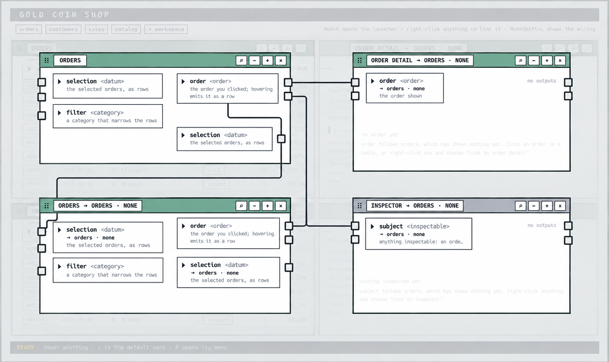

## Before

## After each phase (scene 7)

**P1 anchors** — wires leave the real port instead of an off-screen ghost.
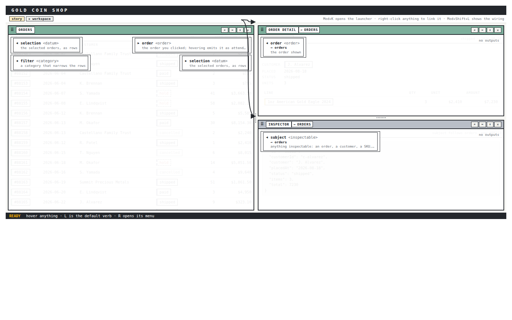

**P2 jacks**
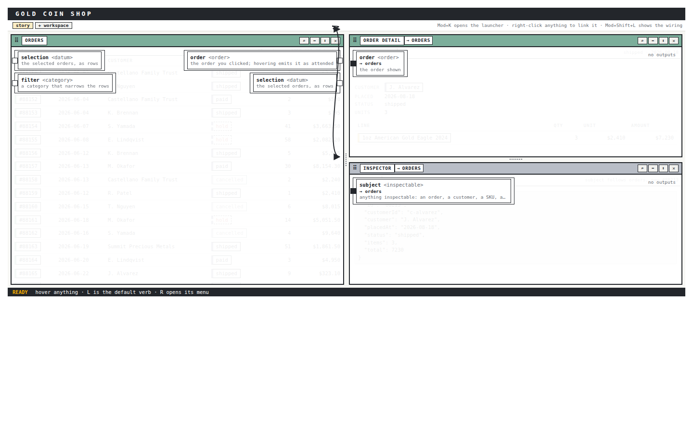

**P3 orthogonal routes** (and the surface offset fix)

**P4 scrim and lift**
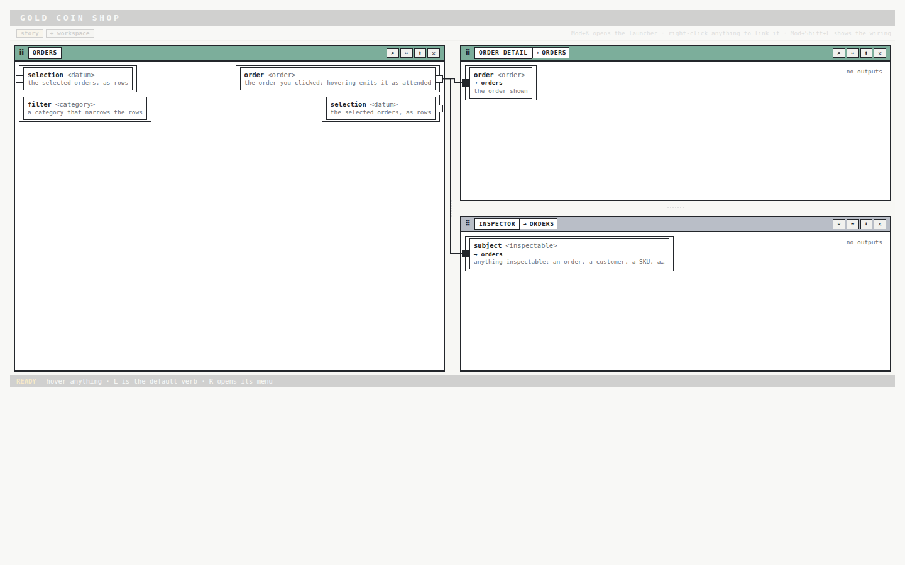

**P5 one port card**
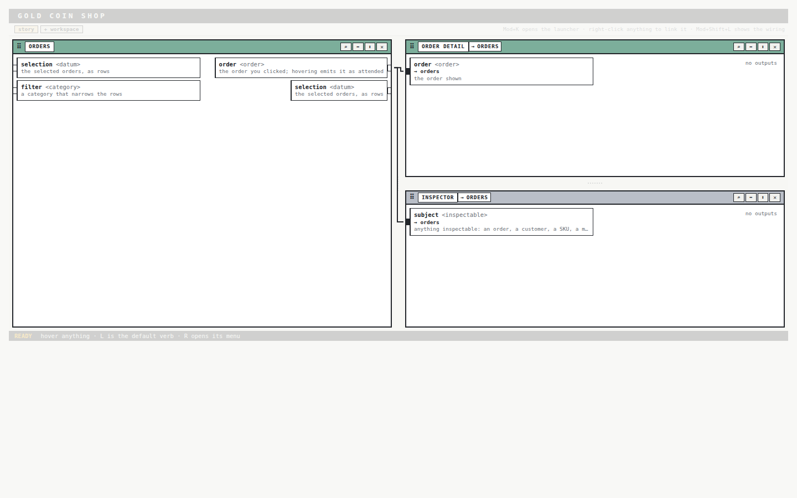

**P6 bar binding**
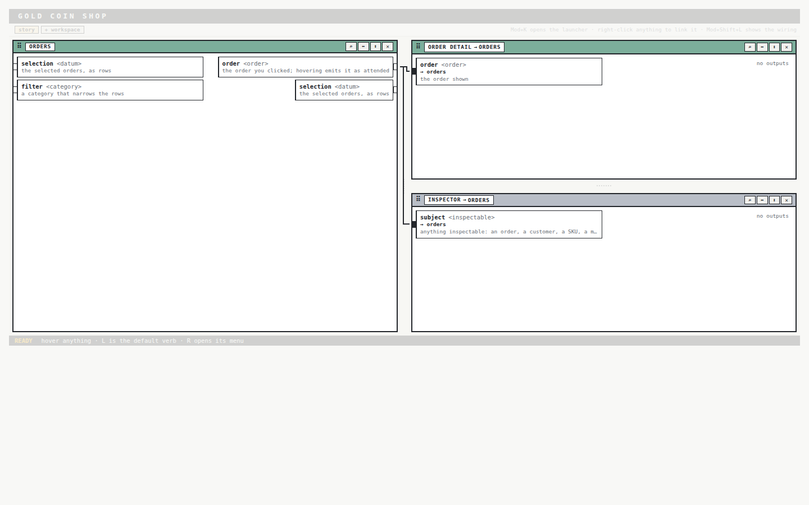

## The lab, and routing around tiles (P7, P8)

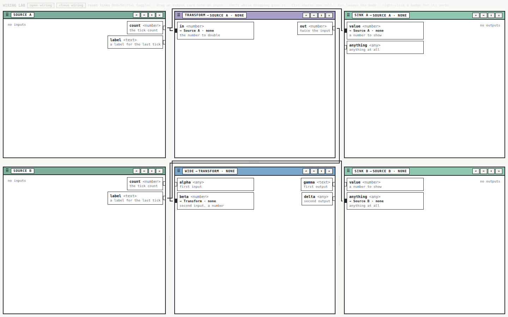

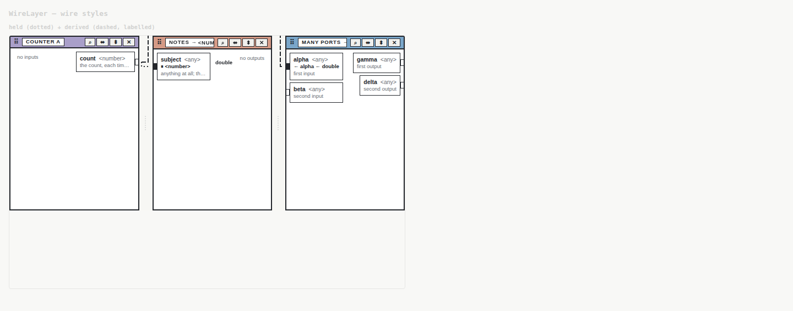

## A crowded tile (P9)

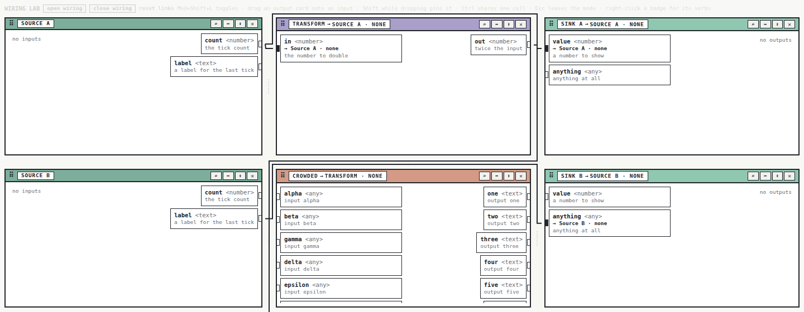

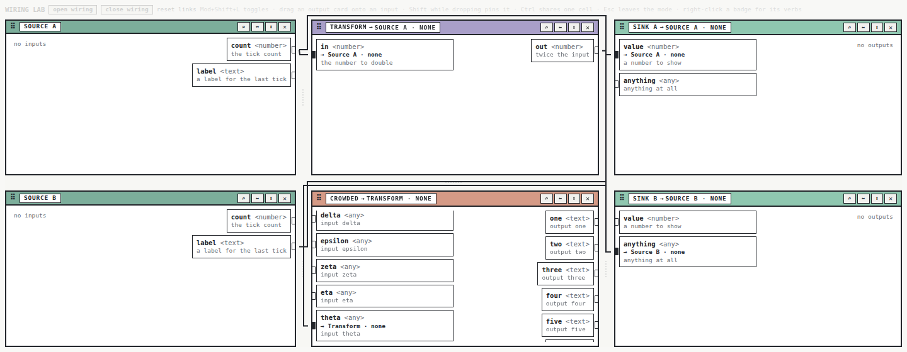

## The carry band and the wire styles

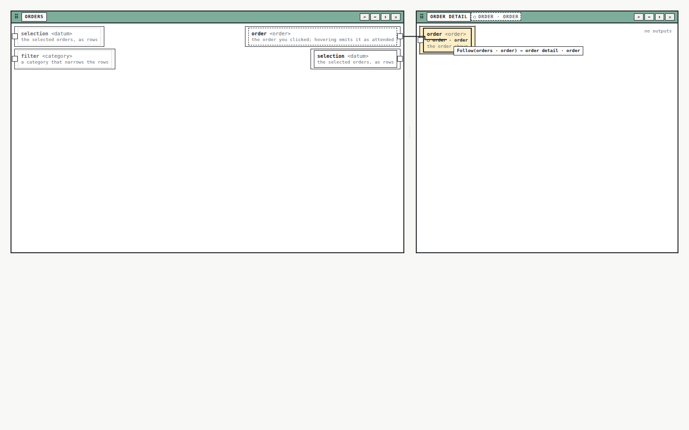

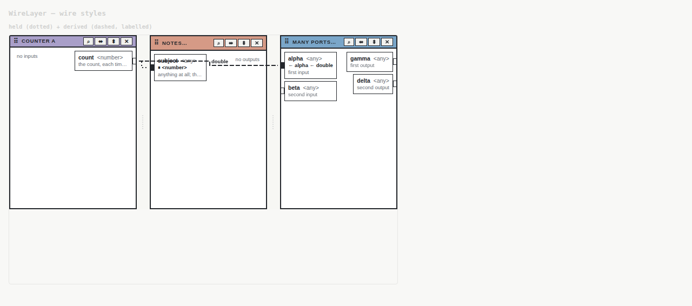

## Still open

- Routing cost: one Dijkstra per wire per measurement; memoise on tile rects if a workbench has dozens of wires.
- The scrim covers product chrome outside the workbench (the mock's look; an embedded workbench may not want it).
- The offset "lifted" placement of tiles in the mock was not reproduced on purpose: tiles stay in place so the split layout is not disturbed.
