# PBUI wiring: intern architecture and implementation review

## 1. Review conclusion and reading guide

PBUI-WIRING-1 introduced a useful visual vocabulary: tiles expose typed ports, square jacks mark connection points, and wires make dependencies visible. The semantic foundation is substantially stronger than the current visual interaction. A successful link can propagate values correctly while its wire is stale, diagonal, clipped, or difficult to interpret. The implementation should therefore be considered a working foundation with significant interaction and geometry defects, rather than a finished wiring interface.

This review evaluates the result from a user's seat. The central question is whether a person can reliably answer **what is connected, what will happen if I connect these ports, and what changed when I moved something**. The most serious failures are wires crossing a tile after resizing, wires detaching from their jacks while a divider is being dragged, and horizontal scrollbars whose only purpose is to scroll a protruding jack. These failures undermine the picture's explanatory role even when the underlying binding remains correct.

The report also serves as an onboarding guide. Sections 2–5 introduce the system and its execution paths. Sections 6–8 connect browser evidence to source code and explain why the existing validation missed the defects. Sections 9–11 propose a repair design, an implementation sequence, and meaningful acceptance tests. Section 12 is a navigable source/API map; section 13 catalogs every screenshot. Section 14 develops the underlying constraints, graph algorithms, geometry invariants, incremental computation, and interaction principles, with an annotated archive of 13 primary references.

**Scope and provenance.** Source inspection is against PBUI commit `142b458a`, on 2026-09-04. Existing Storybook instances on ports 6008 and 6012 supplied the live UI. No product source was changed for this review. The source router was separately invoked on captured browser geometry to confirm that the diagonal paths are reproducible in the checked-out implementation, rather than merely an old screenshot or a stale browser frame. Local built core packages were used for a minimal reproduction of the fixture's command refusals. The original design, nine-step diary, phase report, and the Obsidian project report informed the investigation; their conclusions were checked against current behavior.

The requested follow-up specifically called out horizontal scrollbars and asked for functional and visual assessment from a user's perspective. Section 7.3 addresses that complaint with a controlled DOM experiment. Recommendations below are proposals, not implemented fixes. The original nine implementation phases remain historical facts; completing those phases did not establish the acceptance criteria developed here.

## 2. What the system is for

PBUI is a presentation-based React UI system. A product can describe an object, such as an order or a port, and give its presentation common behaviors: labeling, object menus, hover information, and actions. The workbench arranges applications into tiles. Wiring lets one application consume a value produced by another without hard-coding a particular pair of components together.

Consider an orders table and an order-detail panel. The table emits an order reference when the user selects a row. The detail view declares an input that accepts orders. Following the table's output makes the detail view evaluate that output whenever its value changes. The wire is a drawing of that dependency; it does not carry the data through SVG or DOM events. Moving a tile changes the drawing without changing the dependency.

The WiringLab makes this concrete with two sources, a transform, two sinks, and a multi-port tile. Clicking **tick** in Source A emits a number and a text label. Transform reads the number and emits twice its value. A sink displays its input. After the review's tick interaction, Source A displayed `1`, Transform displayed `in: 1 → out: 2`, Sink A displayed `value: 1`, and Wide displayed `beta: 2`. This is a useful end-to-end demonstration of the semantic path.

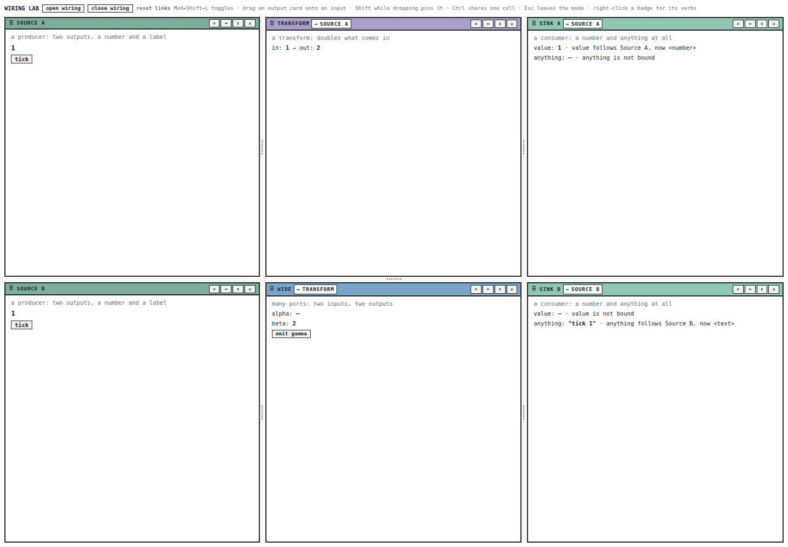

### 2.1 Vocabulary an intern needs

| Term | Meaning in this system |
|---|---|
| Application manifest | Headless declaration of an app's identity, ports, and placement/binding policies. |
| Application presentation | React component, title, tone, and other browser-facing rendering choices. |
| View | Logical application instance with an ID and document bindings. |
| Placement / tile | A leaf in a workspace layout that displays a view. Multiple placements can show the same view. |
| Port | A named endpoint on a view, addressed as `viewId/portName`. |
| Contract | Normalized value and protocol constraints used by the planner. |
| Binding | Durable description of where an input gets its value. |
| Runtime | Ephemeral emitted values, attended values, context values, and shared-cell values. |
| Snapshot | Coherent set of definitions, bindings, identity facts, and runtime facts for evaluation. |
| Card | Visible port information and the main pointer interaction target. |
| Jack | Square visual anchor near the tile frame. Currently decorative, not the drag initiator. |
| Wire | SVG representation of a binding or identity declaration. |
| Carry | Browser-local state of a port drag in progress. |

A view ID and a placement ID are different identities. If two tiles display the same view, they share its port IDs and bindings. A port may therefore have multiple DOM anchors. Conversely, two copies created as separate views have different port IDs even if their titles and application types match. This distinction explains both the multi-element registry and the need to keep semantic identity independent from screen position.

### 2.2 The expected user journey

A usable wiring interface should support a short sequence without requiring knowledge of implementation vocabulary:

1. Enter wiring and recognize the same tiles in the same workspace.
2. Find the source and the destination by readable labels and direction cues.
3. Start a connection from an obvious target; see which destinations accept it and why others do not.
4. Release and receive confirmation of the exact resulting relationship.
5. Follow a wire with the eye, inspect or remove it, and return to the application.
6. Resize or scroll without losing the relationship between the picture and the model.

The current implementation supports parts of this journey well. The cards show name, type, binding state, and documentation; the cursor changes from Follow to Hold when Shift is pressed; Escape cancels a carry before closing the mode; and the product's wire menu names both endpoints. Other parts are misleading: the jack looks draggable but does not start a carry, the lab advertises menu behavior it has not installed, and global scrimming makes its own instructions and close button look disabled.

## 3. Architecture and ownership boundaries

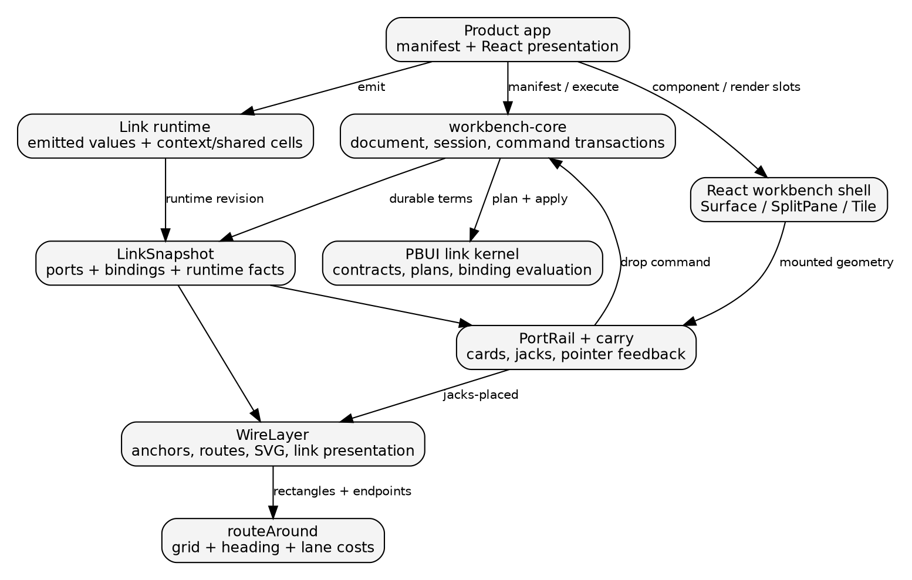

### 3.1 The protocol, headless core, and React shell

`workbench-protocol` defines the document and mutation shapes. Layout is a tree: an internal node splits an area into two children, and a leaf refers to a view. The document also records views and document payloads. This layer supplies stable transport and structural representations; it does not draw wires.

`workbench-core` owns semantic state, structural validation, command planning, and transaction publication. Its `createWorkbenchCore` accepts an initial document, an application catalog, policy, and optional link collaborator. `execute` returns a small success/refusal result. A refusal is data the caller must handle; issuing a command is not proof that the requested operation occurred. The core installs document and staged runtime changes before publication so subscribers do not observe half of a link transition. See [core construction and transaction API][R10] and [the link collaborator][R11].

`pbui-workbench` is the React shell over that core. `createWorkbenchShell` binds presentation components to the core's application manifests, owns browser-local shell state, and exposes bound components such as `wb.Surface`. Its `execute` measures geometry only for commands that require layout information; a port-follow operation does not need a DOM position. Its `dispatch` handles shell actions such as opening link mode. See [shell construction][R09], especially lines 54–120.

`WorkbenchSurface` recursively renders splits and tiles, owns the workbench root element, and mounts `WireLayer` while link mode is open. Keyboard ownership is scoped by focus and the number of workbench roots on the page. `SplitPane` temporarily owns a live drag ratio and commits a resize command on pointer release. That is a good persistence decision: it avoids writing the document for every pointer movement. It also creates an obligation for the visual geometry layer to observe layout changes that occur before a document revision. The current implementation does not fully meet that obligation. See [Surface][R07] and [SplitPane][R08].

### 3.2 Presentation behavior is a separate extension point

The generic workbench can render a plain port or wire. A product installs richer behavior through `renderPort`, `renderWire`, and `renderBadges`. Ecommerce wraps port cards in a block `Presentation` and wire groups in an SVG `Presentation`; its object-menu contributions can then inspect the carried `PortRef` or `LinkRef`. `block` prevents a second decorative box around an already framed card. `svg` preserves valid SVG presentation structure. See [ShopShell, lines 62–80][R16].

This is why the ecommerce wire menu works while the lab's right-click does nothing. WiringLab renders `<wb.Surface />` without those wrappers or a product object-menu setup. The generic SVG hit path still advertises a context-menu cursor. From an intern's perspective, the lesson is that a visual component and its product action installation are separate obligations. From a user's perspective, an apparent action target that does nothing is a defect regardless of which package owns the missing behavior.

### 3.3 Durable state versus ephemeral state

| Owner | Examples | What should trigger it |
|---|---|---|
| Workbench document | Split ratios, views, link terms, captured hold values | Successful semantic/layout command |
| Link runtime | Latest emissions, attended reference, context and shared cells | Application emission or staged runtime effect |
| Shell store | Link mode, launcher, chooser | Browser UI action |
| Carry store | Pointer position, candidate target, modifiers | Pointer/key events |
| DOM geometry | Tile bounds, card bounds, jack positions, scroll clipping | Layout, resize, scrolling, mounting |
| Route result | Polyline points, label placement, hit geometry | Relevant semantic or geometry change |

The existing code correctly separates many of these concerns, but does not yet have an explicit owner for a coherent geometry snapshot. Geometry is instead read and invalidated by several components. That scattered ownership explains the divider-drag failure and the scroll-related ordering fixes recorded in the original diary.

## 4. Ports, bindings, evaluation, and commands

### 4.1 The contract is more than a TypeScript type

A port's `contract` can be declared using a type ID shorthand such as `"number"`. `normalizeContract` expands it into value type, semantic role, cardinality, mode, authority domain, update algebra, and lifetime. An input defaults to read mode, an output to write mode, and an inout port to read-write mode. These are runtime declarations that the link planner can inspect. They are not inferred from a React component's TypeScript props. See [port types and normalization][R12], especially lines 38–103 and 159 onward.

Following asks whether a producer can provide an acceptable value to a consumer, including direction, existing bindings, and type reachability. Sharing an identity cell is stricter: two members must agree on the full normalized contract and satisfy the identity planner's binding constraints. Merely seeing `<number>` on both cards does not prove identity compatibility.

An inout port has two visual sides but one semantic port ID. That is why the registry is indexed by both ID and side, and why an identity-capable demonstration should include compatible inout ports if it wants to initiate identity through the current output-card gesture.

### 4.2 Binding terms and the internal program

The public binding representation is a tagged union. The most relevant variants are:

```typescript
// Abbreviated from src/presentation/links/terms.ts.
type Binding =
  | { kind: "ambient"; key: string }
  | { kind: "constant"; reference: SerializableReference }
  | { kind: "follow"; source: PortId; linkId: string }
  | { kind: "derived"; source: Binding;
      relationId: string; linkId: string }
  | { kind: "hold"; reference: SerializableReference;
      suspended: Binding }
  | { kind: "alias"; classId: string }
  | { kind: "unresolved"; diagnostic: Diagnostic };
```

`follow` evaluates another port. `hold` stores a captured reference while preserving the suspended relationship for resume. A derived binding applies a named relation to its source binding. An alias refers to a compiled shared cell. An unbound input may resolve its declared ambient fallback; absence of an explicit wire is not proof that an input has no effective value.

The internal expression/program representation separates evaluation concerns from the public terms. `programOf`, `effectiveProgram`, and `evaluateProgram` are useful reading points when tracing nested derived/held behavior. An intern should not add special-case data propagation to `WireLayer`; evaluation belongs in the link kernel. See [terms][R13], [expression/program conversion][R14], and [evaluation][R15].

`LinkSnapshot` combines port definitions, binding and identity state, aliases/classes, and runtime values. The core collaborator caches the snapshot by document identity and runtime revision. The shell's `useLinkSnapshot` subscribes to both document/core changes and link-runtime changes through `useSyncExternalStore`.

### 4.3 An end-to-end value flow

```text
User clicks Source A's tick button
    emitCount({type: "number", value: 1})
        -> runtime.emit(viewId + "/count", reference)
        -> runtime revision and subscriber publication
        -> useLinkSnapshot reads current facts
        -> evaluatePort(transform + "/in") follows source/count
        -> Transform effect emits number 2
        -> evaluatePort(wide + "/beta") yields number 2

WireLayer reads the same binding facts
    -> linkRefsOf(snapshot)
    -> draws a visual explanation
    -> never performs the numeric transformation
```

`usePort(view, name)` returns the effective reference, value, evaluation, and badge. `useEmitPort(view, name)` returns a function that writes to the output and any declared context or shared cell. `runtime.emit` is also available to product code that already owns its value in another store. See [React link hooks][R17] and [runtime][R18].

### 4.4 An end-to-end connection gesture

`PortRail.begin` starts a carry only from an output-side card. The carry controller tracks pointer movement globally and reads modifiers live, including release-time modifiers. It asks the current planner about acceptability; the drop handler executes against a fresh snapshot rather than trusting a previous hover result.

```text
pointerdown on output card
    -> startPortCarry(from, acceptable, onDrop, onCancel)

pointermove
    -> hit-test closest data-port-id
    -> planFollow OR planIdentityAdd
    -> publish over, acceptable, pointer, modifiers
    -> input cards and cursor describe possible landing

pointerup
    -> recheck target and modifiers
    -> Ctrl/Meta: execute(identity.add)
    -> otherwise: execute(port.follow)
         if success and Shift: execute(port.pin)
    -> clear carry and global listeners
```

The current Shift gesture performs two commands. If the follow succeeds but pin is refused because the source has no value, the result is a follow rather than the promised held relationship. `PortRail` checks the follow result but ignores the pin result. The lab's initial pin refusal demonstrates the same empty-value precondition. A better design should either reject the combined operation before claiming Hold, execute it atomically where supported, or explicitly explain the partial result. See [PortRail lines 32–57][R02] and [planPin lines 83–92][R19].

Escape during a carry cancels that gesture and leaves link mode open. Escape without a carry closes the mode. The review observed six rails and no cursor after canceling an incompatible drag, and zero rails after closing wiring following a successful held connection. This distinction is useful and should be preserved.

## 5. How the picture is constructed

### 5.1 Cards, jacks, and multiple mounted anchors

The carry registry is module-global: `Map<PortId, {in?: Set<Element>, out?: Set<Element>}>`. A port card's ref registers its element. `portElements` returns all elements for a side. `WireLayer.wireEnds` makes one visual wire per destination element and selects the nearest source anchor by Euclidean distance. This allows a logical view displayed in two tiles to have wires into both visible placements. See [registry lines 39–83][R01] and [wireEnds lines 88–105][R03].

This is a drawing heuristic, not a semantic change. Reordering or resizing duplicate placements can change which source instance is nearest. The registry currently does not filter `portElements` by `isConnected` or by the active workbench root. Its null-ref cleanup prunes disconnected elements and, if none were disconnected, clears the whole side. These details matter when reviewing duplicate mounts, multiple shells, or ref reattachment; the original design's description of connected-only lookup is stronger than the implementation.

Jacks live in an overlay inside the rail. The input jack is positioned at `left: -7px`; the output jack at `right: -7px`. Their width and height are 12px. Cards scroll inside vertical columns; a layout effect measures every card center and updates the separate jack layer. The jack layer is clipped vertically with `clip-path: inset(0 -20px)` while allowing horizontal protrusion. `anchorOf` locates a matching jack by port ID and side, then uses the input's left edge or output's right edge at its vertical center.

All points must be expressed relative to the same surface origin:

```text
output anchor x = jackRect.right - surfaceRect.left
input  anchor x = jackRect.left  - surfaceRect.left
anchor y        = jackRect.top + jackRect.height/2
                  - surfaceRect.top
```

This explains the earlier containing-block fix: `Surface` must be positioned so the absolute wire overlay is laid out against the same surface whose origin was subtracted from the measurements.

### 5.2 Geometry invalidation and the commit signal

`PortRail` measures on column scroll, its own `ResizeObserver`, window resize, and relevant snapshot changes. If the jack array changes, a layout effect dispatches `pbui:jacks-placed` after the jacks commit. `WireLayer` listens to that event, surface scroll in capture phase, window resize, and a `ResizeObserver` on the workbench root. It increments a local tick to force geometry to be reread.

The explicit post-commit event addresses a real ordering issue: measuring a jack in the same React batch that moves it can read the previous DOM. However, the event is tied to changes in local jack state. A frame can move horizontally while the jack's local top and bound state remain unchanged. The rail then publishes no changed jack state, and the wire layer observes only an unchanged outer root size. The live divider case falls through this gap.

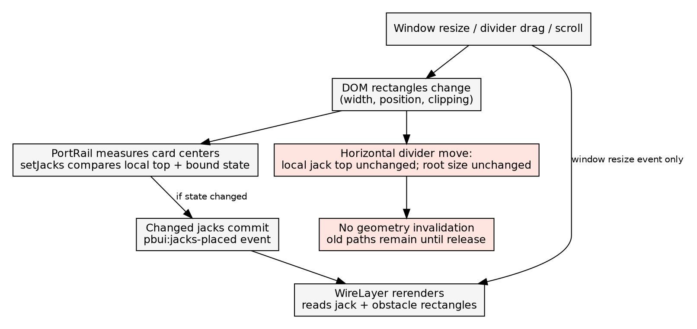

### 5.3 Grid routing and why heading is part of the state

`routeAround` rasterizes a rectangular routing field into cells. It marks cells covered by inflated tile obstacles, frees short endpoint corridors, and searches for a low-cost path. A search state includes both cell position and travel direction. Direction is necessary because two arrivals at the same cell can have different future bend costs.

```text
routeAround(from, to, obstacles, lanes, options):
    grid = rasterize(options.bounds, cell = 6px)
    block each tile inflated by margin = 3px
    free source +x corridor and destination -x corridor
    start at (sourceCell, heading = +x)

    Dijkstra over (cell, heading):
        next step costs 1
        add 10 for a change of heading
        add 8 if another wire occupied this cell
        do not immediately reverse direction
        accept destination only with heading +x

    if no route or search limit reached: return null
    reconstruct cells and mark lanes
    keep corners, snap endpoints, serialize as SVG
```

The caller routes longer endpoint spans first and reuses a `Lanes` instance for subsequent wires. Occupancy is a penalty, not an exclusion, so overlapping segments remain possible. The routing field extends 18px beyond the surface. If routing returns null, `WireLayer` silently draws a simpler orthogonal fallback that does not avoid obstacles. Grid limits are 400,000 cells and 600,000 popped search states. See [route.ts lines 55–217][R04] and [WireLayer lines 159–176][R03].

At 1440×1000, the captured surface plus exterior strip gives roughly 245×168 grid cells, or about 164,000 heading states per search. Each call allocates grid and search arrays. All routes are rebuilt during rendering, including renders caused by pointer carry updates. This is a source-based performance concern, not a benchmark result; the review did not measure a frame-time distribution.

### 5.4 SVG, styling, and interaction layers

The surface establishes an isolated stacking context in link mode. A fixed scrim washes the page; tiles paint above it; the wire overlay is at z-index 3. The application's DOM remains mounted and inert but becomes invisible. Gutters expand to the spacing token that currently yields 24px. The familiar application positions are mostly preserved, but the gutter change does alter available tile space.

Each wire group contains a transparent 10px hit stroke and a visible 2px stroke. Held links are dotted, derived links dashed and labeled, and identities use a wide outer stroke with a narrow inner stroke. Longer endpoint spans render first so shorter overlapping paths receive later hit targets. During a port carry, wire hit targets are disabled. The wire SVG is `aria-hidden`; link announcements and product menus must provide accessible alternatives.

The derived label is currently placed using `labelPoint(from, to, channel)`, a helper from the earlier simple router. It does not inspect the path returned by `routeAround`. This split between actual geometry and annotation geometry directly causes the detached label in section 7.5.

## 6. Browser method and measured results

The review used Playwright's actual browser page, pointer actions, keyboard events, native wheel scrolling, and viewport resizing. Measurements were collected after 600–700ms settling intervals except where explicitly taken during a held divider drag. These waits are observational settling intervals, not a guarantee that every intermediate animation frame is correct. No CSS was altered for the baseline screenshots.

The probe records surface and tile rectangles, jack rectangles, clipping, SVG path data, endpoint error, diagonal segments, and sampled tile intersections. All coordinates in the JSON are surface-relative CSS pixels. Endpoint error compares a path endpoint with the expected jack edge/center. Intersection detection samples the path every 2px against tile interiors inset by 2px; it is a useful diagnostic but not an exact collision proof. The source replay independently verifies the returned path points.

### 6.1 Window resize sweep

The same mounted lab was resized in sequence, including a return to the original size. IDs and bindings stayed in place throughout the sweep.

| Viewport | Wires | Maximum settled endpoint error | Diagonal result | User-visible assessment |
|---|---:|---:|---|---|
| 1440×1000 | 4 follows | 0px | Short Source A → Transform wire | Labels readable; long empty panels; spurious scrollbars. |
| 1280×800 | 4 follows | 0px | Same short wire | General layout fits; defect remains. |
| 1024×768 | 4 follows | 0px | Same short wire | More compressed cards; endpoint alignment still correct. |
| 768×900 | 4 follows | 0px | Transform → Wide crosses Transform | Major routing failure; headings truncate; four horizontal bars. |
| 390×844 | 4 follows | 0px | None in this sample | Three squeezed columns; names/types cut off; page overflow. |
| 1440×1000 again | 4 follows | 0px | Original short diagonal returns | Confirms deterministic size-dependent geometry, not accumulating drift. |


Zero endpoint error is necessary but not sufficient. The 768px screenshot is an especially useful counterexample: the ends are exactly aligned, while the route between them is grossly wrong. A test that checks only `path exists` or `end meets jack` would pass it.

### 6.2 Divider drag and port scrolling

Dragging the first vertical separator 130px to the right at 1440×1000 changed the actual tile frames while the wire paths remained stale. A measurement taken with the pointer still down, after a 600ms pause, showed errors of 65px and 130px on affected endpoints, with a maximum of approximately 130.016px. On release, the committed resize caused endpoints to return to 0px error. This is not just a fast-drag frame artifact.

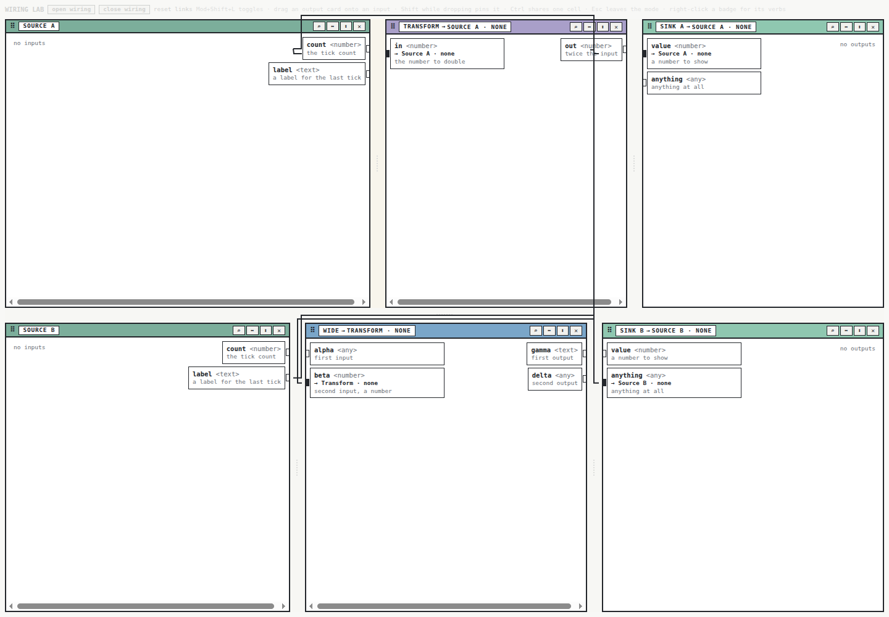

In Crowded at 1280×560, the input column had `clientHeight=185`, `scrollHeight=337`, and a maximum scroll of 152px. Before scrolling, the theta jack was clipped yet its wire still targeted its offscreen coordinates. The wire's endpoint y was `606.15625` relative to a surface only `502.375`px high. After a native wheel scroll to 152px, theta became visible and the endpoint moved to `454.15625`, correctly matching its jack. Resizing the scrolled view to 768×560 reproduced the large diagonal routing defect.

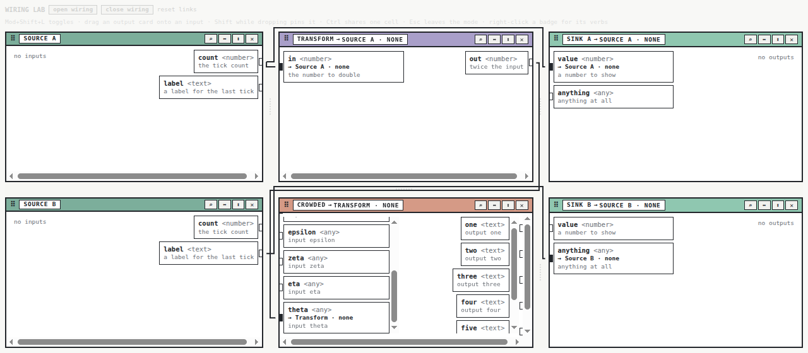

### 6.3 Connection and menu exercises

| Exercise | Observed result |
|---|---|
| Tick Source A and B with wiring closed | Values propagate; transform doubles; sinks render values. |
| Drag text label to an `anything` input | Follow preview names source and target. |
| Press Shift while still dragging | Cursor changes to Hold before release. |
| Release after values exist | A held wire appears; sink holds `"tick 1"`. |
| Drag text label to numeric input | Landing refused; cursor says `cannot land on Sink A · value`. |
| Escape during that carry | Carry canceled, six rails remain, four original wires remain. |
| Drag the visible square jack | No carry starts. |
| Right-click a wire in WiringLab | No application menu opens. |
| Right-click short detail wire in ecommerce | Correct detail-link menu opens, including unlink variants. |

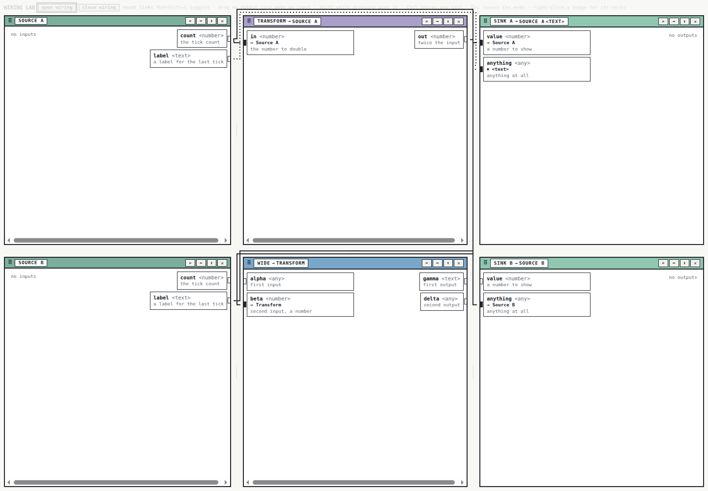

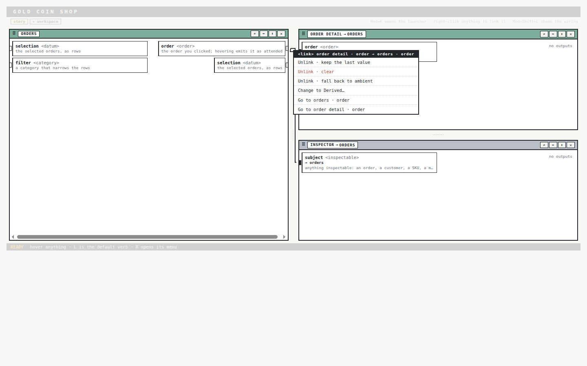

## 7. Findings: user impact, mechanism, and repair target

### 7.1 F1 — Route reconstruction can destroy orthogonality and obstacle avoidance

**Priority: high. Evidence: observed in browser and reproduced from current source.** At 768×900, the cross-row path contains `(504, 49.671875) → (252, 420)`. Both coordinates change, making a diagonal that crosses Transform. The complete path was:

```text
M 501.109375 49.671875
L 504 49.671875
L 252 420
L 252 530.25
L 259.234375 530.25
```

In [route.ts lines 182–201][R04], corner extraction is followed by overwriting the first corner's y with the source y and the last corner's y with the destination y. This assumes those corners are safe horizontal endpoint adapters. That assumption fails when search turns immediately or a short route has too few independent corners. Moving a corner can turn the next segment diagonal or remove an essential bend. The three-point short route also writes to the same middle point twice.

For the user, this looks like a connection cutting through application content and makes the wiring layout appear arbitrary. The repair must preserve the searched path and add independently validated endpoint segments. Checking the raw grid path is insufficient: validate the final, snapped polyline for orthogonality, obstacle intersection, and correct exit/entry direction.

### 7.2 F2 — Divider dragging leaves the wire geometry stale

**Priority: high. Evidence: observed during a paused live drag.** `SplitPane` updates a local ratio while dragging; the workbench document is unchanged until release. `WireLayer` watches the surface's size rather than each moving frame. `PortRail` compares only local jack top, side, ID, and bound status; a pure horizontal move can change none of them. Its post-commit jack event therefore need not fire. See [SplitPane lines 56–100][R08], [PortRail line 128][R02], and [WireLayer lines 134–156][R03].

The user loses confidence while adjusting the workspace because the lines temporarily imply different attachment points. Preserve the single document commit on release, but publish a geometry revision during the live drag. Geometry must be invalidated by position changes as well as size changes.

### 7.3 F3 — Decorative output jacks create horizontal scrollbars

**Priority: high. Evidence: browser measurement plus controlled intervention.** At 768px, Source A's body was 236px wide with a scroll width of 243px. Transform and Wide had 228px clients and 235px scroll widths. The two input-only sinks had no horizontal overflow. Every affected tile had an output jack protruding to the right.

| Temporary DOM intervention | Source A client / scroll width | Interpretation |
|---|---|---|
| Baseline | 236 / 243px | 7px of unwanted horizontal overflow. |
| Hide the inert app with `display:none` | 236 / 243px | Hidden application content is not the cause in this fixture. |
| Hide the jacks | 236 / 236px | Jack protrusion is the cause. |
| Hide the rail | 236 / 236px | Consistent with the rail/jack subtree being responsible. |

All temporary style tags were removed before the subsequent interaction. Native horizontal wheel scrolling then changed Source A's `scrollLeft` to 7. This moves the rail rather than revealing useful content. The origin is [public chrome `tile-body { overflow: auto }`, lines 111–117][R20] combined with [PortRail's output jack `right: -7px`][R05]. The visual clipping layer does not prevent the descendant geometry from contributing to scrollable overflow.

A user sees scrollbars under mostly empty panels and reasonably assumes there is hidden information. Scrolling instead nudges the connection surface. This adds clutter, consumes height, and damages the intended frame attachment. The repair should make the jack overlay a sibling outside the scrolling body, give the port columns sole ownership of vertical scrolling, and keep the frame coordinate system stationary. Merely hiding all horizontal overflow risks clipping the very jacks the design wants to expose and should not be accepted without geometry checks.

### 7.4 F4 — Scrolled-out ports still attract full wires

**Priority: high. Evidence: observed in Crowded before scrolling.** Jack elements remain mounted even when the jack layer clips them. `anchorOf` still measures them and `wireEnds` treats them as ordinary endpoints. A source can therefore connect to an invisible point below the viewport, making the wire appear unfinished or disappear beyond the workbench.

The current portal case handles missing mounted endpoints, not clipped-but-mounted endpoints. Define visibility explicitly: fully visible, clipped above/below, or absent. A clipped port should produce a visible rail-edge continuation with a label or reveal action, rather than a full path to a hidden coordinate. If multiple hidden ports share an edge, the continuation needs disambiguation and a count. See [anchorOf and wireEnds][R03] and the raw [Crowded measurements](review-assets/crowded-metrics.json).

### 7.5 F5 — The derived label is unrelated to the routed path

**Priority: medium. Evidence: observed in the visual-audit fixture.** The derived path goes above the middle tile, but its `double` label sits inside that tile. Its text anchor is approximately 58px from the nearest sampled point on the wire. `labelPoint` still uses a midpoint formula for the old route, while the stroke uses the obstacle router. See [WireLayer lines 60–64 and 196–212][R03].

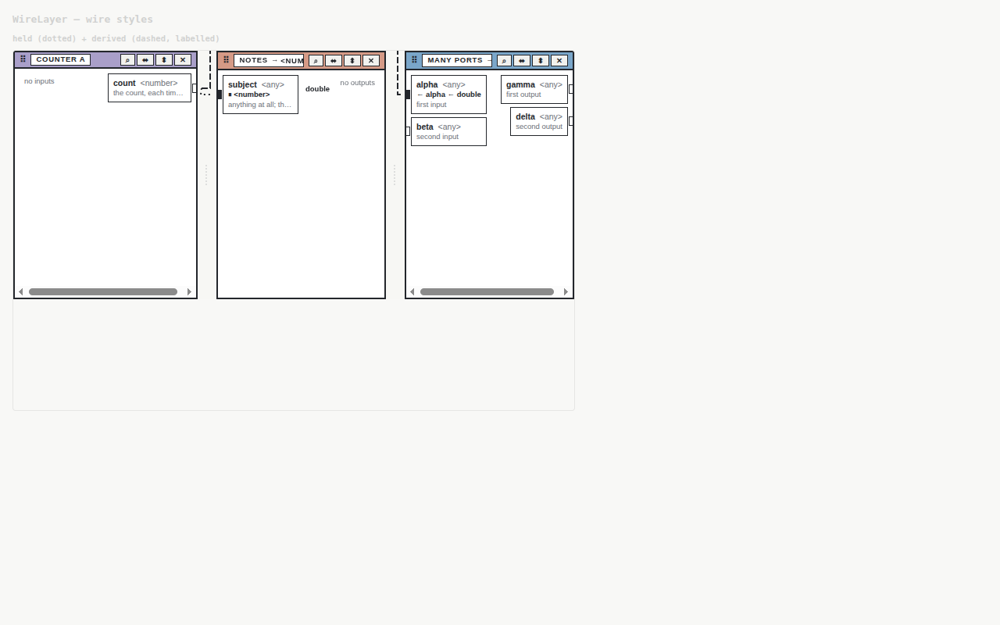

The user cannot tell whether `double` names the Notes tile, a port, or a transform on the wire. Choose a sufficiently long segment of the final validated polyline, place the label next to that segment, and account for its box in collision checks. The audit story injects the derived term directly and does not establish successful relation evaluation; it is useful evidence for drawing, not for end-to-end derived semantics.

### 7.6 F6 — The lab's claimed semantic coverage is false

**Priority: high for validation and onboarding. Evidence: browser console, DOM, and command replay.** The story attempts four follows, one pin, and an identity. All four follows succeed. Pin fails with code `empty` because Source B has emitted nothing. Identity fails with code `bound` because Sink A's value already follows Source A. The story does not inspect any of these results. Its comment and earlier reports describe held/identity coverage that the current lab does not provide.

```text
port.pin:
    ok: false, code: "empty"
    "sink · anything shows nothing to hold"

identity.add:
    ok: false, code: "bound"
    "sink · value is following a source; unlink it first"
```

See [WiringLab lines 196–201][R06], [planning preconditions][R19], [browser console](review-assets/browser-console.txt), and [source replay](review-assets/source-replay.json). There are no inout ports in this lab, so its output-card Ctrl-sharing instructions also lack a valid source: the identity planner refuses output-only members. The old diary's explanation that the sinks share a cell but no wire is drawn is not supported by the current fixture; the identity declaration itself never succeeds.

Repair the fixture before using it to approve another visual iteration. Seed real values before pinning, reserve separate compatible inout ports for identity, and assert every command result and resulting term count. Use a valid product presentation installation if the lab promises badge/wire menus. Fixture correctness is part of the product review because this story is explicitly offered as the place to learn the feature.

### 7.7 F7 — The visible interaction vocabulary promises more than it delivers

**Priority: medium. Evidence: direct pointer and keyboard inspection.** A square socket is a conventional place to begin wiring, but the jack layer has `pointer-events:none` and the handler is on the card. The card is a `DIV` with no role and `tabIndex=-1`. The wire group is inside an `aria-hidden` SVG, and the generic lab provides no equivalent relationship editor. A live region announces changes but does not supply an accessible operation for making those changes.

The lab instructions say to right-click a badge for verbs, yet the lab installs neither product wrappers nor a menu. In contrast, ecommerce's tested menu correctly names the selected detail link. The fix is to choose and implement a coherent default: make cards and/or jacks explicit accessible connection controls, and provide a keyboard-operable connection list or command surface. Product customization can extend that default without making basic management depend on an invisible installation step.

The refused drag message is also too generic. `cannot land on Sink A · value` identifies a target but omits the available planner reason, such as text versus number or an existing hold. Surface the specific reason and a relevant next action. Do not force the user to infer it from a dimmed border.

### 7.8 F8 — Visual hierarchy and responsive behavior need product decisions

**Priority: medium on desktop; high if narrow-screen operation is required. Evidence: screenshots and interaction.** The scrim is fixed across the page and has no pointer interception. It makes the lab's buttons and instructions very faint while those controls remain clickable. This breaks the familiar convention that washed-out controls are disabled. A dedicated, readable wiring toolbar should remain above the scrim and contain a clear exit action and short legend.

At 390px, the layout retains three columns only about 100–111px wide, and every rail still reserves half its width for each direction even if one side has no ports. Titles collapse to fragments while four header action buttons keep their width. Port names and types are clipped. The document scroll width was 394px for a 390px viewport. The absence of a diagonal in this particular size does not make the layout usable.

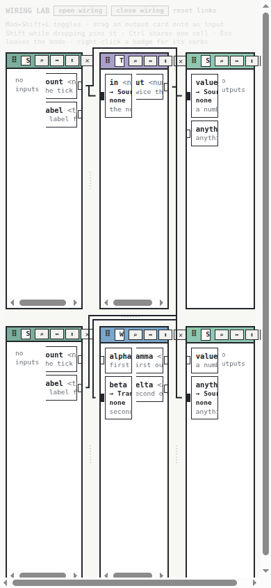

On wider screens, the large blank tile bodies, repeated `none` state labels, same-color wires, and shared stubs still require effort to read. The ink style is consistent, but consistency alone does not reveal which path belongs to which connection. Hover/focus should highlight one whole connection and both endpoints, with a persistent textual relationship description. One-sided tiles should not waste half the rail on a `no inputs` or `no outputs` placeholder. At a small width, use a consciously designed alternate view or a minimum-width canvas with explicit navigation; silently compressing every control is not an adequate policy.

### 7.9 F9 — Additional implementation risks to test explicitly

The following are source-backed concerns, not additional browser reproductions:

- **Global registry ownership.** The module-global anchor/carry registry and root-unfiltered lookup deserve multi-shell and duplicated-view tests. A source mounted in another shell must not be selected solely because its port ID matches.
- **Null-ref cleanup.** Clearing a side when no disconnected member is found can remove connected duplicates during ref reattachment. A disposer tied to a specific element is easier to reason about than inferring which node departed.
- **Invisible fallback.** A no-route or budget result becomes a plain route through obstacles with no diagnostic. Failed route planning must remain an explicit state in the drawing model.
- **Route churn.** Longest-span ordering and new lane occupancy on every render can cause unrelated paths to change lanes when geometry or wire count changes. The review did not quantify that churn; add a stability metric before optimizing.
- **Crowded app behavior.** Its manifest names outputs `one` through `six`, but its presentation reuses `WideApp`, which emits `gamma`. It is an overflow fixture with a mismatched application behavior, not a complete crowded-port functional demonstration.

## 8. What the implementation got right, and why the tests were insufficient

The division between the semantic kernel and the drawing is sound. A wire does not own propagation, and moving a placement does not redefine a port. The shared planner is reused for hover and drop, modifiers are live, the carry has a single cancellation path, and document mutation waits until a divider drag is committed. The post-commit jack event also addresses a real lifecycle ordering problem. These are useful foundations to preserve.

The review ran the existing route, connect, and identity tests: **3 files, 11 tests passed**. Those tests establish selected semantic and interaction behaviors in the current suite. They do not establish browser geometry under resizing. The three router tests use a clear field, a wall, and two nominal lane runs; they miss the fractional endpoint/short route and immediate-turn cases captured here. The lane test compares different input endpoints, so unequal paths alone are weak evidence that occupancy caused useful separation.

The identity interaction test asserts the presence of a wire group. A group can exist without a meaningful visible path. The original report's fixed-size screenshot sweeps likewise did not expose the live divider invalidation gap. Browser DOM tests, geometry invariants, and source-level router tests must complement one another. None can stand in for the others.

No complete repository build or full ecommerce e2e suite was rerun for this documentation-only review. Ecommerce's wire menu and resizing were exercised directly. Cross-browser behavior, touch input, browser zoom, large graphs, and repeated nested workbench instances remain untested here. The console evidence includes expected story command refusals and favicon 404s; the review does not claim a clean console.

## 9. Proposed repair design

### 9.1 Make geometry a coherent, surface-owned input

Introduce a surface-local geometry owner that measures tile frames, port cards, visibility, and endpoint attachment in one coordinate system. Both jack rendering and wire routing consume the same geometry revision. A local live layout change must invalidate geometry even when it does not change the durable document. The geometry service belongs in the React shell, not the headless link kernel.

```typescript
// Proposed API, not current code.
type AnchorVisibility = "visible" | "above" | "below" | "absent";
interface PortAnchor {
  instanceId: string;       // exact mounted visual instance
  placementId: string;
  portId: string;
  side: "in" | "out";
  point: { x: number; y: number };
  visibility: AnchorVisibility;
}
interface WiringGeometry {
  revision: number;
  bounds: Rect;
  obstacles: readonly Rect[];
  anchors: readonly PortAnchor[];
}
```

Do not use a wire's current DOM path to derive semantics or persist this geometry. The document should continue to own only logical relationships and committed layout. Internally, a ref registration should return a disposer for the exact instance. Scope lookup to the surface's registry and keep visibility distinct from DOM attachment.

```text
on mount/unmount, frame resize, live split change, scroll:
    mark surface geometry dirty
    schedule at most one animation-frame measurement

measurement frame:
    read all frames and card rects in a batch
    classify clipping against each port scrollport
    derive anchors in surface coordinates
    publish one geometry snapshot if it changed

render:
    render jacks from that snapshot
    route wires from that same snapshot
```

A `ResizeObserver` alone is insufficient because position can change without size. `SplitPane` should explicitly invalidate during live drag, and the owner should account for ancestor/root movement and scroll. Test geometry while a pointer remains down, not just after commit.

### 9.2 Move decorative geometry outside scrollable content

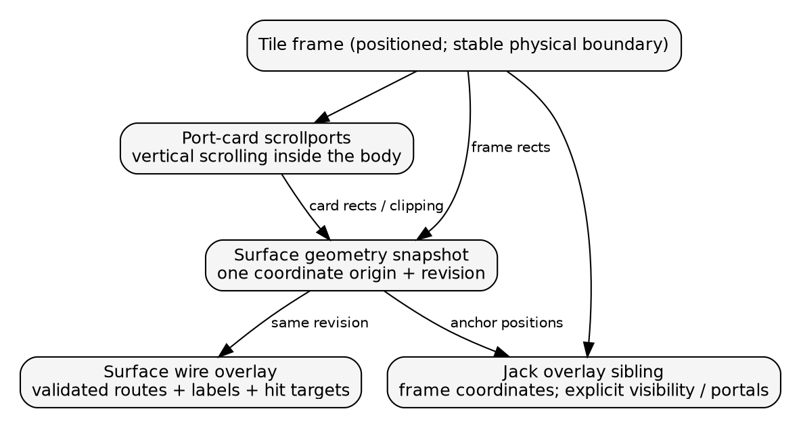

Move the jack layer outside `tile-body`'s scrollable contents and anchor it to a stable frame-level positioned element. Let input and output card columns manage their vertical overflow. Keep the application mounted if preserving local React state is required, but exclude its invisible layout from the wiring scroll model by an explicit mode layout. Do not unmount applications casually: the current transform emits from a mounted effect, and local source state also lives in the component.

This change should remove the 7px scrollbar at its cause. It must also keep jacks on the physical frame while either card column scrolls, preserve top/bottom clipping semantics, and avoid clipping hit targets. A narrow view needs a separate layout decision for empty columns and header actions; the scroll ownership fix alone will not make 390px usable.

### 9.3 Return validated route data rather than just a string

```typescript
// Proposed API, not an adapter around the old function.
type WireRoute =
  | { kind: "routed"; points: readonly Point[];
      labelSegment?: number }
  | { kind: "portal"; at: Point; hiddenPort: string;
      reason: "above" | "below" | "not-mounted" }
  | { kind: "unroutable";
      reason: "no-path" | "budget" | "invalid-geometry" };
```

Keep the grid search initially; the evidence does not require replacing Dijkstra. Repair the boundary between grid cells and exact coordinates. Build explicit endpoint connectors with known exit and entry sides, preserve interior corners, and validate the resulting path. Do not mutate an arbitrary first or last corner to fit an endpoint.

```text
raw = searchGrid(endpointCorridors, obstacles)
if raw unavailable: return unroutable(reason)

points = connectExactEndpoints(raw, sourceSide, destinationSide)
points = removeDuplicateAndCollinearPoints(points)

assert each segment is horizontal or vertical
assert endpoint positions match anchor positions
assert segments avoid inflated obstacles except permitted stubs
assert exit and entry headings agree with port sides
if any check fails: return unroutable("invalid-geometry")

choose label segment from points
return routed(points, labelSegment)
```

Compute labels and hit targets from that final route. Share immutable obstacle rasterization across wires for a geometry revision where practical. Cache completed route sets on semantic endpoint/visibility facts plus geometry; pointer movement should not rebuild every settled route. Profile before adopting workers or a different routing algorithm.

### 9.4 Improve the user's connection workflow

Provide a visible toolbar that remains readable in wiring mode. It should state the mode, provide Exit, expose a legend when needed, and display the selected connection in text. Make a port's interactive area unambiguous. If jacks look like sockets, allow them to start the same action as the card or visibly indicate that the card is the handle.

Make refusal messages use planner diagnostics. A Hold preview should prove that a value can be captured before promising a held result. A keyboard path should let a user choose source, destination, and relation without dragging; it can invoke the same existing commands. A connection list can also reveal hidden endpoints and solve the menu-access gap for the generic shell.

Prefer highlighting one relationship and its endpoint labels on hover/focus over adding many permanent colors or thicker lines. The current monochrome visual system can remain, but it needs a clear selection state. Dense shared stubs should offer explicit disambiguation rather than relying solely on paint order.

### 9.5 Decision records

**Decision A — Surface-owned geometry snapshot. Status: proposed.** The context is multiple components observing incomplete geometry changes. Options are more ad hoc DOM events, observing every relevant element, or a surface owner with explicit live-layout invalidation. Choose the owner, using observers as inputs. It gives one coordinate and visibility contract; the cost is a new shell service and lifecycle tests.

**Decision B — Frame-level jack overlay. Status: proposed.** The context is proven output-jack overflow inside an auto-scrolling body. Options are hiding overflow, adding padding, or moving the overlay outside the scrollport. Choose the sibling overlay. It preserves the frame attachment without manufacturing scrollable content; the cost is a Tile/PortRail boundary change and careful clipping/hit-testing validation.

**Decision C — Explicit unroutable state. Status: proposed.** The context is that silent fallback can contradict obstacle avoidance. Options are retaining the simple fallback, hiding failures, or representing a failed route with explanation. Choose an explicit result and user-visible continuation/error treatment. The consequence is that callers must handle failure instead of assuming every link yields a normal path.

**Decision D — Repair the grid boundary before changing the algorithm. Status: proposed.** The observed defect occurs in route reconstruction, and the live-drag failure is invalidation. Replacing Dijkstra would not by itself repair either ownership error. Preserve the search for the first repair phase, add final-geometry invariants, and use measured route cost to decide later optimization.

No backward-compatibility layer or adapter is proposed. Any public API change should be a deliberate cutover with updated callers and tests. The exact supported minimum width and embedded-scrim policy remain product decisions; the review recommends making them explicit rather than accepting accidental CSS behavior.

## 10. Implementation plan an intern can follow

### Phase 1 — Make the evidence reproducible and the lab truthful

Start with `WiringLab.stories.tsx`. Assert each seeding command's `ok` result, emit before pinning, and create an independent compatible inout identity pair. Correct the Crowded app's emitter names and install the menu behavior the instructions advertise. Add a fixture assertion for the actual term kinds, rendered paths, and visible values. This phase should make later screenshots trustworthy, without changing the route algorithm.

Deliverables: valid semantic fixtures, explicit expected counts, and a small readme explaining which story covers follows, held values, identity, derived styling, overflow, and duplicate placements. Preserve the review's original evidence as a baseline.

### Phase 2 — Fix final route geometry

Work in `route.ts` and `route.test.ts`. Add the captured fractional short-route and 768px cross-row cases before editing reconstruction. Use independent segment checks on the returned polyline; do not assert only a particular serialized path. Cover immediate turns, same-cell endpoints, reversed endpoints, very short gutters, obstacles at the surface edge, and no-route/budget results.

Deliverables: exact endpoint adapters, final path validation, and a result shape that makes failures explicit. Update `WireLayer` to consume it. Success means that the specific observed diagonal paths cannot be produced, and blocked routing cannot silently draw through an obstacle.

### Phase 3 — Fix geometry lifecycle and scroll ownership

Introduce the geometry owner near shell geometry/context code. Wire `SplitPane` live changes into it. Move jacks to the frame-level sibling layer through `Tile` and `PortRail`; remove dependence on a local y-only state change to trigger global routing. Keep the application state mounted and semantic emissions working.

Deliverables: no 7px horizontal overflow in the lab, zero endpoint drift during a held divider drag, and a visible continuation for clipped theta. Test the first drag frame, several intermediate positions, paused pointer-down, and release. Check both column scroll and outer page scroll.

### Phase 4 — Make the interaction understandable

Add the generic connection management surface, explicit controls, route-based labels, hover/focus highlighting, and actionable refusal text. Make Shift-follow-and-pin produce a result consistent with its preview. Keep the toolbar above the scrim and decide the small-width layout policy. Ensure the ecommerce presentation hooks still supply their domain-specific menus.

Deliverables: a user can discover, create, inspect, cancel, resume, and remove a relationship with both pointer and keyboard; the lab's instructions correspond to available actions. A user should not need to know the names `LinkRef`, `Binding`, or `PortCarryState` to perform these tasks.

### Phase 5 — Validate scaling and route stability

After correctness, measure settled-route work during pointer movement and repeated resizing. Reuse obstacle rasters and cache route sets by geometry revision. Add a dense fixture and record frame-time/long-task measurements before deciding on asynchronous routing. Track whether unrelated wires change lanes when a connection is added or a tile changes size.

Deliverables: an explicit supported density and latency target, representative browser evidence, and documented remaining limitations. Do not label an optimization successful solely because a screenshot looks unchanged.

## 11. Acceptance tests and local reproduction

### 11.1 Invariants that should define completion

| Area | Meaningful acceptance condition |
|---|---|
| Endpoint geometry | Visible endpoints stay within 1 CSS pixel of their declared jack attachment, including while dragging. |
| Orthogonality | Every final segment has constant x or constant y within a stated numeric tolerance. |
| Obstacle avoidance | No final segment crosses a tile interior except explicitly permitted endpoint stubs. |
| Scrolling | Frame jacks do not create horizontal body overflow; scrolling a column reveals useful cards without moving the frame attachment. |
| Visibility | A clipped/missing endpoint has a visible, labeled continuation rather than a full route to hidden coordinates. |
| Semantics | Successful gestures produce expected values and term kinds; refused operations preserve prior state and explain why. |
| Labels | A derived label belongs to its final route and avoids unrelated tile/card content. |
| Identity | A valid inout identity creates a shared cell and a visible connection; duplicated/multi-shell anchors remain scoped. |
| Keyboard | Source, destination, cancel, inspect, and unlink are operable without a drag. |
| Responsive UX | At every supported width, names and action targets are readable, or an explicit alternate navigation mode is offered. |

The 1px endpoint criterion is a proposed acceptance tolerance, not a claim that this browser pass sampled every frame. Performance limits also need a product target; inventing an unsupported frame budget here would not improve the design.

### 11.2 Commands and artifacts

Run the targeted existing tests from `packages/pbui-workbench`:

```sh
pnpm exec vitest run \
  src/components/WireLayer/route.test.ts \
  src/links/connect.test.tsx \
  src/links/identity.test.tsx
```

The result during this review was 3 files and 11 tests passed. The standalone [source replay](../scripts/02-replay-route-and-seed.mjs) uses Node 24's TypeScript stripping to call the actual source router, reads captured rectangles, and uses built core packages to reproduce the empty/bound seed refusals:

```sh
# From this ticket directory:
node scripts/02-replay-route-and-seed.mjs
```

The [browser replay](../scripts/03-replay-browser.mjs) uses the workspace's installed Playwright and an already running Storybook at port 6008. It saves the resize, divider, hold, crowded, and scrollbar experiments in a new output directory:

```sh
# From this ticket directory, with :6008 already running:
node scripts/03-replay-browser.mjs /tmp/pbui-wiring-review-replay
```

The review's actual captures used the Playwright MCP browser. The generated native replay script passed `node --check`; it was not independently run end to end. The source replay was executed successfully. If starting a new Storybook is necessary, run `pnpm --filter @hyperslop-systems/pbui-workbench storybook` in tmux under the repository's process guidelines; this review reused existing servers and did not start or stop them.

The [probe source](../scripts/01-browser-geometry-probe.js) can also be passed as a browser evaluation function. Its measurements are diagnostic, not a full property-test implementation. The screenshots are the unmodified browser captures; the three architecture/lifecycle diagrams were generated separately from the adjacent `.dot` sources.

## 12. Source and API reading map

Paths below are relative to the PBUI repository. Line numbers refer to the inspected commit and should be refreshed after implementation changes. The reference links resolve to local repository files from this ticket.

| Ref | File and starting lines | What to read there |
|---|---|---|
| R01 | [src/chrome/usePortCarry.ts][R01], 20, 39, 50, 115 | Carry state/options, multi-element registry, pointer lifecycle and cleanup. |
| R02 | [PortRail.tsx][R02], 9, 23, 32, 115, 146 | `PortRailProps`, planner-driven card interactions, measurement, commit event. |
| R03 | [WireLayer.tsx][R03], 9, 51, 60, 68, 88, 134, 159 | `renderWire`, coordinates, labels, endpoint pairing, invalidation, drawing. |
| R04 | [WireLayer/route.ts][R04], 12, 24, 37, 55, 182 | `Point`, `Rect`, `RouteOptions`, `Lanes`, search and reconstruction. |
| R05 | [PortRail.module.css][R05], 4, 18, 108 | Rail grid/scrolling and the jack overlay/negative offsets. |
| R06 | [WiringLab.stories.tsx][R06], 18, 117, 163, 176, 196 | App examples, contracts, crowded fixture, initial seeding and UI. |
| R07 | [Surface.tsx][R07], 23 | Root registration, recursive layout, shortcut, conditional wire layer. |
| R08 | [SplitPane.tsx][R08], 23, 56, 98, 113 | Live ratio versus document commit, geometry bounds, keyboard resizing. |
| R09 | [createWorkbenchShell.tsx][R09], 54, 78 | Shell construction, `execute`, `dispatch`, bound components. |
| R10 | [workbench-core/createWorkbenchCore.ts][R10], 44, 88 | Core options, execute result, state installation/publication. |
| R11 | [workbench-core/links/collaborator.ts][R11], 28, 94 | Snapshot cache, planning, lifecycle maintenance, staged effects. |
| R12 | [presentation/links/types.ts][R12], 38, 73, 135, 159 | Runtime contract fields, port declaration, ID, normalization. |
| R13 | [presentation/links/terms.ts][R13], 19, 29, 38 | Serializable references and public binding terms. |
| R14 | [presentation/links/expression.ts][R14], 5, 23, 84 | Internal binding source/expression/program representation. |
| R15 | [presentation/links/evaluate.ts][R15], 26, 45, 72, 114 | Effective binding, evaluation result and program evaluator. |
| R16 | [pbui-ecommerce/ShopShell.tsx][R16], 62, 67 | Product installation of port/wire presentation behavior. |
| R17 | [pbui-workbench/links/hooks.ts][R17], 17, 43, 65 | `useLinkSnapshot`, `usePort`, `useEmitPort`, badges. |
| R18 | [workbench-core/links/runtime.ts][R18], 18, 36, 98 | Runtime state, emitted/attended/context/class cells and publication. |
| R19 | [presentation/links/plan.ts][R19], 39, 83, 153 | `planFollow`, `planPin`, `planIdentityAdd`, refusal reasons. |
| R20 | [public/chrome.css][R20], 54, 81, 111 | Header label/badge chrome and auto-scrolling tile body. |
| R21 | [Surface.module.css][R21], 4, 25 | Coordinate containing block, fixed scrim, gutter expansion. |
| R22 | [Tile.tsx][R22], 65, 117 | Presentation slots, mounted inert app, conditional rail. |
| R23 | [WireLayer.module.css][R23], 5, 28, 35 | Overlay, hit width, styles, pointer routing. |
| R24 | [WireLayer/route.test.ts][R24], 6 | Existing three geometric tests and their coverage limits. |
| R25 | [links/identity.test.tsx][R25], 80 | Ctrl-drag fixture using valid inout ports; group-presence assertion. |
| R26 | [VisualAudit.stories.tsx][R26], 335 | Directly injected held/derived drawing fixture. |
| R27 | [presentation/links/snapshot.ts][R27], 14, 54, 99 | Port definitions, snapshot, relation definitions, dependencies. |
| R28 | [LinkAnnouncer.tsx][R28], 16 | Live-region notifications; useful feedback, not an input alternative. |

The key current API calls are `defineWorkbenchApp({manifest, presentation})`, `createWorkbench({apps, initial})`, `wb.execute(command)`, `wb.dispatch(shellAction)`, `usePort(view, name)`, `useEmitPort(view, name)`, and `<wb.Surface renderPort={...} renderWire={...} />`. These are local TypeScript APIs, not HTTP endpoints. No backend endpoint is required for the story interactions reviewed here. The source map above is the authoritative API reference for this analysis; proposed interfaces in section 9 are intentionally labeled as proposals.

## 13. Screenshot and evidence catalog

All image links below are adjacent to this review under `review-assets/`. Key exhibits are embedded above; the complete list preserves the rest of the browser evidence without forcing every nearly identical resize image into the main reading path.

| Screenshot | What it establishes |
|---|---|
| [01 initial lab](review-assets/01-lab-1440x1000.png) | First wide inspection before the measured sweep. |
| [01 resize 1440×1000](review-assets/01-resize-1440x1000.png) | Measured wide baseline. |
| [02 resize 1280×800](review-assets/02-resize-1280x800.png) | Intermediate desktop size. |
| [03 resize 1024×768](review-assets/03-resize-1024x768.png) | Smaller desktop size. |
| [04 resize 768×900](review-assets/04-resize-768x900.png) | Large diagonal through Transform. |
| [05 resize 390×844](review-assets/05-resize-390x844.png) | Compressed unreadable columns and page overflow. |
| [06 return to wide](review-assets/06-resize-1440x1000.png) | Recovery of original size-dependent route. |
| [07 live divider drag](review-assets/07-divider-drag-live.png) | Stale wire coordinates while pointer is held. |
| [08 divider released](review-assets/08-divider-drag-released.png) | Endpoint alignment recovers after commit. |
| [09 live values](review-assets/09-live-values.png) | Actual propagation with wiring closed. |
| [10 Follow preview](review-assets/10-follow-preview.png) | Named source/destination before release. |
| [11 Hold preview](review-assets/11-hold-preview.png) | Modifier change while carrying. |
| [12 held connection](review-assets/12-hold-created.png) | Held link after actual source emissions. |
| [13 Crowded before scroll](review-assets/13-crowded-before-scroll.png) | Hidden theta still has an offscreen endpoint. |
| [14 Crowded after scroll](review-assets/14-crowded-after-scroll.png) | Jack and wire follow the card after vertical scrolling. |
| [15 Crowded resized/scrolled](review-assets/15-crowded-resized-scrolled.png) | Same diagonal failure after combined scroll and resize. |
| [16 wire-style label](review-assets/16-wire-style-label.png) | Detached derived label in an unrelated tile. |
| [17 shop wide](review-assets/17-shop-wide.png) | Product integration at desktop size. |
| [18 shop narrow](review-assets/18-shop-narrow.png) | Product integration at 768px. |
| [19 shop wire menu](review-assets/19-shop-wire-menu.png) | Correct relationship menu and unlink variants. |
| [20 horizontal scroll](review-assets/20-horizontal-scroll.png) | 7px rail movement caused by decorative jack overflow. |
| [21 incompatible target](review-assets/21-incompatible-drop.png) | Refusal feedback and cancellation exercise. |

Raw records: [resize](review-assets/resize-metrics.json), [divider/connection interactions](review-assets/interaction-metrics.json), [Crowded](review-assets/crowded-metrics.json), [style label](review-assets/styles-metrics.json), [ecommerce](review-assets/shop-metrics.json), [scrollbar interventions](review-assets/scrollbar-metrics.json), [usability probes](review-assets/usability-metrics.json), [source replay](review-assets/source-replay.json), and [browser console](review-assets/browser-console.txt).

Prior context: [original design](01-wiring-design-scrim-jacks-orthogonal-routes-bar-binding.md), [phase report](02-report-the-wiring-before-and-after-phase-by-phase.md), and [implementation diary](../reference/01-diary.md). The additional vault source read was `~/code/wesen/go-go-golems/go-go-parc/Projects/2026/09/04/PROJECT REPORT - PBUI Visual Consolidation and Link-Mode Wiring - One Chip, One Shell, and Wires That Route Around Tiles.md`. It was used as historical context and not overwritten.

## 14. Foundations: deriving a wiring system from its requirements

The defects above are easier to reason about when we start with what must be true, then choose representations and algorithms that preserve it. A line that looks plausible is not necessarily a valid route. A valid route computed earlier is not necessarily a correct picture now. A mathematically optimal collection of routes can still be hard to select or understand. These are separate engineering questions with different evidence requirements.

This section is an additional design analysis, not a claim that the proposed architecture has been implemented or formally verified. The measured examples still come from sections 6–7. The formulas, contracts, and pseudocode below are proposed PBUI models; external sources support the underlying concepts. Section 14.12 provides reading guidance, original URLs, and downloaded copies. The archive includes six PDFs and seven HTML snapshots, with retrieval times and SHA-256 hashes in its [manifest](../sources/foundations/manifest.json).

### 14.1 Start by separating three graphs

An intern will encounter several things called a graph. Keeping them distinct prevents architectural mistakes.

- **The semantic graph** describes logical ports and their relationships. A follow is a directed dependency; a derived input depends on an expression's referenced sources. Identity instead places compatible ports in an equivalence class sharing a value cell. Its drawn connections do not turn it into a sequence of directed follows. See [binding terms][R13], [expressions][R14], [planning][R19], and [snapshot construction][R27].
- **The mounted presentation graph** associates logical views and ports with the placements and DOM elements currently displaying them. The association is not one-to-one. One logical port can have several anchors, and a mounted anchor can be outside a scrollport's visible area. A connection between logical ports therefore does not uniquely specify a connection between visible points. See [the registry][R01] and [PortRail][R02].
- **The routing graph** is an algorithmic search space built from free space, obstacles, endpoints, and allowable directions. Its vertices are candidate geometric states, not application ports. Most of those states have no semantic identity at all. See [routeAround][R04].

For example, resizing Source A changes its mounted coordinates and the routing graph. It does not create a new port or change the meaning of a follow. Opening a second placement may add another candidate anchor without adding a semantic dependency. Scrolling theta out of view changes how its existing relationship should be presented, not whether that relationship exists.

A useful proposed pipeline is therefore a projection with explicit inputs:

```text
visible relations = project(semantic snapshot, mounted instances)
route problem     = geometry(visible relations, obstacles, policy)
rendered scene    = validateAndRender(solve(route problem))
```

The projection must make decisions that a shortest-path algorithm cannot make: which placement represents a duplicated port, what to do with a clipped endpoint, and how to describe an identity relation. Those decisions should be stable and inspectable. A nearest-anchor rule can be a policy, but moving two candidates past an equal-distance boundary should not silently change the user's interpretation of which tile is connected.

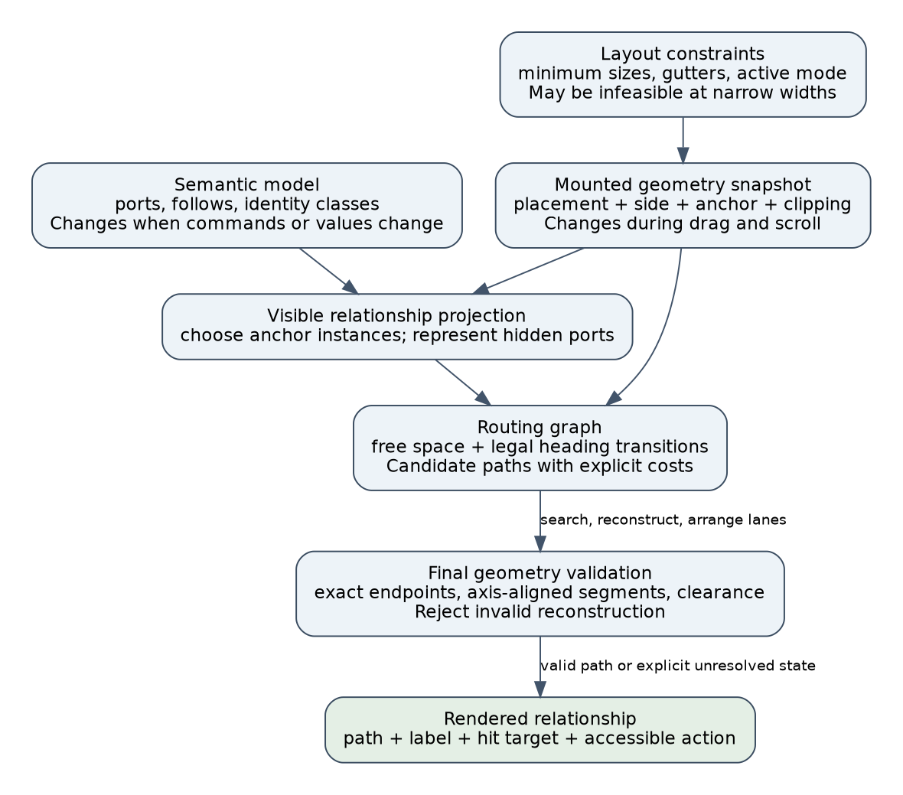

### 14.2 Layout is a feasibility problem before it is an optimization problem

Suppose a horizontal split gives two tiles widths $w_1$ and $w_2$, with a gutter $g$ inside a surface width $W$. Suppose readable content requires minimum widths $m_1$ and $m_2$. The basic constraints are:

$$
w_1 + w_2 + g = W, \qquad w_1 \ge m_1, \qquad w_2 \ge m_2.
$$

They are simultaneously satisfiable only when $W \ge m_1 + m_2 + g$. Preserving the preferred split ratio is a secondary objective. No amount of adjusting that ratio can solve an infeasible set of minimum widths. The same reasoning applies recursively to the split tree: a horizontal split adds child minimum widths and a gutter; a vertical split requires at least the larger child minimum width. Heights follow the corresponding dual rules.

As an illustrative design calculation, three columns with 220px minimum widths, two 24px gutters, and 16px total outer padding need 724px. These are hypothetical policy values, not minimums measured from the current implementation. At a 390px viewport, satisfying all those constraints requires changing the policy: stack or focus tiles, collapse optional details, or provide an intentional canvas that scrolls. Squeezing text until it becomes unreadable is an implicit relaxation of the readability constraint. It should be a deliberate product decision if used at all.

[Cassowary][F03] is relevant because it treats interface layout as incremental linear equalities and inequalities with required constraints and ranked preferences. Its opening discussion of constraint hierarchies is the useful starting point here. It does not by itself choose discrete alternatives such as stacked versus horizontal layout, nor solve obstacle routing. A PBUI implementation could begin with direct recursive minimum-size calculations; adopting a general solver would need additional justification.

This suggests a constraint vocabulary for [SplitPane][R08] and [Surface][R07]:

- **Required:** child bounds are valid; the chosen layout mode has enough room for its declared minima; interactive controls remain reachable.
- **Preferred:** retain the user's split ratio; minimize movement when wiring opens; keep associated tiles near each other.
- **Mode transition:** when required constraints become infeasible, select a documented alternative instead of pretending the current mode still fits.

Wire lanes have their own feasibility limits. Let a straight corridor have width $G$, wire ink width $s$, minimum gap between wire edges $q$, and clearance $c$ at each corridor wall. Accommodating $n$ parallel wires requires:

$$
2c + ns + (n-1)q \le G.
$$

When at least one wire fits, the maximum is $\lfloor(G-2c+q)/(s+q)\rfloor$. With $G=24$, $c=3$, $s=2$, and $q=4$, only three wires fit under those assumptions. Dividing gutter width by grid-cell size alone does not establish lane capacity. The comment that a 6px grid keeps a 24px gutter four lanes wide in [route.ts][R04] omits these visual constraints. Port entry stubs, labels, and selection targets can consume additional space.

### 14.3 Geometry needs a declared coordinate system and visibility model

Every point and rectangle should state its coordinate space. A DOM viewport point, a surface-local point, a scroll-content point, and a grid index are different quantities even if all are represented as two numbers. Mixing them is a dimensional error analogous to adding meters to seconds.

For a translation-only surface, a viewport point maps to surface coordinates by subtracting the surface origin. More generally, a point maps through the inverse of the transform from local space to viewport space. A product that supports only translation should document and test that assumption. Supporting arbitrary CSS transforms requires more than subtracting `getBoundingClientRect().left` and `.top`; rotated bounding rectangles also lose the original edge directions. This review does not propose adding arbitrary-transform support.

The proposed geometry snapshot should contain enough information to answer four different questions:

1. What logical port does this anchor represent?
2. Which placement and side own this particular anchor instance?
3. Where is it in the shared routing coordinate system?
4. Is it visible and usable within all relevant clipping ancestors?

An anchor can remain in the registry while its card is clipped. In the Crowded evidence, this is exactly why DOM existence was insufficient. The rendering policy needs a result such as `visible`, `clipped`, or `unmounted`, and possibly a reveal action. A boundary marker for an offscreen relationship should be visually distinguishable from a real jack; otherwise the picture implies a destination at a place where none exists.

The horizontal scrollbar also follows from geometry ownership. CSS distinguishes scrollable overflow from other kinds of visual overflow; descendant boxes can contribute to the scrollable area even when the content a person considers meaningful fits. See the [CSS Overflow specification's overflow concepts][F08]. The review's intervention established the concrete PBUI cause: the output jack's negative right offset added seven scrollable pixels inside the tile body. This is not evidence that every negative offset always causes a scrollbar.

The corresponding structural repair is to give application content the scrollport and give frame decoration a sibling overlay. Then scrolling application content cannot scroll the jack merely because its paint extends outside a card. Clipping can still be appropriate at an outer workspace boundary, but hiding all overflow is not a substitute for defining which layer owns it. [Tile][R22], [PortRail styles][R05], and [chrome.css][R20] are the relevant ownership boundaries.

### 14.4 Obstacle avoidance is a computational-geometry contract

Start with a wire as a centerline polyline $P=(p_0,\ldots,p_k)$. A valid orthogonal segment changes exactly one coordinate, or is a removable zero-length segment. Obstacles are rectangles representing tile areas that the route must avoid. Before discussing shortest paths, decide whether avoidance concerns the centerline, the painted stroke, or the interactive hit region.

For axis-aligned obstacles, expanding each rectangle by a chosen radius is a conservative way to reduce stroke-clearance checking to centerline checking. This is the configuration-space idea: move the wire's thickness into the obstacle model. With desired visual clearance $c$ and stroke width $s$, a useful expansion is $\delta=c+s/2$. Expanding by a square gives a conservative corner model for a round stroke. The geometric boundary convention—whether touching is allowed—must be explicit and consistent.

This is a proposed interpretation for PBUI. The existing `margin: 3` parameter does not itself document an ink-clearance guarantee, and grid rounding further affects it. The invisible hit path has a different width and purpose. Expanding every obstacle by the full hit width might make useful corridors impossible; allowing hit regions to overlap can instead make selection ambiguous. Those are separate interaction constraints, not a reason to misstate the visible route's clearance.

Port attachment needs a carefully scoped exception. A jack lies at a tile boundary, so a route must leave the source frame and enter the destination frame along an allowed stub. The current router clears short runs of blocked cells near endpoints. A stronger model would distinguish an allowed attachment corridor from arbitrary obstacle erasure, and would not clear a neighboring tile accidentally. The stub itself must be validated against unrelated obstacles.

For a horizontal segment from $x=a$ to $x=b$ at height $y$, it intersects the interior of a forbidden rectangle when:

$$
\text{top}<y<\text{bottom}
\quad\text{and}\quad
\max(\min(a,b),\text{left}) < \min(\max(a,b),\text{right}).
$$

The vertical case exchanges the axes. This exact interval test under the selected boundary convention is stronger than sampling points every few pixels. In this review, the 2px sampling diagnostic located observable failures; it was not a proof that unsampled segments were clear.

Floating-point comparisons need a policy, but numeric tolerance is not a repair for wrong topology. [Shewchuk's robust-predicate resources][F07] explain why geometric decisions near degeneracy can fail with ordinary floating-point arithmetic. PBUI's current diagonal is much simpler: reconstruction changes corners so that both coordinates differ between consecutive vertices. An epsilon cannot make that segment orthogonal. Begin with canonical coordinate units, explicit quantization, axis-aligned predicates, and separate tolerances for measurement and assertion. Introduce more elaborate exact predicates only if the supported geometry actually needs them.

### 14.5 A shortest path is only as meaningful as its state and cost model

The current [router][R04] searches a raster of free and blocked cells. Its state is `(cell, heading)`, with four headings. This extra dimension is essential because a turn penalty makes future cost depend on the direction of arrival.

Consider two paths arriving at the same cell: one from the west with accumulated cost 18, another from the north with cost 15. If the next required move is east and a turn costs 10, the totals after that move are 19 and 26. Keeping only the cheaper arrival at the cell would discard the better continuation. Recording heading makes the relevant history explicit in the state, restoring the condition that a state's outgoing transition costs can be evaluated locally.

With the current defaults, an allowed move has cost:

$$
1 + 10\,[\text{heading changes}] + 8\,[\text{destination cell occupied}].
$$

Brackets mean 1 when the condition is true and 0 otherwise. Costs are in grid-step units, not pixels. Thus a turn costs the same as ten extra unoccupied straight steps under this model. Changing cell size while retaining the constants changes the physical interpretation of that tradeoff. The occupied-cell penalty discourages reuse; it does not prohibit shared lanes, guarantee minimum separation, or identify the number of crossings.

[MIT's Dijkstra lecture][F04] provides the basis for relaxation and the correctness invariant under nonnegative edge weights. For a graph with $V$ states and $E$ transitions, a suitable binary-heap implementation has an $O((V+E)\log V)$ bound. In this bounded-degree grid, both scale with the number of cells, multiplied by the heading states. The concrete implementation also allocates predecessor and distance arrays and imposes separate grid-size and search budgets.

For PBUI, the search contract should name all of these restrictions:

- The graph is finite and bounded by the selected surface extent.
- Only unblocked transitions and permitted heading changes are available.
- Arrival direction is constrained; current search requires positive-x arrival.
- The result is optimal only for the represented graph and chosen costs when the algorithm completes normally.
- Budget exhaustion, a missing route in the graph, and invalid endpoint adaptation are different outcomes.

An A* variant could use Manhattan distance in grid steps to the target cell as a lower bound when moves cost at least one and all additional penalties are nonnegative. It ignores turn and occupancy penalties, so it does not overestimate the remaining cost in that graph. Appropriate graph-search bookkeeping is still required. This is an optimization proposal, not a reason to change algorithms before fixing the final-path invariant.

The principal alternative is an **orthogonal visibility graph**, whose edges represent unobstructed horizontal or vertical travel among geometrically useful points. Wybrow, Marriott, and Stuckey's [Orthogonal Connector Routing][F01] separates graph construction, direction-aware route search, and ordering/nudging shared segments. Its optimal-route result concerns length and bends within its stated model; it does not establish a global optimum for PBUI's complete visual scene. The paper is useful because it treats route topology and subsequent segment placement as distinct stages.

For this codebase, the choice should follow measurement. A uniform grid is straightforward but spends work on empty space and can omit a narrow continuous corridor through quantization. A visibility graph depends more on obstacle structure but has a more involved implementation and potentially quadratic graph size. Neither representation excuses invalid output. Keep the existing grid initially, define its limits, and profile realistic surface sizes and wire counts before replacing it.

### 14.6 Reconstruction is a separate algorithm with separate proof obligations

The most consequential PBUI bug occurs after search. A grid path can be orthogonal while conversion to exact jack coordinates introduces a diagonal. The 768px replay demonstrates that correct endpoints and successful search do not imply a valid final polyline.

There are three useful correctness terms:

- **Soundness:** every path reported as valid satisfies the declared geometric contract.
- **Completeness:** if an allowed path exists in the specified problem space, the procedure finds one. Completeness for a finite grid is weaker than completeness for continuous free space; a budget cutoff also changes the guarantee.
- **Optimality:** the returned path minimizes a stated objective among the allowed candidates. It says nothing about an unstated aesthetic or a different representation.

PBUI first needs sound final geometry. The current `Point[] | null` interface also loses useful distinctions among failure reasons. The following is a proposed replacement shape, not an existing API:

```text
RouteResult =
    Valid(points, cost, generation)
  | Unresolved(reason, endpointDescriptions, generation)

reason = noGraphPath | budgetExceeded | endpointBlocked
       | hiddenEndpoint | invalidReconstruction

route(problem):
    gridPath = search(problem)
    if search failed:
        return Unresolved(search.reason, ...)

    # Keep grid corners in their original coordinate system.
    candidates = attachExactPortsWithOrthogonalStubs(gridPath)
    for candidate in candidates ordered by preference:
        candidate = removeDuplicatesAndCollinearVertices(candidate)
        if validateFinalPolyline(candidate, problem):
            return Valid(candidate, cost(candidate), problem.generation)
    return Unresolved(invalidReconstruction, ...)
```

`attachExactPortsWithOrthogonalStubs` is deliberately not specified as “overwrite the first corner's y.” It must construct one or more legal orthogonal joins, preserve required departure and arrival directions, and check their clearance. Simplification may remove a vertex only if doing so preserves the geometric contract and attachment semantics. Lane nudging, if added, must be followed by validation again.

Validation should check finite coordinates, endpoint identity and position, permitted segment directions, obstacle clearance, bounds, and the selected clipping policy. Labels and hit paths should be derived from the same accepted polyline. For example, a label position can be chosen on a sufficiently long visible segment using arc length and a label-clearance rule. An obsolete midpoint from an earlier candidate route cannot satisfy that relationship by accident.

If no valid route can be produced, the UI can show a relationship list or a clearly distinguished unresolved marker. Drawing an obstacle-crossing fallback with ordinary successful-wire styling violates the user's expectation that the visible path explains the connection. A failure result can still preserve and expose the correct semantic relation.

### 14.7 Multiple wires turn local routing into a coupled optimization problem

Routing one wire changes the desirability of routes for other wires. The current layer orders wires by span and accumulates occupied cells. Consequently, changing order can change the picture even when the semantic graph and obstacles are unchanged. This is a greedy heuristic with a mutable cost environment, not independent shortest paths under one fixed objective.

A possible scene objective for discussion is:

$$
J = \alpha\sum_i L_i + \beta\sum_i B_i
    + \gamma X + \eta O + \tau D.
$$

Here $L_i$ is wire length, $B_i$ is bends, $X$ counts crossings under a defined intersection rule, $O$ measures unwanted overlap, and $D$ measures change from the previous visible scene. Each coefficient converts its term into comparable cost units. This is a proposed design model, not the cost function implemented today. A shared source stub may be intentional and should not automatically count like an unrelated ambiguous overlap.

The stability term matters during resizing. Two routes with nearly equal lengths can run on opposite sides of a tile. Switching between them as a divider moves by one pixel can make the UI difficult to track. A practical policy is to retain a still-valid corridor choice unless a new route improves the selected cost by a meaningful threshold. This introduces hysteresis. Invalid old routes must still be replaced immediately; stability cannot override obstacle avoidance or endpoint freshness.

There is also a distinction between route topology and lane placement. First decide which corridors a connection uses; then order and position parallel segments within those corridors. A final pass must check clearance and labels after these adjustments. This is an application of the staged structure described in [the orthogonal-routing paper][F01], rather than a claim that copying its algorithm automatically solves PBUI's clipping, duplicated-anchor, or interaction policies.

Useful initial improvements are deterministic tie-breaking by stable relationship IDs, explicit corridor-capacity checks, and avoiding unnecessary reroutes of still-valid geometry. Do not claim global optimality for them. If performance or readability remains inadequate, compare alternatives on the same measured scenes with recorded crossings, overlap, route changes, and selection success.

### 14.8 Geometry updates are incremental computation with dependencies

A wire is a derived value. Its dependencies include semantic endpoints, chosen mounted instances, their positions, other obstacles, clipping, routing policy, and possibly other routes' lane usage. Watching only the root surface's size is equivalent to caching a derived value while subscribing to only one of its inputs.

[Build Systems à la Carte][F05] distinguishes scheduling work from deciding whether a result needs rebuilding. The analogy here is useful: coalescing updates into animation frames answers when to compute, while tracking geometry dependencies answers what is stale. A frame scheduler cannot repair an incomplete invalidation model. This is an application of the paper's conceptual separation; the paper is not a browser-layout implementation guide.

The source evidence identifies an exact missing dependency. [SplitPane][R08] changes its local ratio during dragging, but publishes the document change on release. [WireLayer][R03] can therefore retain old positions while the visible tiles move. [PortRail][R02] compares selected local measurements, which need not change when an anchor translates horizontally with its tile. A geometry revision must advance for live layout changes, independently of durable document commits.

The [Resize Observer specification][F09] concerns observed element sizes and explicitly excludes notifications caused by CSS transforms. It is not a general position-change subscription. Observing a container whose size stays constant cannot be relied upon to report every descendant translation. A geometry owner therefore needs explicit signals for split movement, scroll, mounting, and supported transform changes, plus size observation where appropriate.

A minimal proposed update loop is:

```text
onRelevantGeometryChange(cause):
    pendingCauses.add(cause)
    if no frame already requested:
        requestAnimationFrame(flushGeometry)

flushGeometry():
    # Read together to avoid alternating layout reads and writes.
    measured = readAnchorsObstaclesAndClips()
    if measured differs from published snapshot:
        publishImmutableGeometry(measured, nextRevision())
    pendingCauses.clear()
    routeAndRenderCurrentSnapshot()
```

“Relevant” cannot mean only endpoints belonging to the moved tile. An unrelated tile can move into another wire's corridor. Conversely, removing an obstacle can make a better route available even if the old path remains valid. Validity invalidation and optional quality improvement have different urgency. [Incremental Connector Routing][F02] studies maintaining routing information as diagram objects change, including visibility relationships. Its algorithm concerns polyline routing; it supplies background for dependency-aware updates, not a drop-in proof for PBUI's orthogonal implementation.

For a small workbench, remeasuring and rerouting all visible relationships once per affected frame may be the simplest correct baseline. Optimize dependency subsets only after collecting timings. A spatial index can later answer which paths or corridor regions intersect a changed obstacle, but an incomplete index can create exactly the stale-picture problem it was intended to speed up.

The existing React-facing semantic APIs use `useSyncExternalStore`. Its [official contract][F10] requires appropriate subscription behavior and a cached snapshot identity when the underlying data has not changed. React does not discover missing geometry dependencies for the store. A separate immutable geometry snapshot can follow the same pattern while retaining its own revision and lifetime. Avoid making every pointer movement a durable semantic document mutation just to obtain a render notification.

### 14.9 Temporal correctness: the right answer for the right generation

Even a valid, freshly measured route can arrive too late if route computation becomes asynchronous. The safe design needs an explicit relationship between the inputs and the result. A useful key is a tuple of monotonically increasing revisions:

```text
generation = (semanticRevision, geometryRevision, policyRevision)

computeRoutes():
    input = captureCoherentSnapshot()
    captured = input.generation
    result = solveAndValidate(input)
    if captured != currentGeneration():
        discard(result)
        ensureCurrentWorkScheduled()
        return
    installPathsLabelsAndHitTargetsTogether(result)
```

This is proposed pseudocode, not evidence that the current router uses a worker. It is useful before introducing workers because it specifies the publication contract. A coherent snapshot must itself contain mutually compatible inputs; attaching a revision label to a mixture of measurements from different layouts would not make it coherent. In the synchronous browser path, perform the related reads together and avoid intervening application writes.

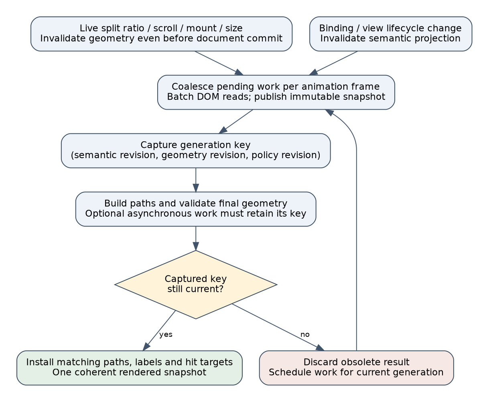

[Lamport's Specifying Systems][F06] provides the distinction between safety, liveness, and real-time requirements. Applied here, a **safety** property says that a result from an older generation is never installed as the current route. A **liveness** property says that, after inputs stop changing and computation can run, the display eventually reaches a valid or explicitly unresolved representation of the current relationships. A latency requirement adds a bound during ongoing interaction. Eventual correctness after mouse release does not satisfy a live-drag responsiveness requirement.

These statements expose two separate states that the product must handle. If the old route remains visible while new work is pending, the interface must decide whether to hide it, mark it as pending, or show a cheap validated preview. Simply rejecting an obsolete result does not prevent already-painted stale geometry from misleading the user. The current measured 130px detachment is evidence that this policy cannot remain implicit.

The practical first step is a small state machine and tests for sequences such as `drag → measure → drag → old result → new result → release`. Full TLA+ adoption is not a prerequisite. If future asynchronous routing becomes complex, the same state variables and invariants can become a compact formal model rather than being invented after a race appears.

### 14.10 Interaction correctness is more than geometric correctness

A wiring interface serves a person trying to identify, create, inspect, and remove relationships. Its state machine must make those operations discoverable and recoverable. A mathematically clear path that shares an indistinguishable hit area with another path does not let the user reliably choose the desired command target.

The proposed interaction can be expressed in input-independent states:

```text
Idle
  -> SourceChosen(source)
  -> Candidate(source, destination, proposedOperation)
  -> Committing(command)
  -> Completed(result) or Refused(reason)

SourceChosen or Candidate --cancel--> Idle
```

Drag, click-to-connect, and keyboard activation can produce the same transitions and execute the same command planner. Modifier keys can be shortcuts for operation selection, but the selected operation should also be visible and available without remembering a chord. Refusal should preserve enough context to explain the incompatible target and allow another choice. The truthful-fixture issue matters here: instructions for Hold and Share are misleading when the seeded state cannot execute those operations.

W3C's [Dragging Movements guidance][F11] calls for a single-pointer alternative that does not require dragging, subject to its stated exceptions. Keyboard support alone does not supply that pointer alternative. For PBUI, selecting a source and then a destination with separate clicks is a concrete design candidate; keyboard navigation should reach the same operation independently. The existing live-region announcer is feedback, not a replacement for usable input controls.

W3C's [Target Size guidance][F12] gives a 24-by-24 CSS-pixel minimum with specified exceptions, including spacing and equivalent controls. This is not a finding that every 12px PBUI jack violates the criterion: those jacks are currently decorative, while the cards initiate dragging. The correct review target is the actual interactive region and its alternatives. A small painted square can have a larger accessible control, but overlapping enlarged hit areas still need an unambiguous selection policy.

For wire inspection, a relationship list or a selected wire's explicit menu can resolve ambiguity where several paths share a stub. For narrow layouts, preserving readable names and an accessible connection workflow is more valuable than maintaining every desktop column at any cost. Evaluate task completion—can the user connect Source A's number to the intended sink, verify the effect, and undo it—alongside route length and screenshot aesthetics.

### 14.11 Turn the principles into independent tests

Tests should challenge the output contract rather than repeat the implementation's internal steps. A test that expects the same snapped corners as `routeAround` can preserve the very reconstruction mistake under review. An independent geometric validator should inspect the final points or SVG path actually used by the renderer.

The following proposed properties address distinct failure classes:

- **Final geometry:** every nonzero segment is horizontal or vertical; endpoints equal the chosen anchors within the declared measurement tolerance; permitted stubs are directional; segments avoid forbidden rectangles analytically.
- **Small-graph optimality:** compare returned search cost with an independent exhaustive or reference shortest-path oracle on tiny generated graphs. This tests the search model, not continuous-space optimality or rendering validity.
- **Translation:** translating anchors, obstacles, bounds, and the grid origin together should translate a valid result without changing its cost. Translating only the scene relative to a fixed lattice is a different experiment and need not produce the same route.
- **Scaling:** scaling all physical dimensions, clearance, grid size, and relevant policy thresholds together can support a scale-equivariance property. Changing viewport width alone is a relayout, not a uniform scaling transformation.
- **Obstacle edits:** inserting an obstacle must never leave a reported-valid path intersecting it; removing an obstacle must not make an existing valid path geometrically invalid. Whether removal immediately improves the route is a separate quality policy.
- **Temporal publication:** permuting completion order cannot allow an older generation to replace a newer one. Test the pending presentation state as well as the installed-result key.
- **Live browser behavior:** hold a divider mid-drag and measure endpoint alignment before release; combine resize with scroll; verify clipped anchors and unintended horizontal scroll extent. A post-release screenshot cannot substitute for these assertions.
- **Semantic truth:** assert every fixture command result and expected relation kind before taking a screenshot. Separately test click, drag, keyboard, cancellation, refusal, inspection, and removal against the same command contract.

Randomly generated rectangles and fractional endpoints are useful because short paths, immediate turns, narrow channels, and nearly coincident coordinates are easy to omit from hand-written examples. Preserve failing seeds as small fixtures. Screenshots remain valuable for text readability, contrast, traceability, and density; geometric assertions remain valuable for defects too subtle or transient to see reliably. Neither is a replacement for the other.

A principled repair sequence follows from these dependencies: make fixture assertions truthful; establish sound final geometry; make geometry publication current during interaction; correct scrolling and visibility ownership; provide usable input alternatives; then optimize route quality and performance. Replacing Dijkstra, introducing a constraint solver, or adding a worker before those contracts exist would increase the amount of machinery without establishing the missing guarantees.

### 14.12 Annotated primary-source reading guide and local archive

For a new intern, begin with the shortest-path lecture and the orthogonal-routing paper, while keeping [route.ts][R04] open. Next read the browser specifications alongside the measured scrollbar and divider findings. Read the opening constraint-hierarchy discussion in Cassowary before designing narrow-layout behavior. The incremental-computation and specification references become useful once the basic route and geometry contracts are clear. There is no need to read the entire Lamport book before fixing a corner reconstruction bug.

The downloads are source material, not files modified to match this report. PDF text extractions are stored alongside the originals for local search. HTML files are snapshots of the retrieved document, not complete offline mirrors of linked scripts, styling, images, or child pages. The manifest records the exact downloaded bytes; specifications and API pages may change upstream after retrieval.

- **F01 — Wybrow, Marriott, Stuckey, Orthogonal Connector Routing (2009).** Read sections 2–5: problem definition, orthogonal visibility graph, search, and shared-segment arrangement. Use it to distinguish path selection from lane placement. [Author-hosted PDF][F01] · [local PDF](../sources/foundations/01-orthogonal-connector-routing.pdf) · [searchable text](../sources/foundations/01-orthogonal-connector-routing.txt).
- **F02 — Wybrow, Marriott, Stuckey, Incremental Connector Routing (GD 2005; proceedings 2006).** Read the problem and incremental graph-maintenance discussion. Use it to ask which object changes invalidate routes or reveal better ones; remember its polyline setting. [Author-hosted PDF][F02] · [local PDF](../sources/foundations/02-incremental-connector-routing.pdf) · [text](../sources/foundations/02-incremental-connector-routing.txt).
- **F03 — Badros, Borning, Stuckey, The Cassowary Linear Arithmetic Constraint Solving Algorithm.** Start with section 1.1 on constraint hierarchies; continue into the algorithm if a solver is actually being considered. Use it to separate required layout constraints from preferences. [Author-hosted manuscript][F03] · [local PDF](../sources/foundations/03-cassowary.pdf) · [text](../sources/foundations/03-cassowary.txt).
- **F04 — MIT 6.006, Lecture 16, Shortest Paths II: Dijkstra (2011).** Work through relaxation, the nonnegative-weight assumption, and the running-time discussion. Then explain why PBUI's vertex includes heading. [MIT lecture PDF][F04] · [local PDF](../sources/foundations/04-mit-dijkstra.pdf) · [text](../sources/foundations/04-mit-dijkstra.txt).
- **F05 — Mokhov, Mitchell, Peyton Jones, Build Systems à la Carte (2018).** Read the introduction and scheduler/rebuilder decomposition. Apply the dependency vocabulary to geometry cache invalidation; this is an analogy across domains. [Microsoft Research PDF][F05] · [local PDF](../sources/foundations/05-build-systems.pdf) · [text](../sources/foundations/05-build-systems.txt).
- **F06 — Leslie Lamport, Specifying Systems (2002).** The opening chapters introduce behavior and state; chapter 8 addresses liveness and chapter 9 real time. Use these distinctions to specify generation freshness and drag responsiveness. [Author-hosted book][F06] · [local PDF](../sources/foundations/06-specifying-systems.pdf) · [text](../sources/foundations/06-specifying-systems.txt).
- **F07 — Jonathan Richard Shewchuk, robust computational-geometry predicates.** Read the resource page's explanation of floating-point geometric failures. It sets the context for robust comparisons, not a prescription to deploy exact arithmetic throughout this axis-aligned router. [Author resource page][F07] · [local HTML](../sources/foundations/07-robust-predicates.html).
- **F08 — W3C, CSS Overflow Module Level 3.** Read the overflow-concepts and scrollable-overflow sections. Relate box ownership to the seven-pixel jack experiment before proposing CSS changes. [Specification][F08] · [local HTML](../sources/foundations/08-css-overflow.html).
- **F09 — W3C, Resize Observer.** Read the introduction's notification behavior and observation-box definitions. Use the API for size changes, with explicit invalidation for position and scroll dependencies. [Specification][F09] · [local HTML](../sources/foundations/09-resize-observer.html).
- **F10 — React, useSyncExternalStore.** Read `subscribe`, `getSnapshot`, and the cached-snapshot caveat. Apply the contract to an immutable geometry store if that proposed design is adopted. [Official API reference][F10] · [local HTML](../sources/foundations/10-react-external-store.html).
- **F11 — W3C WAI, Understanding SC 2.5.7: Dragging Movements.** Read the intent and examples to design a pointer alternative without dragging, alongside keyboard access. [Official guidance][F11] · [local HTML](../sources/foundations/11-dragging-movements.html).
- **F12 — W3C WAI, Understanding SC 2.5.8: Target Size (Minimum).** Read the criterion and exceptions before evaluating the actual card and wire controls. [Official guidance][F12] · [local HTML](../sources/foundations/12-target-size.html).
- **F13 — Adaptagrams, libavoid Router API.** Inspect `setTransactionUse` and `processTransaction`: they provide a concrete API precedent for accumulating shape/connector changes and routing them together. This archived generated documentation is a design reference, not a recommendation to add a C++ integration or a claim about the newest release. [Project API reference][F13] · [local HTML](../sources/foundations/13-libavoid-router.html).

Reproduce source collection with [05-collect-foundations.py](../scripts/05-collect-foundations.py); reproduce the two new diagrams with [06-render-foundations-diagrams.py](../scripts/06-render-foundations-diagrams.py). Downloading the references does not run their example code. The product implementation remains unchanged by this documentation addition.

[F01]: https://users.monash.edu/~mwybrow/papers/wybrow-gd-2009.pdf
[F02]: https://users.monash.edu/~mwybrow/papers/wybrow-gd-2005.pdf
[F03]: https://badros.com/greg/papers/cassowary-tochi.pdf
[F04]: https://ocw.mit.edu/courses/6-006-introduction-to-algorithms-fall-2011/6277a1f06100c26a7ff21031af6757b5_MIT6_006F11_lec16.pdf
[F05]: https://www.microsoft.com/en-us/research/wp-content/uploads/2018/03/build-systems.pdf
[F06]: https://lamport.azurewebsites.net/tla/book-02-08-08.pdf
[F07]: https://www.cs.cmu.edu/~quake/robust.html
[F08]: https://www.w3.org/TR/css-overflow-3/
[F09]: https://www.w3.org/TR/resize-observer/
[F10]: https://react.dev/reference/react/useSyncExternalStore
[F11]: https://www.w3.org/WAI/WCAG22/Understanding/dragging-movements.html
[F12]: https://www.w3.org/WAI/WCAG22/Understanding/target-size-minimum.html
[F13]: https://www.adaptagrams.org/documentation/classAvoid_1_1Router.html

[R01]: ../../../../../../src/chrome/usePortCarry.ts
[R02]: ../../../../../../packages/pbui-workbench/src/components/PortRail/PortRail.tsx
[R03]: ../../../../../../packages/pbui-workbench/src/components/WireLayer/WireLayer.tsx
[R04]: ../../../../../../packages/pbui-workbench/src/components/WireLayer/route.ts
[R05]: ../../../../../../packages/pbui-workbench/src/components/PortRail/PortRail.module.css
[R06]: ../../../../../../packages/pbui-workbench/src/stories/WiringLab.stories.tsx
[R07]: ../../../../../../packages/pbui-workbench/src/components/Surface/Surface.tsx
[R08]: ../../../../../../packages/pbui-workbench/src/components/SplitPane/SplitPane.tsx
[R09]: ../../../../../../packages/pbui-workbench/src/createWorkbenchShell.tsx
[R10]: ../../../../../../packages/workbench-core/src/createWorkbenchCore.ts
[R11]: ../../../../../../packages/workbench-core/src/links/collaborator.ts
[R12]: ../../../../../../src/presentation/links/types.ts
[R13]: ../../../../../../src/presentation/links/terms.ts
[R14]: ../../../../../../src/presentation/links/expression.ts
[R15]: ../../../../../../src/presentation/links/evaluate.ts
[R16]: ../../../../../../packages/pbui-ecommerce/src/ShopShell/ShopShell.tsx
[R17]: ../../../../../../packages/pbui-workbench/src/links/hooks.ts
[R18]: ../../../../../../packages/workbench-core/src/links/runtime.ts
[R19]: ../../../../../../src/presentation/links/plan.ts
[R20]: ../../../../../../public/chrome.css
[R21]: ../../../../../../packages/pbui-workbench/src/components/Surface/Surface.module.css
[R22]: ../../../../../../packages/pbui-workbench/src/components/Tile/Tile.tsx
[R23]: ../../../../../../packages/pbui-workbench/src/components/WireLayer/WireLayer.module.css
[R24]: ../../../../../../packages/pbui-workbench/src/components/WireLayer/route.test.ts
[R25]: ../../../../../../packages/pbui-workbench/src/links/identity.test.tsx
[R26]: ../../../../../../packages/pbui-workbench/src/stories/VisualAudit.stories.tsx
[R27]: ../../../../../../src/presentation/links/snapshot.ts
[R28]: ../../../../../../packages/pbui-workbench/src/components/LinkAnnouncer/LinkAnnouncer.tsx
