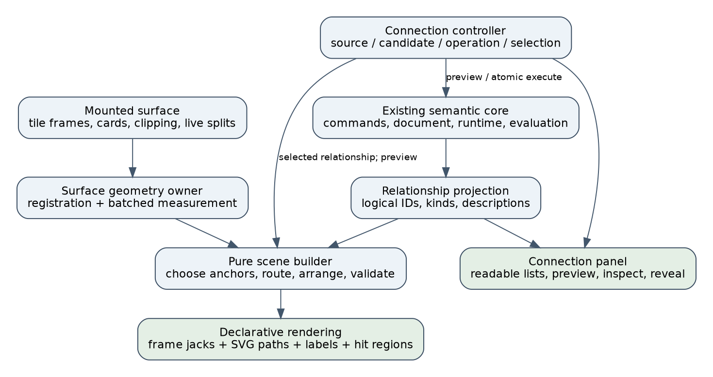
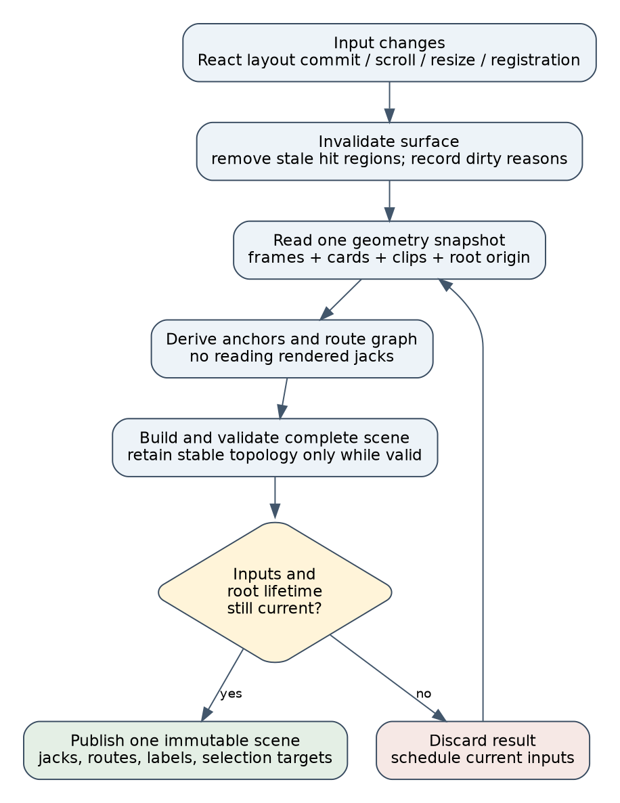
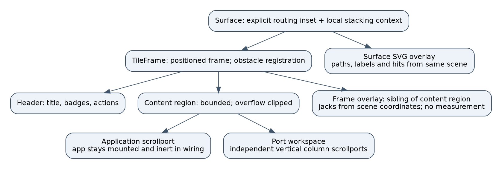
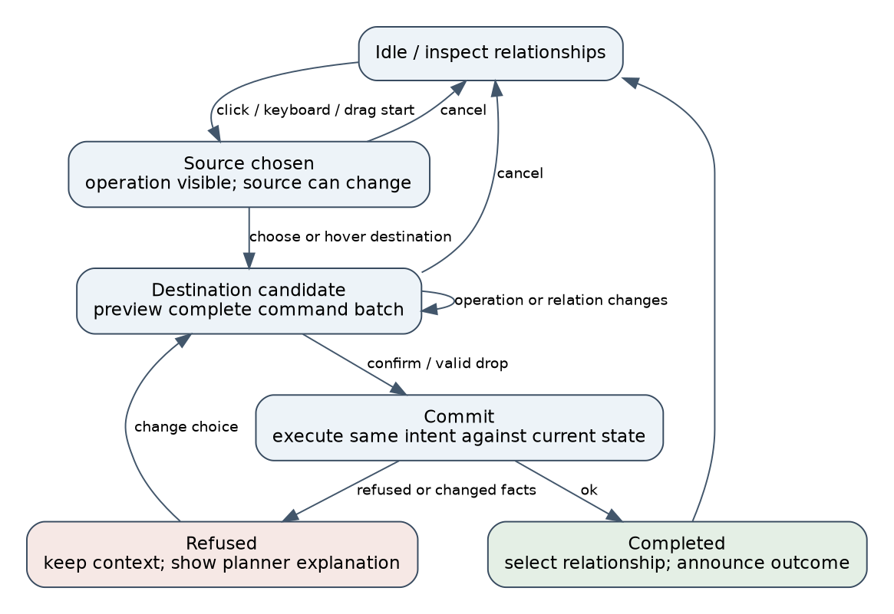

# Wiring scene refactoring architecture and intern implementation guide

Implementation follow-up: see the [implemented architecture and validation handoff](05-implemented-wiring-architecture-and-validation-handoff.md), with current APIs, source paths, screenshots, measured results and limitations.

## 1. Design position and how to read this guide

Replace the wiring presentation with a surface-owned system that computes one coherent scene from semantic relationships, live geometry, and interaction state. A scene is an immutable description of what should be drawn and selected: visible jacks, accepted wire paths, labels, hit regions, endpoint markers, and unresolved relationships. React components render that description. They do not independently reconstruct different versions of its geometry.

This is a new design document, separate from the [architecture and browser review](03-intern-architecture-and-implementation-review-with-interactive-resize-evidence.md). It incorporates the user's explicit constraint: this work is fresh and unmerged, and any component or API may be refactored without migrations, shims, or compatibility adapters. Update repository callers directly and delete obsolete implementations. Do not preserve an old public shape merely because it exists today.

The scope is the wiring subsystem and the layout boundaries it needs. Preserve the semantic link kernel, transactional core, and application value flow where they already satisfy their contracts. Introduce new semantic behavior only when a concrete requirement cannot be expressed through those APIs. In particular, the core already supports atomic command batches; the connection UI should use them.

**Original design status (before implementation):** proposed implementation design. No product code has been changed by this document. Source inspection was refreshed at commit `e9fcbeb` on 2026-09-04. The earlier browser evidence was captured against the implementation at `142b458a`; the intervening commits added review documentation. This session also ran a small probe against the existing local built core to verify atomic Follow-plus-Pin behavior. Its scope and output are documented below.

For an intern, read sections 2–4 before opening the routing code. Sections 5–10 define the replacement contracts and behavior. Section 11 lists the decisions and alternatives; section 12 turns them into file-level implementation phases. Sections 13–15 provide acceptance tests, an API/source map, and research references. All new types and module paths in the proposal are explicitly marked as proposed; the source map identifies what exists now.

The intended first usable result is a complete wiring surface where a person can create a connection, resize a divider, scroll a port column, inspect a relationship, and leave wiring without losing application state or seeing a misleading connection. Performance tuning follows measurement of that result.

## 2. The system an intern needs to understand

### 2.1 What a connection means

PBUI supplies typed presentations and interaction primitives. Its workbench arranges application views into tiles. An application declares ports in a manifest and uses hooks to emit or read values. A connection records how an input obtains its value. The visible wire explains that connection; it is not a transport mechanism.

For example, a source app emits `{type: "number", value: 42}`. An input following that source evaluates the latest emitted reference. A transform can read the input and emit another reference. React rerenders the affected applications through their subscriptions. SVG is not involved in evaluation, so dragging a divider must never change the meaning of the connection.

The principal relationship kinds are:

- **Follow:** a directed input dependency on a source port.
- **Derived:** a dependency that applies a declared relation to the source before presenting the result.
- **Held:** a captured reference with a suspended binding underneath it. A wire may explain the suspended relationship, but must communicate that it is not currently following live changes.
- **Identity / Share:** a declared association of compatible ports with a shared value cell. Its semantics are symmetric even if a drawing chooses a left and right endpoint.

The kernel's [terms][S15], [evaluation][S16], and [planning][S17] define these meanings. Presentation must describe the real term and refusal result rather than infer semantics from a line style, modifier key, or location.

### 2.2 Identity has several levels

A **view** is a logical application instance. A **placement** is a tile showing that view. Duplicated placements can display the same view and therefore share port IDs and bindings. A **port** is a named endpoint on a view. An **anchor instance** is one rendered side of that port in one placement on one surface. An inout port can have both input and output anchors.

These identities must not collapse into one string whose meaning changes by call site. A semantic command takes port IDs. Geometry registration takes an anchor-instance key. A selected scene wire identifies both a semantic relation and its particular rendered occurrence. Removing one placement must not remove the anchors registered by another placement of the same view.

A **relationship occurrence** is the proposed term for one visible representation of a logical relationship. A follow with two visible destination placements ordinarily has two occurrences. Removing one occurrence by closing its tile is different from issuing an unlink command, which changes the shared semantic binding.

### 2.3 Package boundaries and state lifetimes

The current packages provide useful separation:

- `src/presentation/links/` in the root PBUI package contains the headless link language, compatibility planning, evaluation, and identity behavior.
- `packages/workbench-protocol/` defines document structures, layout nodes, and mutations.
- `packages/workbench-core/` owns commands, transactional planning, validated document installation, the session, and link runtime collaboration.
- `packages/pbui-workbench/` owns the React shell, mounted layout, browser interaction, and product-facing presentation integration.
- `packages/pbui-ecommerce/` is a concrete consumer that adds product presentations and menus.

The document contains durable views, layout, and binding terms. The runtime contains emitted, attended, context, and shared-cell values. The shell contains transient interface choices. The proposed geometry and scene stores are also transient and surface-local. Do not serialize DOM rectangles, route points, pointer positions, or selected anchor instances into the workbench document.

Keep the replacement inside `pbui-workbench/src/wiring/` initially. Its pure modules can be imported by tests without mounting React. Its browser modules can depend on DOM APIs. A new package is unnecessary until another consumer needs these pure routing facilities independently.

### 2.4 The semantic command path already exists

The current shell exposes `execute` and `preview`, forwarding to the core and measuring layout only for commands that require it. The core's planner builds a draft transition, validates mutations, installs state, and publishes effects through its gateway. Preview is advisory: commit calls execute again against current facts. See [createWorkbenchShell][S07], [createWorkbenchCore][S11], and [planner/plan][S12].

Use the existing API for an atomic Hold operation:

```typescript
const commands: WorkbenchCommand[] = [
  { kind: "port.follow", source, destination },
  { kind: "port.pin", port: destination },
];

const preview = workbench.preview(commands);
// Display preview.ok or its refusal explanation.
// On confirmation, execute again; preview is not a commit token.
const result = workbench.execute(commands);
```

The [atomic Hold probe](refactor-assets/atomic-hold-probe.json), produced by [script 07](../scripts/07-probe-atomic-hold.mjs), exercised both cases. With no emitted value, preview and execute refused at command index 1, the document remained unchanged, no destination binding existed, and core publication count was zero. After emitting `42`, preview changed nothing, execute installed a held binding, and the core published once. This used local built core artifacts; the source planner was independently inspected, but this is not a claim that all future command combinations have been tested.

The implication is concrete: do not implement Hold through two separate calls and repair partial success afterward. Build one intent into one command batch and use that batch for both preview and commit.

## 3. Current behavior and why the boundaries need to change

### 3.1 How the present picture is assembled

[Surface][S01] recursively renders the split tree. Each [Tile][S02] places its application and, in wiring mode, a [PortRail][S03] inside the generic [TileFrame][S09]. The application remains mounted and becomes inert. PortRail constructs cards, registers their DOM elements, measures their centers, renders jacks, and emits a custom event after jack state commits.

[WireLayer][S04] reads the semantic snapshot and a module-global carry store, looks up port elements, searches for jacks, measures tile obstacles, chooses endpoint instances, sorts wires, routes them, calculates labels, and renders SVG. Its invalidation sources include window resize, root resize, scroll capture, and `pbui:jacks-placed`. Routing occurs while constructing the render output.

[SplitPane][S06] changes a component-local ratio during a drag and commits the durable ratio on release. [usePortCarry][S08] holds global port registration and carry state in the root PBUI package. The existing [command geometry module][S10] separately measures placements and splits for core commands. These are distinct consumers of geometry, but their current ownership is not explicit enough to keep the wiring scene current.

### 3.2 Evidence-to-design mapping

The preceding review contains the screenshots and measurements. This design uses them as acceptance fixtures, not as evidence that the replacement has already fixed anything.

| Observed problem | Structural cause to address | Replacement obligation |
|---|---|---|
| A diagonal crosses Transform after resize | Final endpoint reconstruction modifies searched corners | Validate the final exact-coordinate path after every geometric transformation |
| Wires detach during a held divider drag | Geometry changes without a corresponding wire update | Publish live geometry independently of document commit |
| Output tiles have 7px horizontal scrolling | Frame decoration contributes to content overflow | Put frame decoration outside the content scrollport |
| A mounted but clipped theta port still has a full wire | DOM presence is treated as visibility | Model clipping and unavailable anchors explicitly |
| A derived label floats away from its route | Label position uses a different path calculation | Derive label and hit regions from the accepted route |
| Hold can leave a Follow if Pin fails | Separate command execution and incomplete preview | Preview and execute one atomic intent |
| Identical ports can exist in several roots | Module-global registry lacks surface ownership | Use surface and placement identities with exact cleanup |
| Narrow columns become unreadable | No explicit infeasibility response | Switch wiring presentation mode before minimum usable sizes fail |


### 3.3 What to preserve and what to replace

Preserve the meanings of commands, kernel compatibility rules, application hooks, product type graphs, and the core's atomic execution gateway. Preserve the useful behavior that wiring mode leaves applications mounted. Preserve access to existing relation and object actions, while moving their wiring entry points onto the new controller.

Replace the global port carry/anchor subsystem for wiring, the WireLayer measurement-and-routing implementation, PortRail's jack-measurement state, the custom jack notification event, implicit frame/content scroll ownership, and the fallback path that silently crosses obstacles. Rewrite affected tests around observable contracts. The deletion checklist in section 12 is part of completion, not optional cleanup.

## 4. Requirements and explicit invariants

An invariant is a statement every accepted state must satisfy. It gives implementation and review a stronger target than “looks better.” The proposed subsystem has four groups of invariants.

**Semantic invariants:** interaction does not mutate bindings before commit; every command result is handled; a refused batch leaves no partial binding; geometry changes cannot alter port identity; a selected relationship's actions operate on its logical ID, not whichever path happens to be underneath the pointer.

**Geometry invariants:** all scene coordinates use one surface-local CSS-pixel space; visible endpoints refer to current anchor instances; every successful path is finite, orthogonal, within declared bounds, and obstacle-clear under its attachment exceptions; jacks, paths, labels, and hit regions use the same accepted geometry generation.

**Lifecycle invariants:** registration cleanup removes only its own registration; a destroyed root cannot publish a scene; unmount cancels pending frames, subscriptions, and capture; a result computed for obsolete inputs cannot replace a current scene; opening or changing wiring mode does not remount application components.

**User-facing invariants:** an unavailable endpoint is distinguishable from a real connection point; every drag operation has a click alternative and keyboard route; actual controls have accessible names; ordinary content has no horizontal scrollbar caused solely by decoration; labels and essential actions remain usable in the selected layout mode.

The first implementation supports axis-aligned workbench layout with ordinary translation and scrolling. Arbitrarily rotated or skewed ancestors are outside the scene coordinate contract. If encountered, show the focused connection interface or a clearly diagnosed unsupported geometry state. Do not silently apply viewport subtraction to a transform that requires a full inverse matrix.

## 5. Proposed architecture and module ownership

### 5.1 One surface owns one wiring session

Create a `WiringProvider` for the mounted Surface. It owns geometry registration, a connection controller, subscriptions, and the current scene. Its lifetime follows the root element. Separate workbench shells on one page have separate providers even when restored documents contain identical port IDs. The present shell exposes one root; retain a clear one-mounted-Surface-per-shell contract rather than quietly overwriting root ownership. A second simultaneous surface for the same shell should be rejected explicitly until that feature is designed.

The provider coordinates a small set of concrete modules. It is not a service locator or plugin framework. Dependencies are passed explicitly; pure functions do not reach into React context or query the DOM.



Proposed files under `packages/pbui-workbench/src/wiring/`:

- `model.ts`: anchor keys, geometry, semantic projection, scene, route outcomes, and policy types.
- `projectRelations.ts`: produce stable logical relation descriptions and mounted occurrences.
- `geometryStore.ts`: exact registration lifetimes, subscriptions, dirtiness, and immutable snapshots.
- `measureSurface.ts`: batch DOM reads for registered frames, cards, clips, and root bounds.
- `scene.ts`: choose anchors, route relationships, place labels, construct hit data, and report diagnostics.
- `routing/obstacles.ts`, `visibilityGraph.ts`, `search.ts`, `attachments.ts`, `lanes.ts`, `validate.ts`: independent geometric stages.
- `connectionController.ts` and `connectionCommands.ts`: transient interaction state and intent-to-command construction.
- `WiringProvider.tsx`, `WiringCanvas.tsx`, `PortWorkspace.tsx`, `ConnectionPanel.tsx`, and `WiringInspector.tsx`: React composition and controls.
- `policy.ts` and `wiring.module.css`: declared layout/routing values and visual parts.

These names are proposed targets, not existing source links. Keep them ordinary modules with direct imports. Avoid a generic router registry or multiple production backends merely to compare algorithms during development.

### 5.2 Proposed data contracts

The following TypeScript sketches show responsibilities and required distinctions. They are not complete compile-ready declarations; existing `PortId`, `WorkbenchCommand`, and reference types should be imported from their owners.

```typescript
type AnchorSide = "in" | "out";
type SurfaceId = string;
type PlacementId = string;

interface AnchorKey {
  surfaceId: SurfaceId;
  placementId: PlacementId;
  portId: PortId;
  side: AnchorSide;
}

interface Point { readonly x: number; readonly y: number }
interface Rect {
  readonly left: number; readonly top: number;
  readonly right: number; readonly bottom: number;
}

type AnchorVisibility =
  | { kind: "visible" }
  | { kind: "clipped"; edge: "top" | "bottom" | "left" | "right" }
  | { kind: "unavailable"; reason: string };

interface AnchorGeometry {
  readonly key: AnchorKey;
  readonly point: Point;
  readonly normal: Point; // Axis-aligned outward direction.
  readonly cardRect: Rect;
  readonly clipRect: Rect;
  readonly visibility: AnchorVisibility;
}

interface GeometrySnapshot {
  readonly surfaceId: SurfaceId;
  readonly revision: number;
  readonly bounds: Rect;
  readonly frames: ReadonlyMap<PlacementId, Rect>;
  readonly anchors: ReadonlyMap<string, AnchorGeometry>;
}

interface SceneKey {
  readonly surfaceEpoch: number;
  readonly projectionRevision: number;
  readonly geometryRevision: number;
  readonly policyRevision: number;
}
```

Use an explicit key encoder for maps; do not concatenate arbitrary components with an unescaped separator and later split them. A JSON tuple or nested maps are sufficient. The lifetime epoch distinguishes a remounted root from an earlier root whose numeric geometry revision happens to match.

The new wiring snapshot is not the existing core command `GeometrySnapshot`. Use an unambiguous exported name such as `WiringGeometrySnapshot` in actual code. The shortened name above makes the sketch readable; there should not be two indistinguishable imported types in one module.

```typescript
type RouteOutcome =
  | { kind: "valid"; points: readonly Point[]; cost: number }
  | { kind: "unresolved"; reason: RouteFailure };

type RouteFailure =
  | "hidden-endpoint" | "missing-endpoint" | "blocked-attachment"
  | "no-path" | "budget-exceeded" | "invalid-final-geometry";

interface WireOccurrence {
  readonly occurrenceId: string;
  readonly linkId: string;
  readonly from: AnchorKey | null;
  readonly to: AnchorKey | null;
  readonly outcome: RouteOutcome;
  readonly label: LabelPlacement | null;
  readonly hit: HitGeometry | null;
}

interface WiringScene {
  readonly key: SceneKey;
  readonly jacks: readonly JackPlacement[];
  readonly wires: readonly WireOccurrence[];
  readonly markers: readonly EndpointMarker[];
  readonly diagnostics: readonly SceneDiagnostic[];
}
```

Define `LabelPlacement` as text, a rectangle, and its owning segment/occurrence. Define `HitGeometry` as the accepted centerline plus an interaction width and occurrence ID. Define a marker with the logical endpoint, boundary location if one exists, and a reveal/inspect action. Keep diagnostic codes machine-readable and their developer details out of normal product text.

Keep `linkId` distinct from a derived binding's `relationId`: the former identifies the connection declaration, while the latter names the transformation selected from the product relation catalog. Scene selection and unlink operate on the connection; a derived-operation chooser selects a transformation. Reusing one field name for both would reintroduce semantic ambiguity into the new model.

The scene builder receives measured geometry and already-normalized relationships. Runtime value updates can refresh badges, compatibility previews, and descriptions without automatically repeating route search. Derive a projection revision from actual changes in relationship topology and anchor-relevant presentation. If value text changes card dimensions, size measurement supplies the necessary geometry revision.

### 5.3 Public integration and customization

Keep `workbench.execute`, `workbench.preview`, `usePort`, and `useEmitPort` as the semantic doors. Introduce one proposed `Surface.wiring` options object for presentation policy and additive content. Remove `renderPort` and `renderWire` after updating their callers directly.

```typescript
interface WiringOptions {
  mode?: "auto" | "spatial" | "focused";
  policy?: Partial<WiringPolicy>;
  renderPortDetails?(port: PortRef): ReactNode;
  relationshipActions?(relation: LinkRef): readonly WiringAction[];
}

// Proposed Surface call site:
<wb.Surface wiring={{
  mode: "auto",
  renderPortDetails: renderProductPortDetails,
  relationshipActions: productRelationshipActions,
}} />
```

The shell owns the actual button, anchor registration, names, focus behavior, and default relationship actions. Custom content is rendered inside a dedicated details region and cannot replace the required control. `WiringAction` describes a stable action ID, readable label, enabled/refusal state, and invocation through the product's existing verb router. Additional product actions extend the inspector; they do not remove Follow/Hold/Share/derive/unlink behaviors that the kernel supports. Update ecommerce's presentation integration explicitly so product-specific actions remain available without wrapping an entire SVG group in opaque behavior.

This is a deliberate API change. Existing descriptor semantics can be reused in the inspector, but no wrapper is retained to translate the old `renderWire(link, node)` signature to the new contract.

## 6. Geometry ownership, timing, and lifecycle

### 6.1 Register measurable inputs, not derived jacks

A frame registers its element and placement ID. A port control registers its card element, side, port ID, placement ID, and relevant clipping element. The geometry owner measures them and derives jack positions from the card center and frame edge. The rendered jack is output, so it never needs to be measured to discover a wire endpoint.

This removes the current cycle: measure card, render jack, announce jack commit, measure jack, render wire. A single geometry snapshot produces both jack and wire coordinates. Frame overlays can render local positions by subtracting the frame origin from the same surface coordinates. Neither renderer introduces a new measurement dependency.

Registration returns an exact disposer:

```typescript
interface GeometryRegistration {
  registerFrame(id: PlacementId, element: HTMLElement): () => void;
  registerAnchor(
    key: AnchorKey,
    card: HTMLElement,
    clip: HTMLElement,
  ): () => void;
  invalidate(reason: GeometryDirtyReason): void;
}
```

Each registration receives an internal token. Cleanup removes an entry only if that token still owns it. A callback ref retains and invokes its previous disposer before registering a replacement. Development Strict Mode's setup/cleanup cycle must leave exactly the live registrations. There is no “null means clear every anchor on this side” behavior.

### 6.2 Coordinate and clipping rules

Measure viewport rectangles together, then subtract the root's declared coordinate origin. Include borders consistently: the origin used by the SVG viewBox, frame overlay, and measured anchor points must be the same padding/border reference. Test a nonzero root border and page scrolling rather than relying on a borderless Storybook root.

For supported axis-aligned clipping, intersect the card's bounds with its clipping ancestors and the surface viewport. A visible sliver does not automatically make an offscreen center into a usable jack. The initial policy requires the jack center to be within the vertical clip interval and the control to retain a usable visible region. If not, classify the anchor as clipped and expose it through the relationship list and reveal action.

Keep mounted-but-inactive, clipped, and unmounted states distinct. A source in another workspace may exist semantically without having any local anchor. Do not query another root and borrow its coordinates. Hidden relationships remain inspectable in the panel even when no spatial occurrence can be drawn.

### 6.3 One invalidation protocol

Relevant causes include root or frame size changes, port content size changes, font/layout changes affecting cards, root or ancestor scrolling that changes the coordinate mapping, port-column scrolling, live split commits, layout-tree replacement, mount/unmount, and wiring mode changes. During active drag or resize, schedule a bounded per-frame measurement loop so movement is tracked even when an observed box retains the same size.

Use size observers for size dependencies and explicit integration for position-changing operations. The [Resize Observer specification](https://www.w3.org/TR/resize-observer/) does not provide a general position-change subscription. Capture relevant scroll events and invalidate on the layout commit that actually changes the DOM, rather than measuring immediately after calling `setState` and reading the previous layout.

```text
onLayoutCommittedOrExternalGeometryChange(reason):
    markDirty(reason)
    markOldSceneNonInteractive()
    scheduleOneMeasurement()

measureAndBuild():
    inputs = captureSemanticProjectionAndSurfaceLifetime()
    geometry = readAllRegisteredGeometry()
    candidate = buildScene(inputs, geometry, previousScene, policy)
    if inputs became obsolete or root was destroyed:
        discard candidate
        schedule current work if mounted
        return
    publish geometry and candidate as one render snapshot
```

For React-controlled split movement, invalidate from a layout effect after the ratio commit. React's [useLayoutEffect contract](https://react.dev/reference/react/useLayoutEffect) permits measurement and corrective rendering before repaint, but blocks paint while it runs. Keep that path bounded; do not place an unbounded scene search inside every component's layout effect. A central coordinator should coalesce requests and avoid rebuilding multiple times for the same committed layout.

The implementation should initially aim to finish the small scene within the next animation frame. Before a matching result is ready, do not leave old hit targets active. If geometry cannot be updated within the budget, render a clear pending state or boundary markers rather than confidently painting detached ordinary wires. A browser may perform native scrolling between callbacks; the acceptance contract measures convergence by the next completed measurement frame, not an impossible promise of zero elapsed time after every browser-internal movement.



### 6.4 Keep command geometry authoritative

The existing `measureGeometry` and `measureSplitGeometry` serve core placement commands. They include split rectangles and divider widths that routing does not need. Do not replace a fresh command measurement with a potentially stale cached wiring snapshot.

Share low-level rectangle conversion and frame registration where useful, but retain the command contract: a geometry-dependent command obtains current command geometry immediately before preview or execution. It may reuse a cached read only when the coordinator can prove that it belongs to the current committed layout. This is a separation of two real data requirements, not a compatibility layer.

The live divider still commits one durable resize on release. Its local visual changes notify geometry; cancellation restores the committed layout and invalidates again. If the split disappears mid-drag, teardown releases listeners and capture and prevents a final command to a deleted split.

## 7. Tile composition, overflow, and responsive mode

### 7.1 Make scroll ownership structural

Refactor the generic `TileFrame` to expose a bounded content region and a frame-overlay slot. Update every repository caller directly. The root PBUI primitive still knows nothing about views or bindings; it provides structural slots and styles. The workbench supplies wiring behavior.

```text
TileFrame
  Header
  ContentRegion              overflow: clip; min-size: 0
    ApplicationScrollport    overflow: auto
      Mounted application
    PortWorkspace            visible only in spatial wiring
      InputColumnScrollport  overflow-y: auto
      OutputColumnScrollport overflow-y: auto
  FrameOverlay               sibling of ContentRegion
    Jacks from current scene
```

The application stays under the port workspace and becomes inert during wiring. Avoid wrapping or moving it conditionally into a different component tree when entering the mode. Preserving a view's React key is insufficient if the application is reparented under a different conditional ancestor and remounts; assert mount counts and ongoing emissions.

Jacks can extend into an allocated wiring gutter without entering a content scrollport. Reserve outer routing space inside the surface's layout box instead of relying on SVG overflow outside its bounds. The scrim belongs to a local stacking context around that surface; it should not wash unrelated toolbar controls while leaving them unexpectedly interactive.



A proposed starting visual policy is a 24px internal gutter, 20px reserved outer routing inset, and 12px painted jacks with adequately sized real controls nearby. These are starting design parameters, not measured universal minima. Keep clearance, stroke width, lane gap, and outer inset explicit and test them together. Do not imply that dividing gutter width by six guarantees four readable lanes.

### 7.2 Feasibility determines the mode

For a horizontal split, minimum width is the sum of child minimum widths plus its gutter. For a vertical split, minimum width is the maximum child minimum width. Height is the corresponding dual calculation. An intern can implement this recursion directly; no general constraint solver is needed for the initial split-tree model.

```text
minimum(node):
    if leaf:
        return minimumUsablePortWorkspace(node)
    a = minimum(node.a); b = minimum(node.b)
    if horizontal split:
        return (a.width + gutter + b.width, max(a.height, b.height))
    return (max(a.width, b.width), a.height + gutter + b.height)
```

Choose a measured policy minimum for spatial port workspaces, with 220px width as an initial prototype value. Compare the tree's required dimensions with the available surface area. Auto mode enters focused wiring when spatial presentation becomes infeasible. Add hysteresis on returning to spatial mode, for example 32px of extra available width, to avoid toggling at a threshold. The exact threshold and height policy must be validated on the real controls, font sizes, and translated labels.

### 7.3 Focused wiring is a complete workflow

Focused mode shows a readable source list, a visible operation selector, a destination list with compatibility explanations, and a relationship inspector. Selecting a source filters or ranks destinations while keeping refused candidates discoverable when their explanation is useful. Derived connections add a relation choice using the existing product relation catalog.

It does not require fitting all tiles into a miniature graph. Keep the underlying application tree mounted in its existing bounded container, inert and visually hidden while the focused panel occupies the root. Its hidden anchors do not participate in spatial routing. Avoid leaving a hidden wide tree able to enlarge the page's scroll area. On exit, restore visibility and focus to the invoking control or active placement, with a safe fallback if that placement disappeared.

Switching modes preserves logical source, destination, operation, and selected relationship where still valid. It cancels an active pointer drag, releases capture, and carries the source choice into the focused workflow. It does not synthesize a drop or change the semantic layout. Existing application behavior on hidden containers must be tested; if an app responds to size changes, that is a lifecycle requirement to handle explicitly.

## 8. Routing and scene construction

### 8.1 Build a precise problem before selecting an algorithm

The router consumes visible endpoint instances, rectangular obstacles, explicit bounds, route policy, and optionally previous accepted routes. It returns accepted polylines or structured failures. It does not discover ports, inspect the DOM, execute commands, or decide whether a semantic relationship exists.

Expand obstacle rectangles by visual clearance plus half the stroke width before testing centerlines. Define touching semantics consistently. Carve no generic hole through every obstacle near a jack: an attachment corridor is allowed only through its own frame boundary and must still avoid all unrelated frames. Endpoints carry outward normals, so attachment works for different sides without hard-coding positive-x behavior throughout the search.

A port attachment has an exact point on the jack's selected edge, an outward stub to free space, and a corresponding inward segment at the destination. Search connects those free-space attachment points. Reconstruction concatenates these segments with the searched route; it never overwrites a searched corner's coordinates to force a visual match.

### 8.2 Default algorithm proposal: an orthogonal visibility graph

The proposed production direction is an orthogonal visibility graph with heading-aware A*. It describes horizontal and vertical free-space travel using obstacle boundaries and endpoint coordinates, avoiding a search raster whose size grows with empty viewport area. This is a design choice to validate, not a claim that the replacement is already faster than the grid.

A straightforward prototype can build a coordinate-line arrangement. Include the x and y coordinates of expanded obstacle boundaries, attachment points, and routing bounds; construct admissible intersections; connect consecutive visible points on each horizontal or vertical line. Reject points inside forbidden interiors and edges that intersect them. The full arrangement can be quadratic in the number of distinct coordinate lines, so measure graph construction as well as search.

The implementation must cover all necessary Steiner intersections, not only obstacle corners. “Connect corners that already line up” is insufficient for general orthogonal routing. Use the archived [Orthogonal Connector Routing paper](../sources/foundations/01-orthogonal-connector-routing.pdf) for the graph construction and route-model details, and document any simplification's limits. The paper separates route selection from shared-segment arrangement; it does not prove a global optimum for all of this product's visual preferences.

For each graph vertex, retain arrival heading in the search state. Segment length contributes cost in CSS pixels. Bends and occupied corridors add nonnegative penalties in equivalent pixel-cost units. A Manhattan-distance heuristic to the destination is a lower bound when all extra penalties are nonnegative. Terminal headings must satisfy attachment direction constraints.

```text
search(start, goal, graph, policy):
    queue = priority queue containing (start, initialHeading)
    best[(start, initialHeading)] = 0
    while queue not empty and budget remains:
        state = pop lowest (knownCost + lowerBound)
        ignore stale queue entries
        if state satisfies goal position and arrival direction:
            return reconstructPredecessors(state)
        for legal edge leaving state.vertex:
            nextHeading = direction(edge)
            cost = length(edge)
                 + bendPenalty(state.heading, nextHeading)
                 + occupancyPenalty(edge)
            relax((edge.end, nextHeading), state.cost + cost)
    return explicit no-path or budget-exceeded result
```

Deterministic tie-breaking includes coordinate ordering, heading ordering, and stable relationship IDs. Do not depend on DOM registration order. Keep a bounded search and graph-size limit with explicit diagnostic results. If the visibility prototype fails the agreed corpus or latency target, choose a corrected grid implementation behind the same pure function signature and record that decision before integration. Ship one implementation and delete the other experimental production path; this comparison does not justify a permanent backend abstraction.

### 8.3 Exact reconstruction and validation

The final validator is independent of the search representation. For every adjacent point pair, require exactly one changing coordinate after zero-length removal. Check each segment analytically against expanded rectangles, bounds, and the allowed attachment corridors. Check departure and arrival normals and finite values. Boundary tolerances must be declared in CSS-pixel units; large diagonals cannot be excused by tolerance.

```text
buildRoute(problem):
    attachments = constructValidatedAttachments(problem)
    if unavailable: return blocked-attachment
    middle = search(attachments.freeEndpoints, ...)
    if failed: return middle.failure
    points = concatenate(attachments.start, middle, attachments.end)
    points = removeDuplicateAndCollinearVertices(points)
    if not validate(points, problem): return invalid-final-geometry
    return valid(points)
```

Store accepted points as the authoritative result. Generate SVG commands from them mechanically. Labels, hit paths, length metrics, and diagnostic overlays refer to those points. Test reconstruction independently using short paths, immediate turns, fractional coordinates, coincident candidates, and tightly blocked attachments. The current captured diagonal is a required regression fixture.

### 8.4 Multiple occurrences, lane order, and stability

For a directed binding, create one occurrence per visible destination anchor. Prefer a still-valid previously chosen source instance; otherwise choose among visible instances using a deterministic policy, such as distance followed by placement ID. Avoid jumping source placements merely because two distances cross during a small resize. If the retained source becomes unavailable, choose another or expose the unavailable endpoint explicitly.

Identity declarations need a separate projection rule. Preserve their logical declaration ID and symmetric semantics. Order the two logical port IDs canonically for stable drawing, pair visible instances deterministically, and ensure each visible participating placement is represented without generating the full Cartesian product. Document that the inspector shows the shared class as a group even when the spatial scene draws several declared edges. Do not relabel those edges as follows.

Initially route occurrences in stable relation/occurrence order. Penalize occupied corridors, then group parallel segments for lane arrangement. Capacity depends on stroke, clearance, and lane gaps. If several wires cannot fit independently, prefer explicit grouping or an inspector entry over inventing clear space. Revalidate after nudging. Keep the accepted pre-nudge route when a proposed nudge is invalid; do not install partially adjusted geometry.

Retain an existing route's corridor topology while it remains valid and no sufficiently better alternative exists. This is hysteresis for visual stability, not a requirement to freeze endpoint coordinates. Attachment segments still track current anchors. Measure route churn during continuous divider movement along with length and bends. Selection should highlight one occurrence and its endpoints so shared source stubs remain understandable.

### 8.5 Labels, selection, and failure presentation

Place a derived label on a sufficiently long visible segment with a measured label rectangle. Text measurement is an input dependency, not an invitation to reroute from inside an SVG text effect. A practical first pass uses label metrics measured by a dedicated text-measurement element, caches by text/font/style key, and rebuilds label placement when those metrics change. If no collision-free label fits, show a concise marker and place the full relation description in the inspector.

Build hit regions from accepted centerlines. Wide hit strokes may overlap even when thin painted strokes do not. Resolve an ambiguous click by showing the candidate relationships ordered by distance and stable ID; do not silently rely on the last SVG group in paint order. The accessible inspector supplies equivalent actions without requiring a person to target a path.

Unavailable endpoints produce typed markers only where the scene has an honest boundary location. A clipped local port can offer “reveal port”; an endpoint in another workspace can offer inspection and workspace navigation. A completely unmounted relation can remain list-only. `no-path` and `budget-exceeded` produce a relationship entry with an explanation. There is no ordinary successful-looking fallback through obstacles.

## 9. Connection interaction and atomic command construction

### 9.1 One intent, several input methods

The controller stores logical choices separately from pointer transport. A pointer session adds `pointerId`, origin, latest coordinates, drag threshold, and capture ownership. A click or keyboard sequence uses the same logical source, destination, operation, and preview state without pretending a pointer drag exists.

```typescript
type ConnectionOperation =
  | { kind: "follow" }
  | { kind: "hold" }
  | { kind: "share"; mergePolicy: "prefer-left" }
  | { kind: "derive"; relationId: string };

interface ConnectionIntent {
  source: PortId;
  destination: PortId;
  operation: ConnectionOperation;
}

type ConnectionState =
  | { kind: "idle"; selectedRelation: string | null }
  | { kind: "choosing"; source: PortId; operation: ConnectionOperation }
  | { kind: "candidate"; intent: ConnectionIntent; preview: PreviewResult }
  | { kind: "committing"; intent: ConnectionIntent }
  | { kind: "refused"; intent: ConnectionIntent; because: string };
```

The single intent-to-command function is pure:

```text
commandsFor(intent):
    follow -> [port.follow(source, destination)]
    hold   -> [port.follow(source, destination), port.pin(destination)]
    share  -> [identity.add(source, destination, mergePolicy)]
    derive -> [port.derive(source, destination, relationId)]

previewCandidate(intent):
    return workbench.preview(commandsFor(intent))

commitCandidate(intent):
    result = workbench.execute(commandsFor(intent))
    if refused: preserve intent and show result.because
    else: select resulting logical relationship and announce result
```

Display Share's merge behavior explicitly: “use the selected source's current value” describes `prefer-left` in this interaction. If other merge policies are exposed later, use the kernel's actual choices and planner. Do not silently change which side is preferred when changing the visual orientation of an identity edge.



### 9.2 Preview freshness and completion

Compatibility depends on more than port types. Hold also requires a capturable value; identity can be refused for existing bindings; derived relations depend on the product catalog. Use `workbench.preview` on the entire intended batch. Cache a preview only under the relevant document/runtime state and intent; a runtime emission can change Hold availability without changing layout.

On commit, execute again and honor its current result. A previous green target is not permission to skip validation. Associate success with the committed destination binding or identity declaration from the fresh snapshot rather than assuming preview-generated IDs are permanent. The planner already treats preview IDs as advisory.

Inspection actions such as unlink, resume a held source, fall back, or remove an identity declaration use the existing typed verbs and menu logic as the semantic reference. Rewrite the wiring entry points to call those verbs through the controller. The [relation palette][S18] already supplies a useful filtered relation-selection UI; integrate its selection state and result handling rather than create an unrelated derive workflow.

### 9.3 Pointer, focus, and cancellation rules

Use actual buttons for port activation, with names containing view, port, and direction. Pointer down arms a potential drag; a small declared movement threshold distinguishes dragging from an ordinary click. Suppress the synthetic click only after a drag actually occurred, so a click reliably selects the source. Capture only the active pointer and cancel on pointer cancellation, lost capture, window blur, source removal, surface destruction, or mode transition.

Pointer capture changes event targeting. During capture, resolve the destination through current pointer coordinates and the provider's registered controls, not `event.target` alone. Re-hit-test on pointer release; do not fall back to a previously hovered target after the pointer has left it. The [Pointer Events specification](https://www.w3.org/TR/pointerevents3/) is the API reference for capture and cancellation behavior.

Escape first cancels the active connection choice. A subsequent Escape closes wiring. An inspector or object menu uses the existing Escape-surface ownership so the highest active surface handles the event. Closing wiring restores focus to its invoking control, or the active tile when that control no longer exists. Announce changes through one live region, with concise text for source chosen, target refusal, success, and cancellation.

Touch uses click selection as the primary dependable workflow. Allow normal vertical scrolling in port lists. If a drag handle is provided, give that dedicated handle the appropriate touch-action policy; do not disable touch scrolling across every card. The [WAI dragging guidance](https://www.w3.org/WAI/WCAG22/Understanding/dragging-movements.html) calls for a non-drag single-pointer alternative, while keyboard operation remains a separate requirement.

## 10. Performance, correctness boundaries, and observability

### 10.1 Start with one synchronous implementation

The first production scene builder is synchronous and pure. Its inputs and outcomes make it testable without a browser and suitable for future worker execution, but no worker is required to establish the initial contract. Avoid sending DOM elements, React nodes, or executable product callbacks into route data.

Measure geometry collection, graph construction, route search, lane arrangement, validation, label placement, and scene publication separately. Count vertices, edges, expanded search states, wires, obstacles, and unresolved results. A benchmark that times only A* misses a potentially dominant visibility-graph build or repeated DOM layout cost.

Proposed initial targets are a median scene update comfortably inside a 16.7ms frame and p95 measurement-plus-scene work below 12ms for the agreed small-scene corpus on a documented machine. These are engineering targets, not measured results. Record hardware, browser, build mode, scene size, and warm-up policy before interpreting numbers. A target miss must produce a concrete decision about algorithm complexity, work scheduling, or scene limits, not a silently increased budget.

### 10.2 Freshness and stability are different

A retained path can be a useful topology hint but is not automatically valid for new geometry. Check and update its attachments, then validate the whole path against current obstacles. Moving an unrelated tile can block a wire, so endpoint-only invalidation is insufficient.

The scene key includes surface lifetime, relationship projection, geometry, and policy. Selection and hover can be a separate cheap paint state if they do not alter route geometry. If they change label placement or route priority, include that dependency in the corresponding derived result. Do not append every runtime counter to every cache key merely to force correctness; define which inputs determine which output.

For later asynchronous work, publish only if the captured key still matches current inputs. While waiting, the UI's pending state must also be correct; discarding late results alone does not remove an old path already on screen. The [foundations section](03-intern-architecture-and-implementation-review-with-interactive-resize-evidence.md#149-temporal-correctness-the-right-answer-for-the-right-generation) explains the distinction between safety, eventual completion, and bounded interaction latency.

### 10.3 Developer diagnostics

Add a development-only diagnostic overlay that can display expanded obstacles, attachment corridors, graph vertices, route segment numbers, and clipping rectangles. It consumes the same scene inputs and must not alter hit testing or route selection. Expose a serializable capture containing policy, projection, geometry, route outcomes, timing, and generation keys so a browser failure can become a pure test fixture.

The normal UI should say “connection is outside this view” or “this connection cannot be drawn here,” not “A* budget exceeded at state 600001.” Detailed causes belong in diagnostics and saved evidence. This makes failures inspectable without turning product interactions into an implementation console.

## 11. Design decisions and alternatives

### DR1 — Direct replacement of wiring boundaries

- **Context:** the user explicitly permits unrestricted refactoring of fresh, unmerged code.
- **Options:** preserve old wrappers and notifications; update callers and remove obsolete paths.
- **Decision:** update repository callers directly and delete the old carry/measurement/rendering machinery after the new vertical slice passes.
- **Rationale:** no published compatibility requirement justifies retaining ambiguous ownership.
- **Consequences:** tests, exports, stories, and product integrations must change together; compilation failures identify incomplete replacement.
- **Status:** accepted user constraint; exact API design proposed.

### DR2 — Surface-owned geometry and pure scene output

- **Context:** several components currently measure and publish pieces of the same picture.
- **Options:** add more observer notifications; centralize geometry and derive one scene.
- **Decision:** one provider owns measurements and publishes coherent scene snapshots.
- **Rationale:** eliminates the jack-commit dependency cycle and enables independent validation.
- **Consequences:** explicit lifecycle and registration code is required; command geometry remains a separate typed consumer with freshness guarantees.
- **Status:** proposed.

### DR3 — Visibility-graph routing with a measured decision checkpoint

- **Context:** the raster couples work to viewport area and needs exact endpoint reconstruction.
- **Options:** corrected grid; orthogonal visibility graph; routes hard-coded from split-tree ancestry.
- **Decision:** prototype the visibility graph as the intended replacement and compare it on the captured corpus before integration; keep only the selected implementation.
- **Rationale:** explicit free-space corridors fit the geometry problem, while the benchmark protects against an unnecessarily expensive graph construction.
- **Consequences:** visibility construction and lane arrangement need careful tests. Split topology can inform hints but cannot replace collision validation.
- **Status:** proposed; algorithm checkpoint remains an implementation task.

### DR4 — Atomic intent through existing core APIs

- **Context:** Hold currently executes Follow and Pin independently.
- **Options:** rollback after partial success; introduce a new transaction facility; use the existing batch API.
- **Decision:** preview and execute the same command batch through the core.
- **Rationale:** current source and the targeted probe establish the required behavior for Follow-plus-Pin.
- **Consequences:** UI preview must include runtime-sensitive availability and handle fresh refusals.
- **Status:** proposed integration using a verified existing capability.

### DR5 — Focused mode for infeasible spatial layouts

- **Context:** the spatial layout loses readability at narrow widths.
- **Options:** shrink indefinitely; require horizontal canvas scrolling; switch to a readable connection panel.
- **Decision:** auto-select focused mode using declared layout minima, while allowing an explicit mode choice.
- **Rationale:** preserves the connection task when a full spatial graph cannot fit usefully.
- **Consequences:** mode switching, focus restoration, and application mount continuity become acceptance requirements.
- **Status:** proposed; minimum dimensions require UI measurement.

### DR6 — Framework and dependency scope

- **Context:** the codebase already uses React, CSS parts, typed commands, and a small external-store pattern.
- **Options:** add a graph editor framework, a general constraint solver, or a new state-management layer; implement the bounded subsystem with existing tools.
- **Decision:** retain the existing React/store conventions and implement pure geometry modules locally.
- **Rationale:** the required behavior is specific and the existing command/kernel boundaries are useful.
- **Consequences:** this team owns route validation and accessibility; dependency adoption can be revisited only against a concrete measured requirement.
- **Status:** proposed.

## 12. Implementation guide and deletion sequence

Each phase ends with something an intern can demonstrate. These are future implementation tasks; completing this design document does not check them off. Work can span several commits, but the final branch should expose one coherent implementation with no compatibility switch.

### Phase 0 — Establish truthful fixtures and reproducible inputs

Read `WiringLab.stories.tsx`, the existing identity test, the style-audit story, and the atomic probe. Build fixtures that assert every command result. Emit a real value before testing Hold. Use compatible inout ports for Share. Include Follow, derived, held, identity, duplicated placements, hidden endpoints, and a crowded tile.

Copy the minimal captured geometry needed for route regressions into test fixtures in the new wiring test directory; retain provenance back to the review assets. Do not turn an entire screenshot JSON dump into an unexplained golden file. Build a helper that asserts the intended semantic relation counts before a browser story is declared ready.

**Deliverable:** deterministic fixtures whose labels accurately describe their bindings, plus the failing diagonal and live-divider scenarios. **Exit:** source replay reproduces the old geometric defect; fixture assertions distinguish invalid setup from UI behavior.

### Phase 1 — Define the new model and registration lifecycle

Create `wiring/model.ts`, `geometryStore.ts`, `measureSurface.ts`, and `WiringProvider.tsx`. Add exact cleanup tokens, root scoping, revisions, and immutable snapshot publication. Add registration refs to frames and port controls. Build a diagnostic-only view of measured points before routing.

Connect SplitPane's committed live layout changes and scroll sources to invalidation. Keep one durable resize command on release. Ensure teardown handles remount, duplicate registrations, root replacement, and multiple independent shells.

**Deliverable:** a surface where diagnostic anchors track divider movement and scrolling. **Exit:** endpoint positions converge by the next measurement frame; unmount leaves zero live registrations and scheduled work; one surface never sees another's anchors.

### Phase 2 — Restructure tile composition and scroll ownership

Change `src/chrome/TileFrame.tsx` and `public/chrome.css` to provide content and frame-overlay boundaries. Update every TileFrame call site found by repository search. Refactor workbench Tile and port workspace styling. Render jacks from measured inputs through the scene model; remove PortRail's independent jack state and custom event after the replacement is in use.

Allocate real outer routing space. Scope the scrim to the surface. Maintain application ancestry and keys when mode changes. Add the baseline focused panel container even if its full interaction arrives later, so narrow-mode sizing is not bolted onto the completed graph UI.

**Deliverable:** spatial wiring with correctly owned jacks and scrollports. **Exit:** content that fits has `scrollWidth <= clientWidth + 1`; long vertical port lists scroll without moving the tile frame; app mount counters remain unchanged across mode toggles.

### Phase 3 — Implement pure routing and the algorithm checkpoint

Create obstacle expansion, attachment construction, graph building, heading search, and final validation. Route one relationship before introducing lane arrangement. Compare corrected-grid and visibility prototypes on the same stored inputs and generated scenes, recording validity, runtime, graph size, length, and bends.

Choose the production implementation using the criteria in section 13. Remove the unused production candidate. Preserve its benchmark result as documentation if useful. Add structured failures and ensure no renderer translates them into an ordinary obstacle-crossing fallback.

**Deliverable:** pure routing with independent validation. **Exit:** all baseline visible endpoint pairs that are feasible under the selected bounds route validly; budgets report distinct failures; the captured diagonal cannot pass validation.

### Phase 4 — Build and render complete scenes

Implement relation occurrence projection, deterministic anchor choice, stable IDs, previous-topology reuse, lane arrangement, label placement, and hit geometry. Add WiringCanvas and frame overlay rendering. Connect scene publication to the provider. Remove WireLayer's DOM reads and routing work from render by replacing the component entirely.

Implement hidden endpoint markers and the relationship inspector at this stage. A route with missing endpoints must remain understandable, and duplicated placements must retain their logical connection identity.

**Deliverable:** complete spatial scenes that remain coherent during drag and scroll. **Exit:** final points, labels, jacks, and hit regions share a generation; no stale path remains selectable; identity and held descriptions remain semantically correct.

### Phase 5 — Unify interaction and product integration

Implement `connectionCommands.ts` and `connectionController.ts`. Replace `startPortCarry` usage with provider-owned pointer state. Add click and keyboard flows, operation selection, command previews, atomic commits, refusal recovery, and focus restoration. Integrate derived-relation choice and existing relationship actions into the controller/inspector.

Update `SurfaceProps`, ecommerce ShopShell, presentation descriptors where their labels need correction, all relevant stories, and package exports. Product details and actions use the new slots; no old `renderPort` or `renderWire` signature remains. Resolve overlapping wire selection through an explicit candidate chooser.

**Deliverable:** the same logical operation works by drag, click, and keyboard. **Exit:** empty Hold leaves no follow; emitted Hold publishes once; changing modifiers or operation changes the whole preview; leaving the destination before release does not commit to the old hover.

### Phase 6 — Finish focused mode and visual quality

Implement minimum-size recursion and mode hysteresis. Complete source/destination lists, relation selection, inspector, reveal actions, and mode transition behavior. Measure actual controls at 390px and 768px and adjust minimum policy based on readability, not an arbitrary device label.

Tune lane separation, selected-wire contrast, label placement, and scrim opacity using the same user tasks in the prior review. Ensure the port-card hit areas and inspector controls are reachable without precise pointer movement. Keep long names available through focused inspection even if a compact spatial label is shortened.

**Deliverable:** a usable connection workflow at all target sizes. **Exit:** source selection, connection, inspection, removal, cancellation, and return to the app succeed at every test viewport without remounting apps or accidental page overflow.

### Phase 7 — Delete superseded paths and complete validation

Remove `src/chrome/usePortCarry.ts` and its exports once repository search shows its wiring callers are replaced. Rewrite or remove the registry tests that only preserve the old implementation. Delete old WireLayer route/fallback helpers, the previous `route.ts` production implementation if superseded, `pbui:jacks-placed`, and obsolete PortRail measurements and styles. Update documentation and story instructions to describe the actual input methods and relation states.

Search the entire repository for the old symbols before declaring completion. Product source tests, package builds/typechecks, and the focused browser corpus must pass. Keep the diagnostic capture facility and regression fixtures; remove temporary experimental wiring implementations.

**Deliverable:** one supported wiring subsystem. **Exit:** no obsolete API references, no duplicate routing path, all acceptance cases pass, and a fresh screenshot/metrics package supports the resulting UX assessment.

## 13. Tests, benchmarks, and acceptance protocol

### 13.1 Pure tests

Test logical projection separately from geometry. Cover duplicated placements, inout sides, identity symmetry, held suspended sources, removed views, and occurrences whose source is outside the current surface. Assert stable occurrence IDs across registration-order changes and ordinary resizing.

Geometry tests exercise exact token cleanup, clipping intersections, root borders and origin conversion, fractional coordinates, degenerate rectangles, and zero-area roots. Route tests validate final points analytically. Use an independent segment/rectangle oracle; do not assert only the same snapped corners that the implementation computes.

For tiny graphs, compare search cost to a reference exhaustive or Dijkstra oracle. Test heading-dependent costs and terminal directions. Metamorphic tests translate the full problem including coordinate origin and verify equivalent geometry. Scaling tests must scale clearance, stroke, and relevant policy units as well; viewport relayout is not uniform scaling.

Generate obstacles and endpoint positions deterministically with retained failing seeds. Separate `no-path` from budget exhaustion. A test that accepts “unresolved” for every feasible connection would satisfy soundness vacuously, so require successful valid routes for the known feasible corpus as well as rejection of invalid paths.

### 13.2 Controller and semantic tests

Use the existing core in controller tests. Preview must be side-effect-free, commit must re-evaluate current state, and every result must be handled. Repeat the atomic Hold cases with a fresh build. Add a value change between preview and commit, a removed source, a changed destination binding, invalid Share, derived relation selection, and Escape/cancel sequences.

Test exact command batches rather than inventing a separate mock compatibility implementation. Assert resulting bindings and values after success, not just whether a wire group exists in the DOM. Include application effects continuing during wiring mode and identity emissions reaching the actual shared cell.

### 13.3 Browser matrix and user tasks

Use Playwright against the built or running Storybook for the implementation branch. Start any new server in tmux and record its command and port. The old review screenshots remain historical baselines; capture new evidence under a new directory so the comparison is explicit.

Required viewports: 1440×1000, 1280×800, 1024×768, 768×900, and 390×844. Include Lab, Crowded, a truthful all-relation fixture, duplicated placements, two independent workbench roots, and the ecommerce integration. Run the following tasks at relevant sizes:

1. Enter wiring, identify a source and destination, create Follow, and verify application propagation after leaving wiring.
2. Attempt Hold with no value, verify a useful refusal and no new binding; emit a value, create Hold, and verify the captured value remains while the source changes.
3. Create Share with compatible inout ports, verify both directions of shared-cell updates, and inspect the class description.
4. Choose a derived relation, verify its label and evaluated result, and remove it through the inspector.
5. Drag a divider at least 130px, pause with the pointer held, measure anchors and wire endpoints, then release and repeat in reverse.
6. Scroll theta out of view and back; verify its marker and reveal behavior rather than a full wire to a clipped jack.
7. Attempt a horizontal wheel gesture on content that fits; verify decorative jacks do not create hidden horizontal extent.
8. Switch spatial/focused modes during source selection, resize across the threshold, and verify focus, app mount counts, and semantic state.
9. Overlap several wire hits, choose the intended relationship, cancel a drag outside all targets, and press Escape through the layered workflow.

### 13.4 Numerical and visual acceptance

Proposed numerical limits for the corpus are endpoint error at most 1 CSS pixel after the next completed measurement frame, zero non-orthogonal accepted segments, zero forbidden obstacle intersections, and no decoration-only scroll extent above 1 CSS pixel. Tests must sample during a held drag, not only after release. Record scene generation and geometry generation alongside each assertion.

Those checks do not establish visual quality. Inspect whether names remain readable, selected routes can be traced, labels identify the correct relation, hidden endpoint markers are understandable, and menus operate on the intended object. Use before/after screenshots at the same viewport and task state. Have a reviewer complete the connection tasks without reading source comments.

Benchmark at least small, crowded, and synthetic scenes, for example 6/12/30 tiles and 4/20/100 relationship occurrences, with actual measured geometry and documented policy. These are proposed stress levels, not guarantees that every random layout is feasible. Report successful routing rate, unresolved reasons, route churn, p50/p95 latency, graph size, and allocations where available. Prefer the visibility implementation only if correctness and interactive targets hold; a smaller scene-dependent representation is not automatically faster in practice.

### 13.5 Commands and validation scope

The repository currently exposes package-level `test`, `typecheck`, and `build` scripts. During implementation, use focused tests first, then the affected package checks and full relevant suites. Proposed new test paths below will exist only after their phases are implemented:

```sh
pnpm --filter @hyperslop-systems/pbui-workbench test -- src/wiring
pnpm --filter @hyperslop-systems/pbui-workbench typecheck
pnpm --filter @hyperslop-systems/pbui-workbench build
pnpm --filter @hyperslop-systems/workbench-core test
pnpm test
pnpm typecheck
```

The root checks matter because TileFrame and root chrome exports change. Build affected dependency packages in dependency order when their tests resolve workspace `dist` exports; do not mistake stale built artifacts for validation of newly edited source. Browser execution needs its own Playwright command or existing harness wired to the chosen Storybook URL. The captured review scripts are useful inputs, not an assertion that the new interaction suite already exists.

For this documentation task, validation consists of the atomic API probe, source inspection, local link/image checks, docmgr validation, and PDF inspection. No product implementation or new-browser acceptance claim is made.

## 14. Current API and file reference map

All links in this section point to existing repository files. Line numbers are starting points at the inspected commit and may move during the refactoring. Proposed files are listed in section 5.1 instead of linked as if they already existed.

- **S01 — [Surface.tsx][S01], lines 21, 64, 100.** Recurses through the layout and mounts WireLayer. Install the provider here and connect mode/focus ownership.
- **S02 — [Tile.tsx][S02], lines 29, 103, 121, 131.** Integrates TileFrame, mounted application, and port rail. Restructure the content/overlay boundary while preserving app ancestry.
- **S03 — [PortRail.tsx][S03], lines 23, 35, 46, 115, 146.** Current connection commands, card registration, jack measurement, and custom event. Replace with controlled port workspace rendering and provider registration.
- **S04 — [WireLayer.tsx][S04], lines 26, 51, 60, 88, 115, 134, 174.** Current fallback, obstacle measurement, detached-label calculation, endpoint selection, invalidation, and route execution. Replace with scene construction and declarative canvas rendering.
- **S05 — [route.ts][S05], lines 55, 163, 180.** Current grid search and endpoint reconstruction. Use it for regression comparison; remove the superseded production path after algorithm selection.
- **S06 — [SplitPane.tsx][S06], lines 23, 61, 92, 121.** Live ratio, drag finish, durable resize, and keyboard controls. Integrate geometry invalidation after visual layout commits.
- **S07 — [createWorkbenchShell.tsx][S07], lines 35, 57, 77, 99, 151.** Command geometry decisions, execute/preview forwarding, and bound Surface. Keep command measurement and wiring lifetime explicit.
- **S08 — [usePortCarry.ts][S08], lines 40, 50, 95, 115, 196.** Global registry and pointer state. Replace wiring callers and delete this API and its exports once unused.
- **S09 — [TileFrame.tsx][S09], lines 17, 81, 143.** Generic frame slots and content wrapper. Add structural overlay/content ownership without making the primitive know link semantics.
- **S10 — [geometry.ts][S10], lines 12, 61.** Existing fresh command and split measurements. Share primitives selectively while preserving the core command geometry contract.
- **S11 — [createWorkbenchCore.ts][S11], lines 107, 118, 136, 330, 358.** Existing `WorkbenchCore`, batch execution, and advisory preview contracts.
- **S12 — [planner/plan.ts][S12], lines 15, 102.** Draft transition, sequential planning against the draft, and atomic failure behavior. Source basis for the Hold batch.
- **S13 — [links/collaborator.ts][S13], lines 30, 94, 120.** Link snapshots and command planning against document/runtime facts. Runtime-sensitive compatibility uses this path.
- **S14 — [links/hooks.ts][S14], lines 17, 43, 65.** `useLinkSnapshot`, `usePort`, and `useEmitPort`; application values remain independent of rendered wires.
- **S15 — [terms.ts][S15].** Durable reference and binding language; reuse these meanings in the new projection and inspector.
- **S16 — [evaluate.ts][S16].** Port evaluation and effective bindings; use actual values in semantic acceptance tests.
- **S17 — [plan.ts][S17].** Kernel compatibility and refusal rules for Follow, Pin, and identity; do not duplicate these in pointer handlers.
- **S18 — [RelationPalette.tsx][S18], lines 14, 32.** Existing filtered derived-relation selection; integrate with the unified controller and handle execution results.
- **S19 — [linkRef.ts][S19], lines 9, 25, 63.** Logical relation projection and descriptions. Review identity symmetry, held meaning, and directional labels while extracting stable projection.
- **S20 — [types.ts][S20], lines 38, 50.** Existing `SurfaceProps` and customization callbacks. Replace wiring callbacks and update all callers directly.
- **S21 — [ShopShell.tsx][S21], lines 62, 67.** Concrete ecommerce port/wire wrappers and product integration requiring direct update.
- **S22 — [public/chrome.css][S22], line 111.** Current tile body scroll ownership; generic frame changes require root style tests.
- **S23 — [PortRail.module.css][S23].** Port columns and protruding jacks; remove the overflow-producing ownership pattern.
- **S24 — [Surface.module.css][S24].** Surface coordinates, scrim, and gutters; allocate real outer route bounds and scoped stacking.
- **S25 — [WireLayer.module.css][S25].** Current wire ink, labels, and hit widths; use as visual context, not as the new geometry authority.
- **S26 — [WiringLab.stories.tsx][S26].** Fixture setup and advertised relation behavior; make command outcomes explicit before rebuilding visual tests.
- **S27 — [identity.test.tsx][S27].** Existing compatible inout fixture and identity interaction checks; strengthen semantic and accessible assertions.
- **S28 — [route.test.ts][S28].** Current routing tests; preserve relevant cases and add independent final-geometry validation.
- **S29 — [chrome/index.ts][S29].** Root exports to remove when port-carry callers are replaced.
- **S30 — [shellState.ts][S30].** Current link-mode and relation-palette state; consolidate new connection state without duplicating competing sources of truth.

There are no HTTP endpoints in this design. The APIs are TypeScript module APIs, browser measurements/events, and React components. Wire rendering does not require a new backend service, persistence schema, or protocol version.

## 15. References, review questions, and handoff

### 15.1 Local research and evidence

The [previous review](03-intern-architecture-and-implementation-review-with-interactive-resize-evidence.md) explains the existing architecture, all measured findings, and fundamentals. Its section 13 links the full screenshot corpus; section 14 links 13 downloaded primary sources and explains constraints, geometry, search, incremental computation, and temporal correctness.

For this implementation, the most useful reading sequence is [MIT's shortest-path lecture](../sources/foundations/04-mit-dijkstra.pdf), [Orthogonal Connector Routing](../sources/foundations/01-orthogonal-connector-routing.pdf), [Incremental Connector Routing](../sources/foundations/02-incremental-connector-routing.pdf), and the [CSS Overflow specification](https://www.w3.org/TR/css-overflow-3/). The [source manifest](../sources/foundations/manifest.json) records original URLs and integrity hashes. Use [React's external-store reference](https://react.dev/reference/react/useSyncExternalStore) for snapshot subscription contracts, and [target-size guidance](https://www.w3.org/WAI/WCAG22/Understanding/target-size-minimum.html) when reviewing real controls and spacing exceptions.

New design artifacts are the [atomic Hold probe output](refactor-assets/atomic-hold-probe.json), [probe script](../scripts/07-probe-atomic-hold.mjs), and [diagram generator](../scripts/08-render-refactor-diagrams.py). The [implementation diary](../reference/01-diary.md) records investigation, documentation validation, and delivery. All diagrams in this document are design diagrams, not screenshots of implemented components.

### 15.2 Questions a reviewer should answer

- Does the scene input contain every fact needed to compute its output without reading the DOM or core from inside a pure function?
- Can a lifecycle sequence remove one anchor while preserving another instance of the same logical port?
- Can a hidden or unsupported coordinate system produce a misleading successful wire?
- Does every post-search adjustment pass the independent final validator?
- Does Hold preview the same complete operation that commit executes, including an empty-source refusal?
- Can a person complete all relationship operations without dragging or remembering modifier keys?
- Does switching modes preserve app lifetime and semantic choices while keeping the page within its intended scroll bounds?
- Are old APIs and events actually deleted, with all repository callers and product actions accounted for?

### 15.3 Remaining implementation decisions

The visibility-graph benchmark checkpoint, measured spatial minima, label collision policy, and exact visual grouping for crowded identity declarations require implementation evidence. This guide provides defaults and acceptance criteria so those decisions do not block the first vertical slice. Record their final outcomes as amendments to the relevant decision records.

The completion standard is a validated, usable wiring workflow across the captured resize/scroll scenarios with one clear ownership model. A new module tree alone is not completion. The intern's final handoff should include code references, passing semantic and geometric tests, browser task results, timings with a stated environment, new screenshots, and a concise account of any deliberately unresolved route conditions.

[S01]: ../../../../../../packages/pbui-workbench/src/components/Surface/Surface.tsx
[S02]: ../../../../../../packages/pbui-workbench/src/components/Tile/Tile.tsx
[S03]: ../../../../../../packages/pbui-workbench/src/components/PortRail/PortRail.tsx
[S04]: https://github.com/wesen/pbui/blob/142b458a/packages/pbui-workbench/src/components/WireLayer/WireLayer.tsx
[S05]: https://github.com/wesen/pbui/blob/142b458a/packages/pbui-workbench/src/components/WireLayer/route.ts
[S06]: ../../../../../../packages/pbui-workbench/src/components/SplitPane/SplitPane.tsx
[S07]: ../../../../../../packages/pbui-workbench/src/createWorkbenchShell.tsx
[S08]: https://github.com/wesen/pbui/blob/142b458a/src/chrome/usePortCarry.ts
[S09]: ../../../../../../src/chrome/TileFrame.tsx
[S10]: ../../../../../../packages/pbui-workbench/src/geometry.ts
[S11]: ../../../../../../packages/workbench-core/src/createWorkbenchCore.ts
[S12]: ../../../../../../packages/workbench-core/src/planner/plan.ts
[S13]: ../../../../../../packages/workbench-core/src/links/collaborator.ts
[S14]: ../../../../../../packages/pbui-workbench/src/links/hooks.ts
[S15]: ../../../../../../src/presentation/links/terms.ts
[S16]: ../../../../../../src/presentation/links/evaluate.ts
[S17]: ../../../../../../src/presentation/links/plan.ts
[S18]: ../../../../../../packages/pbui-workbench/src/components/RelationPalette/RelationPalette.tsx
[S19]: ../../../../../../packages/pbui-workbench/src/links/linkRef.ts
[S20]: ../../../../../../packages/pbui-workbench/src/types.ts
[S21]: ../../../../../../packages/pbui-ecommerce/src/ShopShell/ShopShell.tsx
[S22]: ../../../../../../public/chrome.css
[S23]: ../../../../../../packages/pbui-workbench/src/components/PortRail/PortRail.module.css
[S24]: ../../../../../../packages/pbui-workbench/src/components/Surface/Surface.module.css
[S25]: ../../../../../../packages/pbui-workbench/src/components/WireLayer/WireLayer.module.css
[S26]: ../../../../../../packages/pbui-workbench/src/stories/WiringLab.stories.tsx
[S27]: ../../../../../../packages/pbui-workbench/src/links/identity.test.tsx
[S28]: ../../../../../../packages/pbui-workbench/src/components/WireLayer/route.test.ts
[S29]: ../../../../../../src/chrome/index.ts
[S30]: ../../../../../../packages/pbui-workbench/src/shellState.ts
