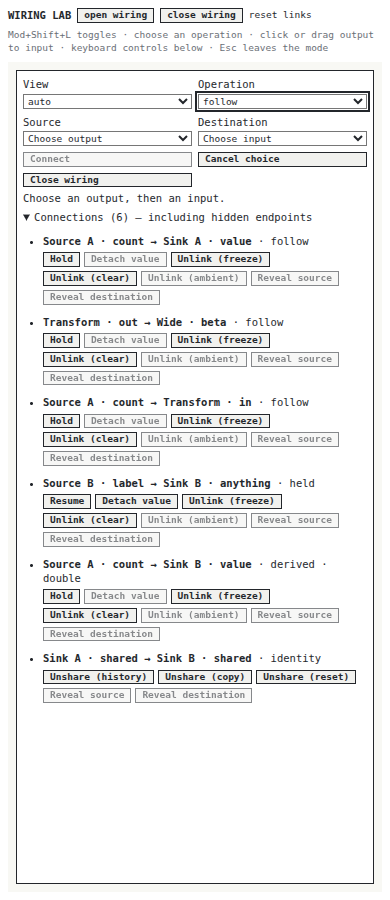
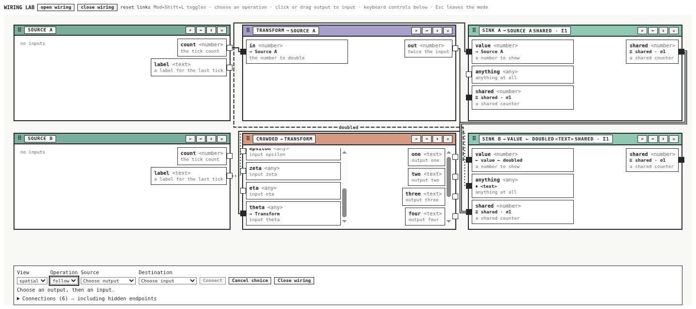

# Implemented wiring architecture and validation handoff

This document describes the implemented system, following the [refactoring design](04-wiring-scene-refactoring-architecture-and-intern-implementation-guide.md). Read the [original architecture review](03-intern-architecture-and-implementation-review-with-interactive-resize-evidence.md) for the old implementation and its measured failures. The proposal and original screenshots are historical evidence; the files and measurements below describe the replacement.

## What a user can do

Open wiring to inspect connections between application ports. Hover a port card to color its direct connections and the cards at their other ends. Hover a wire to color its endpoints; hover a tile background to inspect all connections touching that tile. The highlight changes color only. Existing borders and wire patterns retain their meaning. Keyboard focus offers the same connection inspection, with the normal focus indicator.

Choose Follow, Hold, Share, or Derive explicitly. Either click an output and then an input, drag an output to an input, or use the source and destination selects followed by Connect. The inspector lists all semantic relationships, including ones without visible endpoints. It offers the appropriate Hold/Resume, Detach, Unlink, and Unshare policies, with disabled actions explaining their refusal in a tooltip. Derive exposes the product's relation catalog. Product-specific actions appear through the detail slots rather than replacing the shell's controls.

When tiles become too narrow to contain readable port cards, automatic mode switches to a focused form and relationship list. The underlying applications remain mounted. A user may also choose spatial or focused presentation explicitly. Escape cancels an active source choice first; another Escape closes wiring. Closing restores focus to the invoking element when it still exists.

The controls use PBUI `Button` and `SelectInput` with compact `size="tiny"`, following the user's request for small buttons. There is no custom minimum button height. Styling follows [the app playbook, section 6a](../../../../../../docs/playbooks/building-a-new-hyperslop-systems-app-on-pbui.md): shared primitives, color and spacing tokens, and component folders containing their CSS module, index, and story.

## The important distinction: semantics and geometry

A connection is a durable semantic relationship. A wire is a temporary explanation of that relationship in one mounted surface. Removing a visible endpoint by scrolling it out of view does not remove the relationship. Resizing a divider does not change which port supplies a value. Conversely, a successful command changes the semantic document; the scene then explains the new document.

The semantic layer already supported atomic command batches. Hold now uses that facility directly:

```text
commands = [Follow(source, destination), Pin(destination)]
preview(commands)                   // advisory; may refuse
result = execute(commands)          // revalidates against current state
if result succeeds:
    clear source choice
else:
    retain source choice
    display result.because
```

The test deliberately tries Hold while the source has no value. Pin refuses, and the destination remains unbound: no intermediate Follow leaks out. After the source emits, the same command batch creates a held binding and publishes once. There is no separate UI transaction manager.

## File map for an intern

All paths in this table are relative to the repository root. Open them in this order.

| File | Responsibility |
|---|---|
| [packages/pbui-workbench/src/wiring/model.ts](../../../../../../packages/pbui-workbench/src/wiring/model.ts) | Points, rectangles, occurrence keys, immutable measured snapshots |
| [packages/pbui-workbench/src/wiring/geometryStore.ts](../../../../../../packages/pbui-workbench/src/wiring/geometryStore.ts) | Surface-owned registration, observation, clipping, and measurement publication |
| [packages/pbui-workbench/src/wiring/geometryContext.tsx](../../../../../../packages/pbui-workbench/src/wiring/geometryContext.tsx) | React subscriptions and exact registration cleanup |
| [packages/pbui-workbench/src/wiring/routing/validate.ts](../../../../../../packages/pbui-workbench/src/wiring/routing/validate.ts) | Independent geometric acceptance rules |
| [packages/pbui-workbench/src/wiring/routing/route.ts](../../../../../../packages/pbui-workbench/src/wiring/routing/route.ts) | Heading-aware A* on coordinate-line intersections |
| [packages/pbui-workbench/src/wiring/scene.ts](../../../../../../packages/pbui-workbench/src/wiring/scene.ts) | Logical relationships to mounted occurrences, routes, markers, labels |
| [packages/pbui-workbench/src/wiring/WiringCanvas/WiringCanvas.tsx](../../../../../../packages/pbui-workbench/src/wiring/WiringCanvas/WiringCanvas.tsx) | SVG rendering and ambiguous-hit candidate selection |
| [packages/pbui-workbench/src/wiring/FrameJacks/FrameJacks.tsx](../../../../../../packages/pbui-workbench/src/wiring/FrameJacks/FrameJacks.tsx) | Frame-owned endpoint controls from measured geometry |
| [packages/pbui-workbench/src/wiring/connectionCommands.ts](../../../../../../packages/pbui-workbench/src/wiring/connectionCommands.ts) | Follow/Hold/Share/Derive command construction |
| [packages/pbui-workbench/src/wiring/connectionController.tsx](../../../../../../packages/pbui-workbench/src/wiring/connectionController.tsx) | Selection, pointer capture, release hit testing, refusal recovery, Escape |
| [packages/pbui-workbench/src/wiring/ConnectionInspector/ConnectionInspector.tsx](../../../../../../packages/pbui-workbench/src/wiring/ConnectionInspector/ConnectionInspector.tsx) | Accessible controls, inventory, relationship actions and product slots |
| [packages/pbui-workbench/src/wiring/layoutPolicy.ts](../../../../../../packages/pbui-workbench/src/wiring/layoutPolicy.ts) | Recursive minimum sizes and return hysteresis |
| [packages/pbui-workbench/src/wiring/connectedHighlight.ts](../../../../../../packages/pbui-workbench/src/wiring/connectedHighlight.ts) | Surface-local, one-hop hover/focus highlighting without rerouting |
| [packages/workbench-core/src/links/collaborator.ts](../../../../../../packages/workbench-core/src/links/collaborator.ts) | Stable per-document link snapshots, including speculative previews |
| [src/chrome/TileFrame.tsx](../../../../../../src/chrome/TileFrame.tsx) | Structural separation of application scrolling and frame overlays |

The three visual wiring components have local stories that mount a complete surface, because a jack or wire depends on surface geometry and cannot honestly be demonstrated as an isolated painted shape. The two context/provider modules are infrastructure rather than standalone visual components. Repository component checks explicitly recognize that distinction, as they already do for the existing workbench context.

## Geometry ownership and lifecycle

Every mounted surface creates its own geometry store. A key identifies a particular placement, logical port, and side; duplicate placements of the same view therefore receive distinct anchor occurrences. A registration returns a disposer carrying an ownership token. Cleanup from an older registration cannot remove a newer replacement using the same key.

The store observes the root, tile frames, and registered cards. Resize and captured scroll events invalidate the snapshot and schedule one animation-frame measurement. Measurements use the surface padding-box origin, including its border offset. Card visibility is the intersection of its rectangle, the surface bounds, and clipping ancestors. An anchor whose center is outside that intersection does not produce a definitive wire.

```text
layout/scroll/registration change
    -> invalidate geometry; mark pending
    -> measure root, frames, cards and clip rectangles
    -> compare geometric signature
    -> publish immutable snapshot
    -> project and validate scene
    -> paint jacks, accepted paths, labels and hit regions
```

Jacks are siblings of the content scrollport, inside the tile frame overlay. Horizontal decoration therefore cannot enlarge the rail's scrollable content. The surface also allocates actual outer routing space and uses a bounded scrim. These structural choices address the original scrollbar issue at its source.

## Routing from computer-science fundamentals

Routing is a constrained shortest-path problem. Obstacles are expanded by the clearance margin. Candidate x coordinates come from endpoints, attachment stubs, obstacle boundaries, and outer bounds; y coordinates come from endpoints, obstacle boundaries, and bounds. Midpoints between adjacent coordinate lines supply alternative corridor positions. Their intersections form a finite graph. Adjacent horizontal or vertical vertices connect only when the segment avoids every expanded obstacle.

Search state is `(vertex, arrival heading)`, not merely `vertex`. The same location reached horizontally and vertically can have different future turn costs. A* uses Manhattan distance as its remaining-distance lower bound, while actual edge cost includes distance, bend cost, and nonnegative occupied-collinear-length penalties. Immediate reversal is disallowed. The first and last directions must satisfy the endpoint normals.

```text
inflate obstacles by clearance
construct finite coordinate arrangement
for each adjacent coordinate intersection:
    add edge only if analytically collision-free
search states (vertex, heading) with A*
simplify the reconstructed polyline
validate exact endpoints, normals, bounds and every final segment
return Valid(polyline) or Unresolved(reason)
```

The default policy uses 3.5px obstacle clearance and a 24px bend cost. Graph allocation is capped at 60,000 vertices and search expansion at 160,000 states. If the problem exceeds those budgets, the answer is unresolved. The implementation never manufactures a diagonal fallback or pretends that an invisible endpoint was found.

With X x-coordinates and Y y-coordinates, the arrangement contains at most X·Y vertices and four heading states per vertex. Building collision-free edges also depends on the number of obstacles and previously occupied wire segments. This is suitable for the measured small workbench scenes, but it is not a claim of constant-time routing. A larger workload should be profiled before raising budgets or choosing a sparse graph, worker, or incremental solver.

Previous occurrence choices remain stable while their source is still mounted. A previous route can be reattached and retained only after revalidation and only within a small geometric-cost tolerance. Routing order is stable. Occupied-corridor penalties encourage separation; the system does not claim a globally optimal joint lane assignment for every edge.

For the theoretical background, use the primary-source archive already collected with this ticket: [orthogonal connector routing](https://users.monash.edu/~mwybrow/papers/wybrow-gd-2009.pdf), [interactive connector routing](https://users.monash.edu/~mwybrow/papers/wybrow-gd-2005.pdf), and the [foundations section and downloaded-source inventory](03-intern-architecture-and-implementation-review-with-interactive-resize-evidence.md). These explain why obstacle avoidance, bend minimization, dynamic layout stability, and path validation are distinct responsibilities.

## Why preview snapshot identity mattered

The first atomic Hold UI test uncovered an external-store identity bug. The link collaborator originally cached only its most recently requested document. A batch preview constructs speculative documents; asking for their snapshots replaced the cache entry for the live document. React's next `getSnapshot()` call then received a different object despite no live document change. Render-time previews repeated this cycle until React reported `Maximum update depth exceeded`.

The collaborator now keeps weakly keyed entries by document, with runtime revision and document revision attached to each entry. A speculative document does not evict the live document's snapshot. Unreferenced speculative documents remain collectible. Preview refusal also no longer invokes the execution-refusal observer, so merely rendering disabled actions does not produce command-refusal logging.

This illustrates a useful principle: read-only semantics are insufficient for an external-store API. Its observable identity must also remain stable between actual changes. The relevant contract is documented by [React's useSyncExternalStore reference](https://react.dev/reference/react/useSyncExternalStore).

## Interaction and API changes

The previous global port-carry registry and renderer wrappers were deleted. The surface exposes one customization object:

```typescript
interface WiringOptions {
  mode?: "auto" | "spatial" | "focused";
  renderPortDetails?(port: PortRef): ReactNode;
  renderRelationDetails?(link: LinkRef): ReactNode;
}
```

`renderPortDetails` adds product information or actions alongside the shell-owned port button. `renderRelationDetails` adds product actions in the relationship inspector. Ecommerce now uses these slots for its existing Presentation actions. No adapter preserves the old `renderPort(port, node)` or `renderWire(link, node)` API.

Pointer capture begins after a movement threshold so a normal click still reaches its native button. Release resolves the actual element under the current pointer coordinates and verifies ownership by the current surface. Moving away from a valid destination before release cannot commit to an old hover target. Overlapping SVG hit strokes are resolved by measuring distance to all accepted paths and presenting the nearby relationship candidates, rather than silently relying on paint order.

Hover inspection is deliberately cheaper than layout. Given seed ports S, it selects only edges incident to S, then colors those edges and their endpoints. It does not traverse the entire reachable graph and does not change geometry or route coordinates.

## Resizing and focused mode

The initial readable tile policy is 280×180px. Split minima include their declared ratios: if a branch receives only one quarter of the available width, it needs four times its required leaf width at the parent. Gutters and space for controls are included. Returning from focused to spatial requires another 32px, preventing repeated switching near a boundary.

Focused mode uses a stable, bounded tree wrapper that becomes hidden and inert while the inspector occupies the surface. It preserves application component instances and input values. Source choice survives a mode change, while active dragging is cancelled. A dedicated mount test repeatedly toggles wiring and focused/spatial presentation, asserting one mount, no intermediate unmount, and the same input DOM instance.

## Validation evidence

The full affected suites passed: PBUI 859 tests, workbench core 250, workbench UI 132, and ecommerce 35, totaling 1,276. All four packages built. The first concurrent root run exceeded the existing 5-second timeout in an unrelated seeded help-machine fuzz test; running the root suite without concurrent package-suite load passed all 859 tests without changing the timeout.

The [reproducible Playwright capture](../scripts/11-final-browser-capture.js) and [full numeric results](review-assets/refactor-final-metrics.json) cover 1920, 1440, 1024, 768 and 390px. The three spatial sizes showed six valid routes each, zero diagonals, zero tile-interior collisions, and endpoint discrepancies of 0.0078125px from browser subpixel positioning. Final measured scene projection times were 1.3ms, 1.1ms and 1.3ms respectively. These are individual browser samples, not percentile latency or a benchmark for arbitrary graph sizes. The two narrow sizes used focused mode. Document width equalled viewport width at every size.

Additional browser interaction verified click creation, pointer-drag creation, a 390px keyboard Hold, refusal for an empty source, Escape cancellation/close, divider dragging, and port-column scrolling. In the crowded story, a hidden endpoint produced five valid routes and one unresolved relation; scrolling the endpoint into view produced six valid routes. The scrolled rail did not create page overflow.







The [1920px](review-assets/refactor-final-1920.png), [1024px](review-assets/refactor-final-1024.png), and [768px](review-assets/refactor-final-768.png) captures are stored alongside these images. Earlier hover screenshots record intermediate styles; the user's final preference is color-only, with no added hover outline or stroke thickness.

## Review boundaries and future measurements

The implementation deliberately retains SVG. The routing engine is independent of the renderer, so changing to Canvas would not fix clipping, endpoint ownership, or command semantics. Canvas would add manual hit testing and accessibility work for this workload.

Labels are measured using the surface font token and placed on accepted horizontal segments that fit their bounds and avoid tile frames. When a label cannot fit, its full relation description remains in the inspector. The implementation does not claim optimal multi-label packing or globally optimal multi-wire routing. Focused controls use the compact sizing requested by the user; future touch-oriented presentation can choose different control density explicitly.

Before expanding the supported workload, measure dense graphs, fonts and longer translated labels, duplicate placements, multiple independently mounted surfaces, and repeated mode transitions. The current regression tests cover geometry-store isolation and duplicate occurrence projection, while the recorded browser corpus concentrates on the real six-tile lab and crowded rail. This distinction matters: passing an isolated ownership test is not the same as capturing every multi-surface browser combination.
